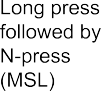

> 

Matter Application Cluster

> Specification Version 1.4.1
>
> Copyright © 2022-2025 Connectivity Standards Alliance, Inc. 508 Second Street, Suite 109B Davis, CA 95616 - USA [www.csa-iot.org](http://www.csa-iot.org/)
>
> All rights reserved.
>
> Permission is granted to members of the Connectivity Standards Alliance to reproduce this document for their own use or the use of other Connectivity Standards Alliance members only, provided this notice is included. All other rights reserved. Duplication for sale, or for commercial or for-profit use is strictly prohibited without the prior written consent of the Connectivity Standards Alliance.
>
> Matter Application Clusters
>
> Version 1.4.1, 2025-03-12 06:42:16 -0700: Approved

# Copyright Notice, License and Disclaimer

> Copyright © Connectivity Standards Alliance (2021-2023). All rights reserved. The information within this document is the property of the Connectivity Standards Alliance and its use and disclo­ sure are restricted, except as expressly set forth herein.
>
> Connectivity Standards Alliance hereby grants you a fully-paid, non-exclusive, nontransferable, worldwide, limited and revocable license (without the right to sublicense), under Connectivity Stan­ dards Alliance’s applicable copyright rights, to view, download, save, reproduce and use the docu­ ment solely for your own internal purposes and in accordance with the terms of the license set forth herein. This license does not authorize you to, and you expressly warrant that you shall not:
>
> \(a\) permit others (outside your organization) to use this document; (b) post or publish this docu­ ment; (c) modify, adapt, translate, or otherwise change this document in any manner or create any derivative work based on this document; (d) remove or modify any notice or label on this docu­ ment, including this Copyright Notice, License and Disclaimer. The Connectivity Standards Alliance does not grant you any license hereunder other than as expressly stated herein.
>
> Elements of this document may be subject to third party intellectual property rights, including without limitation, patent, copyright or trademark rights, and any such third party may or may not be a member of the Connectivity Standards Alliance. Connectivity Standards Alliance members grant other Connectivity Standards Alliance members certain intellectual property rights as set forth in the Connectivity Standards Alliance IPR Policy. Connectivity Standards Alliance members do not grant you any rights under this license. The Connectivity Standards Alliance is not responsi­ ble for, and shall not be held responsible in any manner for, identifying or failing to identify any or all such third party intellectual property rights. Please visit [www.csa-iot.org](http://www.csa-iot.org/) for more information on how to become a member of the Connectivity Standards Alliance.
>
> This document and the information contained herein are provided on an “AS IS” basis and the Con­ nectivity Standards Alliance DISCLAIMS ALL WARRANTIES EXPRESS OR IMPLIED, INCLUDING BUT NOT LIMITED TO (A) ANY WARRANTY THAT THE USE OF THE INFORMATION HEREIN WILL NOT INFRINGE ANY RIGHTS OF THIRD PARTIES (INCLUDING WITHOUT LIMITATION ANY INTELLEC­ TUAL PROPERTY RIGHTS INCLUDING PATENT, COPYRIGHT OR TRADEMARK RIGHTS); OR (B) ANY IMPLIED WARRANTIES OF MERCHANTABILITY, FITNESS FOR A PARTICULAR PURPOSE, TITLE OR NONINFRINGEMENT. IN NO EVENT WILL THE CONNECTIVITY STANDARDS ALLIANCE BE LIABLE FOR ANY LOSS OF PROFITS, LOSS OF BUSINESS, LOSS OF USE OF DATA, INTERRUPTION OF BUSI­ NESS, OR FOR ANY OTHER DIRECT, INDIRECT, SPECIAL OR EXEMPLARY, INCIDENTAL, PUNITIVE OR CONSEQUENTIAL DAMAGES OF ANY KIND, IN CONTRACT OR IN TORT, IN CONNECTION WITH THIS DOCUMENT OR THE INFORMATION CONTAINED HEREIN, EVEN IF ADVISED OF THE POSSIBILITY OF SUCH LOSS OR DAMAGE.
>
> All company, brand and product names in this document may be trademarks that are the sole prop­ erty of their respective owners.
>
> This notice and disclaimer must be included on all copies of this document.
>
> Connectivity Standards Alliance 508 Second Street, Suite 206 Davis, CA 95616, USA

# Revision History

| **Revision** | **Date**           | **Details**   | **Editor**      |
|--------------|--------------------|---------------|-----------------|
| 1            | September 23, 2022 | Version 1.0   | Robert Szewczyk |
| 2            | May 17, 2023       | Version 1.1   | Robert Szewczyk |
| 3            | October 18, 2023   | Version 1.2   | Robert Szewczyk |
| 4            | April 17, 2024     | Version 1.3   | Robert Szewczyk |
| 5            | November 4, 2024   | Version 1.4   | Robert Szewczyk |
| 6            | March 17, 2024     | Version 1.4.1 | Robert Szewczyk |

> **Table of Contents**

[Copyright Notice, License and Disclaimer](#copyright-notice-license-and-disclaimer) [1](#copyright-notice-license-and-disclaimer)

[Revision History](#revision-history) [3](#revision-history)

[Introduction](#introduction) [21](#introduction)

[Scope and Purpose](#scope-and-purpose) [21](#scope-and-purpose)

[References](#references) [21](#references)

[CSA Reference Documents](#csa-reference-documents) [21](#csa-reference-documents)

[External Reference Documents](#external-reference-documents) [22](#external-reference-documents)

[Provisional](#provisional) [23](#provisional)

[List of Provisional Items](#list-of-provisional-items) [23](#list-of-provisional-items)

1.  [General](#chapter-1.-general) [25](#chapter-1.-general)

    1.  [General Description](#general-description) [25](#general-description)

        1.  [Introduction](#introduction-1) [25](#introduction-1)

        2.  [Cluster List](#cluster-list) [25](#cluster-list)

    2.  [Identify Cluster](#identify-cluster) [26](#identify-cluster)

        1.  [Revision History](#revision-history-1) [27](#revision-history-1)

        2.  [Classification](#classification) [27](#classification)

        3.  [Cluster ID](#cluster-id) [27](#cluster-id)

        4.  [Data Types](#data-types) [27](#data-types)

        5.  [Attributes](#attributes) [29](#attributes)

        6.  [Commands](#commands) [29](#commands)

    3.  [Groups Cluster](#groups-cluster) [31](#groups-cluster)

        1.  [Revision History](#revision-history-2) [31](#revision-history-2)

        2.  [Classification](#classification-1) [31](#classification-1)

        3.  [Cluster ID](#cluster-id-1) [31](#cluster-id-1)

        4.  [Features](#features) [31](#features)

        5.  [Data Types](#data-types-1) [32](#data-types-1)

        6.  [Attributes](#attributes-1) [32](#attributes-1)

        7.  [Commands](#commands-1) [32](#commands-1)

    4.  [Scenes Management Cluster](#scenes-management-cluster) [39](#scenes-management-cluster)

        1.  [Revision History](#revision-history-3) [40](#revision-history-3)

        2.  [Classification](#classification-2) [40](#classification-2)

        3.  [Cluster ID](#cluster-id-2) [40](#cluster-id-2)

        4.  [Features](#features-1) [40](#features-1)

        5.  [Dependencies](#dependencies) [41](#dependencies)

        6.  [Handling of fabric-scoping](#handling-of-fabric-scoping) [41](#handling-of-fabric-scoping)

        7.  [Data Types](#data-types-2) [41](#data-types-2)

        8.  [Attributes](#attributes-2) [47](#attributes-2)

        9.  [Commands](#commands-2) [47](#commands-2)

    5.  [On/Off Cluster](#onoff-cluster) [60](#onoff-cluster)

        1.  [Revision History](#revision-history-4) [60](#revision-history-4)

        2.  [Classification](#classification-3) [61](#classification-3)

        3.  [Cluster ID](#cluster-id-3) [61](#cluster-id-3)

        4.  [Features](#features-2) [61](#features-2)

        5.  [Data Types](#data-types-3) [62](#data-types-3)

        6.  [Attributes](#attributes-3) [64](#attributes-3)

        7.  [Commands](#commands-3) [66](#commands-3)

        8.  [State Description](#state-description) [69](#state-description)

    6.  [Level Control Cluster](#level-control-cluster) [70](#level-control-cluster)

        1.  [Revision History](#revision-history-5) [70](#revision-history-5)

        2.  [Classification](#classification-4) [71](#classification-4)

        3.  [Cluster ID](#cluster-id-4) [71](#cluster-id-4)

        4.  [Features](#features-3) [71](#features-3)

        5.  [Data Types](#data-types-4) [74](#data-types-4)

        6.  [Attributes](#attributes-4) [74](#attributes-4)

        7.  [Commands](#commands-4) [79](#commands-4)

        8.  [State Change Table for Lighting](#state-change-table-for-lighting) [83](#state-change-table-for-lighting)

    7.  [Boolean State Cluster](#boolean-state-cluster) [85](#boolean-state-cluster)

        1.  [Revision History](#revision-history-6) [85](#revision-history-6)

        2.  [Classification](#classification-5) [85](#classification-5)

        3.  [Cluster ID](#cluster-id-5) [85](#cluster-id-5)

        4.  [Attributes](#attributes-5) [85](#attributes-5)

        5.  [Events](#events) [86](#events)

    8.  [Boolean State Configuration Cluster](#boolean-state-configuration-cluster) [86](#boolean-state-configuration-cluster)

        1.  [Revision History](#revision-history-7) [86](#revision-history-7)

        2.  [Classification](#classification-6) [86](#classification-6)

        3.  [Cluster ID](#cluster-id-6) [87](#cluster-id-6)

        4.  [Features](#features-4) [87](#features-4)

        5.  [Data Types](#data-types-5) [87](#data-types-5)

        6.  [Attributes](#attributes-6) [88](#attributes-6)

        7.  [Commands](#commands-5) [90](#commands-5)

        8.  [Events](#events-1) [91](#events-1)

    9.  [Mode Select Cluster](#mode-select-cluster) [92](#mode-select-cluster)

        1.  [Revision History](#revision-history-8) [93](#revision-history-8)

        2.  [Classification](#classification-7) [93](#classification-7)

        3.  [Cluster ID](#cluster-id-7) [93](#cluster-id-7)

        4.  [Features](#features-5) [93](#features-5)

        5.  [Data Types](#data-types-6) [94](#data-types-6)

        6.  [Attributes](#attributes-7) [95](#attributes-7)

        7.  [Commands](#commands-6) [97](#commands-6)

    10. [Mode Base Cluster](#mode-base-cluster) [97](#mode-base-cluster)

        1.  [Revision History](#revision-history-9) [98](#revision-history-9)

        2.  [Classification](#classification-8) [98](#classification-8)

        3.  [Cluster ID](#cluster-id-8) [98](#cluster-id-8)

        4.  [Features](#features-6) [98](#features-6)

        5.  [Data Types](#data-types-7) [98](#data-types-7)

        6.  [Attributes](#attributes-8) [100](#attributes-8)

        7.  [Commands](#commands-7) [102](#commands-7)

        8.  [Mode Namespace](#mode-namespace) [104](#mode-namespace)

    11. [Low Power Cluster](#low-power-cluster) [106](#low-power-cluster)

        1.  [Revision History](#revision-history-10) [106](#revision-history-10)

        2.  [Classification](#classification-9) [106](#classification-9)

        3.  [Cluster ID](#cluster-id-9) [106](#cluster-id-9)

        4.  [Commands](#commands-8) [107](#commands-8)

    12. [Wake On LAN Cluster](#wake-on-lan-cluster) [107](#wake-on-lan-cluster)

        1.  [Revision History](#revision-history-11) [107](#revision-history-11)

        2.  [Classification](#classification-10) [107](#classification-10)

        3.  [Cluster ID](#cluster-id-10) [108](#cluster-id-10)

        4.  [Attributes](#attributes-9) [108](#attributes-9)

    13. [Switch Cluster](#switch-cluster) [108](#switch-cluster)

        1.  [Revision History](#revision-history-12) [109](#revision-history-12)

        2.  [Classification](#classification-11) [109](#classification-11)

        3.  [Cluster ID](#cluster-id-11) [109](#cluster-id-11)

        4.  [Features](#features-7) [109](#features-7)

        5.  [Attributes](#attributes-10) [110](#attributes-10)

        6.  [Events](#events-2) [112](#events-2)

        7.  [Sequence of generated events](#sequence-of-generated-events) [116](#sequence-of-generated-events)

        8.  [Sequence of events for MultiPress](#sequence-of-events-for-multipress) [119](#sequence-of-events-for-multipress)

        9.  [Summary of cases for MS feature flag](#summary-of-cases-for-ms-feature-flag) [123](#summary-of-cases-for-ms-feature-flag)

        10. [Multi Position Details](#multi-position-details) [124](#multi-position-details)

    14. [Operational State Cluster](#operational-state-cluster) [127](#operational-state-cluster)

        1.  [Revision History](#revision-history-13) [127](#revision-history-13)

        2.  [Classification](#classification-12) [128](#classification-12)

        3.  [Cluster ID](#cluster-id-12) [128](#cluster-id-12)

        4.  [Data Types](#data-types-8) [128](#data-types-8)

        5.  [Attributes](#attributes-11) [131](#attributes-11)

        6.  [Commands](#commands-9) [133](#commands-9)

        7.  [Events](#events-3) [136](#events-3)

    15. [Alarm Base Cluster](#alarm-base-cluster) [138](#alarm-base-cluster)

        1.  [Revision History](#revision-history-14) [138](#revision-history-14)

        2.  [Classification](#classification-13) [138](#classification-13)

        3.  [Cluster ID](#cluster-id-13) [138](#cluster-id-13)

        4.  [Features](#features-8) [138](#features-8)

        5.  [Data Types](#data-types-9) [139](#data-types-9)

        6.  [Attributes](#attributes-12) [139](#attributes-12)

        7.  [Commands](#commands-10) [139](#commands-10)

        8.  [Events](#events-4) [141](#events-4)

    16. [Messages Cluster](#messages-cluster) [141](#messages-cluster)

        1.  [Revision History](#revision-history-15) [142](#revision-history-15)

        2.  [Classification](#classification-14) [142](#classification-14)

        3.  [Cluster ID](#cluster-id-14) [142](#cluster-id-14)

        4.  [Features](#features-9) [142](#features-9)

        5.  [Data Types](#data-types-10) [143](#data-types-10)

        6.  [Attributes](#attributes-13) [146](#attributes-13)

        7.  [Commands](#commands-11) [147](#commands-11)

        8.  [Events](#events-5) [149](#events-5)

    17. [Service Area Cluster](#service-area-cluster) [151](#service-area-cluster)

        1.  [Revision History](#revision-history-16) [151](#revision-history-16)

        2.  [Classification](#classification-15) [151](#classification-15)

        3.  [Cluster ID](#cluster-id-15) [151](#cluster-id-15)

        4.  [Features](#features-10) [152](#features-10)

        5.  [Data Types](#data-types-11) [152](#data-types-11)

        6.  [Attributes](#attributes-14) [158](#attributes-14)

        7.  [Commands](#commands-12) [163](#commands-12)

2.  [Measurement and Sensing](#chapter-2.-measurement-and-sensing) [167](#chapter-2.-measurement-and-sensing)

    1.  [General Description](#general-description-1) [167](#general-description-1)

        1.  [Introduction](#introduction-2) [167](#introduction-2)

        2.  [Cluster List](#cluster-list-1) [167](#cluster-list-1)

        3.  [Measured Value](#measured-value) [168](#measured-value)

        4.  [Measurement Accuracy](#measurement-accuracy) [168](#measurement-accuracy)

    2.  [Illuminance Measurement Cluster](#illuminance-measurement-cluster) [173](#illuminance-measurement-cluster)

        1.  [Revision History](#revision-history-17) [173](#revision-history-17)

        2.  [Classification](#classification-16) [173](#classification-16)

        3.  [Cluster ID](#cluster-id-16) [173](#cluster-id-16)

        4.  [Data Types](#data-types-12) [173](#data-types-12)

        5.  [Attributes](#attributes-15) [174](#attributes-15)

    3.  [Temperature Measurement Cluster](#temperature-measurement-cluster) [175](#temperature-measurement-cluster)

        1.  [Revision History](#revision-history-18) [175](#revision-history-18)

        2.  [Classification](#classification-17) [175](#classification-17)

        3.  [Cluster ID](#cluster-id-17) [175](#cluster-id-17)

        4.  [Attributes](#attributes-16) [176](#attributes-16)

    4.  [Pressure Measurement Cluster](#pressure-measurement-cluster) [176](#pressure-measurement-cluster)

        1.  [Revision History](#revision-history-19) [177](#revision-history-19)

        2.  [Classification](#classification-18) [177](#classification-18)

        3.  [Cluster ID](#cluster-id-18) [177](#cluster-id-18)

        4.  [Features](#features-11) [177](#features-11)

        5.  [Attributes](#attributes-17) [177](#attributes-17)

    5.  [Flow Measurement Cluster](#flow-measurement-cluster) [179](#flow-measurement-cluster)

        1.  [Revision History](#revision-history-20) [179](#revision-history-20)

        2.  [Classification](#classification-19) [180](#classification-19)

        3.  [Cluster ID](#cluster-id-19) [180](#cluster-id-19)

        4.  [Attributes](#attributes-18) [180](#attributes-18)

    6.  [Water Content Measurement Clusters](#water-content-measurement-clusters) [181](#water-content-measurement-clusters)

        1.  [Revision History](#revision-history-21) [181](#revision-history-21)

        2.  [Classification](#classification-20) [181](#classification-20)

        3.  [Cluster ID](#cluster-id-20) [181](#cluster-id-20)

        4.  [Attributes](#attributes-19) [181](#attributes-19)

    7.  [Occupancy Sensing Cluster](#occupancy-sensing-cluster) [182](#occupancy-sensing-cluster)

        1.  [Revision History](#revision-history-22) [183](#revision-history-22)

        2.  [Classification](#classification-21) [183](#classification-21)

        3.  [Cluster ID](#cluster-id-21) [184](#cluster-id-21)

        4.  [Features](#features-12) [184](#features-12)

        5.  [Data Types](#data-types-13) [184](#data-types-13)

        6.  [Attributes](#attributes-20) [186](#attributes-20)

        7.  [Events](#events-6) [192](#events-6)

    8.  [Resource Monitoring Clusters](#resource-monitoring-clusters) [192](#resource-monitoring-clusters)

        1.  [Revision History](#revision-history-23) [193](#revision-history-23)

        2.  [Classification](#classification-22) [193](#classification-22)

        3.  [Cluster IDs](#cluster-ids) [193](#cluster-ids)

        4.  [Features](#features-13) [193](#features-13)

        5.  [Data Types](#data-types-14) [194](#data-types-14)

        6.  [Attributes](#attributes-21) [195](#attributes-21)

        7.  [Commands](#commands-13) [196](#commands-13)

    9.  [Air Quality Cluster](#air-quality-cluster) [197](#air-quality-cluster)

        1.  [Revision History](#revision-history-24) [197](#revision-history-24)

        2.  [Classification](#classification-23) [197](#classification-23)

        3.  [Cluster ID](#cluster-id-22) [197](#cluster-id-22)

        4.  [Features](#features-14) [197](#features-14)

        5.  [Data Types](#data-types-15) [198](#data-types-15)

        6.  [Attributes](#attributes-22) [198](#attributes-22)

    10. [Concentration Measurement Clusters](#concentration-measurement-clusters) [198](#concentration-measurement-clusters)

        1.  [Revision History](#revision-history-25) [198](#revision-history-25)

        2.  [Classification](#classification-24) [199](#classification-24)

        3.  [Cluster IDs](#cluster-ids-1) [199](#cluster-ids-1)

        4.  [Features](#features-15) [200](#features-15)

        5.  [Data Types](#data-types-16) [200](#data-types-16)

        6.  [Attributes](#attributes-23) [201](#attributes-23)

    11. [Smoke CO Alarm Cluster](#smoke-co-alarm-cluster) [204](#smoke-co-alarm-cluster)

        1.  [Revision History](#revision-history-26) [204](#revision-history-26)

        2.  [Classification](#classification-25) [204](#classification-25)

        3.  [Cluster ID](#cluster-id-23) [204](#cluster-id-23)

        4.  [Features](#features-16) [204](#features-16)

        5.  [Data Types](#data-types-17) [204](#data-types-17)

        6.  [Attributes](#attributes-24) [208](#attributes-24)

        7.  [Commands](#commands-14) [211](#commands-14)

        8.  [Events](#events-7) [211](#events-7)

    12. [Electrical Energy Measurement Cluster](#electrical-energy-measurement-cluster) [214](#electrical-energy-measurement-cluster)

        1.  [Revision History](#revision-history-27) [214](#revision-history-27)

        2.  [Classification](#classification-26) [214](#classification-26)

        3.  [Cluster ID](#cluster-id-24) [214](#cluster-id-24)

        4.  [Features](#features-17) [214](#features-17)

        5.  [Data Types](#data-types-18) [215](#data-types-18)

        6.  [Attributes](#attributes-25) [219](#attributes-25)

        7.  [Events](#events-8) [221](#events-8)

    13. [Electrical Power Measurement Cluster](#electrical-power-measurement-cluster) [222](#electrical-power-measurement-cluster)

        1.  [Revision History](#revision-history-28) [222](#revision-history-28)

        2.  [Classification](#classification-27) [222](#classification-27)

        3.  [Cluster ID](#cluster-id-25) [222](#cluster-id-25)

        4.  [Features](#features-18) [222](#features-18)

        5.  [Data Types](#data-types-19) [223](#data-types-19)

        6.  [Attributes](#attributes-26) [227](#attributes-26)

        7.  [Events](#events-9) [233](#events-9)

3.  [Lighting](#chapter-3.-lighting) [235](#chapter-3.-lighting)

    1.  [General Description](#general-description-2) [235](#general-description-2)

        1.  [Introduction](#introduction-3) [235](#introduction-3)

        2.  [Terms](#terms) [235](#terms)

        3.  [Cluster List](#cluster-list-2) [235](#cluster-list-2)

    2.  [Color Control Cluster](#color-control-cluster) [235](#color-control-cluster)

        1.  [Revision History](#revision-history-29) [236](#revision-history-29)

        2.  [Classification](#classification-28) [236](#classification-28)

        3.  [Cluster ID](#cluster-id-26) [236](#cluster-id-26)

        4.  [Features](#features-19) [236](#features-19)

        5.  [Dependencies](#dependencies-1) [237](#dependencies-1)

        6.  [Data Types](#data-types-20) [238](#data-types-20)

[3.2.8. Commands](#commands-15) [254](#commands-15)

3.  [Ballast Configuration Cluster](#ballast-configuration-cluster) [277](#ballast-configuration-cluster)

    1.  [Revision History](#revision-history-30) [277](#revision-history-30)

    2.  [Classification](#classification-29) [277](#classification-29)

    3.  [Cluster ID](#cluster-id-27) [278](#cluster-id-27)

    4.  [Dependencies](#dependencies-2) [278](#dependencies-2)

    5.  [Data Types](#data-types-21) [278](#data-types-21)

    6.  [Attributes](#attributes-28) [279](#attributes-28)

    7.  [The Dimming Light Curve](#the-dimming-light-curve) [282](#the-dimming-light-curve)

&nbsp;

4.  [HVAC](#chapter-4.-hvac) [285](#chapter-4.-hvac)

    1.  [General Description](#general-description-3) [285](#general-description-3)

        1.  [Introduction](#introduction-4) [285](#introduction-4)

        2.  [Terms](#terms-1) [285](#terms-1)

        3.  [Cluster List](#cluster-list-3) [285](#cluster-list-3)

    2.  [Pump Configuration and Control Cluster](#pump-configuration-and-control-cluster) [285](#pump-configuration-and-control-cluster)

        1.  [Revision History](#revision-history-31) [286](#revision-history-31)

        2.  [Classification](#classification-30) [286](#classification-30)

        3.  [Cluster ID](#cluster-id-28) [286](#cluster-id-28)

        4.  [Features](#features-20) [286](#features-20)

        5.  [Dependencies](#dependencies-3) [287](#dependencies-3)

        6.  [Data Types](#data-types-22) [287](#data-types-22)

        7.  [Attributes](#attributes-29) [291](#attributes-29)

        8.  [Events](#events-10) [298](#events-10)

    3.  [Thermostat Cluster](#thermostat-cluster) [299](#thermostat-cluster)

        1.  [Revision History](#revision-history-32) [299](#revision-history-32)

        2.  [Classification](#classification-31) [300](#classification-31)

        3.  [Cluster ID](#cluster-id-29) [300](#cluster-id-29)

        4.  [Features](#features-21) [300](#features-21)

        5.  [Units of Temperature](#units-of-temperature) [301](#units-of-temperature)

        6.  [Setpoint Limits](#setpoint-limits) [302](#setpoint-limits)

        7.  [Dependencies](#dependencies-4) [302](#dependencies-4)

        8.  [Data Types](#data-types-23) [303](#data-types-23)

        9.  [Attributes](#attributes-30) [320](#attributes-30)

        10. [Commands](#commands-16) [340](#commands-16)

    4.  [Fan Control Cluster](#fan-control-cluster) [348](#fan-control-cluster)

        1.  [Revision History](#revision-history-33) [348](#revision-history-33)

        2.  [Classification](#classification-32) [348](#classification-32)

        3.  [Cluster ID](#cluster-id-30) [348](#cluster-id-30)

        4.  [Features](#features-22) [348](#features-22)

        5.  [Data Types](#data-types-24) [349](#data-types-24)

        6.  [Attributes](#attributes-31) [351](#attributes-31)

        7.  [Commands](#commands-17) [356](#commands-17)

    5.  [Thermostat User Interface Configuration Cluster](#thermostat-user-interface-configuration-cluster) [357](#thermostat-user-interface-configuration-cluster)

        1.  [Revision History](#revision-history-34) [357](#revision-history-34)

        2.  [Classification](#classification-33) [357](#classification-33)

        3.  [Cluster ID](#cluster-id-31) [357](#cluster-id-31)

        4.  [Conversion of Temperature Values for Display](#conversion-of-temperature-values-for-display) [357](#conversion-of-temperature-values-for-display)

        5.  [Data Types](#data-types-25) [357](#data-types-25)

        6.  [Attributes](#attributes-32) [359](#attributes-32)

    6.  [Valve Configuration and Control Cluster](#valve-configuration-and-control-cluster) [359](#valve-configuration-and-control-cluster)

        1.  [Revision History](#revision-history-35) [359](#revision-history-35)

        2.  [Classification](#classification-34) [360](#classification-34)

        3.  [Cluster ID](#cluster-id-32) [360](#cluster-id-32)

        4.  [Features](#features-23) [360](#features-23)

        5.  [Data Types](#data-types-26) [360](#data-types-26)

        6.  [Status Codes](#status-codes) [361](#status-codes)

        7.  [Attributes](#attributes-33) [361](#attributes-33)

        8.  [Commands](#commands-18) [365](#commands-18)

        9.  [Events](#events-11) [367](#events-11)

5.  [Closures](#chapter-5.-closures) [369](#chapter-5.-closures)

    1.  [General Description](#general-description-4) [369](#general-description-4)

        1.  [Introduction](#introduction-5) [369](#introduction-5)

        2.  [Cluster List](#cluster-list-4) [369](#cluster-list-4)

    2.  [Door Lock Cluster](#door-lock-cluster) [369](#door-lock-cluster)

        1.  [Revision History](#revision-history-36) [369](#revision-history-36)

        2.  [Classification](#classification-35) [370](#classification-35)

        3.  [Cluster ID](#cluster-id-33) [370](#cluster-id-33)

        4.  [Features](#features-24) [370](#features-24)

        5.  [Recommended steps for creating a new User](#recommended-steps-for-creating-a-new-user) [373](#recommended-steps-for-creating-a-new-user)

        6.  [Data Types](#data-types-27) [374](#data-types-27)

        7.  [Status Codes](#status-codes-1) [391](#status-codes-1)

        8.  [PIN/RFID Code Format](#pinrfid-code-format) [391](#pinrfid-code-format)

        9.  [Attributes](#attributes-34) [391](#attributes-34)

        10. [Commands](#commands-19) [402](#commands-19)

        11. [Events](#events-12) [443](#events-12)

    3.  [Window Covering Cluster](#window-covering-cluster) [449](#window-covering-cluster)

        1.  [Revision History](#revision-history-37) [449](#revision-history-37)

        2.  [Classification](#classification-36) [449](#classification-36)

        3.  [Cluster ID](#cluster-id-34) [449](#cluster-id-34)

        4.  [Features](#features-25) [450](#features-25)

        5.  [Data Types](#data-types-28) [451](#data-types-28)

        6.  [Attributes](#attributes-35) [457](#attributes-35)

        7.  [Commands](#commands-20) [464](#commands-20)

6.  [Media](#chapter-6.-media) [469](#chapter-6.-media)

    1.  [General Description](#general-description-5) [469](#general-description-5)

        1.  [Introduction](#introduction-6) [469](#introduction-6)

        2.  [Cluster List](#cluster-list-5) [469](#cluster-list-5)

    2.  [Account Login Cluster](#account-login-cluster) [471](#account-login-cluster)

        1.  [Revision History](#revision-history-38) [472](#revision-history-38)

        2.  [Classification](#classification-37) [472](#classification-37)

        3.  [Cluster ID](#cluster-id-35) [472](#cluster-id-35)

        4.  [Commands](#commands-21) [472](#commands-21)

        5.  [Events](#events-13) [476](#events-13)

    3.  [Application Basic Cluster](#application-basic-cluster) [476](#application-basic-cluster)

        1.  [Revision History](#revision-history-39) [476](#revision-history-39)

        2.  [Classification](#classification-38) [476](#classification-38)

        3.  [Cluster ID](#cluster-id-36) [477](#cluster-id-36)

        4.  [Data Types](#data-types-29) [477](#data-types-29)

        5.  [Attributes](#attributes-36) [478](#attributes-36)

    4.  [Application Launcher Cluster](#application-launcher-cluster) [479](#application-launcher-cluster)

        1.  [Revision History](#revision-history-40) [479](#revision-history-40)

        2.  [Classification](#classification-39) [479](#classification-39)

        3.  [Cluster ID](#cluster-id-37) [480](#cluster-id-37)

        4.  [Features](#features-26) [480](#features-26)

        5.  [Data Types](#data-types-30) [480](#data-types-30)

        6.  [Attributes](#attributes-37) [481](#attributes-37)

        7.  [Commands](#commands-22) [482](#commands-22)

    5.  [Audio Output Cluster](#audio-output-cluster) [484](#audio-output-cluster)

        1.  [Revision History](#revision-history-41) [485](#revision-history-41)

        2.  [Classification](#classification-40) [485](#classification-40)

        3.  [Cluster ID](#cluster-id-38) [485](#cluster-id-38)

        4.  [Features](#features-27) [485](#features-27)

        5.  [Data Types](#data-types-31) [485](#data-types-31)

        6.  [Attributes](#attributes-38) [486](#attributes-38)

        7.  [Commands](#commands-23) [486](#commands-23)

    6.  [Channel Cluster](#channel-cluster) [487](#channel-cluster)

        1.  [Revision History](#revision-history-42) [488](#revision-history-42)

        2.  [Classification](#classification-41) [488](#classification-41)

        3.  [Cluster ID](#cluster-id-39) [488](#cluster-id-39)

        4.  [Features](#features-28) [488](#features-28)

        5.  [Data Types](#data-types-32) [488](#data-types-32)

        6.  [Attributes](#attributes-39) [497](#attributes-39)

        7.  [Commands](#commands-24) [497](#commands-24)

    7.  [Content Launcher Cluster](#content-launcher-cluster) [503](#content-launcher-cluster)

        1.  [Revision History](#revision-history-43) [503](#revision-history-43)

        2.  [Classification](#classification-42) [504](#classification-42)

        3.  [Cluster ID](#cluster-id-40) [504](#cluster-id-40)

        4.  [Features](#features-29) [504](#features-29)

        5.  [Data Types](#data-types-33) [504](#data-types-33)

        6.  [Attributes](#attributes-40) [513](#attributes-40)

        7.  [Commands](#commands-25) [514](#commands-25)

    8.  [Keypad Input Cluster](#keypad-input-cluster) [517](#keypad-input-cluster)

        1.  [Revision History](#revision-history-44) [517](#revision-history-44)

        2.  [Classification](#classification-43) [517](#classification-43)

        3.  [Cluster ID](#cluster-id-41) [517](#cluster-id-41)

        4.  [Features](#features-30) [517](#features-30)

        5.  [Data Types](#data-types-34) [518](#data-types-34)

        6.  [Commands](#commands-26) [521](#commands-26)

    9.  [Media Input Cluster](#media-input-cluster) [522](#media-input-cluster)

        1.  [Revision History](#revision-history-45) [522](#revision-history-45)

        2.  [Classification](#classification-44) [522](#classification-44)

        3.  [Cluster ID](#cluster-id-42) [522](#cluster-id-42)

        4.  [Features](#features-31) [522](#features-31)

        5.  [Data Types](#data-types-35) [523](#data-types-35)

        6.  [Attributes](#attributes-41) [524](#attributes-41)

        7.  [Commands](#commands-27) [524](#commands-27)

    10. [Media Playback Cluster](#media-playback-cluster) [525](#media-playback-cluster)

        1.  [Revision History](#revision-history-46) [525](#revision-history-46)

        2.  [Classification](#classification-45) [526](#classification-45)

        3.  [Cluster ID](#cluster-id-43) [526](#cluster-id-43)

        4.  [Features](#features-32) [526](#features-32)

        5.  [Data Types](#data-types-36) [527](#data-types-36)

        6.  [Attributes](#attributes-42) [533](#attributes-42)

        7.  [Commands](#commands-28) [536](#commands-28)

        8.  [Events](#events-14) [541](#events-14)

    11. [Target Navigator Cluster](#target-navigator-cluster) [542](#target-navigator-cluster)

        1.  [Revision History](#revision-history-47) [543](#revision-history-47)

        2.  [Classification](#classification-46) [543](#classification-46)

        3.  [Cluster ID](#cluster-id-44) [543](#cluster-id-44)

        4.  [Data Types](#data-types-37) [543](#data-types-37)

        5.  [Attributes](#attributes-43) [544](#attributes-43)

        6.  [Commands](#commands-29) [544](#commands-29)

        7.  [Events](#events-15) [545](#events-15)

    12. [Content App Observer Cluster](#content-app-observer-cluster) [546](#content-app-observer-cluster)

        1.  [Revision History](#revision-history-48) [547](#revision-history-48)

        2.  [Classification](#classification-47) [547](#classification-47)

        3.  [Cluster ID](#cluster-id-45) [547](#cluster-id-45)

        4.  [Data Types](#data-types-38) [547](#data-types-38)

        5.  [Commands](#commands-30) [547](#commands-30)

    13. [Content Control Cluster](#content-control-cluster) [548](#content-control-cluster)

        1.  [Revision History](#revision-history-49) [549](#revision-history-49)

        2.  [Classification](#classification-48) [549](#classification-48)

        3.  [Cluster ID](#cluster-id-46) [549](#cluster-id-46)

        4.  [Features](#features-33) [549](#features-33)

        5.  [Data Types](#data-types-39) [550](#data-types-39)

        6.  [Status Codes](#status-codes-2) [553](#status-codes-2)

        7.  [Attributes](#attributes-44) [554](#attributes-44)

        8.  [Commands](#commands-31) [557](#commands-31)

        9.  [Events](#events-16) [564](#events-16)

7.  [Robots](#chapter-7.-robots) [567](#chapter-7.-robots)

    1.  [General Description](#general-description-6) [567](#general-description-6)

        1.  [Introduction](#introduction-7) [567](#introduction-7)

        2.  [Cluster List](#cluster-list-6) [567](#cluster-list-6)

    2.  [RVC Run Mode Cluster](#rvc-run-mode-cluster) [567](#rvc-run-mode-cluster)

        1.  [Revision History](#revision-history-50) [567](#revision-history-50)

        2.  [Classification](#classification-49) [568](#classification-49)

        3.  [Cluster ID](#cluster-id-47) [568](#cluster-id-47)

        4.  [Features](#features-34) [568](#features-34)

        5.  [Data Types](#data-types-40) [568](#data-types-40)

        6.  [Attributes](#attributes-45) [569](#attributes-45)

        7.  [Derived Cluster Namespace](#derived-cluster-namespace) [569](#derived-cluster-namespace)

        8.  [Mode Use](#mode-use) [571](#mode-use)

    3.  [RVC Clean Mode Cluster](#rvc-clean-mode-cluster) [571](#rvc-clean-mode-cluster)

        1.  [Revision History](#revision-history-51) [571](#revision-history-51)

        2.  [Classification](#classification-50) [572](#classification-50)

        3.  [Cluster ID](#cluster-id-48) [572](#cluster-id-48)

        4.  [Features](#features-35) [572](#features-35)

        5.  [Data Types](#data-types-41) [572](#data-types-41)

        6.  [Attributes](#attributes-46) [572](#attributes-46)

        7.  [Derived Cluster Namespace](#derived-cluster-namespace-1) [573](#derived-cluster-namespace-1)

        8.  [Mode Examples](#mode-examples) [574](#mode-examples)

    4.  [RVC Operational State Cluster](#rvc-operational-state-cluster) [574](#rvc-operational-state-cluster)

        1.  [Revision History](#revision-history-52) [574](#revision-history-52)

        2.  [Classification](#classification-51) [574](#classification-51)

        3.  [Cluster ID](#cluster-id-49) [575](#cluster-id-49)

        4.  [Data Types](#data-types-42) [575](#data-types-42)

        5.  [Commands](#commands-32) [577](#commands-32)

8.  [Home Appliances](#chapter-8.-home-appliances) [579](#chapter-8.-home-appliances)

    1.  [General Description](#general-description-7) [579](#general-description-7)

        1.  [Introduction](#introduction-8) [579](#introduction-8)

        2.  [Cluster List](#cluster-list-7) [579](#cluster-list-7)

    2.  [Temperature Control Cluster](#temperature-control-cluster) [580](#temperature-control-cluster)

        1.  [Revision History](#revision-history-53) [580](#revision-history-53)

        2.  [Classification](#classification-52) [580](#classification-52)

        3.  [Cluster ID](#cluster-id-50) [581](#cluster-id-50)

        4.  [Features](#features-36) [581](#features-36)

        5.  [Attributes](#attributes-47) [581](#attributes-47)

        6.  [Commands](#commands-33) [583](#commands-33)

    3.  [Dishwasher Mode Cluster](#dishwasher-mode-cluster) [584](#dishwasher-mode-cluster)

        1.  [Revision History](#revision-history-54) [584](#revision-history-54)

        2.  [Classification](#classification-53) [585](#classification-53)

        3.  [Cluster ID](#cluster-id-51) [585](#cluster-id-51)

        4.  [Features](#features-37) [585](#features-37)

        5.  [Data Types](#data-types-43) [585](#data-types-43)

        6.  [Attributes](#attributes-48) [585](#attributes-48)

        7.  [Derived Cluster Namespace](#derived-cluster-namespace-2) [586](#derived-cluster-namespace-2)

    4.  [Dishwasher Alarm Cluster](#dishwasher-alarm-cluster) [586](#dishwasher-alarm-cluster)

        1.  [Revision History](#revision-history-55) [587](#revision-history-55)

        2.  [Classification](#classification-54) [587](#classification-54)

        3.  [Cluster ID](#cluster-id-52) [587](#cluster-id-52)

        4.  [Data Types](#data-types-44) [587](#data-types-44)

    5.  [Laundry Washer Mode Cluster](#laundry-washer-mode-cluster) [587](#laundry-washer-mode-cluster)

        1.  [Revision History](#revision-history-56) [588](#revision-history-56)

        2.  [Classification](#classification-55) [588](#classification-55)

        3.  [Cluster ID](#cluster-id-53) [588](#cluster-id-53)

        4.  [Features](#features-38) [588](#features-38)

        5.  [Data Types](#data-types-45) [588](#data-types-45)

        6.  [Attributes](#attributes-49) [589](#attributes-49)

        7.  [Derived Cluster Namespace](#derived-cluster-namespace-3) [589](#derived-cluster-namespace-3)

        8.  [Mode Examples](#mode-examples-1) [590](#mode-examples-1)

    6.  [Laundry Washer Controls Cluster](#laundry-washer-controls-cluster) [590](#laundry-washer-controls-cluster)

        1.  [Revision History](#revision-history-57) [590](#revision-history-57)

        2.  [Classification](#classification-56) [590](#classification-56)

        3.  [Cluster ID](#cluster-id-54) [590](#cluster-id-54)

        4.  [Features](#features-39) [591](#features-39)

        5.  [Data Types](#data-types-46) [591](#data-types-46)

        6.  [Attributes](#attributes-50) [592](#attributes-50)

    7.  [Refrigerator And Temperature Controlled Cabinet Mode Cluster](#refrigerator-and-temperature-controlled-cabinet-mode-cluster) [593](#refrigerator-and-temperature-controlled-cabinet-mode-cluster)

        1.  [Revision History](#revision-history-58) [593](#revision-history-58)

        2.  [Classification](#classification-57) [593](#classification-57)

        3.  [Cluster ID](#cluster-id-55) [593](#cluster-id-55)

        4.  [Features](#features-40) [593](#features-40)

        5.  [Data Types](#data-types-47) [594](#data-types-47)

        6.  [Attributes](#attributes-51) [594](#attributes-51)

        7.  [Derived Cluster Namespace](#derived-cluster-namespace-4) [594](#derived-cluster-namespace-4)

        8.  [Mode Examples](#mode-examples-2) [595](#mode-examples-2)

    8.  [Refrigerator Alarm Cluster](#refrigerator-alarm-cluster) [595](#refrigerator-alarm-cluster)

        1.  [Revision History](#revision-history-59) [595](#revision-history-59)

        2.  [Classification](#classification-58) [596](#classification-58)

        3.  [Cluster ID](#cluster-id-56) [596](#cluster-id-56)

        4.  [Features](#features-41) [596](#features-41)

        5.  [Data Types](#data-types-48) [596](#data-types-48)

        6.  [Attributes](#attributes-52) [596](#attributes-52)

        7.  [Commands](#commands-34) [596](#commands-34)

    9.  [Laundry Dryer Controls Cluster](#laundry-dryer-controls-cluster) [597](#laundry-dryer-controls-cluster)

        1.  [Revision History](#revision-history-60) [597](#revision-history-60)

        2.  [Classification](#classification-59) [597](#classification-59)

        3.  [Cluster ID](#cluster-id-57) [597](#cluster-id-57)

        4.  [Data Types](#data-types-49) [597](#data-types-49)

        5.  [Attributes](#attributes-53) [598](#attributes-53)

    10. [Oven Cavity Operational State Cluster](#oven-cavity-operational-state-cluster) [598](#oven-cavity-operational-state-cluster)

        1.  [Revision History](#revision-history-61) [599](#revision-history-61)

        2.  [Classification](#classification-60) [599](#classification-60)

        3.  [Cluster ID](#cluster-id-58) [599](#cluster-id-58)

        4.  [Attributes](#attributes-54) [599](#attributes-54)

        5.  [Commands](#commands-35) [599](#commands-35)

    11. [Oven Mode Cluster](#oven-mode-cluster) [600](#oven-mode-cluster)

        1.  [Revision History](#revision-history-62) [600](#revision-history-62)

        2.  [Classification](#classification-61) [600](#classification-61)

        3.  [Cluster ID](#cluster-id-59) [600](#cluster-id-59)

        4.  [Features](#features-42) [600](#features-42)

        5.  [Data Types](#data-types-50) [600](#data-types-50)

        6.  [Attributes](#attributes-55) [601](#attributes-55)

        7.  [Derived Cluster Namespace](#derived-cluster-namespace-5) [601](#derived-cluster-namespace-5)

        8.  [Mode Examples](#mode-examples-3) [603](#mode-examples-3)

    12. [Microwave Oven Mode Cluster](#microwave-oven-mode-cluster) [603](#microwave-oven-mode-cluster)

        1.  [Revision History](#revision-history-63) [603](#revision-history-63)

        2.  [Classification](#classification-62) [603](#classification-62)

        3.  [Cluster ID](#cluster-id-60) [603](#cluster-id-60)

        4.  [Features](#features-43) [603](#features-43)

        5.  [Attributes](#attributes-56) [604](#attributes-56)

        6.  [Commands](#commands-36) [604](#commands-36)

        7.  [Derived Cluster Namespace](#derived-cluster-namespace-6) [604](#derived-cluster-namespace-6)

    13. [Microwave Oven Control Cluster](#microwave-oven-control-cluster) [605](#microwave-oven-control-cluster)

        1.  [Revision History](#revision-history-64) [605](#revision-history-64)

        2.  [Classification](#classification-63) [605](#classification-63)

        3.  [Cluster ID](#cluster-id-61) [606](#cluster-id-61)

        4.  [Features](#features-44) [606](#features-44)

        5.  [Attributes](#attributes-57) [606](#attributes-57)

        6.  [Commands](#commands-37) [608](#commands-37)

9.  [Energy Management](#chapter-9.-energy-management) [613](#chapter-9.-energy-management)

    1.  [General Description](#general-description-8) [613](#general-description-8)

        1.  [Introduction](#introduction-9) [613](#introduction-9)

        2.  [Cluster List](#cluster-list-8) [613](#cluster-list-8)

    2.  [Device Energy Management Cluster](#device-energy-management-cluster) [613](#device-energy-management-cluster)

        1.  [Revision History](#revision-history-65) [615](#revision-history-65)

        2.  [Classification](#classification-64) [615](#classification-64)

        3.  [Cluster ID](#cluster-id-62) [615](#cluster-id-62)

        4.  [Features](#features-45) [616](#features-45)

        5.  [Dependencies](#dependencies-5) [620](#dependencies-5)

        6.  [Definitions](#definitions) [620](#definitions)

        7.  [Data Types](#data-types-51) [621](#data-types-51)

        8.  [Attributes](#attributes-58) [636](#attributes-58)

        9.  [Commands](#commands-38) [640](#commands-38)

        10. [Events](#events-17) [649](#events-17)

    3.  [Energy EVSE Cluster](#energy-evse-cluster) [650](#energy-evse-cluster)

        1.  [Revision History](#revision-history-66) [651](#revision-history-66)

        2.  [Classification](#classification-65) [651](#classification-65)

        3.  [Cluster ID](#cluster-id-63) [651](#cluster-id-63)

        4.  [Features](#features-46) [651](#features-46)

        5.  [Dependencies](#dependencies-6) [653](#dependencies-6)

        6.  [Definitions](#definitions-1) [654](#definitions-1)

        7.  [Data Types](#data-types-52) [654](#data-types-52)

        8.  [Attributes](#attributes-59) [660](#attributes-59)

        9.  [Commands](#commands-39) [667](#commands-39)

        10. [Events](#events-18) [673](#events-18)

    4.  [Energy EVSE Mode Cluster](#energy-evse-mode-cluster) [677](#energy-evse-mode-cluster)

        1.  [Revision History](#revision-history-67) [677](#revision-history-67)

        2.  [Classification](#classification-66) [677](#classification-66)

        3.  [Cluster ID](#cluster-id-64) [678](#cluster-id-64)

        4.  [Features](#features-47) [678](#features-47)

        5.  [Data Types](#data-types-53) [678](#data-types-53)

        6.  [Attributes](#attributes-60) [678](#attributes-60)

        7.  [Derived Cluster Namespace](#derived-cluster-namespace-7) [679](#derived-cluster-namespace-7)

        8.  [Mode Examples](#mode-examples-4) [680](#mode-examples-4)

    5.  [Water Heater Management Cluster](#water-heater-management-cluster) [680](#water-heater-management-cluster)

        1.  [Revision History](#revision-history-68) [680](#revision-history-68)

        2.  [Classification](#classification-67) [680](#classification-67)

        3.  [Cluster ID](#cluster-id-65) [681](#cluster-id-65)

        4.  [Features](#features-48) [681](#features-48)

        5.  [Dependencies](#dependencies-7) [681](#dependencies-7)

        6.  [Data Types](#data-types-54) [681](#data-types-54)

        7.  [Attributes](#attributes-61) [683](#attributes-61)

        8.  [Commands](#commands-40) [686](#commands-40)

        9.  [Events](#events-19) [687](#events-19)

    6.  [Water Heater Mode Cluster](#water-heater-mode-cluster) [687](#water-heater-mode-cluster)

        1.  [Revision History](#revision-history-69) [688](#revision-history-69)

        2.  [Classification](#classification-68) [688](#classification-68)

        3.  [Cluster ID](#cluster-id-66) [688](#cluster-id-66)

        4.  [Features](#features-49) [688](#features-49)

        5.  [Data Types](#data-types-55) [688](#data-types-55)

        6.  [Attributes](#attributes-62) [688](#attributes-62)

        7.  [Derived Cluster Namespace](#derived-cluster-namespace-8) [689](#derived-cluster-namespace-8)

        8.  [Mode Examples](#mode-examples-5) [690](#mode-examples-5)

    7.  [Energy Preference Cluster](#energy-preference-cluster) [690](#energy-preference-cluster)

        1.  [Revision History](#revision-history-70) [690](#revision-history-70)

        2.  [Classification](#classification-69) [690](#classification-69)

        3.  [Cluster ID](#cluster-id-67) [690](#cluster-id-67)

        4.  [Features](#features-50) [691](#features-50)

        5.  [Data Types](#data-types-56) [691](#data-types-56)

        6.  [Attributes](#attributes-63) [692](#attributes-63)

    8.  [Device Energy Management Mode Cluster](#device-energy-management-mode-cluster) [694](#device-energy-management-mode-cluster)

        1.  [Revision History](#revision-history-71) [694](#revision-history-71)

        2.  [Classification](#classification-70) [694](#classification-70)

        3.  [Cluster ID](#cluster-id-68) [694](#cluster-id-68)

        4.  [Features](#features-51) [695](#features-51)

        5.  [Data Types](#data-types-57) [695](#data-types-57)

        6.  [Attributes](#attributes-64) [695](#attributes-64)

        7.  [Derived Cluster Namespace](#derived-cluster-namespace-9) [696](#derived-cluster-namespace-9)

        8.  [Mode Examples](#mode-examples-6) [697](#mode-examples-6)

10. [Network Infrastructure](#chapter-10.-network-infrastructure) [699](#chapter-10.-network-infrastructure)

    1.  [General Description](#general-description-9) [699](#general-description-9)

        1.  [Introduction](#introduction-10) [699](#introduction-10)

        2.  [Cluster List](#cluster-list-9) [699](#cluster-list-9)

    2.  [Wi-Fi Network Management Cluster](#wi-fi-network-management-cluster) [699](#wi-fi-network-management-cluster)

        1.  [Revision History](#revision-history-72) [699](#revision-history-72)

        2.  [Classification](#classification-71) [699](#classification-71)

        3.  [Cluster ID](#cluster-id-69) [700](#cluster-id-69)

        4.  [Attributes](#attributes-65) [700](#attributes-65)

        5.  [Commands](#commands-41) [701](#commands-41)

    3.  [Thread Border Router Management Cluster](#thread-border-router-management-cluster) [702](#thread-border-router-management-cluster)

        1.  [Revision History](#revision-history-73) [702](#revision-history-73)

        2.  [Classification](#classification-72) [702](#classification-72)

        3.  [Cluster ID](#cluster-id-70) [702](#cluster-id-70)

        4.  [Features](#features-52) [702](#features-52)

        5.  [Attributes](#attributes-66) [703](#attributes-66)

        6.  [Commands](#commands-42) [704](#commands-42)

    4.  [Thread Network Directory Cluster](#thread-network-directory-cluster) [707](#thread-network-directory-cluster)

        1.  [Revision History](#revision-history-74) [707](#revision-history-74)

        2.  [Classification](#classification-73) [707](#classification-73)

        3.  [Cluster ID](#cluster-id-71) [707](#cluster-id-71)

        4.  [Data Types](#data-types-58) [707](#data-types-58)

        5.  [Attributes](#attributes-67) [708](#attributes-67)

        6.  [Commands](#commands-43) [709](#commands-43)

        7.  [Guidance for Fabrics / Commissioners](#guidance-for-fabrics-commissioners) [711](#guidance-for-fabrics-commissioners)

# Introduction

> The Matter Application Cluster specification defines generic interfaces that are sufficiently general to be of use across a wide range of application domains.

## Scope and Purpose

> This document specifies the Matter Application Cluster Library (MACL). The MACL is a repository for cluster functionality that is developed by the Connectivity Standards Alliance, and is a working library with regular updates as new functionality is added. A developer constructing a new applica­ tion should use the MACL to find relevant cluster functionality that can be incorporated into the new application. Correspondingly, new clusters that are defined for applications should be consid­ ered for inclusion in the MACL.
>
> The MACL consists of a number of sets of clusters. Clusters that are generally useful across many application domains are included in the General set. Clusters that are intended for use mainly in specific application domains are grouped together in domain oriented sets.

## References

> The following standards and specifications contain provisions, which through reference in this doc­ ument constitute provisions of this specification. All the standards and specifications listed are nor­ mative references. At the time of publication, the editions indicated were valid. All standards and specifications are subject to revision, and parties to agreements based on this specification are encouraged to investigate the possibility of applying the most recent editions of the standards and specifications indicated below.

### CSA Reference Documents

| **Reference** | **Reference Location/URL** | **Description** |
|----|----|----|
| \[Aliro\] | TBD | Aliro Specification - Under development |
| \[CSA-PNP\] | [https://groups.csa-iot.org/wg/](https://groups.csa-iot.org/wg/members/document/21624) [members/document/21624](https://groups.csa-iot.org/wg/members/document/21624) | Organizational Processes and Procedures, 13- 0625, revision 8, November 2021 |
| \[MatterCore\] | [https://groups.csa-iot.org/wg/](https://groups.csa-iot.org/wg/members-all/document/27349) [members-all/document/](https://groups.csa-iot.org/wg/members-all/document/27349) [27349](https://groups.csa-iot.org/wg/members-all/document/27349) | Matter Core Specification |
| \[MatterDevLib\] | [https://github.com/CHIP-](https://github.com/CHIP-Specifications/connectedhomeip-spec/raw/build-sample/pdf/device_library.pdf) [Specifications/connected­](https://github.com/CHIP-Specifications/connectedhomeip-spec/raw/build-sample/pdf/device_library.pdf) [homeip-spec/raw/build-sam­](https://github.com/CHIP-Specifications/connectedhomeip-spec/raw/build-sample/pdf/device_library.pdf) [ple/pdf/device_library.pdf](https://github.com/CHIP-Specifications/connectedhomeip-spec/raw/build-sample/pdf/device_library.pdf) | Matter Device Library Specification |
| \[StandardName­ spaces\] | [https://groups.csa-iot.org/wg/](https://groups.csa-iot.org/wg/members-all/document/31936) [members-all/document/](https://groups.csa-iot.org/wg/members-all/document/31936) [31936](https://groups.csa-iot.org/wg/members-all/document/31936) | Standard Namespaces |

### External Reference Documents

| **Reference** | **Reference Location/URL** | **Description** |
|----|----|----|
| \[CIE 1931\] | [https://en.wikipedia.org/](https://en.wikipedia.org/wiki/CIE_1931_color_space) [wiki/CIE_1931_color_space](https://en.wikipedia.org/wiki/CIE_1931_color_space) | Commission Internationale de l’Éclairage CIE 1931 Color Space |
| \[DIALRegistry\] | [http://www.dial-multi­](http://www.dial-multiscreen.org/dial-registry/namespace-database) [screen.org/dial-registry/](http://www.dial-multiscreen.org/dial-registry/namespace-database) [namespace-database](http://www.dial-multiscreen.org/dial-registry/namespace-database) | DIAL Registry |
| \[EU Code of Con­ duct for ESAs\] | [https://ses.jrc.ec.europa.eu/](https://ses.jrc.ec.europa.eu/development-of-policy-proposals-for-energy-smart-appliances) [development-of-policy-pro­](https://ses.jrc.ec.europa.eu/development-of-policy-proposals-for-energy-smart-appliances) [posals-for-energy-smart-](https://ses.jrc.ec.europa.eu/development-of-policy-proposals-for-energy-smart-appliances) [appliances](https://ses.jrc.ec.europa.eu/development-of-policy-proposals-for-energy-smart-appliances) | EU Code of Conduct for ESAs |
| \[HDMI\] | [https://hdmiforum.org/hdmi-](https://hdmiforum.org/hdmi-forum-releases-version-2-1-hdmi-specification/) [forum-releases-version-2-1-](https://hdmiforum.org/hdmi-forum-releases-version-2-1-hdmi-specification/) [hdmi-specification/](https://hdmiforum.org/hdmi-forum-releases-version-2-1-hdmi-specification/) | HDMI CEC specification |
| \[IEEE2030.5\] | [https://standards.ieee.org/](https://standards.ieee.org/ieee/2030.5/11216/) [ieee/2030.5/11216/](https://standards.ieee.org/ieee/2030.5/11216/) | IEEE 2030.5 |
| \[ISO 4217\] | [https://www.iso.org/iso-4217-](https://www.iso.org/iso-4217-currency-codes.html) [currency-codes.html](https://www.iso.org/iso-4217-currency-codes.html) | Currency Codes |
| \[ISO 8601\] | [https://www.iso.org/iso-8601-](https://www.iso.org/iso-8601-date-and-time-format.html) [date-and-time-format.html](https://www.iso.org/iso-8601-date-and-time-format.html) | Date and time format |
| \[OpenADR\] | <https://www.openadr.org/> | OpenADR Alliance |
| \[PAS1878\] | [https://www.bsigroup.com/](https://www.bsigroup.com/globalassets/localfiles/en-th/about-bsi/energy-smart-appliances-programme/bsi-pas-1878-energy-smart-appliances-system-functionality-and-architecture-th.pdf) [globalassets/localfiles/en-th/](https://www.bsigroup.com/globalassets/localfiles/en-th/about-bsi/energy-smart-appliances-programme/bsi-pas-1878-energy-smart-appliances-system-functionality-and-architecture-th.pdf) [about-bsi/energy-smart-](https://www.bsigroup.com/globalassets/localfiles/en-th/about-bsi/energy-smart-appliances-programme/bsi-pas-1878-energy-smart-appliances-system-functionality-and-architecture-th.pdf) [appliances-programme/bsi-](https://www.bsigroup.com/globalassets/localfiles/en-th/about-bsi/energy-smart-appliances-programme/bsi-pas-1878-energy-smart-appliances-system-functionality-and-architecture-th.pdf) [pas-1878-energy-smart-](https://www.bsigroup.com/globalassets/localfiles/en-th/about-bsi/energy-smart-appliances-programme/bsi-pas-1878-energy-smart-appliances-system-functionality-and-architecture-th.pdf) [appliances-system-function­](https://www.bsigroup.com/globalassets/localfiles/en-th/about-bsi/energy-smart-appliances-programme/bsi-pas-1878-energy-smart-appliances-system-functionality-and-architecture-th.pdf) [ality-and-architecture-th.pdf](https://www.bsigroup.com/globalassets/localfiles/en-th/about-bsi/energy-smart-appliances-programme/bsi-pas-1878-energy-smart-appliances-system-functionality-and-architecture-th.pdf) | PAS1878 |
| \[RFC 1738\] | [https://www.rfc-editor.org/](https://www.rfc-editor.org/rfc/rfc1738) [rfc/rfc1738](https://www.rfc-editor.org/rfc/rfc1738) | Uniform Resource Locators (URL) |
| \[RFC 4122\] | [https://www.rfc-editor.org/](https://www.rfc-editor.org/rfc/rfc4122) [rfc/rfc4122](https://www.rfc-editor.org/rfc/rfc4122) | A Universally Unique IDentifier (UUID) URN Namespace |
| \[RFC 5646\] | [https://tools.ietf.org/html/](https://tools.ietf.org/html/rfc5646) [rfc5646](https://tools.ietf.org/html/rfc5646) | Tags for Identifying Languages |
| \[SAE J2847/3_2023 11\] | [https://www.sae.org/stan­](https://www.sae.org/standards/content/j2847/3_202311/) [dards/content/j2847/](https://www.sae.org/standards/content/j2847/3_202311/) [3_202311/](https://www.sae.org/standards/content/j2847/3_202311/) | Communication for Plug-in Vehicles as a Distrib­ uted Energy Source |
| \[SAREF4ENER\] | [https://saref.etsi.org/sare­](https://saref.etsi.org/saref4ener/v1.1.2/) [f4ener/v1.1.2/](https://saref.etsi.org/saref4ener/v1.1.2/) | SAREF ontology for energy (ETSI TS 103 410-1) |
| \[SEC 1\] | [https://www.secg.org/sec1-](https://www.secg.org/sec1-v2.pdf) [v2.pdf](https://www.secg.org/sec1-v2.pdf) | SEC 1: Elliptic Curve Cryptography, Version 2.0, Certicom Research, May 2009 |

| **Reference** | **Reference Location/URL** | **Description** |
|----|----|----|
| \[Thread\] | [https://www.thread­](https://www.threadgroup.org/) [group.org](https://www.threadgroup.org/) | Thread 1.3.0 Specification |
| \[WakeOnLAN\] | [https://www.amd.com/sys­](https://www.amd.com/system/files/TechDocs/20213.pdf) [tem/files/TechDocs/](https://www.amd.com/system/files/TechDocs/20213.pdf) [20213.pdf](https://www.amd.com/system/files/TechDocs/20213.pdf) | Wake on LAN Magic Packet specification |

## Provisional

> Per [\[CSA-PNP\]](#_bookmark7), when a specification is completed there may be sections of specification text (or smaller pieces of a section) that are not certifiable at this stage. These sections (or smaller pieces of a section) are marked as provisional prior to publishing the specification. This specification uses well-defined notation to mark Provisional Conformance (see [\[MatterCore\]](#_bookmark8), Section 7.3) or notes a section of text with the term "provisional".

### List of Provisional Items

> The following is a list of provisional items:

- Support for the Frequency feature of the [Level control cluster](#level-control-cluster) is provisional.

- Support for [Ballast Configuration Cluster](#ballast-configuration-cluster) is provisional.

- Support for InflowError, DrainError, TempTooLow, TempTooHigh, and WaterLevelError alarms in [Dishwasher Alarm Cluster](#dishwasher-alarm-cluster) is provisional.

- Support for [Energy Preference Cluster](#energy-preference-cluster) is provisional.

- Support for [Content Control Cluster](#content-control-cluster) is provisional.

- Support for PowerInWatts feature of the [Microwave Oven Control cluster](#microwave-oven-control-cluster) is provisional

- Support for [Scenes Management Cluster](#scenes-management-cluster) is provisional.

# Chapter 1. General

> The Cluster Library is made of individual chapters such as this one. See Document Control in the Cluster Library for a list of all chapters and documents. References between chapters are made using a *X.Y* notation where *X* is the chapter and *Y* is the sub-section within that chapter. References to external documents are contained in Chapter 1 and are made using \[*Rn*\] notation.

## General Description

### Introduction

> The clusters specified in this document are generic interfaces that are sufficiently general to be of use across a wide range of application domains.

### Cluster List

> This section lists the general clusters as specified in this chapter.
>
> *Table 1. Overview of the General Clusters*

| **ID** | **Cluster Name** | **Description** |
|----|----|----|
| 0x0003 | [Identify](#identify-cluster) | Attributes and commands for putting a device into Identifica­ tion mode (e.g., flashing a light) |
| 0x0004 | [Groups](#groups-cluster) | Cluster to manage the associ­ ated endpoint’s membership into one or more groups to sup­ port groupcast interactions. |
| 0x0062 | [Scenes Management](#scenes-management-cluster) | Attributes and commands for setting up and recalling a num­ ber of scenes for a device. Each scene corresponds to a set of stored values of specified device attributes. |
| 0x0006 | [On/Off](#onoff-cluster) | Attributes and commands for switching devices between On and Off states. |
| 0x0008 | [Level Control](#level-control-cluster) | Attributes and commands for controlling a characteristic of devices that can be set to a level between fully On and fully Off. |
| 0x0045 | [Boolean State](#boolean-state-cluster) | Attribute and event for a boolean state variable |

| **ID** | **Cluster Name** | **Description** |
|----|----|----|
| 0x0080 | [Boolean State Configuration](#boolean-state-configuration-cluster) | Attributes and commands for configuration related to boolean state |
| 0x0050 | [Mode Select](#mode-select-cluster) | Allows a user to choose one mode option from several pre­ defined values |
| n/a | [Mode Base](#mode-base-cluster) | Allows a user to choose one mode option from several pre­ defined values |
| 0x0508 | [Low Power](#low-power-cluster) | This cluster provides an inter­ face for managing low power mode on a device. |
| 0x0503 | [Wake On LAN](#wake-on-lan-cluster) | This cluster provides an inter­ face for managing low power mode on a device that supports the Wake On LAN protocol. |
| 0x003B | [Switch](#switch-cluster) | Attributes and events for vari­ ous types of switch devices. |
| 0x0060 | [Operational State](#operational-state-cluster) | Commands and attributes for defining a device’s operational state |
| n/a | [Alarm Base](#alarm-base-cluster) | Base alarm cluster from which all alarms are derived |
| 0x0097 | [Messages](#messages-cluster) | Commands and attributes for sending messages to devices |
| 0x0150 | [Service Area](#service-area-cluster) | Commands and attributes for controlling and querying the operating service areas of devices |

## Identify Cluster

> This cluster supports an endpoint identification state (e.g., flashing a light), that indicates to an observer (e.g., an installer) which of several nodes and/or endpoints it is. It also supports a multi­ cast request that any endpoint that is identifying itself to respond to the initiator.
>
> The state of this cluster MAY be shared on more than one endpoint on a node.

### Revision History

> The global ClusterRevision attribute value SHALL be the highest revision number in the table below.

| **Revision** | **Description**                                       |
|--------------|-------------------------------------------------------|
| 1            | Mandatory global ClusterRevision attribute added      |
| 2            | CCB 2808                                              |
| 3            | All Hubs changes                                      |
| 4            | New data model format and notation; add Iden­ tifyType |
| 5            | Removed Query feature                                 |

### Classification

| **Hierarchy** | **Role** | **Scope** | **PICS Code** |
|---------------|----------|-----------|---------------|
| Base          | Utility  | Endpoint  | I             |

### Cluster ID

| **ID** | **Name** |
|--------|----------|
| 0x0003 | Identify |

### Data Types

##### IdentifyTypeEnum Type

> This data type is derived from enum8.

| **Value** | **Name** | **Summary** | **Conformance** |
|----|----|----|----|
| 0x00 | **None** | No presentation. | M |
| 0x01 | **LightOutput** | Light output of a light­ ing product. | M |
| 0x02 | **VisibleIndicator** | Typically a small LED. | M |
| 0x03 | **AudibleBeep** |  | M |
| 0x04 | **Display** | Presentation will be visible on display screen. | M |

| **Value** | **Name** | **Summary** | **Conformance** |
|----|----|----|----|
| 0x05 | **Actuator** | Presentation will be conveyed by actuator functionality such as through a window blind operation or in- wall relay. | M |

##### EffectIdentifierEnum Type

> This data type is derived from enum8.

| **Value** | **Name** | **Summary** | **Conformance** |
|----|----|----|----|
| 0x00 | **Blink** | e.g., Light is turned on/off once. | M |
| 0x01 | **Breathe** | e.g., Light is turned on/off over 1 second and repeated 15 times. | M |
| 0x02 | **Okay** | e.g., Colored light turns green for 1 second; non-colored light flashes twice. | M |
| 0x0B | **ChannelChange** | e.g., Colored light turns orange for 8 seconds; non-colored light switches to the maxi­ mum brightness for 0.5s and then minimum brightness for 7.5s. | M |
| 0xFE | **FinishEffect** | Complete the current effect sequence before terminating. e.g., if in the middle of a breathe effect (as above), first complete the current 1s breathe effect and then terminate the effect. | M |
| 0xFF | **StopEffect** | Terminate the effect as soon as possible. | M |

##### EffectVariantEnum Type

> This data type is derived from enum8.

| **Value** | **Name**    | **Summary**                          | **Conformance** |
|-----------|-------------|--------------------------------------|-----------------|
| 0x00      | **Default** | Indicates the default effect is used | M               |

### Attributes

| **ID** | **Name** | **Type** | **Constraint** | **Quality** | **Default** | **Access** | **Confor­ mance** |
|----|----|----|----|----|----|----|----|
| 0x0000 | **Identify­ Time** | uint16 | all |  | 0 | RW VO | M |
| 0x0001 | **Identify­ Type** | [Identify­](#identifytypeenum-type) [TypeEnum](#identifytypeenum-type) | desc |  | MS | R V | M |

##### IdentifyTime Attribute

> This attribute SHALL represent the remaining length of time, in seconds, that the endpoint will con­ tinue to identify itself.
>
> If this attribute is set to a value other than 0 then the device SHALL enter its identification state, in order to indicate to an observer which of several nodes and/or endpoints it is. It is RECOMMENDED that this state consists of flashing a light with a period of 0.5 seconds. The IdentifyTime attribute SHALL be decremented every second while in this state.
>
> If this attribute reaches or is set to the value 0 then the device SHALL terminate its identification state.

##### IdentifyType Attribute

> This attribute SHALL indicate how the identification state is presented to the user.
>
> This attribute SHALL contain one of the values defined in [IdentifyTypeEnum](#identifytypeenum-type). The value None SHALL NOT be used if the device is capable of presenting its identification state using one of the other methods defined in [IdentifyTypeEnum](#identifytypeenum-type).

### Commands

| **ID** | **Name** | **Direction** | **Response** | **Access** | **Conformance** |
|----|----|----|----|----|----|
| 0x00 | **Identify** | client ⇒ server | Y | M | M |
| 0x40 | **TriggerEffect** | client ⇒ server | Y | M | O |

##### Identify Command

> This command starts or stops the receiving device identifying itself. This command SHALL have the following data fields:

| **ID** | **Name** | **Type** | **Constraint** | **Quality** | **Default** | **Confor­ mance** |
|----|----|----|----|----|----|----|
| 0 | **Identify­ Time** | uint16 | all |  |  | M |

> **1.2.6.1.1. Effect on Receipt**
>
> On receipt of this command, the device SHALL set the IdentifyTime attribute to the value of the IdentifyTime field. This then starts, continues, or stops the device’s identification state as detailed in [IdentifyTime](#identifytime-attribute).

##### TriggerEffect Command

> This command allows the support of feedback to the user, such as a certain light effect. It is used to allow an implementation to provide visual feedback to the user under certain circumstances such as a color light turning green when it has successfully connected to a network. The use of this com­ mand and the effects themselves are entirely up to the implementer to use whenever a visual feed­ back is useful but it is not the same as and does not replace the identify mechanism used during commissioning.
>
> This command SHALL have the following data fields:

| **ID** | **Name** | **Type** | **Constraint** | **Quality** | **Default** | **Confor­ mance** |
|----|----|----|----|----|----|----|
| 0 | **EffectIden­ tifier** | [EffectIdenti­](#effectidentifierenum-type) [fierEnum](#effectidentifierenum-type) | desc |  |  | M |
| 1 | **EffectVari­ ant** | [EffectVari­](#effectvariantenum-type) [antEnum](#effectvariantenum-type) | desc |  |  | M |

1.  **EffectIdentifier Field**

> This field SHALL indicate the identify effect to use and SHALL contain one of the non-reserved val­ ues in [EffectIdentifierEnum](#effectidentifierenum-type).
>
> All values of the [EffectIdentifierEnum](#effectidentifierenum-type) SHALL be supported. Implementors MAY deviate from the example light effects in [EffectIdentifierEnum](#effectidentifierenum-type), but they SHOULD indicate during testing how they handle each effect.

2.  **EffectVariant Field**

> This field SHALL indicate which variant of the effect, indicated in the EffectIdentifier field, SHOULD be triggered. If a device does not support the given variant, it SHALL use the default variant. This field SHALL contain one of the values in [EffectVariantEnum](#effectvariantenum-type).

3.  **Effect on Receipt**

> On receipt of this command, the device SHALL execute the trigger effect indicated in the EffectIden­ tifier and EffectVariant fields. If the EffectVariant field specifies a variant that is not supported on the device, it SHALL execute the default variant.

## Groups Cluster

> The Groups cluster manages, per endpoint, the content of the node-wide Group Table that is part of the underlying interaction layer.
>
> In a network supporting fabrics, group IDs referenced by attributes or other elements of this cluster are scoped to the accessing fabric.
>
> The Groups cluster is scoped to the endpoint. Groups cluster commands support discovering the endpoint membership in a group, adding the endpoint to a group, removing the endpoint from a group, removing endpoint membership from all groups. All commands defined in this cluster SHALL only affect groups scoped to the accessing fabric.
>
> When group names are supported, the server stores a name string, which is set by the client for each assigned group and indicated in response to a client request.
>
> Note that configuration of group addresses for outgoing commands is achieved using the Message Layer mechanisms where the Group Table is not involved. Hence this cluster does not play a part in that.

### Revision History

> The global ClusterRevision attribute value SHALL be the highest revision number in the table below.

| **Revision** | **Description** |
|----|----|
| 1 | Mandatory global ClusterRevision attribute added; CCB 1745 2100 |
| 2 | CCB 2289 |
| 3 | CCB 2310 2704 |
| 4 | New data model format and notation |

### Classification

| **Hierarchy** | **Role** | **Scope** | **PICS Code** |
|---------------|----------|-----------|---------------|
| Base          | Utility  | Endpoint  | G             |

### Cluster ID

| **ID** | **Name** |
|--------|----------|
| 0x0004 | Groups   |

### Features

> This cluster SHALL support the FeatureMap bitmap attribute as defined below.

| **Bit** | **Code** | **Feature** | **Summary**                              |
|---------|----------|-------------|------------------------------------------|
| 0       | **GN**   | GroupNames  | The ability to store a name for a group. |

##### 1.3.4.1. GroupNames Feature

> The Group Names feature indicates the ability to store a name for a group when a group is added.

### Data Types

##### NameSupportBitmap Type

> This data type is derived from map8.

| **Bit** | **Name** | **Summary** | **Conformance** |
|----|----|----|----|
| 7 | **GroupNames** | The ability to store a name for a group. | M |

### Attributes

| **ID** | **Name** | **Type** | **Constraint** | **Quality** | **Default** | **Access** | **Confor­ mance** |
|----|----|----|----|----|----|----|----|
| 0x0000 | **NameSup­ port** | [NameSup­](#namesupportbitmap-type) [portBitmap](#namesupportbitmap-type) | desc | F | 0 | R V | M |

##### NameSupport Attribute

> This attribute provides legacy, read-only access to whether the Group Names feature is supported. The most significant bit, bit 7 (GroupNames), SHALL be equal to bit 0 of the FeatureMap attribute (GN Feature). All other bits SHALL be 0.

### Commands

| **ID** | **Name** | **Direction** | **Response** | **Access** | **Conformance** |
|----|----|----|----|----|----|
| 0x00 | **AddGroup** | client ⇒ server | AddGroupRe­ sponse | M F | M |
| 0x01 | **ViewGroup** | client ⇒ server | ViewGroupRe­ sponse | O F | M |
| 0x02 | **GetGroup­ Membership** | client ⇒ server | GetGroupMem­ ber­ shipResponse | O F | M |
| 0x03 | **RemoveGroup** | client ⇒ server | Remove­ GroupRe­ sponse | M F | M |

| **ID** | **Name** | **Direction** | **Response** | **Access** | **Conformance** |
|----|----|----|----|----|----|
| 0x04 | **RemoveAll­ Groups** | client ⇒ server | Y | M F | M |
| 0x05 | **AddGroupIfI­ dentifying** | client ⇒ server | Y | M F | M |
| 0x00 | **AddGroupRe­ sponse** | client ⇐ server | N |  | M |
| 0x01 | **ViewGroupRe­ sponse** | client ⇐ server | N |  | M |
| 0x02 | **GetGroup­ Member­ shipResponse** | client ⇐ server | N |  | M |
| 0x03 | **Remove­ GroupRe­ sponse** | client ⇐ server | N |  | M |

##### AddGroup Command

> The AddGroup command allows a client to add group membership in a particular group for the server endpoint.

| **ID** | **Name** | **Type** | **Constraint** | **Quality** | **Default** | **Confor­ mance** |
|----|----|----|----|----|----|----|
| 0 | **GroupID** | group-id | min 1 |  |  | M |
| 1 | **GroupName** | string | max 16 |  |  | M |

4.  **GroupID Field**

> This field SHALL be used to identify the group and any associated key material to which the server endpoint is to be added.

5.  **GroupName Field**

> This field MAY be set to a human-readable name for the group. If the client has no name for the group, the GroupName field SHALL be set to the empty string.
>
> Support of group names is optional and is indicated by the FeatureMap and NameSupport attribute.

6.  **Effect on Receipt**

> If the server does not support group names, the GroupName field SHALL be ignored.
>
> On receipt of the AddGroup command, the server SHALL perform the following procedure:

1.  If the command fields are not within constraints, the status SHALL be CONSTRAINT_ERROR, and the server continues from step 6.

2.  If the receiving node requires security material to support the group ID and that material does not exist for this group ID, the status SHALL be UNSUPPORTED_ACCESS and the server contin­ ues from step 6.

3.  If the server endpoint is a member of the group indicated by the GroupID, the group name SHALL be updated (if supported) to GroupName, the status SHALL be SUCCESS, and the server continues from step 6.

4.  If there are no available resources to add the membership for the server endpoint, the status SHALL be RESOURCE_EXHAUSTED, and the server continues from step 6.

5.  The server SHALL add the server endpoint as a member of the group indicated by the GroupID, the group name SHALL be updated (if supported) to GroupName, and the status SHALL be SUC­ CESS.

> a\. If the GroupID had already been added to the Group Table because of a previous AddGroup or AddGroupIfIdentifying command and a GroupName is provided and the server supports GroupName storage, then the GroupName associated with the GroupID in the Group Table SHALL be updated to reflect the new GroupName provided for the Group, such that subse­ quent ViewGroup commands yield the same name for all endpoints which have a group association to the given GroupID.

6.  If the AddGroup command was received as a unicast, the server SHALL generate an AddGroupResponse command with the Status field set to the evaluated status. If the AddGroup command was received as a groupcast, the server SHALL NOT generate an AddGroupResponse command.

> See [AddGroupResponse](#addgroupresponse-command) for a description of the response command.

##### ViewGroup Command

> The ViewGroup command allows a client to request that the server responds with a ViewGroupRe­ sponse command containing the name string for a particular group.

| **ID** | **Name** | **Type** | **Constraint** | **Quality** | **Default** | **Confor­ mance** |
|----|----|----|----|----|----|----|
| 0 | **GroupID** | group-id | min 1 |  |  | M |

7.  **Effect on Receipt**

> On receipt of the ViewGroup command, the server SHALL perform the following procedure:

1.  If the command fields are not within constraints, the status SHALL be CONSTRAINT_ERROR and the server continues from step 4.

2.  If the server endpoint is a member of the group indicated by the GroupID, the status SHALL be SUCCESS, and the server continues from step 4.

3.  Else the status SHALL be NOT_FOUND.

4.  If the ViewGroup command was received as a unicast, the server SHALL generate a View­ GroupResponse command for the group, and the Status field set to the evaluated status. If the ViewGroup command was received as a groupcast, the server SHALL NOT generate a View­

> GroupResponse command.
>
> See [ViewGroupResponse](#viewgroupresponse-command) for a description of the response command.

##### GetGroupMembership Command

> The GetGroupMembership command allows a client to inquire about the group membership of the server endpoint, in a number of ways.

| **ID** | **Name** | **Type** | **Constraint** | **Quality** | **Default** | **Confor­ mance** |
|----|----|----|----|----|----|----|
| 0 | **GroupList** | list\[group-id\] | all\[min 1\] |  |  | M |

8.  **Effect on Receipt**

> On receipt of the GetGroupMembership command, the server SHALL respond with group member­ ship information using the GetGroupMembershipResponse command as follows:
>
> If the GroupList field is empty, the server SHALL respond with all group IDs indicating the groups of which the server endpoint is a member.
>
> If the GroupList field contains at least one group ID indicating a group of which the server endpoint is a member, the server SHALL respond with each group ID indicating a group of which the server endpoint is a member that matches a group in the GroupList field.
>
> If the GroupList field contains one or more group IDs but does not contain any group ID indicating a group of which the server endpoint is a member, the server SHALL only respond if the command is unicast. The response SHALL return with an empty GroupList field.

##### RemoveGroup Command

> The RemoveGroup command allows a client to request that the server removes the membership for the server endpoint, if any, in a particular group.

| **ID** | **Name** | **Type** | **Constraint** | **Quality** | **Default** | **Confor­ mance** |
|----|----|----|----|----|----|----|
| 0 | **GroupID** | group-id | min 1 |  |  | M |

9.  **Effect on Receipt**

> On receipt of the RemoveGroup command, the server SHALL perform the following procedure:

1.  If the command fields are not within constraints, the status SHALL be CONSTRAINT_ERROR and the server continues from step 4.

2.  If the server endpoint is a member of the group indicated by the GroupID, the server SHALL remove the server endpoint membership in the group, the status SHALL be SUCCESS, and the server continues from step 4.

3.  Else the status SHALL be NOT_FOUND.

4.  If the RemoveGroup command was received as a unicast, the server SHALL generate a Remove­ GroupResponse command with the Status field set to the evaluated status. If the RemoveGroup command was received as a groupcast, the server SHALL NOT generate a RemoveGroupRe­ sponse command.

> See [RemoveGroupResponse](#removegroupresponse-command) for a description of the response command.
>
> Additionally, if the Scenes Management cluster is supported on the same endpoint, scenes associ­ ated with the indicated group SHALL be removed on that endpoint.

##### RemoveAllGroups Command

> The RemoveAllGroups command allows a client to direct the server to remove all group associa­ tions for the server endpoint.

10. **Effect on Receipt**

> On receipt of this command, the server SHALL remove all group memberships for the server end­ point from the Group Table. If the RemoveAllGroups command was received as unicast and a response is not suppressed, the server SHALL generate a response with the Status field set to SUC­ CESS.
>
> Additionally, if the Scenes Management cluster is supported on the same endpoint, all scenes, except for scenes associated with group ID 0, SHALL be removed on that endpoint.

##### AddGroupIfIdentifying Command

> The AddGroupIfIdentifying command allows a client to add group membership in a particular group for the server endpoint, on condition that the endpoint is identifying itself. Identifying func­ tionality is controlled using the Identify cluster, (see [Identify Cluster](#identify-cluster)).
>
> For correct operation of the AddGroupIfIdentifying command, any endpoint that supports the Groups server cluster SHALL also support the Identify server cluster.
>
> This command might be used to assist configuring group membership in the absence of a commis­ sioning tool.

| **ID** | **Name** | **Type** | **Constraint** | **Quality** | **Default** | **Confor­ mance** |
|----|----|----|----|----|----|----|
| 0 | **GroupID** | group-id | min 1 |  |  | M |
| 1 | **GroupName** | string | max 16 |  |  | M |

11. **GroupID Field**

> This field SHALL be used to identify the group and any associated key material to which the server endpoint is to be added.

12. **GroupName Field**

> This field MAY be set to a human-readable name for the group. If the client has no name for the
>
> group, the GroupName field SHALL be set to the empty string.
>
> Support of group names is optional and is indicated by the FeatureMap and NameSupport attribute.

13. **Effect on Receipt**

> If the server does not support group names, the GroupName field SHALL be ignored.
>
> On receipt of the AddGroupIfIdentifying command, the server SHALL perform the following proce­ dure:

1.  The server verifies that it is currently identifying itself. If the server it not currently identifying itself, the status SHALL be SUCCESS, and the server continues from step 7.

2.  If the command fields are not within constraints, the status SHALL be CONSTRAINT_ERROR and the server continues from step 7.

3.  If the receiving node requires security material to support the group ID, and that material does not exist for this group ID, the status SHALL be UNSUPPORTED_ACCESS and the server contin­ ues from step 7.

4.  If the server endpoint is a member of the group indicated by the GroupID, the status SHALL be SUCCESS and the server continues from step 7.

5.  If there are no available resources to add the membership for the server endpoint, the status SHALL be RESOURCE_EXHAUSTED and the server continues from step 7.

6.  The server SHALL add the server endpoint as a member of the group indicated by the GroupID, the group name SHALL be updated (if supported) to GroupName, and the status SHALL be SUC­ CESS.

> a\. If the GroupID had already been added to the Group Table because of a previous AddGroup or AddGroupIfIdentifying command and a GroupName is provided and the server supports GroupName storage, then the GroupName associated with the GroupID in the Group Table SHALL be updated to reflect the new GroupName provided for the Group, such that subse­ quent ViewGroup commands yield the same name for all endpoints which have a group association to the given GroupID.

7.  If the AddGroupIfIdentifying command was received as unicast and the evaluated status is not SUCCESS, or if the AddGroupIfIdentifying command was received as unicast and the evaluated status is SUCCESS and a response is not suppressed, the server SHALL generate a response with the Status field set to the evaluated status.

##### AddGroupResponse Command

> The AddGroupResponse is sent by the Groups cluster server in response to an AddGroup command.

| **ID** | **Name** | **Type** | **Constraint** | **Quality** | **Default** | **Confor­ mance** |
|----|----|----|----|----|----|----|
| 0 | **Status** | enum8 | desc |  |  | M |
| 1 | **GroupID** | group-id | min 1 |  |  | M |

1.  **Status Field**

> This field is set according to the Effect on Receipt section of the AddGroup command.

2.  **GroupID Field**

> This field is set to the GroupID field of the received AddGroup command.

##### ViewGroupResponse Command

> The ViewGroupResponse command is sent by the Groups cluster server in response to a ViewGroup command.

| **ID** | **Name** | **Type** | **Constraint** | **Quality** | **Default** | **Confor­ mance** |
|----|----|----|----|----|----|----|
| 0 | **Status** | enum8 | desc |  |  | M |
| 1 | **GroupID** | group-id | min 1 |  |  | M |
| 2 | **GroupName** | string | max 16 |  |  | M |

14. **Status Field**

> This field is according to the Effect on Receipt section of the ViewGroup command.

15. **GroupID Field**

> This field is set to the GroupID field of the received ViewGroup command.

16. **GroupName Field**

> If the status is SUCCESS, and group names are supported, this field is set to the group name associ­ ated with that group in the Group Table; otherwise it is set to the empty string.

##### GetGroupMembershipResponse Command

> The GetGroupMembershipResponse command is sent by the Groups cluster server in response to a GetGroupMembership command.
>
> The GetGroupMembershipResponse command SHALL have the following data fields:

| **ID** | **Name** | **Type** | **Constraint** | **Quality** | **Default** | **Confor­ mance** |
|----|----|----|----|----|----|----|
| 0 | **Capacity** | uint8 | all | X |  | M |
| 1 | **GroupList** | list\[group-id\] | all\[min 1\] |  |  | M |

17. **Capacity Field**

> This field SHALL contain the remaining capacity of the Group Table of the node. The following val­ ues apply:

- 0 - No further groups MAY be added.

- 0 \< Capacity \< 0xFE - Capacity holds the number of groups that MAY be added.

- 0xFE - At least 1 further group MAY be added (exact number is unknown).

- null - It is unknown if any further groups MAY be added.

  1.  **GroupList Field**

> The GroupList field SHALL contain either the group IDs of all the groups in the Group Table for which the server endpoint is a member of the group (in the case where the GroupList field of the received GetGroupMembership command was empty), or the group IDs of all the groups in the Group Table for which the server endpoint is a member of the group *and* for which the group ID was included in the the GroupList field of the received GetGroupMembership command (in the case where the GroupList field of the received GetGroupMembership command was not empty).
>
> Zigbee: If the total number of groups will cause the maximum payload length of a frame to be exceeded, then the GroupList field SHALL contain only as many groups as will fit.

##### RemoveGroupResponse Command

> The RemoveGroupResponse command is generated by the server in response to the receipt of a RemoveGroup command.

| **ID** | **Name** | **Type** | **Constraint** | **Quality** | **Default** | **Confor­ mance** |
|----|----|----|----|----|----|----|
| 0 | **Status** | enum8 | desc |  |  | M |
| 1 | **GroupID** | group-id | min 1 |  |  | M |

2.  **Status Field**

> This field is according to the Effect on Receipt section of the RemoveGroup command.

3.  **GroupID Field**

> This field is set to the GroupID field of the received RemoveGroup command.

## 1.4. Scenes Management Cluster

> The Scenes Management cluster provides attributes and commands for setting up and recalling scenes. Each scene corresponds to a set of stored values of specified attributes for one or more clus­ ters on the same end point as the Scenes Management cluster.
>
> In most cases scenes are associated with a particular group identifier. Scenes MAY also exist with­ out a group, in which case the value 0 replaces the group identifier. Note that extra care is required in these cases to avoid a scene identifier collision, and that commands related to scenes without a group MAY only be unicast, i.e., they SHALL NOT be multicast or broadcast.
>
> **NOTE** Support for Scenes Management cluster is provisional.

### Revision History

> The global ClusterRevision attribute value SHALL be the highest revision number in the table below.

| **Revision** | **Description** |
|----|----|
| 1 | Based on the ZCL Scenes Cluster, Updated the Cluster ID to 0x0062, the name to Scenes Man­ agement, removed the provisional status; Removed attributes SceneCount, CurrentScene, CurrentGroup, SceneValid, and NameSupport; Removed Explicit, TableSize and FabricScenes features; Removed EnhancedAddScene, EnhancedAddSceneResponse, Enhanced­ ViewScene, EnhancedViewSceneResponse; Tran­ sitionTime field changed milliseconds in AddScene, ViewSceneResponse and RecallScene |

### Classification

| **Hierarchy** | **Role**    | **Scope** | **PICS Code** |
|---------------|-------------|-----------|---------------|
| Base          | Application | Endpoint  | S             |

### Cluster ID

| **ID** | **Name**          | **Conformance** |
|--------|-------------------|-----------------|
| 0x0062 | Scenes Management | P               |

### Features

> This cluster SHALL support the FeatureMap bitmap attribute as defined below.

| **Bit** | **Code** | **Feature** | **Conformance** | **Summary** |
|----|----|----|----|----|
| 0 | **SN** | SceneNames | O | The ability to store a name for a scene. |

> The following sections describe each feature in some detail. Further details are found within the specification.

##### SceneNames Feature

> This feature indicates the ability to store a name for a scene when a scene is added.

### Dependencies

> Any endpoint that implements the Scenes Management server cluster SHALL also implement the Groups server cluster.
>
> Note that the [RemoveGroup command](#removegroup-command) and the [RemoveAllGroups command](#removeallgroups-command) of the [Groups cluster](#groups-cluster) also remove scenes.

### Handling of fabric-scoping

> Attributes and commands for this cluster are scoped to the accessing fabric and SHALL only affect or reflect data related to the accessing fabric, with the exception of the [SceneValid Field](#_bookmark70) of the Fab­ ricSceneInfo attribute.
>
> The following constraints apply in addition to any other stated requirements in individual data model elements:

- Any attribute read, attribute write or command invoked on the server when no accessing fabric is available SHALL fail with a status code of UNSUPPORTED_ACCESS returned to the client.

- When accessing scene information, implementations SHALL ensure that scenes with identical Group ID and Scene ID across fabrics will only access the data for the accessing fabric, so that the same identifier values used by different accessing fabrics do not cause mixing or overwrit­ ing of another fabric’s scenes.

- Upon leaving a fabric with the RemoveFabric command of the Operational Credentials Cluster, all scenes data for the associated fabric SHALL be removed from the Scene Table.

- The Scene Table capacity for a given fabric SHALL be less than half (rounded down towards 0) of the Scene Table entries (as indicated in the SceneTableSize attribute), with a maximum of 253 entries (to allow expressing it in the GetSceneMembershipResponse command). If the Scene Ta­ ble capacity is about to be exceeded by adding or storing a scene, then the resource exhaustion behavior of the associated command SHALL apply.

### Data Types

##### CopyModeBitmap Type

> This data type is derived from map8.

| **Bit** | **Name**      | **Summary**                         |
|---------|---------------|-------------------------------------|
| 0       | CopyAllScenes | Copy all scenes in the scene ta­ ble |

##### SceneInfoStruct Type

| **Access Quality: Fabric Scoped** |  |  |  |  |  |  |  |
|----|----|----|----|----|----|----|----|
| **ID** | **Name** | **Type** | **Constraint** | **Quality** | **Default** | **Access** | **Confor­ mance** |

| **Access Quality: Fabric Scoped** |  |  |  |  |  |  |  |
|----|----|----|----|----|----|----|----|
| 0 | **SceneCou nt** | uint8 | all |  | 0 |  | M |
| 1 | **Cur­ rentScene** | uint8 | desc |  | 0xFF | S | M |
| 2 | **Current­ Group** | group-id | all |  | 0 | S | M |
| 3 | **SceneVali d** | bool | all |  | False | S | M |
| 4 | **Remain­ ingCapac­ ity** | uint8 | max 253 |  | MS |  | M |

1.  **SceneCount Field**

> This field SHALL indicate the number of scenes currently used in the server’s Scene Table on the endpoint where the Scenes Management cluster appears.
>
> This only includes the count for the associated fabric.

2.  **CurrentScene Field**

> This field SHALL indicate the scene identifier of the scene last invoked on the associated fabric. If no scene has been invoked, the value of this field SHALL be 0xFF, the undefined scene identifier.

3.  **CurrentGroup Field**

> This field SHALL indicate the group identifier of the scene last invoked on the associated fabric, or 0 if the scene last invoked is not associated with a group.

4.  **SceneValid Field**

> This field SHALL indicate whether the state of the server corresponds to that associated with the CurrentScene and CurrentGroup fields of the SceneInfoStruct they belong to. TRUE indicates that these fields are valid, FALSE indicates that they are not valid.
>
> This field SHALL be set to False for all other fabrics when an attribute with the Scenes ("S") designa­ tion in the Quality column of another cluster present on the same endpoint is modified or when the current scene is modified by a fabric through the [RecallScene](#recallscene-command) or [StoreScene](#storescene-command) commands, regardless of the fabric-scoped access quality of the command.
>
> In the event where the SceneValid field is set to False for a fabric, the CurrentScene and Current­ Group fields SHALL be the last invoked scene and group for that fabric. In the event where no scene was previously invoked for that fabric, the CurrentScene and CurrentGroup fields SHALL be their default values.

5.  **RemainingCapacity Field**

> This field SHALL indicate the remaining capacity of the [Scene Table](#logical-scene-table) on this endpoint for the access­ ing fabric. Note that this value may change between reads, even if no entries are added or deleted on the accessing fabric, due to other clients associated with other fabrics adding or deleting entries that impact the resource usage on the device.

##### AttributeValuePairStruct Type

> This data type indicates a combination of an identifier and the value of an attribute.

| **ID** | **Name** | **Type** | **Constraint** | **Quality** | **Default** | **Access** | **Confor­ mance** |
|----|----|----|----|----|----|----|----|
| 0 | **Attribut­ eID** | attribute-id | all |  |  |  | M |
| 1 | **ValueUn­ signed8** | uint8 |  |  |  |  | O.a |
| 2 | **Value­ Signed8** | int8 |  |  |  |  | O.a |
| 3 | **ValueUn­ signed16** | uint16 |  |  |  |  | O.a |
| 4 | **Value­ Signed16** | int16 |  |  |  |  | O.a |
| 5 | **ValueUn­ signed32** | uint32 |  |  |  |  | O.a |
| 6 | **Value­ Signed32** | int32 |  |  |  |  | O.a |
| 7 | **ValueUn­ signed64** | uint64 |  |  |  |  | O.a |
| 8 | **Value­ Signed64** | int64 |  |  |  |  | O.a |

1.  **AttributeID Field**

> This field SHALL be present for all instances in a given [ExtensionFieldSetStruct](#extensionfieldsetstruct-type).
>
> Which Value\* field is used SHALL be determined based on the data type of the attribute indicated by AttributeID, as described in [the Value\* Fields subsection](#_bookmark72).
>
> The AttributeID field SHALL NOT refer to an attribute without the Scenes ("S") designation in the Quality column of the cluster specification.

2.  **ValueUnsigned8, ValueSigned8, ValueUnsigned16, ValueSigned16, ValueUnsigned32, ValueSigned32, ValueUnsigned64, ValueSigned64 Fields**

> These fields SHALL indicate the attribute value as part of an extension field set, associated with a given AttributeID under an ExtensionFieldSetStruct’s ClusterID. Which of the fields is used SHALL
>
> be determined by the type of the attribute indicated by AttributeID as follows:

- Data types bool, map8, and uint8 SHALL map to ValueUnsigned8.

- Data types int8 SHALL map to ValueSigned8.

- Data types map16 and uint16 SHALL map to ValueUnsigned16.

- Data types int16 SHALL map to ValueSigned16.

- Data types map32, uint24, and uint32 SHALL map to ValueUnsigned32.

- Data types int24 and int32 SHALL map to ValueSigned32.

- Data types map64, uint40, uint48, uint56 and uint64 SHALL map to ValueUnsigned64.

- Data types int40, int48, int56 and int64 SHALL map to ValueSigned64.

- For derived types, the mapping SHALL be based on the base type. For example, an attribute of type percent SHALL be treated as if it were of type uint8, whereas an attribute of type per­ cent100ths SHALL be treated as if it were of type uint16.

- For boolean nullable attributes, any value that is not 0 or 1 SHALL be considered to have the null value.

- For boolean non-nullable attributes, any value that is not 0 or 1 SHALL be considered to have the value FALSE.

- For non-boolean nullable attributes, any value that is not a valid numeric value for the attribute’s type after accounting for range reductions due to being nullable and constraints SHALL be considered to have the null value for the type.

- For non-boolean non-nullable attributes, any value that is not a valid numeric value for the attribute’s type after accounting for constraints SHALL be considered to be the valid attribute value that is closest to the provided value.

  - In the event that an invalid provided value is of equal numerical distance to the two closest valid values, the lowest of those values SHALL be considered the closest valid attribute value.

> If the used field does not match the data type of the attribute indicated by AttributeID, the Attribut­ eValuePairStruct SHALL be considered invalid.
>
> Examples of processing are:

- ColorControl cluster CurrentX (AttributeID 0x0003) has a type of uint16 and is not nullable.

  - ValueUnsigned16 of 0xAB12 would be used as-is, as it is in range.

  - ValueUnsigned16 of 0xFF80 is outside of the range allowed for attribute CurrentX, and would be saturated to the closest valid value, which is the maximum of the attribute’s con­ straint range: 0xFEFF.

- LevelControl cluster CurrentLevel (AttributeID 0x0000) has a type of uint8 and is nullable.

  - ValueUnsigned8 of 0xA1 would be used as-is, as it is in range.

  - ValueUnsigned8 of 0xFF is outside the range allowed for nullable attribute CurrentLevel, and would be considered as the null value.

##### ExtensionFieldSetStruct Type

> This data type indicates for a given cluster a set of attributes and their values.

| **ID** | **Name** | **Type** | **Constraint** | **Quality** | **Default** | **Access** | **Confor­ mance** |
|----|----|----|----|----|----|----|----|
| 0 | **ClusterID** | cluster-id | all |  |  |  | M |
| 1 | **Attribute­ ValueList** | list\[[Attrib­](#attributevaluepairstruct-type) [uteValue­](#attributevaluepairstruct-type) [PairStruct](#attributevaluepairstruct-type)\] | desc |  |  |  | M |

1.  **ClusterID Field**

> This field SHALL indicate the cluster-id of the cluster whose attributes are in the AttributeValueList field.

2.  **AttributeValueList Field**

> This field SHALL indicate a set of attributes and their values which are stored as part of a scene.
>
> Attributes which do not have the Scenes ("S") designation in the Quality column of their cluster specification SHALL NOT be used in the AttributeValueList field.

3.  **Form of ExtensionFieldSetStruct**

> The AttributeValuePairStructs in the AttributeValueList MAY be in any order.
>
> The AttributeValueList SHOULD contain all the attributes with the Scenes ("S") quality as the specifi­ cation of the cluster identified by ClusterID describes, but AttributeValuePairStruct MAY be omitted.
>
> An example using the Color Control cluster:

- Attribute 0x0001, CurrentSaturation, S quality, optional, implemented

- Attribute 0x0003, CurrentX, S quality, optional based on feature, implemented

- Attribute 0x0004, CurrentY, S quality, optional based on feature, implemented

- Attribute 0x0007, ColorTemperatureMireds, S quality, optional based on feature, implemented

- Attribute 0x4000, EnhancedCurrentHue, S quality, optional based on feature, implemented

- Attribute 0x4001, EnhancedColorMode, S quality, mandatory, implemented

- Attribute 0x4002, ColorLoopActive, S quality, optional based on feature, NOT implemented

- Attribute 0x4003, ColorLoopDirection, S quality, optional based on feature, NOT implemented

- Attribute 0x4004, ColorLoopTime, S quality, optional based on feature, NOT implemented

> An ExtensionFieldSetStruct containing an invalid AttributeValuePairStruct SHALL be considered invalid.

##### Logical Scene Table

> The Scene Table is used to store information for each scene capable of being invoked on the server. Each scene is defined for a particular group. The Scene Table is defined here as a conceptual illus­ tration to assist in understanding the underlying data to be stored when scenes are defined. Though the Scene Table is defined here using the data model architecture rules and format, the design is not normative.
>
> The Scene table is logically a list of fabric-scoped structs. The logical fields of each Scene Table entry struct are illustrated below. An ExtensionFieldSetStruct MAY be present for each Scenes-supporting cluster implemented on the same endpoint.

| **Quality: Fabric Scoped** |  |  |  |  |  |  |  |
|----|----|----|----|----|----|----|----|
| **ID** | **Name** | **Type** | **Constraint** | **Quality** | **Default** | **Access** | **Confor­ mance** |
| 0 | **Scene­ GroupID** | group-id | all |  |  |  | M |
| 1 | **SceneID** | uint8 | max 254 |  |  |  | M |
| 2 | **Scene­ Name** | string | max 16 |  |  |  | SN |
| 3 | **Scene­ Transi­ tionTime** | uint32 | max 60000000 |  | 0 |  | M |
| 4 | **Extension­ Fields** | list\[[Exten­](#extensionfieldsetstruct-type) [sionField­](#extensionfieldsetstruct-type) [SetStruct](#extensionfieldsetstruct-type)\] |  |  | empty |  | M |

4.  **SceneGroupID Field**

> This field is the group identifier for which this scene applies, or 0 if the scene is not associated with a group.

5.  **SceneID Field**

> This field is unique within this group, which is used to identify this scene.

6.  **SceneName Field**

> The field is the name of the scene.
>
> If scene names are not supported, any commands that write a scene name SHALL simply discard the name, and any command that returns a scene name SHALL return an empty string.

7.  **SceneTransitionTime Field**

> This field is the amount of time, in milliseconds, it will take for a cluster to change from its current state to the requested state.

8.  **ExtensionFields Field**

> See the Scene Table Extensions subsections of individual clusters. A Scene Table Extension SHALL only use attributes with the Scene quality. Each ExtensionFieldSetStruct holds a set of values of these attributes for a cluster implemented on the same endpoint where the Scene ("S") designation appears in the quality column. A scene is the aggregate of all such fields across all clusters on the endpoint.

### Attributes

| **ID** | **Name** | **Type** | **Constraint** | **Quality** | **Default** | **Access** | **Confor­ mance** |
|----|----|----|----|----|----|----|----|
| 0x0000 | **LastCon­ figuredBy** | node-id | all | X | null | R V | O |
| 0x0001 | **SceneTa­ bleSize** | uint16 | desc | F | 16 | R V | M |
| 0x0002 | **Fabric­ SceneInfo** | list\[[Scene­](#sceneinfostruct-type) [InfoStruct](#sceneinfostruct-type)\] | desc |  |  | R V F | M |

##### LastConfiguredBy Attribute

> This attribute SHALL indicate the Node ID of the node that last configured the Scene Table.
>
> The null value indicates that the server has not been configured, or that the identifier of the node that last configured the Scenes Management cluster is not known.
>
> The Node ID is scoped to the accessing fabric.

##### SceneTableSize Attribute

> This attribute SHALL indicate the number of entries in the [Scene Table](#logical-scene-table) on this endpoint. This is the total across all fabrics; note that a single fabric cannot use all those entries (see [Handling of fabric-](#handling-of-fabric-scoping) [scoping](#handling-of-fabric-scoping)). The minimum size of this table, (i.e., the minimum number of scenes to support across all fabrics per endpoint) SHALL be 16, unless a device type in which this cluster is used, defines a larger value in the device type definition.

##### FabricSceneInfo Attribute

> This attribute SHALL indicate a list of fabric scoped information about scenes on this endpoint.
>
> The number of list entries for this attribute SHALL NOT exceed the number of supported fabrics by the device.

### Commands

| **ID** | **Name** | **Direction** | **Response** | **Access** | **Conformance** |
|----|----|----|----|----|----|
| 0x00 | **AddScene** | client ⇒ server | AddSceneRe­ sponse | F M | M |

| **ID** | **Name** | **Direction** | **Response** | **Access** | **Conformance** |
|----|----|----|----|----|----|
| 0x00 | **AddSceneRe­ sponse** | client ⇐ server | N |  | M |
| 0x01 | **ViewScene** | client ⇒ server | ViewSceneRe­ sponse | F O | M |
| 0x01 | **ViewSceneRe­ sponse** | client ⇐ server | N |  | M |
| 0x02 | **RemoveScene** | client ⇒ server | RemoveSceneR esponse | F M | M |
| 0x02 | **RemoveScene Response** | client ⇐ server | N |  | M |
| 0x03 | **RemoveAllSce nes** | client ⇒ server | RemoveAllSce­ nesResponse | F M | M |
| 0x03 | **RemoveAllSce nesResponse** | client ⇐ server | N |  | M |
| 0x04 | **StoreScene** | client ⇒ server | StoreSceneRe­ sponse | F M | M |
| 0x04 | **StoreSceneRe­ sponse** | client ⇐ server | N |  | M |
| 0x05 | **RecallScene** | client ⇒ server | Y | F O | M |
| 0x06 | **GetScene­ Membership** | client ⇒ server | GetSceneMem­ ber­ shipResponse | F O | M |
| 0x06 | **GetScene­ Member­ shipResponse** | client ⇐ server | N |  | M |
| 0x40 | **CopyScene** | client ⇒ server | CopySceneRe­ sponse | F M | O |
| 0x40 | **CopySceneRe­ sponse** | client ⇐ server | N |  | CopyScene |

##### Generic Usage Notes

> The scene identifier 0, when used with group identifier 0, is reserved for the global scene used by the On/Off cluster.

##### AddScene Command

| **ID** | **Name** | **Type** | **Constraint** | **Quality** | **Default** | **Confor­ mance** |
|----|----|----|----|----|----|----|
| 0 | **GroupID** | group-id | all |  |  | M |

| **ID** | **Name** | **Type** | **Constraint** | **Quality** | **Default** | **Confor­ mance** |
|----|----|----|----|----|----|----|
| 1 | **SceneID** | uint8 | max 254 |  |  | M |
| 2 | **Transition­ Time** | uint32 | max 60000000 |  |  | M |
| 3 | **SceneName** | string | max 16 |  |  | M |
| 4 | **Extension­ FieldSet­ Structs** | list\[[Exten­](#extensionfieldsetstruct-type) [sionFieldSet­](#extensionfieldsetstruct-type) [Struct](#extensionfieldsetstruct-type)\] | desc |  |  | M |

> It is not mandatory for an extension field set to be included in the command for every cluster on that endpoint that has a defined extension field set. Extension field sets MAY be omitted, including the case of no extension field sets at all.

1.  **GroupID Field**

> This field SHALL indicate the group identifier in the Group Table.

2.  **SceneID Field**

> This field SHALL indicate the scene identifier in the Scene Table.

3.  **TransitionTime Field**

> This field SHALL indicate the transition time of the scene, measured in milliseconds.

4.  **SceneName Field**

> This field SHALL indicate the name of the scene.

5.  **ExtensionFieldSetStructs Field**

> This field SHALL contains the list of extension fields.

6.  **Effect on Receipt**

> On receipt of this command, the server SHALL perform the following procedure:

1.  If the value of the GroupID field is non-zero, the server verifies that the endpoint has an entry for that GroupID in the Group Table. If there is no such entry in the Group Table, the status SHALL be INVALID_COMMAND and the server continues from step 5.

2.  If the ExtensionFieldSetStructs list is formatted in a way deemed invalid according to the Exten­ sionFieldSetStruct structure definition (see [ExtensionFieldSetStruct](#extensionfieldsetstruct-type)), then the status SHALL be INVALID_COMMAND in the AddSceneResponse, and the server continues from step 5.

3.  If a scene already exists under the same group/scene identifier pair, in step 4 the already exist­ ing scene entry SHALL be replaced with the new scene being added. Otherwise, if a scene can­ not be created due to the lack of Scene Table capacity for the given fabric, the status SHALL be RESOURCE_EXHAUSTED and the server continues from step 5.

4.  The server adds the scene entry into its Scene Table with fields copied from the AddScene com­ mand data fields and the status SHALL be SUCCESS.

    1.  Any ExtensionFieldSetStruct referencing a ClusterID that is not implemented on the end­ point MAY be omitted during processing.

    2.  Any AttributeValuePairStruct referencing an AttributeID from the referenced cluster that is not implemented on the endpoint MAY be omitted during processing.

    3.  If the ExtensionFieldSetStructs list has multiple entries listing the same ClusterID, the last one within the list SHALL be the one recorded.

    4.  Within a single entry of the ExtensionFieldSetStructs list, if an ExtensionFieldSet contains the same AttributeID more than once, the last one within the ExtensionFieldSet SHALL be the one recorded.

5.  If the AddScene command was received as a unicast, the server SHALL then generate an AddSceneResponse command with the Status field set to the evaluated status.

> The SceneTransitionTime field of the Scene Table SHALL be updated with the value of the Transi­ tionTime.

##### AddSceneResponse Command

| **ID** | **Name** | **Type** | **Constraint** | **Quality** | **Default** | **Confor­ mance** |
|----|----|----|----|----|----|----|
| 0 | **Status** | status | desc |  |  | M |
| 1 | **GroupID** | group-id | all |  |  | M |
| 2 | **SceneID** | uint8 | max 254 |  |  | M |

7.  **Status Field**

> This field SHALL be set according to the Effect on Receipt section for [AddScene](#addscene-command) command.

8.  **GroupID Field**

> The GroupID field SHALL be set to the corresponding field of the received [AddScene](#addscene-command) command.

9.  **SceneID Field**

> The SceneID field SHALL be set to the corresponding field of the received [AddScene](#addscene-command) command.

10. **When Generated**

> This command is generated in response to a received [AddScene](#addscene-command) command.

##### ViewScene Command

| **ID** | **Name** | **Type** | **Constraint** | **Quality** | **Default** | **Confor­ mance** |
|----|----|----|----|----|----|----|
| 0 | **GroupID** | group-id | all |  |  | M |

| **ID** | **Name** | **Type** | **Constraint** | **Quality** | **Default** | **Confor­ mance** |
|----|----|----|----|----|----|----|
| 1 | **SceneID** | uint8 | max 254 |  |  | M |

11. **GroupID Field**

> This field SHALL indicate the group identifier in the Group Table.

12. **SceneID Field**

> This field SHALL indicate the scene identifier in the Scene Table.

13. **Effect on Receipt**

> On receipt of this command, the server SHALL perform the following procedure:

1.  If the value of the GroupID field is non-zero, the server verifies that the endpoint has an entry for that GroupID in the Group Table. If there is no such entry in the Group Table, the status SHALL be INVALID_COMMAND and the server continues from step 4.

2.  The server verifies that the scene entry corresponding to the GroupID and SceneID fields exists in its Scene Table. If there is no such entry in its Scene Table, the status SHALL be NOT_FOUND and the server continues from step 4.

3.  The server retrieves the requested scene entry from its Scene Table and the status SHALL be SUCCESS.

4.  If the ViewScene command was received as a unicast, the server SHALL then generate a ViewSceneResponse command with the retrieved scene entry and the Status field set to the evaluated status.

> **NOTE** The order of attributes within the ExtensionFieldSetStruct MAY differ in implemen­ tation-defined ways from any potential order given in a prior AddScene.

##### ViewSceneResponse Command

| **ID** | **Name** | **Type** | **Constraint** | **Quality** | **Default** | **Confor­ mance** |
|----|----|----|----|----|----|----|
| 0 | **Status** | status | desc |  |  | M |
| 1 | **GroupID** | group-id | all |  |  | M |
| 2 | **SceneID** | uint8 | max 254 |  |  | M |
| 3 | **Transition­ Time** | uint32 | max 60000000 |  |  | desc |
| 4 | **SceneName** | string | max 16 |  |  | desc |
| 5 | **Extension­ FieldSet­ Structs** | list\[[Exten­](#extensionfieldsetstruct-type) [sionFieldSet­](#extensionfieldsetstruct-type) [Struct](#extensionfieldsetstruct-type)\] |  |  |  | desc |

1.  **Status Field**

> This field SHALL be set according to the Effect on Receipt section for [ViewScene](#viewscene-command) command.

2.  **GroupID Field**

> The GroupID field SHALL be set to the corresponding field of the received [ViewScene](#viewscene-command) command.

3.  **SceneID Field**

> The SceneID field SHALL be set to the corresponding field of the received [ViewScene](#viewscene-command) command.

4.  **TransitionTime Field**

> If the status is SUCCESS, this field SHALL be copied from the corresponding field in the Scene Table entry, otherwise it SHALL be omitted.

5.  **SceneName Field**

> If the status is SUCCESS, this field SHALL be copied from the corresponding field in the Scene Table entry, otherwise it SHALL be omitted.

6.  **ExtensionFieldSetStructs Field**

> If the status is SUCCESS, this field SHALL be copied from the corresponding field in the Scene Table entry, otherwise it SHALL be omitted.

7.  **When Generated**

> This command is generated in response to a received [ViewScene](#viewscene-command) command.

##### RemoveScene Command

| **ID** | **Name** | **Type** | **Constraint** | **Quality** | **Default** | **Confor­ mance** |
|----|----|----|----|----|----|----|
| 0 | **GroupID** | group-id | all |  |  | M |
| 1 | **SceneID** | uint8 | max 254 |  |  | M |

14. **GroupID Field**

> This field SHALL indicate the group identifier in the Group Table.

15. **SceneID Field**

> This field SHALL indicate the scene identifier in the Scene Table.

16. **Effect on Receipt**

> On receipt of this command, the server SHALL perform the following procedure:

1.  If the value of the GroupID field is non-zero, the server verifies that the endpoint has an entry for that GroupID in the Group Table. If there is no such entry in the Group Table, the status

2.  The server verifies that the scene entry corresponding to the GroupID and SceneID fields exists in its Scene Table. If there is no such entry in its Scene Table, the status SHALL be NOT_FOUND and the server continues from step 4.

3.  The server removes the requested scene entry from its Scene Table and the status SHALL be SUCCESS.

4.  If the RemoveScene command was received as a unicast, the server SHALL then generate a RemoveSceneResponse command with the Status field set to the evaluated status.

##### RemoveSceneResponse Command

| **ID** | **Name** | **Type** | **Constraint** | **Quality** | **Default** | **Confor­ mance** |
|----|----|----|----|----|----|----|
| 0 | **Status** | status | desc |  |  | M |
| 1 | **GroupID** | group-id | all |  |  | M |
| 2 | **SceneID** | uint8 | max 254 |  |  | M |

17. **Status Field**

> This field SHALL be set according to the Effect on Receipt section for [RemoveScene](#removescene-command) command.

18. **GroupID Field**

> The GroupID field SHALL be set to the corresponding field of the received [RemoveScene](#removescene-command) command.

19. **SceneID Field**

> The SceneID field SHALL be set to the corresponding field of the received [RemoveScene](#removescene-command) command.

20. **When Generated**

> This command is generated in response to a received [RemoveScene](#removescene-command) command.

##### RemoveAllScenes Command

| **ID** | **Name** | **Type** | **Constraint** | **Quality** | **Default** | **Confor­ mance** |
|----|----|----|----|----|----|----|
| 0 | **GroupID** | group-id | all |  |  | M |

21. **GroupID Field**

> This field SHALL indicate the group identifier in the Group Table.

22. **Effect on Receipt**

> On receipt of this command, the server SHALL perform the following procedure:

1.  If the value of the GroupID field is non-zero, the server verifies that the endpoint has an entry

> for that GroupID in the Group Table. If there is no such entry in the Group Table, the status SHALL be INVALID_COMMAND and the server continues from step 3.

2.  The server SHALL remove all scenes, corresponding to the value of the GroupID field, from its Scene Table and the status SHALL be SUCCESS.

3.  If the RemoveAllScenes command was received as a unicast, the server SHALL then generate a RemoveAllScenesResponse command with the Status field set to the evaluated status.

##### RemoveAllScenesResponse Command

| **ID** | **Name** | **Type** | **Constraint** | **Quality** | **Default** | **Confor­ mance** |
|----|----|----|----|----|----|----|
| 0 | **Status** | status | desc |  |  | M |
| 1 | **GroupID** | group-id | all |  |  | M |

23. **Status Field**

> This field SHALL be set according to the Effect on Receipt section for [RemoveAllScenes](#removeallscenes-command) command.

24. **GroupID Field**

> The GroupID field SHALL be set to the corresponding field of the received [RemoveAllScenes](#removeallscenes-command) com­ mand.

25. **When Generated**

> This command is generated in response to a received [RemoveAllScenes](#removeallscenes-command) command.

##### StoreScene Command

| **ID** | **Name** | **Type** | **Constraint** | **Quality** | **Default** | **Confor­ mance** |
|----|----|----|----|----|----|----|
| 0 | **GroupID** | group-id | all |  |  | M |
| 1 | **SceneID** | uint8 | max 254 |  |  | M |

26. **GroupID Field**

> This field SHALL indicate the group identifier in the Group Table.

27. **SceneID Field**

> This field SHALL indicate the scene identifier in the Scene Table.

28. **Effect on Receipt**

> On receipt of this command, the server SHALL perform the following procedure:

1.  If the value of the GroupID field is non-zero, the server verifies that the endpoint has an entry for that GroupID in the Group Table. If there is no such entry in the Group Table, the status

2.  If a scene already exists under the same group/scene identifier pair, in step 3 the already exist­ ing scene entry SHALL be used to store the current state.

> If a scene cannot be created due to the lack of Scene Table capacity for the given fabric, the sta­ tus SHALL be RESOURCE_EXHAUSTED and the server continues from step 4.

3.  If a scene already exists under the same group/scene identifier pair, the ExtensionFieldSets of the stored scene SHALL be replaced with the ExtensionFieldSets corresponding to the current state of other clusters on the same endpoint and the other fields of the scene table entry SHALL remain unchanged.

> Otherwise, a new entry SHALL be added to the scene table, using the provided GroupID and SceneID, with SceneTransitionTime set to 0, with SceneName set to the empty string, and with ExtensionFieldSets corresponding to the current state of other clusters on the same endpoint.
>
> The status SHALL be SUCCESS.

4.  If the StoreScene command was received as a unicast, the server SHALL then generate a StoreSceneResponse command with the Status field set to the evaluated status.

> Note that if a scene to be stored requires a TransitionTime field and/or a SceneName field, these must be set up by a prior AddScene command, e.g., with no scene extension field sets.

##### StoreSceneResponse Command

| **ID** | **Name** | **Type** | **Constraint** | **Quality** | **Default** | **Confor­ mance** |
|----|----|----|----|----|----|----|
| 0 | **Status** | status | desc |  |  | M |
| 1 | **GroupID** | group-id | all |  |  | M |
| 2 | **SceneID** | uint8 | max 254 |  |  | M |

29. **Status Field**

> This field SHALL be set according to the Effect on Receipt section for [StoreScene](#storescene-command) command.

30. **GroupID Field**

> The GroupID field SHALL be set to the corresponding field of the received [StoreScene](#storescene-command) command.

31. **SceneID Field**

> The SceneID field SHALL be set to the corresponding field of the received [StoreScene](#storescene-command) command.

32. **When Generated**

> This command is generated in response to a received [StoreScene](#storescene-command) command.

##### RecallScene Command

| **ID** | **Name** | **Type** | **Constraint** | **Quality** | **Default** | **Confor­ mance** |
|----|----|----|----|----|----|----|
| 0 | **GroupID** | group-id | all |  |  | M |
| 1 | **SceneID** | uint8 | max 254 |  |  | M |
| 2 | **Transition­ Time** | uint32 | max 60000000 | X |  | O |

1.  **GroupID Field**

> This field SHALL indicate the group identifier in the Group Table.

2.  **SceneID Field**

> This field SHALL indicate the scene identifier in the Scene Table.

3.  **TransitionTime Field**

> This field SHALL indicate the transition time of the scene, measured in milliseconds.

4.  **Effect on Receipt**

> On receipt of this command, the server SHALL perform the following procedure:

1.  If the value of the GroupID field is non-zero, the server verifies that the endpoint has an entry for that GroupID in the Group Table. If there is no such entry in the Group Table, the status SHALL be INVALID_COMMAND and the server continues from step 4.

2.  The server verifies that the scene entry corresponding to the GroupID and SceneID fields exists in its Scene Table. If there is no such entry in its Scene Table, the status SHALL be NOT_FOUND and the server continues from step 4.

3.  The server retrieves the requested scene entry from its Scene Table. For each other cluster implemented on the endpoint, it SHALL retrieve any corresponding extension field sets from the Scene Table and set the attributes and corresponding state of the cluster accordingly. If there is no extension field set for a cluster, the state of that cluster SHALL remain unchanged. If an extension field set omits the values of any attributes, the values of these attributes SHALL remain unchanged. If an extension field set would cause an unknown or missing attribute to be set for any reason, that attribute SHALL be skipped. The status SHALL be SUCCESS.

4.  If the RecallScene command was received as a unicast, the server SHALL then generate a response with the Status field set to the evaluated status.

> If the TransitionTime data field is present in the command and its value is not equal to null, this field SHALL indicate the transition time in milliseconds. In all other cases (command data field not present or value equal to null), the SceneTransitionTime field of the Scene Table entry SHALL indi­ cate the transition time. The transition time determines how long the transition takes from the old cluster state to the new cluster state. It is recommended that, where possible (e.g., it is not possible for attributes with Boolean data type), a gradual transition SHOULD take place from the old to the new state over this time. However, the exact transition algorithm is implementation-defined.

##### GetSceneMembership Command

> This command can be used to get the used scene identifiers within a certain group, for the endpoint that implements this cluster.

| **ID** | **Name** | **Type** | **Constraint** | **Quality** | **Default** | **Confor­ mance** |
|----|----|----|----|----|----|----|
| 0 | **GroupID** | group-id | all |  |  | M |

33. **GroupID Field**

> This field SHALL indicate the group identifier in the Group Table.

34. **Effect on Receipt**

> On receipt of this command, the server SHALL perform the following procedure:

1.  If the value of the GroupID field is non-zero, the server verifies that the endpoint has an entry for that GroupID in the Group Table. If there is no such entry in the Group Table, the status SHALL be INVALID_COMMAND and the server continues from step 3.

2.  The status SHALL be SUCCESS.

3.  If the GetSceneMembership command was received as a unicast, the server SHALL then gener­ ate a GetSceneMembershipResponse command with the Status field set to the evaluated status.

##### GetSceneMembershipResponse Command

| **ID** | **Name** | **Type** | **Constraint** | **Quality** | **Default** | **Confor­ mance** |
|----|----|----|----|----|----|----|
| 0 | **Status** | status | desc |  |  | M |
| 1 | **Capacity** | uint8 | all | X |  | M |
| 2 | **GroupID** | group-id | all |  |  | M |
| 3 | **SceneList** | list\[uint8\] |  |  |  | Status==Suc­ cess |

35. **Status Field**

> This field SHALL be set according to the Effect on Receipt section for [GetSceneMembership](#getscenemembership-command) com­ mand.

36. **Capacity Field**

> This field SHALL contain the remaining capacity of the Scene Table of the server (for all groups for the accessing fabric). The following values apply:

- 0 - No further scenes MAY be added.

- 0 \< Capacity \< 0xFE - Capacity holds the number of scenes that MAY be added.

- 0xFE - At least 1 further scene MAY be added (exact number is unknown).

&nbsp;

- null - It is unknown if any further scenes MAY be added.

  1.  **GroupID Field**

> This field SHALL be set to the corresponding field of the received [GetSceneMembership](#getscenemembership-command) command.

2.  **SceneList Field**

> If the status is not SUCCESS then this field SHALL be omitted, else this field SHALL contain the iden­ tifiers of all the scenes in the Scene Table with the corresponding Group ID.

3.  **When Generated**

> This command is generated in response to a received [GetSceneMembership](#getscenemembership-command) command.

##### CopyScene Command

> This command allows a client to efficiently copy scenes from one group/scene identifier pair to another group/scene identifier pair.

| **ID** | **Name** | **Type** | **Constraint** | **Quality** | **Default** | **Confor­ mance** |
|----|----|----|----|----|----|----|
| 0 | **Mode** | [CopyModeB­](#copymodebitmap-type) [itmap](#copymodebitmap-type) | desc |  |  | M |
| 1 | **GroupIden­ tifierFrom** | group-id | all |  |  | M |
| 2 | **SceneIdenti­ fierFrom** | uint8 | max 254 |  |  | M |
| 3 | **GroupIden­ tifierTo** | group-id | all |  |  | M |
| 4 | **SceneIdenti­ fierTo** | uint8 | max 254 |  |  | M |

4.  **Mode Field**

> This field SHALL contain the information of how the scene copy is to proceed.
>
> The CopyAllScenes bit of the Mode indicates whether all scenes are to be copied. If this value is set to 1, all scenes are to be copied and the SceneIdentifierFrom and SceneIdentifierTo fields SHALL be ignored. Otherwise this bit is set to 0.

5.  **GroupIdentifierFrom Field**

> This field SHALL indicate the identifier of the group from which the scene is to be copied. Together with the SceneIdentifierFrom field, this field uniquely identifies the scene to copy from the Scene Table.

6.  **SceneIdentifierFrom Field**

> This field SHALL indicate the identifier of the scene from which the scene is to be copied. Together with the GroupIdentifierFrom field, this field uniquely identifies the scene to copy from the Scene Table.

7.  **GroupIdentifierTo Field**

> This field SHALL indicate the identifier of the group to which the scene is to be copied. Together with the SceneIdentifierTo field, this field uniquely identifies the scene to copy to the Scene Table.

8.  **SceneIdentifierTo Field**

> This field SHALL indicate the identifier of the scene to which the scene is to be copied. Together with the GroupIdentifierTo field, this field uniquely identifies the scene to copy to the Scene Table.

9.  **Effect on Receipt**

> On receipt of this command, the server SHALL perform the following procedure:

1.  If the value of either the GroupIdentifierFrom field or the Group Identifier To field is non-zero, the server verifies that the endpoint has an entry for these non-zero group identifiers in the Group Table. If there are no such entries in the Group Table, the status SHALL be INVALID\_­ COMMAND and the server continues from step 5.

2.  If the CopyAllScenes sub-field of the Mode field is set to 0, the server verifies that the scene entry corresponding to the GroupIdentifierFrom and SceneIdentifierFrom fields exists in its Scene Table. If there is no such entry in its Scene Table, the status SHALL be NOT_FOUND and the server continues from step 5.

3.  If the CopyAllScenes sub-field of the Mode field is set to 1, the server SHALL copy all its avail­ able scenes with group identifier equal to the GroupIdentifierFrom field under the group identi­ fier specified in the GroupIdentifierTo field, leaving the scene identifiers the same. In this case, the SceneIdentifierFrom and SceneIdentifierTo fields SHALL be ignored.

> If the CopyAllScenes sub-field of the Mode field is set to 0, the server SHALL copy the Scene Ta­ ble entry corresponding to the GroupIdentifierFrom and SceneIdentifierFrom fields to the Scene Table entry corresponding to the GroupIdentifierTo and SceneIdentifierTo fields.
>
> Regardless of the value of the CopyAllScenes subfield, if a scene already exists under the same group/scene identifier pair, it SHALL be replaced with the scene being copied.
>
> Regardless of the value of the CopyAllScenes subfield, if a scene cannot be copied due to the lack of Scene Table capacity for the given fabric, the status SHALL be RESOURCE_EXHAUSTED and the server continues from step 5. In this case, scenes already copied SHALL be kept.

4.  The status SHALL be SUCCESS.

5.  If the CopyScene command was received as a unicast, the server SHALL then generate a Copy­ SceneResponse command with the Status field set to the evaluated status.

##### CopySceneResponse Command

| **ID** | **Name** | **Type** | **Constraint** | **Quality** | **Default** | **Confor­ mance** |
|----|----|----|----|----|----|----|
| 0 | **Status** | status | desc |  |  | M |
| 1 | **GroupIden­ tifierFrom** | group-id | all |  |  | M |
| 2 | **SceneIdenti­ fierFrom** | uint8 | max 254 |  |  | M |

1.  **Status Field**

> This field SHALL be set according to the Effect on Receipt section for the [CopyScene](#copyscene-command) command.

2.  **GroupIdentifierFrom Field**

> This field SHALL be set to the same values as in the corresponding fields of the received [CopyScene](#copyscene-command) command.

3.  **SceneIdentifierFrom Field**

> This field SHALL be set to the same values as in the corresponding fields of the received [CopyScene](#copyscene-command) command.

4.  **When Generated**

> The CopySceneResponse command is generated in response to a received [CopyScene](#copyscene-command) command.

## On/Off Cluster

> Attributes and commands for turning devices on and off.

### Revision History

> The global ClusterRevision attribute value SHALL be the highest revision number in the table below.

| **Revision** | **Description** |
|----|----|
| 1 | Mandatory global ClusterRevision attribute added; CCB 1555 |
| 2 | ZLO 1.0: StartUpOnOff |
| 3 | FeatureMap global attribute support with Level Control and Lighting feature |
| 4 | New data model format and notation |
| 5 | Addition of Dead Front behavior and associated FeatureMap entry |

| **Revision** | **Description**                                              |
|--------------|--------------------------------------------------------------|
| 6            | Addition of OffOnly feature and associated Fea­ tureMap entry |

### Classification

| **Hierarchy** | **Role**    | **Scope** | **PICS Code** |
|---------------|-------------|-----------|---------------|
| Base          | Application | Endpoint  | OO            |

### Cluster ID

| **ID** | **Name** |
|--------|----------|
| 0x0006 | On/Off   |

### Features

> This cluster SHALL support the FeatureMap bitmap attribute as defined below.

| **Bit** | **Code** | **Feature** | **Conformance** | **Summary** |
|----|----|----|----|----|
| 0 | **LT** | Lighting | \[!OFFONLY\] | Behavior that sup­ ports lighting applications. |
| 1 | **DF** | DeadFrontBehav­ ior | \[!OFFONLY\] | Device has [Dead](#deadfrontbehavior-feature) [Front behavior](#deadfrontbehavior-feature) |
| 2 | **OFFONLY** | OffOnly | \[!(LT \| DF)\] | Device supports the [OffOnly](#offonly-feature) fea­ ture |

##### Lighting Feature

> This cluster is used for a lighting application.
>
> On receipt of a Level Control cluster command that causes the OnOff attribute to be set to FALSE, the OnTime attribute SHALL be set to 0.
>
> On receipt of a Level Control cluster command that causes the OnOff attribute to be set to TRUE, if the value of the OnTime attribute is equal to 0, the server SHALL set the OffWaitTime attribute to 0.

##### DeadFrontBehavior Feature

> When this feature is supported, the device exposing this server cluster exhibits "dead front" behav­ ior when the "OnOff" attribute is FALSE (Off). This "dead front" behavior includes:

- clusters other than this cluster that are also exposed MAY respond with failures to Invoke and Write interactions. Such failure responses when in a "dead front" SHALL be with an INVALID_IN_STATE status code.

&nbsp;

- clusters other than this cluster MAY change the values of their attributes to best-effort values, due to the actual values not being defined or available in this state. Device type specifications that require support for the DF feature SHOULD define what these best-effort values are.

- Report Transactions SHALL continue to be generated. Such transactions MAY include best-effort values as noted above.

- Event generation logic for clusters other than this cluster is unchanged (noting possible use of best-effort attribute values as in the preceding bullets).

> When this feature is supported and the OnOff attribute changes from TRUE to FALSE (e.g. when receiving an Off Command, or due to a manual interaction on the device), it SHALL start executing this "dead front" behavior.
>
> When this feature is supported and the OnOff attribute changes from FALSE to TRUE (e.g. when receiving an On Command, or due to a manual interaction on the device), it SHALL stop executing this "dead front" behavior.
>
> When this feature is supported, and any change of the "dead front" state leads to changes in attrib­ utes of other clusters due to the "dead front" feature, these attribute changes SHALL NOT be skipped or omitted from the usual processing associated with attribute changes. For example, if an attribute changes from value 4 to null on "dead front" behavior due to an Off command being received, this change SHALL be processed for reporting and subscriptions.

##### OffOnly Feature

> When this feature is supported, the [Off](#off-command) command SHALL be supported and the [On](#on-command) and [Toggle](#toggle-command) com­ mands SHALL NOT be supported.
>
> This feature is useful for devices which can be turned off via the [Off](#off-command) command received by an instance of this cluster but cannot be turned on via commands received by an instance of this clus­ ter due to regulatory requirements.

### Data Types

##### OnOffControlBitmap Type

> This data type is derived from map8.

| **Bit** | **Name** | **Summary** | **Conformance** |
|----|----|----|----|
| 0 | **AcceptOnlyWhenOn** | Indicates a command is only accepted when in On state. | M |

##### StartUpOnOffEnum Type

> This data type is derived from enum8.

| **Value** | **Name** | **Summary** | **Conformance** |
|----|----|----|----|
| 0 | **Off** | Set the OnOff attribute to FALSE | M |
| 1 | **On** | Set the OnOff attribute to TRUE | M |
| 2 | **Toggle** | If the previous value of the OnOff attribute is equal to FALSE, set the OnOff attribute to TRUE. If the previous value of the OnOff attribute is equal to TRUE, set the OnOff attribute to FALSE (tog­ gle). | M |

##### EffectIdentifierEnum Type

> This data type is derived from enum8.

| **Value** | **Name**      | **Summary**     | **Conformance** |
|-----------|---------------|-----------------|-----------------|
| 0x00      | DelayedAllOff | Delayed All Off | M               |
| 0x01      | DyingLight    | Dying Light     | M               |

##### DelayedAllOffEffectVariantEnum Type

> This data type is derived from enum8.

| **Value** | **Name** | **Summary** | **Conformance** |
|----|----|----|----|
| 0x00 | DelayedOffFastFade | Fade to off in 0.8 sec­ onds | M |
| 0x01 | NoFade | No fade | M |
| 0x02 | DelayedOffSlowFade | 50% dim down in 0.8 seconds then fade to off in 12 seconds | M |

##### DyingLightEffectVariantEnum Type

> This data type is derived from enum8.

| **Value** | **Name** | **Summary** | **Conformance** |
|----|----|----|----|
| 0x00 | DyingLightFadeOff | 20% dim up in 0.5s then fade to off in 1 second | M |

### Attributes

| **ID** | **Name** | **Type** | **Constraint** | **Quality** | **Default** | **Access** | **Confor­ mance** |
|----|----|----|----|----|----|----|----|
| 0x0000 | **OnOff** | bool | all | SN | FALSE | R V | M |
| 0x4000 | **Glob­ alSceneCo ntrol** | bool | all |  | TRUE | R V | LT |
| 0x4001 | **OnTime** | uint16 | all |  | 0 | RW VO | LT |
| 0x4002 | **OffWait­ Time** | uint16 | all |  | 0 | RW VO | LT |
| 0x4003 | **Star­ tUpOnOff** | [Star­](#startuponoffenum-type) [tUpOnOf­](#startuponoffenum-type) [fEnum](#startuponoffenum-type) | desc | XN | MS | RW VM | LT |

##### Scene Table Extensions

> If the Scenes Management server cluster is implemented on the same endpoint, the following attribute SHALL be part of the ExtensionFieldSetStruct of the Scene Table.

- OnOff

##### OnOff Attribute

> This attribute indicates whether the device type implemented on the endpoint is turned off or turned on, in these cases the value of the OnOff attribute equals FALSE, or TRUE respectively.

##### GlobalSceneControl Attribute

> In order to support the use case where the user gets back the last setting of a set of devices (e.g. level settings for lights), a global scene is introduced which is stored when the devices are turned off and recalled when the devices are turned on. The global scene is defined as the scene that is stored with group identifier 0 and scene identifier 0.
>
> This attribute is defined in order to prevent a second Off command storing the all-devices-off situa­ tion as a global scene, and to prevent a second On command destroying the current settings by going back to the global scene.
>
> This attribute SHALL be set to TRUE after the reception of a command which causes the OnOff attribute to be set to TRUE, such as a standard On command, a MoveToLevel(WithOnOff) command, a RecallScene command or a [OnWithRecallGlobalScene](#onwithrecallglobalscene-command) command.
>
> This attribute is set to FALSE after reception of a OffWithEffect command.
>
> These concepts are illustrated in [Explanation of the Behavior of Store and Recall Global Scene func­](#_bookmark100) [tionality using a State Diagram](#_bookmark100).
>
> 
>
> Note 1: Any command which causes the OnOff attribute to be set to TRUE except OnWithRecallGlobalScene, e.g. On or Toggle.
>
> *Figure 1. Explanation of the Behavior of Store and Recall Global Scene functionality using a State Diagram*

##### OnTime Attribute

> This attribute specifies the length of time (in 1/10ths second) that the On state SHALL be maintained before automatically transitioning to the Off state when using the OnWithTimedOff command. This attribute can be written at any time, but writing a value only has effect when in the Timed On state. See [OnWithTimedOff](#onwithtimedoff-command) for more details.

##### OffWaitTime Attribute

> This attribute specifies the length of time (in 1/10ths second) that the Off state SHALL be guarded to prevent another OnWithTimedOff command turning the server back to its On state (e.g., when leav­ ing a room, the lights are turned off but an occupancy sensor detects the leaving person and attempts to turn the lights back on). This attribute can be written at any time, but writing a value only has an effect when in the Timed On state followed by a transition to the Delayed Off state, or in the Delayed Off state. See [OnWithTimedOff](#onwithtimedoff-command) for more details.

##### StartUpOnOff Attribute

> This attribute SHALL define the desired startup behavior of a device when it is supplied with power and this state SHALL be reflected in the OnOff attribute. If the value is null, the OnOff attribute is set to its previous value. Otherwise, the behavior is defined in the table defining [StartUpOnOf­](#startuponoffenum-type) [fEnum](#startuponoffenum-type).
>
> This behavior does not apply to reboots associated with OTA. After an OTA restart, the OnOff attribute SHALL return to its value prior to the restart.

### Commands

| **ID** | **Name** | **Direction** | **Response** | **Access** | **Conformance** |
|----|----|----|----|----|----|
| 0x00 | **Off** | client ⇒ server | Y | O | M |
| 0x01 | **On** | client ⇒ server | Y | O | !OFFONLY |
| 0x02 | **Toggle** | client ⇒ server | Y | O | !OFFONLY |
| 0x40 | **OffWithEffect** | client ⇒ server | Y | O | LT |
| 0x41 | **OnWithRecall­ GlobalScene** | client ⇒ server | Y | O | LT |
| 0x42 | **OnWith­ TimedOff** | client ⇒ server | Y | O | LT |

##### Off Command

> **1.5.7.1.1. Effect on Receipt**
>
> On receipt of the Off command, a server SHALL set the OnOff attribute to FALSE.
>
> Additionally, when the OnTime attribute is supported, the server SHALL set the OnTime attribute to 0.

##### On Command

> **1.5.7.2.1. Effect on Receipt**
>
> If the OffOnly feature is supported, on receipt of the On command, an UNSUPPORTED_COMMAND failure status response SHALL be sent. Otherwise, on receipt of the On command, a server SHALL set the OnOff attribute to TRUE.
>
> Additionally, when the OnTime and OffWaitTime attributes are both supported, if the value of the OnTime attribute is equal to 0, the server SHALL set the OffWaitTime attribute to 0.

##### Toggle Command

> **1.5.7.3.1. Effect on Receipt**
>
> If the OffOnly feature is supported, on receipt of the Toggle command, an UNSUPPORTED_COM­ MAND failure status response SHALL be sent. Otherwise, on receipt of the Toggle command, if the value of the OnOff attribute is equal to FALSE, the server SHALL set the OnOff attribute to TRUE, otherwise, the server SHALL set the OnOff attribute to FALSE.
>
> Additionally, when the OnTime and OffWaitTime attributes are both supported, if the value of the OnOff attribute is equal to FALSE and if the value of the OnTime attribute is equal to 0, the server SHALL set the OffWaitTime attribute to 0. If the value of the OnOff attribute is equal to TRUE, the server SHALL set the OnTime attribute to 0.

##### OffWithEffect Command

> The OffWithEffect command allows devices to be turned off using enhanced ways of fading. The OffWithEffect command SHALL have the following data fields:

| **ID** | **Name** | **Type** | **Constraint** | **Quality** | **Default** | **Confor­ mance** |
|----|----|----|----|----|----|----|
| 0 | **EffectIden­ tifier** | [EffectIdenti­](#effectidentifierenum-type-1) [fierEnum](#effectidentifierenum-type-1) | desc |  |  | M |
| 1 | **EffectVari­ ant** | enum8 | desc |  | 0 | M |

1.  **EffectIdentifier Field**

> This field specifies the fading effect to use when turning the device off. This field SHALL contain one of the non-reserved values listed in [EffectIdentifierEnum](#effectidentifierenum-type-1).

2.  **EffectVariant Field**

> This field is used to indicate which variant of the effect, indicated in the EffectIdentifier field, SHOULD be triggered. If the server does not support the given variant, it SHALL use the default variant. This field is dependent on the value of the EffectIdentifier field and SHALL contain one of the non-reserved values listed in either [DelayedAllOffEffectVariantEnum](#delayedalloffeffectvariantenum-type) or [DyingLightEffectVari­](#dyinglighteffectvariantenum-type) [antEnum](#dyinglighteffectvariantenum-type).

3.  **Effect on Receipt**

> On receipt of the OffWithEffect command the server SHALL check the value of the GlobalSceneCon­ trol attribute.
>
> If the GlobalSceneControl attribute is equal to TRUE, the server SHALL store its settings in its global scene then set the GlobalSceneControl attribute to FALSE, then set the OnOff attribute to FALSE and if the OnTime attribute is supported set the OnTime attribute to 0.
>
> If the GlobalSceneControl attribute is equal to FALSE, the server SHALL only set the OnOff attribute to FALSE.

##### OnWithRecallGlobalScene Command

> This command allows the recall of the settings when the device was turned off.
>
> **1.5.7.5.1. Effect on Receipt**
>
> On receipt of the OnWithRecallGlobalScene command, if the GlobalSceneControl attribute is equal to TRUE, the server SHALL discard the command.
>
> If the GlobalSceneControl attribute is equal to FALSE, the Scenes Management cluster server on the same endpoint SHALL recall its global scene, updating the OnOff attribute accordingly. The OnOff server SHALL then set the GlobalSceneControl attribute to TRUE.
>
> Additionally, when the OnTime and OffWaitTime attributes are both supported, if the value of the OnTime attribute is equal to 0, the server SHALL set the OffWaitTime attribute to 0.

##### OnWithTimedOff Command

> This command allows devices to be turned on for a specific duration with a guarded off duration so that SHOULD the device be subsequently turned off, further OnWithTimedOff commands, received during this time, are prevented from turning the devices back on. Further OnWithTimedOff com­ mands received while the server is turned on, will update the period that the device is turned on.
>
> The OnWithTimedOff command SHALL have the following data fields:

| **ID** | **Name** | **Type** | **Constraint** | **Quality** | **Default** | **Confor­ mance** |
|----|----|----|----|----|----|----|
| 0 | **OnOffCon­ trol** | [OnOffCon­](#onoffcontrolbitmap-type) [trolBitmap](#onoffcontrolbitmap-type) | 0 to 1 |  |  | M |
| 1 | **OnTime** | uint16 | max 0xFFFE |  |  | M |
| 2 | **OffWait­ Time** | uint16 | max 0xFFFE |  |  | M |

1.  **OnOffControl Field**

> This field contains information on how the server is to be operated.

##### AcceptOnlyWhenOn Bit

> This bit specifies whether the OnWithTimedOff command is to be processed unconditionally or only when the OnOff attribute is equal to TRUE. If this sub-field is set to 1, the OnWithTimedOff command SHALL only be accepted if the OnOff attribute is equal to TRUE. If this sub-field is set to 0, the OnWithTimedOff command SHALL be processed unconditionally.

2.  **OnTime Field**

> This field is used to adjust the value of the OnTime attribute.

3.  **OffWaitTime Field**

> This field is used to adjust the value of the OffWaitTime attribute.

4.  **Effect on Receipt**

> On receipt of this command, if the AcceptOnlyWhenOn sub-field of the OnOffControl field is set to 1, and the value of the OnOff attribute is equal to FALSE, the command SHALL be discarded.
>
> If the value of the OffWaitTime attribute is greater than zero and the value of the OnOff attribute is equal to FALSE, then the server SHALL set the OffWaitTime attribute to the minimum of the OffWaitTime attribute and the value specified in the OffWaitTime field.
>
> In all other cases, the server SHALL set the OnTime attribute to the maximum of the OnTime attribute and the value specified in the OnTime field, set the OffWaitTime attribute to the value
>
> specified in the OffWaitTime field and set the OnOff attribute to TRUE.
>
> If the values of the OnTime and OffWaitTime attributes are both not equal to 0xFFFF, the server SHALL then update these attributes every 1/10^(th) second until both the OnTime and OffWaitTime attributes are equal to 0, as follows:

- If the value of the OnOff attribute is equal to TRUE and the value of the OnTime attribute is greater than zero, the server SHALL decrement the value of the OnTime attribute. If the value of the OnTime attribute reaches 0, the server SHALL set the OffWaitTime and OnOff attributes to 0 and FALSE, respectively.

- If the value of the OnOff attribute is equal to FALSE and the value of the OffWaitTime attribute is greater than zero, the server SHALL decrement the value of the OffWaitTime attribute. If the value of the OffWaitTime attribute reaches 0, the server SHALL terminate the update.

### State Description

> The operation of the On/Off cluster with respect to the On, Off, and OnWithTimedOff commands is illustrated in [On/Off Cluster Operation State Machine](#_bookmark109). In this diagram, the values X and Y corre­ spond to the OnTime and OffWaitTime fields, respectively, of the OnWithTimedOff command. In the Timed On state, the OnTime attribute is decremented every 1/10^(th) second, unless its value equals 0xFFFF. Similarly, in the Delayed Off state, the OffWaitTime attribute is decremented every 1/10^(th) second, unless its value equals 0xFFFF.
>
> OnWithTimedOff(x,y) / OnTime:=**max**(x,OnTime); OffWaitTime:=y;
>
> OnWithTimedOff(x,y) / OffWaitTime:=**min**(y,OffWaitTime);
>
> Off1 : Any command which causes the OnOff attribute to be set to FALSE, e.g. Off, Toggle or OffWithEffect.
>
> On2 : Any command which causes the OnOff attribute to be set to TRUE, e.g. On, Toggle or OnWithRecallGlobalScene.
>
> *Figure 2. On/Off Cluster Operation State Machine*

## Level Control Cluster

> This cluster provides an interface for controlling a characteristic of a device that can be set to a level, for example the brightness of a light, the degree of closure of a door, or the power output of a heater.

### Revision History

> The global ClusterRevision attribute value SHALL be the highest revision number in the table below.

[TABLE]

[TABLE]

### Classification

| **Hierarchy** | **Role**    | **Scope** | **PICS Code** |
|---------------|-------------|-----------|---------------|
| Base          | Application | Endpoint  | LVL           |

### Cluster ID

> Derived cluster specifications are defined elsewhere. This base cluster specification MAY be used for generic level control; however, it is recommended to derive another cluster to better define the application and domain requirements. If one of more derived cluster identifiers and the base iden­ tifier exists on a device endpoint, then they SHALL all represent a single instance of the device level control.

| **ID** | **Name**      |
|--------|---------------|
| 0x0008 | Level Control |

### Features

> This cluster SHALL support the FeatureMap bitmap attribute as defined below.

| **Bit** | **Code** | **Feature** | **Default** | **Conformance** | **Summary** |
|----|----|----|----|----|----|
| 0 | **OO** | OnOff | 1 | O | Dependency with the On/Off cluster |
| 1 | **LT** | Lighting | 0 | O | Behavior that supports light­ ing applica­ tions |
| 2 | **FQ** | Frequency | 0 | P | Supports fre­ quency attrib­ utes and behavior. |

> The following sections describe each feature in some detail. Further details are found within the specification.

##### On/Off Feature

> For many applications, a close relationship between this cluster and the On/Off cluster is needed. This section describes the dependencies that are required when an endpoint that implements this server cluster and also implements the On/Off server cluster. Before the On/Off feature bit in the FeatureMap existed, there was a dependency between this cluster and the On/Off cluster.
>
> The OnOff attribute of the On/Off cluster and the CurrentLevel attribute of the Level Control cluster are intrinsically independent variables, as they are on different clusters. However, when both clus­ ters are implemented on the same endpoint, dependencies MAY be introduced between them. Facil­ ities are provided to introduce dependencies if required.

1.  **Effect of On/Off Commands on the CurrentLevel attribute**

> The [OnLevel](#onlevel-attribute) attribute determines whether commands of the On/Off cluster have a permanent effect on the CurrentLevel attribute or not. If this attribute is defined (i.e., implemented and not equal to null) they do have a permanent effect, otherwise they do not. There is always a temporary effect, due to fading up / down.
>
> The effect on the Level Control cluster on receipt of the various commands of the On/Off cluster are as detailed in the [Effect of On/Off Commands when associated with Level Control](#_bookmark116) table. In this ta­ ble, and throughout this cluster specification, 'level' means the value of the CurrentLevel attribute.
>
> *Table 2. Effect of On/Off Commands when associated with Level Control*

[TABLE]

> Intention of the actions described in the table above is that CurrentLevel, which was in effect before any of the On, Off or Toggle commands were issued, SHALL be restored, after the transition is completed. If another of these commands is received, before the transition is completed, the orig­ inally stored CurrentLevel SHALL be preserved and restored.

2.  **Effect of Level Control Commands on the OnOff Attribute**

> There are two sets of commands provided in the Level Control cluster. These are identical, except that the first set (MoveToLevel, Move and Step commands) SHALL NOT affect the OnOff attribute, whereas the second set ('with On/Off' variants) SHALL.
>
> The first set is used to maintain independence between the CurrentLevel and OnOff attributes, so changing CurrentLevel has no effect on the OnOff attribute. As examples, this represents the behav­ ior of a volume control with a separate mute button, or a 'turn to set level and press to turn on/off' light dimmer.
>
> The second set is used to link the CurrentLevel and OnOff attributes. When the level is reduced to its minimum the OnOff attribute is automatically turned to FALSE, and when the level is increased above its minimum the OnOff attribute is automatically turned to TRUE. As an example, this repre­ sents the behavior of a light dimmer with no independent on/off switch.
>
> For the Stop command, the StopWithOnOff is included solely for symmetry, to allow easy choice of one or other set of commands – both Stop commands are identical, because the dependency on On/Off is determined by the original command that is being stopped.

3.  **Effect of Level Control Commands Depends on OnOff**

> Before the Options attribute was introduced, all commands except those postfixed with ‘with On/Off’, had no effect if the OnOff attribute of the On/Off cluster, on the same endpoint, was FALSE. Even if the On/Off (OO) feature set bit is set to zero, this is still true. To allow such commands to function, please see the Options attribute below.

4.  **GlobalSceneControl and Commands with On/Off**

> If a MoveToLevel(WithOnOff), Move(WithOnOff) or Step(WithOnOff) command is received that causes a change to the value of the OnOff attribute of the On/Off cluster, the value of the Glob­ alSceneControl attribute of the On/Off cluster SHALL be updated according to section [Glob­](#globalscenecontrol-attribute) [alSceneControl](#globalscenecontrol-attribute).

##### Lighting Feature

> This feature supports an interface for controlling the level of a light source. For the CurrentLevel attribute:
>
> A value of 0x00 SHALL NOT be used.
>
> A value of 0x01 SHALL indicate the minimum level that can be attained on a device. A value of 0xFE SHALL indicate the maximum level that can be attained on a device. A value of null SHALL represent an undefined value.
>
> All other values are application specific gradations from the minimum to the maximum level.

##### Frequency Feature

> **NOTE** The Frequency feature is provisional.

### Data Types

##### OptionsBitmap Type

> This data type is derived from map8.

| **Bit** | **Name** | **Summary** | **Conformance** |
|----|----|----|----|
| 0 | **ExecuteIfOff** | Dependency on On/Off cluster | LT \| OO |
| 1 | **CoupleColorTemp­ ToLevel** | Dependency on Color Control cluster | LT |

1.  **ExecuteIfOff Bit**

> This bit indicates if this cluster has a dependency with the On/Off cluster.

2.  **CoupleColorTempToLevel Bit**

> This bit indicates if this cluster has a dependency with the Color Control cluster.

##### MoveModeEnum Type

> This data type is derived from enum8.

| **Value** | **Name** | **Summary**        | **Conformance** |
|-----------|----------|--------------------|-----------------|
| 0         | **Up**   | Increase the level | M               |
| 1         | **Down** | Decrease the level | M               |

##### StepModeEnum Type

> This data type is derived from enum8.

| **Value** | **Name** | **Summary**    | **Conformance** |
|-----------|----------|----------------|-----------------|
| 0         | **Up**   | Step upwards   | M               |
| 1         | **Down** | Step downwards | M               |

### Attributes

| **ID** | **Name** | **Type** | **Constraint** | **Quality** | **Default** | **Access** | **Confor­ mance** |
|----|----|----|----|----|----|----|----|
| 0x0000 | **Cur­ rentLevel** | uint8 | MinLevel to MaxLevel | S N X Q | null | R V | M |
| 0x0001 | **Remain­ ingTime** | uint16 | all | Q | 0 | R V | LT |

| **ID** | **Name** | **Type** | **Constraint** | **Quality** | **Default** | **Access** | **Confor­ mance** |
|----|----|----|----|----|----|----|----|
| 0x0002 | **MinLevel** | uint8 | 1 to 254 |  | 1 | R V | \[LT\] |
| 0x0002 | **MinLevel** | uint8 | max 254 |  | 0 | R V | \[!LT\] |
| 0x0003 | **MaxLevel** | uint8 | MinLevel to 254 |  | 254 | R V | O |
| 0x0004 | **Current­ Frequency** | uint16 | MinFre­ quency to MaxFre­ quency | P S Q | 0 | R V | FQ |
| 0x0005 | **MinFre­ quency** | uint16 | all |  | 0 | R V | FQ |
| 0x0006 | **MaxFre­ quency** | uint16 | min Min­ Frequency |  | 0 | R V | FQ |
| 0x0010 | **OnOff­ Transi­ tionTime** | uint16 | all |  | 0 | RW VO | O |
| 0x0011 | **OnLevel** | uint8 | MinLevel to MaxLevel | X | null | RW VO | M |
| 0x0012 | **OnTransi­ tionTime** | uint16 | all | X | null | RW VO | O |
| 0x0013 | **OffTransi­ tionTime** | uint16 | all | X | null | RW VO | O |
| 0x0014 | **Default­ MoveRate** | uint8 | min 1 | X | MS | RW VO | O |
| 0x000F | **Options** | [Options­](#optionsbitmap-type) [Bitmap](#optionsbitmap-type) | desc |  | 0 | RW VO | M |
| 0x4000 | **Star­ tUpCur­ rentLevel** | uint8 | desc | XN | MS | RW VM | LT |

##### Scene Table Extensions

> If the Scenes Management server cluster is implemented on the same endpoint, the following attributes SHALL be part of the ExtensionFieldSetStruct of the Scene Table. If the implicit form of the ExtensionFieldSetStruct is used, the order of the attributes in the AttributeValueList is in the given order, i.e., the attribute listed as 1 is added first:

1.  CurrentLevel

2.  CurrentFrequency

> Attributes in the scene table that are not supported by the device (according to the FeatureMap
>
> attribute) SHALL be present in the scene table but ignored. An extension field set value outside of the accepted values of the corresponding MoveTo\<Target\> command, e.g. a null value for the Cur­ rentLevel attribute, corresponding to the MoveToLevel command, SHALL be ignored.

##### CurrentLevel Attribute

> This attribute SHALL indicate the current level of this device. The meaning of 'level' is device dependent.
>
> Changes to this attribute SHALL only be marked as reportable in the following cases:

- At most once per second, or

- At the end of the movement/transition, or

- When it changes from null to any other value and vice versa.

##### RemainingTime Attribute

> This attribute SHALL indicate the time remaining until the current command is complete - it is specified in 1/10ths of a second.
>
> Changes to this attribute SHALL only be marked as reportable in the following cases:

- When it changes from 0 to any value higher than 10, or

- When it changes, with a delta larger than 10, caused by the invoke of a command, or

- When it changes to 0.

> For commands with a transition time or changes to the transition time less than 1 second, changes to this attribute SHALL NOT be reported.
>
> As this attribute is not being reported during a regular countdown, clients SHOULD NOT rely on the reporting of this attribute in order to keep track of the remaining duration.

##### MinLevel Attribute

> This attribute SHALL indicate the minimum value of CurrentLevel that is capable of being assigned.

##### MaxLevel Attribute

> This attribute SHALL indicate the maximum value of CurrentLevel that is capable of being assigned.

##### CurrentFrequency Attribute

> This attribute SHALL indicate the frequency at which the device is at CurrentLevel. A CurrentFre­ quency of 0 is unknown.
>
> Changes to this attribute SHALL only be marked as reportable in the following cases:

- At most once per second, or

  - At the start of the movement/transition, or

  - At the end of the movement/transition.

##### MinFrequency Attribute

> This attribute SHALL indicate the minimum value of CurrentFrequency that is capable of being assigned. MinFrequency SHALL be less than or equal to MaxFrequency. A value of 0 indicates unde­ fined.

##### MaxFrequency Attribute

> This attribute SHALL indicate the maximum value of CurrentFrequency that is capable of being assigned. MaxFrequency SHALL be greater than or equal to MinFrequency. A value of 0 indicates undefined.

##### Options Attribute

> This attribute SHALL indicate the selected options of the device.
>
> The Options attribute is a bitmap that determines the default behavior of some cluster commands. Each command that is dependent on the Options attribute SHALL first construct a temporary Options bitmap that is in effect during the command processing. The temporary Options bitmap has the same format and meaning as the Options attribute, but includes any bits that may be overrid­ den by command fields.
>
> This attribute is meant to be changed only during commissioning.
>
> Command execution SHALL NOT continue beyond the Options processing if all of these criteria are true:

- The command is one of the ‘without On/Off’ commands: Move, Move to Level, Step, or Stop.

- The On/Off cluster exists on the same endpoint as this cluster.

- The OnOff attribute of the On/Off cluster, on this endpoint, is FALSE.

- The value of the ExecuteIfOff bit is 0.

1.  **ExecuteIfOff Bit**

> If this bit is set, commands in this cluster are executed and potentially change the CurrentLevel attribute when the OnOff attribute of the On/Off cluster is FALSE.

2.  **CoupleColorTempToLevel Bit**

> If this bit is set, changes to the CurrentLevel attribute SHALL be coupled with the color temperature set in the Color Control cluster.
>
> When not supporting the Lighting feature, this bit SHALL be zero and ignored.

##### OnOffTransitionTime Attribute

> This attribute SHALL indicate the time taken to move to or from the target level when On or Off commands are received by an On/Off cluster on the same endpoint. It is specified in 1/10ths of a sec­ ond.
>
> The actual time taken SHOULD be as close to OnOffTransitionTime as the device is able. Please note that if the device is not able to move at a variable rate, the OnOffTransitionTime attribute SHOULD NOT be implemented.

##### OnLevel Attribute

> This attribute SHALL indicate the value that the CurrentLevel attribute is set to when the OnOff attribute of an On/Off cluster on the same endpoint is set to TRUE, as a result of processing an On/Off cluster command. If the OnLevel attribute is not implemented, or is set to the null value, it has no effect. For more details see [Effect of On/Off Commands on the CurrentLevel attribute](#_bookmark115).
>
> OnLevel represents a mandatory field that was previously not present or optional. Implementers should be aware that older devices may not implement it.

##### OnTransitionTime Attribute

> This attribute SHALL indicate the time taken to move the current level from the minimum level to the maximum level when an On command is received by an On/Off cluster on the same endpoint. It is specified in 1/10ths of a second. If this attribute is not implemented, or contains a null value, the OnOffTransitionTime SHALL be used instead.

##### OffTransitionTime Attribute

> This attribute SHALL indicate the time taken to move the current level from the maximum level to the minimum level when an Off command is received by an On/Off cluster on the same endpoint. It is specified in 1/10ths of a second. If this attribute is not implemented, or contains a null value, the OnOffTransitionTime SHALL be used instead.

##### DefaultMoveRate Attribute

> This attribute SHALL indicate the movement rate, in units per second, when a Move command is received with a null value Rate parameter.

##### StartUpCurrentLevel Attribute

> This attribute SHALL indicate the desired startup level for a device when it is supplied with power and this level SHALL be reflected in the CurrentLevel attribute. The values of the StartUpCur­ rentLevel attribute are listed below:

| **Value** | **Action on power up** |
|----|----|
| 0 | Set the CurrentLevel attribute to the minimum value permitted on the device |

| **Value**    | **Action on power up**                               |
|--------------|------------------------------------------------------|
| null         | Set the CurrentLevel attribute to its previous value |
| other values | Set the CurrentLevel attribute to this value         |

> This behavior does not apply to reboots associated with OTA. After an OTA restart, the CurrentLevel attribute SHALL return to its value prior to the restart.

### Commands

| **ID** | **Name** | **Direction** | **Response** | **Access** | **Conformance** |
|----|----|----|----|----|----|
| 0x00 | **MoveToLevel** | client ⇒ server | Y | O | M |
| 0x01 | **Move** | client ⇒ server | Y | O | M |
| 0x02 | **Step** | client ⇒ server | Y | O | M |
| 0x03 | **Stop** | client ⇒ server | Y | O | M |
| 0x04 | **MoveToLevel­ WithOnOff** | client ⇒ server | Y | O | M |
| 0x05 | **MoveWith­ OnOff** | client ⇒ server | Y | O | M |
| 0x06 | **StepWith­ OnOff** | client ⇒ server | Y | O | M |
| 0x07 | **StopWith­ OnOff** | client ⇒ server | Y | O | M |
| 0x08 | **MoveToClos­ estFrequency** | client ⇒ server | Y | O | FQ |

##### MoveToLevel Command

| **ID** | **Name** | **Type** | **Constraint** | **Quality** | **Default** | **Confor­ mance** |
|----|----|----|----|----|----|----|
| 0 | **Level** | uint8 | max 254 |  |  | M |
| 1 | **Transition­ Time** | uint16 | all | X |  | M |
| 2 | **Options­ Mask** | [Options­](#optionsbitmap-type) [Bitmap](#optionsbitmap-type) | desc |  | 0 | M |
| 3 | **OptionsOve rride** | [Options­](#optionsbitmap-type) [Bitmap](#optionsbitmap-type) | desc |  | 0 | M |

> **1.6.7.1.1. Effect on Receipt**
>
> The OptionsMask and OptionsOverride fields SHALL both be present. Default values are provided to interpret missing fields from legacy devices. A temporary Options bitmap SHALL be created from
>
> the Options attribute, using the OptionsMask and OptionsOverride fields. Each bit of the temporary Options bitmap SHALL be determined as follows:
>
> Each bit in the Options attribute SHALL determine the corresponding bit in the temporary Options bitmap, unless the OptionsMask field is present and has the corresponding bit set to 1, in which case the corresponding bit in the OptionsOverride field SHALL determine the corresponding bit in the temporary Options bitmap.
>
> The resulting temporary Options bitmap SHALL then be processed as defined in the [Options](#options-attribute) attribute.
>
> On receipt of this command, a device SHALL move from its current level to the value given in the Level field. The meaning of ‘level’ is device dependent – e.g., for a light it MAY mean brightness level.
>
> The movement SHALL be as continuous as technically practical, i.e., not a step function, and the time taken to move to the new level SHALL be equal to the value of the TransitionTime field, in tenths of a second, or as close to this as the device is able.
>
> If the TransitionTime field takes the value null then the time taken to move to the new level SHALL instead be determined by the OnOffTransitionTime attribute. If OnOffTransitionTime, which is an optional attribute, is not present, the device SHALL move to its new level as fast as it is able.
>
> If the device is not able to move at a variable rate, the TransitionTime field MAY be disregarded.

##### Move Command

| **ID** | **Name** | **Type** | **Constraint** | **Quality** | **Default** | **Confor­ mance** |
|----|----|----|----|----|----|----|
| 0 | **MoveMode** | [MoveMod­](#movemodeenum-type) [eEnum](#movemodeenum-type) | desc |  |  | M |
| 1 | **Rate** | uint8 | all | X |  | M |
| 2 | **Options­ Mask** | [Options­](#optionsbitmap-type) [Bitmap](#optionsbitmap-type) | desc |  | 0 | M |
| 3 | **OptionsOve rride** | [Options­](#optionsbitmap-type) [Bitmap](#optionsbitmap-type) | desc |  | 0 | M |

1.  **MoveMode Field**

> This field SHALL be one of the non-reserved values in [MoveModeEnum](#movemodeenum-type).

2.  **Rate Field**

> This field SHALL indicate the rate of movement in units per second. The actual rate of movement SHOULD be as close to this rate as the device is able. If the Rate field is null, then the value of the DefaultMoveRate attribute SHALL be used if that attribute is supported and its value is not null. If the Rate field is null and the DefaultMoveRate attribute is either not supported or set to null, then the device SHOULD move as fast as it is able. If the device is not able to move at a variable rate, this
>
> field MAY be disregarded.

3.  **Effect on Receipt**

> On receipt of this command, if the Rate field has a value of zero, the command has no effect and a response SHALL be returned with the status code set to INVALID_COMMAND.
>
> Otherwise, a device SHALL first create and process a temporary Options bitmap as described in the [MoveToLevel](#movetolevel-command) command.
>
> On receipt of this command, a device SHALL move from its current level in an up or down direction in a continuous fashion, as detailed below.

| **MoveMode** | **Action on Receipt** |
|----|----|
| Up | Increase the device’s level at the rate given in the Rate field. If the level reaches the maximum allowed for the device, stop. |
| Down | Decrease the device’s level at the rate given in the Rate field. If the level reaches the minimum allowed for the device, stop. |

##### Step Command

| **ID** | **Name** | **Type** | **Constraint** | **Quality** | **Default** | **Confor­ mance** |
|----|----|----|----|----|----|----|
| 0 | **StepMode** | [StepMod­](#stepmodeenum-type) [eEnum](#stepmodeenum-type) | desc |  |  | M |
| 1 | **StepSize** | uint8 | all |  |  | M |
| 2 | **Transition­ Time** | uint16 | all | X |  | M |
| 3 | **Options­ Mask** | [Options­](#optionsbitmap-type) [Bitmap](#optionsbitmap-type) | desc |  | 0 | M |
| 4 | **OptionsOve rride** | [Options­](#optionsbitmap-type) [Bitmap](#optionsbitmap-type) | desc |  | 0 | M |

1.  **StepMode Field**

> This field SHALL be one of the non-reserved values in [StepModeEnum](#stepmodeenum-type).

2.  **StepSize Field**

> This field SHALL indicate the change to CurrentLevel.

3.  **TransitionTime Field**

> This field SHALL indicate the time that SHALL be taken to perform the step, in tenths of a second. A step is a change in the CurrentLevel of StepSize units. The actual time taken SHOULD be as close to
>
> this as the device is able. If the TransitionTime field is equal to null, the device SHOULD move as fast as it is able.
>
> If the device is not able to move at a variable rate, the TransitionTime field MAY be disregarded.

4.  **Effect on Receipt**

> On receipt of this command, if the StepSize field has a value of zero, the command has no effect and a response SHALL be returned with the status code set to INVALID_COMMAND.
>
> Otherwise, a device SHALL first create and process a temporary Options bitmap as described in the [MoveToLevel](#movetolevel-command) command.
>
> On receipt of this command, a device SHALL move from its current level in an up or down direction as detailed below.

| **StepMode** | **Action on Receipt** |
|----|----|
| Up | Increase CurrentLevel by StepSize units, or until it reaches the maximum level allowed for the device if this reached in the process. In the latter case, the transition time SHALL be proportion­ ally reduced. |
| Down | Decrease CurrentLevel by StepSize units, or until it reaches the minimum level allowed for the device if this reached in the process. In the latter case, the transition time SHALL be proportion­ ally reduced. |

##### Stop Command

| **ID** | **Name** | **Type** | **Constraint** | **Quality** | **Default** | **Confor­ mance** |
|----|----|----|----|----|----|----|
| 0 | **Options­ Mask** | [Options­](#optionsbitmap-type) [Bitmap](#optionsbitmap-type) | desc |  | 0 | M |
| 1 | **OptionsOve rride** | [Options­](#optionsbitmap-type) [Bitmap](#optionsbitmap-type) | desc |  | 0 | M |

> **1.6.7.4.1. Effect of Receipt**
>
> On receipt of this command, a device SHALL first create and process a temporary Options bitmap as described in the [MoveToLevel](#movetolevel-command) command.
>
> Upon receipt of this command, any MoveToLevel, Move or Step command (and their 'with On/Off' variants) currently in process SHALL be terminated. The value of CurrentLevel SHALL be left at its value upon receipt of the Stop command, and RemainingTime SHALL be set to zero.
>
> This command has two entries in the [Commands](#commands-4) list, one for the MoveToLevel, Move and Step com­ mands, and one for their 'with On/Off' counterparts. This is solely for symmetry, to allow easy
>
> choice of one or other set of commands – the Stop commands are identical, because the dependency on On/Off is determined by the original command that is being stopped.

##### MoveToClosestFrequency Command

| **ID** | **Name** | **Type** | **Constraint** | **Quality** | **Default** | **Confor­ mance** |
|----|----|----|----|----|----|----|
| 0 | **Frequency** | uint16 | all |  | 0 | M |

> **1.6.7.5.1. Effect of Receipt**
>
> Upon receipt of this command, the device SHALL change its current frequency to the requested fre­ quency, or to the closest frequency that it can generate. If the device cannot approximate the fre­ quency, then it SHALL return a default response with an error code of CONSTRAINT_ERROR. Deter­ mining if a requested frequency can be approximated by a supported frequency is a manufacturer- specific decision.

##### 'With On/Off' Commands

> The MoveToLevelWithOnOff, MoveWithOnOff and StepWithOnOff commands have identical data fields compared to the MoveToLevel, Move and Step commands respectively. They also have the same effects, except for the following additions.
>
> Before commencing any command that has the effect of setting the CurrentLevel attribute above the minimum level allowed by the device, the OnOff attribute of the On/Off cluster on the same end­ point, if implemented, SHALL be set to TRUE (‘On’).
>
> If any command that has the effect of setting the CurrentLevel attribute to the minimum level allowed by the device, the OnOff attribute of the On/Off cluster on the same endpoint, if imple­ mented, SHALL be set to FALSE (‘Off’).
>
> The StopWithOnOff command has identical data fields compared to the Stop command. Both Stop commands are identical, because the dependency on On/Off is determined by the original com­ mand that is being stopped.

### State Change Table for Lighting

> Below is a table of examples of state changes when Level Control and On/Off clusters are on the same endpoint and the Lighting feature is set.
>
> EiO - ExecuteIfOff field in the Options attribute
>
> OnOff – Attribute value of On/Off cluster: FALSE=‘Off’, TRUE=‘On’
>
> *MIN* - MinLevel
>
> *MAX* - MaxLevel
>
> *MID* – Midpoint between MinLevel and MaxLevel
>
> **1.6.8.1. Lighting Device State Change examples**

[TABLE]

[TABLE]

## Boolean State Cluster

> This cluster provides an interface to a boolean state.

### Revision History

> The global ClusterRevision attribute value SHALL be the highest revision number in the table below.

| **Revision** | **Description**  |
|--------------|------------------|
| 1            | Initial revision |

### Classification

| **Hierarchy** | **Role**    | **Scope** | **PICS Code** |
|---------------|-------------|-----------|---------------|
| Base          | Application | Endpoint  | BOOL          |

### Cluster ID

| **ID** | **Name**      |
|--------|---------------|
| 0x0045 | Boolean State |

### Attributes

| **ID** | **Name** | **Type** | **Constraint** | **Quality** | **Default** | **Access** | **Confor­ mance** |
|----|----|----|----|----|----|----|----|
| 0x0000 | **StateValue** | bool |  | P |  | R V | M |

##### 1.7.4.1. StateValue Attribute

> This represents a boolean state.
>
> The semantics of this boolean state are defined by the device type using this cluster.
>
> For example, in a Contact Sensor device type, FALSE=open or no contact, TRUE=closed or contact.

### Events

| **ID** | **Name**        | **Priority** | **Quality** | **Access** | **Conformance** |
|--------|-----------------|--------------|-------------|------------|-----------------|
| 0x00   | **StateChange** | INFO         |             | V          | O               |

##### StateChange Event

> If this event is supported, it SHALL be generated when the StateValue attribute changes.

| **ID** | **Name** | **Type** | **Constraint** | **Quality** | **Default** | **Confor­ mance** |
|----|----|----|----|----|----|----|
| 0 | **StateValue** | bool |  |  |  | M |

> **1.7.5.1.1. StateValue Field**
>
> This field SHALL indicate the new value of the StateValue attribute.

## Boolean State Configuration Cluster

> This cluster is used to configure a boolean sensor, including optional state change alarm features and configuration of the sensitivity level associated with the sensor.

### Revision History

> The global ClusterRevision attribute value SHALL be the highest revision number in the table below.

| **Revision** | **Description**  |
|--------------|------------------|
| 1            | Initial revision |

### Classification

| **Hierarchy** | **Role**    | **Scope** | **PICS Code** |
|---------------|-------------|-----------|---------------|
| Base          | Application | Endpoint  | BOOLCFG       |

### Cluster ID

| **ID** | **Name**                    |
|--------|-----------------------------|
| 0x0080 | Boolean State Configuration |

### Features

> This cluster SHALL support the FeatureMap bitmap attribute as defined below.

| **Bit** | **Code** | **Feature** | **Conformance** | **Summary** |
|----|----|----|----|----|
| 0 | **VIS** | Visual | O | Supports visual alarms |
| 1 | **AUD** | Audible | O | Supports audible alarms |
| 2 | **SPRS** | AlarmSuppress | \[VIS \| AUD\] | Supports ability to suppress or acknowledge alarms |
| 3 | **SENSLVL** | SensitivityLevel | O | Supports ability to set sensor sensitiv­ ity |

##### AlarmSuppress Feature

> This feature SHALL indicate that the device is able to suppress the supported alarm modes, when the user acknowledges the alarm. This is intended to stop visual and/or audible alarms, when the user has become aware that the sensor is triggered, but it is no longer desired to have the alarm modes active on the device, e.g.:

- The triggering cause have been resolved by the user, but the sensor has not yet stopped detect­ ing the triggering cause.

- The user is not able to address the triggering cause, but is aware of the alarm and sup­ press/acknowledge it be addressed at a later point.

> Acknowledge of alarms will for the remainder of this cluster be referred to as suppress.
>
> A suppressed alarm is still considered active and will remain so unless it is actively disabled or the triggering condition is not longer present. The action of suppressing an alarm mode is only applica­ ble to and is intended to stop the physical alarming, e.g. emitting a sound or blinking a light; it does not impact alarm reporting in AlarmsActive.

### Data Types

##### AlarmModeBitmap Type

> This data type is derived from map8.

| **Bit** | **Name**    | **Summary**      | **Conformance** |
|---------|-------------|------------------|-----------------|
| 0       | **Visual**  | Visual alarming  | VIS             |
| 1       | **Audible** | Audible alarming | AUD             |

##### SensorFaultBitmap Type

> This data type is derived from map16.

| **Bit** | **Name**         | **Summary**                | **Conformance** |
|---------|------------------|----------------------------|-----------------|
| 0       | **GeneralFault** | Unspecified fault detected | M               |

### Attributes

| **ID** | **Name** | **Type** | **Constraint** | **Quality** | **Default** | **Access** | **Confor­ mance** |
|----|----|----|----|----|----|----|----|
| 0x0000 | **Cur­ rentSensi­ tivityLevel** | uint8 | max (Sup­ portedSen­ sitiv­ ityLevels - 1) | N | MS | RW VO | SENSLVL |
| 0x0001 | **Support­ edSensi­ tiv­ ityLevels** | uint8 | 2 to 10 | F | MS | R V | SENSLVL |
| 0x0002 | **Default­ Sensitiv­ ityLevel** | uint8 | max (Sup­ portedSen­ sitiv­ ityLevels - 1) | F | MS | R V | \[SENSLVL\] |
| 0x0003 | **AlarmsAc­ tive** | [Alarm­](#alarmmodebitmap-type) [ModeB­](#alarmmodebitmap-type) [itmap](#alarmmodebitmap-type) | all |  | 0 | R V | VIS \| AUD |
| 0x0004 | **AlarmsSu ppressed** | [Alarm­](#alarmmodebitmap-type) [ModeB­](#alarmmodebitmap-type) [itmap](#alarmmodebitmap-type) | all |  | 0 | R V | SPRS |
| 0x0005 | **AlarmsEn­ abled** | [Alarm­](#alarmmodebitmap-type) [ModeB­](#alarmmodebitmap-type) [itmap](#alarmmodebitmap-type) | all | N | MS | R V | \[VIS \| AUD\] |
| 0x0006 | **AlarmsSu pported** | [Alarm­](#alarmmodebitmap-type) [ModeB­](#alarmmodebitmap-type) [itmap](#alarmmodebitmap-type) | all | F | 0 | R V | VIS \| AUD |

| **ID** | **Name** | **Type** | **Constraint** | **Quality** | **Default** | **Access** | **Confor­ mance** |
|----|----|----|----|----|----|----|----|
| 0x0007 | **Sensor­ Fault** | [Sensor­](#sensorfaultbitmap-type) [Fault­](#sensorfaultbitmap-type) [Bitmap](#sensorfaultbitmap-type) | all |  | 0 | R V | O |

##### CurrentSensitivityLevel Attribute

> This attribute SHALL indicate the currently selected sensitivity level.
>
> If a write interaction to this attribute contains an unsupported sensitivity value, a CONSTRAINT_ER­ ROR status SHALL be returned.

##### SupportedSensitivityLevels Attribute

> This attribute SHALL indicate the number of supported sensitivity levels by the device.
>
> These supported sensitivity levels SHALL be ordered by sensitivity, where a value of 0 SHALL be considered the lowest sensitivity level (least sensitive) and the highest supported value SHALL be considered the highest sensitivity level.
>
> The number of supported sensitivity levels SHOULD represent unique sensitivity levels supported by the device.

##### DefaultSensitivityLevel Attribute

> This attribute SHALL indicate the default sensitivity level selected by the manufacturer.

##### AlarmsActive Attribute

> This attribute SHALL indicate which specific alarm modes on the server are currently active. When the sensor is no longer triggered, this attribute SHALL be set to the inactive state, by setting the bit to 0, for all supported alarm modes.
>
> If an alarm mode is not supported, the bit indicating this alarm mode SHALL always be 0. A bit SHALL indicate whether the alarm mode inactive or not:

- 0 = Inactive

- 1 = Active

##### AlarmsSuppressed Attribute

> This attribute SHALL indicate which specific alarm modes on the server are currently suppressed. When the sensor is no longer triggered, this attribute SHALL be set to the unsuppressed state, by setting the bit to 0, for all supported alarm modes.
>
> If an alarm mode is not supported, the bit indicating this alarm mode SHALL always be 0. A bit SHALL indicate whether the alarm mode is suppressed or not:

- 0 = Not suppressed

- 1 = Suppressed

##### AlarmsEnabled Attribute

> This attribute SHALL indicate the alarm modes that will be emitted if the sensor is triggered. If an alarm mode is not supported, the bit indicating this alarm mode SHALL always be 0.
>
> A bit SHALL indicate whether the alarm mode is enabled or disabled:

- 0 = Disabled

- 1 = Enabled

##### AlarmsSupported Attribute

> This attribute SHALL indicate the alarms supported by the sensor. A bit SHALL indicate whether the alarm mode is supported:

- 0 = Not supported

- 1 = Supported

##### SensorFault Attribute

> This attribute SHALL indicate any faults registered by the device.

### Commands

| **ID** | **Name** | **Direction** | **Response** | **Access** | **Conformance** |
|----|----|----|----|----|----|
| 0x00 | **Suppres­ sAlarm** | client ⇒ server | Y | O | SPRS |
| 0x01 | **EnableDis­ ableAlarm** | client ⇒ server | Y | O | VIS \| AUD |

##### SuppressAlarm Command

| **ID** | **Name** | **Type** | **Constraint** | **Quality** | **Default** | **Confor­ mance** |
|----|----|----|----|----|----|----|
| 0 | **AlarmsTo­ Suppress** | [Alarm­](#alarmmodebitmap-type) [ModeBitmap](#alarmmodebitmap-type) | all |  |  | M |

1.  **AlarmsToSuppress Field**

> This field SHALL indicate the alarm modes to suppress.

2.  **Effect on Receipt**

> If any of the requested alarm modes are not supported this command SHALL be ignored and the server SHALL return an CONSTRAINT_ERROR status code.
>
> If any of the requested alarm modes are not active, in case the sensor is not triggered or the alarm mode is disabled/not supported, this command SHALL be ignored and the server SHALL return an INVALID_IN_STATE status code.
>
> In the case an alarm is already suppressed and the specific bit is set in the [AlarmsSuppressed](#alarmssuppressed-attribute) attribute, the bit SHALL be ignored and the remaining bits SHALL be evaluated.
>
> For the valid bits in the AlarmsToSuppress field, the device SHALL suppress the specified alarm modes as requested in the AlarmsToSuppress field and set the [AlarmsSuppressed](#alarmssuppressed-attribute) attribute accord­ ingly.

##### EnableDisableAlarm Command

| **ID** | **Name** | **Type** | **Constraint** | **Quality** | **Default** | **Confor­ mance** |
|----|----|----|----|----|----|----|
| 0 | **Alarm­ sToEn­ ableDisable** | [Alarm­](#alarmmodebitmap-type) [ModeBitmap](#alarmmodebitmap-type) | all |  |  | M |

1.  **AlarmsToEnableDisable Field**

> This field SHALL indicate the alarm modes to either enable or disable depending on the bit status, as specified for the [AlarmsEnabled](#alarmsenabled-attribute) attribute.

2.  **Effect on Receipt**

> If any of the requested alarm modes are not supported this command SHALL be ignored and the server SHALL return an CONSTRAINT_ERROR status code.
>
> If all the bits are valid, the value of the [AlarmsEnabled](#alarmsenabled-attribute) attribute SHALL be set to the value of the AlarmsToEnableDisable field.
>
> If an alarm mode is being enabled and the trigger condition is met, the device SHALL immediately activate the alarm mode and set the associated bit in the [AlarmsActive](#alarmsactive-attribute) attribute.
>
> If an alarm mode is being disabled, any alarm mode which is either in the active or suppressed state SHALL be cleared and the alarm mode SHALL be considered not active.

### Events

| **ID** | **Name** | **Priority** | **Quality** | **Access** | **Conformance** |
|----|----|----|----|----|----|
| 0x00 | **AlarmsState­ Changed** | INFO |  | V | VIS \| AUD |
| 0x01 | **SensorFault** | INFO |  | V | O |

##### AlarmsStateChanged Event

> This event SHALL be generated after any bits in the [AlarmsActive](#alarmsactive-attribute) and/or [AlarmsSuppressed](#alarmssuppressed-attribute) attrib­ utes change. This MAY occur in situations such as when internal processing by the server deter­ mines that an alarm mode becomes active or inactive, or when the [SuppressAlarm](#suppressalarm-command) or [EnableDis­](#enabledisablealarm-command) [ableAlarm](#enabledisablealarm-command) commands are processed in a way that some alarm modes becomes suppressed, active or inactive.
>
> If several alarm modes change state at the same time, a single event combining multiple changes MAY be emitted instead of multiple events each representing a single change.

| **ID** | **Name** | **Type** | **Constraint** | **Quality** | **Default** | **Confor­ mance** |
|----|----|----|----|----|----|----|
| 0 | **AlarmsAc­ tive** | [Alarm­](#alarmmodebitmap-type) [ModeBitmap](#alarmmodebitmap-type) | all |  |  | M |
| 1 | **AlarmsSup­ pressed** | [Alarm­](#alarmmodebitmap-type) [ModeBitmap](#alarmmodebitmap-type) | all |  |  | SPRS |

1.  **AlarmsActive Field**

> This field SHALL indicate the state of active alarm modes, as indicated by the [AlarmsActive](#alarmsactive-attribute) attribute, at the time the event was generated.

2.  **AlarmsSuppressed Field**

> This field SHALL indicate the state of suppressed alarm modes, as indicated by the [AlarmsSup­](#alarmssuppressed-attribute) [pressed](#alarmssuppressed-attribute) attribute, at the time the event was generated.

##### SensorFault Event

> This event SHALL be generated when the device registers or clears a fault.

| **ID** | **Name** | **Type** | **Constraint** | **Quality** | **Default** | **Confor­ mance** |
|----|----|----|----|----|----|----|
| 0 | **SensorFault** | [SensorFault­](#sensorfaultbitmap-type) [Bitmap](#sensorfaultbitmap-type) | all |  |  | M |

3.  **SensorFault Field**

> This field SHALL indicate the value of the [SensorFault](#sensorfault-attribute) attribute, at the time this event is generated.

## Mode Select Cluster

> This cluster provides an interface for controlling a characteristic of a device that can be set to one of several predefined values. For example, the light pattern of a disco ball, the mode of a massage chair, or the wash cycle of a laundry machine.
>
> The server allows the client to set a mode on the server. A mode is one of a list of options that may be presented by a client for a user choice, or understood by the client, via the semantic tags on the
>
> mode.
>
> A semantic tag is either a standard tag within a standard category namespace, or a manufacturer specific tag, within the namespace of the vendor ID of the manufacturer. If there is no semantic tag, the mode is anonymous, and the selection is made by the user solely based on the Label string.
>
> Each cluster ID that indicates this specification SHALL define a distinct purpose for the cluster instance. For example: A LightBlinking cluster ID supports blinking modes for a light (and is described that way).
>
> An anonymous mode SHALL support the derived cluster purpose. A manufacturer specific seman­ tic tag SHALL support the derived cluster purpose. An anonymous mode SHALL NOT replace the meaning of a standard semantic tag, when one exists, for the cluster purpose.

### Revision History

> The global ClusterRevision attribute value SHALL be the highest revision number in the table below.

| **Revision** | **Description** |
|----|----|
| 1 | Initial revision |
| 2 | The MfgCode field was marked non-nullable. Updated the related text. Reorder sections. |

### Classification

| **Hierarchy** | **Role**    | **Scope** | **PICS Code** |
|---------------|-------------|-----------|---------------|
| Base          | Application | Endpoint  | MOD           |

### Cluster ID

| **ID** | **Name**    |
|--------|-------------|
| 0x0050 | Mode Select |

### Features

> This cluster SHALL support the FeatureMap global attribute:

| **Bit** | **Code**     | **Feature** | **Summary**                       |
|---------|--------------|-------------|-----------------------------------|
| 0       | **DEPONOFF** | OnOff       | Dependency with the OnOff cluster |

##### OnOff Feature

> This feature creates a dependency between an OnOff cluster instance and this cluster instance on the same endpoint. See [OnMode](#onmode-attribute) for more information.

### Data Types

##### SemanticTagStruct Type

> A Semantic Tag is meant to be interpreted by the client for the purpose the cluster serves.

| **ID** | **Name** | **Type** | **Constraint** | **Quality** | **Default** | **Access** | **Confor­ mance** |
|----|----|----|----|----|----|----|----|
| 0 | **MfgCode** | vendor-id | desc | F |  |  | M |
| 1 | **Value** | enum16 | all | F |  |  | M |

1.  **Value Field**

> This field SHALL indicate the semantic tag within a semantic tag namespace which is either manu­ facturer specific or standard. For semantic tags in a standard namespace, see [Standard Namespace](#standardnamespace-attribute).

2.  **MfgCode Field**

> This field SHALL indicate a manufacturer code (Vendor ID), and the Value field SHALL indicate a semantic tag defined by the manufacturer. Each manufacturer code supports a single namespace of values. The same manufacturer code and semantic tag value in separate cluster instances are part of the same namespace and have the same meaning. For example: a manufacturer tag meaning "pinch", has the same meaning in a cluster whose purpose is to choose the amount of sugar, or amount of salt.

##### ModeOptionStruct Type

> This is a struct representing a possible mode of the server.

| **ID** | **Name** | **Type** | **Constraint** | **Quality** | **Default** | **Access** | **Confor­ mance** |
|----|----|----|----|----|----|----|----|
| 0 | **Label** | string | max 64 | F | MS |  | M |
| 1 | **Mode** | uint8 |  | F | MS |  | M |
| 2 | **Semantic­ Tags** | list\[[Seman­](#semantictagstruct-type) [tic­](#semantictagstruct-type) [TagStruct](#semantictagstruct-type)\] | max 64 | F | MS |  | M |

1.  **Label Field**

> This field is readable text that describes the mode option that can be used by a client to indicate to the user what this option means. This field is meant to be readable and understandable by the user.

2.  **Mode Field**

> The Mode field is used to identify the mode option. The value SHALL be unique for every item in the SupportedModes attribute.

3.  **SemanticTags Field**

> This field is a list of semantic tags that map to the mode option. This MAY be used by clients to determine the meaning of the mode option as defined in a standard or manufacturer specific name­ space. Semantic tags can help clients look for options that meet certain criteria. A semantic tag SHALL be either a standard tag or manufacturer specific tag as defined in each [SemanticTagStruct](#semantictagstruct-type) list entry.
>
> A mode option MAY have more than one semantic tag. A mode option MAY be mapped to a mixture of standard and manufacturer specific semantic tags.
>
> All standard semantic tags are from a single namespace indicated by the StandardNamespace attribute.
>
> For example: A mode labeled "100%" can have both the HIGH (MS) and MAX (standard) semantic tag. Clients seeking the option for either HIGH or MAX will find the same option in this case.

### Attributes

| **ID** | **Name** | **Type** | **Constraint** | **Quality** | **Default** | **Access** | **Confor­ mance** |
|----|----|----|----|----|----|----|----|
| 0x0000 | **Descrip­ tion** | **string** | max 64 | F | MS | R V | M |
| 0x0001 | **Standard­ Name­ space** | **enum16** | desc | FX | null | R V | M |
| 0x0002 | **Support­ edModes** | **list\[[Mod­](#modeoptionstruct-type) [eOption­](#modeoptionstruct-type) [Struct](#modeoptionstruct-type)\]** | max 255 | F | MS | R V | M |
| 0x0003 | **Current­ Mode** | **uint8** | desc | N | MS | R V | M |
| 0x0004 | **StartUp­ Mode** | **uint8** | desc | NX | MS | RW VO | O |
| 0x0005 | **OnMode** | **uint8** | desc | NX | null | RW VO | DEPONOFF |

##### Description Attribute

> This attribute describes the purpose of the server, in readable text.
>
> For example, a coffee machine may have a Mode Select cluster for the amount of milk to add, and another Mode Select cluster for the amount of sugar to add. In this case, the first instance can have the description Milk and the second instance can have the description Sugar. This allows the user to tell the purpose of each of the instances.

##### StandardNamespace Attribute

> This attribute, when not null, SHALL indicate a single standard namespace for any standard seman­
>
> tic tag value supported in this or any other cluster instance with the same value of this attribute. A null value indicates no standard namespace, and therefore, no standard semantic tags are provided in this cluster instance. Each standard namespace and corresponding values and value meanings SHALL be defined in another document.

##### SupportedModes Attribute

> This attribute is the list of supported modes that may be selected for the CurrentMode attribute. Each item in this list represents a unique mode as indicated by the Mode field of the ModeOption­ Struct. Each entry in this list SHALL have a unique value for the Mode field.

##### CurrentMode Attribute

> This attribute represents the current mode of the server.
>
> The value of this field must match the Mode field of one of the entries in the SupportedModes
>
> attribute.

##### StartUpMode Attribute

> The StartUpMode attribute value indicates the desired startup mode for the server when it is sup­ plied with power.
>
> If this attribute is not null, the CurrentMode attribute SHALL be set to the StartUpMode value, when the server is powered up, except in the case when the OnMode attribute overrides the StartUpMode attribute (see [OnModeWithPowerUp](#_bookmark162)).
>
> This behavior does not apply to reboots associated with OTA. After an OTA restart, the CurrentMode attribute SHALL return to its value prior to the restart.
>
> The value of this field SHALL match the Mode field of one of the entries in the SupportedModes
>
> attribute.
>
> If this attribute is not implemented, or is set to the null value, it SHALL have no effect.

##### OnMode Attribute

> This attribute SHALL indicate the value of CurrentMode that depends on the state of the On/Off cluster on the same endpoint. If this attribute is not present or is set to null, it SHALL NOT have an effect, otherwise the CurrentMode attribute SHALL depend on the OnOff attribute of the On/Off cluster as described in the table below:

| **OnOff Change** | **CurrentMode Change**       |
|------------------|------------------------------|
| ON → OFF         | No change                    |
| OFF → ON         | Change CurrentMode to OnMode |
| OFF → OFF        | No change                    |
| ON → ON          | No change                    |

> The value of this field SHALL match the Mode field of one of the entries in the SupportedModes
>
> attribute.
>
> **1.9.6.6.1. OnMode with Power Up**
>
> If the On/Off feature is supported and the On/Off cluster attribute [StartUpOnOff](#startuponoff-attribute) is present, with a value of On (turn on at power up), then the CurrentMode attribute SHALL be set to the OnMode attribute value when the server is supplied with power, except if the OnMode attribute is null.

### Commands

| **ID** | **Name** | **Direction** | **Response** | **Access** | **Conformance** |
|----|----|----|----|----|----|
| 0x00 | **ChangeTo­ Mode** | client ⇒ server | Y | O | M |

##### ChangeToMode Command

> On receipt of this command, if the NewMode field indicates a valid mode transition within the sup­ ported list, the server SHALL set the [CurrentMode](#currentmode-attribute) attribute to the NewMode value, otherwise, the server SHALL respond with an INVALID_COMMAND status response.

| **ID** | **Name** | **Type** | **Constraint** | **Quality** | **Default** | **Confor­ mance** |
|----|----|----|----|----|----|----|
| 0 | **NewMode** | uint8 | desc |  |  | M |

## Mode Base Cluster

> This cluster provides an interface for controlling a characteristic of a device that can be set to one of several predefined values. For example, the light pattern of a disco ball, the mode of a massage chair, or the wash cycle of a laundry machine.
>
> The server allows the client to set a mode on the server. A mode is one of a list of options that may be presented by a client for a user choice, or understood by the client, via the mode’s tags.
>
> A mode tag is either a standard tag within a standard category namespace, or a manufacturer spe­ cific tag, within the namespace of the vendor ID of the manufacturer.
>
> Any derived cluster specification based on this cluster SHALL support the standard mode tag value definitions and command status definitions defined in this cluster and MAY define additional stan­ dard mode tag values and standard command status values that are supported in the respective derived cluster instances.
>
> Each cluster ID that indicates this specification SHALL define a distinct purpose for the cluster instance. For example: A LightBlinking cluster ID supports blinking modes for a light (and is described that way).
>
> An anonymous mode SHALL NOT replace the meaning of a standard mode tag, when one exists, for the cluster purpose.

### Revision History

> The global ClusterRevision attribute value SHALL be the highest revision number in the table below.

[TABLE]

### Classification

| **Hierarchy** | **Role**    | **Scope** | **PICS Code** |
|---------------|-------------|-----------|---------------|
| Base          | Application | Endpoint  | MODB          |

### Cluster ID

| **ID** | **Name**  |
|--------|-----------|
| n/a    | Mode Base |

### Features

> This cluster SHALL support the FeatureMap bitmap attribute as defined below.

| **Bit** | **Code**     | **Feature** | **Summary**                       |
|---------|--------------|-------------|-----------------------------------|
| 0       | **DEPONOFF** | OnOff       | Dependency with the OnOff cluster |

##### OnOff Feature

> This feature creates a dependency between an OnOff cluster instance and this cluster instance on the same endpoint. See [OnMode](#onmode-attribute-1) for more information.

### Data Types

##### ModeTagStruct Type

> A Mode Tag is meant to be interpreted by the client for the purpose the cluster serves.

| **ID** | **Name** | **Type** | **Constraint** | **Quality** | **Default** | **Access** | **Confor­ mance** |
|----|----|----|----|----|----|----|----|
| 0 | **MfgCode** | vendor-id | desc |  |  |  | O |
| 1 | **Value** | enum16 | all |  |  |  | M |

1.  **MfgCode Field**

> If the MfgCode field exists, the Value field SHALL be in the manufacturer-specific value range (see [Section 1.10.8, “Mode Namespace”](#mode-namespace)).
>
> This field SHALL indicate the manufacturer’s VendorID and it SHALL determine the meaning of the Value field.
>
> The same manufacturer code and mode tag value in separate cluster instances are part of the same namespace and have the same meaning. For example: a manufacturer tag meaning "pinch" can be used both in a cluster whose purpose is to choose the amount of sugar, or in a cluster whose pur­ pose is to choose the amount of salt.

2.  **Value Field**

> This field SHALL indicate the mode tag within a mode tag namespace which is either manufacturer specific or standard.

##### ModeOptionStruct Type

> This is a struct representing a possible mode of the server.

| **ID** | **Name** | **Type** | **Constraint** | **Quality** | **Default** | **Access** | **Confor­ mance** |
|----|----|----|----|----|----|----|----|
| 0 | **Label** | string | max 64 | F | MS |  | M |
| 1 | **Mode** | uint8 |  | F | MS |  | M |
| 2 | **ModeTags** | list\[[Mode­](#modetagstruct-type) [TagStruct](#modetagstruct-type)\] | max 8 | F | MS |  | M |

3.  **Label Field**

> This field SHALL indicate readable text that describes the mode option, so that a client can provide it to the user to indicate what this option means. This field is meant to be readable and understand­ able by the user.

4.  **Mode Field**

> This field is used to identify the mode option.

5.  **ModeTags Field**

> This field SHALL contain a list of tags that are associated with the mode option. This MAY be used by clients to determine the full or the partial semantics of a certain mode, depending on which tags they understand, using standard definitions and/or manufacturer specific namespace definitions.
>
> The standard mode tags are defined in this cluster specification. For the derived cluster instances, if the specification of the derived cluster defines a namespace, the set of standard mode tags also includes the mode tag values from that namespace.
>
> Mode tags can help clients look for options that meet certain criteria, render the user interface, use
>
> the mode in an automation, or to craft help text their voice-driven interfaces. A mode tag SHALL be either a standard tag or a manufacturer specific tag, as defined in each [ModeTagStruct](#modetagstruct-type) list entry.
>
> A mode option MAY have more than one mode tag. A mode option MAY be associated with a mix­ ture of standard and manufacturer specific mode tags. A mode option SHALL be associated with at least one standard mode tag.
>
> A few examples are provided below.

- A mode named "100%" can have both the High (manufacturer specific) and Max (standard) mode tag. Clients seeking the mode for either High or Max will find the same mode in this case.

- A mode that includes a LowEnergy tag can be displayed by the client using a widget icon that shows a green leaf.

- A mode that includes a LowNoise tag may be used by the client when the user wishes for a lower level of audible sound, less likely to disturb the household’s activities.

- A mode that includes a LowEnergy tag (standard, defined in this cluster specification) and also a Delicate tag (standard, defined in the namespace of a Laundry Mode derived cluster).

- A mode that includes both a generic Quick tag (defined here), and Vacuum and Mop tags, (defined in the RVC Clean cluster that is a derivation of this cluster).

### Attributes

| **ID** | **Name** | **Type** | **Constraint** | **Quality** | **Default** | **Access** | **Confor­ mance** |
|----|----|:---|----|----|----|----|----|
| 0x0000 | **Support­ edModes** | list\[[Mod­](#modeoptionstruct-type-1) [eOption­](#modeoptionstruct-type-1) [Struct](#modeoptionstruct-type-1)\] | 2 to 255 | F | MS | R V | M |
| 0x0001 | **Current­ Mode** | uint8 | desc | N | MS | R V | M |
| 0x0002 | **StartUp­ Mode** | uint8 | desc | NX | MS | RW VO | O |
| 0x0003 | **OnMode** | uint8 | desc | NX | null | RW VO | DEPONOFF |

##### SupportedModes Attribute

> This attribute SHALL contain the list of supported modes that may be selected for the CurrentMode attribute. Each item in this list represents a unique mode as indicated by the Mode field of the [Mod­](#modeoptionstruct-type-1) [eOptionStruct](#modeoptionstruct-type-1).
>
> Each entry in this list SHALL have a unique value for the Mode field. Each entry in this list SHALL have a unique value for the Label field.

##### CurrentMode Attribute

> This attribute SHALL indicate the current mode of the server.
>
> The value of this field SHALL match the Mode field of one of the entries in the SupportedModes attribute.
>
> The value of this attribute may change at any time via an out-of-band interaction outside of the server, such as interactions with a user interface, via internal mode changes due to autonomously progressing through a sequence of operations, on system time-outs or idle delays, or via interac­ tions coming from a fabric other than the one which last executed a ChangeToMode.

##### StartUpMode Attribute

> This attribute SHALL indicate the desired startup mode for the server when it is supplied with power.
>
> If this attribute is not null, the CurrentMode attribute SHALL be set to the StartUpMode value, when the server is powered up, except in the case when the OnMode attribute overrides the StartUpMode attribute (see [OnModeWithPowerUp](#_bookmark174)).
>
> This behavior does not apply to reboots associated with OTA. After an OTA restart, the CurrentMode attribute SHALL return to its value prior to the restart.
>
> The value of this field SHALL match the Mode field of one of the entries in the SupportedModes attribute.
>
> If this attribute is not implemented, or is set to the null value, it SHALL have no effect.

##### OnMode Attribute

> This attribute SHALL indicate whether the value of CurrentMode depends on the state of the On/Off cluster on the same endpoint. If this attribute is not present or is set to null, there is no dependency, otherwise the CurrentMode attribute SHALL depend on the OnOff attribute in the On/Off cluster as described in the table below:

| **OnOff Change** | **CurrentMode Change**       |
|------------------|------------------------------|
| ON → OFF         | No change                    |
| OFF → ON         | Change CurrentMode to OnMode |
| OFF → OFF        | No change                    |
| ON → ON          | No change                    |

> The value of this field SHALL match the Mode field of one of the entries in the SupportedModes attribute.

1.  **OnMode with Power Up**

> If the On/Off feature is supported and the On/Off cluster attribute [StartUpOnOff](#startuponoff-attribute) is present, with a value of On (turn on at power up), then the CurrentMode attribute SHALL be set to the OnMode attribute value when the server is supplied with power, except if the OnMode attribute is null.

### Commands

| **ID** | **Name** | **Direction** | **Response** | **Access** | **Conformance** |
|----|----|----|----|----|----|
| 0x00 | **ChangeTo­ Mode** | client ⇒ server | ChangeToMod­ eResponse | O | M |
| 0x01 | **ChangeTo­ ModeRe­ sponse** | client ⇐ server | N |  | M |

##### ChangeToMode Command

> This command is used to change device modes.
>
> On receipt of this command the device SHALL respond with a ChangeToModeResponse command. This command SHALL have the following data fields:

| **ID** | **Name** | **Type** | **Constraint** | **Quality** | **Default** | **Confor­ mance** |
|----|----|----|----|----|----|----|
| 0 | **NewMode** | uint8 | desc |  |  | M |

2.  **NewMode Field**

> If the NewMode field doesn’t match the Mode field of any entry of the SupportedModes list, the ChangeToModeResponse command’s Status field SHALL indicate UnsupportedMode and the Status­ Text field SHALL be included and MAY be used to indicate the issue, with a human readable string, or include an empty string.
>
> If the NewMode field matches the Mode field of one entry of the SupportedModes list, but the device is not able to transition as requested, the ChangeToModeResponse command SHALL:

- Have the Status set to a product-specific Status value representing the error, or GenericFailure if a more specific error cannot be provided. See [Status](#_bookmark176) field for details.

- Provide a human readable string in the StatusText field.

> If the NewMode field matches the Mode field of one entry of the SupportedModes list and the device is able to transition as requested, the server SHALL transition into the mode associated with NewMode, the ChangeToModeResponse command SHALL have the Status field set to Success, the StatusText field MAY be supplied with a human readable string or include an empty string and the CurrentMode field SHALL be set to the value of the NewMode field.
>
> If the NewMode field is the same as the value of the CurrentMode attribute the ChangeToModeRe­ sponse command SHALL have the Status field set to Success and the StatusText field MAY be sup­ plied with a human readable string or include an empty string.

##### ChangeToModeResponse Command

> This command is sent by the device on receipt of the ChangeToMode command. This command
>
> SHALL have the following data fields:

| **ID** | **Name** | **Type** | **Constraint** | **Quality** | **Default** | **Confor­ mance** |
|----|----|----|----|----|----|----|
| 0 | **Status** | enum8 | desc |  |  | M |
| 1 | **StatusText** | string | max 64 |  |  | \[Status == Success\], M |

3.  **Status Field**

##### Mode Base Status Code Ranges

> The following table defines the enumeration ranges for the ChangeToModeResponse command’s Status field values.

| **Status Code Range** | **Range Name** | **Summary** |
|----|----|----|
| 0x00 to 0x3F | **CommonCodes** | Common standard values defined in the generic Mode Base cluster specification. |
| 0x40 to 0x7F | **DerivedClusterCodes** | Derived cluster specific stan­ dard values defined in the derived Mode Base cluster spec­ ification. |
| 0x80 to 0xBF | **MfgCodes** | Manufacturer specific values. For the derived Mode Base clus­ ter instances, these are manu­ facturer specific under the derived cluster. |

> The set of Status field values defined in each of the generic or derived Mode Base cluster specifica­ tions is called StatusCode.

##### Mode Base Status CommonCodes Range

> The following table defines the common StatusCode values.

| **Status Code** | **Name** | **Summary** |
|----|----|----|
| 0x00 | **Success** | Switching to the mode indicated by the NewMode field is allowed and possible. The Cur­ rentMode attribute is set to the value of the NewMode field. |
| 0x01 | **UnsupportedMode** | The value of the NewMode field doesn’t match any entries in the SupportedModes attribute. |

| **Status Code** | **Name** | **Summary** |
|----|----|----|
| 0x02 | **GenericFailure** | Generic failure code, indicating that switching to the mode indi­ cated by the NewMode field is not allowed or not possible. |
| 0x03 | **InvalidInMode** | The received request cannot be handled due to the current mode of the device |

> The derived cluster code definitions SHALL NOT duplicate the common code definitions. For exam­ ple, a derived cluster specification SHALL NOT define a status code with the same semantic as the common code of 0x01 (UnsupportedMode).
>
> If the Status field is set to Success, the StatusText field is optional.
>
> If the Status field is set to UnsupportedMode, the StatusText field SHALL be an empty string.
>
> If the Status field is not set to Success or UnsupportedMode, the StatusText field SHALL include a vendor-defined error description which can be used to explain the error to the user. For example, if the Status field is set to InvalidInMode, the StatusText field SHOULD indicate why the transition to the requested mode is not allowed, given the current mode of the device, which may involve other clusters.

### Mode Namespace

> This section provides the definitions of the mode tag ranges and of the common standard mode tag values available in the instances of this cluster.
>
> The following table defines the enumeration ranges for the ModeTagStruct Value field values.

| **Mode Tag Value Range** | **Range Name** | **Summary** |
|----|----|----|
| 0x0000 to 0x3FFF | **CommonTags** | Common standard values defined in this cluster specifica­ tion. |
| 0x4000 to 0x7FFF | **DerivedClusterTags** | Derived cluster specific stan­ dard values defined in the derived cluster specification. |
| 0x8000 to 0xBFFF | **MfgTags** | Manufacturer-specific values. For the derived cluster instances, these are manufac­ turer specific under the derived cluster. |

> The derived cluster specific standard value definitions SHALL not duplicate the common standard value definitions. For example, a derived cluster specification can’t define a mode tag value with the same mode as the common standard tag value of 0x0001 (Quick).
>
> The set of ModeTagStruct Value field values defined in each of the generic or derived Mode Base cluster specifications is called ModeTag.
>
> The following table defines the common ModeTag values.

| **Mode Tag Value** | **Name**      |
|--------------------|---------------|
| 0x0000             | **Auto**      |
| 0x0001             | **Quick**     |
| 0x0002             | **Quiet**     |
| 0x0003             | **LowNoise**  |
| 0x0004             | **LowEnergy** |
| 0x0005             | **Vacation**  |
| 0x0006             | **Min**       |
| 0x0007             | **Max**       |
| 0x0008             | **Night**     |
| 0x0009             | **Day**       |

##### Auto Tag

> The device decides which options, features and setting values to use.

##### Quick Tag

> The mode of the device is optimizing for faster completion.

##### Quiet Tag

> The device is silent or barely audible while in this mode.

##### LowNoise Tag

> Either the mode is inherently low noise or the device optimizes for that.

##### LowEnergy Tag

> The device is optimizing for lower energy usage in this mode. Sometimes called "Eco mode".

##### Vacation Tag

> A mode suitable for use during vacations or other extended absences.

##### Min Tag

> The mode uses the lowest available setting value.

##### Max Tag

> The mode uses the highest available setting value.

##### Night Tag

> The mode is recommended or suitable for use during night time.

##### Day Tag

> The mode is recommended or suitable for use during day time.

## Low Power Cluster

> This cluster provides an interface for managing low power mode on a device.
>
> This cluster would be supported on an endpoint that represents a physical device with a low power mode. This cluster provides a sleep() command to allow clients to manually put the device into low power mode. There is no command here to wake up a sleeping device because that operation often involves other protocols such as [Wake On LAN](#_bookmark28). Most devices automatically enter low power mode based upon inactivity.
>
> The cluster server for Low Power is implemented by a device that supports a low power mode, such as a TV, Set-top box, or Smart Speaker.

##### NOTE

> We have considered a “DisableLowPowerMode” command but have not added it due to suspected issues with energy consumption regulations. This can be added in the future.

### Revision History

> The global ClusterRevision attribute value SHALL be the highest revision number in the table below.

| **Revision** | **Description**  |
|--------------|------------------|
| 1            | Initial revision |

### Classification

| **Hierarchy** | **Role**    | **Scope** | **PICS Code** |
|---------------|-------------|-----------|---------------|
| Base          | Application | Endpoint  | LOWPOWER      |

### Cluster ID

| **ID** | **Name**  |
|--------|-----------|
| 0x0508 | Low Power |

### Commands

| **ID** | **Name**  | **Direction**   | **Response** | **Access** | **Conformance** |
|--------|-----------|-----------------|--------------|------------|-----------------|
| 0x00   | **Sleep** | client ⇒ server | Y            | O          | M               |

##### Sleep Command

> This command SHALL put the device into low power mode.

## Wake On LAN Cluster

> This cluster provides an interface for managing low power mode on a device that supports the Wake On LAN or Wake On Wireless LAN (WLAN) protocol (see \[[Wake On LAN](#_bookmark28)\]).
>
> This cluster would be supported on IP devices that have a low power mode AND support the ability to be woken up using the Wake on LAN or Wake on WLAN protocol. This cluster provides the device MAC address which is a required input to the Wake on LAN protocol. Besides the MAC address, this cluster provides an optional link-local IPv6 address which is useful to support "Wake on Direct Packet" used by some Ethernet and Wi-Fi devices.
>
> Acting on the MAC address or link-local IPv6 address information does require the caller to be in the same broadcast domain as the destination. To wake the destination up, the caller sends a multi­ cast-based magic UDP packet that contains destination’s MAC address in the UDP payload to FF02::1, the IPv6 all-nodes link-local multicast group address. If the optional link-local address is provided by the destination through this cluster, the caller also sends the magic UDP packet in unicast to that link-local address. This unicast-based method is particularly useful for Wi-Fi devices, since due to lack of MAC layer retransmission mechanism, multicast over Wi-Fi is not as reliable as unicast. If a device provides the link-local address in this cluster, its Ethernet controller or Wi-Fi radio SHALL respond to the IPv6 neighbor solicitation message for the link-local address without the need to wake host CPU up. In order to receive the magic or neighbor solicitation packets in multicast, the Wi-Fi devices must support Group Temporal Key (GTK) rekey operation in low power mode.
>
> Most devices automatically enter low power mode based upon inactivity.
>
> The cluster server for Wake on LAN or Wake on WLAN is implemented by a device that supports the Wake on LAN/WLAN protocol, such as a TV, Set-top Box, or Smart Speaker.

### Revision History

> The global ClusterRevision attribute value SHALL be the highest revision number in the table below.

| **Revision** | **Description**  |
|--------------|------------------|
| 1            | Initial revision |

### Classification

| **Hierarchy** | **Role**    | **Scope** | **PICS Code** |
|---------------|-------------|-----------|---------------|
| Base          | Application | Endpoint  | WAKEONLAN     |

### Cluster ID

| **ID** | **Name**    |
|--------|-------------|
| 0x0503 | Wake on LAN |

### Attributes

[TABLE]

##### MACAddress Attribute

> This attribute SHALL indicate the current MAC address of the device. Only 48-bit MAC Addresses SHALL be used for this attribute as required by the Wake on LAN protocol.
>
> Format of this attribute SHALL be an upper-case hex-encoded string representing the hex address, like 12345678ABCD.

##### LinkLocalAddress Attribute

> This attribute SHALL indicate the current link-local address of the device. Only 128-bit IPv6 link- local addresses SHALL be used for this attribute.

##### NOTE

> Some companies may consider MAC Address to be protected data subject to PII han­ dling considerations and will therefore choose not to include it or read it. The MAC Address can often be determined using ARP in IPv4 or NDP in IPv6.

## Switch Cluster

> This cluster exposes interactions with a switch device, for the purpose of using those interactions by other devices.
>
> Two types of switch devices are supported: latching switch (e.g. rocker switch) and momentary switch (e.g. push button), distinguished with their feature flags.
>
> Interactions with the switch device are exposed as attributes (for the latching switch) and as events (for both types of switches).
>
> An interested client MAY subscribe to these attributes/events and thus be informed of the interac­ tions, and can perform actions based on this, for example by sending commands to perform an action such as controlling a light or a window shade.

### Revision History

> The global ClusterRevision attribute value SHALL be the highest revision number in the table below.

| **Revision** | **Description** |
|----|----|
| 1 | Initial revision |
| 2 | Behavior clarifications for ambiguous combina­ tions of events; Introduction of TotalNumberOf­ PressesCounted == 0 when MultiPressMax is exceeded; Introduction of ActionSwitch feature flag. |

### Classification

| **Hierarchy** | **Role**    | **Scope** | **PICS Code** |
|---------------|-------------|-----------|---------------|
| Base          | Application | Endpoint  | SWTCH         |

### Cluster ID

| **ID** | **Name** |
|--------|----------|
| 0x003B | Switch   |

### Features

> These feature flags SHALL be used to indicate the physics as well as the detection/reporting capabil­ ities of the device represented by the cluster.

| **Bit** | **Code** | **Feature** | **Conformance** | **Summary** |
|----|----|----|----|----|
| 0 | **LS** | LatchingSwitch | O.a | Switch is latching |
| 1 | **MS** | MomentarySwitch | O.a | Switch is momen­ tary |
| 2 | **MSR** | Momen­ tarySwitchRelease | \[MS & !AS\] | Switch supports release events generation |
| 3 | **MSL** | Momen­ tarySwitchLong­ Press | \[MS & (MSR \| AS)\] | Switch supports long press detec­ tion |
| 4 | **MSM** | Momen­ tarySwitchMulti­ Press | AS, \[MS & MSR\] | Switch supports multi-press detec­ tion |

| **Bit** | **Code** | **Feature** | **Conformance** | **Summary** |
|----|----|----|----|----|
| 5 | **AS** | ActionSwitch | \[MS\] | Switch is momen­ tary, targeted at specific user actions (focus on multi-press and optionally long press) with a reduced event generation scheme |

##### LatchingSwitch Feature

> This feature flag is for a switch that maintains its position after being pressed (or turned).

##### MomentarySwitch Feature

> This feature flag is for a switch that does not maintain its position after being pressed (or turned). After releasing, it goes back to its idle position.

##### MomentarySwitchRelease Feature

> This feature flag is for a momentary switch that can distinguish and report release events.

##### MomentarySwitchLongPress Feature

> This feature flag is for a momentary switch that can distinguish and report long presses from short presses.

##### MomentarySwitchMultiPress Feature

> This feature flag is for a momentary switch that can distinguish and report double press and poten­ tially multiple presses with more events, such as triple press, etc.

##### ActionSwitch Feature

> This feature flag indicates simplified handling of events for multi-press-capable switches. See [Multi](#sequence-of-events-for-multipress) [Press Details](#sequence-of-events-for-multipress).

### Attributes

| **ID** | **Name** | **Type** | **Constraint** | **Quality** | **Default** | **Access** | **Confor­ mance** |
|----|----|----|----|----|----|----|----|
| 0x0000 | **Num­ berOfPosi­ tions** | uint8 | min 2 | F | 2 | R V | M |

| **ID** | **Name** | **Type** | **Constraint** | **Quality** | **Default** | **Access** | **Confor­ mance** |
|----|----|----|:---|----|----|----|----|
| 0x0001 | **Current­ Position** | uint8 | max Num­ berOfPosi­ tions-1 | N | 0 | R V | M |
| 0x0002 | **Multi­ PressMax** | uint8 | min 2 | F | 2 | R V | MSM |

##### NumberOfPositions Attribute

> This attribute SHALL indicate the maximum number of positions the switch has. Any kind of switch has a minimum of 2 positions. Also see [Multi Position Details](#multi-position-details) for the case NumberOfPositions\>2.

##### CurrentPosition Attribute

> This attribute SHALL indicate the position of the switch. The valid range is zero to NumberOfPositions - 1.
>
> CurrentPosition value 0 SHALL be assigned to the default position of the switch: for example the "open" state of a rocker switch, or the "idle" state of a push button switch.

##### MultiPressMax Attribute

> This attribute SHALL indicate how many consecutive presses can be detected and reported by a momentary switch which supports multi-press (MSM feature flag set).
>
> For example, a momentary switch supporting single press, double press and triple press, but not quad press and beyond, would return the value 3.
>
> When more than MultiPressMax presses are detected within a multi-press sequence:

- The server for cluster revision \< 2 SHOULD generate a MultiPressComplete event with the Total­ NumberOfPressesCounted field set to the value of the MultiPressMax attribute, and avoid gener­ ating any further InitialPress and MultiPressOngoing events until the switch has become fully idle (i.e. no longer in the process of counting presses within the multipress).

- The server for cluster revision \>= 2 SHALL generate a MultiPressComplete event with the Total­ NumberOfPressesCounted field set to zero (indicating an aborted sequence), and SHALL NOT generate any further InitialPress and MultiPressOngoing events until the switch has become fully idle (i.e. no longer in the process of counting presses within the multipress).

> This approach avoids unintentionally causing intermediate actions where there is a very long sequence of presses beyond MultiPressMax that MAY be taken in account specially by switches (e.g. to trigger special behavior such as factory reset for which generating events towards the client is not appropriate).

### Events

| **ID** | **Name**                | **Priority** | **Access** | **Conformance** |
|--------|-------------------------|--------------|------------|-----------------|
| 0x00   | **SwitchLatched**       | INFO         | V          | LS              |
| 0x01   | **InitialPress**        | INFO         | V          | MS              |
| 0x02   | **LongPress**           | INFO         | V          | MSL             |
| 0x03   | **ShortRelease**        | INFO         | V          | MSR             |
| 0x04   | **LongRelease**         | INFO         | V          | MSL             |
| 0x05   | **MultiPressOngo­ ing**  | INFO         | V          | MSM & !AS       |
| 0x06   | **MultiPressCom­ plete** | INFO         | V          | MSM             |

##### SwitchLatched Event

> This event SHALL be generated, when the latching switch is moved to a new position. It MAY have been delayed by debouncing within the switch.
>
> The data of this event SHALL contain the following information:

| **ID** | **Name** | **Type** | **Constraint** | **Quality** | **Default** | **Confor­ mance** |
|----|----|----|----|----|----|----|
| 0 | **NewPosi­ tion** | uint8 | 0 to Num­ berOfPosi­ tions-1 |  |  | M |

> **1.13.6.1.1. NewPosition Field**
>
> This field SHALL indicate the new value of the CurrentPosition attribute, i.e. after the move.

##### InitialPress Event

> This event SHALL be generated, when the momentary switch starts to be pressed (after debounc­ ing).
>
> The data of this event SHALL contain the following information:

| **ID** | **Name** | **Type** | **Constraint** | **Quality** | **Default** | **Confor­ mance** |
|----|----|----|----|----|----|----|
| 0 | **NewPosi­ tion** | uint8 | 0 to Num­ berOfPosi­ tions-1 |  |  | M |

> **1.13.6.2.1. NewPosition Field**
>
> This field SHALL indicate the new value of the CurrentPosition attribute, i.e. while pressed.

##### LongPress Event

> This event SHALL be generated when the momentary switch has been pressed for a "long" time. The time interval constituting a "long" time is manufacturer-determined, since it depends on the switch physics.

- When the AS feature flag is set, this event:

  - SHALL NOT be generated during a multi-press sequence (since a long press is a separate cycle from any multi-press cycles);

  - SHALL only be generated after the first InitialPress following a MultiPressComplete when a long press is detected after the idle time.

- Else, when the MSM feature flag is set, this event:

  - SHALL NOT be generated during a multi-press sequence (since a long press is a separate cycle from any multi-press cycles);

  - SHALL only be generated after the first InitialPress following a MultiPressComplete when a long press is detected after the idle time;

  - SHALL NOT be generated after a MultiPressOngoing event without an intervening Multi­ PressComplete event.

> The above constraints imply that for a given activity detection cycle of a switch having MSM and/or MSL feature flags set, the entire activity is either a single long press detection cycle of (InitialPress, LongPress, LongRelease), or a single multi-press detection cycle (ending in MultiPressComplete), where presses that would otherwise be reported as long presses are instead reported as a counted press in the MultiPressComplete event, and as InitialPress/ShortRelease pairs otherwise (where applicable).
>
> The rationale for this constraint is the ambiguity of interpretation of events when mixing long presses and multi-press events.
>
> The data of this event SHALL contain the following information:

| **ID** | **Name** | **Type** | **Constraint** | **Quality** | **Default** | **Confor­ mance** |
|----|----|----|----|----|----|----|
| 0 | **NewPosi­ tion** | uint8 | 0 to Num­ berOfPosi­ tions-1 |  |  | M |

> **1.13.6.3.1. NewPosition Field**
>
> This field SHALL indicate the new value of the CurrentPosition attribute, i.e. while pressed.

##### ShortRelease Event

> If the server has the Action Switch (AS) feature flag set, this event SHALL NOT be generated at all, since setting the Action Switch feature flag forbids the Momentary Switch ShortRelease (MSR) fea­ ture flag from being set. Otherwise, the following paragraphs describe the situations where this event is generated.
>
> This event SHALL be generated, when the momentary switch has been released (after debouncing).

- If the server has the Momentary Switch LongPress (MSL) feature flag set, then this event SHALL be generated when the switch is released if ***no*** LongPress event had been generated since the previous InitialPress event.

- If the server does not have the Momentary Switch LongPress (MSL) feature flag set, this event SHALL be generated when the switch is released - even when the switch was pressed for a long time.

- Also see [Section 1.13.7, “Sequence of generated events”](#sequence-of-generated-events).

> The data of this event SHALL contain the following information:

| **ID** | **Name** | **Type** | **Constraint** | **Quality** | **Default** | **Confor­ mance** |
|----|----|----|----|----|----|----|
| 0 | **PreviousPo­ sition** | uint8 | 0 to Num­ berOfPosi­ tions-1 |  |  | M |

> **1.13.6.4.1. PreviousPosition Field**
>
> This field SHALL indicate the previous value of the CurrentPosition attribute, i.e. just prior to release.

##### LongRelease Event

> This event SHALL be generated, when the momentary switch has been released (after debouncing) and after having been pressed for a long time, i.e. this event SHALL be generated when the switch is released if a LongPress event has been generated since the previous InitialPress event. Also see [Section 1.13.7, “Sequence of generated events”](#sequence-of-generated-events).
>
> The data of this event SHALL contain the following information:

| **ID** | **Name** | **Type** | **Constraint** | **Quality** | **Default** | **Confor­ mance** |
|----|----|----|----|----|----|----|
| 0 | **PreviousPo­ sition** | uint8 | 0 to Num­ berOfPosi­ tions-1 |  |  | M |

> **1.13.6.5.1. PreviousPosition Field**
>
> This field SHALL indicate the previous value of the CurrentPosition attribute, i.e. just prior to release.

##### MultiPressOngoing Event

> If the server has the Action Switch (AS) feature flag set, this event SHALL NOT be generated at all. Otherwise, the following paragraphs describe the situations where this event is generated.
>
> This event SHALL be generated to indicate how many times the momentary switch has been pressed in a multi-press sequence, *during* that sequence. See [Multi Press Details](#sequence-of-events-for-multipress) below.
>
> The data of this event SHALL contain the following information:

| **ID** | **Name** | **Type** | **Constraint** | **Quality** | **Default** | **Confor­ mance** |
|----|----|----|----|----|----|----|
| 0 | **NewPosi­ tion** | uint8 | 0 to Num­ berOfPosi­ tions-1 |  |  | M |
| 1 | **Current­ NumberOf­ Press­ esCounted** | uint8 | 2 to Multi­ PressMax |  |  | M |

1.  **NewPosition Field**

> This field SHALL indicate the new value of the CurrentPosition attribute, i.e. while pressed.

2.  **CurrentNumberOfPressesCounted Field**

> This field SHALL contain:

- a value of 2 when the second press of a multi-press sequence has been detected,

- a value of 3 when the third press of a multi-press sequence has been detected,

- a value of N when the N^(th) press of a multi-press sequence has been detected.

##### MultiPressComplete Event

> This event SHALL be generated to indicate how many times the momentary switch has been pressed in a multi-press sequence, after it has been detected that the sequence has *ended*. See [Multi](#sequence-of-events-for-multipress) [Press Details](#sequence-of-events-for-multipress).
>
> The data of this event SHALL contain the following information:

| **ID** | **Name** | **Type** | **Constraint** | **Quality** | **Default** | **Confor­ mance** |
|----|----|----|----|----|----|----|
| 0 | **PreviousPo­ sition** | uint8 | 0 to Num­ berOfPosi­ tions-1 |  |  | M |
| 1 | **TotalNum­ berOfPress­ esCounted** | uint8 | max Multi­ PressMax |  |  | M |

> The PreviousPosition field SHALL indicate the previous value of the CurrentPosition attribute, i.e. just prior to release.
>
> The TotalNumberOfPressesCounted field SHALL contain:

- a value of 0 when there was an aborted multi-press sequence, where the number of presses goes beyond MultiPressMax presses,

- a value of 1 when there was exactly one press in a multi-press sequence (and the sequence has ended), i.e. there was no double press (or more),

- a value of 2 when there were exactly two presses in a multi-press sequence (and the sequence has ended),

- a value of 3 when there were exactly three presses in a multi-press sequence (and the sequence has ended),

- a value of N when there were exactly N presses in a multi-press sequence (and the sequence has ended).

##### NOTE

> The introduction of TotalNumberOfPressesCounted supporting the value 0 MAY impact clients of switches using cluster revision 1 since such servers would not use this value of TotalNumberOfPressesCounted to indicate an aborted sequence. Clients SHOULD always act using the TotalNumberOfPressesCounted field taken into account since for values from 1 to MultiPressMax, the user action that led to the event was different depending on the count.

### Sequence of generated events

> This section describes the sequence of events that will be generated by three types of momentary switches (distinguished by their feature flags). For each switch type, we will define the sequence of generated events for these three interactions:

1.  Sequence for a switch which is pressed briefly.

2.  Sequence for a switch pressed for a long time.

3.  Sequence for a switch pressed for a very long time.

> In the three interactions described in the subsections below, if the NumberOfPositions attribute is equal to 2, the InitialPress and LongPress events have the NewPosition field set to 1 and the Short­ Release and LongRelease events have the PreviousPosition field set to 1. For larger values of the NumberOfPositions attribute, see [Multi Position Details](#multi-position-details).

##### Switches with long-press detection support (MSL feature flag set)

> This switch (with feature flags MS & MSL both set) SHALL generate either a sequence of two or three (depending on how long the switch is pressed) events for one interaction cycle, in the order given below and illustrated in the figure below.

- Upon a short press:

  - Generate InitialPress

  - If the MSR feature flag is set and the AS feature flag is NOT set, generate ShortRelease after the previous event, when release is detected.

    - If the MSM feature flag is set, generate MultiPressComplete(1) after the previous event(s).

&nbsp;

- Upon a long press (or very long press):

  - Generate InitialPress

  - Generate LongPress after the previous event, when long press is detected

  - Generate LongRelease (and NOT MultiPressComplete(1)) after the previous event, when switch release is detected.

> A LongPress event SHALL be generated exactly once for this case and SHALL NOT be repeated, irre­ spective how long the switch is pressed.
>
> The image shows a time representation of the state of the switch (low=not pressed, high=pressed) with the colored dots indicating the various events generated at that moment in time.

> *Figure 3. Switch device with MSL feature flag set (single press case)*

##### Switches without long-press detection support (MSL feature flag not set)

> This switch (with feature flags states MS & !MSL) SHALL NOT generate LongPress and LongRelease events and therefore it SHALL generate a sequence of two events for one interaction cycle, irre­ spective of how long the switch is pressed, in the order given and illustrated below, based on whether the MSM, AS and MSR flags are set.

- Any press length:

1.  Generate InitialPress

2.  If the MSR feature flag is set and the AS feature flag is NOT set, generate ShortRelease after the previous event, when the release is detected.

3.  If the MSM feature flag is set, generate MultiPressComplete(1) after the previous event(s).

##### NOTE

> Even after a "long" period being pressed, the release event is never LongRelease. A device without the MSL feature flag SHALL NOT generate the LongPress and Lon­ gRelease events.

> 
>
> *Figure 4. Switch device without MSL feature flag not set (single press case)*

##### Switches with most basic MS-only feature flag set, not (MSR \| MSL \| MSM \| AS)

> This switch (with feature flags states MS & !MSR & !MSL & !MSM & !AS) SHALL generate a single Ini­ tialPress event for one interaction cycle, irrespective of how long the switch is pressed, as illus­ trated in the figure below.
>
> A device with this set of feature flags SHALL NOT generate any of the ShortRelease, LongPress and LongRelease events.

> 
>
> *Figure 5. Switch device delivering only 'InitialPress' events (single press case)*

### Sequence of events for MultiPress

> Multi-press detection is a feature of momentary switches (indicated with feature flag MSM being set, with optional AS feature flag set) that they can count and report sequences of press-release cycles within a certain time frame, for example to indicate that the user has pressed the switch once, twice or three (or even more) times in succession. The definition of the time window for this detection is manufacturer-specific since it depends on the switch physics. The maximum number of presses which can be detected and reported SHALL be indicated in attribute MultiPressMax. The minimum value and default value for MultiPressMax are both 2.
>
> A switch supporting MultiPress SHALL set feature flags MS & MSM, and MAY optionally, according to conformance rules of each flag, set flags MSL, MSR, and AS.
>
> The ActionSwitch (AS) feature flag is a behavior selector which, when set, reduces the number of events generated by the switch.
>
> A press cycle when MSM is set is **either** a long-press cycle (if MSL set), **or** a multi-press cycle.

- If the MSL feature flag is set and the cycle is deemed "long" during the first press cycle after Ini­ tialPress, then the switch SHALL react as described in [Section 1.13.7.1, “Switches with long-press](#switches-with-long-press-detection-support-msl-feature-flag-set) [detection support (MSL feature flag set)”](#switches-with-long-press-detection-support-msl-feature-flag-set), and SHALL NOT consider this to be the start of a multi-press sequence (see penultimate case illustrated in [Figure 7, “Switch device with MSM and](#_bookmark199)

> [!AS feature flags (multi-press case)”](#_bookmark199)).

- If the MSL feature flag is not set or if the first button press cycle is short, then the switch SHALL count presses until the switch becomes sufficiently idle, and SHALL NOT generate LongPress and LongRelease events for intermediate presses within the multi-press cycle that are "long".

##### Multi-press behavior when ActionsSwitch (AS) feature flag is not set

> A switch with the MSM feature flag set but the AS flag unset:

- SHALL generate an InitialPress event at the start of every button press within a button multi- press cycle;

- SHALL generate a ShortRelease event at the end of every button press within a button multi- press cycle if MSR is set;

- SHALL generate a MultiPressOngoing event after the InitialPress event of the second and subse­ quent presses of a button multi-press cycle;

- SHALL generate a MultiPressComplete at the end of a multi-press cycle, including single presses;

- SHALL NOT (for cluster revision \>=2) or SHOULD NOT (for cluster revision \<2) generate any LongPress and LongRelease events within the multi-press cycle.

> The MultiPressOngoing event is provided for parties interested in keeping track of the actual presses during the multi-press sequence. The MultiPressComplete event is provided for parties interested in the outcome of the whole sequence: after the multi-press sequence has ended, they will receive the MultiPressComplete event indicating how many times the switch was pressed.
>
> In the figure below, several sequences of user interaction are indicated:

- Single press sequence: after the press and release moments, the InitialPress SHALL be gener­ ated, and ShortRelease events SHALL be generated if the MSR feature flag is set. After some fur­ ther time, when the switch has detected that there is no second press, it SHALL generate Multi­ PressComplete(1) since it has detected that the sequence consisted of one press. No MultiPres­ sOngoing event SHALL be generated for this case.

- Double press sequence: after each of the press and release moments, the InitialPress SHALL be generated, and ShortRelease events SHALL be generated if the MSR feature flag is set. Addition­ ally, when the switch is pressed for the second time, the MultiPressOngoing(2) event SHALL be generated, as the switch has detected the second press. Note that this event coincides with the second InitialPress event; both SHALL be generated. After some further time, when the switch has detected that there is no third press, it SHALL generate MultiPressComplete(2) since it has detected that the sequence consisted of two presses.

- Triple press sequence: after each press and release moments, the InitialPress SHALL be gener­ ated, and ShortRelease events SHALL be generated if the MSR feature flag is set. Additionally, when the switch is pressed for the second time, the MultiPressOngoing(2) event SHALL be gen­ erated, as the switch has detected the second press. Note that this event coincides with the sec­ ond InitialPress event; both SHALL be generated. Additionally, when the switch is pressed for the third time, the MultiPressOngoing(3) event SHALL be generated, as the switch has detected the third press. Note that this event coincides with the third InitialPress event; both SHALL be generated. After some further time, when the switch has detected that there is no fourth press, it SHALL generate MultiPressComplete(3) since it has detected that the sequence consisted of three presses.

  - This case specifically does NOT generate LongPress and LongRelease events within the sequence (even though the figure below illustrates a longer press duration for the second

> press in one of the cases), since multi-press sequences SHOULD/SHALL NOT generate Long­ Press and LongRelease events within the sequence (see [Section 1.13.6.3, “LongPress Event”](#longpress-event) for more details).

- N presses starting with a long press (if MSL feature flag is set): this starts with a long press sequence wish SHALL be considered according to [Section 1.13.7.1, “Switches with long-press](#switches-with-long-press-detection-support-msl-feature-flag-set) [detection support (MSL feature flag set)”](#switches-with-long-press-detection-support-msl-feature-flag-set). Then it is a sequence similar to triple press, with N presses instead of 3.

> For the above cases where multiple events need to be generated at the same time, the MultiPres­ sOngoing event SHALL be generated directly after the InitialPress event.

##### NOTE

> The numbers in parentheses in the bulleted text above and in the figure below indi­ cate the value of the CurrentNumberOfPressesCounted resp. TotalNumberOfPress­ esCounted field in the event data.

##### NOTE

> As with the other figures, sufficient debounce time needs to be take into account for the detection of press and release events. This is included in the figure, and has been left out of the description above for readability, but SHALL be applied.

##### NOTE

> Several of the events require very low congestion and latency in the final system to be usable for real-time control and use cases. Care must be taken during design not to rely on very low latency and real-time event timestamps if the low-latency assumptions do not hold.

> 

> *Figure 6. Switch device with MSM and !AS feature flags (multi-press case)*

##### Multi-press behavior when ActionsSwitch (AS) feature flag is set

> When the ActionSwitch feature flag is set, the behavior for all presses:

- The switch SHALL only generate an InitialPress event at the start of every button press cycle (whether long or not);

- The switch SHALL NOT generate ShortRelease events;

- The switch SHALL NOT generate MultiPressOngoing events.

> Because of these simplifications, clients can decide to act purely on the following to determine user action:

- LongRelease (if MSL feature flag is set) to determine the end of a long press.

  - InitialPress and LongPress (if MSL feature flag is set), if needed, to detect the start of the press and long-press periods so that actions such as "do action X while long pressed and stop on release" can be supported.

- MultiPressComplete to determine the end of a series of presses (0 .. MultiPressMax)

  - Only the final count of presses detected by the switch is provided.

  - The value of 0 indicates an aborted press (e.g. maybe too many presses in a row, button held down for too long, etc).

  - The value of 1 indicates a single press, 2 a double-press, etc.

> Because of the omission of ShortRelease, MultiPressOngoing and the "inner" InitialPress events, less network traffic is generated, while not missing the overall "action" intent from the end-user.
>
> In the figure below, several sequences of user interaction are indicated:

- Single press sequence: after the initial press detection, the InitialPress event is generated. After some further time, when the switch has detected that there is no second press, and the press is not a long press (if MSL feature flag is set), it generates the MultiPressComplete(1) event since it has detected that the sequence consisted of one press.

- Double press sequence: after the initial press detection, the InitialPress event is generated. After some further time, when the switch has detected that there is no third press, it generates the MultiPressComplete(2) event since it has detected that the sequence consisted of two presses.

- N-press sequence: after the initial press detection, the InitialPress event is generated. Addition­ ally, when the switch is pressed for the second time, we note that the press is long, but there is not a LongPress or LongRelease event, since long presses inside (not at the start) of a multi-press sequence are treated as short presses. After some further time, when the switch has detected that there are no further presses beyond N presses, it generates a MultiPressComplete(N) event since it has detected that the sequence consisted of N presses.

- Long press sequence followed by N-press sequence:

  - This case contains to two separate sequences, since a long press sequence is always an inde­ pendent sequence, and does not get reported as "long" within multi-presses (see previous example case).

  - The first sequence is a Long Press sequence of: InitialPress, LongPress, and finally, LongRe­ lease.

  - The second sequence, whether immediate or not, is a N-press sequence of: InitialPress, and finally, MultiPressComplete(N).

&nbsp;

- N-press sequence with N \> MultiPressMax: after the initial press detection, the InitialPress event is generated. After some further time, when the switch has detected that there are no further presses beyond N presses, it generates a MultiPressComplete(0) event since it has detected that the multi-press sequence is done, but since there were more presses than MultiPressMax, the sequence uses 0 for TotalNumberOfPressesCounted to indicate invalid complete sequence.

> *Figure 7. Switch device with MSM and !AS feature flags (multi-press case)*

### Summary of cases for MS feature flag

> Given the variety of situations that may arise due to the different switch capabilities, the following describes the edges that would unambiguously convey user action intents:

- MS & !MSR & !MSM: Every action cycle is only a single InitialPress event.

- MS & !MSM: Every action cycle ends on ShortRelease or LongRelease (if MSL feature flag is set), depending on long or short press and whether MSR/MSL feature flags are set.

- MS & MSM: Every action cycle ends on either LongRelease (if MSL feature flag is set and first press was long) or MultiPressComplete.

  - The AS feature flag does not change the outcome of which events can be used for action detection.

  - The AS feature flag is backwards-compatible with previous revisions of this cluster.

  - The AS feature flag primarily offers a reduction of events generated.

> The above list is relevant for the case of a client which does not use the events indicating progress during the action cycle (i.e. ShortRelease, MultiPressOngoing, repeated InitialPress) for its opera­ tion.

### Multi Position Details

> This section will discuss some archetypes of switch devices with more than 2 positions and how they SHALL set attribute values and generate events matching their characteristics.
>
> For the SwitchLatched, InitialPress, LongPress and MultiPressOngoing events, the field NewPosition SHALL be set to the value corresponding to the new position to which the switch was moved. For the ShortRelease, LongRelease and MultiPressComplete events, the field PreviousPosition SHALL be set to the value corresponding to the position of the switch just preceding the (latest) release.

##### Latching Switch with N stable positions (N\>2) with fixed sequence

> With such a device, the user can move the switch from a position M to positions M-1 and M+1 (either with a wraparound between the end positions, or fixed stop at the end positions).
>
> On each interaction with the switch device, it SHALL generate a SwitchLatched event with the New­ Position field set to the value associated with the new position.
>
> Due to the physical constraints, such an event will have a NewPosition field which is equal to the previous NewPosition field plus or minus 1 (modulo NumPositions if the switch does not have end stops).
>
> In a first example, a switch has 3 positions, associated with values 0, 1 and 2. In this case, wrap­ around is not possible: from position 0 it can only be moved to position 1.

pos A =\> report 0

> pos B =\> report 1
>
> pos C =\> report 2
>
> *Figure 8. Rotary switch device with 3 positions*
>
> In another example, a switch has 8 positions, associated with values 0 through 7. In this case, the physics of the switch allow wraparound: from position 0 it can be moved to position 1 or to position 7.

0

> 6 2

4

> *Figure 9. Rotary switch device with 8 positions and wraparound*

##### Latching Switch with N stable positions (N\>2) with random sequence (example: radio buttons)

> With such a device, the user can press any of the available buttons, so this switch does not show the incrementing or decrementing behavior of NewPosition which we discussed for the latching switch with fixed sequence. In the example in the figure below, the 5 buttons are labeled "A" through "E" for the user and are associated with values 0 through 4. The user first presses the "A" button, and the switch device generates a SwitchLatched event with NewPosition set to 0. Then the user first presses the "D" button, and the switch device generates a SwitchLatched event with NewPosition set to 4.
>
> button A pressed =\> report 0 button D pressed =\> report 4
>
> *Figure 10. Switch device with radio buttons*

##### Momentary Switch with 2 or more non-stable positions

> For a Momentary Switch with more than 1 stable position, it depends on the physics of the switch device which sequence of events will be generated.

##### NOTE

> In this section we will mention only the InitialPress and ShortRelease events. The switch device could also generate the other events defined above for a momentary switch, depending on the capabilities of the switch device and the interaction with the switch device.
>
> The first variant (figure below, example: up/down control for window blinds) shows a switch in neutral position (left figure) which corresponds to CurrentPosition=0. The user can press the top
>
> side (position value 1) or the bottom side (position value 2). It is not possible to go directly from position 1 to position 2 or vice versa - the switch will always need to go through the neutral position 0.
>
> So when the user presses the top side of the switch, the InitialPress (NewPosition=1) event will be generated. When they release the top side, the ShortRelease (PreviousPosition=1) event will be gen­ erated. The user continues to press the bottom side, and the event InitialPress (NewPosition=2) is generated. Upon release of the bottom side, the event ShortRelease (PreviousPosition=2) is gener­ ated.
>
> neutral position (0) top side pressed (1) bottom side pressed (2)
>
> *Figure 11. Up/down control switch device*
>
> Another variant (figure below, example: joystick) has a control handle with a neutral position in the middle (left figure) which corresponds to CurrentPosition=0. The handle can be moved along the dotted lines.
>
> In the middle figure, the user moves the handle to the East position and then releases it (which makes it return to the neutral middle position). This generates this sequence of events:
>
> In the righthand figure, the user moves the handle to the SouthWest position, then to the South position and then releases it (which makes it return to the neutral middle position). This generates this sequence of events:

8 1 2

3

4

8 1 2

3

4

8 1 2

3

4

d

> \(i\) no interaction, stick in middle position (ii) move to East and release (to middle) (iii) move to SouthWest , then to South,
>
> then release (to middle position)
>
> *Figure 12. Switch device with joystick*
>
> Therefore, in the "joystick" variation, there could be a succession of InitialPress events without an intermediate ShortRelease events - unlike the "window blinds control" variation which will always have such an intermediate ShortRelease event.

## Operational State Cluster

> This cluster supports remotely monitoring and, where supported, changing the operational state of any device where a state machine is a part of the operation.
>
> This cluster defines common states, scoped to this cluster (e.g. Stopped, Running, Paused, Error). A derived cluster specification may define more states scoped to the derivation. Manufacturer spe­ cific states are supported in this cluster and any derived clusters thereof. When defined in a derived instance, such states are scoped to the derivation.
>
> Actual state transitions are dependent on both the implementation, and the requirements that may additionally be imposed by a derived cluster.
>
> An implementation that supports remotely starting its operation can make use of this cluster’s Start command to do so. A device that supports remote pause or stop of its currently selected operation can similarly make use of this cluster’s Pause and Stop commands to do so. The ability to remotely pause or stop is independent of how the operation was started (for example, an operation started by using a manual button press can be stopped by using a Stop command if the device supports remotely stopping the operation).
>
> Additionally, this cluster provides events for monitoring the operational state of the device.

### Revision History

> The global ClusterRevision attribute value SHALL be the highest revision number in the table below.

| **Revision** | **Description**  |
|--------------|------------------|
| 1            | Initial revision |

| **Revision** | **Description** |
|----|:---|
| 2 | The Pause and Resume commands are usable in all compatible states. Define reserved ranges for base/derived clusters. |
| 3 | Changed CountdownTime attribute to Q quality. |

### Classification

| **Hierarchy** | **Role**    | **Scope** | **PICS Code** |
|---------------|-------------|-----------|---------------|
| Base          | Application | Endpoint  | OPSTATE       |

### Cluster ID

| **ID** | **Name**          |
|--------|-------------------|
| 0x0060 | Operational State |

### Data Types

##### OperationalStateEnum Type

> This type defines the set of known operational state values, and is derived from enum8. The follow­ ing table defines the applicable ranges for values that are defined within this type. All values that are undefined SHALL be treated as reserved. As shown by the table, states that may be specific to a certain Device Type or other modality SHALL be defined in a derived cluster of this cluster.

| **Value** | **Name** | **Summary** |
|----|----|----|
| 0x00 to 0x3F | **GeneralStates** | Generally applicable values for state, defined herein |
| 0x40 to 0x7F | **DerivedClusterStates** | Derived Cluster defined states |
| 0x80 to 0xBF | **ManufacturerStates** | Vendor specific states |

> The derived cluster-specific state definitions SHALL NOT duplicate any general state definitions. That is, a derived cluster specification of this cluster cannot define states with the same semantics as the general states defined below.
>
> A manufacturer-specific state definition SHALL NOT duplicate the general state definitions or derived cluster state definitions. That is, a manufacturer-defined state defined for this cluster or a derived cluster thereof cannot define a state with the same semantics as the general states defined below or states defined in a derived cluster. Such manufacturer-specific state definitions SHALL be scoped in the context of the Vendor ID present in the Basic Information cluster.
>
> The following table defines the generally applicable states.

| **Value** | **Name** | **Summary** | **Conformance** |
|----|----|----|----|
| 0x00 | **Stopped** | The device is stopped | M |
| 0x01 | **Running** | The device is operating | M |
| 0x02 | **Paused** | The device is paused during an operation | M |
| 0x03 | **Error** | The device is in an error state | M |

##### OperationalStateStruct Type

> The OperationalStateStruct is used to indicate a possible state of the device.

| **ID** | **Name** | **Type** | **Constraint** | **Quality** | **Default** | **Confor­ mance** |
|----|:---|----|----|----|----|----|
| 0 | **Opera­ tional­ StateID** | [Operational­](#operationalstateenum-type) [StateEnum](#operationalstateenum-type) | all |  | 0 | M |
| 1 | **Opera­ tionalState­ Label** | string | max 64 |  |  | desc |

1.  **OperationalStateID Field**

> This SHALL be populated with a value from the [OperationalStateEnum](#operationalstateenum-type).

2.  **OperationalStateLabel Field**

> This field SHALL be present if the OperationalStateID is from the set reserved for Manufacturer Specific States, otherwise it SHALL NOT be present. If present, this SHALL contain a human-read­ able description of the operational state.

##### ErrorStateEnum Type

> This type defines the set of known operational error values, and is derived from enum8. The follow­ ing table defines the applicable ranges for values that are defined within this type. All values that are undefined SHALL be treated as reserved. As shown by the table, errors that may be specific to a certain Device Type or other modality SHALL be defined in a derived cluster of this cluster.

| **Value** | **Name** | **Summary** |
|----|----|----|
| 0x00 to 0x3F | **GeneralErrors** | Generally applicable values for error, defined herein |
| 0x40 to 0x7F | **DerivedClusterErrors** | Derived Cluster defined errors |
| 0x80 to 0xBF | **ManufacturerError** | Vendor specific errors |

> The derived cluster-specific error definitions SHALL NOT duplicate the general error definitions.
>
> That is, a derived cluster specification of this cluster cannot define errors with the same semantics as the general errors defined below.
>
> The manufacturer-specific error definitions SHALL NOT duplicate the general error definitions or derived cluster-specific error definitions. That is, a manufacturer-defined error defined for this cluster or a derived cluster thereof cannot define errors with the same semantics as the general errors defined below or errors defined in a derived cluster. Such manufacturer-specific error defin­ itions SHALL be scoped in the context of the Vendor ID present in the Basic Information cluster.
>
> The set of ErrorStateID field values defined in each of the generic or derived Operational State clus­ ter specifications is called ErrorState.
>
> **1.14.4.3.1. ErrorStateEnum GeneralErrors Range**
>
> The following table defines the generally applicable ErrorState values.

| **Value** | **Name** | **Summary** | **Conformance** |
|----|----|----|----|
| 0x00 | **NoError** | The device is not in an error state | M |
| 0x01 | **UnableToStartOrRe­ sume** | The device is unable to start or resume opera­ tion | M |
| 0x02 | **UnableToCompleteOp­ eration** | The device was unable to complete the current operation | M |
| 0x03 | **CommandInvalidIn­ State** | The device cannot process the command in its current state | M |

##### ErrorStateStruct Type

| **ID** | **Name** | **Type** | **Constraint** | **Quality** | **Default** | **Confor­ mance** |
|----|----|----|----|----|----|----|
| 0 | **ErrorStateI D** | [ErrorSta­](#errorstateenum-type) [teEnum](#errorstateenum-type) | all |  | 0 | M |
| 1 | **ErrorState­ Label** | string | max 64 |  | empty | desc |
| 2 | **ErrorStat­ eDetails** | string | max 64 |  | empty | O |

1.  **ErrorStateID Field**

> This SHALL be populated with a value from the [ErrorStateEnum](#errorstateenum-type).

2.  **ErrorStateLabel Field**

> This field SHALL be present if the ErrorStateID is from the set reserved for Manufacturer Specific Errors, otherwise it SHALL NOT be present. If present, this SHALL contain a human-readable description of the ErrorStateID; e.g. for a manufacturer specific ErrorStateID of "0x80" the ErrorStateLabel MAY contain "My special error".

3.  **ErrorStateDetails Field**

> This SHALL be a human-readable string that provides details about the error condition. As an example, if the ErrorStateID indicates that the device is a Robotic Vacuum that is stuck, the ErrorStateDetails contains "left wheel blocked".

### Attributes

| **ID** | **Name** | **Type** | **Constraint** | **Quality** | **Default** | **Access** | **Confor­ mance** |
|----|----|----|----|----|----|----|----|
| 0x0000 | **PhaseList** | list\[string\] | max 32\[max 64\] | X | MS | R V | M |
| 0x0001 | **Current­ Phase** | uint8 | desc | X | MS | R V | M |
| 0x0002 | **Count­ downTime** | elapsed-s | max 259200 | X Q | null | R V | O |
| 0x0003 | **Opera­ tional­ StateList** | list\[[Opera­](#operationalstatestruct-type) [tionalStat­](#operationalstatestruct-type) [eStruct](#operationalstatestruct-type)\] | desc |  | MS | R V | M |
| 0x0004 | **Opera­ tional­ State** | [Opera­](#operationalstateenum-type) [tionalSta­](#operationalstateenum-type) [teEnum](#operationalstateenum-type) | all |  |  | R V | M |
| 0x0005 | **Opera­ tionalEr­ ror** | [ErrorStat­](#errorstatestruct-type) [eStruct](#errorstatestruct-type) | desc |  |  | R V | M |

##### PhaseList Attribute

> This attribute SHALL indicate a list of names of different phases that the device can go through for the selected function or mode. The list may not be in sequence order. For example in a washing machine this could include items such as "pre-soak", "rinse", and "spin". These phases are manufac­ turer specific and may change when a different function or mode is selected.
>
> A null value indicates that the device does not present phases during its operation. When this attribute’s value is null, the CurrentPhase attribute SHALL also be set to null.

##### CurrentPhase Attribute

> This attribute represents the current phase of operation being performed by the server. This SHALL be the positional index representing the value from the set provided in the PhaseList Attribute,
>
> where the first item in that list is an index of 0. Thus, this attribute SHALL have a maximum value that is "length(PhaseList) - 1".
>
> This attribute SHALL be null if the PhaseList attribute is null or if the PhaseList attribute is an empty list.

##### CountdownTime Attribute

> This attribute SHALL represent the estimated time left before the operation is completed, in sec­ onds.
>
> A value of 0 (zero) means that the operation has completed.
>
> A value of null represents that there is no time currently defined until operation completion. This MAY happen, for example, because no operation is in progress or because the completion time is unknown.
>
> Changes to this attribute SHALL only be marked as reportable in the following cases:

- If it has changed due to a change in the CurrentPhase or OperationalState attributes, or

- When it changes from 0 to any other value and vice versa, or

- When it changes from null to any other value and vice versa, or

- When it increases, or

- When there is any increase or decrease in the estimated time remaining that was due to pro­ gressing insight of the server’s control logic, or

- When it changes at a rate significantly different from one unit per second.

> Changes to this attribute merely due to the normal passage of time with no other dynamic change of device state SHALL NOT be reported.
>
> As this attribute is not being reported during a regular countdown, clients SHOULD NOT rely on the reporting of this attribute in order to keep track of the remaining duration.

##### OperationalStateList Attribute

> This attribute describes the set of possible operational states that the device exposes. An opera­ tional state is a fundamental device state such as Running or Error. Details of the phase of a device when, for example, in a state of Running are provided by the CurrentPhase attribute.
>
> All devices SHALL, at a minimum, expose the set of states matching the commands that are also supported by the cluster instance, in addition to Error. The set of possible device states are defined in the [OperationalStateEnum](#operationalstateenum-type). A device type requiring implementation of this cluster SHALL define the set of states that are applicable to that specific device type.

##### OperationalState Attribute

> This attribute specifies the current operational state of a device. This SHALL be populated with a valid OperationalStateID from the set of values in the OperationalStateList Attribute.

##### OperationalError Attribute

> This attribute SHALL specify the details of any current error condition being experienced on the device when the OperationalState attribute is populated with Error. Please see [ErrorStateStruct](#errorstatestruct-type) for general requirements on the population of this attribute.
>
> When there is no error detected, this SHALL have an ErrorStateID of NoError.

### Commands

| **ID** | **Name** | **Direction** | **Response** | **Access** | **Conformance** |
|----|----|----|----|----|----|
| 0x00 | **Pause** | client ⇒ server | Operational­ Comman­ dResponse | O | Resume, O |
| 0x01 | **Stop** | client ⇒ server | Operational­ Comman­ dResponse | O | Start, O |
| 0x02 | **Start** | client ⇒ server | Operational­ Comman­ dResponse | O | O |
| 0x03 | **Resume** | client ⇒ server | Operational­ Comman­ dResponse | O | Pause, O |
| 0x04 | **Operational­ Comman­ dResponse** | client ⇐ server | N | O | Pause \| Stop \| Start \| Resume |

> Note that it is entirely possible due to regulatory or other reasons for an instance of this cluster to expose no possible commands. When that occurs, this cluster does not provide any ability to actu­ ate the device, instead it provides readable (and by extension, can be subscribed to) information as to the state of the device only. The commands that are supported SHALL be exposed by the device in the AcceptedCommandList global attribute.

##### Pause Command

> This command SHALL be supported if the device supports remotely pausing the operation. If this command is supported, the Resume command SHALL also be supported.
>
> On receipt of this command, the device SHALL pause its operation if it is possible based on the cur­ rent function of the server. For example, if it is at a point where it is safe to do so and/or permitted, but can be restarted from the point at which pause occurred.
>
> If this command is received when already in the Paused state the device SHALL respond with an [OperationalCommandResponse](#operationalcommandresponse-command) command with an ErrorStateID of NoError but take no further action.
>
> A device that receives this command in any state which is not Pause-compatible SHALL respond
>
> with an [OperationalCommandResponse](#operationalcommandresponse-command) command with an ErrorStateID of CommandInvalidInState and SHALL take no further action.
>
> States are defined as Pause-compatible as follows:

- For states defined in this cluster specification, in [Table 3, “Pause Compatibility”](#_bookmark214).

- For states defined by derived cluster specifications, in the corresponding specifications.

- For manufacturer-specific states, by the manufacturer.

> A device that is unable to honor the Pause command for whatever reason SHALL respond with an [OperationalCommandResponse](#operationalcommandresponse-command) command with an ErrorStateID of CommandInvalidInState but take no further action.
>
> Otherwise, on success:

- The OperationalState attribute SHALL be set to Paused.

- The device SHALL respond with an [OperationalCommandResponse](#operationalcommandresponse-command) command with an ErrorStateID of NoError.

> The following table defines the compatibility of this cluster’s states with the Pause command.
>
> *Table 3. Pause Compatibility*

| **State Value** | **State Name** | **Pause-Compatible** |
|-----------------|----------------|----------------------|
| 0x00            | **Stopped**    | N                    |
| 0x01            | **Running**    | Y                    |
| 0x02            | **Paused**     | Y                    |
| 0x03            | **Error**      | N                    |

##### Stop Command

> This command SHALL be supported if the device supports remotely stopping the operation.
>
> On receipt of this command, the device SHALL stop its operation if it is at a position where it is safe to do so and/or permitted. Restart of the device following the receipt of the Stop command SHALL require attended operation unless remote start is allowed by the device type and any jurisdiction governing remote operation of the device.
>
> If this command is received when already in the Stopped state the device SHALL respond with an [OperationalCommandResponse](#operationalcommandresponse-command) command with an ErrorStateID of NoError but take no further action.
>
> A device that is unable to honor the Stop command for whatever reason SHALL respond with an [OperationalCommandResponse](#operationalcommandresponse-command) command with an ErrorStateID of CommandInvalidInState but take no further action.
>
> Otherwise, on success:

- The OperationalState attribute SHALL be set to Stopped.

  - The device SHALL respond with an [OperationalCommandResponse](#operationalcommandresponse-command) command with an ErrorStateID of NoError.

##### Start Command

> This command SHALL be supported if the device supports remotely starting the operation. If this command is supported, the 'Stop command SHALL also be supported.
>
> On receipt of this command, the device SHALL start its operation if it is safe to do so and the device is in an operational state from which it can be started. There may be either regulatory or manufac­ turer-imposed safety and security requirements that first necessitate some specific action at the device before a Start command can be honored. In such instances, a device SHALL respond with a status code of CommandInvalidInState if a Start command is received prior to the required on- device action.
>
> If this command is received when already in the Running state the device SHALL respond with an [OperationalCommandResponse](#operationalcommandresponse-command) command with an ErrorStateID of NoError but take no further action.
>
> A device that is unable to honor the Start command for whatever reason SHALL respond with an [OperationalCommandResponse](#operationalcommandresponse-command) command with an ErrorStateID of UnableToStartOrResume but take no further action.
>
> Otherwise, on success:

- The OperationalState attribute SHALL be set to Running.

- The device SHALL respond with an [OperationalCommandResponse](#operationalcommandresponse-command) command with an ErrorStateID of NoError.

##### Resume Command

> This command SHALL be supported if the device supports remotely resuming the operation. If this command is supported, the Pause command SHALL also be supported.
>
> On receipt of this command, the device SHALL resume its operation from the point it was at when it received the Pause command, or from the point when it was paused by means outside of this clus­ ter (for example by manual button press).
>
> If this command is received when already in the Running state the device SHALL respond with an [OperationalCommandResponse](#operationalcommandresponse-command) command with an ErrorStateID of NoError but take no further action.
>
> A device that receives this command in any state which is not Resume-compatible SHALL respond with an [OperationalCommandResponse](#operationalcommandresponse-command) command with an ErrorStateID of CommandInvalidInState and SHALL take no further action.
>
> States are defined as Resume-compatible as follows:

- For states defined in this cluster specification, in [Table 4, “Resume Compatibility”](#_bookmark215).

- For states defined by derived cluster specifications, in the corresponding specifications.

&nbsp;

- For manufacturer-specific states, by the manufacturer.

> The following table defines the compatibility of this cluster’s states with the Resume command.
>
> *Table 4. Resume Compatibility*

| **State Value** | **State Name** | **Resume-Compatible** |
|-----------------|----------------|-----------------------|
| 0x00            | **Stopped**    | N                     |
| 0x01            | **Running**    | Y                     |
| 0x02            | **Paused**     | Y                     |
| 0x03            | **Error**      | N                     |

> A device that is unable to honor the Resume command for any other reason SHALL respond with an [OperationalCommandResponse](#operationalcommandresponse-command) command with an ErrorStateID of UnableToStartOrResume but take no further action.
>
> Otherwise, on success:

- The OperationalState attribute SHALL be set to the most recent non-Error operational state prior to entering the Paused state.

- The device SHALL respond with an [OperationalCommandResponse](#operationalcommandresponse-command) command with an ErrorStateID of NoError.

##### OperationalCommandResponse Command

> This command SHALL be supported by an implementation if any of the other commands defined by this cluster are supported (i.e. listed in the AcceptedCommandList global attribute). This command SHALL also be supported by an implementation of a derived cluster as a response to any com­ mands that MAY be additionally defined therein.
>
> This command SHALL be generated in response to any of the Start, Stop, Pause, or Resume com­ mands. The data for this command SHALL be as follows:

| **ID** | **Name** | **Type** | **Constraint** | **Quality** | **Default** | **Confor­ mance** |
|----|----|----|----|----|----|----|
| 0x00 | **Comman­ dResponseS­ tate** | [ErrorStat­](#errorstatestruct-type) [eStruct](#errorstatestruct-type) | all |  |  | M |

> **1.14.6.5.1. CommandResponseState Field**
>
> This SHALL indicate the success or otherwise of the attempted command invocation. On a success­ ful invocation of the attempted command, the ErrorStateID SHALL be populated with NoError. Please see the individual command sections for additional specific requirements on population.

### Events

| **ID** | **Name**                 | **Priority** | **Access** | **Conformance** |
|--------|--------------------------|--------------|------------|-----------------|
| 0x00   | **OperationalError**     | CRITICAL     | V          | M               |
| 0x01   | **OperationCom­ pletion** | INFO         | V          | O               |

##### OperationalError Event

> This event is generated when a reportable error condition is detected. A device that generates this event SHALL also set the OperationalState attribute to Error, indicating an error condition.
>
> This event SHALL contain the following fields:

| **ID** | **Name** | **Type** | **Constraint** | **Quality** | **Default** | **Confor­ mance** |
|----|----|----|----|----|----|----|
| 0 | ErrorState | [ErrorStat­](#errorstatestruct-type) [eStruct](#errorstatestruct-type) | all |  |  | M |

##### OperationCompletion Event

> This event SHOULD be generated when the overall operation ends, successfully or otherwise. For example, the completion of a cleaning operation in a Robot Vacuum Cleaner, or the completion of a wash cycle in a Washing Machine.
>
> It is highly RECOMMENDED that appliances device types employing the Operational State cluster support this event, even if it is optional. This assists clients in executing automations or issuing noti­ fications at critical points in the device operation cycles.
>
> This event SHALL contain the following fields:

| **ID** | **Name** | **Type** | **Constraint** | **Quality** | **Default** | **Confor­ mance** |
|----|----|----|----|----|----|----|
| 0 | Completion­ ErrorCode | enum8 | all |  |  | M |
| 1 | TotalOpera­ tionalTime | elapsed-s | all | X |  | O |
| 2 | PausedTime | elapsed-s | all | X |  | O |

1.  **CompletionErrorCode Field**

> This field provides an indication of the state at the end of the operation. This field SHALL have a value from the [ErrorStateEnum](#errorstateenum-type) set. A value of NoError indicates success, that is, no error has been detected.

2.  **TotalOperationalTime Field**

> The total operational time, in seconds, from when the operation was started via an initial Start com­ mand or autonomous/manual starting action, until the operation completed. This includes any time
>
> spent while paused. There may be cases whereby the total operational time exceeds the maximum value that can be conveyed by this attribute, in such instances, this attribute SHALL be populated with null.

3.  **PausedTime Field**

> The total time spent in the paused state, in seconds. There may be cases whereby the total paused time exceeds the maximum value that can be conveyed by this attribute, in such instances, this attribute SHALL be populated with null.

## Alarm Base Cluster

> This cluster is a base cluster from which clusters for particular alarms for a device type can be derived. Each derivation SHALL define the values for the AlarmBitmap data type used in this clus­ ter. Each derivation SHALL define which alarms are latched.

### Revision History

> The global ClusterRevision attribute value SHALL be the highest revision number in the table below.

| **Revision** | **Description**  |
|--------------|------------------|
| 1            | Initial revision |

### Classification

| **Hierarchy** | **Role**    | **Scope** | **PICS Code** |
|---------------|-------------|-----------|---------------|
| Base          | Application | Endpoint  | ALARM         |

### Cluster ID

| **ID** | **Name**   |
|--------|------------|
| n/a    | Alarm Base |

### Features

> This cluster SHALL support the FeatureMap bitmap attribute as defined below.

| **Bit** | **Code**  | **Feature** | **Summary**                          |
|---------|-----------|-------------|--------------------------------------|
| 0       | **RESET** | Reset       | Supports the ability to reset alarms |

##### Reset Feature

> This feature indicates that alarms can be reset via the Reset command.

### Data Types

##### AlarmBitmap Type

> This data type SHALL be a map32 with values defined by the derived cluster. The meaning of each bit position SHALL be consistent for all attributes in a derived cluster. That is, if bit 0 is defined for an alarm, the Latch, State, and Supported information for that alarm are also bit 0.

### Attributes

| **ID** | **Name** | **Type** | **Constraint** | **Quality** | **Default** | **Access** | **Confor­ mance** |
|----|----|----|----|----|----|----|----|
| 0x0000 | **Mask** | [Alarm­](#alarmbitmap-type) [Bitmap](#alarmbitmap-type) | all |  | 0 | R V | M |
| 0x0001 | **Latch** | [Alarm­](#alarmbitmap-type) [Bitmap](#alarmbitmap-type) | all | F | 0 | R V | RESET |
| 0x0002 | **State** | [Alarm­](#alarmbitmap-type) [Bitmap](#alarmbitmap-type) | all |  | 0 | R V | M |
| 0x0003 | **Supported** | [Alarm­](#alarmbitmap-type) [Bitmap](#alarmbitmap-type) | all | F | 0 | R V | M |

##### Mask Attribute

> This attribute SHALL indicate a bitmap where each bit set in the Mask attribute corresponds to an alarm that SHALL be enabled.

##### Latch Attribute

> This attribute SHALL indicate a bitmap where each bit set in the Latch attribute SHALL indicate that the corresponding alarm will be latched when set, and will not reset to inactive when the underlying condition which caused the alarm is no longer present, and so requires an explicit reset using the Reset command.

##### State Attribute

> This attribute SHALL indicate a bitmap where each bit SHALL represent the state of an alarm. The value of true means the alarm is active, otherwise the alarm is inactive.

##### Supported Attribute

> This attribute SHALL indicate a bitmap where each bit SHALL represent whether or not an alarm is supported. The value of true means the alarm is supported, otherwise the alarm is not supported.
>
> If an alarm is not supported, the corresponding bit in Mask, Latch, and State SHALL be false.

### Commands

| **ID** | **Name** | **Direction** | **Response** | **Access** | **Conformance** |
|----|----|----|----|----|----|
| 0x00 | **Reset** | client ⇒ server | Y | O | RESET |
| 0x01 | **ModifyEn­ abledAlarms** | client ⇒ server | Y | O | O |

##### Reset Command

> This command resets active and latched alarms (if possible). Any generated Notify event SHALL contain fields that represent the state of the server after the command has been processed.

| **ID** | **Name** | **Type** | **Constraint** | **Quality** | **Default** | **Confor­ mance** |
|----|----|----|----|----|----|----|
| 0 | **Alarms** | [Alarm­](#alarmbitmap-type) [Bitmap](#alarmbitmap-type) | all |  | 0 | M |

1.  **Alarms Field**

> This field SHALL indicate a bitmap where each bit set in this field corresponds to an alarm that SHALL be reset to inactive in the State attribute unless the alarm definition requires manual inter­ vention. If the alarms indicated are successfully reset, the response status code SHALL be SUCCESS, otherwise, the response status code SHALL be FAILURE.

##### ModifyEnabledAlarms Command

> This command allows a client to request that an alarm be enabled or suppressed at the server.

| **ID** | **Name** | **Type** | **Constraint** | **Quality** | **Default** | **Confor­ mance** |
|----|----|----|----|----|----|----|
| 0 | **Mask** | [Alarm­](#alarmbitmap-type) [Bitmap](#alarmbitmap-type) | all |  | 0 | M |

2.  **Mask Field**

> This field SHALL indicate a bitmap where each bit set in the this field corresponds to an alarm that SHOULD be enabled or suppressed. A value of 1 SHALL indicate that the alarm SHOULD be enabled while a value of 0 SHALL indicate that the alarm SHOULD be suppressed.
>
> A server that receives this command with a Mask that includes bits that are set for unknown alarms SHALL respond with a status code of INVALID_COMMAND.
>
> A server that receives this command with a Mask that includes bits that are set for alarms which are not supported, as indicated in the Supported attribute, SHALL respond with a status code of INVALID_COMMAND.
>
> A server that is unable to enable a currently suppressed alarm, or is unable to suppress a currently enabled alarm SHALL respond with a status code of FAILURE; otherwise the server SHALL respond with a status code of SUCCESS.
>
> On a SUCCESS case, the server SHALL also change the value of the Mask attribute to the value of the Mask field from this command. After that the server SHALL also update the value of its State attribute to reflect the status of the new alarm set as indicated by the new value of the Mask attribute.

### Events

| **ID** | **Name**   | **Priority** | **Quality** | **Access** | **Conformance** |
|--------|------------|--------------|-------------|------------|-----------------|
| 0x00   | **Notify** | INFO         |             | V          | M               |

##### Notify Event

> This event SHALL be generated when one or more alarms change state, and SHALL have these fields:

| **ID** | **Name** | **Type** | **Constraint** | **Quality** | **Default** | **Confor­ mance** |
|----|----|----|----|----|----|----|
| 1 | **Active** | [Alarm­](#alarmbitmap-type) [Bitmap](#alarmbitmap-type) | all |  | 0 | M |
| 2 | **Inactive** | [Alarm­](#alarmbitmap-type) [Bitmap](#alarmbitmap-type) | all |  | 0 | M |
| 3 | **State** | [Alarm­](#alarmbitmap-type) [Bitmap](#alarmbitmap-type) | all |  | 0 | M |
| 4 | **Mask** | [Alarm­](#alarmbitmap-type) [Bitmap](#alarmbitmap-type) | all |  | 0 | M |

1.  **Active Field**

> This field SHALL indicate those alarms that have become active.

2.  **Inactive Field**

> This field SHALL indicate those alarms that have become inactive.

3.  **Mask Field**

> This field SHALL be a copy of the Mask attribute when this event was generated.

4.  **State Field**

> This field SHALL be a copy of the new State attribute value that resulted in the event being gener­ ated. That is, this field SHALL have all the bits in Active set and SHALL NOT have any of the bits in Inactive set.

## Messages Cluster

> This cluster provides an interface for passing messages to be presented by a device.

### Revision History

> The global ClusterRevision attribute value SHALL be the highest revision number in the table below.

| **Revision** | **Description** |
|----|----|
| 1 | Mandatory global ClusterRevision attribute added |
| 2 | Updated from SE1.4 version; CCB 1819 |
| 3 | Initial Matter release; renamed from Ener­ gyMessaging to Messages |

### Classification

| **Hierarchy** | **Role**    | **Scope** | **PICS Code** |
|---------------|-------------|-----------|---------------|
| Base          | Application | Endpoint  | MESS          |

### Cluster ID

| **ID** | **Name** |
|--------|----------|
| 0x0097 | Messages |

### Features

> This cluster SHALL support the FeatureMap bitmap attribute as defined below.

| **Bit** | **Code** | **Feature**           | **Conformance** | **Summary** |
|---------|----------|-----------------------|-----------------|-------------|
| 0       | **CONF** | ReceivedConfir­ mation | O               |             |
| 1       | **RESP** | ConfirmationRe­ sponse | \[CONF\]        |             |
| 2       | **RPLY** | ConfirmationRe­ ply    | \[CONF\]        |             |
| 3       | **PROT** | ProtectedMessages     | O               |             |

##### ReceivedConfirmation Feature

> This feature SHALL indicate that the device can get confirmation from a user that the message was received.

##### ConfirmationResponse Feature

> This feature SHALL indicate that the device is capable of presenting a list of responses to the user and recording the user’s choice of response.

##### ConfirmationReply Feature

> This feature SHALL indicate that the device is capable of collecting a free-form text response to a message.

##### ProtectedMessages Feature

> This feature SHALL indicate that the device is capable of requiring the user to authenticate before viewing a message; e.g. entering a PIN or password before viewing a message with billing informa­ tion.

### Data Types

##### MessageID Type

> This data type is an octstr of fixed length 16, containing the binary encoding of a UUID as specified in [RFC 4122](#_bookmark22).

##### MessageControlBitmap Type

> This data type is derived from map16, and indicates control information related to a message.

| **Bit** | **Name** | **Summary** | **Conformance** |
|----|----|----|----|
| 0 | **ConfirmationRe­ quired** | Message requires con­ firmation from user | CONF |
| 1 | **ResponseRequired** | Message requires response from user | RESP |
| 2 | **ReplyMessage** | Message supports reply message from user | RPLY |
| 3 | **MessageConfirmed** | Message has already been confirmed | CONF |
| 4 | **MessageProtected** | Message required PIN/password protec­ tion | PROT |

1.  **ConfirmationRequired Bit**

> This bit SHALL indicate that the message originator requests a confirmation of receipt by the user. If confirmation is required, the device SHOULD present the message until it is either confirmed by the user selecting a confirmation option, or the message expires.

2.  **ResponseRequired Bit**

> This bit SHALL indicate that a [MessagePresented](#messagepresented-event) event SHOULD be generated based on the response of the user to the message.

3.  **ReplyMessage Bit**

> This bit SHALL indicate that a free-form user reply is to be included in the confirmation of receipt.

4.  **MessageConfirmed Bit**

> This bit SHALL indicate the current confirmation state of a message, which is useful in the event that there are multiple Messages cluster client devices on a network.

5.  **MessageProtected Bit**

> This bit SHALL indicate that user authentication (e.g. by password or PIN) is required before view­ ing a message.

##### FutureMessagePreferenceEnum Type

> This data type is derived from enum8.
>
> A display device MAY include this preference in the [MessageComplete](#messagecomplete-event) event as a hint to clients about how to handle future similar messages.

| **Value** | **Name** | **Summary** | **Conformance** |
|----|----|----|----|
| 0 | **Allowed** | Similar messages are allowed | M |
| 1 | **Increased** | Similar messages should be sent more often | M |
| 2 | **Reduced** | Similar messages should be sent less often | M |
| 3 | **Disallowed** | Similar messages should not be sent | M |
| 4 | **Banned** | No further messages should be sent | M |

##### MessagePriorityEnum Type

> This data type is derived from enum8.
>
> Priority SHOULD be used to decide which messages to show when the number of eligible messages is larger than the device’s capacity to present them.

| **Value** | **Name** | **Summary** | **Conformance** |
|----|----|----|----|
| 0 | **Low** | Message to be trans­ ferred with a low level of importance | M |

| **Value** | **Name** | **Summary** | **Conformance** |
|----|----|----|----|
| 1 | **Medium** | Message to be trans­ ferred with a medium level of importance | M |
| 2 | **High** | Message to be trans­ ferred with a high level of importance | M |
| 3 | **Critical** | Message to be trans­ ferred with a critical level of importance | M |

##### MessageStruct Type

> This represents a single message.

| **Access Quality: Fabric Scoped** |  |  |  |  |  |  |  |
|----|----|----|----|----|----|----|----|
| **ID** | **Name** | **Type** | **Constraint** | **Quality** | **Default** | **Access** | **Confor­ mance** |
| 0 | **MessageID** | [MessageID](#messageid-type) | all |  |  | S | M |
| 1 | **Priority** | [Mes­](#messagepriorityenum-type) [sagePriori­](#messagepriorityenum-type) [tyEnum](#messagepriorityenum-type) |  |  | 0 | S | M |
| 2 | **Message­ Control** | [Message­](#messagecontrolbitmap-type) [Control­](#messagecontrolbitmap-type) [Bitmap](#messagecontrolbitmap-type) |  |  | 0 | S | M |
| 3 | **StartTime** | epoch-s |  | X | 0 | S | M |
| 4 | **Duration** | uint64 | all | X | 0 | S | M |
| 5 | **Message­ Text** | string | max 256 |  |  | S | M |
| 6 | **Responses** | list\[[Mes­](#messageresponseoptionstruct-type) [sageRe­](#messageresponseoptionstruct-type) [sponseOp­](#messageresponseoptionstruct-type) [tionStruct](#messageresponseoptionstruct-type)\] | max 4 |  | empty | S | RESP |

6.  **MessageID Field**

> This field SHALL indicate a globally unique ID for this message.

7.  **Priority Field**

> This field SHALL indicate the priority level for this message.

8.  **MessageControl Field**

> This field SHALL indicate control information related to the message.

9.  **StartTime Field**

> This field SHALL indicate the time in UTC at which the message becomes available to be presented. A null value SHALL indicate "now."

10. **Duration Field**

> This field SHALL indicate the amount of time, in milliseconds, after the [StartTime](#_bookmark244) during which the message is available to be presented. A null value SHALL indicate "until changed".

11. **MessageText Field**

> This field SHALL indicate a string containing the message to be presented.

12. **Responses Field**

> This field SHALL indicate a list of potential responses to the message. The entries in this list SHALL have unique values of MessageResponseID.
>
> If the [ResponseRequired](#_bookmark236) bit is set on the message but this list is empty, the device SHALL provide a generic acknowledgement button, e.g. "OK".
>
> If the [ResponseRequired](#_bookmark236) bit is not set on the message, this list SHALL be ignored.

##### MessageResponseOptionStruct Type

> This represents a possible response to a message.

| **ID** | **Name** | **Type** | **Constraint** | **Quality** | **Default** | **Access** | **Confor­ mance** |
|----|----|----|----|----|----|----|----|
| 0 | **Mes­ sageRe­ sponseID** | uint32 | min 1 |  |  |  | M |
| 1 | **Label** | string | max 32 |  |  |  | M |

13. **MessageResponseID Field**

> This field SHALL indicate a unique unsigned 32-bit number identifier for this message response option.

14. **Label Field**

> This field SHALL indicate the text for this option; e.g. "Yes", "No", etc.

### Attributes

| **ID** | **Name** | **Type** | **Constraint** | **Quality** | **Default** | **Access** | **Confor­ mance** |
|----|----|----|----|----|----|----|----|
| 0x0000 | **Messages** | list\[[Mes­](#messagestruct-type) [sageStruct](#messagestruct-type)\] | max 8 |  | empty | R V F | M |
| 0x0001 | **ActiveMes sageIDs** | list\[[Mes­](#messageid-type) [sageID](#messageid-type)\] | max 8 |  | empty | R V | M |

##### Messages Attribute

> This attribute SHALL indicate a list of queued messages.
>
> In addition to filtering based upon fabric, to preserve user privacy, the server MAY further limit the set of messages returned in a read request. At minimum, the server SHALL return to a client those messages that the client itself created/submitted.

##### ActiveMessageIDs Attribute

> This attribute SHALL indicate a list of the [MessageIDs](#_bookmark241) of the [Messages](#messagestruct-type) currently being presented. If this list is empty, no messages are currently being presented.
>
> This list SHALL NOT be fabric-scoped; it SHALL contain [MessageIDs](#_bookmark241) for all [Messages](#messagestruct-type) being pre­ sented, no matter what fabric the client that queued them is on.

### Commands

| **ID** | **Name** | **Direction** | **Response** | **Access** | **Conformance** |
|----|----|----|----|----|----|
| 0x00 | **PresentMes­ sagesRequest** | client ⇒ server | Y | O F | M |
| 0x01 | **CancelMes­ sagesRequest** | client ⇒ server | Y | O F | M |

##### PresentMessagesRequest Command

> Upon receipt, this SHALL cause the [message](#messagestruct-type) in the passed fields to be appended to the [Messages](#messages-attribute) attribute.
>
> If appending the message would cause the number of messages to be greater than the capacity of the list, the device SHALL NOT append any message to [Messages](#messages-attribute), and SHALL return a status code of RESOURCE_EXHAUSTED.
>
> When displaying a message in response to this command, an indication (ex. visual) of the origin node of the command SHALL be provided. This could be in the form of a friendly name label which uniquely identifies the node to the user. This friendly name label is typically assigned by the Matter Admin at the time of commissioning and, when it’s a device, is often editable by the user. It might be a combination of a company name and friendly name, for example, ”Acme” or “Acme Streaming Service on Alice’s Phone”.

##### NOTE

> It is currently not specified where the friendly name label can be found on the node, meaning that clients SHOULD NOT rely on a certain method they happen to observe in a particular server instance, since other instances could employ a differ­ ent method.
>
> The device SHOULD make it possible for the user to view which nodes have access to this cluster and to individually remove privileges for each node.

| **ID** | **Name** | **Type** | **Constraint** | **Quality** | **Default** | **Confor­ mance** |
|----|----|----|----|----|----|----|
| 0 | **MessageID** | [MessageID](#messageid-type) | all |  |  | M |
| 1 | **Priority** | [MessagePri­](#messagepriorityenum-type) [orityEnum](#messagepriorityenum-type) |  |  | 0 | M |
| 2 | **Message­ Control** | [MessageCon­](#messagecontrolbitmap-type) [trolBitmap](#messagecontrolbitmap-type) |  |  | 0 | M |
| 3 | **StartTime** | epoch-s |  | X | 0 | M |
| 4 | **Duration** | uint64 | all | X | 0 | M |
| 5 | **Message­ Text** | string | max 256 |  |  | M |
| 6 | **Responses** | list\[[Mes­](#messageresponseoptionstruct-type) [sageRespon­](#messageresponseoptionstruct-type) [seOption­](#messageresponseoptionstruct-type) [Struct](#messageresponseoptionstruct-type)\] | max 4 |  | empty | RESP |

1.  **MessageID Field**

> This field SHALL indicate a globally unique ID for this message. See [MessageID](#_bookmark241).

2.  **Priority Field**

> This field SHALL indicate the priority level for this message. See [Priority](#_bookmark242).

3.  **MessageControl Field**

> This field SHALL indicate control information related to the message. See [MessageControl](#_bookmark243).

4.  **StartTime Field**

> This field SHALL indicate the time in UTC at which the message becomes available to be presented. A null value SHALL indicate "now." See [StartTime](#_bookmark244).

5.  **Duration Field**

> This field SHALL indicate the amount of time, in milliseconds, after the [StartTime](#_bookmark244) during which the message is available to be presented. A null value SHALL indicate "until changed". See [Duration](#_bookmark245).

6.  **MessageText Field**

> This field SHALL indicate a string containing the message to be presented. See [MessageText](#_bookmark246).

7.  **Responses Field**

> This field SHALL indicate a list of potential responses to the message. The entries in this list SHALL have unique values of MessageResponseID.
>
> If the [ResponseRequired](#_bookmark236) bit is set on the message but this list is empty, the device SHALL provide a generic acknowledgement button, e.g. "OK".
>
> If the [ResponseRequired](#_bookmark236) bit is not set on the message, this list SHALL be ignored. See [Responses](#_bookmark247).

##### CancelMessagesRequest Command

| **ID** | **Name** | **Type** | **Constraint** | **Quality** | **Default** | **Confor­ mance** |
|----|----|----|----|----|----|----|
| 0 | **MessageIDs** | list\[[Mes­](#messageid-type) [sageID](#messageid-type)\] | max 8 |  |  | M |

15. **MessageIDs Field**

> This field SHALL indicate the [MessageIDs](#messageid-type) for the messages being cancelled.
>
> Cancelling a message SHALL cause it to be removed from [Messages](#messages-attribute), cause its [MessageID](#_bookmark241) to be removed from [ActiveMessageIDs](#activemessageids-attribute) and cause any active presentation of the message to cease.
>
> Message IDs in this command that indicate messages that do not exist in [Messages](#messages-attribute), or that are not scoped to the fabric of the sender, SHALL be ignored.

### Events

| **ID** | **Name** | **Priority** | **Quality** | **Access** | **Conformance** |
|----|----|----|----|----|----|
| 0x00 | **Message­ Queued** | INFO |  | V | M |
| 0x01 | **MessagePre­ sented** | INFO |  | V | M |
| 0x02 | **MessageCom­ plete** | INFO |  | V | M |

##### MessageQueued Event

> This event SHALL be generated when a message is added to the [messages](#messagestruct-type) attribute.

| **Access Quality: Fabric-Sensitive** |  |  |  |  |  |  |
|----|----|----|----|----|----|----|
| **ID** | **Name** | **Type** | **Constraint** | **Quality** | **Default** | **Confor­ mance** |
| 0 | **MessageID** | [MessageID](#messageid-type) |  |  |  | M |

> **1.16.8.1.1. MessageID Field**
>
> This field SHALL indicate the [MessageID](#messageid-type) for newly added message.

##### MessagePresented Event

> This event SHALL be generated when the message is presented to the user.

| **Access Quality: Fabric-Sensitive** |  |  |  |  |  |  |
|----|----|----|----|----|----|----|
| **ID** | **Name** | **Type** | **Constraint** | **Quality** | **Default** | **Confor­ mance** |
| 0 | **MessageID** | [MessageID](#messageid-type) |  |  |  | M |

16. **MessageID Field**

> This field SHALL indicate the [MessageID](#messageid-type) for the message being presented.

##### MessageComplete Event

> This event SHALL be generated when the message is confirmed by the user, or when the [Duration](#_bookmark245) of the message has elapsed without confirmation.

| **Access Quality: Fabric-Sensitive** |  |  |  |  |  |  |
|----|----|----|----|----|----|----|
| **ID** | **Name** | **Type** | **Constraint** | **Quality** | **Default** | **Confor­ mance** |
| 0 | **MessageID** | [MessageID](#messageid-type) |  |  |  | M |
| 1 | **ResponseID** | uint32 | all | X | null | RESP |
| 2 | **Reply** | string | max 256 | X | null | RPLY |
| 3 | **FutureMes­ sagesPrefer­ ence** | [FutureMes­](#futuremessagepreferenceenum-type) [sagePrefer­](#futuremessagepreferenceenum-type) [enceEnum](#futuremessagepreferenceenum-type) | all | X | null | M |

17. **MessageID Field**

> This field SHALL indicate the [MessageID](#messageid-type) for the message being confirmed.

18. **ResponseID Field**

> This field SHALL indicate the [MessageResponseID](#_bookmark249) selected by the user. If there was no response before the [Duration](#_bookmark245) of the message has elapsed, this field SHALL be null.

19. **Reply Field**

> This field SHALL indicate a user-provided reply to the message. If there was no reply, or the mes­ sage did not have the [ReplyRequired](#_bookmark237) bit set, this field SHALL be null.

20. **FutureMessagesPref Field**

> This field SHALL indicate a user-provided preference for the delivery of similar messages in the future. A null value SHALL indicate no change in preference.

## Service Area Cluster

> This cluster provides an interface for controlling the areas where a device should operate, for reporting the status at each area, and for querying the current area.
>
> The device MAY operate at one area at a time, as in the case of a mobile device, such as a robot. Other devices MAY operate at (service) multiple areas simultaneously, as in the case of a sensor that can monitor multiple areas. This cluster specification uses the term "operate" to describe both the operating and servicing actions, regardless of the device type.
>
> The cluster allows the client to select one or more areas on the server, to indicate where the device SHOULD attempt to operate. An area is one of a list of options that MAY be presented by a client for a user choice, or understood by the client, via the semantic data of the area.
>
> The area semantic data is a combination of semantic tags, indicating one or more of the following: the building floor, area type, landmark, and relative position.

### Revision History

> The global ClusterRevision attribute value SHALL be the highest revision number in the table below.

| **Revision** | **Description**  |
|--------------|------------------|
| 1            | Initial revision |

### Classification

| **Hierarchy** | **Role**    | **Scope** | **PICS Code** |
|---------------|-------------|-----------|---------------|
| Base          | Application | Endpoint  | SEAR          |

### Cluster ID

| **ID** | **Name**     |
|--------|--------------|
| 0x0150 | Service Area |

### Features

> This cluster SHALL support the FeatureMap bitmap attribute as defined below.

| **Bit** | **Code** | **Feature** | **Summary** |
|----|----|----|----|
| 0 | **SELRUN** | SelectWhileRunning | The device allows changing the selected areas while running |
| 1 | **PROG** | ProgressReporting | The device implements the progress reporting feature |
| 2 | **MAPS** | Maps | The device has map support |

##### SelectWhileRunning Feature

> This feature indicates whether this device allows changing the selected areas, by using the SelectAr­ eas command, while operating.

### Data Types

##### LandmarkInfoStruct Type

> The data from this structure indicates a landmark and position relative to the landmark.

| **ID** | **Name** | **Type** | **Constraint** | **Quality** | **Default** | **Access** | **Confor­ mance** |
|----|----|----|----|----|----|----|----|
| 0 | **Land­ markTag** | tag | all |  |  |  | M |
| 1 | **Relative­ Position­ Tag** | tag | all | X |  |  | M |

1.  **LandmarkTag Field**

> This field SHALL indicate that the area is associated with a landmark.
>
> This field SHALL be the ID of a landmark semantic tag, located within the [Common Landmark](#_bookmark10) [Namespace](#_bookmark10). For example, this tag MAY indicate that the area refers to an area next to a table.

2.  **RelativePositionTag Field**

> This field SHALL identify the position of the area relative to a landmark. This is a static description of a zone known to the server, and this field never reflects the device’s own proximity or position relative to the landmark, but that of the zone.
>
> This field SHALL be the ID of a relative position semantic tag, located within the [Common Relative](#_bookmark10) [Position Namespace](#_bookmark10).
>
> If the RelativePositionTag field is null, this field indicates proximity to the landmark. Otherwise, the RelativePositionTag field indicates the position of the area relative to the landmark indicated by the LandmarkTag field. For example, this tag, in conjunction with the LandmarkTag field, MAY indicate that the area refers to a zone under a table.

##### AreaInfoStruct Type

> The data from this structure indicates the name and/or semantic data describing an area, as detailed below.

| **ID** | **Name** | **Type** | **Constraint** | **Quality** | **Default** | **Access** | **Confor­ mance** |
|----|----|----|----|----|----|----|----|
| 0 | **Location­ Info** | [location­](#_bookmark8) [desc](#_bookmark8) | all | X |  |  | M |
| 1 | **Land­ markInfo** | [Landmark­](#landmarkinfostruct-type) [InfoStruct](#landmarkinfostruct-type) | all | X |  |  | M |

> This data type includes the LocationInfo field, with the following fields: LocationName, FloorNum­ ber, AreaType. Additional semantic data MAY be available in the LandmarkInfo field.
>
> For an area description to be meaningful, it SHALL have at least one of the following:

- a non-empty name (LocationInfo’s LocationName field) OR

- some semantic data (one or more of these: FloorNumber, AreaType or LandmarkTag) The normative text from the remainder of this section describes these constraints.

> If the LocationInfo field is null, the LandmarkInfo field SHALL NOT be null. If the LandmarkInfo field is null, the LocationInfo field SHALL NOT be null.
>
> If LocationInfo is not null, and its LocationName field is an empty string, at least one of the follow­ ing SHALL NOT be null:

- LocationInfo’s FloorNumber field

- LocationInfo’s AreaType field

- LandmarkInfo field

> If all three of the following are null, LocationInfo’s LocationName field SHALL NOT be an empty string:

- LocationInfo’s FloorNumber field

- LocationInfo’s AreaType field

- LandmarkInfo field

1.  **LocationInfo Field**

> This field SHALL indicate the name of the area, floor number and/or area type. A few examples are provided below.

- An area can have LocationInfo’s LocationName field set to "blue room", and the AreaType field set to the ID of a "Living Room" semantic tag. Clients wishing to direct the device to operate in (or service) the living room can use this area.

- An area can have LocationInfo set to null, the LandmarkInfo’s LandmarkTag field set to the ID of the "Table" landmark semantic tag, and the RelativePositionTag field set to the ID of the "Under" position semantic tag. With such an area indication, the client can request the device to operate in (or service) the area located under the table.

2.  **LandmarkInfo Field**

> This field SHALL indicate an association with a landmark. A value of null indicates that the infor­ mation is not available or known. For example, this may indicate that the area refers to a zone next to a table.
>
> If this field is not null, that indicates that the area is restricted to the zone where the landmark is located, as indicated by the LandmarkTag and, if not null, by the RelativePositionTag fields, rather than to the entire room or floor where the landmark is located, if those are indicated by the Loca­ tionInfo field.

##### MapStruct Type

> This is a struct representing a map.

| **ID** | **Name** | **Type** | **Constraint** | **Quality** | **Default** | **Access** | **Confor­ mance** |
|----|----|----|----|----|----|----|----|
| 0 | **MapID** | uint32 |  |  | MS |  | M |
| 1 | **Name** | string | max 64 |  | MS |  | M |

1.  **MapID Field**

> This field SHALL represent the map’s identifier.

2.  **Name Field**

> This field SHALL represent a human understandable map description. For example: "Main Floor", or "Second Level".

##### AreaStruct Type

> This is a struct representing an area known to the server.

| **ID** | **Name** | **Type** | **Constraint** | **Quality** | **Default** | **Access** | **Confor­ mance** |
|----|----|----|----|----|----|----|----|
| 0 | **AreaID** | uint32 |  |  | MS |  | M |
| 1 | **MapID** | uint32 | desc | X | MS |  | M |
| 2 | **AreaInfo** | [AreaInfoS­](#areainfostruct-type) [truct](#areainfostruct-type) |  |  | MS |  | M |

1.  **AreaID Field**

> This field SHALL represent the identifier of the area.

2.  **MapID Field**

> This field SHALL indicate the map identifier which the area is associated with. A value of null indi­ cates that the area is not associated with a map.
>
> If the SupportedMaps attribute is not empty, this field SHALL match the MapID field of an entry from the SupportedMaps attribute’s list. If the SupportedMaps attribute is empty, this field SHALL be null.

3.  **AreaInfo Field**

> This field SHALL contain data describing the area.
>
> This SHOULD be used by clients to determine the name and/or the full, or the partial, semantics of a certain area.
>
> **NOTE** If any entries on the SupportedAreas attribute’s list have the AreaInfo field missing the semantic data, the client MAY remind the user to assign the respective data.

##### ProgressStruct Type

> This is a struct indicating the progress.

| **ID** | **Name** | **Type** | **Constraint** | **Quality** | **Default** | **Access** | **Confor­ mance** |
|----|----|----|----|----|----|----|----|
| 0 | **AreaID** | uint32 |  |  | MS |  | M |
| 1 | **Status** | [Opera­](#operationalstatusenum-type) [tionalSta­](#operationalstatusenum-type) [tusEnum](#operationalstatusenum-type) |  |  | MS |  | M |
| 2 | **TotalOper­ ational­ Time** | elapsed-s |  | X | MS |  | O |
| 3 | **Initial­ TimeEsti­ mate** | elapsed-s |  | X | MS |  | O |

1.  **AreaID Field**

> This field SHALL indicate the identifier of the area, and the identifier SHALL be an entry in the Sup­ portedAreas attribute’s list.

2.  **Status Field**

> This field SHALL indicate the operational status of the device regarding the area indicated by the AreaID field.

3.  **TotalOperationalTime Field**

> This field SHALL indicate the total operational time, in seconds, from when the device started to operate at the area indicated by the AreaID field, until the operation finished, due to completion or due to skipping, including any time spent while paused.
>
> A value of null indicates that the total operational time is unknown.
>
> There MAY be cases where the total operational time exceeds the maximum value that can be con­ veyed by this attribute, and in such instances this attribute SHALL be populated with null.
>
> This attribute SHALL be null if the Status field is not set to Completed or Skipped.

4.  **InitialTimeEstimate Field**

> This field SHALL indicate the estimated time for the operation, in seconds, from when the device will start operating at the area indicated by the AreaID field, until the operation completes, exclud­ ing any time spent while not operating in the area.
>
> A value of null indicates that the estimated time is unknown. If the estimated time is unknown, or if it exceeds the maximum value that can be conveyed by this attribute, this attribute SHALL be null.
>
> After initializing the [ProgressStruct](#progressstruct-type) instance, the server SHOULD NOT change the value of this field, except when repopulating the entire instance, to avoid excessive reporting of the Progress attribute changes.

##### OperationalStatusEnum Type

> This data type is derived from enum8.
>
> The following table defines the status values.

| **Value** | **Name** | **Summary** | **Conformance** |
|----|----|----|----|
| 0x00 | **Pending** | The device has not yet started operating at the given area, or has not finished operating at that area but it is not currently operating at the area | M |

| **Value** | **Name** | **Summary** | **Conformance** |
|----|----|----|----|
| 0x01 | **Operating** | The device is currently operating at the given area | M |
| 0x02 | **Skipped** | The device has skipped the given area, before or during operating at it, due to a SkipArea command, due an out of band command (e.g. from the vendor’s application), due to a vendor specific reason, such as a time limit used by the device, or due the device ending operating unsuccess­ fully | M |
| 0x03 | **Completed** | The device has com­ pleted operating at the given area | M |

1.  **SelectAreasStatus Type**

> This data type is derived from enum8.

| **Value** | **Name** | **Summary** | **Conformance** |
|----|----|----|----|
| 0x00 | **Success** | Attempting to operate in the areas identified by the entries of the NewAreas field is allowed and possible. The SelectedAreas attribute is set to the value of the NewAreas field. | M |
| 0x01 | **UnsupportedArea** | The value of at least one of the entries of the NewAreas field doesn’t match any entries in the SupportedAreas attribute. | M |

| **Value** | **Name** | **Summary** | **Conformance** |
|----|----|----|----|
| 0x02 | **InvalidInMode** | The received request cannot be handled due to the current mode of the device. | M |
| 0x03 | **InvalidSet** | The set of values is invalid. For example, areas on different floors, that a robot knows it can’t reach on its own. | M |

2.  **SkipAreaStatus Type**

> This data type is derived from enum8.

| **Value** | **Name** | **Summary** | **Conformance** |
|----|----|----|----|
| 0x00 | **Success** | Skipping the area is allowed and possible, or the device was oper­ ating at the last avail­ able area and has stopped. | M |
| 0x01 | **InvalidAreaList** | The SelectedAreas attribute is empty. | M |
| 0x02 | **InvalidInMode** | The received request cannot be handled due to the current mode of the device. For exam­ ple, the CurrentArea attribute is null or the device is not operating. | M |
| 0x03 | **InvalidSkippedArea** | The SkippedArea field doesn’t match an entry in the SupportedAreas list. | M |

### Attributes

| **ID** | **Name** | **Type** | **Constraint** | **Quality** | **Default** | **Access** | **Confor­ mance** |
|----|----|----|----|----|----|----|----|
| 0x0000 | **Support­ edAreas** | list\[[AreaS­](#areastruct-type) [truct](#areastruct-type)\] | max 255 |  | MS | R V | M |

[TABLE]

##### SupportedAreas Attribute

> This attribute SHALL contain the list of areas that can be included in the SelectedAreas attribute’s list. Each item in this list represents a unique area, as indicated by the AreaID field of [AreaStruct](#areastruct-type).
>
> Each entry in this list SHALL have a unique value for the AreaID field.
>
> If the SupportedMaps attribute is not empty, each entry in this list SHALL have a unique value for the combination of the MapID and AreaInfo fields.
>
> If the SupportedMaps attribute is empty, each entry in this list SHALL have a unique value for the AreaInfo field and SHALL have the MapID field set to null.
>
> An empty value indicates that the device is currently unable to provide the list of supported areas.

##### NOTE

> due to the maximum size of this list and to the fact that the entries MAY include strings (see LocationName), care must be taken by implementers to avoid creating a data structure that is overly large, which can result in significant latency in access­ ing this attribute.
>
> The value of this attribute MAY change at any time via an out-of-band interaction outside of the server, such as interactions with a user interface, or due to internal device changes.
>
> When removing entries in the SupportedAreas attribute list the server SHALL adjust the values of the SelectedAreas, CurrentArea, and Progress attributes such that they only reference valid entries in the updated SupportedAreas attribute list. These changes to the SelectedAreas, CurrentArea, and Progress attributes MAY result in the server setting some or all of them to empty (for SelectedAreas and Progress) or null (for CurrentArea), or updating them with data that matches the constraints from the description of the respective attributes. These actions are required to ensure having a con­ sistent representation of the maps and locations available to the clients.
>
> The SupportedAreas attribute list changes mentioned above SHOULD NOT be allowed while the device is operating, to reduce the impact on the clients, and the potential confusion for the users.
>
> A few examples are provided below. Valid list of areas:

- AreaID=0, LocationName="yellow bedroom", MapID=null

- AreaID=1, LocationName="orange bedroom", MapID=null Valid list of areas:

- AreaID=5, LocationName="hallway", MapID=1

- AreaID=3, LocationName="hallway", MapID=2

##### SupportedMaps Attribute

> This attribute SHALL contain the list of supported maps.
>
> A map is a full or a partial representation of a home, known to the device. For example:

- a single level home MAY be represented using a single map

- a two level home MAY be represented using two maps, one for each level

- a single level home MAY be represented using two maps, each including a different set of rooms, such as "map of living room and kitchen" and "map of bedrooms and hallway"

- a single level home MAY be represented using one map for the indoor areas (living room, bed­ rooms etc.) and one for the outdoor areas (garden, swimming pool etc.)

> Each map includes one or more areas - see the SupportedAreas attribute. In the context of this clus­ ter specification, a map is effectively a group label for a set of areas, rather than a graphical repre­ sentation that the clients can display to the users. The clients that present the list of available areas for user selection (see the SelectAreas command) MAY choose to filter the SupportedAreas list based on the associated map. For example, the clients MAY allow the user to indicate that the device is to operate on the first floor, and allow the user to choose only from the areas situated on that level.
>
> If empty, that indicates that the device is currently unable to provide this information. Each entry in this list SHALL have a unique value for the MapID field.
>
> Each entry in this list SHALL have a unique value for the Name field.

##### NOTE

> due to the maximum size of this list and to the fact that the entries MAY include strings (see the Name field of the MapStruct data type), care must be taken by imple­ menters to avoid creating a data structure that is overly large, which can result in significant latency in accessing this attribute.
>
> The value of this attribute MAY change at any time via an out-of-band interaction outside of the server, such as interactions with a user interface.
>
> When updating the SupportedMaps attribute list by deleting entries, or by setting the attribute to an empty list, the SupportedLocations attribute SHALL be updated such that all entries in that list meet the constraints indicated in the description of the SupportedLocations attribute. This MAY result in
>
> the server removing entries from the SupportedAreas attribute list. See the SupportedAreas attribute description for the implications of changing that attribute.
>
> The SupportedMaps attribute list changes mentioned above SHOULD NOT be allowed while the device is operating, to reduce the impact on the clients, and the potential confusion for the users.

##### SelectedAreas Attribute

> This attribute SHALL indicate the set of areas where the device SHOULD attempt to operate.
>
> The mobile devices MAY travel without operating across any areas while attempting to reach the areas indicated by the SelectedAreas attribute. For example, a robotic vacuum cleaner MAY drive without cleaning when traveling without operating.
>
> If this attribute is empty, the device is not constrained to operate in any specific areas. If this attribute is not empty:

- each item in this list SHALL match the AreaID field of an entry in the SupportedAreas attribute’s list

- each entry in this list SHALL have a unique value

##### CurrentArea Attribute

> If the device is mobile, this attribute SHALL indicate the area where the device is currently located, regardless of whether it is operating or not, such as while traveling between areas.
>
> If the device is not mobile and can operate at multiple areas sequentially, this attribute SHALL indi­ cate the area which is currently being serviced, or the area which is currently traversed by the device. For example, a camera device MAY use this attribute to indicate which area it currently takes video of (serviced area) or which area it currently has in view but not taking video of (e.g. an area which is traversed while panning).
>
> **NOTE** A device MAY traverse an area regardless of the status of the area (pending, skipped, or completed).
>
> If a device can simultaneously operate at multiple areas, such as in the case of a sensor that can monitor multiple areas at the same time, the CurrentArea attribute SHALL NOT be implemented, since it doesn’t apply. Else this attribute SHALL be optionally implemented.
>
> A null value indicates that the device is currently unable to provide this information. For example, the device is traversing an unknown area, or the SupportedAreas attribute was updated and the area where the device is located was removed from that list.
>
> If not null, the value of this attribute SHALL match the AreaID field of an entry on the SupportedAr­ eas attribute’s list.

##### EstimatedEndTime Attribute

> This attribute SHALL represent the estimated Epoch time for completing operating at the area indi­
>
> cated by the CurrentArea attribute, in seconds.
>
> A value of 0 means that the operation has completed.
>
> When this attribute is null, that represents that there is no time currently defined until operation completion. This MAY happen, for example, because no operation is in progress or because the completion time is unknown.
>
> This attribute SHALL be null if the CurrentArea attribute is null.
>
> If the Progress attribute is available, and it contains an entry matching CurrentArea, the server MAY use the time estimate provided in the InitialTimeEstimate field of that entry to compute the EstimatedEndTime attribute.
>
> The value of this attribute SHALL only be reported in the following cases:

- when it changes to or from 0

- when it decreases

- when it changes to or from null

##### NOTE

> If the device is capable of pausing its operation, this attribute MAY be set to null, to indicate that completion time is unknown, or increment the value while being in the paused state.

##### Progress Attribute

> This attribute SHALL indicate the operating status at one or more areas. Each entry in this list SHALL have a unique value for the AreaID field.
>
> For each entry in this list, the AreaID field SHALL match an entry on the SupportedAreas attribute’s list.
>
> When this attribute is empty, that represents that no progress information is currently available.
>
> If the SelectedAreas attribute is empty, indicating the device is not constrained to operate in any specific areas, the Progress attribute list MAY change while the device operates, due to the device adding new entries dynamically, when it determines which ones it can attempt to operate at.
>
> If the SelectedAreas attribute is not empty, and the device starts operating:

- the Progress attribute list SHALL be updated so each entry of SelectedAreas has a matching Progress list entry, based on the AreaID field

- the length of the Progress and SelectedAreas list SHALL be the same

- the entries in the Progress list SHALL be initialized by the server, by having their status set to Pending or Operating, and the TotalOperationalTime field set to null

> When the device ends operation unexpectedly, such as due to an error, the server SHALL update all Progress list entries with the Status field set to Operating or Pending to Skipped.
>
> When the device finishes operating, successfully or not, it SHALL NOT change the Progress attribute, except in the case of an unexpected end of operation as described above, or due to changes to the SupportedMaps or SupportedAreas attributes, so the clients can retrieve the progress information at that time.

##### NOTE

> if the device implements the Operational Status cluster, or a derivation of it, in case the device fails to service any locations in the SelectedAreas list before ending the operation, it SHOULD use the Operational Status cluster to indicate that the device was unable to complete the operation (see the UnableToCompleteOperation error from that cluster specification). The clients SHOULD then read the Progress attribute, and indicate which areas have been successfully serviced (marked as completed).

### Commands

| **ID** | **Name** | **Direction** | **Response** | **Access** | **Conformance** |
|----|----|----|----|----|----|
| 0x00 | **SelectAreas** | client ⇒ server | SelectAreasRe­ sponse | O | M |
| 0x01 | **SelectAreas­ Response** | client ⇐ server | N | O | M |
| 0x02 | **SkipArea** | client ⇒ server | SkipAreaRe­ sponse | O | desc |
| 0x03 | **SkipAreaRe­ sponse** | client ⇐ server | N | O | SkipArea |

##### SelectAreas Command

> This command is used to select a set of device areas, where the device is to operate.
>
> On receipt of this command the device SHALL respond with a SelectAreasResponse command. This command SHALL have the following data fields:

| **ID** | **Name** | **Type** | **Constraint** | **Quality** | **Default** | **Confor­ mance** |
|----|----|----|----|----|----|----|
| 0 | **NewAreas** | list\[uint32\] | desc |  |  | M |

1.  **NewAreas Field**

> This field indicates which areas the device is to operate at.
>
> If this field is empty, that indicates that the device is to operate without being constrained to any specific areas, and the operation will not allow skipping using the SkipArea Command, otherwise the field SHALL be a list of unique values that match the AreaID field of entries on the Support­ edAreas list.

2.  **Effect on Receipt**

> If the NewAreas field contains any duplicated entries, the device SHALL operate on only the first instance of an entry in the list.
>
> For example, if the list \[1, 2, 2, 3, 2\] were received, the device would ignore the duplicated instances of 2 in the list and operate as if the list \[1, 2, 3\] had been received instead.
>
> If the device determines that it can’t operate at all areas from the list, the SelectAreasResponse com­ mand’s Status field SHALL indicate InvalidSet.
>
> If at least one entry on the NewAreas field doesn’t match the AreaID field of any entry of the Sup­ portedAreas list, the SelectAreasResponse command’s Status field SHALL indicate Unsupport­ edArea.
>
> If the current state of the device doesn’t allow for the areas to be selected, the SelectAreasResponse command SHALL have the Status field set to InvalidInMode.
>
> Unless the SelectWhileRunning feature indicates that selecting areas is allowed while the device is in a non-idle state, such as operating or paused, the SelectAreasResponse command SHALL have the Status field set to InvalidInMode if this restriction prevents changing the selected areas.
>
> Otherwise, if the device accepts the request, the server will attempt to operate at the areas indi­ cated by the entries of the NewArea field, the SelectAreasResponse command SHALL have the Sta­ tus field set to Success, and the SelectedAreas attribute SHALL be set to the value of the NewAreas field.
>
> **NOTE** The device MAY start to operate immediately or wait until specifically requested to operate. The behavior of the device is manufacturer specific.
>
> If the NewAreas field is the same as the value of the SelectedAreas attribute the SelectAreasRe­ sponse command SHALL have the Status field set to Success and the StatusText field MAY be sup­ plied with a human readable string or include an empty string.

##### SelectAreasResponse Command

> This command is sent by the device on receipt of the SelectAreas command. This command SHALL have the following data fields:

| **ID** | **Name** | **Type** | **Constraint** | **Quality** | **Default** | **Confor­ mance** |
|----|----|----|----|----|----|----|
| 0 | **Status** | SelectAre­ asStatus | all |  |  | M |
| 1 | **StatusText** | string | max 256 |  |  | M |

1.  **Status Field**

> If the Status field is set to Success or UnsupportedArea, the server MAY use a non-empty string for the StatusText field to provide additional information. For example, if Status is set to Unsupport­
>
> edArea, the server MAY use StatusText to indicate which areas are unsupported.
>
> If the Status field is not set to Success, or UnsupportedArea, the StatusText field SHALL include a vendor-defined error description which can be used to explain the error to the user. For example, if the Status field is set to InvalidInMode, the StatusText field SHOULD indicate why the request is not allowed, given the current mode of the device, which MAY involve other clusters.

##### SkipArea Command

> This command is used to skip the given area, and to attempt operating at other areas on the Sup­ portedAreas attribute list.
>
> This command SHALL NOT be implemented if the CurrentArea attribute and the Progress attribute are both not implemented. Else, this command SHALL be optionally implemented.
>
> On receipt of this command the device SHALL respond with a SkipAreaResponse command.
>
> This command SHALL have the following data fields:

| **ID** | **Name** | **Type** | **Constraint** | **Quality** | **Default** | **Confor­ mance** |
|----|----|----|----|----|----|----|
| 0 | **SkippedAre a** | uint32 | desc |  |  | M |

1.  **SkippedArea Field**

> The SkippedArea field indicates the area to be skipped.
>
> The SkippedArea field SHALL match an entry in the SupportedAreas list.

2.  **Effect on Receipt**

> If the SelectedAreas attribute is empty, the SkipAreaResponse command’s Status field SHALL indi­ cate InvalidAreaList.
>
> If the SkippedArea field does not match an entry in the SupportedAreas attribute, the SkipAreaRe­ sponse command’s Status field SHALL indicate InvalidSkippedArea.
>
> If the SkipArea command can not be handled by the device, e.g. due to the current state, the SkipAreaResponse command’s Status field SHALL indicate InvalidInMode.
>
> Otherwise, if the device accepts the request, the device SHALL return a SkipAreaResponse with the Status field set to Success and:

- If the device is currently operating at the area identified by SkippedArea, as indicated by either the CurrentArea or the Progress attributes, if implemented, the device SHALL stop operating at that area.

- If the Progress attribute is implemented, the entry corresponding to SkippedArea SHALL be updated to indicate that the area was skipped.

- The device SHALL attempt to operate only at the areas in the SelectedAreas attribute list where

> operating has not been skipped or completed, using a vendor defined order.

- If the device has either skipped or completed operating at all areas on the SelectedAreas attribute list, the server SHALL stop operating.

##### SkipAreaResponse Command

> This command is sent by the device on receipt of the SkipArea command. This command SHALL have the following data fields:

| **ID** | **Name** | **Type** | **Constraint** | **Quality** | **Default** | **Confor­ mance** |
|----|----|----|----|----|----|----|
| 0 | **Status** | SkipAreaSta­ tus | all |  |  | M |
| 1 | **StatusText** | string | max 256 |  |  | M |

> **1.17.7.4.1. Status Field**
>
> If the Status field is set to Success or InvalidAreaList, the server MAY use a non-empty string for the StatusText field to provide additional information. For example, if Status is set to InvalidAreaList, the server MAY use StatusText to indicate why this list is invalid.
>
> If the Status field is not set to Success or InvalidAreaList, the StatusText field SHALL include a ven­ dor defined error description which can be used to explain the error to the user. For example, if the Status field is set to InvalidInMode, the StatusText field SHOULD indicate why the request is not allowed, given the current mode of the device, which MAY involve other clusters.

# Chapter 2. Measurement and Sensing

> The Cluster Library is made of individual chapters such as this one. See Document Control in the Cluster Library for a list of all chapters and documents. References between chapters are made using a *X.Y* notation where *X* is the chapter and *Y* is the sub-section within that chapter. References to external documents are contained in Chapter 1 and are made using \[*Rn*\] notation.

## General Description

### Introduction

> The clusters specified in this document are generic measurement and sensing interfaces that are sufficiently general to be of use across a wide range of application domains.

### Cluster List

> This section lists the measurement and sensing clusters as specified in this chapter.
>
> *Table 5. Overview of the Measurement and Sensing Clusters*

| **Cluster ID** | **Cluster Name** | **Description** |
|----|----|:---|
| 0x0400 | [Illuminance Measurement](#illuminance-measurement-cluster) | Attributes and commands for configuring the measurement of illuminance, and reporting illuminance measurements |
| 0x0402 | [Temperature Measurement](#temperature-measurement-cluster) | Attributes and commands for configuring the measurement of temperature, and reporting temperature measurements |
| 0x0403 | [Pressure Measurement](#pressure-measurement-cluster) | Attributes and commands for configuring the measurement of pressure, and reporting pres­ sure measurements |
| 0x0404 | [Flow Measurement](#flow-measurement-cluster) | Attributes and commands for configuring the measurement of flow, and reporting flow rates |
| 0x0405 | [Relative Humidity Measure­](#water-content-measurement-clusters) [ment](#water-content-measurement-clusters) | Supports configuring the mea­ surement of relative humidity, and reporting relative humidity measurements of water in the air |
| 0x0406 | [Occupancy Sensing](#occupancy-sensing-cluster) | Attributes and commands for configuring occupancy sensing, and reporting occupancy status |

| **Cluster ID** | **Cluster Name** | **Description** |
|----|----|----|
| various | [Resource Monitoring](#resource-monitoring-clusters) | Attributes and commands for reporting conditions of various resources |
| 0x005B | [Air Quality Measurement](#air-quality-cluster) | Attributes for reporting air quality classification |
| various | [Concentration Measurement](#concentration-measurement-clusters) | Attributes and aliases for con­ centration measurements |
| 0x005C | [Smoke and CO Alarm](#smoke-co-alarm-cluster) | An interface to smoke and CO alarms |
| 0x0091 | [Electrical Energy Measurement](#electrical-energy-measurement-cluster) | Attributes and commands for measuring electrical energy |
| 0x0090 | [Electrical Power Measurement](#electrical-power-measurement-cluster) | Attributes and commands for measuring electrical power |

### Measured Value

> This section provides requirements on the attributes MeasuredValue, MinMeasuredValue, MaxMea­ suredValue. Accuracy of MeasuredValue is discussed in the following section.

##### Constraint

> Where MinMeasuredValue or MaxMeasuredValue attributes are mandatory the null value MAY be used to indicate that a limit is unknown.
>
> For any measurement cluster with MeasuredValue, MinMeasuredValue and MaxMeasuredValue attributes, the following SHALL be always be true:

- If MinMeasuredValue and MaxMeasuredValue are both known, then MaxMeasuredValue SHALL be greater than MinMeasuredValue.

- If MaxMeasuredValue is known, then MeasuredValue SHALL be less than or equal to MaxMea­ suredValue.

- If MinMeasuredValue is known, then MeasuredValue SHALL be greater than or equal to Min­ MeasuredValue.

### Measurement Accuracy

> Measurement clusters MAY express the accuracy of their measurements with a [Tolerance](#tolerance-attribute) attribute expressing a simple magnitude of error, or with a [MeasurementAccuracyStruct](#measurementaccuracystruct-type) expressing magni­ tude or percentage ranges of error for different ranges of measured values.

##### Tolerance Attribute

> For any measurement cluster with a MeasuredValue and Tolerance attribute, when Tolerance is implemented the following SHALL always be true:

- The Tolerance attribute SHALL indicate the magnitude of the possible error that is associated with MeasuredValue attribute, using the same units and resolution. The true value SHALL be in the range (MeasuredValue – Tolerance) to (MeasuredValue + Tolerance).

- If known, the true value SHALL never be outside the possible physical range. Some examples:

  - a temperature SHALL NOT be below absolute zero

  - a concentration SHALL NOT be negative

##### MeasurementTypeEnum Type

> This data type is derived from enum16.

[TABLE]

| **Value** | **Name** | **Summary** | **Conformance** |
|----|----|----|----|
| 13 | NeutralCurrent | AC neutral current in milliamps (mA) | M |
| 14 | ElectricalEnergy | Electrical energy in mil­ liwatt-hours (mWh) | M |

##### MeasurementAccuracyRangeStruct Type

> This struct represents the accuracy of a measurement for a range of measurement values. Accuracy SHALL be expressed as a maximum +/- percentage of the true value, a maximum +/- fixed value of the true value, or both.

| **ID** | **Name** | **Type** | **Constraint** | **Quality** | **Default** | **Access** | **Confor­ mance** |
|----|----|----|----|----|----|----|----|
| 0 | **RangeMin** | int64 | -2⁶² to 2⁶² | F |  | R | M |
| 1 | **RangeMax** | int64 | -2⁶² to 2⁶² | F |  | R | M |
| 2 | **Percent­ Max** | per­ cent100ths | all | F |  | R | O.a+ |
| 3 | **Percent­ Min** | per­ cent100ths | max Per­ centTypi­ cal | F |  | R | \[Percent­ Max\] |
| 4 | **Percent­ Typical** | per­ cent100ths | Percent­ Min to Per­ centMax | F |  | R | \[Percent­ Min\] |
| 5 | **FixedMax** | uint64 | max 2⁶² - 1 | F |  | R | O.a+ |
| 6 | **FixedMin** | uint64 | max Fixed­ Max | F |  | R | \[FixedMax\] |
| 7 | **FixedTypi­ cal** | uint64 | FixedMin to Fixed­ Max | F |  | R | \[FixedMin\] |

- If both [PercentMax](#_bookmark282) and [FixedMax](#_bookmark283) are indicated, then for a given true value in the range between [RangeMin](#_bookmark280) and [RangeMax](#_bookmark281),

  - the reported value SHALL be less than or equal to the sum of the true value, [FixedMax](#_bookmark283) and [PercentMax](#_bookmark282) percent of the true value.

  - the reported value SHALL be greater than or equal to the true value minus the sum of [Fixed­](#_bookmark283) [Max](#_bookmark283) and [PercentMax](#_bookmark282) percent of the true value.

- If only [PercentMax](#_bookmark282) is indicated, then for a given true value in the range between [RangeMin](#_bookmark280) and [RangeMax](#_bookmark281),

  - the reported value SHALL be less than or equal to the sum of the true value and [PercentMax](#_bookmark282) percent of the true value.

  - the reported value SHALL be greater than or equal to the true value minus [PercentMax](#_bookmark282) per­

> cent of the true value.

- If only [FixedMax](#_bookmark283) is indicated, then for a given true value in the range between [RangeMin](#_bookmark280) and [RangeMax](#_bookmark281),

  - the reported value SHALL be less than or equal to the sum of the true value and [FixedMax](#_bookmark283).

  - the reported value SHALL be greater than or equal to the true value minus [FixedMax](#_bookmark283).

    1.  **RangeMin Field**

> This field SHALL indicate the minimum measurement value for the specified level of accuracy.
>
> The value of this field SHALL be greater than or equal to the value of the [MinMeasuredValue](#_bookmark286) field on the encompassing [MeasurementAccuracyStruct](#measurementaccuracystruct-type).
>
> The value of this field SHALL be less than or equal to the value of the [MaxMeasuredValue](#_bookmark287) field on the encompassing [MeasurementAccuracyStruct](#measurementaccuracystruct-type).

2.  **RangeMax Field**

> This field SHALL indicate the maximum measurement value for the specified level of accuracy. The value of this field SHALL be greater than the value of the [RangeMin](#_bookmark280) field.
>
> The value of this field SHALL be greater than or equal to the value of the [MinMeasuredValue](#_bookmark286) field on the encompassing [MeasurementAccuracyStruct](#measurementaccuracystruct-type).
>
> The value of this field SHALL be less than or equal to the value of the [MaxMeasuredValue](#_bookmark287) field on the encompassing [MeasurementAccuracyStruct](#measurementaccuracystruct-type).

3.  **PercentMax Field**

> This field SHALL indicate the maximum +/- percentage accuracy for the associated measurement.

4.  **PercentMin Field**

> This field SHALL indicate the minimum +/- percentage accuracy for the associated measurement.

5.  **PercentTypical Field**

> This field SHALL indicate the typical +/- percentage accuracy for the associated measurement.

6.  **FixedMax Field**

> This field SHALL indicate the maximum +/- fixed accuracy for the associated measurement, in the unit indicated by [MeasurementType](#_bookmark285).

7.  **FixedMin Field**

> This field SHALL indicate the minimum +/- fixed accuracy for the associated measurement, in the unit indicated by [MeasurementType](#_bookmark285).

8.  **FixedTypical Field**

> This field SHALL indicate the typical +/- fixed accuracy for the associated measurement, in the unit indicated by [MeasurementType](#_bookmark285).

##### MeasurementAccuracyStruct Type

> This struct represents the set of accuracy ranges for a given measurement, the maximum and mini­ mum values for the measurement, and whether the measurement is directly measured or just esti­ mated from other information.

| **ID** | **Name** | **Type** | **Constraint** | **Quality** | **Default** | **Access** | **Confor­ mance** |
|----|----|----|----|----|----|----|----|
| 0 | **Measure­ mentType** | [Measure­](#measurementtypeenum-type) [mentType­](#measurementtypeenum-type) [Enum](#measurementtypeenum-type) |  | F |  | R | M |
| 1 | **Measured** | bool |  | F | false | R | M |
| 2 | **MinMea­ sured­ Value** | int64 | -2⁶² to 2⁶² | F |  | R | M |
| 3 | **MaxMea­ sured­ Value** | int64 | -2⁶² to 2⁶² | F |  | R | M |
| 4 | **Accura­ cyRanges** | list\[[Mea­](#measurementaccuracyrangestruct-type) [suremen­](#measurementaccuracyrangestruct-type) [tAccura­](#measurementaccuracyrangestruct-type) [cyRangeStr](#measurementaccuracyrangestruct-type) [uct](#measurementaccuracyrangestruct-type)\] | min 1 | F |  | R | M |

1.  **MeasurementType Field**

> This field SHALL indicate the type of measurement for the accuracy provided.

2.  **Measured Field**

> This field SHALL indicate whether the associated measurement was directly measured. If this field is not set to true, then the associated measurement was estimated.

3.  **MinMeasuredValue Attribute**

> This field SHALL indicate the minimum value that can be measured.

4.  **MaxMeasuredValue Attribute**

> This field SHALL indicate the maximum value that can be measured.

5.  **AccuracyRanges Field**

> This field SHALL indicate a list of measurement ranges and their associated accuracies.
>
> The value of the [RangeMin](#_bookmark280) field on the first [MeasurementAccuracyRangeStruct](#measurementaccuracyrangestruct-type) in this list SHALL be equal to the value of the [MinMeasuredValue](#_bookmark286) field.
>
> The value of the [RangeMax](#_bookmark281) field on the last [MeasurementAccuracyRangeStruct](#measurementaccuracyrangestruct-type) in this list SHALL be less than or equal to the value of the [MaxMeasuredValue](#_bookmark287) field.
>
> The value of the [RangeMin](#_bookmark280) field on each [MeasurementAccuracyRangeStruct](#measurementaccuracyrangestruct-type) in this list other than the first SHALL be one more the value of the [RangeMax](#_bookmark281) field on the previous [MeasurementAccura­](#measurementaccuracyrangestruct-type) [cyRangeStruct](#measurementaccuracyrangestruct-type) in this list (i.e. there SHALL be no gaps in the accuracy ranges, and the ranges SHALL be in increasing order).

## Illuminance Measurement Cluster

> The Illuminance Measurement cluster provides an interface to illuminance measurement function­ ality, including configuration and provision of notifications of illuminance measurements.

### Revision History

> The global ClusterRevision attribute value SHALL be the highest revision number in the table below.

| **Revision** | **Description** |
|----|----|
| 1 | Mandatory global ClusterRevision attribute added; CCB 2048 2049 2050 |
| 2 | CCB 2167 |
| 3 | New data model format and notation |

### Classification

| **Hierarchy** | **Role**    | **Scope** | **PICS Code** |
|---------------|-------------|-----------|---------------|
| Base          | Application | Endpoint  | ILL           |

### Cluster ID

| **ID** | **Name**                |
|--------|-------------------------|
| 0x0400 | Illuminance Measurement |

### Data Types

##### LightSensorTypeEnum Type

> This data type is derived from enum8.

| **Value** | **Name** | **Summary** | **Conformance** |
|----|----|----|----|
| 0 | **Photodiode** | Indicates photodiode sensor type | M |
| 1 | **CMOS** | Indicates CMOS sensor type | M |
| 64 to 254 | **MS** | Reserved for manufac­ turer specific light sen­ sor types | O |

### Attributes

| **ID** | **Name** | **Type** | **Constraint** | **Quality** | **Default** | **Access** | **Confor­ mance** |
|----|----|----|----|----|----|----|----|
| 0x0000 | **Measured­ Value** | uint16 | 0, MinMea­ suredValue to MaxMea­ suredValue | PX | 0 | R V | M |
| 0x0001 | **MinMea­ sured­ Value** | uint16 | 1 to 65533 | X |  | R V | M |
| 0x0002 | **MaxMea­ sured­ Value** | uint16 | min (Min­ Measured­ Value + 1) | X |  | R V | M |
| 0x0003 | **Tolerance** | uint16 | max 2048 |  |  | R V | O |
| 0x0004 | **LightSen­ sorType** | [LightSen­](#lightsensortypeenum-type) [sorType­](#lightsensortypeenum-type) [Enum](#lightsensortypeenum-type) | all | X | null | R V | O |

##### MeasuredValue Attribute

> This attribute SHALL indicate the illuminance in Lux (symbol lx) as follows:

- MeasuredValue = 10,000 x log₁₀(illuminance) + 1,

> where 1 lx \<= illuminance \<= 3.576 Mlx, corresponding to a MeasuredValue in the range 1 to 0xFFFE. The MeasuredValue attribute can take the following values:

- 0 indicates a value of illuminance that is too low to be measured,

- MinMeasuredValue \<= MeasuredValue \<= MaxMeasuredValue under normal circumstances,

- null indicates that the illuminance measurement is invalid.

> The MeasuredValue attribute is updated continuously as new measurements are made.

##### MinMeasuredValue Attribute

> This attribute SHALL indicate the minimum value of MeasuredValue that can be measured. A value of null indicates that this attribute is not defined. See [Measured Value](#measured-value) for more details.

##### MaxMeasuredValue Attribute

> This attribute SHALL indicate the maximum value of MeasuredValue that can be measured. A value of null indicates that this attribute is not defined. See [Measured Value](#measured-value) for more details.

##### Tolerance Attribute

> See [Measured Value](#measured-value).

##### LightSensorType Attribute

> This attribute SHALL indicate the electronic type of the light sensor. This attribute SHALL be set to one of the non-reserved values listed in [LightSensorTypeEnum](#lightsensortypeenum-type) or null in case the sensor type is unknown.

## Temperature Measurement Cluster

> This cluster provides an interface to temperature measurement functionality, including configura­ tion and provision of notifications of temperature measurements.

### Revision History

> The global ClusterRevision attribute value SHALL be the highest revision number in the table below.

| **Revision** | **Description**                                  |
|--------------|--------------------------------------------------|
| 1            | Mandatory global ClusterRevision attribute added |
| 2            | CCB 2241 2370                                    |
| 3            | CCB 2823                                         |
| 4            | New data model format and notation               |

### Classification

| **Hierarchy** | **Role**    | **Scope** | **PICS Code** |
|---------------|-------------|-----------|---------------|
| Base          | Application | Endpoint  | TMP           |

### Cluster ID

| **ID** | **Name**                |
|--------|-------------------------|
| 0x0402 | Temperature Measurement |

### Attributes

[TABLE]

##### MeasuredValue Attribute

> This attribute SHALL indicate the measured temperature. The null value indicates that the temperature is unknown.

##### MinMeasuredValue Attribute

> This attribute SHALL indicate the minimum value of MeasuredValue that is capable of being mea­ sured. See [Measured Value](#measured-value) for more details.
>
> The null value indicates that the value is not available.

##### MaxMeasuredValue Attribute

> This attribute indicates the maximum value of MeasuredValue that is capable of being measured. See [Measured Value](#measured-value) for more details.
>
> The null value indicates that the value is not available.

##### Tolerance Attribute

> See [Measured Value](#measured-value).

## Pressure Measurement Cluster

> This cluster provides an interface to pressure measurement functionality, including configuration and provision of notifications of pressure measurements.

### Revision History

> The global ClusterRevision attribute value SHALL be the highest revision number in the table below.

| **Revision** | **Description**                                  |
|--------------|--------------------------------------------------|
| 1            | Mandatory global ClusterRevision attribute added |
| 2            | CCB 2241 2370                                    |
| 3            | New data model format and notation               |

### Classification

| **Hierarchy** | **Role**    | **Scope** | **PICS Code** |
|---------------|-------------|-----------|---------------|
| Base          | Application | Endpoint  | PRS           |

### Cluster ID

| **ID** | **Name**             |
|--------|----------------------|
| 0x0403 | Pressure Measurement |

### Features

> This cluster SHALL support the FeatureMap bitmap attribute as defined below.

| **Bit** | **Code** | **Feature** | **Conformance** | **Summary**                   |
|---------|----------|-------------|-----------------|-------------------------------|
| 0       | **EXT**  | Extended    | O               | Extended range and resolution |

### Attributes

| **ID** | **Name** | **Type** | **Constraint** | **Quality** | **Default** | **Access** | **Confor­ mance** |
|----|----|----|----|----|----|----|----|
| 0x0000 | **Measured­ Value** | int16 | MinMea­ suredValue to MaxMea­ suredValue | XP |  | R V | M |
| 0x0001 | **MinMea­ sured­ Value** | int16 | max 32766 | X |  | R V | M |

[TABLE]

##### MeasuredValue Attribute

> This attribute SHALL represent the pressure in kPa as follows:
>
> MeasuredValue = 10 x Pressure \[kPa\]
>
> The null value indicates that the value is not available.

##### MinMeasuredValue Attribute

> This attribute SHALL indicate the minimum value of MeasuredValue that can be measured. See [Measured Value](#measured-value) for more details.
>
> The null value indicates that the value is not available.

##### MaxMeasuredValue Attribute

> This attribute SHALL indicate the maximum value of MeasuredValue that can be measured. See [Measured Value](#measured-value) for more details.
>
> The null value indicates that the value is not available.

##### Tolerance Attribute

> See [Measured Value](#measured-value).

##### ScaledValue Attribute

> This attribute SHALL represent the pressure in Pascals as follows:
>
> ScaledValue = 10^(Scale) x Pressure \[Pa\]
>
> The null value indicates that the value is not available.

##### MinScaledValue Attribute

> This attribute SHALL indicate the minimum value of ScaledValue that can be measured. The null value indicates that the value is not available.

##### MaxScaledValue Attribute

> This attribute SHALL indicate the maximum value of ScaledValue that can be measured. The null value indicates that the value is not available.

##### ScaledTolerance Attribute

> This attribute SHALL indicate the magnitude of the possible error that is associated with Scaled­
>
> Value. The true value is located in the range
>
> (ScaledValue – ScaledTolerance) to (ScaledValue + ScaledTolerance).

##### Scale Attribute

> This attribute SHALL indicate the base 10 exponent used to obtain ScaledValue (see [ScaledValue](#scaledvalue-attribute)).

## Flow Measurement Cluster

> This cluster provides an interface to flow measurement functionality, including configuration and provision of notifications of flow measurements.

### Revision History

> The global ClusterRevision attribute value SHALL be the highest revision number in the table below.

| **Revision** | **Description**                                  |
|--------------|--------------------------------------------------|
| 1            | Mandatory global ClusterRevision attribute added |
| 2            | CCB 2241 2370                                    |
| 3            | New data model format and notation               |

### Classification

| **Hierarchy** | **Role**    | **Scope** | **PICS Code** |
|---------------|-------------|-----------|---------------|
| Base          | Application | Endpoint  | FLW           |

### Cluster ID

| **ID** | **Name**         |
|--------|------------------|
| 0x0404 | Flow Measurement |

### Attributes

| **ID** | **Name** | **Type** | **Constraint** | **Quality** | **Default** | **Access** | **Confor­ mance** |
|----|----|----|----|----|----|----|----|
| 0x0000 | **Measured­ Value** | uint16 | MinMea­ suredValue to MaxMea­ suredValue | XP | null | R V | M |
| 0x0001 | **MinMea­ sured­ Value** | uint16 | max 65533 | X |  | R V | M |
| 0x0002 | **MaxMea­ sured­ Value** | uint16 | min (Min­ Measured­ Value + 1) | X |  | R V | M |
| 0x0003 | **Tolerance** | uint16 | max 2048 |  | 0 | R V | O |

##### MeasuredValue Attribute

> This attribute SHALL indicate the flow in m³/h as follows:
>
> MeasuredValue = 10 x Flow
>
> The null value indicates that the flow measurement is unknown, otherwise the range SHALL be as described in [Measured Value](#measured-value).

##### MinMeasuredValue Attribute

> This attribute SHALL indicate the minimum value of MeasuredValue that can be measured. See [Measured Value](#measured-value) for more details.
>
> The null value indicates that the value is not available.

##### MaxMeasuredValue Attribute

> This attribute SHALL indicate the maximum value of MeasuredValue that can be measured. See
>
> [Measured Value](#measured-value) for more details.
>
> The null value indicates that the value is not available.

##### Tolerance Attribute

> See [Measured Value](#measured-value).

## Water Content Measurement Clusters

> This is a base cluster. The server cluster provides an interface to water content measurement func­ tionality. The measurement is reportable and may be configured for reporting. Water content mea­ surements currently is, but are not limited to relative humidity.

### Revision History

> The global ClusterRevision attribute value SHALL be the highest revision number in the table below.

| **Revision** | **Description**                                  |
|--------------|--------------------------------------------------|
| 1            | Mandatory global ClusterRevision attribute added |
| 2            | CCB 2241                                         |
| 3            | New data model format and notation               |

### Classification

| **Hierarchy** | **Role**    | **Scope** | **PICS Code** |
|---------------|-------------|-----------|---------------|
| Base          | Application | Endpoint  | RH            |

### Cluster ID

| **ID** | **Name**                      |
|--------|-------------------------------|
| 0x0405 | Relative Humidity Measurement |

### Attributes

| **ID** | **Name** | **Type** | **Constraint** | **Quality** | **Default** | **Access** | **Confor­ mance** |
|----|----|----|----|----|----|----|----|
| 0x0000 | **Measured­ Value** | uint16 | MinMea­ suredValue to MaxMea­ suredValue | XP |  | R V | M |

[TABLE]

##### MeasuredValue Attribute

> MeasuredValue represents the water content in % as follows:
>
> MeasuredValue = 100 x water content
>
> Where 0% \< = water content \< = 100%, corresponding to a MeasuredValue in the range 0 to 10000. The maximum resolution this format allows is 0.01%.
>
> MinMeasuredValue and MaxMeasuredValue define the range of the sensor.
>
> The null value indicates that the measurement is unknown, otherwise the range SHALL be as described in [Measured Value](#measured-value).
>
> MeasuredValue is updated continuously as new measurements are made.

##### MinMeasuredValue Attribute

> The MinMeasuredValue attribute indicates the minimum value of MeasuredValue that can be mea­ sured. The null value means this attribute is not defined. See [Measured Value](#measured-value) for more details.

##### MaxMeasuredValue Attribute

> The MaxMeasuredValue attribute indicates the maximum value of MeasuredValue that can be mea­ sured. The null value means this attribute is not defined. See [Measured Value](#measured-value) for more details.

##### Tolerance Attribute

> See [Measured Value](#measured-value).

## Occupancy Sensing Cluster

> The server cluster provides an interface to occupancy sensing functionality based on one or more sensing modalities, including configuration and provision of notifications of occupancy status.

### Revision History

> The global ClusterRevision attribute value SHALL be the highest revision number in the table below.

| **Revision** | **Description** |
|----|----|
| 1 | Mandatory global ClusterRevision attribute added |
| 2 | Physical Contact Occupancy feature with mandatory OccupancySen­ sorTypeBitmap |
| 3 | New data model format and notation |
| 4 | Remove nullable from PhysicalContact delay attributes and ability to not report transitions |
| 5 | Rework to add modalities: radar-, ambient-sensing- and vision-based sensors; add sensitivity setting (via co-located BooleanStateConfiguration cluster on same end­ point); add new attribute for tuning the sensor’s reporting; add event Occupancy­ Changed; add N quality for HoldTime and other timing attributes; describe how to accommodate legacy clients |

##### Backward compatibility

> With the introduction of new sensor modalities in cluster revision 5, the indication for those modal­ ities SHALL be done using feature bits. Indication of those new modalities is not feasible via the legacy attributes OccupancySensorType and OccupancySensorTypeBitmap. Servers SHALL set these attributes for backward compatibility with clients implementing a cluster revision \<= 4 as described in [OccupancySensorType and OccupancySensorTypeBitmap Attributes](#occupancysensortype-and-occupancysensortypebitmap-attributes). Clients imple­ menting a cluster revision \>= 5 SHOULD use the server’s ClusterRevision attribute, and SHOULD ignore these legacy attributes.
>
> With the same revision 5, the attribute HoldTime (along with the HoldTimeLimits) is used to deter­ mine the reporting when occupancy is no longer detected. This replaces the 9 legacy attributes PIROccupiedToUnoccupiedDelay through PhysicalContactUnoccupiedToOccupiedThreshold. Servers MAY use the applicable attributes from this set of legacy attributes if and only if HoldTime is supported (see Attribute table and [the corresponding explanation](#attributes-to-support-legacy-implementations) for details on conformance).
>
> For the case of a server which supports none of the modalities supported in ClusterRevision \<= 4 (i.e. none of PIR, US and PHY), specific mappings for the legacy attributes OccupancySensorType and OccupancySensorTypeBitmap are provided [below](#occupancysensortype-and-occupancysensortypebitmap-attributes), representing this sensor as a PIR sensor for best-effort backward compatibility. For this case, the legacy timing attributes linked to PIR (i.e. PIROccupiedToUnoccupiedDelay through PIRUnoccupiedToOccupiedThreshold) apply.

### Classification

| **Hierarchy** | **Role**    | **Scope** | **PICS Code** |
|---------------|-------------|-----------|---------------|
| Base          | Application | Endpoint  | OCC           |

### Cluster ID

| **ID** | **Name**          |
|--------|-------------------|
| 0x0406 | Occupancy Sensing |

### Features

> This cluster SHALL support the FeatureMap bitmap attribute as defined below. For sensor devices implementing multiple modalities, please see the guidance provided in the Occupancy Sensor device type description.

| **Bit** | **Code** | **Feature** | **Conformance** | **Summary** |
|----|----|----|----|----|
| 0 | **OTHER** | Other | O.a+ | Supports sensing using a modality not listed in the other bits |
| 1 | **PIR** | PassiveInfrared | O.a+ | Supports sensing using PIR (Passive InfraRed) |
| 2 | **US** | Ultrasonic | O.a+ | Supports sensing using UltraSound |
| 3 | **PHY** | PhysicalContact | O.a+ | Supports sensing using a physical contact |
| 4 | **AIR** | ActiveInfrared | O.a+ | Supports sensing using Active InfraRed measure­ ment (e.g. time-of- flight or transflec­ tive/reflective IR sensing) |
| 5 | **RAD** | Radar | O.a+ | Supports sensing using radar waves (microwave) |
| 6 | **RFS** | RFSensing | O.a+ | Supports sensing based on RF signal analysis |
| 7 | **VIS** | Vision | O.a+ | Supports sensing based on analyz­ ing images |

### Data Types

##### OccupancyBitmap Type

> This data type is derived from map8.

| **Bit** | **Name**     | **Summary**                          | **Conformance** |
|---------|--------------|--------------------------------------|-----------------|
| 0       | **Occupied** | Indicates the sensed occupancy state | M               |

> **2.7.5.1.1. Occupied Bit**
>
> If this bit is set, it SHALL indicate the occupied state else if the bit if not set, it SHALL indicate the unoccupied state.

##### OccupancySensorTypeBitmap Type

> This data type is derived from map8.

| **Bit** | **Name** | **Summary** | **Conformance** |
|----|----|----|----|
| 0 | **PIR** | Indicates a passive infrared sensor. | M |
| 1 | **Ultrasonic** | Indicates a ultrasonic sensor. | M |
| 2 | **PhysicalContact** | Indicates a physical contact sensor. | M |

##### NOTE

> This enum is as defined in ClusterRevision 4 and its definition SHALL NOT be extended; the feature flags provide the sensor modality (or modalities) for later cluster revisions. See [Backward Compatibility section](#backward-compatibility).

##### OccupancySensorTypeEnum Type

> This data type is derived from enum8.

| **Value** | **Name** | **Summary** | **Conformance** |
|----|----|----|----|
| 0 | **PIR** | Indicates a passive infrared sensor. | M |
| 1 | **Ultrasonic** | Indicates a ultrasonic sensor. | M |
| 2 | **PIRAndUltrasonic** | Indicates a passive infrared and ultrasonic sensor. | M |
| 3 | **PhysicalContact** | Indicates a physical contact sensor. | M |

##### NOTE

> This enum is as defined in ClusterRevision 4 and its definition SHALL NOT be
>
> extended; the feature flags provide the sensor modality (or modalities) for later cluster revisions. See [Backward Compatibility section](#backward-compatibility).

##### HoldTimeLimitsStruct Type

> This structure provides information on the server’s supported values for the HoldTime attribute.

| **ID** | **Name** | **Type** | **Constraint** | **Quality** | **Default** | **Access** | **Confor­ mance** |
|----|----|----|----|----|----|----|----|
| 0 | **Hold­ TimeMin** | uint16 | min 1 |  |  |  | M |
| 1 | **Hold­ TimeMax** | uint16 | min (Hold­ TimeMin), min 10 |  |  |  | M |
| 2 | **Hold­ TimeDe­ fault** | uint16 | Hold­ TimeMin to Hold­ TimeMax |  |  |  | M |

1.  **HoldTimeMin Field**

> This field SHALL specify the minimum value of the server’s supported value for the HoldTime attribute, in seconds.

2.  **HoldTimeMax Field**

> This field SHALL specify the maximum value of the server’s supported value for the HoldTime attribute, in seconds.

3.  **HoldTimeDefault Field**

> This field SHALL specify the (manufacturer-determined) default value of the server’s HoldTime attribute, in seconds. This is the value that a client who wants to reset the settings to a valid default SHOULD use.

### Attributes

[TABLE]

[TABLE]

[TABLE]

##### Occupancy Attribute

> This attribute SHALL indicate the sensed (processed) status of occupancy. For compatibility reasons this is expressed as a bitmap where the status is indicated in bit 0: a value of 1 means occupied, and 0 means unoccupied, with the other bits set to 0; this can be considered equivalent to a boolean.

##### OccupancySensorType and OccupancySensorTypeBitmap Attributes

> These attributes SHALL indicate the type of sensor. In ClusterRevision \<= 4, these were used to spec­ ify the type of the occupancy sensor using a bitmap. For ClusterRevision \>= 5, the server SHALL indicate the type of sensor using the feature flags, and the server SHALL provide these attributes for the backward compatibility with clients implementing a cluster revision \<= 4, using the mapping according to the following table. Also see [Backward Compatibility section](#backward-compatibility).

[TABLE]

> ^(\*) In case the feature flags PIR, US and PHY are all set to 0, these attributes are set to mimic a PIR sen­ sor since this likely will give the best compatibility with clients implementing a cluster revision \<= 4, which are not aware of the feature flags and the added modalities. In this case, timing parameters (when HoldTime is supported) are expressed using the PIROccupiedToUnoccupiedDelay, PIRUnoc­ cupiedToOccupiedDelay and PIRUnoccupiedToOccupiedThreshold attributes.
>
> ^(\*\*) These combinations of sensor type were not defined for OccupancySensorType in ClusterRevision
>
> \<= 4, so they are mapped to a combination which *was* defined in that version.

##### HoldTime Attribute

> This attribute SHALL specify the time delay, in seconds, before the sensor changes to its unoccupied state after the last detection of occupancy in the sensed area. This is equivalent to the legacy \*Occu­ piedToUnoccupiedDelay attributes.
>
> The value of HoldTime SHALL be within the limits provided in the HoldTimeLimits attribute, i.e. HoldTimeMin \<= HoldTime \<= HoldTimeMax
>
> Low values of HoldTime SHOULD be avoided since they could lead to many reporting messages. A value 0 for HoldTime SHALL NOT be used.
>
> The figure below illustrates this with an example of how this attribute is used for a PIR sensor. It uses threshold detection to generate an "internal detection" signal, which needs post-processing to become usable for transmission (traffic shaping). The bit in the Occupancy attribute will be set to 1 when the internal detection signal goes high, and will stay at 1 for HoldTime after the (last) instance where the internal detection signal goes low.
>
> The top half of the figure shows the case of a single trigger: the bit in the Occupancy attribute will be 1 for the duration of the PIR signal exceeding the threshold plus HoldTime. The bottom half of the figure shows the case of multiple triggers: the second trigger starts before the HoldTime of the first trigger has expired; this results in a single period of the bit in the Occupancy attribute being 1. The bit in the Occupancy attribute will be set to 1 from the start of the first period where the PIR signal exceeds the threshold until HoldTime after the last moment where the PIR exceeded the threshold.
>
> 
>
> *Figure 13. Processing of PIR signal towards Occupancy attribute using HoldTime*

##### HoldTimeLimits Attribute

> This attribute SHALL indicate the server’s limits, and default value, for the HoldTime attribute.

##### Attributes to support legacy implementations

> The following 3 sets of 3 attributes each were used in ClusterRevision \<= 4 to indicate timings and conditions to tune the reporting by the sensor - separately for each of the three sensor modalities defined in that revision. In ClusterRevision \>= 5, these are replaced by the HoldTime attribute (shared for all modalities). A server with ClusterRevision \>= 5 MAY (under the conformance condi­ tions stated in the attributes table above) provide these attributes for backward compatibility with clients implementing a cluster revision \<= 4. When doing so, the provided values for these legacy
>
> \*OccupiedToUnoccupied attributes SHALL follow the values in the HoldTime attribute when updated, and vice-versa, such that any present \*OccupiedToUnoccupiedDelay attribute maintains equality to HoldTime.
>
> Also see [Backward Compatibility section](#backward-compatibility).
>
> Some, but not all, of the implications of the conformance rules for these attributes are:

- if attribute HoldTime is not supported, these 9 legacy attributes SHALL NOT be supported

- if modality PIR is supported, while both PHY and US modalities are not supported,

  - the 3 legacy attributes related to PIR MAY be supported (if allowed by the other rules)

  - the 6 legacy attributes related to Ultrasonic and PhysicalContact SHALL NOT be supported

- if modality US is supported while both PIR and PHY modalities are not supported:

  - the 3 legacy attributes related to UltraSonic MAY be supported (if allowed by the other rules)

  - the 6 legacy attributes related to PIR and PhysicalContact SHALL NOT be supported

- if modality PHY is supported while both PIR and US modalities are not supported:

  - the 3 legacy attributes related to PhysicalContact MAY be supported (if allowed by the other rules)

  - the 6 legacy attributes related to PIR and Ultrasonic SHALL NOT be supported

- the legacy attributes related to UnoccupiedToOccupiedDelay and UnoccupiedToOccu­ piedThreshold for a certain modality SHALL be both supported or both not supported

- if none of the modalities PIR, US, and PHY is supported (this case is presented as a PIR sensor for compatibility):

  - the 3 legacy attributes related to PIR MAY be supported (if allowed by the other rules)

  - the 6 legacy attributes related to Ultrasonic and PhysicalContact SHALL NOT be supported

> For cases where more than one of the PIR, PHY and US modalities is supported *and* the timing para­ meters are provided for more than one modality, it is manufacturer specific how to combine those timing parameters.

##### PIROccupiedToUnoccupiedDelay Attribute

> This attribute SHALL specify the time delay, in seconds, before the PIR sensor changes to its unoccu­ pied state after the last detection of occupancy in the sensed area.

##### PIRUnoccupiedToOccupiedDelay Attribute

> This attribute SHALL specify the time delay, in seconds, before the PIR sensor changes to its occu­ pied state after the first detection of occupancy in the sensed area.

##### PIRUnoccupiedToOccupiedThreshold Attribute

> This attribute SHALL specify the number of occupancy detection events that must occur in the period PIRUnoccupiedToOccupiedDelay, before the PIR sensor changes to its occupied state.

##### UltrasonicOccupiedToUnoccupiedDelay Attribute

> This attribute SHALL specify the time delay, in seconds, before the Ultrasonic sensor changes to its unoccupied state after the last detection of occupancy in the sensed area.

##### UltrasonicUnoccupiedToOccupiedDelay Attribute

> This attribute SHALL specify the time delay, in seconds, before the Ultrasonic sensor changes to its occupied state after the first detection of occupancy in the sensed area.

##### UltrasonicUnoccupiedToOccupiedThreshold Attribute

> This attribute SHALL specify the number of occupancy detection events that must occur in the period UltrasonicUnoccupiedToOccupiedDelay, before the Ultrasonic sensor changes to its occupied state.

##### PhysicalContactOccupiedToUnoccupiedDelay Attribute

> This attribute SHALL specify the time delay, in seconds, before the physical contact occupancy sen­ sor changes to its unoccupied state after detecting the unoccupied event.

##### PhysicalContactUnoccupiedToOccupiedDelay Attribute

> This attribute SHALL specify the time delay, in seconds, before the physical contact sensor changes to its occupied state after the first detection of the occupied event.

##### PhysicalContactUnoccupiedToOccupiedThreshold Attribute

> This attribute SHALL specify the number of occupancy detection events that must occur in the period PhysicalContactUnoccupiedToOccupiedDelay, before the PhysicalContact sensor changes to its occupied state.

### Events

| **ID** | **Name** | **Priority** | **Quality** | **Access** | **Conformance** |
|----|----|----|----|----|----|
| 0x00 | **Occupancy­ Changed** | INFO |  | V | O |

##### OccupancyChanged Event

> If this event is supported, it SHALL be generated when the Occupancy attribute changes.

| **ID** | **Name** | **Type** | **Constraint** | **Quality** | **Default** | **Confor­ mance** |
|----|----|----|----|----|----|----|
| 0 | **Occupancy** | [Occupancy­](#occupancybitmap-type) [Bitmap](#occupancybitmap-type) |  |  |  | M |

> **2.7.7.1.1. Occupancy Field**
>
> This field SHALL indicate the new value of the Occupancy attribute.

## Resource Monitoring Clusters

> This generic cluster provides an interface to the current condition of a resource. A resource is a
>
> component of a device that is designed to be replaced, refilled, or emptied when exhausted or full. Examples of resources include filters, cartridges, and water tanks. While batteries fit this definition they are not intended to be used with this cluster. Use the power source cluster for batteries instead.
>
> **NOTE** This cluster is not meant to be used for monitoring of the system resources, such as processing, memory utilization, networking properties, etc.
>
> This cluster SHALL be used via an alias to a specific resource type (see [Cluster IDs](#cluster-ids)).

### Revision History

> The global ClusterRevision attribute value SHALL be the highest revision number in the table below.

| **Revision** | **Description**  |
|--------------|------------------|
| 1            | Initial revision |

### Classification

| **Hierarchy** | **Role**    | **Scope** | **PICS Code** |
|---------------|-------------|-----------|---------------|
| Base          | Application | Endpoint  | REPM          |

### Cluster IDs

> The table below is a list of aliased Cluster IDs which represent different resource types and conform to this cluster definition.

| **ID** | **Name**                            | **PICS**   |
|--------|-------------------------------------|------------|
| 0x0071 | HEPA Filter Monitoring              | HEPAFREMON |
| 0x0072 | Activated Carbon Filter Moni­ toring | ACFREMON   |
| 0x0079 | Water Tank Level Monitoring         | WTLREPMON  |

### Features

> This cluster SHALL support the FeatureMap bitmap attribute as defined below.

| **Bit** | **Code** | **Feature** | **Conformance** | **Summary** |
|----|----|----|----|----|
| 0 | **CON** | Condition | O | Supports monitor­ ing the condition of the resource in percentage |
| 1 | **WRN** | Warning | O | Supports warning indication |

| **Bit** | **Code** | **Feature** | **Conformance** | **Summary** |
|----|----|----|----|----|
| 2 | **REP** | ReplacementPro­ ductList | O | Supports specify­ ing the list of replacement prod­ ucts |

### Data Types

##### DegradationDirectionEnum Type

> This data type is derived from enum8.
>
> Indicates the direction in which the condition of the resource changes over time.

| **Value** | **Name** | **Summary** | **Conformance** |
|----|----|----|----|
| 0 | **Up** | The degradation of the resource is indicated by an upwards mov­ ing/increasing value | M |
| 1 | **Down** | The degradation of the resource is indicated by a downwards mov­ ing/decreasing value | M |

##### ChangeIndicationEnum Type

> This data type is derived from enum8.

| **Value** | **Name** | **Summary** | **Conformance** |
|----|----|----|----|
| 0 | **OK** | Resource is in good condition, no interven­ tion required | M |
| 1 | **Warning** | Resource will be exhausted soon, inter­ vention will shortly be required | WRN |
| 2 | **Critical** | Resource is exhausted, immediate intervention is required | M |

##### ProductIdentifierTypeEnum Type

> This data type is derived from enum8.
>
> Indicate the type of identifier used to describe the product. Devices SHOULD use globally-recog­ nized IDs over OEM specific ones.

| **Value** | **Name** | **Summary** | **Conformance** |
|----|----|----|----|
| 0 | **UPC** | 12-digit Universal Prod­ uct Code | M |
| 1 | **GTIN-8** | 8-digit Global Trade Item Number | M |
| 2 | **EAN** | 13-digit European Arti­ cle Number | M |
| 3 | **GTIN-14** | 14-digit Global Trade Item Number | M |
| 4 | **OEM** | Original Equipment Manufacturer part number | M |

##### ReplacementProductStruct Type

> Indicates the product identifier that can be used as a replacement for the resource.

| **ID** | **Name** | **Type** | **Constraint** | **Quality** | **Default** | **Access** | **Confor­ mance** |
|----|:---|----|----|----|----|----|----|
| 0 | **ProductI­ dentifier­ Type** | [ProductI­](#productidentifiertypeenum-type) [dentifier­](#productidentifiertypeenum-type) [TypeEnum](#productidentifiertypeenum-type) | desc |  |  |  | M |
| 1 | **ProductI­ dentifier­ Value** | string | max 20 |  |  |  | M |

### Attributes

| **ID** | **Name** | **Type** | **Constraint** | **Quality** | **Default** | **Access** | **Confor­ mance** |
|----|----|----|----|----|----|----|----|
| 0x0000 | **Condition** | percent |  |  |  | R V | CON |
| 0x0001 | **Degrada­ tionDirec­ tion** | [Degrada­](#degradationdirectionenum-type) [tionDirec­](#degradationdirectionenum-type) [tionEnum](#degradationdirectionenum-type) | desc | F |  | R V | CON |
| 0x0002 | **ChangeInd ication** | [ChangeInd](#changeindicationenum-type) [icatio­](#changeindicationenum-type) [nEnum](#changeindicationenum-type) |  |  | 0 | R V | M |
| 0x0003 | **InPla­ ceIndica­ tor** | bool |  |  |  | R V | O |
| 0x0004 | **LastChang edTime** | epoch-s | all | X N | null | RW VO | O |

| **ID** | **Name** | **Type** | **Constraint** | **Quality** | **Default** | **Access** | **Confor­ mance** |
|----|----|----|----|----|----|----|----|
| 0x0005 | **Replace­ mentPro­ ductList** | list\[[Replac](#replacementproductstruct-type) [ement­](#replacementproductstruct-type) [Product­](#replacementproductstruct-type) [Struct](#replacementproductstruct-type)\] | max 5 | F |  | R V | REP |

##### Condition Attribute

> This attribute SHALL indicate the current condition of the resource in percent.

##### DegradationDirection Attribute

> This attribute SHALL indicate the direction of change for the condition of the resource over time, which helps to determine whether a higher or lower condition value is considered optimal.

##### ChangeIndication Attribute

> This attribute SHALL be populated with a value from ChangeIndicationEnum that is indicative of the current requirement to change the resource.

##### InPlaceIndicator Attribute

> This attribute SHALL indicate whether a resource is currently installed. A value of true SHALL indi­ cate that a resource is installed. A value of false SHALL indicate that a resource is not installed.

##### LastChangedTime Attribute

> This attribute MAY indicates the time at which the resource has been changed, if supported by the server. The attribute SHALL be null if it was never set or is unknown.

##### ReplacementProductList Attribute

> This attribute SHALL indicate the list of supported products that may be used as replacements for the current resource. Each item in this list represents a unique [ReplacementProductStruct](#replacementproductstruct-type).

### Commands

| **ID** | **Name** | **Direction** | **Response** | **Access** | **Conformance** |
|----|----|----|----|----|----|
| 0x00 | **ResetCondi­ tion** | client ⇒ server | Y | O | O |

##### ResetCondition Command

> Upon receipt, the device SHALL reset the Condition and ChangeIndicator attributes, indicating full resource availability and readiness for use, as initially configured. Invocation of this command MAY cause the LastChangedTime to be updated automatically based on the clock of the server, if the server supports setting the attribute.

## Air Quality Cluster

> This cluster provides an interface to air quality classification using distinct levels with human-read­ able labels.

### Revision History

> The global ClusterRevision attribute value SHALL be the highest revision number in the table below.

| **Revision** | **Description**  |
|--------------|------------------|
| 1            | Initial revision |

### Classification

| **Hierarchy** | **Role**    | **Scope** | **PICS Code** |
|---------------|-------------|-----------|---------------|
| Base          | Application | Endpoint  | AIRQUAL       |

### Cluster ID

| **ID** | **Name**    |
|--------|-------------|
| 0x005B | Air Quality |

### Features

> This cluster SHALL support the FeatureMap bitmap attribute as defined below.

| **Bit** | **Code** | **Feature** | **Conformance** | **Summary** |
|----|----|----|----|----|
| 0 | **FAIR** | Fair | O | Cluster supports the Fair air quality level |
| 1 | **MOD** | Moderate | O | Cluster supports the Moderate air quality level |
| 2 | **VPOOR** | VeryPoor | O | Cluster supports the Very poor air quality level |
| 3 | **XPOOR** | ExtremelyPoor | O | Cluster supports the Extremely poor air quality level |

### Data Types

##### AirQualityEnum Type

> This data type is derived from enum8.
>
> The AirQualityEnum provides a representation of the quality of the analyzed air. It is up to the device manufacturer to determine the mapping between the measured values and their corre­ sponding enumeration values.

| **Value** | **Name** | **Summary** | **Conformance** |
|----|----|----|----|
| 0 | **Unknown** | The air quality is unknown. | M |
| 1 | **Good** | The air quality is good. | M |
| 2 | **Fair** | The air quality is fair. | FAIR |
| 3 | **Moderate** | The air quality is mod­ erate. | MOD |
| 4 | **Poor** | The air quality is poor. | M |
| 5 | **VeryPoor** | The air quality is very poor. | VPOOR |
| 6 | **ExtremelyPoor** | The air quality is extremely poor. | XPOOR |

### Attributes

| **ID** | **Name** | **Type** | **Constraint** | **Quality** | **Default** | **Access** | **Confor­ mance** |
|----|----|----|----|----|----|----|----|
| 0x0000 | **AirQuality** | [AirQuali­](#airqualityenum-type) [tyEnum](#airqualityenum-type) | desc |  | 0 | R V | M |

##### AirQuality Attribute

> This attribute SHALL indicate a value from [AirQualityEnum](#airqualityenum-type) that is indicative of the currently mea­ sured air quality.

## Concentration Measurement Clusters

> The server cluster provides an interface to concentration measurement functionality. This cluster SHALL to be used via an alias to a specific substance (see [Cluster IDs](#cluster-ids-1)).

### Revision History

> The global ClusterRevision attribute value SHALL be the highest revision number in the table below.

| **Revision** | **Description** |
|----|----|
| 1 | Mandatory global ClusterRevision attribute added |
| 2 | CCB 2882 |
| 3 | Cluster redesigned to add support for Level Indi­ cation, Peak/Average Measurement, Medium/Unit of Measurement and Uncertainty. |

### Classification

| **Hierarchy** | **Role**    | **Scope** | **PICS Code** |
|---------------|-------------|-----------|---------------|
| Base          | Application | Endpoint  | CONC          |

### Cluster IDs

> The table below is a list of Cluster IDs that conform to this specification.

| **ID** | **Name** | **PICS** |
|----|----|----|
| 0x040C | Carbon Monoxide Concentra­ tion Measurement | CMOCONC |
| 0x040D | Carbon Dioxide Concentration Measurement | CDOCONC |
| 0x0413 | Nitrogen Dioxide Concentration Measurement | NDOCONC |
| 0x0415 | Ozone Concentration Measure­ ment | OZCONC |
| 0x042A | PM2.5 Concentration Measure­ ment | PMICONC |
| 0x042B | Formaldehyde Concentration Measurement | FLDCONC |
| 0x042C | PM1 Concentration Measure­ ment | PMHCONC |
| 0x042D | PM10 Concentration Measure­ ment | PMKCONC |
| 0x042E | Total Volatile Organic Com­ pounds Concentration Measure­ ment | TVOCCONC |
| 0x042F | Radon Concentration Measure­ ment | RNCONC |

### Features

> This cluster SHALL support the FeatureMap bitmap attribute as defined below.

| **Bit** | **Code** | **Feature** | **Conformance** | **Summary** |
|----|----|----|----|----|
| 0 | **MEA** | NumericMeasure­ ment | O.a+ | Cluster supports numeric measure­ ment of substance |
| 1 | **LEV** | LevelIndication | O.a+ | Cluster supports basic level indica­ tion for substance using the Concen­ trationLevel enum |
| 2 | **MED** | MediumLevel | \[LEV\] | Cluster supports the Medium Con­ centration Level |
| 3 | **CRI** | CriticalLevel | \[LEV\] | Cluster supports the Critical Con­ centration Level |
| 4 | **PEA** | PeakMeasurement | \[MEA\] | Cluster supports peak numeric measurement of substance |
| 5 | **AVG** | AverageMeasure­ ment | \[MEA\] | Cluster supports average numeric measurement of substance |

### Data Types

##### MeasurementUnitEnum Type

> This data type is derived from enum8.

| **Value** | **Name** | **Summary**               | **Conformance** |
|-----------|----------|---------------------------|-----------------|
| 0         | **PPM**  | Parts per Million (10⁶)   | MEA             |
| 1         | **PPB**  | Parts per Billion (10⁹)   | MEA             |
| 2         | **PPT**  | Parts per Trillion (10¹²) | MEA             |
| 3         | **MGM3** | Milligram per m³          | MEA             |
| 4         | **UGM3** | Microgram per m³          | MEA             |
| 5         | **NGM3** | Nanogram per m³           | MEA             |
| 6         | **PM3**  | Particles per m³          | MEA             |

| **Value** | **Name** | **Summary**      | **Conformance** |
|-----------|----------|------------------|-----------------|
| 7         | **BQM3** | Becquerel per m³ | MEA             |

> Where mentioned, Billion refers to 10⁹, Trillion refers to 10¹² (short scale).

##### MeasurementMediumEnum Type

> This data type is derived from enum8.

| **Value** | **Name**  | **Summary**                            | **Conformance** |
|-----------|-----------|----------------------------------------|-----------------|
| 0         | **Air**   | The measurement is being made in Air   | M               |
| 1         | **Water** | The measurement is being made in Water | M               |
| 2         | **Soil**  | The measurement is being made in Soil  | M               |

##### LevelValueEnum Type

> This data type is derived from enum8.

| **Value** | **Name**     | **Summary**                      | **Conformance** |
|-----------|--------------|----------------------------------|-----------------|
| 0         | **Unknown**  | The level is Unknown             | M               |
| 1         | **Low**      | The level is considered Low      | M               |
| 2         | **Medium**   | The level is considered Medium   | MED             |
| 3         | **High**     | The level is considered High     | M               |
| 4         | **Critical** | The level is considered Critical | CRI             |

### Attributes

| **ID** | **Name** | **Type** | **Constraint** | **Quality** | **Default** | **Access** | **Confor­ mance** |
|----|----|----|----|----|----|----|----|
| 0x0000 | **Measured­ Value** | single | MinMea­ suredValue to MaxMea­ suredValue | X P | null | R V | MEA |

| **ID** | **Name** | **Type** | **Constraint** | **Quality** | **Default** | **Access** | **Confor­ mance** |
|----|----|----|----|----|----|----|----|
| 0x0001 | **MinMea­ sured­ Value** | single | all | X | null | R V | MEA |
| 0x0002 | **MaxMea­ sured­ Value** | single | min Min­ Measured­ Value | X | null | R V | MEA |
| 0x0003 | **PeakMea­ sured­ Value** | single | MinMea­ suredValue to MaxMea­ suredValue | X P | null | R V | PEA |
| 0x0004 | **PeakMea­ suredVal­ ueWindow** | elapsed-s | max 604800 | P | 1 | R V | PEA |
| 0x0005 | **Average­ Measured­ Value** | single | MinMea­ suredValue to MaxMea­ suredValue | X P | null | R V | AVG |
| 0x0006 | **Average­ Measured­ ValueWin­ dow** | elapsed-s | max 604800 | P | 1 | R V | AVG |
| 0x0007 | **Uncer­ tainty** | single | MS |  | MS | R V | \[MEA\] |
| 0x0008 | **Measure­ mentUnit** | [Measure­](#measurementunitenum-type) [mentU­](#measurementunitenum-type) [nitEnum](#measurementunitenum-type) |  | F | MS | R V | MEA |
| 0x0009 | **Measure­ mentMedi um** | [Measure­](#measurementmediumenum-type) [mentMedi­](#measurementmediumenum-type) [umEnum](#measurementmediumenum-type) |  | F | MS | R V | M |
| 0x000A | **Level­ Value** | [LevelVal­](#levelvalueenum-type) [ueEnum](#levelvalueenum-type) |  |  | 0 | R V | LEV |

##### MeasuredValue Attribute

> This attribute SHALL represent the most recent measurement as a single-precision floating-point number. MeasuredValue’s unit is represented by MeasurementUnit.
>
> A value of null indicates that the measurement is unknown or outside the valid range. MinMeasuredValue and MaxMeasuredValue define the valid range for MeasuredValue.

##### MinMeasuredValue Attribute

> This attribute SHALL represent the minimum value of MeasuredValue that is capable of being mea­ sured. A MinMeasuredValue of null indicates that the MinMeasuredValue is not defined.

##### MaxMeasuredValue Attribute

> This attribute SHALL represent the maximum value of MeasuredValue that is capable of being mea­ sured. A MaxMeasuredValue of null indicates that the MaxMeasuredValue is not defined.

##### PeakMeasuredValue Attribute

> This attribute SHALL represent the maximum value of MeasuredValue that has been measured during the [PeakMeasuredValueWindow](#peakmeasuredvaluewindow-attribute). If this attribute is provided, the PeakMeasuredValueWin­ dow attribute SHALL also be provided.

##### PeakMeasuredValueWindow Attribute

> This attribute SHALL represent the window of time used for determining the PeakMeasuredValue. The value is in seconds.

##### AverageMeasuredValue Attribute

> This attribute SHALL represent the average value of MeasuredValue that has been measured dur­ ing the [AverageMeasuredValueWindow](#averagemeasuredvaluewindow-attribute). If this attribute is provided, the AverageMeasuredVal­ ueWindow attribute SHALL also be provided.

##### AverageMeasuredValueWindow Attribute

> This attribute SHALL represent the window of time used for determining the AverageMeasured­ Value. The value is in seconds.

##### Uncertainty Attribute

> This attribute SHALL represent the range of error or deviation that can be found in MeasuredValue and PeakMeasuredValue. This is considered a +/- value and should be considered to be in Measure­ mentUnit.

##### MeasurementUnit Attribute

> This attribute SHALL represent the unit of MeasuredValue. See [MeasurementUnitEnum](#measurementunitenum-type).

##### MeasurementMedium Attribute

> This attribute SHALL represent the medium in which MeasuredValue is being measured. See [Mea­](#measurementmediumenum-type) [surementMediumEnum](#measurementmediumenum-type).

##### LevelValue Attribute

> This attribute SHALL represent the level of the substance detected. See [LevelValueEnum](#levelvalueenum-type).

## Smoke CO Alarm Cluster

> This cluster provides an interface for observing and managing the state of smoke and CO alarms.

### Revision History

> The global ClusterRevision attribute value SHALL be the highest revision number in the table below.

| **Revision** | **Description**  |
|--------------|------------------|
| 1            | Initial revision |

### Classification

| **Hierarchy** | **Role**    | **Scope** | **PICS Code** |
|---------------|-------------|-----------|---------------|
| Base          | Application | Endpoint  | SMOKECO       |

### Cluster ID

| **ID** | **Name**       |
|--------|----------------|
| 0x005C | Smoke CO Alarm |

### Features

> This cluster SHALL support the FeatureMap bitmap attribute as defined below.

| **Bit** | **Code**  | **Feature** | **Conformance** | **Summary**          |
|---------|-----------|-------------|-----------------|----------------------|
| 0       | **SMOKE** | SmokeAlarm  | O.a+            | Supports Smoke alarm |
| 1       | **CO**    | COAlarm     | O.a+            | Supports CO alarm    |

### Data Types

##### AlarmStateEnum Type

> This data type is derived from enum8.

| **Value** | **Name** | **Summary** | **Conformance** |
|----|----|----|----|
| 0 | **Normal** | Nominal state, the device is not alarming | M |
| 1 | **Warning** | Warning state | O |
| 2 | **Critical** | Critical state | M |

1.  **Normal Value**

> This value SHALL indicate that this alarm is not alarming.

2.  **Warning Value**

> This value SHALL indicate that this alarm is in a warning state. Alarms in this state SHOULD be sub­ ject to being muted via physical interaction.

3.  **Critical Value**

> This value SHALL indicate that this alarm is in a critical state. Alarms in this state SHALL NOT be subject to being muted via physical interaction.

##### SensitivityEnum Type

> This data type is derived from enum8.

| **Value** | **Name**     | **Summary**          | **Conformance** |
|-----------|--------------|----------------------|-----------------|
| 0         | **High**     | High sensitivity     | O               |
| 1         | **Standard** | Standard Sensitivity | M               |
| 2         | **Low**      | Low sensitivity      | O               |

##### ExpressedStateEnum Type

> This data type is derived from enum8.

| **Value** | **Name** | **Summary** | **Conformance** |
|----|----|----|----|
| 0 | **Normal** | Nominal state, the device is not alarming | M |
| 1 | **SmokeAlarm** | Smoke Alarm state | SMOKE |
| 2 | **COAlarm** | CO Alarm state | CO |
| 3 | **BatteryAlert** | Battery Alert State | M |
| 4 | **Testing** | Test in Progress | M |
| 5 | **HardwareFault** | Hardware Fault Alert State | M |
| 6 | **EndOfService** | End of Service Alert State | M |
| 7 | **InterconnectSmoke** | Interconnected Smoke Alarm State | O |
| 8 | **InterconnectCO** | Interconnected CO Alarm State | O |

> This value SHALL indicate that this alarm is not alarming.

2.  **SmokeAlarm Value**

> This value SHALL indicate that this alarm is currently expressing visual indication of Smoke Alarm. This value SHALL indicate that the alarm is currently expressing audible indication of Smoke Alarm unless the DeviceMuted attribute is supported and set to Muted.

3.  **COAlarm Value**

> This value SHALL indicate that this alarm is currently expressing visual indication of CO Alarm. This value SHALL indicate that the alarm is currently expressing audible indication of CO Alarm unless the DeviceMuted attribute is supported and set to Muted.

4.  **BatteryAlert Value**

> This value SHALL indicate that this alarm is currently expressing visual indication of Critical Low Battery. This value SHALL indicate that the alarm is currently expressing audible indication of Criti­ cal Low Battery unless the DeviceMuted attribute is supported and set to Muted.

5.  **Testing Value**

> This value SHALL indicate that this alarm is currently expressing visual and audible indication of SelfTest.

6.  **HardwareFault Value**

> This value SHALL indicate that this alarm is currently expressing visual indication of Hardware Fault. This value SHALL indicate that the alarm is currently expressing audible indication of Hard­ ware Fault unless the DeviceMuted attribute is supported and set to Muted.

7.  **EndOfService Value**

> This value SHALL indicate that this alarm is currently expressing visual indication of End Of Ser­ vice. This value SHALL indicate that the alarm is currently expressing audible indication of End of Service unless the DeviceMuted attribute is supported and set to Muted.

8.  **InterconnectSmoke Value**

> This value SHALL indicate that this alarm is currently expressing visual indication of Smoke Alarm caused by Interconnect. This value SHALL indicate that the alarm is currently expressing audible indication of Smoke Alarm caused by Interconnect unless the DeviceMuted attribute is supported and set to Muted.

9.  **InterconnectCO Value**

> This value SHALL indicate that this alarm is currently expressing visual indication of CO Alarm caused by Interconnect. This value SHALL indicate that the alarm is currently expressing audible indication of CO Alarm caused by Interconnect unless the DeviceMuted attribute is supported and set to Muted.

##### MuteStateEnum Type

> This data type is derived from enum8.

| **Value** | **Name**     | **Summary** | **Conformance** |
|-----------|--------------|-------------|-----------------|
| 0         | **NotMuted** | Not Muted   | M               |
| 1         | **Muted**    | Muted       | M               |

1.  **NotMuted Value**

> This value SHALL indicate that the device is not muted.

2.  **Muted Value**

> This value SHALL indicate that the device is muted.

##### EndOfServiceEnum Type

> This data type is derived from enum8.

| **Value** | **Name**    | **Summary**                           | **Conformance** |
|-----------|-------------|---------------------------------------|-----------------|
| 0         | **Normal**  | Device has not expired                | M               |
| 1         | **Expired** | Device has reached its end of service | M               |

1.  **Expired Value**

> This value SHALL indicate that the device has reached its end of service, and needs to be replaced.

2.  **Normal Value**

> This value SHALL indicate that the device has not yet reached its end of service, and does not need to be imminently replaced.

##### ContaminationStateEnum Type

> This data type is derived from enum8.

| **Value** | **Name** | **Summary** | **Conformance** |
|----|----|----|----|
| 0 | **Normal** | Nominal state, the sen­ sor is not contaminated | M |
| 1 | **Low** | Low contamination | O |
| 2 | **Warning** | Warning state | O |
| 3 | **Critical** | Critical state, will cause nuisance alarms | M |

1.  **Normal Value**

> This value SHALL indicate that the smoke sensor has nominal contamination levels, no customer action is required.

2.  **Low Value**

> This value SHALL indicate that the smoke sensor has detectable contamination levels, but the cont­ amination is too low to cause a visible or audible alarm.

3.  **Warning Value**

> This value SHALL indicate that the smoke sensor has contamination levels in a warning state. At this level, the contamination may cause a visible or audible alarm. User intervention is suggested.

4.  **Critical Value**

> This value SHALL indicate that the smoke sensor has contamination levels in a critical state. At this level, the contamination should cause a visible or audible alarm. User intervention is required. Crit­ ical contamination of the sensor SHALL also be reflected as a HardwareFault.

### Attributes

| **ID** | **Name** | **Type** | **Constraint** | **Quality** | **Default** | **Access** | **Confor­ mance** |
|----|----|----|----|----|----|----|----|
| 0x0000 | **Expressed State** | [Expressed­](#expressedstateenum-type) [StateEnum](#expressedstateenum-type) | all | N |  | R V | M |
| 0x0001 | **Smoke­ State** | [AlarmSta­](#alarmstateenum-type) [teEnum](#alarmstateenum-type) | all | N |  | R V | SMOKE |
| 0x0002 | **COState** | [AlarmSta­](#alarmstateenum-type) [teEnum](#alarmstateenum-type) | all | N |  | R V | CO |
| 0x0003 | **Bat­ teryAlert** | [AlarmSta­](#alarmstateenum-type) [teEnum](#alarmstateenum-type) | all | N |  | R V | M |
| 0x0004 | **Device­ Muted** | [MuteSta­](#mutestateenum-type) [teEnum](#mutestateenum-type) | all | N |  | R V | O |
| 0x0005 | **TestIn­ Progress** | bool | all |  |  | R V | M |
| 0x0006 | **Hardware­ FaultAlert** | bool | all | N |  | R V | M |
| 0x0007 | **EndOfSer­ viceAlert** | [EndOfSer­](#endofserviceenum-type) [viceEnum](#endofserviceenum-type) | all | N |  | R V | M |
| 0x0008 | **Intercon­ nectSmok eAlarm** | [AlarmSta­](#alarmstateenum-type) [teEnum](#alarmstateenum-type) | all |  |  | R V | O |

| **ID** | **Name** | **Type** | **Constraint** | **Quality** | **Default** | **Access** | **Confor­ mance** |
|----|----|----|----|----|----|----|----|
| 0x0009 | **Intercon­ nect­ COAlarm** | [AlarmSta­](#alarmstateenum-type) [teEnum](#alarmstateenum-type) | all |  |  | R V | O |
| 0x000A | **Contami­ nation­ State** | [Contami­](#contaminationstateenum-type) [nationSta­](#contaminationstateenum-type) [teEnum](#contaminationstateenum-type) | all |  |  | R V | \[SMOKE\] |
| 0x000B | **Smoke­ Sensitiv­ ityLevel** | [Sensitivi­](#sensitivityenum-type) [tyEnum](#sensitivityenum-type) | all |  |  | RW VM | \[SMOKE\] |
| 0x000C | **Expiry­ Date** | epoch-s | all | F |  | R V | O |

##### ExpressedState Attribute

> This attribute SHALL indicate the visibly- and audibly-expressed state of the alarm. When multiple alarm conditions are being reflected in the server, this attribute SHALL indicate the condition with the highest priority. Priority order of conditions is determined by the manufacturer and SHALL be supplied as a part of certification procedure. If the value of ExpressedState is not Normal, the attribute corresponding to the value SHALL NOT be Normal. For example, if the ExpressedState is set to SmokeAlarm, the value of the SmokeState will indicate the severity of the alarm (Warning or Critical). Clients SHOULD also read the other attributes to be aware of further alarm conditions beyond the one indicated in ExpressedState.
>
> Visible expression is typically a LED light pattern. Audible expression is a horn or speaker pattern. Audible expression SHALL BE suppressed if the DeviceMuted attribute is supported and set to Muted.

##### SmokeState Attribute

> This attribute SHALL indicate whether the device’s smoke sensor is currently triggering a smoke alarm.

##### COState Attribute

> This attribute SHALL indicate whether the device’s CO sensor is currently triggering a CO alarm.

##### BatteryAlert Attribute

> This attribute SHALL indicate whether the power resource fault detection mechanism is currently triggered at the device. If the detection mechanism is triggered, this attribute SHALL be set to Warn­ ing or Critical, otherwise it SHALL be set to Normal. The battery state SHALL also be reflected in the Power Source cluster representing the device’s battery using the appropriate supported attributes and events.

##### DeviceMuted Attribute

> This attribute SHALL indicate the whether the audible expression of the device is currently muted. Audible expression is typically a horn or speaker pattern.

##### TestInProgress Attribute

> This attribute SHALL indicate whether the device self-test is currently activated. If the device self- test is activated, this attribute SHALL be set to True, otherwise it SHALL be set to False.

##### HardwareFaultAlert Attribute

> This attribute SHALL indicate whether the hardware fault detection mechanism is currently trig­ gered. If the detection mechanism is triggered, this attribute SHALL be set to True, otherwise it SHALL be set to False.

##### EndOfServiceAlert Attribute

> This attribute SHALL indicate whether the end-of-service has been triggered at the device. This attribute SHALL be set to Expired when the device reaches the end-of-service.

##### InterconnectSmokeAlarm Attribute

> This attribute SHALL indicate whether the interconnected smoke alarm is currently triggering by branching devices. When the interconnected smoke alarm is being triggered, this attribute SHALL be set to Warning or Critical, otherwise it SHALL be set to Normal.

##### InterconnectCOAlarm Attribute

> This attribute SHALL indicate whether the interconnected CO alarm is currently triggering by branching devices. When the interconnected CO alarm is being triggered, this attribute SHALL be set to Warning or Critical, otherwise it SHALL be set to Normal.

##### ContaminationState Attribute

> This attribute SHALL indicate the contamination level of the smoke sensor.

##### SmokeSensitivityLevel Attribute

> This attribute SHALL indicate the sensitivity level of the smoke sensor configured on the device.

##### ExpiryDate Attribute

> This attribute SHALL indicate the date when the device reaches its stated expiry date. After the ExpiryDate has been reached, the EndOfServiceAlert SHALL start to be triggered. To account for better customer experience across time zones, the EndOfServiceAlert MAY be delayed by up to 24 hours after the ExpiryDate. Similarly, clients MAY delay any actions based on the ExpiryDate by up to 24 hours to best align with the local time zone.

### Commands

| **ID** | **Name** | **Direction** | **Response** | **Access** | **Conformance** |
|----|----|----|----|----|----|
| 0x00 | **SelfTestRe­ quest** | client ⇒ server | Y | O | O |

##### SelfTestRequest Command

> This command SHALL initiate a device self-test. The return status SHALL indicate whether the test was successfully initiated. Only one SelfTestRequest may be processed at a time. When the value of the ExpressedState attribute is any of SmokeAlarm, COAlarm, Testing, InterconnectSmoke, Inter­ connectCO, the device SHALL NOT execute the self-test, and SHALL return status code BUSY.
>
> Upon successful acceptance of SelfTestRequest, the TestInProgress attribute SHALL be set to True and ExpressedState attribute SHALL be set to Testing. Any faults identified during the test SHALL be reflected in the appropriate attributes and events. Upon completion of the self test procedure, the SelfTestComplete event SHALL be generated, the TestInProgress attribute SHALL be set to False and ExpressedState attribute SHALL be updated to reflect the current state of the server.

### Events

| **ID** | **Name** | **Priority** | **Quality** | **Access** | **Conformance** |
|----|----|----|----|----|----|
| 0x00 | **SmokeAlarm** | CRITICAL |  | V | SMOKE |
| 0x01 | **COAlarm** | CRITICAL |  | V | CO |
| 0x02 | **LowBattery** | INFO |  | V | M |
| 0x03 | **Hardware­ Fault** | INFO |  | V | M |
| 0x04 | **EndOfService** | INFO |  | V | M |
| 0x05 | **SelfTestCom­ plete** | INFO |  | V | M |
| 0x06 | **AlarmMuted** | INFO |  | V | O |
| 0x07 | **MuteEnded** | INFO |  | V | O |
| 0x08 | **Intercon­ nectSmokeAla rm** | CRITICAL |  | V | \[SMOKE\] |
| 0x09 | **Interconnect­ COAlarm** | CRITICAL |  | V | \[CO\] |
| 0x0A | **AllClear** | INFO |  | V | M |

##### SmokeAlarm Event

> This event SHALL be generated when SmokeState attribute changes to either Warning or Critical state.
>
> The data of this event SHALL contain the following information:

| **ID** | **Name** | **Type** | **Constraint** | **Quality** | **Default** | **Confor­ mance** |
|----|----|----|----|----|----|----|
| 0 | **Alarm­ Sever­ ityLevel** | [AlarmSta­](#alarmstateenum-type) [teEnum](#alarmstateenum-type) | all |  |  | M |

> **2.11.8.1.1. AlarmSeverityLevel Field**
>
> This field SHALL indicate the current value of the SmokeState attribute.

##### COAlarm Event

> This event SHALL be generated when COState attribute changes to either Warning or Critical state. The data of this event SHALL contain the following information:

| **ID** | **Name** | **Type** | **Constraint** | **Quality** | **Default** | **Confor­ mance** |
|----|----|----|----|----|----|----|
| 0 | **Alarm­ Sever­ ityLevel** | [AlarmSta­](#alarmstateenum-type) [teEnum](#alarmstateenum-type) | all |  |  | M |

> **2.11.8.2.1. AlarmSeverityLevel Field**
>
> This field SHALL indicate the current value of the COState attribute.

##### LowBattery Event

> This event SHALL be generated when BatteryAlert attribute changes to either Warning or Critical state.
>
> The data of this event SHALL contain the following information:

| **ID** | **Name** | **Type** | **Constraint** | **Quality** | **Default** | **Confor­ mance** |
|----|----|----|----|----|----|----|
| 0 | **Alarm­ Sever­ ityLevel** | [AlarmSta­](#alarmstateenum-type) [teEnum](#alarmstateenum-type) | all |  |  | M |

> **2.11.8.3.1. AlarmSeverityLevel Field**
>
> This field SHALL indicate the current value of the BatteryAlert attribute.

##### HardwareFault Event

> This event SHALL be generated when the device detects a hardware fault that leads to setting Hard­ wareFaultAlert to True.

##### EndOfService Event

> This event SHALL be generated when the EndOfServiceAlert is set to Expired.

##### SelfTestComplete Event

> This event SHALL be generated when the SelfTest completes, and the attribute TestInProgress changes to False.

##### AlarmMuted Event

> This event SHALL be generated when the DeviceMuted attribute changes to Muted.

##### MuteEnded Event

> This event SHALL be generated when DeviceMuted attribute changes to NotMuted.

##### InterconnectSmokeAlarm Event

> This event SHALL be generated when the device hosting the server receives a smoke alarm from an interconnected sensor.
>
> The data of this event SHALL contain the following information:

| **ID** | **Name** | **Type** | **Constraint** | **Quality** | **Default** | **Confor­ mance** |
|----|----|----|----|----|----|----|
| 0 | **Alarm­ Sever­ ityLevel** | [AlarmSta­](#alarmstateenum-type) [teEnum](#alarmstateenum-type) | all |  |  | M |

> **2.11.8.9.1. AlarmSeverityLevel Field**
>
> This field SHALL indicate the current value of the InterconnectSmokeAlarm attribute.

##### InterconnectCOAlarm Event

> This event SHALL be generated when the device hosting the server receives a CO alarm from an interconnected sensor.
>
> The data of this event SHALL contain the following information:

| **ID** | **Name** | **Type** | **Constraint** | **Quality** | **Default** | **Confor­ mance** |
|----|----|----|----|----|----|----|
| 0 | **Alarm­ Sever­ ityLevel** | AlarmSta­ teEnum | all |  |  | M |

> **2.11.8.10.1. AlarmSeverityLevel Field**
>
> This field SHALL indicate the current value of the InterconnectCOAlarm attribute.

##### AllClear Event

> This event SHALL be generated when ExpressedState attribute returns to Normal state.

## Electrical Energy Measurement Cluster

> This cluster provides a mechanism for querying data about the electrical energy imported or pro­ vided by the server.

### Revision History

> The global ClusterRevision attribute value SHALL be the highest revision number in the table below.

| **Revision** | **Description**  |
|--------------|------------------|
| 1            | Initial revision |

### Classification

| **Hierarchy** | **Role**    | **Scope** | **PICS Code** |
|---------------|-------------|-----------|---------------|
| Base          | Application | Endpoint  | EEM           |

### Cluster ID

| **ID** | **Name**                      |
|--------|-------------------------------|
| 0x0091 | Electrical Energy Measurement |

### Features

> This cluster SHALL support the FeatureMap bitmap attribute as defined below.

| **Bit** | **Code** | **Feature** | **Conformance** | **Summary** |
|----|----|----|----|:---|
| 0 | IMPE | ImportedEnergy | O.a+ | Measurement of energy imported by the server |
| 1 | EXPE | ExportedEnergy | O.a+ | Measurement of energy provided by the server |
| 2 | CUME | CumulativeEnergy | O.b+ | Measurements are cumulative |
| 3 | PERE | PeriodicEnergy | O.b+ | Measurements are periodic |

##### ImportedEnergy Feature

> The feature indicates the server is capable of measuring how much energy is imported by the server.

##### ExportedEnergy Feature

> The feature indicates the server is capable of measuring how much energy is exported by the server.

##### CumulativeEnergy Feature

> The feature indicates the server is capable of measuring how much energy has been imported or exported by the server over the device’s lifetime. This measurement MAY start from when a device’s firmware is updated to include this feature, when a device’s firmware is updated to correct measurement errors, or when a device is factory reset.

##### PeriodicEnergy Feature

> The feature indicates the server is capable of measuring how much energy has been imported or exported by the server during a certain period of time. The start and end times for measurement periods SHALL be determined by the server, and MAY represent overlapping periods.

### Data Types

##### EnergyMeasurementStruct Type

> This struct SHALL indicate the amount of energy measured during a given measurement period.
>
> A server which does not have the ability to determine the time in UTC, or has not yet done so, SHALL use the system time fields to specify the measurement period and observation times.
>
> A server which has determined the time in UTC SHALL use the timestamp fields to specify the mea­ surement period. Such a server MAY also include the systime fields to indicate how many seconds had passed since boot for a given timestamp; this allows for client-side resolution of UTC time for previous reports that only included systime.

[TABLE]

| **ID** | **Name** | **Type** | **Constraint** | **Quality** | **Default** | **Access** | **Confor­ mance** |
|----|----|----|----|----|----|----|----|
| 4 | **EndSys­ time** | systime-ms | min (Start­ Systime + 1) |  |  |  | desc |

1.  **Energy Field**

> This field SHALL be the reported energy.
>
> If the [EnergyMeasurementStruct](#energymeasurementstruct-type) represents cumulative energy, then this SHALL represent the cumulative energy recorded at either the value of the [EndTimestamp](#_bookmark388) field or the value of the [EndSystime](#_bookmark390) field, or both.
>
> If the [EnergyMeasurementStruct](#energymeasurementstruct-type) represents periodic energy, then this SHALL represent the energy recorded during the period specified by either the [StartTimestamp](#_bookmark387) and [EndTimestamp](#_bookmark388) fields, the period specified by the [StartSystime](#_bookmark389) and [EndSystime](#_bookmark390) fields, or both.

2.  **StartTimestamp Field**

> This field SHALL indicate the timestamp in UTC of the beginning of the period during which the value of the [Energy](#_bookmark386) field was measured.
>
> If this [EnergyMeasurementStruct](#energymeasurementstruct-type) represents cumulative energy, this field SHALL be omitted.
>
> Otherwise, if the server had determined the time in UTC at or before the beginning of the measure­ ment period, this field SHALL be indicated.
>
> Otherwise, if the server had not yet determined the time in UTC at or before the beginning of the measurement period, or does not have the capability of determining the time in UTC, this field SHALL be omitted.

3.  **EndTimestamp Field**

> This field SHALL indicate the timestamp in UTC of the end of the period during which the value of the [Energy](#_bookmark386) field was measured.
>
> If the server had determined the time in UTC by the end of the measurement period, this field SHALL be indicated.
>
> Otherwise, if the server had not yet determined the time in UTC by the end of the measurement period, or does not have the capability of determining the time in UTC, this field SHALL be omitted.

4.  **StartSystime Field**

> This field SHALL indicate the time elapsed since boot at the beginning of the period during which the value of the [Energy](#_bookmark386) field was measured.
>
> If this [EnergyMeasurementStruct](#energymeasurementstruct-type) represents cumulative energy, this field SHALL be omitted. Otherwise, if the server had not yet determined the time in UTC at the start of the measurement
>
> period, or does not have the capability of determining the time in UTC, this field SHALL be indi­ cated.
>
> Otherwise, if the server had determined the time in UTC at or before the beginning of the measure­ ment period, this field MAY be omitted; if it is indicated, its value SHALL be the time elapsed since boot at the UTC time indicated in [StartTimestamp](#_bookmark387).

5.  **EndSystime Field**

> This field SHALL indicate the time elapsed since boot at the end of the period during which the value of the [Energy](#_bookmark386) field was measured.
>
> If the server had not yet determined the time in UTC by the end of the measurement period, or does not have the capability of determining the time in UTC, this field SHALL be indicated.
>
> Otherwise, if the server had determined the time in UTC by the end of the measurement period, this field MAY be omitted; if it is indicated, its value SHALL be the time elapsed since boot at the UTC time indicated in [EndTimestamp](#_bookmark388).

##### CumulativeEnergyResetStruct Type

> This struct SHALL represent the times at which cumulative measurements were last zero, either due to initialization of the device, or an internal reset of the cumulative value.

| **ID** | **Name** | **Type** | **Constraint** | **Quality** | **Default** | **Access** | **Confor­ mance** |
|----|----|----|----|----|----|----|----|
| 0 | **Importe­ dReset­ Time­ stamp** | epoch-s |  | X | null |  | \[IMPE\] |
| 1 | **Exporte­ dReset­ Time­ stamp** | epoch-s |  | X | null |  | \[EXPE\] |
| 2 | **Importe­ dResetSys­ time** | systime-ms |  | X | null |  | \[IMPE\] |
| 3 | **Exporte­ dResetSys­ time** | systime-ms |  | X | null |  | \[EXPE\] |

1.  **ImportedResetTimestamp Field**

> This field SHALL indicate the timestamp in UTC when the value of the [Energy](#_bookmark386) field on the [Cumula­](#cumulativeenergyimported-attribute) [tiveEnergyImported](#cumulativeenergyimported-attribute) attribute was most recently zero.
>
> If the server had determined the time in UTC when the value of the [Energy](#_bookmark386) field on the [Cumula­](#cumulativeenergyimported-attribute) [tiveEnergyImported](#cumulativeenergyimported-attribute) attribute was most recently zero, this field SHALL be indicated.
>
> Otherwise, if the server had not yet determined the time in UTC when the value of the [Energy](#_bookmark386) field on the [CumulativeEnergyImported](#cumulativeenergyimported-attribute) attribute was most recently zero, or does not have the capability of determining the time in UTC, this field SHALL be omitted.
>
> If the timestamp in UTC when the value of the [Energy](#_bookmark386) field on the [CumulativeEnergyImported](#cumulativeenergyimported-attribute) attribute was most recently zero cannot currently be determined, a value of null SHALL be returned.

2.  **ExportedResetTimestamp Field**

> This field SHALL indicate the timestamp in UTC when the value of the [Energy](#_bookmark386) field on the [Cumula­](#cumulativeenergyexported-attribute) [tiveEnergyExported](#cumulativeenergyexported-attribute) attribute was most recently zero.
>
> If the server had determined the time in UTC when the value of the [Energy](#_bookmark386) field on the [Cumula­](#cumulativeenergyexported-attribute) [tiveEnergyExported](#cumulativeenergyexported-attribute) attribute was most recently zero, this field SHALL be indicated.
>
> Otherwise, if the server had not yet determined the time in UTC when the value of the [Energy](#_bookmark386) field on the [CumulativeEnergyExported](#cumulativeenergyexported-attribute) attribute was most recently zero, or does not have the capability of determining the time in UTC, this field SHALL be omitted.
>
> If the timestamp in UTC when the value of the [Energy](#_bookmark386) field on the [CumulativeEnergyExported](#cumulativeenergyexported-attribute) attribute was most recently zero cannot currently be determined, a value of null SHALL be returned.

3.  **ImportedResetSystime Field**

> This field SHALL indicate the time elapsed since boot when the value of the [Energy](#_bookmark386) field on the [CumulativeEnergyImported](#cumulativeenergyimported-attribute) attribute was most recently zero.
>
> If the server had not yet determined the time in UTC when the value of the [Energy](#_bookmark386) field on the [CumulativeEnergyImported](#cumulativeenergyimported-attribute) attribute was most recently zero, or does not have the capability of determining the time in UTC, this field SHALL be indicated.
>
> Otherwise, if the server had determined the time in UTC when the value of the [Energy](#_bookmark386) field on the [CumulativeEnergyImported](#cumulativeenergyimported-attribute) attribute was most recently zero, this field MAY be omitted; if it is indi­ cated, its value SHALL be the time elapsed since boot at the UTC time indicated in [ImportedReset­](#_bookmark392) [Timestamp](#_bookmark392).

4.  **ExportedResetSystime Field**

> This field SHALL indicate the time elapsed since boot when the value of the [Energy](#_bookmark386) field on the [CumulativeEnergyExported](#cumulativeenergyexported-attribute) attribute was most recently zero.
>
> If the server had not yet determined the time in UTC when the value of the [Energy](#_bookmark386) field on the [CumulativeEnergyExported](#cumulativeenergyexported-attribute) attribute was most recently zero, or does not have the capability of determining the time in UTC, this field SHALL be indicated.
>
> Otherwise, if the server had determined the time in UTC when the value of the [Energy](#_bookmark386) field on the [CumulativeEnergyExported](#cumulativeenergyexported-attribute) attribute was most recently zero, this field MAY be omitted; if it is indi­ cated, its value SHALL be the time elapsed since boot at the UTC time indicated in [ImportedReset­](#_bookmark392) [Timestamp](#_bookmark392).

### Attributes

| **ID** | **Name** | **Type** | **Constraint** | **Quality** | **Default** | **Access** | **Confor­ mance** |
|----|----|----|----|----|----|----|----|
| 0x0000 | **Accuracy** | [Measure­](#measurementaccuracystruct-type) [mentAccu­](#measurementaccuracystruct-type) [racyStruct](#measurementaccuracystruct-type) |  | F |  | R V | M |
| 0x0001 | **Cumula­ tiveEner­ gyIm­ ported** | [Ener­](#energymeasurementstruct-type) [gyMea­](#energymeasurementstruct-type) [sure­](#energymeasurementstruct-type) [mentStruct](#energymeasurementstruct-type) |  | X Q | null | R V | IMPE & CUME |
| 0x0002 | **Cumula­ tiveEner­ gyEx­ ported** | [Ener­](#energymeasurementstruct-type) [gyMea­](#energymeasurementstruct-type) [sure­](#energymeasurementstruct-type) [mentStruct](#energymeasurementstruct-type) |  | X Q | null | R V | EXPE & CUME |
| 0x0003 | **Peri­ odicEner­ gyIm­ ported** | [Ener­](#energymeasurementstruct-type) [gyMea­](#energymeasurementstruct-type) [sure­](#energymeasurementstruct-type) [mentStruct](#energymeasurementstruct-type) |  | X Q | null | R V | IMPE & PERE |
| 0x0004 | **Peri­ odicEner­ gyEx­ ported** | [Ener­](#energymeasurementstruct-type) [gyMea­](#energymeasurementstruct-type) [sure­](#energymeasurementstruct-type) [mentStruct](#energymeasurementstruct-type) |  | X Q | null | R V | EXPE & PERE |
| 0x0005 | **Cumula­ tiveEner­ gyReset** | [Cumula­](#cumulativeenergyresetstruct-type) [tiveEner­](#cumulativeenergyresetstruct-type) [gyReset­](#cumulativeenergyresetstruct-type) [Struct](#cumulativeenergyresetstruct-type) |  | X | null | R V | \[CUME\] |

##### Accuracy Attribute

> This attribute SHALL indicate the accuracy of energy measurement by this server. The value of the [MeasurementType](#_bookmark285) field on this [MeasurementAccuracyStruct](#measurementaccuracystruct-type) SHALL be ElectricalEnergy.

##### CumulativeEnergyImported Attribute

> This attribute SHALL indicate the most recent measurement of cumulative energy imported by the server over the lifetime of the device, and the timestamp of when the measurement was recorded.
>
> The reporting interval of this attribute SHALL be manufacturer dependent. The server MAY choose to omit publication of deltas considered not meaningful.
>
> The server SHALL NOT mark this attribute ready for report if the last time this was done was more recently than 1 second ago.
>
> The server MAY delay marking this attribute ready for report for longer periods if needed, however the server SHALL NOT delay marking this attribute as ready for report for longer than 60 seconds.
>
> If the cumulative energy imported cannot currently be determined, a value of null SHALL be returned.

##### CumulativeEnergyExported Attribute

> This attribute SHALL indicate the most recent measurement of cumulative energy exported by the server over the lifetime of the device, and the timestamp of when the measurement was recorded.
>
> The reporting interval of this attribute SHALL be manufacturer dependent. The server MAY choose to omit publication of deltas considered not meaningful.
>
> The server SHALL NOT mark this attribute ready for report if the last time this was done was more recently than 1 second ago.
>
> The server MAY delay marking this attribute ready for report for longer periods if needed, however the server SHALL NOT delay marking this attribute as ready for report for longer than 60 seconds.
>
> If the cumulative energy exported cannot currently be determined, a value of null SHALL be returned.

##### PeriodicEnergyImported Attribute

> This attribute SHALL indicate the most recent measurement of energy imported by the server and the period during which it was measured.
>
> The reporting interval of this attribute SHALL be manufacturer dependent. The server MAY choose to omit publication of deltas considered not meaningful.
>
> The server SHALL NOT mark this attribute ready for report if the last time this was done was more recently than 1 second ago.
>
> The server MAY delay marking this attribute ready for report for longer periods if needed, however the server SHALL NOT delay marking this attribute as ready for report for longer than 60 seconds.
>
> If the periodic energy imported cannot currently be determined, a value of null SHALL be returned.

##### PeriodicEnergyExported Attribute

> This attribute SHALL indicate the most recent measurement of energy exported by the server and the period during which it was measured.
>
> The reporting interval of this attribute SHALL be manufacturer dependent. The server MAY choose to omit publication of deltas considered not meaningful.
>
> The server SHALL NOT mark this attribute ready for report if the last time this was done was more recently than 1 second ago.
>
> The server MAY delay marking this attribute ready for report for longer periods if needed, however the server SHALL NOT delay marking this attribute as ready for report for longer than 60 seconds.
>
> If the periodic energy exported cannot currently be determined, a value of null SHALL be returned.

##### CumulativeEnergyReset Attribute

> This attribute SHALL indicate when cumulative measurements were most recently zero.

### Events

> This cluster SHALL support these events:

| **ID** | **Name** | **Priority** | **Quality** | **Access** | **Conformance** |
|----|----|----|----|----|----|
| 0 | CumulativeEn­ ergyMeasured | INFO |  | V | CUME |
| 1 | PeriodicEner­ gyMeasured | INFO |  | V | PERE |

##### CumulativeEnergyMeasured Event

> This event SHALL be generated when the server takes a snapshot of the cumulative energy imported by the server, exported from the server, or both, but not more frequently than the rate mentioned in the description above of the related attribute.
>
> The data of this event SHALL contain the following information:

| **ID** | **Name** | **Type** | **Constraint** | **Quality** | **Default** | **Confor­ mance** |
|----|----|----|----|----|----|----|
| 0 | **EnergyIm­ ported** | [EnergyMea­](#energymeasurementstruct-type) [sure­](#energymeasurementstruct-type) [mentStruct](#energymeasurementstruct-type) |  |  |  | CUME & IMPE |
| 1 | **EnergyEx­ ported** | [EnergyMea­](#energymeasurementstruct-type) [sure­](#energymeasurementstruct-type) [mentStruct](#energymeasurementstruct-type) |  |  |  | CUME & EXPE |

1.  **EnergyImported Field**

> This field SHALL be the value of [CumulativeEnergyImported](#cumulativeenergyimported-attribute) attribute at the timestamp indicated in its [EndTimestamp](#_bookmark388) field, [EndSystime](#_bookmark390) field, or both.

2.  **EnergyExported Field**

> This field SHALL be the value of [CumulativeEnergyExported](#cumulativeenergyexported-attribute) attribute at the timestamp indicated in its [EndTimestamp](#_bookmark388) field, [EndSystime](#_bookmark390) field, or both.

##### PeriodicEnergyMeasured Event

> This event SHALL be generated when the server reaches the end of a reporting period for imported energy, exported energy, or both.
>
> The data of this event SHALL contain the following information:

| **ID** | **Name** | **Type** | **Constraint** | **Quality** | **Default** | **Confor­ mance** |
|----|----|----|----|----|----|:--:|
| 0 | **EnergyIm­ ported** | [EnergyMea­](#energymeasurementstruct-type) [sure­](#energymeasurementstruct-type) [mentStruct](#energymeasurementstruct-type) |  |  |  | PERE & IMPE |
| 1 | **EnergyEx­ ported** | [EnergyMea­](#energymeasurementstruct-type) [sure­](#energymeasurementstruct-type) [mentStruct](#energymeasurementstruct-type) |  |  |  | PERE & EXPE |

1.  **EnergyImported Field**

> This field SHALL be the value of [PeriodicEnergyImported](#periodicenergyimported-attribute) attribute at the timestamp indicated in its [EndTimestamp](#_bookmark388) field, [EndSystime](#_bookmark390) field, or both.

2.  **EnergyExported Field**

> This field SHALL be the value of [PeriodicEnergyExported](#periodicenergyexported-attribute) attribute at the timestamp indicated in its [EndTimestamp](#_bookmark388) field, [EndSystime](#_bookmark390) field, or both.

## Electrical Power Measurement Cluster

> This cluster provides a mechanism for querying data about electrical power as measured by the server.

### Revision History

> The global ClusterRevision attribute value SHALL be the highest revision number in the table below.

| **Revision** | **Description**  |
|--------------|------------------|
| 1            | Initial revision |

### Classification

| **Hierarchy** | **Role**    | **Scope** | **PICS Code** |
|---------------|-------------|-----------|---------------|
| Base          | Application | Endpoint  | EPM           |

### Cluster ID

| **ID** | **Name**                     |
|--------|------------------------------|
| 0x0090 | Electrical Power Measurement |

### Features

> This cluster SHALL support the FeatureMap bitmap attribute as defined below.

| **Bit** | **Code** | **Feature** | **Conformance** | **Summary** |
|----|----|----|----|:---|
| 0 | DIRC | DirectCurrent | O.a+ | Supports measure­ ment of direct cur­ rent |
| 1 | ALTC | AlternatingCur­ rent | O.a+ | Supports measure­ ment of alternat­ ing current |
| 2 | POLY | PolyphasePower | \[ALTC\] | Supports polyphase mea­ surements |
| 3 | HARM | Harmonics | \[ALTC\] | Supports measure­ ment of AC har­ monics |
| 4 | PWRQ | PowerQuality | \[ALTC\] | Supports measure­ ment of AC har­ monic phases |

##### DirectCurrent Feature

> This feature indicates the cluster can measure a direct current.

##### AlternatingCurrent Feature

> This feature indicates the cluster can measure an alternating current.

##### PolyphasePower Feature

> This feature indicates the cluster represents the collective measurements for a Polyphase power supply.

##### Harmonics Feature

> This feature indicates the cluster can measure the harmonics of an alternating current.

##### PowerQuality Feature

> This feature indicates the cluster can measure the harmonic phases of an alternating current.

### Data Types

##### PowerModeEnum Type

> This data type is derived from enum8.

| **Value** | **Name** | **Summary** | **Conformance** |
|-----------|----------|-------------|-----------------|
| 0         | Unknown  |             | M               |

| **Value** | **Name** | **Summary** | **Conformance** |
|----|----|----|----|
| 1 | DC | Direct current | M |
| 2 | AC | Alternating current, either single-phase or polyphase | M |

##### MeasurementRangeStruct Type

> This struct SHALL indicate the maximum and minimum values of a given [measurement type](#measurementtypeenum-type) dur­ ing a measurement period, along with the observation times of these values.
>
> A server which does not have the ability to determine the time in UTC, or has not yet done so, SHALL use the system time fields to specify the measurement period and observation times.
>
> A server which has determined the time in UTC SHALL use the timestamp fields to specify the mea­ surement period and observation times. Such a server MAY also include the systime fields to indi­ cate how many seconds had passed since boot for a given timestamp; this allows for client-side res­ olution of UTC time for previous reports that only included systime.

[TABLE]

| **ID** | **Name** | **Type** | **Constraint** | **Quality** | **Default** | **Access** | **Confor­ mance** |
|----|----|----|:---|----|----|----|----|
| 10 | **MaxSys­ time** | systime-ms | min (Min­ Systime + 1) |  |  |  | EndSys­ time |

1.  **MeasurementType Field**

> This field SHALL be the type of measurement for the range provided.

2.  **Min Field**

> This field SHALL be the smallest measured value for the associated measurement over either the period between [StartTimestamp](#_bookmark410) and [EndTimestamp](#_bookmark411), or the period between [StartSystime](#_bookmark412) and [EndSystime](#_bookmark413), or both.

3.  **Max Field**

> This field SHALL be the largest measured value for the associated measurement over the period between either [StartTimestamp](#_bookmark410) and [EndTimestamp](#_bookmark411) or the period between [StartSystime](#_bookmark412) and [EndSystime](#_bookmark413), or both.

4.  **StartTimestamp Field**

> This field SHALL be the timestamp in UTC of the beginning of the measurement period.
>
> If the server had not yet determined the time in UTC at or before the beginning of the measurement period, or does not have the capability of determining the time in UTC, this field SHALL be omitted.

5.  **EndTimestamp Field**

> This field SHALL be the timestamp in UTC of the end of the measurement period.
>
> If the server had not yet determined the time in UTC at or before the beginning of the measurement period, or does not have the capability of determining the time in UTC, this field SHALL be omitted.

6.  **MinTimestamp Field**

> This field SHALL be the most recent timestamp in UTC that the value in the [Min](#_bookmark408) field was mea­ sured.
>
> This field SHALL be greater than or equal to the value of the [StartTimestamp](#_bookmark410) field. This field SHALL be less than or equal to the value of the [EndTimestamp](#_bookmark411) field.

7.  **MaxTimestamp Field**

> This field SHALL be the most recent timestamp in UTC of the value in the [Max](#_bookmark409) field. This field SHALL be greater than or equal to the value of the [StartTimestamp](#_bookmark410) field. This field SHALL be less than or equal to the value of the [EndTimestamp](#_bookmark411) field.

8.  **StartSystime Field**

> This field SHALL be the time since boot of the beginning of the measurement period.
>
> If the server had determined the time in UTC at or before the start of the measurement period, this field MAY be omitted along with the [EndSystime](#_bookmark413), [MinSystime](#_bookmark414), and [MaxSystime](#_bookmark415) fields.

9.  **EndSystime Field**

> This field SHALL be the time since boot of the end of the measurement period.
>
> If the server had determined the time in UTC at the end of the measurement period, this field MAY be omitted along with the [StartSystime](#_bookmark412) field, [MinSystime](#_bookmark414), and [MaxSystime](#_bookmark415) fields.

10. **MinSystime Field**

> This field SHALL be the measurement time since boot of the value in the [Min](#_bookmark408) field was measured. This field SHALL be greater than or equal to the value of the [StartSystime](#_bookmark412) field.
>
> This field SHALL be less than or equal to the value of the [EndSystime](#_bookmark413) field.

11. **MaxSystime Field**

> This field SHALL be the measurement time since boot of the value in the [Max](#_bookmark409) field. This field SHALL be greater than or equal to the value of the [StartSystime](#_bookmark412) field.
>
> This field SHALL be less than or equal to the value of the [EndSystime](#_bookmark413) field.

##### HarmonicMeasurementStruct Type

| **ID** | **Name** | **Type** | **Constraint** | **Quality** | **Default** | **Access** | **Confor­ mance** |
|----|----|----|----|----|----|----|----|
| 0 | **Order** | uint8 | min 1 |  | 1 |  | M |
| 1 | **Measure­ ment** | int64 | -2⁶² to 2⁶² | X | null |  | M |

1.  **Order Field**

> This field SHALL be the order of the harmonic being measured. Typically this is an odd number, but servers may choose to report even harmonics.

2.  **Measurement Field**

> This field SHALL be the measured value for the given harmonic order.
>
> For the [Harmonic Currents](#harmoniccurrents-attribute) attribute, this value is the most recently measured harmonic current reading in milliamps (mA). A positive value indicates that the measured harmonic current is posi­ tive, and a negative value indicates that the measured harmonic current is negative.
>
> For the [Harmonic Phases](#harmonicphases-attribute) attribute, this value is the most recent phase of the given harmonic order
>
> in millidegrees (mDeg). A positive value indicates that the measured phase is leading, and a nega­ tive value indicates that the measured phase is lagging.
>
> If this measurement is not currently available, a value of null SHALL be returned.

### Attributes

[TABLE]

[TABLE]

##### PowerMode Attribute

> This SHALL indicate the current mode of the server. For some servers, such as an EV, this may change depending on the mode of charging or discharging.

##### NumberOfMeasurementTypes Attribute

> This SHALL indicate the maximum number of measurement types the server is capable of report­ ing.

##### Accuracy Attribute

> This SHALL indicate a list of [accuracy specifications](#measurementaccuracystruct-type) for the [measurement types](#measurementtypeenum-type) supported by the server. There SHALL be an entry for [ActivePower](#measurementtypeenum-type), as well as any other measurement types imple­ mented by this server.

##### Ranges Attribute

> This SHALL indicate a list of [measured ranges](#measurementrangestruct-type) for different [measurement types](#measurementtypeenum-type). Each measurement type SHALL have at most one entry in this list, representing the range of measurements in the most recent measurement period.
>
> The reporting interval of this attribute SHALL be manufacturer dependent. The server MAY choose to omit publication of deltas considered not meaningful.
>
> The server SHALL NOT mark this attribute ready for report if the last time this was done was more recently than 1 second ago.
>
> The server MAY delay marking this attribute ready for report for longer periods if needed, however the server SHALL NOT delay marking this attribute as ready for report for longer than 60 seconds.

##### Voltage Attribute

> This SHALL indicate the most recent [Voltage](#measurementtypeenum-type) reading in millivolts (mV).
>
> The reporting interval of this attribute SHALL be manufacturer dependent. The server MAY choose to omit publication of deltas considered not meaningful.
>
> The server SHALL NOT mark this attribute ready for report if the last time this was done was more recently than 1 second ago.
>
> The server MAY delay marking this attribute ready for report for longer periods if needed, however the server SHALL NOT delay marking this attribute as ready for report for longer than 60 seconds.
>
> If the voltage cannot be measured, a value of null SHALL be returned.

##### ActiveCurrent Attribute

> This SHALL indicate the most recent [ActiveCurrent](#measurementtypeenum-type) reading in milliamps (mA).
>
> A positive value represents current flowing into the server, while a negative value represents cur­ rent flowing out of the server.
>
> The reporting interval of this attribute SHALL be manufacturer dependent. The server MAY choose to omit publication of deltas considered not meaningful.
>
> The server SHALL NOT mark this attribute ready for report if the last time this was done was more recently than 1 second ago.
>
> The server MAY delay marking this attribute ready for report for longer periods if needed, however the server SHALL NOT delay marking this attribute as ready for report for longer than 60 seconds.
>
> If the current cannot be measured, a value of null SHALL be returned.

##### ReactiveCurrent Attribute

> This SHALL indicate the most recent [ReactiveCurrent](#measurementtypeenum-type) reading in milliamps (mA).
>
> A positive value represents current flowing into the server, while a negative value represents cur­ rent flowing out of the server.
>
> The reporting interval of this attribute SHALL be manufacturer dependent. The server MAY choose to omit publication of deltas considered not meaningful.
>
> The server SHALL NOT mark this attribute ready for report if the last time this was done was more recently than 1 second ago.
>
> The server MAY delay marking this attribute ready for report for longer periods if needed, however the server SHALL NOT delay marking this attribute as ready for report for longer than 60 seconds.
>
> If the current cannot be measured, a value of null SHALL be returned.

##### ApparentCurrent Attribute

> This SHALL indicate the most recent [ApparentCurrent](#measurementtypeenum-type) (square root sum of the squares of active and reactive currents) reading in milliamps (mA).
>
> The reporting interval of this attribute SHALL be manufacturer dependent. The server MAY choose to omit publication of deltas considered not meaningful.
>
> The server SHALL NOT mark this attribute ready for report if the last time this was done was more recently than 1 second ago.
>
> The server MAY delay marking this attribute ready for report for longer periods if needed, however the server SHALL NOT delay marking this attribute as ready for report for longer than 60 seconds.
>
> If the active or reactive currents cannot be measured, a value of null SHALL be returned.

##### ActivePower Attribute

> This SHALL indicate the most recent [ActivePower](#measurementtypeenum-type) reading in milliwatts (mW). If the power cannot be measured, a value of null SHALL be returned.
>
> A positive value represents power imported, while a negative value represents power exported.
>
> The reporting interval of this attribute SHALL be manufacturer dependent. The server MAY choose to omit publication of deltas considered not meaningful.
>
> The server SHALL NOT mark this attribute ready for report if the last time this was done was more recently than 1 second ago.
>
> The server MAY delay marking this attribute ready for report for longer periods if needed, however the server SHALL NOT delay marking this attribute as ready for report for longer than 60 seconds.
>
> If the [Polyphase Power](#polyphasepower-feature) feature is set, this value represents the combined active power imported or exported.

##### ReactivePower Attribute

> This SHALL indicate the most recent [ReactivePower](#measurementtypeenum-type) reading in millivolt-amps reactive (mVAR). A positive value represents power imported, while a negative value represents power exported.
>
> The reporting interval of this attribute SHALL be manufacturer dependent. The server MAY choose to omit publication of deltas considered not meaningful.
>
> The server SHALL NOT mark this attribute ready for report if the last time this was done was more recently than 1 second ago.
>
> The server MAY delay marking this attribute ready for report for longer periods if needed, however the server SHALL NOT delay marking this attribute as ready for report for longer than 60 seconds.
>
> If the reactive power cannot be measured, a value of null SHALL be returned.
>
> If the [Polyphase Power](#polyphasepower-feature) feature is supported, this value represents the combined reactive power imported or exported.

##### ApparentPower Attribute

> This SHALL indicate the most recent [ApparentPower](#measurementtypeenum-type) reading in millivolt-amps (mVA).
>
> A positive value represents power imported, while a negative value represents power exported.
>
> The reporting interval of this attribute SHALL be manufacturer dependent. The server MAY choose to omit publication of deltas considered not meaningful.
>
> The server SHALL NOT mark this attribute ready for report if the last time this was done was more recently than 1 second ago.
>
> The server MAY delay marking this attribute ready for report for longer periods if needed, however the server SHALL NOT delay marking this attribute as ready for report for longer than 60 seconds.
>
> If the apparent power cannot be measured, a value of null SHALL be returned.

##### RMSVoltage Attribute

> This SHALL indicate the most recent [RMSVoltage](#measurementtypeenum-type) reading in millivolts (mV).
>
> The reporting interval of this attribute SHALL be manufacturer dependent. The server MAY choose to omit publication of deltas considered not meaningful.
>
> The server SHALL NOT mark this attribute ready for report if the last time this was done was more recently than 1 second ago.
>
> The server MAY delay marking this attribute ready for report for longer periods if needed, however the server SHALL NOT delay marking this attribute as ready for report for longer than 60 seconds.
>
> If the RMS voltage cannot be measured, a value of null SHALL be returned.

##### RMSCurrent Attribute

> This SHALL indicate the most recent [RMSCurrent](#measurementtypeenum-type) reading in milliamps (mA).
>
> A positive value represents current flowing into the server, while a negative value represents cur­ rent flowing out of the server.
>
> The reporting interval of this attribute SHALL be manufacturer dependent. The server MAY choose to omit publication of deltas considered not meaningful.
>
> The server SHALL NOT mark this attribute ready for report if the last time this was done was more recently than 1 second ago.
>
> The server MAY delay marking this attribute ready for report for longer periods if needed, however the server SHALL NOT delay marking this attribute as ready for report for longer than 60 seconds.
>
> If the RMS current cannot be measured, a value of null SHALL be returned.

##### RMSPower Attribute

> This SHALL indicate the most recent [RMSPower](#measurementtypeenum-type) reading in milliwatts (mW).
>
> A positive value represents power imported, while a negative value represents power exported.
>
> The reporting interval of this attribute SHALL be manufacturer dependent. The server MAY choose to omit publication of deltas considered not meaningful.
>
> The server SHALL NOT mark this attribute ready for report if the last time this was done was more recently than 1 second ago.
>
> The server MAY delay marking this attribute ready for report for longer periods if needed, however the server SHALL NOT delay marking this attribute as ready for report for longer than 60 seconds.
>
> If the RMS power cannot be measured, a value of null SHALL be returned.

##### Frequency Attribute

> This SHALL indicate the most recent [Frequency](#measurementtypeenum-type) reading in millihertz (mHz).
>
> The reporting interval of this attribute SHALL be manufacturer dependent. The server MAY choose to omit publication of deltas considered not meaningful.
>
> The server SHALL NOT mark this attribute ready for report if the last time this was done was more recently than 1 second ago.
>
> The server MAY delay marking this attribute ready for report for longer periods if needed, however the server SHALL NOT delay marking this attribute as ready for report for longer than 60 seconds.
>
> If the frequency cannot be measured, a value of null SHALL be returned.

##### HarmonicCurrents Attribute

> This SHALL indicate a list of [HarmonicMeasurementStruct](#harmonicmeasurementstruct-type) values, with each [HarmonicMeasure­](#harmonicmeasurementstruct-type) [mentStruct](#harmonicmeasurementstruct-type) representing the harmonic current reading for the harmonic order specified by [Order](#_bookmark417).
>
> The reporting interval of this attribute SHALL be manufacturer dependent. The server MAY choose to omit publication of deltas considered not meaningful.
>
> The server SHALL NOT mark this attribute ready for report if the last time this was done was more recently than 1 second ago.
>
> The server MAY delay marking this attribute ready for report for longer periods if needed, however the server SHALL NOT delay marking this attribute as ready for report for longer than 60 seconds.

##### HarmonicPhases Attribute

> This SHALL indicate a list of [HarmonicMeasurementStruct](#harmonicmeasurementstruct-type) values, with each [HarmonicMeasure­](#harmonicmeasurementstruct-type) [mentStruct](#harmonicmeasurementstruct-type) representing the most recent phase of the harmonic current reading for the harmonic
>
> order specified by [Order](#_bookmark417).
>
> The reporting interval of this attribute SHALL be manufacturer dependent. The server MAY choose to omit publication of deltas considered not meaningful.
>
> The server SHALL NOT mark this attribute ready for report if the last time this was done was more recently than 1 second ago.
>
> The server MAY delay marking this attribute ready for report for longer periods if needed, however the server SHALL NOT delay marking this attribute as ready for report for longer than 60 seconds.

##### PowerFactor Attribute

> This SHALL indicate the Power Factor ratio in +/- 1/100ths of a percent.
>
> The reporting interval of this attribute SHALL be manufacturer dependent. The server MAY choose to omit publication of deltas considered not meaningful.
>
> The server SHALL NOT mark this attribute ready for report if the last time this was done was more recently than 1 second ago.
>
> The server MAY delay marking this attribute ready for report for longer periods if needed, however the server SHALL NOT delay marking this attribute as ready for report for longer than 60 seconds.

##### NeutralCurrent Attribute

> This SHALL indicate the most recent [NeutralCurrent](#measurementtypeenum-type) reading in milliamps (mA). Typically this is a derived value, taking the magnitude of the vector sum of phase currents.
>
> If the neutral current cannot be measured or derived, a value of null SHALL be returned.
>
> A positive value represents an imbalance between the phase currents when power is imported. A negative value represents an imbalance between the phase currents when power is exported.
>
> The reporting interval of this attribute SHALL be manufacturer dependent. The server MAY choose to omit publication of deltas considered not meaningful.
>
> The server SHALL NOT mark this attribute ready for report if the last time this was done was more recently than 1 second ago.
>
> The server MAY delay marking this attribute ready for report for longer periods if needed, however the server SHALL NOT delay marking this attribute as ready for report for longer than 60 seconds.

### Events

> This cluster SHALL support the following event:

| **ID** | **Name** | **Priority** | **Quality** | **Access** | **Conformance** |
|----|----|----|----|----|----|
| 0 | Measurement­ PeriodRanges | INFO |  | V | [Ranges](#ranges-attribute) |

##### MeasurementPeriodRanges Event

> If supported, this event SHALL be generated at the end of a measurement period. The start and end times for measurement periods SHALL be determined by the server, and MAY represent overlap­ ping periods.
>
> The data of this event SHALL contain the following information:

[TABLE]

1.  **Ranges Field**

> This SHALL indicate the value of the [Ranges](#ranges-attribute) attribute at the time of event generation.

# Chapter 3. Lighting

> The Cluster Library is made of individual chapters such as this one. See Document Control in the Cluster Library for a list of all chapters and documents. References between chapters are made using a *X.Y* notation where *X* is the chapter and *Y* is the sub-section within that chapter. References to external documents are contained in Chapter 1 and are made using \[*Rn*\] notation.

## General Description

### Introduction

> The clusters specified in this document are for use typically in lighting applications, but MAY be used in any application domain.

### Terms

> **Ballast Factor:** A measure of the light output (lumens) of a ballast and lamp combination in com­ parison to an ANSI standard ballast operated with the same lamp. Multiply the ballast factor by the rated lumens of the lamp to get the light output of the lamp/ballast combination.
>
> **HSV:** Hue, Saturation, Value. A color space, also known as HSB (Hue, Saturation, Brightness). This is a well-known transformation of the RGB (Red, Green, Blue) color space. For more information see e.g., <http://en.wikipedia.org/wiki/HSV_color_space>.
>
> **Illuminance:** The density of incident luminous flux on a surface. Illuminance is the standard met­ ric for lighting levels, and is measured in lux (lx).

### Cluster List

> This section lists the lighting specific clusters as specified in this chapter.
>
> *Table 6. Overview of the Lighting Clusters*

| **Cluster ID** | **Cluster Name** | **Description** |
|----|----|----|
| 0x0300 | [Color Control](#color-control-cluster) | Attributes and commands for controlling the color of a color- capable light. |
| 0x0301 | [Ballast Configuration](#ballast-configuration-cluster) | Attributes and commands for configuring a lighting ballast |

## Color Control Cluster

> This cluster provides an interface for changing the color of a light. Color is specified according to the [CIE 1931 Color space](#_bookmark12). Color control is carried out in terms of x,y values, as defined by this speci­ fication.
>
> Additionally, color MAY optionally be controlled in terms of color temperature, or as hue and satu­
>
> ration values based on optionally variable RGB and W color points. It is recommended that the hue and saturation are interpreted according to the HSV (a.k.a. HSB) color model.
>
> Control over luminance is not included, as this is provided by means of the Level Control for Light­ ing cluster. It is recommended that the level provided by this cluster be interpreted as representing a proportion of the maximum intensity achievable at the current color.

### Revision History

> The global ClusterRevision attribute value SHALL be the highest revision number in the table below.

[TABLE]

### Classification

| **Hierarchy** | **Role**    | **Scope** | **PICS Code** |
|---------------|-------------|-----------|---------------|
| Base          | Application | Endpoint  | CC            |

### Cluster ID

| **ID** | **Name**      |
|--------|---------------|
| 0x0300 | Color Control |

### Features

> This cluster SHALL support the FeatureMap bitmap attribute as defined below.

| **Bit** | **Code** | **Feature** | **Conformance** | **Summary** |
|----|----|----|----|----|
| 0 | **HS** | HueSaturation | EHUE, O | Supports color specification via hue/saturation. |
| 1 | **EHUE** | EnhancedHue | CL, O | Enhanced hue is supported. |
| 2 | **CL** | ColorLoop | O | Color loop is sup­ ported. |
| 3 | **XY** | XY | O | Supports color specification via XY. |
| 4 | **CT** | ColorTemperature | O | Supports specifica­ tion of color tem­ perature. |

### Dependencies

##### Coupling color temperature to Level Control

> If the Level Control for Lighting cluster identifier 0x0008 is supported on the same endpoint as the Color Control cluster and color temperature is supported, it is possible to couple changes in the cur­ rent level to the color temperature.
>
> The CoupleColorTempToLevel bit of the Options attribute of the Level Control cluster indicates whether the color temperature is to be linked with the CurrentLevel attribute in the Level Control cluster.
>
> If the CoupleColorTempToLevel bit of the Options attribute of the Level Control cluster is equal to 1 and the ColorMode or EnhancedColorMode attribute is set to 2 (ColorTemperatureMireds) then a change in the CurrentLevel attribute SHALL affect the ColorTemperatureMireds attribute. This rela­ tionship is manufacturer specific, with the qualification that the maximum value of the Cur­ rentLevel attribute SHALL correspond to a ColorTemperatureMired attribute value equal to the CoupleColorTempToLevelMinMireds attribute. This relationship is one-way so a change to the Col­ orTemperatureMireds attribute SHALL NOT have any effect on the CurrentLevel attribute.
>
> In order to simulate the behavior of an incandescent bulb, a low value of the CurrentLevel attribute SHALL be associated with a high value of the ColorTemperatureMireds attribute (i.e., a low value of color temperature in kelvins).
>
> If the CoupleColorTempToLevel bit of the Options attribute of the Level Control cluster is equal to 0, there SHALL be no link between color temperature and current level.

##### Independent transition in hue and saturation

> Various commands in this cluster can be used to start transitions in hue and/or saturation.

- When a transition in hue is in progress, and a command to change saturation (MoveSaturation

> (with MoveMode!=Stop), StepSaturation, MoveToSaturation) is received by the server, this latter command SHALL NOT interrupt the ongoing transition in hue.

- When a transition in saturation is in progress, and a command to change hue (MoveHue (with MoveMode!=Stop), EnhancedMoveHue (with MoveMode!=Stop) StepHue, EnhancedStepHue, MoveToHue, EnhancedMoveToHue) is received by the server, this latter command SHALL NOT interrupt the ongoing transition in saturation.

### Data Types

##### ColorCapabilitiesBitmap

> This data type is derived from map16.

| **Bit** | **Name** | **Summary** | **Conformance** |
|----|----|:---|----|
| 0 | **HueSaturation** | Supports color specifi­ cation via hue/satura­ tion. | HS |
| 1 | **EnhancedHue** | Enhanced hue is sup­ ported. | EHUE |
| 2 | **ColorLoop** | Color loop is supported. | CL |
| 3 | **XY** | Supports color specifi­ cation via XY. | XY |
| 4 | **ColorTemperature** | Supports color specifi­ cation via color temper­ ature. | CT |

##### OptionsBitmap Type

> This data type is derived from map8.

| **Bit** | **Name**         | **Summary**                  | **Conformance** |
|---------|------------------|------------------------------|-----------------|
| 0       | **ExecuteIfOff** | Dependency on On/Off cluster | M               |

> **3.2.6.2.1. ExecuteIfOff Bit**
>
> This bit SHALL indicate if this cluster server instance has a dependency with the On/Off cluster.

##### UpdateFlagsBitmap Type

> This data type is derived from map8 and is used in the ColorLoopSet command.

| **Bit** | **Name** | **Summary** | **Conformance** |
|----|----|----|----|
| 0 | **UpdateAction** | Device adheres to the associated action field. | M |

| **Bit** | **Name** | **Summary** | **Conformance** |
|----|----|----|----|
| 1 | **UpdateDirection** | Device updates the associated direction attribute. | M |
| 2 | **UpdateTime** | Device updates the associated time attribute. | M |
| 3 | **UpdateStartHue** | Device updates the associated start hue attribute. | M |

1.  **UpdateAction Bit**

> This bit SHALL indicate whether the server adheres to the Action field in order to process the com­ mand.

- 0 = Device SHALL ignore the Action field.

- 1 = Device SHALL adhere to the Action field.

2.  **UpdateDirection Bit**

> This bit SHALL indicate whether the device updates the ColorLoopDirection attribute with the Direction field.

- 0 = Device SHALL ignore the Direction field.

- 1 = Device SHALL update the ColorLoopDirection attribute with the value of the Direction field.

3.  **UpdateTime Bit**

> This bit SHALL indicate whether the device updates the ColorLoopTime attribute with the Time field.

- 0 = Device SHALL ignore the Time field.

- 1 = Device SHALL update the value of the ColorLoopTime attribute with the value of the Time field.

4.  **UpdateStartHue Bit**

> This bit SHALL indicate whether the device updates the ColorLoopStartEnhancedHue attribute with the value of the StartHue field.

- 0 = Device SHALL ignore the StartHue field.

- 1 = Device SHALL update the value of the ColorLoopStartEnhancedHue attribute with the value of the StartHue field.

##### DriftCompensationEnum Type

> This data type is derived from enum8.

| **Value** | **Name** | **Summary** | **Conformance** |
|----|----|----|----|
| 0 | **None** | There is no compensa­ tion. | M |
| 1 | **OtherOrUnknown** | The compensation is based on other or unknown mechanism. | M |
| 2 | **TemperatureMonitor­ ing** | The compensation is based on temperature monitoring. | M |
| 3 | **OpticalLuminance­ MonitoringAndFeed­ back** | The compensation is based on optical lumi­ nance monitoring and feedback. | M |
| 4 | **OpticalColorMoni­ toringAndFeedback** | The compensation is based on optical color monitoring and feed­ back. | M |

##### ColorModeEnum Type

> This data type is derived from enum8.

| **Value** | **Name** | **Summary** | **Conformance** |
|----|----|:---|----|
| 0 | **CurrentHueAndCur­ rentSaturation** | The current hue and saturation attributes determine the color. | M |
| 1 | **CurrentXAndCur­ rentY** | The current X and Y attributes determine the color. | M |
| 2 | **ColorTempera­ tureMireds** | The color temperature attribute determines the color. | M |

##### EnhancedColorModeEnum Type

> This data type is derived from enum8.

| **Value** | **Name** | **Summary** | **Conformance** |
|----|----|:---|----|
| 0 | **CurrentHueAndCur­ rentSaturation** | The current hue and saturation attributes determine the color. | M |
| 1 | **CurrentXAndCur­ rentY** | The current X and Y attributes determine the color. | M |

| **Value** | **Name** | **Summary** | **Conformance** |
|----|----|----|----|
| 2 | **ColorTempera­ tureMireds** | The color temperature attribute determines the color. | M |
| 3 | **EnhancedCurrentHue­ AndCurrentSatura­ tion** | The enhanced current hue and saturation attributes determine the color. | M |

##### DirectionEnum Type

> This data type is derived from enum8.

| **Value** | **Name**     | **Summary**       | **Conformance** |
|-----------|--------------|-------------------|-----------------|
| 0         | **Shortest** | Shortest distance | M               |
| 1         | **Longest**  | Longest distance  | M               |
| 2         | **Up**       | Up                | M               |
| 3         | **Down**     | Down              | M               |

##### MoveModeEnum Type

> This data type is derived from enum8.

| **Value** | **Name** | **Summary**                   | **Conformance** |
|-----------|----------|-------------------------------|-----------------|
| 0         | **Stop** | Stop the movement             | M               |
| 1         | **Up**   | Move in an upwards direction  | M               |
| 3         | **Down** | Move in a downwards direction | M               |

##### StepModeEnum Type

> This data type is derived from enum8.

| **Value** | **Name** | **Summary**                   | **Conformance** |
|-----------|----------|-------------------------------|-----------------|
| 1         | **Up**   | Step in an upwards direction  | M               |
| 3         | **Down** | Step in a downwards direction | M               |

##### ColorLoopActionEnum Type

> This data type is derived from enum8.

| **Value** | **Name** | **Summary** | **Conformance** |
|----|----|----|----|
| 0 | **Deactivate** | De-activate the color loop. | M |
| 1 | **ActivateFromColor­ LoopStartEnhanced­ Hue** | Activate the color loop from the value in the ColorLoopStartEn­ hancedHue field. | M |
| 2 | **ActivateFromEn­ hancedCurrentHue** | Activate the color loop from the value of the EnhancedCurrentHue attribute. | M |

##### ColorLoopDirectionEnum Type

> This data type is derived from enum8.

| **Value** | **Name** | **Summary** | **Conformance** |
|----|----|----|----|
| 0 | **Decrement** | Decrement the hue in the color loop. | M |
| 1 | **Increment** | Increment the hue in the color loop. | M |

### Attributes

[TABLE]

[TABLE]

[TABLE]

| **ID** | **Name** | **Type** | **Constraint** | **Quality** | **Default** | **Access** | **Confor­ mance** |
|----|----|----|----|----|----|----|----|
| 0x0036 | **Color­ PointGX** | uint16 | max 65279 |  |  | RW VM | O |
| 0x0037 | **Color­ PointGY** | uint16 | max 65279 |  |  | RW VM | O |
| 0x0038 | **Color­ PointGIn­ tensity** | uint8 | all | X |  | RW VM | O |
| 0x003A | **Color­ PointBX** | uint16 | max 65279 |  |  | RW VM | O |
| 0x003B | **Color­ PointBY** | uint16 | max 65279 |  |  | RW VM | O |
| 0x003C | **Color­ PointBIn­ tensity** | uint8 | all | X |  | RW VM | O |
| 0x4000 | **Enhanced­ Curren­ tHue** | uint16 | all | S N Q | 0 | R V | EHUE |
| 0x4001 | **Enhanced­ Color­ Mode** | [Enhanced­](#enhancedcolormodeenum-type) [ColorMod­](#enhancedcolormodeenum-type) [eEnum](#enhancedcolormodeenum-type) | all | S N | 1 | R V | M |
| 0x4002 | **Color­ LoopActiv e** | uint8 | max 1 | S N | 0 | R V | CL |
| 0x4003 | **Color­ LoopDi­ rection** | uint8 | max 1 | S N | 0 | R V | CL |
| 0x4004 | **Color­ LoopTime** | uint16 | all | S N | 25 | R V | CL |
| 0x4005 | **Color­ Loop­ StartEn­ hanced­ Hue** | uint16 | all |  | 8960 | R V | CL |
| 0x4006 | **Color­ Loop­ StoredEn­ hanced­ Hue** | uint16 | all |  | 0 | R V | CL |

| **ID** | **Name** | **Type** | **Constraint** | **Quality** | **Default** | **Access** | **Confor­ mance** |
|----|----|----|----|----|----|----|----|
| 0x400A | **ColorCa­ pabilities** | [ColorCapa­](#colorcapabilitiesbitmap) [bilities­](#colorcapabilitiesbitmap) [Bitmap](#colorcapabilitiesbitmap) | max 0x001F |  | 0 | R V | M |
| 0x400B | **Col­ orTemp­ Physi­ calMin­ Mireds** | uint16 | 1 to 65279 |  |  | R V | CT |
| 0x400C | **Col­ orTemp­ Physical­ MaxMired s** | uint16 | max 65279 |  |  | R V | CT |
| 0x400D | **CoupleCol­ orTemp­ ToLevelMi nMireds** | uint16 | Col­ orTemp­ Physi­ calMin­ Mireds to ColorTem­ pera­ tureMireds |  | MS | R V | CT \| Col­ orTemper­ a­ tureMireds |
| 0x4010 | **StartUp­ ColorTem­ pera­ tureMired s** | uint16 | 1 to 65279 | N X | MS | RW VM | CT \| Col­ orTemper­ a­ tureMireds |

##### Scene Table Extensions

> If the Scenes Management server cluster is implemented on the same endpoint, the following attributes SHALL be part of the ExtensionFieldSetStruct of the Scene Table. If an attribute is not implemented, the value that will be used for it in the AttributeValuePairStruct is given in parenthe­ ses. If the implicit form of the ExtensionFieldSetStruct is used, the order of the attributes in the AttributeValueList is in the given order, i.e., the attribute listed as 1 is added first:

1.  CurrentX (0)

2.  CurrentY (0)

3.  EnhancedCurrentHue (null)

4.  CurrentSaturation (null)

5.  ColorLoopActive (0)

6.  ColorLoopDirection (0)

7.  ColorLoopTime (0)

8.  ColorTemperatureMireds (null)

9.  EnhancedColorMode

> Since there is a direct relation between ColorTemperatureMireds and XY, color temperature, if sup­ ported, is stored as XY in the scenes table.
>
> Attributes in the scene table that are not supported by the device (according to the FeatureMap attribute) SHALL be present in the scene table but ignored.
>
> If the Scenes Management cluster server is implemented on the same endpoint, and the cluster revision is 6 or above, then all extension fields in the list above, including up to EnhancedColor­ Mode (item 9), SHALL be present in the extension fields set for a Scene to be considered valid. This disambiguates the color mode used within the Scene.

##### CurrentHue Attribute

> The CurrentHue attribute contains the current hue value of the light. It is updated as fast as practi­ cal during commands that change the hue.
>
> The hue in degrees SHALL be related to the CurrentHue attribute by the relationship:
>
> where CurrentHue is in the range from 0 to 254 inclusive.
>
> Changes to this attribute SHALL only be marked as reportable in the following cases:

- At most once per second or

- At the end of the movement/transition.

##### CurrentSaturation Attribute

> This attribute SHALL indicate the current saturation value of the light. It is updated as fast as prac­ tical during commands that change the saturation.
>
> The saturation (on a scale from 0.0 to 1.0) SHALL be related to the CurrentSaturation attribute by the relationship:
>
> where CurrentSaturation is in the range from 0 to 254 inclusive.
>
> Changes to this attribute SHALL only be marked as reportable in the following cases:

- At most once per second or

- At the end of the movement/transition.

##### RemainingTime Attribute

> This attribute SHALL indicate the time remaining, in 1/10ths of a second, until transitions due to the currently active command will be complete.
>
> Changes to this attribute SHALL only be marked as reportable in the following cases:

- When it changes from 0 to any value higher than 10, or

- When it changes, with a delta larger than 10, caused by the invoke of a command, or

- When it changes to 0.

> For commands with a transition time or changes to the transition time less than 1 second, changes to this attribute SHALL NOT be reported.
>
> As this attribute is not being reported during a regular countdown, clients SHOULD NOT rely on the reporting of this attribute in order to keep track of the remaining duration.

##### CurrentX Attribute

> This attribute SHALL indicate the current value of the normalized chromaticity value x, as defined in the CIE xyY Color Space. It is updated as fast as practical during commands that change the color.
>
> The value of x SHALL be related to the CurrentX attribute by the relationship
>
> where CurrentX is in the range from 0 to 65279 inclusive.
>
> Changes to this attribute SHALL only be marked as reportable in the following cases:

- At most once per second or

- At the end of the movement/transition.

##### CurrentY Attribute

> This attribute SHALL indicate the current value of the normalized chromaticity value y, as defined in the CIE xyY Color Space. It is updated as fast as practical during commands that change the color.
>
> The value of y SHALL be related to the CurrentY attribute by the relationship
>
> where CurrentY is in the range from 0 to 65279 inclusive.
>
> Changes to this attribute SHALL only be marked as reportable in the following cases:

- At most once per second or

- At the end of the movement/transition.

##### DriftCompensation Attribute

> This attribute SHALL indicate what mechanism, if any, is in use for compensation for color/inten­ sity drift over time.

##### CompensationText Attribute

> This attribute SHALL contain a textual indication of what mechanism, if any, is in use to compen­ sate for color/intensity drift over time.

##### ColorTemperatureMireds Attribute

> This attribute SHALL indicate **a scaled inverse** of the current value of the color temperature. The unit of ColorTemperatureMireds is the mired (micro reciprocal degree), a.k.a. mirek (micro recipro­ cal kelvin). It is updated as fast as practical during commands that change the color.
>
> Changes to this attribute SHALL only be marked as reportable in the following cases:

- At most once per second or

- At the end of the movement/transition.

> The color temperature value in kelvins SHALL be related to the ColorTemperatureMireds attribute in mired by the relationship
>
> where ColorTemperatureMireds is in the range from 1 to 65279 inclusive, giving a color tempera­ ture range from 1,000,000 K to 15.32 K.
>
> If this attribute is implemented then the ColorMode attribute SHALL also be implemented.

##### ColorMode Attribute

> This attribute SHALL indicate which attributes are currently determining the color of the device.
>
> The value of the ColorMode attribute cannot be written directly - it is set upon reception of any command in section [Commands](#commands-15) to the appropriate mode for that command.

##### Options Attribute

> This attribute SHALL indicate a bitmap that determines the default behavior of some cluster com­ mands. Each command that is dependent on the Options attribute SHALL first construct a tempo­ rary Options bitmap that is in effect during the command processing. The temporary Options bitmap has the same format and meaning as the Options attribute, but includes any bits that may be overridden by command fields.
>
> This attribute is meant to be changed only during commissioning.
>
> Below is the format and description of the Options attribute and temporary Options bitmap and the effect on dependent commands.
>
> Command execution SHALL NOT continue beyond the Options processing if all of these criteria are true:

- The On/Off cluster exists on the same endpoint as this cluster.

- The OnOff attribute of the On/Off cluster, on this endpoint, is FALSE.

- The value of the ExecuteIfOff bit is 0.

  1.  **ExecuteIfOff Bit**

      - 0 = Do not execute command if the OnOff attribute in the On/Off cluster is FALSE.

      - 1 = Execute command if the OnOff attribute in the On/Off cluster is FALSE.

##### EnhancedCurrentHue Attribute

> This attribute SHALL indicate the non-equidistant steps along the [CIE 1931 color triangle](#_bookmark12), and it provides 16-bits precision.
>
> The upper 8 bits of this attribute SHALL be used as an index in the implementation specific XY lookup table to provide the non-equidistant steps. The lower 8 bits SHALL be used to interpolate between these steps in a linear way in order to provide color zoom for the user.
>
> To provide compatibility with clients not supporting EHUE, the CurrentHue attribute SHALL con­ tain a hue value in the range 0 to 254, calculated from the EnhancedCurrentHue attribute.
>
> Changes to this attribute SHALL only be marked as reportable in the following cases:

- At most once per second or

- At the end of the movement/transition.

##### EnhancedColorMode Attribute

> This attribute SHALL indicate which attributes are currently determining the color of the device.
>
> To provide compatibility with clients not supporting EHUE, the original ColorMode attribute SHALL indicate CurrentHue and CurrentSaturation when the light uses the EnhancedCurrentHue attribute. If the ColorMode attribute is changed, its new value SHALL be copied to the EnhancedColorMode attribute.

##### ColorLoopActive Attribute

> This attribute SHALL indicate the current active status of the color loop. If this attribute has the value 0, the color loop SHALL NOT be active. If this attribute has the value 1, the color loop SHALL be active.

##### ColorLoopDirection Attribute

> This attribute SHALL indicate the current direction of the color loop. If this attribute has the value 0, the EnhancedCurrentHue attribute SHALL be decremented. If this attribute has the value 1, the EnhancedCurrentHue attribute SHALL be incremented.

##### ColorLoopTime Attribute

> This attribute SHALL indicate the number of seconds it SHALL take to perform a full color loop, i.e., to cycle all values of the EnhancedCurrentHue attribute (between 0 and 65534).

##### ColorLoopStartEnhancedHue Attribute

> This attribute SHALL indicate the value of the EnhancedCurrentHue attribute from which the color loop SHALL be started.

##### ColorLoopStoredEnhancedHue Attribute

> This attribute SHALL indicate the value of the EnhancedCurrentHue attribute before the color loop was started. Once the color loop is complete, the EnhancedCurrentHue attribute SHALL be restored to this value.

##### ColorCapabilities Attribute

> This attribute SHALL indicate the color control capabilities of the device.
>
> Bits 0-4 of the ColorCapabilities attribute SHALL have the same values as the corresponding bits of the FeatureMap attribute. All other bits in ColorCapabilities SHALL be 0.

##### ColorTempPhysicalMinMireds Attribute

> This attribute SHALL indicate the minimum mired value supported by the hardware. ColorTemp­ PhysicalMinMireds corresponds to the maximum color temperature in kelvins supported by the hardware.
>
> ColorTempPhysicalMinMireds \<= ColorTemperatureMireds.

##### ColorTempPhysicalMaxMireds Attribute

> This attribute SHALL indicate the maximum mired value supported by the hardware. ColorTemp­ PhysicalMaxMireds corresponds to the minimum color temperature in kelvins supported by the hardware.
>
> ColorTemperatureMireds \<= ColorTempPhysicalMaxMireds.

##### CoupleColorTempToLevelMinMireds Attribute

> This attribute SHALL indicate a lower bound on the value of the ColorTemperatureMireds attribute for the purposes of coupling the ColorTemperatureMireds attribute to the CurrentLevel attribute when the CoupleColorTempToLevel bit of the Options attribute of the Level Control cluster is equal to 1. When coupling the ColorTemperatureMireds attribute to the CurrentLevel attribute, this value SHALL correspond to a CurrentLevel value of 254 (100%).
>
> This attribute SHALL be set such that the following relationship exists: ColorTempPhysicalMinMireds \<= CoupleColorTempToLevelMinMireds \<= ColorTemperatureMireds
>
> Note that since this attribute is stored as a micro reciprocal degree (mired) value (i.e. color temper­ ature in kelvins = 1,000,000 / CoupleColorTempToLevelMinMireds), the CoupleColorTemp­ ToLevelMinMireds attribute corresponds to an upper bound on the value of the color temperature
>
> in kelvins supported by the device.

##### StartUpColorTemperatureMireds Attribute

> This attribute SHALL indicate the desired startup color temperature value the light SHALL use when it is supplied with power and this value SHALL be reflected in the ColorTemperatureMireds attribute. In addition, the ColorMode and EnhancedColorMode attributes SHALL be set to 2 (Col­ orTemperatureMireds). The values of the StartUpColorTemperatureMireds attribute are listed in the table below,

| **Value** | **Action on power up** |
|----|----|
| 1 to 65279 | Set the ColorTemperatureMireds attribute to this value. |
| null | Set the ColorTemperatureMireds attribute to its previous value. |

##### NumberOfPrimaries Attribute

> This attribute SHALL indicate the number of color primaries implemented on this device. A value of null SHALL indicate that the number of primaries is unknown.
>
> Where this attribute is implemented, the attributes below for indicating the “x” and “y” color values of the primaries SHALL also be implemented for each of the primaries from 1 to NumberOfPri­ maries, without leaving gaps. Implementation of the Primary1Intensity attribute and subsequent intensity attributes is optional.

##### Primary1X Attribute

> This attribute SHALL indicate the normalized chromaticity value x for this primary, as defined in the CIE xyY Color Space.
>
> The value of x SHALL be related to the Primary1X attribute by the relationship x = Primary1X / 65536 (Primary1X in the range 0 to 65279 inclusive)

##### Primary1Y Attribute

> This attribute SHALL indicate the normalized chromaticity value y for this primary, as defined in the CIE xyY Color Space.
>
> The value of y SHALL be related to the Primary1Y attribute by the relationship y = Primary1Y / 65536 (Primary1Y in the range 0 to 65279 inclusive)

##### Primary1Intensity Attribute

> This attribute SHALL indicate a representation of the maximum intensity of this primary as defined in the Dimming Light Curve in the Ballast Configuration cluster (see [Ballast Configuration Cluster](#ballast-configuration-cluster)), normalized such that the primary with the highest maximum intensity contains the value 254.
>
> A value of null SHALL indicate that this primary is not available.

##### Primary2X, Primary2Y, Primary2Intensity, Primary3X, Primary3Y, Primary3Intensity, Primary4X, Primary4Y, Primary4Intensity, Primary5X, Primary5Y, Primary5Intensity, Primary6X, Primary6Y and Primary6Intensity Attributes

> These attributes SHALL represent the capabilities of the 2^(nd), 3^(rd), 4^(th), 5^(th) and 6^(th) primaries, where present, in the same way as for the Primary1X, Primary1Y and Primary1Intensity attributes.

##### WhitePointX Attribute

> This attribute SHALL indicate the normalized chromaticity value x, as defined in the CIE xyY Color Space, of the current white point of the device.
>
> The value of x SHALL be related to the WhitePointX attribute by the relationship x = WhitePointX / 65536 (WhitePointX in the range 0 to 65279 inclusive)

##### WhitePointY Attribute

> This attribute SHALL indicate the normalized chromaticity value y, as defined in the CIE xyY Color Space, of the current white point of the device.
>
> The value of y SHALL be related to the WhitePointY attribute by the relationship y = WhitePointY / 65536 (WhitePointY in the range 0 to 65279 inclusive)

##### ColorPointRX Attribute

> This attribute SHALL indicate the normalized chromaticity value x, as defined in the CIE xyY Color Space, of the red color point of the device.
>
> The value of x SHALL be related to the ColorPointRX attribute by the relationship x = ColorPointRX / 65536 (ColorPointRX in the range 0 to 65279 inclusive)

##### ColorPointRY Attribute

> This attribute SHALL indicate the normalized chromaticity value y, as defined in the CIE xyY Color Space, of the red color point of the device.
>
> The value of y SHALL be related to the ColorPointRY attribute by the relationship y = ColorPointRY / 65536 (ColorPointRY in the range 0 to 65279 inclusive)

##### ColorPointRIntensity Attribute

> This attribute SHALL indicate a representation of the relative intensity of the red color point as defined in the Dimming Light Curve in the Ballast Configuration cluster (see [Ballast Configuration](#ballast-configuration-cluster) [Cluster](#ballast-configuration-cluster)), normalized such that the color point with the highest relative intensity contains the value 254.
>
> A value of null SHALL indicate an invalid value.

##### ColorPointGX, ColorPointGY, ColorPointGIntensity, ColorPointBX, ColorPointBY and ColorPointBIntensity Attributes

> These attributes SHALL represent the chromaticity values and intensities of the green and blue color points, in the same way as for the ColorPointRX, ColorPointRY and ColorPointRIntensity attributes.
>
> If any one of these red, green or blue color point attributes is implemented then they SHALL all be implemented.

### Commands

| **ID** | **Name** | **Direction** | **Response** | **Access** | **Conformance** |
|----|----|----|----|----|----|
| 0x00 | **MoveToHue** | client ⇒ server | Y | O | HS |
| 0x01 | **MoveHue** | client ⇒ server | Y | O | HS |
| 0x02 | **StepHue** | client ⇒ server | Y | O | HS |
| 0x03 | **MoveToSatu­ ration** | client ⇒ server | Y | O | HS |
| 0x04 | **MoveSatura­ tion** | client ⇒ server | Y | O | HS |
| 0x05 | **StepSatura­ tion** | client ⇒ server | Y | O | HS |
| 0x06 | **MoveToHue­ AndSatura­ tion** | client ⇒ server | Y | O | HS |
| 0x07 | **MoveToColor** | client ⇒ server | Y | O | XY |
| 0x08 | **MoveColor** | client ⇒ server | Y | O | XY |
| 0x09 | **StepColor** | client ⇒ server | Y | O | XY |
| 0x0A | **MoveToCol­ orTempera­ ture** | client ⇒ server | Y | O | CT |
| 0x40 | **Enhanced­ MoveToHue** | client ⇒ server | Y | O | EHUE |
| 0x41 | **Enhanced­ MoveHue** | client ⇒ server | Y | O | EHUE |
| 0x42 | **EnhancedSte­ pHue** | client ⇒ server | Y | O | EHUE |

| **ID** | **Name** | **Direction** | **Response** | **Access** | **Conformance** |
|----|----|----|----|----|----|
| 0x43 | **Enhanced­ MoveToHue­ AndSatura­ tion** | client ⇒ server | Y | O | EHUE |
| 0x44 | **ColorLoopSet** | client ⇒ server | Y | O | CL |
| 0x47 | **StopMoveStep** | client ⇒ server | Y | O | HS \| XY \| CT |
| 0x4B | **MoveCol­ orTempera­ ture** | client ⇒ server | Y | O | CT |
| 0x4C | **StepCol­ orTempera­ ture** | client ⇒ server | Y | O | CT |

##### Generic Usage Notes

> When asked to change color via one of these commands, the implementation SHALL select a color, within the limits of the hardware of the device, which is as close as possible to that requested. The determination as to the true representations of color is out of the scope of this specification. How­ ever, as long as the color data fields of the received command are within the permitted range of this specification and no error condition applies, the resulting status code SHALL be SUCCESS.
>
> For example the MoveToColorTemperature command: if the target color temperature is not achiev­ able by the hardware then the color temperature SHALL be clipped at the physical minimum or maximum achievable (depending on the direction of the color temperature transition) when the device reaches that color temperature (which MAY be before the requested transition time).
>
> If a color loop is active (i.e., the ColorLoopActive attribute is equal to 1), it SHALL only be stopped by sending a specific ColorLoopSet command frame with a request to deactivate the color loop (i.e., the color loop SHALL NOT be stopped on receipt of another command which has a 'stop' semantic such as the EnhancedMoveToHue command with MoveMode==Stop, or the StopMoveStep com­ mand). In addition, while a color loop is active, a manufacturer MAY choose to ignore incoming color commands which affect a change in hue.

##### Note on Change of ColorMode

> The first action taken when any one of these commands is received is to change the ColorMode attribute to the appropriate value for the command (see individual commands). Note that, when moving from one color mode to another (e.g., CurrentX/CurrentY to CurrentHue/CurrentSatura­ tion), the starting color for the command is formed by calculating the values of the new attributes (in this case CurrentHue, CurrentSaturation) from those of the old attributes (in this case CurrentX and CurrentY).
>
> When moving from a mode to another mode that has a more restricted color range (e.g., Cur­ rentX/CurrentY to CurrentHue/CurrentSaturation, or CurrentHue/CurrentSaturation to ColorTem­ peratureMireds) it is possible for the current color value to have no equivalent in the new mode. The behavior in such cases is manufacturer dependent, and therefore it is recommended to avoid
>
> color mode changes of this kind during use.

##### Use of the OptionsMask and OptionsOverride Fields

> The OptionsMask and OptionsOverride Fields SHALL both be present. Default values are provided to interpret missing fields from legacy devices. A temporary Options bitmap SHALL be created from the Options attribute, using the OptionsMask and OptionsOverride Fields. Each bit of the temporary Options bitmap SHALL be determined as follows:
>
> Each bit in the Options attribute SHALL determine the corresponding bit in the temporary Options bitmap, unless the OptionsMask field is present and has the corresponding bit set to 1, in which case the corresponding bit in the OptionsOverride field SHALL determine the corresponding bit in the temporary Options bitmap.
>
> The resulting temporary Options bitmap SHALL then be processed as defined in section [Options](#options-attribute-1).

##### MoveToHue Command

| **ID** | **Name** | **Type** | **Constraint** | **Quality** | **Default** | **Confor­ mance** |
|----|----|----|----|----|----|----|
| 0 | **Hue** | uint8 | max 254 |  |  | M |
| 1 | **Direction** | [Directio­](#directionenum-type) [nEnum](#directionenum-type) | all |  |  | M |
| 2 | **Transition­ Time** | uint16 | max 65534 |  |  | M |
| 3 | **Options­ Mask** | [Options­](#optionsbitmap-type-1) [Bitmap](#optionsbitmap-type-1) | desc |  | 0 | M |
| 4 | **OptionsOve rride** | [Options­](#optionsbitmap-type-1) [Bitmap](#optionsbitmap-type-1) | desc |  | 0 | M |

1.  **Hue Field**

> This field SHALL indicate the hue to be moved to.

2.  **Direction Field**

> This field SHALL indicate the movement direction.

3.  **TransitionTime Field**

> This field SHALL indicate, in 1/10ths of a second, the time that SHALL be taken to move to the new hue.

4.  **OptionsMask and OptionsOverride Fields**

> These fields SHALL be processed according to section [Use of the OptionsMask and OptionsOverride](#use-of-the-optionsmask-and-optionsoverride-fields) [Fields](#use-of-the-optionsmask-and-optionsoverride-fields).

5.  **Effect on Receipt**

> On receipt of this command, a device SHALL also set the ColorMode attribute to the value 0 and then SHALL move from its current hue to the value given in the Hue field.
>
> The movement SHALL be continuous, i.e., not a step function, and the time taken to move to the new hue SHALL be equal to the TransitionTime field.
>
> As hue is effectively measured on a circle, the new hue MAY be moved to in either direction. The direction of hue change is given by the Direction field. If Direction is 'Shortest distance', the direc­ tion is taken that involves the shortest path round the circle. This case corresponds to expected nor­ mal usage. If Direction is 'Longest distance', the direction is taken that involves the longest path round the circle. This case can be used for 'rainbow effects'. In both cases, if both distances are the same, the Up direction SHALL be taken.

##### MoveHue Command

| **ID** | **Name** | **Type** | **Constraint** | **Quality** | **Default** | **Confor­ mance** |
|----|----|----|----|----|----|----|
| 0 | **MoveMode** | [MoveMod­](#movemodeenum-type-1) [eEnum](#movemodeenum-type-1) | all |  |  | M |
| 1 | **Rate** | uint8 | all |  |  | M |
| 2 | **Options­ Mask** | [Options­](#optionsbitmap-type-1) [Bitmap](#optionsbitmap-type-1) | desc |  | 0 | M |
| 3 | **OptionsOve rride** | [Options­](#optionsbitmap-type-1) [Bitmap](#optionsbitmap-type-1) | desc |  | 0 | M |

1.  **MoveMode Field**

> This field SHALL indicate the mode of movement.

2.  **Rate Field**

> This field SHALL indicate the rate of movement in steps per second. A step is a change in the device’s hue of one unit.

3.  **OptionsMask and OptionsOverride field**

> These fields SHALL be processed according to section [Use of the OptionsMask and OptionsOverride](#use-of-the-optionsmask-and-optionsoverride-fields) [Fields](#use-of-the-optionsmask-and-optionsoverride-fields).

4.  **Effect on Receipt**

> On receipt of this command,

- If the MoveMode field is set to 1 (Up) or 3 (Down):

  - If the Rate field has a value of zero, the command has no effect and a response SHALL be returned with the status code set to INVALID_COMMAND.

&nbsp;

- Otherwise, a device SHALL set the ColorMode attribute to the value 0 (CurrentHueAndCur­ rentSaturation) and SHALL then move from its current hue in an up or down direction in a continuous fashion, as detailed in the table.

&nbsp;

- If the MoveMode field is set to 0 (Stop), the Rate field SHALL be completely ignored.

| **MoveMode** | **Action on Receipt** |
|----|----|
| Stop | If moving, stop, else ignore the command (i.e., the command is accepted but has no effect). This SHALL stop any ongoing hue and/or saturation transition. |
| Up | Increase the device’s hue at the rate given in the Rate field. If the hue reaches the maximum allowed for the device, then wraparound and proceed from its minimum allowed value. |
| Down | Decrease the device’s hue at the rate given in the Rate field. If the hue reaches the minimum allowed for the device, then wraparound and proceed from its maximum allowed value. |

##### StepHue Command

| **ID** | **Name** | **Type** | **Constraint** | **Quality** | **Default** | **Confor­ mance** |
|----|----|----|----|----|----|----|
| 0 | **StepMode** | [StepMod­](#stepmodeenum-type-1) [eEnum](#stepmodeenum-type-1) | all |  |  | M |
| 1 | **StepSize** | uint8 | all |  |  | M |
| 2 | **Transition­ Time** | uint8 | all |  |  | M |
| 3 | **Options­ Mask** | [Options­](#optionsbitmap-type-1) [Bitmap](#optionsbitmap-type-1) | desc |  | 0 | M |
| 4 | **OptionsOve rride** | [Options­](#optionsbitmap-type-1) [Bitmap](#optionsbitmap-type-1) | desc |  | 0 | M |

1.  **StepMode Field**

> This field SHALL indicate the mode of the step to be performed.

2.  **StepSize Field**

> This field SHALL indicate the change to be added to (or subtracted from) the current value of the device’s hue.

3.  **TransitionTime Field**

> This field SHALL indicate, in 1/10ths of a second, the time that SHALL be taken to perform the step.
>
> A step is a change in the device’s hue of Step size units.
>
> **NOTE** Here the TransitionTime data field is of data type uint8, where uint16 is more com­ mon for TransitionTime data fields in other clusters / commands.

4.  **OptionsMask and OptionsOverride Fields**

> These fields SHALL be processed according to section [Use of the OptionsMask and OptionsOverride](#use-of-the-optionsmask-and-optionsoverride-fields) [Fields](#use-of-the-optionsmask-and-optionsoverride-fields).

5.  **Effect on Receipt**

> On receipt of this command, if the StepSize field has a value of zero, the command has no effect and a response SHALL be returned with the status code set to INVALID_COMMAND.
>
> Otherwise, a device SHALL set the ColorMode attribute to the value 0 (CurrentHueAndCurrentSatu­ ration) and SHALL then move from its current hue in an up or down direction by one step, as detailed in the table.

| **StepMode** | **Action on Receipt** |
|----|----|
| Up | Increase the device’s hue by one step, in a con­ tinuous fashion. If the hue value reaches the maximum value then wraparound and proceed from the minimum allowed value. |
| Down | Decrease the device’s hue by one step, in a con­ tinuous fashion. If the hue value reaches the minimum value then wraparound and proceed from the maximum allowed value. |

##### MoveToSaturation Command

| **ID** | **Name** | **Type** | **Constraint** | **Quality** | **Default** | **Confor­ mance** |
|----|----|----|----|----|----|----|
| 0 | **Saturation** | uint8 | max 254 |  |  | M |
| 1 | **Transition­ Time** | uint16 | max 65534 |  |  | M |
| 2 | **Options­ Mask** | [Options­](#optionsbitmap-type-1) [Bitmap](#optionsbitmap-type-1) | desc |  | 0 | M |
| 3 | **OptionsOve rride** | [Options­](#optionsbitmap-type-1) [Bitmap](#optionsbitmap-type-1) | desc |  | 0 | M |

1.  **OptionsMask and OptionsOverride Fields**

> These fields SHALL be processed according to section [Use of the OptionsMask and OptionsOverride](#use-of-the-optionsmask-and-optionsoverride-fields) [Fields](#use-of-the-optionsmask-and-optionsoverride-fields).

2.  **Effect on Receipt**

> On receipt of this command, a device SHALL set the ColorMode attribute to the value 0 (Curren­ tHueAndCurrentSaturation) and SHALL then move from its current saturation to the value given in the Saturation field.
>
> The movement SHALL be continuous, i.e., not a step function, and the time taken to move to the new saturation SHALL be equal to the TransitionTime field, in 1/10ths of a second.

##### MoveSaturation Command

| **ID** | **Name** | **Type** | **Constraint** | **Quality** | **Default** | **Confor­ mance** |
|----|----|----|----|----|----|----|
| 0 | **MoveMode** | [MoveMod­](#movemodeenum-type-1) [eEnum](#movemodeenum-type-1) | all |  |  | M |
| 1 | **Rate** | uint8 | all |  |  | M |
| 2 | **Options­ Mask** | [Options­](#optionsbitmap-type-1) [Bitmap](#optionsbitmap-type-1) | desc |  | 0 | M |
| 3 | **OptionsOve rride** | [Options­](#optionsbitmap-type-1) [Bitmap](#optionsbitmap-type-1) | desc |  | 0 | M |

1.  **MoveMode Field**

> This field SHALL indicate the mode of movement, as described in the [MoveHue](#movehue-command) command.

2.  **Rate Field**

> This field SHALL indicate the rate of movement in steps per second. A step is a change in the device’s saturation of one unit.

3.  **OptionsMask and OptionsOverride Fields**

> These fields SHALL be processed according to section [Use of the OptionsMask and OptionsOverride](#use-of-the-optionsmask-and-optionsoverride-fields) [Fields](#use-of-the-optionsmask-and-optionsoverride-fields).

4.  **Effect on Receipt**

> On receipt of this command,

- If the MoveMode field is set to 1 (Up) or 3 (Down)

  - If the Rate field has a value of zero, the command has no effect and a response SHALL be returned with the status code set to INVALID_COMMAND.

  - Otherwise, a device SHALL set the ColorMode attribute to the value 0 (CurrentHueAndCur­ rentSaturation) and SHALL then move from its current saturation in an up or down direc­ tion in a continuous fashion, as detailed in the table.

- If the MoveMode field is set to 0 (Stop), the Rate field SHALL be completely ignored.

| **MoveMode** | **Action on Receipt** |
|----|----|
| Stop | If moving, stop, else ignore the command (i.e., the command is accepted but has no effect). This SHALL stop any ongoing hue and/or saturation transition. |
| Up | Increase the device’s saturation at the rate given in the Rate field. If the saturation reaches the maximum allowed for the device, stop. |
| Down | Decrease the device’s saturation at the rate given in the Rate field. If the saturation reaches the minimum allowed for the device, stop. |

##### StepSaturation Command

| **ID** | **Name** | **Type** | **Constraint** | **Quality** | **Default** | **Confor­ mance** |
|----|----|----|----|----|----|----|
| 0 | **StepMode** | [StepMod­](#stepmodeenum-type-1) [eEnum](#stepmodeenum-type-1) | all |  |  | M |
| 1 | **StepSize** | uint8 | all |  |  | M |
| 2 | **Transition­ Time** | uint8 | all |  |  | M |
| 3 | **Options­ Mask** | [Options­](#optionsbitmap-type-1) [Bitmap](#optionsbitmap-type-1) | desc |  | 0 | M |
| 4 | **OptionsOve rride** | [Options­](#optionsbitmap-type-1) [Bitmap](#optionsbitmap-type-1) | desc |  | 0 | M |

1.  **StepMode Field**

> This field SHALL indicate the mode of the step to be performed, as described in the [StepHue](#stephue-command) com­ mand.

2.  **StepSize Field**

> This field SHALL indicate the change to be added to (or subtracted from) the current value of the device’s saturation.

3.  **TransitionTime Field**

> This field SHALL indicate, in 1/10ths of a second, the time that SHALL be taken to perform the step. A step is a change in the device’s saturation of Step size units.
>
> **NOTE** Here the TransitionTime data field is of data type uint8, where uint16 is more com­ mon for TransitionTime data fields in other clusters / commands.

4.  **OptionsMask and OptionsOverride Fields**

> These fields SHALL be processed according to section [Use of the OptionsMask and OptionsOverride](#use-of-the-optionsmask-and-optionsoverride-fields) [Fields](#use-of-the-optionsmask-and-optionsoverride-fields).

5.  **Effect on Receipt**

> On receipt of this command, if the StepSize field has a value of zero, the command has no effect and a response SHALL be returned with the status code set to INVALID_COMMAND.
>
> Otherwise, a device SHALL set the ColorMode attribute to the value 0 (CurrentHueAndCurrentSatu­ ration) and SHALL then move from its current saturation in an up or down direction by one step.

| **StepMode** | **Action on Receipt** |
|----|----|
| Up | Increase the device’s saturation by one step, in a continuous fashion. However, if the saturation value is already the maximum value then do nothing. |
| Down | Decrease the device’s saturation by one step, in a continuous fashion. However, if the saturation value is already the minimum value then do nothing. |

##### MoveToHueAndSaturation Command

| **ID** | **Name** | **Type** | **Constraint** | **Quality** | **Default** | **Confor­ mance** |
|----|----|----|----|----|----|----|
| 0 | **Hue** | uint8 | max 254 |  |  | M |
| 1 | **Saturation** | uint8 | max 254 |  |  | M |
| 2 | **Transition­ Time** | uint16 | max 65534 |  |  | M |
| 3 | **Options­ Mask** | [Options­](#optionsbitmap-type-1) [Bitmap](#optionsbitmap-type-1) | desc |  | 0 | M |
| 4 | **OptionsOve rride** | [Options­](#optionsbitmap-type-1) [Bitmap](#optionsbitmap-type-1) | desc |  | 0 | M |

1.  **OptionsMask and OptionsOverride Fields**

> These fields SHALL be processed according to section [Use of the OptionsMask and OptionsOverride](#use-of-the-optionsmask-and-optionsoverride-fields) [Fields](#use-of-the-optionsmask-and-optionsoverride-fields).

2.  **Effect on Receipt**

> On receipt of this command, a device SHALL set the ColorMode attribute to the value 0 (Curren­ tHueAndCurrentSaturation) and SHALL then move from its current hue and saturation to the val­ ues given in the Hue and Saturation fields.
>
> The movement SHALL be continuous, i.e., not a step function, and the time taken to move to the new color SHALL be equal to the TransitionTime field, in 1/10ths of a second.
>
> The path through color space taken during the transition is not specified, but it is recommended that the shortest path is taken through color space, i.e., movement is 'in a straight line' across the CIE xyY Color Space.

##### MoveToColor Command

| **ID** | **Name** | **Type** | **Constraint** | **Quality** | **Default** | **Confor­ mance** |
|----|----|----|----|----|----|----|
| 0 | **ColorX** | uint16 | max 65279 |  |  | M |
| 1 | **ColorY** | uint16 | max 65279 |  |  | M |
| 2 | **Transition­ Time** | uint16 | max 65534 |  |  | M |
| 3 | **Options­ Mask** | [Options­](#optionsbitmap-type-1) [Bitmap](#optionsbitmap-type-1) | desc |  | 0 | M |
| 4 | **OptionsOve rride** | [Options­](#optionsbitmap-type-1) [Bitmap](#optionsbitmap-type-1) | desc |  | 0 | M |

1.  **OptionsMask and OptionsOverride Fields**

> These fields SHALL be processed according to section [Use of the OptionsMask and OptionsOverride](#use-of-the-optionsmask-and-optionsoverride-fields) [Fields](#use-of-the-optionsmask-and-optionsoverride-fields).

2.  **Effect on Receipt**

> On receipt of this command, a device SHALL set the value of the ColorMode attribute, where imple­ mented, to 1 (CurrentXAndCurrentY), and SHALL then move from its current color to the color given in the ColorX and ColorY fields.
>
> The movement SHALL be continuous, i.e., not a step function, and the time taken to move to the new color SHALL be equal to the TransitionTime field, in 1/10ths of a second.
>
> The path through color space taken during the transition is not specified, but it is recommended that the shortest path is taken through color space, i.e., movement is 'in a straight line' across the CIE xyY Color Space.

##### MoveColor Command

| **ID** | **Name** | **Type** | **Constraint** | **Quality** | **Default** | **Confor­ mance** |
|----|----|----|----|----|----|----|
| 0 | **RateX** | int16 | all |  |  | M |
| 1 | **RateY** | int16 | all |  |  | M |
| 2 | **Options­ Mask** | [Options­](#optionsbitmap-type-1) [Bitmap](#optionsbitmap-type-1) | desc |  | 0 | M |

| **ID** | **Name** | **Type** | **Constraint** | **Quality** | **Default** | **Confor­ mance** |
|----|----|----|----|----|----|----|
| 3 | **OptionsOve rride** | [Options­](#optionsbitmap-type-1) [Bitmap](#optionsbitmap-type-1) | desc |  | 0 | M |

1.  **RateX Field**

> This field SHALL indicate the rate of movement in steps per second. A step is a change in the device’s CurrentX attribute of one unit.

2.  **RateY Field**

> This field SHALL indicate the rate of movement in steps per second. A step is a change in the device’s CurrentY attribute of one unit.

3.  **OptionsMask and OptionsOverride Fields**

> These fields SHALL be processed according to section [Use of the OptionsMask and OptionsOverride](#use-of-the-optionsmask-and-optionsoverride-fields) [Fields](#use-of-the-optionsmask-and-optionsoverride-fields).

4.  **Effect on Receipt**

> On receipt of this command, if both the RateX and RateY fields contain a value of zero, no move­ ment SHALL be carried out, and the command execution SHALL have no effect other than stopping the operation of any previously received command of this cluster. While this command (when used with both the RateX and RateY fields set to zero) can be used to stop any operation of this cluster, it is recommended to instead use the [StopMoveStep](#stopmovestep-command) command to achieve this goal.
>
> Otherwise, a device SHALL set the value of the ColorMode attribute, where implemented, to 1 (Cur­ rentXAndCurrentY), and SHALL then move from its current color in a continuous fashion according to the rates specified. This movement SHALL continue until the target color for the next step cannot be implemented on this device.

##### StepColor Command

| **ID** | **Name** | **Type** | **Constraint** | **Quality** | **Default** | **Confor­ mance** |
|----|----|----|----|----|----|----|
| 0 | **StepX** | int16 | all |  |  | M |
| 1 | **StepY** | int16 | all |  |  | M |
| 2 | **Transition­ Time** | uint16 | max 65534 |  |  | M |
| 3 | **Options­ Mask** | [Options­](#optionsbitmap-type-1) [Bitmap](#optionsbitmap-type-1) | desc |  | 0 | M |
| 4 | **OptionsOve rride** | [Options­](#optionsbitmap-type-1) [Bitmap](#optionsbitmap-type-1) | desc |  | 0 | M |

1.  **StepX and StepY Fields**

> These fields SHALL indicate the change to be added to the device’s CurrentX attribute and CurrentY attribute respectively.

2.  **TransitionTime Field**

> The field SHALL indicate, in 1/10ths of a second, the time that SHALL be taken to perform the color change.

3.  **OptionsMask and OptionsOverride Fields**

> These fields SHALL be processed according to section [Use of the OptionsMask and OptionsOverride](#use-of-the-optionsmask-and-optionsoverride-fields) [Fields](#use-of-the-optionsmask-and-optionsoverride-fields).

4.  **Effect on Receipt**

> On receipt of this command, if both the StepX and StepY fields contain a value of zero, the com­ mand has no effect and a response SHALL be returned with the status code set to INVALID_COM­ MAND.
>
> Otherwise, a device SHALL set the value of the ColorMode attribute, where implemented, to 1 (Cur­ rentXAndCurrentY), and SHALL then move from its current color by the color step indicated.
>
> The movement SHALL be continuous, i.e., not a step function, and the time taken to move to the new color SHALL be equal to the TransitionTime field, in 1/10ths of a second.
>
> The path through color space taken during the transition is not specified, but it is recommended that the shortest path is taken through color space, i.e., movement is 'in a straight line' across the CIE xyY Color Space.
>
> Note also that if the required step is larger than can be represented by signed 16-bit integers then more than one step command SHOULD be issued.

##### MoveToColorTemperature Command

| **ID** | **Name** | **Type** | **Constraint** | **Quality** | **Default** | **Confor­ mance** |
|----|----|----|----|----|----|----|
| 0 | **ColorTem­ pera­ tureMireds** | uint16 | max 65279 |  |  | M |
| 1 | **Transition­ Time** | uint16 | max 65534 |  |  | M |
| 2 | **Options­ Mask** | [Options­](#optionsbitmap-type-1) [Bitmap](#optionsbitmap-type-1) | desc |  | 0 | M |
| 3 | **OptionsOve rride** | [Options­](#optionsbitmap-type-1) [Bitmap](#optionsbitmap-type-1) | desc |  | 0 | M |

1.  **OptionsMask and OptionsOverride Fields**

> These fields SHALL be processed according to section [Use of the OptionsMask and OptionsOverride](#use-of-the-optionsmask-and-optionsoverride-fields) [Fields](#use-of-the-optionsmask-and-optionsoverride-fields).

2.  **Effect on Receipt**

> On receipt of this command, a device SHALL set the value of the ColorMode attribute, where imple­ mented, to 2 (ColorTemperatureMireds), and SHALL then move from its current color to the color given by the ColorTemperatureMired field.
>
> The movement SHALL be continuous, i.e., not a step function, and the time taken to move to the new color SHALL be equal to the TransitionTime field, in 1/10ths of a second.
>
> By definition of this color mode, the path through color space taken during the transition is along the 'Black Body Line'.
>
> If the ColorTemperatureMireds field is less than the value of the ColorTempPhysicalMinMireds attribute, the value of the ColorTempPhysicalMinMireds attribute SHALL be used as the final target for the ColorTemperatureMireds attribute.
>
> If the ColorTemperatureMireds field is greater than the value of the ColorTempPhysicalMaxMireds attribute, the value of the ColorTempPhysicalMaxMireds attribute SHALL be used as the final target for the ColorTemperatureMireds attribute.

##### EnhancedMoveToHue Command

> This command allows the light to be moved in a smooth continuous transition from their current hue to a target hue.

| **ID** | **Name** | **Type** | **Constraint** | **Quality** | **Default** | **Confor­ mance** |
|----|----|----|----|----|----|----|
| 0 | **Enhanced­ Hue** | uint16 | all |  |  | M |
| 1 | **Direction** | [Directio­](#directionenum-type) [nEnum](#directionenum-type) | all |  |  | M |
| 2 | **Transition­ Time** | uint16 | max 65534 |  |  | M |
| 3 | **Options­ Mask** | [Options­](#optionsbitmap-type-1) [Bitmap](#optionsbitmap-type-1) | desc |  | 0 | M |
| 4 | **OptionsOve rride** | [Options­](#optionsbitmap-type-1) [Bitmap](#optionsbitmap-type-1) | desc |  | 0 | M |

1.  **EnhancedHue Field**

> This field SHALL indicate the target extended hue for the light.

2.  **Direction Field**

> This field SHALL indicate the movement direction.

3.  **TransitionTime Field**

> This field SHALL indicate the transition time, as described in the [MoveToHue](#movetohue-command) command.

4.  **OptionsMask and OptionsOverride Fields**

> These fields SHALL be processed according to section [Use of the OptionsMask and OptionsOverride](#use-of-the-optionsmask-and-optionsoverride-fields) [Fields](#use-of-the-optionsmask-and-optionsoverride-fields).

5.  **Effect on Receipt**

> On receipt of this command, a device SHALL set the ColorMode attribute to 0 (CurrentHueAndCur­ rentSaturation) and set the EnhancedColorMode attribute to the value 3 (EnhancedCurrentHueAnd­ CurrentSaturation). The device SHALL then move from its current enhanced hue to the value given in the EnhancedHue field.
>
> The movement SHALL be continuous, i.e., not a step function, and the time taken to move to the new enhanced hue SHALL be equal to the TransitionTime field.

##### EnhancedMoveHue Command

> This command allows the light to start a continuous transition starting from their current hue.

| **ID** | **Name** | **Type** | **Constraint** | **Quality** | **Default** | **Confor­ mance** |
|----|----|----|----|----|----|----|
| 0 | **MoveMode** | [MoveMod­](#movemodeenum-type-1) [eEnum](#movemodeenum-type-1) | desc |  |  | M |
| 1 | **Rate** | uint16 | all |  |  | M |
| 2 | **Options­ Mask** | [Options­](#optionsbitmap-type-1) [Bitmap](#optionsbitmap-type-1) | desc |  | 0 | M |
| 3 | **OptionsOve rride** | [Options­](#optionsbitmap-type-1) [Bitmap](#optionsbitmap-type-1) | desc |  | 0 | M |

1.  **MoveMode Field**

> This field SHALL indicate the mode of movement, as described in the [MoveHue](#movehue-command) command.

2.  **Rate field**

> This field SHALL indicate the rate of movement in steps per second. A step is a change in the extended hue of a device by one unit.

3.  **OptionsMask and OptionsOverride Fields**

> These fields SHALL be processed according to section [Use of the OptionsMask and OptionsOverride](#use-of-the-optionsmask-and-optionsoverride-fields) [Fields](#use-of-the-optionsmask-and-optionsoverride-fields).

4.  **Effect on receipt**

> On receipt of this command,

- If the MoveMode field is set to 1 (Up) or 3 (Down)

  - If the Rate field has a value of zero, the command has no effect and a response SHALL be returned with the status code set to INVALID_COMMAND.

  - Otherwise, a device SHALL set the ColorMode attribute to 0 (CurrentHueAndCurrentSatura­ tion) and set the EnhancedColorMode attribute to the value 3 (EnhancedCurrentHueAndCur­ rentSaturation). The device SHALL then move from its current enhanced hue in an up or down direction in a continuous fashion, as detailed in the table.

- If the MoveMode field is set to 0 (Stop), the Rate field SHALL be completely ignored.

| **MoveMode** | **Action on Receipt** |
|----|----|
| Stop | If moving, stop, else ignore the command (i.e., the command is accepted but has no effect). This SHALL stop any ongoing hue and/or saturation transition. |
| Up | Increase the device’s enhanced hue at the rate given in the Rate field. If the enhanced hue reaches the maximum allowed for the device, wraparound and proceed from its minimum allowed value. |
| Down | Decrease the device’s enhanced hue at the rate given in the Rate field. If the hue reaches the minimum allowed for the device, wraparound and proceed from its maximum allowed value. |

##### EnhancedStepHue Command

> This command allows the light to be moved in a stepped transition from their current hue, resulting in a linear transition through XY space.

| **ID** | **Name** | **Type** | **Constraint** | **Quality** | **Default** | **Confor­ mance** |
|----|----|----|----|----|----|----|
| 0 | **StepMode** | [StepMod­](#stepmodeenum-type-1) [eEnum](#stepmodeenum-type-1) | desc |  |  | M |
| 1 | **StepSize** | uint16 | all |  |  | M |
| 2 | **Transition­ Time** | uint16 | max 65534 |  |  | M |
| 3 | **Options­ Mask** | [Options­](#optionsbitmap-type-1) [Bitmap](#optionsbitmap-type-1) | desc |  | 0 | M |
| 4 | **OptionsOve rride** | [Options­](#optionsbitmap-type-1) [Bitmap](#optionsbitmap-type-1) | desc |  | 0 | M |

1.  **StepMode Field**

> This field SHALL indicate the mode of the step to be performed, as described in the [StepHue](#stephue-command) com­ mand.

2.  **StepSize Field**

> This field SHALL indicate the change to be added to (or subtracted from) the current value of the device’s enhanced hue.

3.  **TransitionTime Field**

> The field SHALL indicate, in units of 1/10ths of a second, the time that SHALL be taken to perform the step. A step is a change to the device’s enhanced hue of a magnitude corresponding to the Step­ Size field.
>
> **NOTE** Here TransitionTime data field is of data type uint16, while the TransitionTime data field of the StepHue command is of data type uint8.

4.  **OptionsMask and OptionsOverride Fields**

> These fields SHALL be processed according to section [Use of the OptionsMask and OptionsOverride](#use-of-the-optionsmask-and-optionsoverride-fields) [Fields](#use-of-the-optionsmask-and-optionsoverride-fields).

5.  **Effect on Receipt**

> On receipt of this command, if the StepSize field has a value of zero, the command has no effect and a response SHALL be returned with the status code set to INVALID_COMMAND.
>
> Otherwise, a device SHALL set the ColorMode attribute to 0 (CurrentHueAndCurrentSaturation) and the EnhancedColorMode attribute to the value 3 (EnhancedCurrentHueAndCurrentSaturation). The device SHALL then move from its current enhanced hue in an up or down direction by one step, as detailed in the table.

| **StepMode** | **Action on Receipt** |
|----|----|
| Up | Increase the device’s enhanced hue by one step. If the enhanced hue reaches the maximum allowed for the device, wraparound and proceed from its minimum allowed value. |
| Down | Decrease the device’s enhanced hue by one step. If the hue reaches the minimum allowed for the device, wraparound and proceed from its maxi­ mum allowed value. |

##### EnhancedMoveToHueAndSaturation Command

> This command allows the light to be moved in a smooth continuous transition from their current hue to a target hue and from their current saturation to a target saturation.

| **ID** | **Name** | **Type** | **Constraint** | **Quality** | **Default** | **Confor­ mance** |
|----|----|----|----|----|----|----|
| 0 | **Enhanced­ Hue** | uint16 | all |  |  | M |
| 1 | **Saturation** | uint8 | max 254 |  |  | M |
| 2 | **Transition­ Time** | uint16 | max 65534 |  |  | M |
| 3 | **Options­ Mask** | [Options­](#optionsbitmap-type-1) [Bitmap](#optionsbitmap-type-1) | desc |  | 0 | M |
| 4 | **OptionsOve rride** | [Options­](#optionsbitmap-type-1) [Bitmap](#optionsbitmap-type-1) | desc |  | 0 | M |

1.  **EnhancedHue Field**

> This field SHALL indicate the target extended hue for the light.

2.  **Saturation Field**

> This field SHALL indicate the saturation, as described in the [MoveToHueAndSaturation](#movetohueandsaturation-command) command.

3.  **TransitionTime Field**

> This field SHALL indicate the transition time, as described in the [MoveToHue](#movetohue-command) command.

4.  **OptionsMask and OptionsOverride Fields**

> These fields SHALL be processed according to section [Use of the OptionsMask and OptionsOverride](#use-of-the-optionsmask-and-optionsoverride-fields) [Fields](#use-of-the-optionsmask-and-optionsoverride-fields).

5.  **Effect on Receipt**

> On receipt of this command, a device SHALL set the ColorMode attribute to the value 0 (Curren­ tHueAndCurrentSaturation) and set the EnhancedColorMode attribute to the value 3 (Enhanced­ CurrentHueAndCurrentSaturation). The device SHALL then move from its current enhanced hue and saturation to the values given in the EnhancedHue and Saturation fields.
>
> The movement SHALL be continuous, i.e., not a step function, and the time taken to move to the new color SHALL be equal to the TransitionTime field, in 1/10ths of a second.
>
> The path through color space taken during the transition is not specified, but it is recommended that the shortest path is taken through color space, i.e., movement is 'in a straight line' across the CIE xyY Color Space.

##### ColorLoopSet Command

> This command allows a color loop to be activated such that the color light cycles through its range of hues.

| **ID** | **Name** | **Type** | **Constraint** | **Quality** | **Default** | **Confor­ mance** |
|----|----|----|----|----|----|----|
| 0 | **UpdateFlags** | [UpdateFlags­](#updateflagsbitmap-type) [Bitmap](#updateflagsbitmap-type) | all |  |  | M |
| 1 | **Action** | [Color­](#colorloopactionenum-type) [LoopActio­](#colorloopactionenum-type) [nEnum](#colorloopactionenum-type) | all |  |  | M |
| 2 | **Direction** | [ColorLoopDi­](#colorloopdirectionenum-type) [rectionEnum](#colorloopdirectionenum-type) | all |  |  | M |
| 3 | **Time** | uint16 | all |  |  | M |
| 4 | **StartHue** | uint16 | all |  |  | M |
| 5 | **Options­ Mask** | [Options­](#optionsbitmap-type-1) [Bitmap](#optionsbitmap-type-1) | desc |  | 0 | M |
| 6 | **OptionsOve rride** | [Options­](#optionsbitmap-type-1) [Bitmap](#optionsbitmap-type-1) | desc |  | 0 | M |

1.  **UpdateFlags Field**

> This field SHALL indicate which color loop attributes to update (from the values supplied in the other fields, see field descriptions below) before the color loop is started.

2.  **Action Field**

> This field SHALL indicate the action to take for the color loop.

3.  **Direction Field**

> This field SHALL indicate the direction for the color loop.

4.  **Time Field**

> This field SHALL indicate the number of seconds over which to perform a full color loop.

5.  **Start Hue Field**

> This field SHALL indicate the starting hue to use for the color loop.

6.  **OptionsMask and OptionsOverride Fields**

> These fields SHALL be processed according to section [Use of the OptionsMask and OptionsOverride](#use-of-the-optionsmask-and-optionsoverride-fields) [Fields](#use-of-the-optionsmask-and-optionsoverride-fields).

7.  **Effect on Receipt**

> On receipt of this command, the device SHALL first update its color loop attributes according to the value of the UpdateFlags field, as follows.

- If the UpdateDirection sub-field is set to 1, the device SHALL set the ColorLoopDirection

> attribute to the value of the Direction field.

- If the UpdateTime sub-field is set to 1, the device SHALL set the ColorLoopTime attribute to the value of the Time field.

- If the UpdateStartHue sub-field is set to 1, the device SHALL set the ColorLoopStartEnhanced­ Hue attribute to the value of the StartHue field.

- If the UpdateAction sub-field of the UpdateFlags field is set to 1, the device SHALL adhere to the action specified in the Action field, as follows.

  - If the value of the Action field is set to 0 and the color loop is active, i.e. the ColorLoopActive attribute is set to 1, the device SHALL de-active the color loop, set the ColorLoopActive attribute to 0 and set the EnhancedCurrentHue attribute to the value of the ColorLoopStore­ dEnhancedHue attribute.

  - If the value of the Action field is set to 0 and the color loop is inactive, i.e. the Color­ LoopActive attribute is set to 0, the device SHALL ignore the action update component of the command, i.e. the EnhancedCurrentHue attribute SHALL NOT be updated (contrasting with the case described in the previous bullet).

  - If the value of the Action field is set to 1, the device SHALL set the ColorLoopStoredEn­ hancedHue attribute to the value of the EnhancedCurrentHue attribute, set the Color­ LoopActive attribute to 1 and activate the color loop, starting from the value of the Color­ LoopStartEnhancedHue attribute.

  - If the value of the Action field is set to 2, the device SHALL set the ColorLoopStoredEn­ hancedHue attribute to the value of the EnhancedCurrentHue attribute, set the Color­ LoopActive attribute to 1 and activate the color loop, starting from the value of the EnhancedCurrentHue attribute.

> If the color loop is active, the device SHALL cycle over the complete range of values of the EnhancedCurrentHue attribute in the direction of the ColorLoopDirection attribute over the time specified in the ColorLoopTime attribute. The level of increments/decrements is application spe­ cific.
>
> If the color loop is active (and stays active), the device SHALL immediately react on updates of the ColorLoopDirection and ColorLoopTime attributes.

##### StopMoveStep Command

> This command is provided to allow MoveTo and Step commands to be stopped.
>
> **NOTE** This automatically provides symmetry to the Level Control cluster.
>
> **NOTE** The StopMoveStep command has no effect on an active color loop.

| **ID** | **Name** | **Type** | **Constraint** | **Quality** | **Default** | **Confor­ mance** |
|----|----|----|----|----|----|----|
| 0 | **Options­ Mask** | [Options­](#optionsbitmap-type-1) [Bitmap](#optionsbitmap-type-1) | desc |  | 0 | M |

| **ID** | **Name** | **Type** | **Constraint** | **Quality** | **Default** | **Confor­ mance** |
|----|----|----|----|----|----|----|
| 1 | **OptionsOve rride** | [Options­](#optionsbitmap-type-1) [Bitmap](#optionsbitmap-type-1) | desc |  | 0 | M |

1.  **OptionsMask and OptionsOverride Fields**

> These fields SHALL be processed according to section [Use of the OptionsMask and OptionsOverride](#use-of-the-optionsmask-and-optionsoverride-fields) [Fields](#use-of-the-optionsmask-and-optionsoverride-fields).

2.  **Effect on Receipt**

> Upon receipt of this command, any MoveTo, Move or Step command currently in process SHALL be terminated. The values of the CurrentHue, EnhancedCurrentHue and CurrentSaturation attributes SHALL be left at their present value upon receipt of the StopMoveStep command, and the Remain­ ingTime attribute SHALL be set to zero.

##### MoveColorTemperature Command

> This command allows the color temperature of the light to be moved at a specified rate.

| **ID** | **Name** | **Type** | **Constraint** | **Quality** | **Default** | **Confor­ mance** |
|----|----|----|----|----|----|----|
| 0 | **MoveMode** | [MoveMod­](#movemodeenum-type-1) [eEnum](#movemodeenum-type-1) | all |  |  | M |
| 1 | **Rate** | uint16 | all |  |  | M |
| 2 | **ColorTem­ peratureMi­ nimum­ Mireds** | uint16 | max 65279 |  |  | M |
| 3 | **ColorTem­ perature­ Maximum­ Mireds** | uint16 | max 65279 |  |  | M |
| 4 | **Options­ Mask** | [Options­](#optionsbitmap-type-1) [Bitmap](#optionsbitmap-type-1) | desc |  | 0 | M |
| 5 | **OptionsOve rride** | [Options­](#optionsbitmap-type-1) [Bitmap](#optionsbitmap-type-1) | desc |  | 0 | M |

1.  **MoveMode Field**

> This field SHALL indicate the mode of movement, as described in the [MoveHue](#movehue-command) command.

2.  **Rate Field**

> This field SHALL indicate the rate of movement in steps per second. A step is a change in the color temperature of a device by one unit.

3.  **ColorTemperatureMinimumMireds Field**

> This field SHALL indicate a lower bound on the ColorTemperatureMireds attribute (≡ an upper bound on the color temperature in kelvins) for the current move operation such that:
>
> ColorTempPhysicalMinMireds \<= ColorTemperatureMinimumMireds field \<= ColorTempera­ tureMireds
>
> As such if the move operation takes the ColorTemperatureMireds attribute towards the value of the ColorTemperatureMinimumMireds field it SHALL be clipped so that the above invariant is satisfied. If the ColorTemperatureMinimumMireds field is set to 0, ColorTempPhysicalMinMireds SHALL be used as the lower bound for the ColorTemperatureMireds attribute.

4.  **ColorTemperatureMaximumMireds Field**

> This field SHALL indicate an upper bound on the ColorTemperatureMireds attribute (≡ a lower bound on the color temperature in kelvins) for the current move operation such that:
>
> ColorTemperatureMireds \<= ColorTemperatureMaximumMireds field \<= ColorTempPhysical­ MaxMireds
>
> As such if the move operation takes the ColorTemperatureMireds attribute towards the value of the ColorTemperatureMaximumMireds field it SHALL be clipped so that the above invariant is satis­ fied. If the ColorTemperatureMaximumMireds field is set to 0, ColorTempPhysicalMaxMireds SHALL be used as the upper bound for the ColorTemperatureMireds attribute.

5.  **OptionsMask and OptionsOverride Fields**

> These fields SHALL be processed according to section [Use of the OptionsMask and OptionsOverride](#use-of-the-optionsmask-and-optionsoverride-fields) [Fields](#use-of-the-optionsmask-and-optionsoverride-fields).

6.  **Effect on Receipt**

> On receipt of this command,

- If the MoveMode field is set to 1 (Up) or 3 (Down)

  - If the Rate field has a value of zero, the command has no effect and a response SHALL be returned with the status code set to INVALID_COMMAND.

  - Otherwise, a device SHALL set both the ColorMode and EnhancedColorMode attributes to 2 (ColorTemperatureMireds) The device SHALL then move from its current color temperature in an up or down direction in a continuous fashion, as detailed in the table.

- If the MoveMode field is set to 0 (Stop), the Rate field SHALL be completely ignored.

| **MoveMode** | **Action on Receipt** |
|----|----|
| Stop | If moving, stop the operation, else ignore the command (i.e., the command is accepted but has no effect). |

| **MoveMode** | **Action on Receipt** |
|----|----|
| Up | Increase the ColorTemperatureMireds attribute (≡ decrease the color temperature in kelvins) at the rate given in the Rate field. If the ColorTem­ peratureMireds attribute reaches the maximum allowed for the device (via either the ColorTem­ peratureMaximumMireds field or the Col­ orTempPhysicalMaxMireds attribute), the move operation SHALL be stopped. |
| Down | Decrease the ColorTemperatureMireds attribute (≡ increase the color temperature in kelvins) at the rate given in the Rate field. If the ColorTem­ peratureMireds attribute reaches the minimum allowed for the device (via either the ColorTem­ peratureMinimumMireds field or the Col­ orTempPhysicalMinMireds attribute), the move operation SHALL be stopped. |

##### StepColorTemperature Command

> This command allows the color temperature of the light to be stepped with a specified step size.

| **ID** | **Name** | **Type** | **Constraint** | **Quality** | **Default** | **Confor­ mance** |
|----|----|----|----|----|----|----|
| 0 | **StepMode** | [StepMod­](#stepmodeenum-type-1) [eEnum](#stepmodeenum-type-1) | all |  |  | M |
| 1 | **StepSize** | uint16 | all |  |  | M |
| 2 | **Transition­ Time** | uint16 | max 65534 |  |  | M |
| 3 | **ColorTem­ peratureMi­ nimum­ Mireds** | uint16 | max 65279 |  |  | M |
| 4 | **ColorTem­ perature­ Maximum­ Mireds** | uint16 | max 65279 |  |  | M |
| 5 | **Options­ Mask** | [Options­](#optionsbitmap-type-1) [Bitmap](#optionsbitmap-type-1) | desc |  | 0 | M |
| 6 | **OptionsOve rride** | [Options­](#optionsbitmap-type-1) [Bitmap](#optionsbitmap-type-1) | desc |  | 0 | M |

1.  **StepMode Field**

> This field SHALL indicate the mode of the step to be performed, as described in the [StepHue](#stephue-command) com­ mand.

2.  **StepSize Field**

> This field SHALL indicate the change to be added to (or subtracted from) the current value of the device’s color temperature.

3.  **TransitionTime Field**

> This field SHALL indicate, in units of 1/10ths of a second, the time that SHALL be taken to perform the step. A step is a change to the device’s color temperature of a magnitude corresponding to the StepSize field.

4.  **ColorTemperatureMinimumMireds Field**

> This field SHALL indicate a lower bound on the ColorTemperatureMireds attribute (≡ an upper bound on the color temperature in kelvins) for the current step operation such that:
>
> ColorTempPhysicalMinMireds \<= ColorTemperatureMinimumMireds field \<= ColorTempera­ tureMireds
>
> As such if the step operation takes the ColorTemperatureMireds attribute towards the value of the ColorTemperatureMinimumMireds field it SHALL be clipped so that the above invariant is satisfied. If the ColorTemperatureMinimumMireds field is set to 0, ColorTempPhysicalMinMireds SHALL be used as the lower bound for the ColorTemperatureMireds attribute.

5.  **ColorTemperatureMaximumMireds Field**

> This field SHALL indicate an upper bound on the ColorTemperatureMireds attribute (≡ a lower bound on the color temperature in kelvins) for the current step operation such that:
>
> ColorTemperatureMireds ≤ ColorTemperatureMaximumMireds field ≤ ColorTempPhysical­ MaxMireds
>
> As such if the step operation takes the ColorTemperatureMireds attribute towards the value of the ColorTemperatureMaximumMireds field it SHALL be clipped so that the above invariant is satis­ fied. If the ColorTemperatureMaximumMireds field is set to 0, ColorTempPhysicalMaxMireds SHALL be used as the upper bound for the ColorTemperatureMireds attribute.

6.  **OptionsMask and OptionsOverride Fields**

> These fields SHALL be processed according to section [Use of the OptionsMask and OptionsOverride](#use-of-the-optionsmask-and-optionsoverride-fields) [Fields](#use-of-the-optionsmask-and-optionsoverride-fields).

7.  **Effect on Receipt**

> On receipt of this command, if the StepSize field has a value of zero, the command has no effect and a response SHALL be returned with the status code set to INVALID_COMMAND.
>
> Otherwise, a device SHALL set both the ColorMode and EnhancedColorMode attributes to 2 (Col­ orTemperatureMireds). The device SHALL then move from its current color temperature in an up or down direction by one step, as detailed in the table.

| **StepMode** | **Action on Receipt** |
|----|----|
| Up | Increase the ColorTemperatureMireds attribute (≡ decrease the color temperature in kelvins) by one step. If the ColorTemperatureMireds attribute reaches the maximum allowed for the device (via either the ColorTemperatureMaxi­ mumMireds field or the ColorTempPhysical­ MaxMireds attribute), the step operation SHALL be stopped. |
| Down | Decrease the ColorTemperatureMireds attribute (≡ increase the color temperature in kelvins) by one step. If the ColorTemperatureMireds attribute reaches the minimum allowed for the device (via either the ColorTemperatureMini­ mumMireds field or the ColorTempPhysicalMin­ Mireds attribute), the step operation SHALL be stopped. |

## Ballast Configuration Cluster

> This cluster is used for configuring a lighting ballast.
>
> **NOTE** Support for Ballast Configuration cluster is provisional.

### Revision History

> The global ClusterRevision attribute value SHALL be the highest revision number in the table below.

| **Revision** | **Description**                                    |
|--------------|----------------------------------------------------|
| 1            | Mandatory global ClusterRevision attribute added   |
| 2            | CCB 2104 2193 2230 2393 Deprecated some attributes |
| 3            | CCB 2881                                           |
| 4            | New data model format and notation                 |

### Classification

| **Hierarchy** | **Role**    | **Scope** | **PICS Code** |
|---------------|-------------|-----------|---------------|
| Base          | Application | Endpoint  | BC            |

### Cluster ID

| **ID** | **Name**              | **Conformance** |
|--------|-----------------------|-----------------|
| 0x0301 | Ballast Configuration | P               |

### Dependencies

> If the Alarms server cluster is supported on the same endpoint then the Alarms functionality is enabled and the LampAlarmMode attribute SHALL be supported.

### Data Types

##### BallastStatusBitmap Type

> This data type is derived from map8.

| **Bit** | **Name** | **Summary** | **Conformance** |
|----|----|----|----|
| 0 | **BallastNonOpera­ tional** | Operational state of the ballast. | M |
| 1 | **LampFailure** | Operational state of the lamps. | M |

1.  **BallastNonOperational Bit**

> This bit SHALL indicate whether the ballast is operational.

- 0 = The ballast is fully operational

- 1 = The ballast is not fully operational

2.  **LampFailure Bit**

> This bit SHALL indicate whether all lamps is operational.

- 0 = All lamps are operational

- 1 = One or more lamp is not in its socket or is faulty

##### LampAlarmModeBitmap Type

> This data type is derived from map8.

| **Bit** | **Name** | **Summary** | **Conformance** |
|----|----|----|----|
| 0 | **LampBurnHours** | State of LampBurn­ Hours alarm genera­ tion | M |

3.  **LampBurnHours Bit**

> This bit SHALL indicate that the LampBurnHours attribute MAY generate an alarm.

### Attributes

| **ID** | **Name** | **Type** | **Constraint** | **Quality** | **Default** | **Access** | **Confor­ mance** |
|----|----|----|----|----|----|----|----|
| 0x0000 | **Physi­ calMin­ Level** | uint8 | 1 to 254 |  | 1 | R V | M |
| 0x0001 | **Physical­ MaxLevel** | uint8 | 1 to 254 |  | 254 | R V | M |
| 0x0002 | **BallastSta­ tus** | [BallastSta­](#ballaststatusbitmap-type) [tusBitmap](#ballaststatusbitmap-type) | all |  | 0 | R V | O |
| 0x0010 | **MinLevel** | uint8 | Physi­ calMin­ Level to MaxLevel |  | Physi­ calMin­ Level | RW VM | M |
| 0x0011 | **MaxLevel** | uint8 | MinLevel to Physical­ MaxLevel |  | Physical­ MaxLevel | RW VM | M |
| 0x0012 | **PowerOn­ Level** |  |  |  |  |  | D |
| 0x0013 | **PowerOn­ FadeTime** |  |  |  |  |  | D |
| 0x0014 | **Intrin­ sicBallast­ Factor** | uint8 | all | X |  | RW VM | O |
| 0x0015 | **Ballast­ FactorAd­ justment** | uint8 | 100 to MS | X | null | RW VM | O |
| 0x0020 | **Lam­ pQuantity** | uint8 | all |  |  | R V | M |
| 0x0030 | **LampType** | string | max 16 |  | "" | RW VM | O |
| 0x0031 | **LampMan­ ufacturer** | string | max 16 |  | "" | RW VM | O |

| **ID** | **Name** | **Type** | **Constraint** | **Quality** | **Default** | **Access** | **Confor­ mance** |
|----|----|----|----|----|----|----|----|
| 0x0032 | **LampRat­ edHours** | uint24 | all | X | null | RW VM | O |
| 0x0033 | **Lamp­ Burn­ Hours** | uint24 | all | X | 0 | RW VM | O |
| 0x0034 | **LampAlar­ mMode** | [LampAlar­](#lampalarmmodebitmap-type) [mModeB­](#lampalarmmodebitmap-type) [itmap](#lampalarmmodebitmap-type) | all |  | 0 | RW VM | O |
| 0x0035 | **Lamp­ Burn­ HoursTrip Point** | uint24 | all | X | null | RW VM | O |

##### PhysicalMinLevel Attribute

> This attribute SHALL specify the minimum light output the ballast can achieve according to the dimming light curve (see [Dimming Curve](#the-dimming-light-curve)).

##### PhysicalMaxLevel Attribute

> This attribute SHALL specify the maximum light output the ballast can achieve according to the dimming light curve (see [Dimming Curve](#the-dimming-light-curve)).

##### BallastStatus Attribute

> This attribute SHALL specify the status of various aspects of the ballast or the connected lights, see [BallastStatusBitmap](#ballaststatusbitmap-type).

##### MinLevel Attribute

> This attribute SHALL specify the light output of the ballast according to the dimming light curve (see [Dimming Curve](#the-dimming-light-curve)) when the Level Control Cluster’s CurrentLevel attribute equals to 1 (and the On/Off Cluster’s OnOff attribute equals to TRUE).
>
> The value of this attribute SHALL be both greater than or equal to PhysicalMinLevel and less than or equal to MaxLevel. If an attempt is made to set this attribute to a level where these conditions are not met, a response SHALL be returned with status code set to CONSTRAINT_ERROR, and the level SHALL NOT be set.

##### MaxLevel Attribute

> This attribute SHALL specify the light output of the ballast according to the dimming light curve (see [Dimming Curve](#the-dimming-light-curve)) when the Level Control Cluster’s CurrentLevel attribute equals to 254 (and the On/Off Cluster’s OnOff attribute equals to TRUE).
>
> The value of this attribute SHALL be both less than or equal to PhysicalMaxLevel and greater than
>
> or equal to MinLevel. If an attempt is made to set this attribute to a level where these conditions are not met, a response SHALL be returned with status code set to CONSTRAINT_ERROR, and the level SHALL NOT be set.

##### IntrinsicBallastFactor Attribute

> This attribute SHALL specify the ballast factor, as a percentage, of the ballast/lamp combination, prior to any adjustment.
>
> A value of null indicates in invalid value.

##### BallastFactorAdjustment Attribute

> This attribute SHALL specify the multiplication factor, as a percentage, to be applied to the config­ ured light output of the lamps. A typical use for this attribute is to compensate for reduction in effi­ ciency over the lifetime of a lamp.
>
> The light output is given by
>
> actual light output = configured light output x BallastFactorAdjustment / 100%
>
> The range for this attribute is manufacturer dependent. If an attempt is made to set this attribute to a level that cannot be supported, a response SHALL be returned with status code set to CONSTRAIN­ T_ERROR, and the level SHALL NOT be changed. The value of null indicates that ballast factor scal­ ing is not in use.

##### LampQuantity Attribute

> This attribute SHALL specify the number of lamps connected to this ballast. (**Note 1:** this number does not take into account whether lamps are actually in their sockets or not).

##### LampType Attribute

> This attribute SHALL specify the type of lamps (including their wattage) connected to the ballast.

##### LampManufacturer Attribute

> This attribute SHALL specify the name of the manufacturer of the currently connected lamps.

##### LampRatedHours Attribute

> This attribute SHALL specify the number of hours of use the lamps are rated for by the manufac­ turer.
>
> A value of null indicates an invalid or unknown time.

##### LampBurnHours Attribute

> This attribute SHALL specify the length of time, in hours, the currently connected lamps have been operated, cumulative since the last re-lamping. Burn hours SHALL NOT be accumulated if the lamps are off.
>
> This attribute SHOULD be reset to zero (e.g., remotely) when the lamps are changed. If partially used lamps are connected, LampBurnHours SHOULD be updated to reflect the burn hours of the lamps.
>
> A value of null indicates an invalid or unknown time.

##### LampAlarmMode Attribute

> This attribute SHALL specify which attributes MAY cause an alarm notification to be generated. A 1
>
> in each bit position means that its associated attribute is able to generate an alarm.
>
> **NOTE** All alarms are also logged in the alarm table – see Alarms cluster.

##### LampBurnHoursTripPoint Attribute

> This attribute SHALL specify the number of hours the LampBurnHours attribute MAY reach before an alarm is generated.
>
> If the Alarms cluster is not present on the same device this attribute is not used and thus MAY be omitted (see [Dependencies](#dependencies-2)).
>
> The Alarm Code field included in the generated alarm SHALL be 0x01.
>
> If this attribute has the value of null, then this alarm SHALL NOT be generated.

### The Dimming Light Curve

> The dimming curve is recommended to be logarithmic, as defined by the following equation:

> Where: %Light is the percent light output of the ballast and
>
> Level is an 8-bit integer between 1 (0.1% light output) and 254 (100% output) that is adjusted for MinLevel and MaxLevel using the following equation:
>
> Level = (MaxLevel – MinLevel) \* CurrentLevel / 253 + (254 \* MinLevel – MaxLevel) / 253.
>
> **Note 1:** Value 255 is not used.
>
> **Note 2:** The light output is determined by this curve together with the IntrinsicBallastFactor and BallastFactorAdjustment attributes.
>
> The table below gives a couple of examples of the dimming light curve for different values of Min­ Level, MaxLevel and CurrentLevel.
>
> *Table 7. Examples of The Dimming Light Curve*

| **MinLevel** | **MaxLevel** | **CurrentLevel** | **Level** | **%Light** |
|--------------|--------------|------------------|-----------|------------|
| 1            | 254          | 1                | 1         | 0.10%      |
| 1            | 254          | 10               | 10        | 0.13%      |
| 1            | 254          | 100              | 100       | 1.49%      |
| 1            | 254          | 254              | 254       | 100%       |
| 170          | 254          | 1                | 170       | 10.1%      |
| 170          | 254          | 10               | 173       | 11.0%      |
| 170          | 254          | 100              | 203       | 24.8%      |
| 170          | 254          | 254              | 254       | 100%       |
| 170          | 230          | 1                | 170       | 10.1%      |
| 170          | 230          | 10               | 172       | 10.7%      |
| 170          | 230          | 100              | 193       | 19.2%      |
| 170          | 230          | 254              | 230       | 51.9%      |

# Chapter 4. HVAC

> The Cluster Library is made of individual chapters such as this one. References between chapters are made using a *X.Y* notation where *X* is the chapter and *Y* is the sub-section within that chapter.

## General Description

### Introduction

> The clusters specified in this document are for use typically in HVAC applications, but MAY be used in any application domain.

### Terms

> **Precooling:** Cooling a building in the early (cooler) part of the day, so that the thermal mass of the building decreases cooling needs in the later (hotter) part of the day.

### Cluster List

> This section lists the HVAC specific clusters as specified in this chapter.
>
> *Table 8. Overview of the HVAC Clusters*

| **Cluster ID** | **Cluster Name** | **Description** |
|----|----|----|
| 0x0200 | [Pump Configuration and Con­](#pump-configuration-and-control-cluster) [trol](#pump-configuration-and-control-cluster) | An interface for configuring and controlling pumps. |
| 0x0201 | [Thermostat](#thermostat-cluster) | An interface for configuring and controlling the functional­ ity of a thermostat |
| 0x0202 | [Fan Control](#fan-control-cluster) | An interface for controlling a fan |
| 0x0204 | [Thermostat User Interface Con­](#thermostat-user-interface-configuration-cluster) [figuration](#thermostat-user-interface-configuration-cluster) | An interface for configuring the user interface of a thermostat (which MAY be remote from the thermostat) |
| 0x0081 | [Valve Configuration and Control](#valve-configuration-and-control-cluster) | An interface for configuring and controlling the functional­ ity of a valve |

## Pump Configuration and Control Cluster

> The Pump Configuration and Control cluster provides an interface for the setup and control of pump devices, and the automatic reporting of pump status information. Note that control of pump speed is not included – speed is controlled by the On/Off and Level Control clusters.
>
> Pump controller Pump
>
> C Pump configuration and control S C Level control S
>
> C On/Off S
>
> *Note: Device names are examples for illustration purposes only*
>
> *Figure 14. Typical Usage of Pump Configuration and Control Cluster*

### Revision History

> The global ClusterRevision attribute value SHALL be the highest revision number in the table below.

| **Revision** | **Description**                                             |
|--------------|-------------------------------------------------------------|
| 1            | Mandatory global ClusterRevision attribute added            |
| 2            | All Hubs changes                                            |
| 3            | New data model format and notation, added additional events |
| 4            | Added feature map                                           |

### Classification

| **Hierarchy** | **Role**    | **Scope** | **PICS Code** |
|---------------|-------------|-----------|---------------|
| Base          | Application | Endpoint  | PCC           |

### Cluster ID

| **ID** | **Name**                       |
|--------|--------------------------------|
| 0x0200 | Pump Configuration and Control |

### Features

> This cluster SHALL support the FeatureMap bitmap attribute as defined below.

| **Bit** | **Code** | **Feature** | **Conformance** | **Summary** |
|----|----|----|----|----|
| 0 | **PRSCONST** | ConstantPressure | O.a+ | Supports operat­ ing in constant pressure mode |
| 1 | **PRSCOMP** | CompensatedPres­ sure | O.a+ | Supports operat­ ing in compen­ sated pressure mode |
| 2 | **FLW** | ConstantFlow | O.a+ | Supports operat­ ing in constant flow mode |
| 3 | **SPD** | ConstantSpeed | O.a+ | Supports operat­ ing in constant speed mode |
| 4 | **TEMP** | ConstantTempera­ ture | O.a+ | Supports operat­ ing in constant temperature mode |
| 5 | **AUTO** | Automatic | O | Supports operat­ ing in automatic mode |
| 6 | **LOCAL** | LocalOperation | O | Supports operat­ ing using local set­ tings |

### Dependencies

> Where external pressure, flow, and temperature measurements are processed by this cluster (see [ControlMode](#controlmode-attribute) attribute), these are provided by a Pressure Measurement cluster, a Flow Measure­ ment cluster, and a Temperature Measurement client cluster, respectively. These 3 client clusters are used for connection to a remote sensor device. The pump is able to use the sensor measurement provided by a remote sensor for regulation of the pump speed.
>
> Note that control of the pump setpoint is not included in this cluster – the On/Off and Level Control clusters (see [Typical Usage of Pump Configuration and Control Cluster](#_bookmark471)) MAY be used by a pump device to turn it on and off and control its setpoint. Note that the Pump Configuration and Control cluster MAY override on/off/setpoint settings for specific operation modes (See [OperationMode](#operationmode-attribute) attribute for detailed description of the operation and control of the pump.).

### Data Types

##### PumpStatusBitmap Type

> This data type is derived from map16.

| **Bit** | **Name** | **Summary** | **Conformance** |
|----|----|----|----|
| 0 | **DeviceFault** | A fault related to the system or pump device is detected. | M |
| 1 | **SupplyFault** | A fault related to the supply to the pump is detected. | M |
| 2 | **SpeedLow** | Setpoint is too low to achieve. | M |
| 3 | **SpeedHigh** | Setpoint is too high to achieve. | M |
| 4 | **LocalOverride** | Device control is over­ ridden by hardware, such as an external STOP button or via a local HMI. | M |
| 5 | **Running** | Pump is currently run­ ning | M |
| 6 | **RemotePressure** | A remote pressure sen­ sor is used as the sen­ sor for the regulation of the pump. | M |
| 7 | **RemoteFlow** | A remote flow sensor is used as the sensor for the regulation of the pump. | M |
| 8 | **RemoteTemperature** | A remote temperature sensor is used as the sensor for the regula­ tion of the pump. | M |

1.  **DeviceFault Bit**

> If this bit is set, it MAY correspond to an event in the range 2-16, see [Events](#events-10).

2.  **SupplyFault Bit**

> If this bit is set, it MAY correspond to an event in the range 0-1 or 13, see [Events](#events-10).

3.  **LocalOverride Bit**

> While this bit is set, the EffectiveOperationMode is adjusted to Local. Any request changing Opera­ tionMode SHALL generate a FAILURE error status until LocalOverride is cleared on the physical device. When LocalOverride is cleared, the device SHALL return to the operation mode set in Oper­ ationMode.

4.  **RemotePressure Bit**

> If this bit is set, EffectiveControlMode is ConstantPressure and the setpoint for the pump is inter­ preted as a percentage of the range of the remote sensor (\[MinMeasuredValue – MaxMeasured­ Value\]).

5.  **RemoteFlow Bit**

> If this bit is set, EffectiveControlMode is ConstantFlow, and the setpoint for the pump is interpreted as a percentage of the range of the remote sensor (\[MinMeasuredValue – MaxMeasuredValue\]).

6.  **RemoteTemperature Bit**

> If this bit is set, EffectiveControlMode is ConstantTemperature, and the setpoint for the pump is interpreted as a percentage of the range of the remote sensor (\[MinMeasuredValue – MaxMeasured­ Value\])

##### OperationModeEnum Type

> This data type is derived from enum8.

| **Value** | **Name** | **Summary** | **Conformance** |
|----|----|----|----|
| 0 | **Normal** | The pump is controlled by a setpoint, as defined by a connected remote sensor or by the ControlMode attribute. | M |
| 1 | **Minimum** | This value sets the pump to run at the minimum possible speed it can without being stopped. | SPD |
| 2 | **Maximum** | This value sets the pump to run at its max­ imum possible speed. | SPD |
| 3 | **Local** | This value sets the pump to run with the local settings of the pump, regardless of what these are. | LOCAL |

1.  **Normal Value**

> If the pump is running in this operation mode the setpoint is an internal variable which MAY be controlled between 0% and 100%, e.g., by means of the Level Control cluster

##### ControlModeEnum Type

> This data type is derived from enum8.

| **Value** | **Name** | **Summary** | **Conformance** |
|----|----|----|----|
| 0 | **ConstantSpeed** | The pump is running at a constant speed. | SPD |
| 1 | **ConstantPressure** | The pump will regulate its speed to maintain a constant differential pressure over its flanges. | PRSCONST |
| 2 | **ProportionalPressure** | The pump will regulate its speed to maintain a constant differential pressure over its flanges. | PRSCOMP |
| 3 | **ConstantFlow** | The pump will regulate its speed to maintain a constant flow through the pump. | FLW |
| 5 | **ConstantTemperature** | The pump will regulate its speed to maintain a constant temperature. | TEMP |
| 7 | **Automatic** | The operation of the pump is automatically optimized to provide the most suitable per­ formance with respect to comfort and energy savings. | AUTO |

2.  **ConstantSpeed Value**

> The setpoint is interpreted as a percentage of the range derived from the \[MinConstSpeed – Max­ ConstSpeed\] attributes.

3.  **ConstantPressure Value**

> The setpoint is interpreted as a percentage of the range of the sensor used for this control mode. In case of the internal pressure sensor, this will be the range derived from the \[MinConstPressure – MaxConstPressure\] attributes. In case of a remote pressure sensor, this will be the range derived from the \[MinMeasuredValue – MaxMeasuredValue\] attributes of the remote pressure sensor.

4.  **ProportionalPressure Value**

> The setpoint is interpreted as a percentage of the range derived of the \[MinCompPressure – Max­
>
> CompPressure\] attributes. The internal setpoint will be lowered (compensated) dependent on the flow in the pump (lower flow ⇒ lower internal setpoint).

5.  **ConstantFlow Value**

> The setpoint is interpreted as a percentage of the range of the sensor used for this control mode. In case of the internal flow sensor, this will be the range derived from the \[MinConstFlow – MaxConst­ Flow\] attributes. In case of a remote flow sensor, this will be the range derived from the \[MinMea­ suredValue – MaxMeasuredValue\] attributes of the remote flow sensor.

6.  **ConstantTemperature Value**

> The setpoint is interpreted as a percentage of the range of the sensor used for this control mode. In case of the internal temperature sensor, this will be the range derived from the \[MinConstTemp – MaxConstTemp\] attributes. In case of a remote temperature sensor, this will be the range derived from the \[MinMeasuredValue – MaxMeasuredValue\] attributes of the remote temperature sensor.

7.  **Automatic Value**

> This behavior is manufacturer defined. The pump can be stopped by setting the setpoint of the level control cluster to 0, or by using the On/Off cluster. If the pump is started (at any setpoint), the speed of the pump is entirely determined by the pump.

### Attributes

| **ID** | **Name** | **Type** | **Constraint** | **Quality** | **Default** | **Access** | **Confor­ mance** |
|----|----|----|----|----|----|----|----|
| 0x0000 | **MaxPres­ sure** | int16 | all | X F | null | R V | M |
| 0x0001 | **MaxSpeed** | uint16 | all | X F | null | R V | M |
| 0x0002 | **MaxFlow** | uint16 | all | X F | null | R V | M |
| 0x0003 | **MinConst­ Pressure** | int16 | all | X F | null | R V | PRSCONST, \[AUTO\] |
| 0x0004 | **MaxConst­ Pressure** | int16 | all | X F | null | R V | PRSCONST, \[AUTO\] |
| 0x0005 | **MinComp­ Pressure** | int16 | all | X F | null | R V | PRSCOMP, \[AUTO\] |
| 0x0006 | **MaxComp­ Pressure** | int16 | all | X F | null | R V | PRSCOMP, \[AUTO\] |
| 0x0007 | **MinConst­ Speed** | uint16 | all | X F | null | R V | SPD, \[AUTO\] |
| 0x0008 | **MaxConst­ Speed** | uint16 | all | X F | null | R V | SPD, \[AUTO\] |
| 0x0009 | **MinConst­ Flow** | uint16 | all | X F | null | R V | FLW, \[AUTO\] |

| **ID** | **Name** | **Type** | **Constraint** | **Quality** | **Default** | **Access** | **Confor­ mance** |
|----|----|----|----|----|----|----|----|
| 0x000A | **MaxConst­ Flow** | uint16 | all | X F | null | R V | FLW, \[AUTO\] |
| 0x000B | **MinConst­ Temp** | int16 | min -27315 | X F | null | R V | TEMP, \[AUTO\] |
| 0x000C | **MaxConst­ Temp** | int16 | min -27315 | X F | null | R V | TEMP, \[AUTO\] |
| 0x0010 | **PumpSta­ tus** | [PumpSta­](#pumpstatusbitmap-type) [tusBitmap](#pumpstatusbitmap-type) | desc | P | 0 | R V | O |
| 0x0011 | **Effective­ Opera­ tionMode** | [Operation­](#operationmodeenum-type) [Mod­](#operationmodeenum-type) [eEnum](#operationmodeenum-type) | desc | N | desc | R V | M |
| 0x0012 | **Effective­ Con­ trolMode** | [Con­](#controlmodeenum-type) [trolMod­](#controlmodeenum-type) [eEnum](#controlmodeenum-type) | desc | N | desc | R V | M |
| 0x0013 | **Capacity** | int16 | all | X P | null | R V | M |
| 0x0014 | **Speed** | uint16 | all | X | null | R V | O |
| 0x0015 | **Life­ timeRun­ ningHours** | uint24 | all | X N | 0 | RW VM | O |
| 0x0016 | **Power** | uint24 | all | X | null | R V | O |
| 0x0017 | **Life­ timeEner­ gyCon­ sumed** | uint32 | all | X N | 0 | RW VM | O |
| 0x0020 | **Opera­ tionMode** | [Operation­](#operationmodeenum-type) [Mod­](#operationmodeenum-type) [eEnum](#operationmodeenum-type) | desc | N | 0 | RW VM | M |
| 0x0021 | **Con­ trolMode** | [Con­](#controlmodeenum-type) [trolMod­](#controlmodeenum-type) [eEnum](#controlmodeenum-type) | desc | N | 0 | RW VM | O |
| 0x0022 | **Alarm­ Mask** |  |  |  |  |  | D |

##### MaxPressure Attribute

> This attribute specifies the maximum pressure the pump can achieve. It is a physical limit, and does not apply to any specific control mode or operation mode.
>
> Valid range is -3,276.7 kPa to 3,276.7 kPa (steps of 0.1 kPa). This attribute SHALL be null if the value is invalid.

##### MaxSpeed Attribute

> This attribute specifies the maximum speed the pump can achieve. It is a physical limit, and does not apply to any specific control mode or operation mode.
>
> Valid range is 0 to 65,534 RPM (steps of 1 RPM). This attribute SHALL be null if the value is invalid.

##### MaxFlow Attribute

> This attribute specifies the maximum flow the pump can achieve. It is a physical limit, and does not apply to any specific control mode or operation mode.
>
> Valid range is 0 m³/h to 6,553.4 m³/h (steps of 0.1 m³/h). This attribute SHALL be null if the value is invalid.

##### MinConstPressure Attribute

> This attribute specifies the minimum pressure the pump can achieve when it is working with the ControlMode attribute set to ConstantPressure.
>
> Valid range is –3,276.7 kPa to 3,276.7 kPa (steps of 0.1 kPa). This attribute SHALL be null if the value is invalid.

##### MaxConstPressure Attribute

> This attribute specifies the maximum pressure the pump can achieve when it is working with the ControlMode attribute set to ConstantPressure.
>
> Valid range is –3,276.7 kPa to 3,276.7 kPa (steps of 0.1 kPa). This attribute SHALL be null if the value is invalid.

##### MinCompPressure Attribute

> This attribute specifies the minimum compensated pressure the pump can achieve when it is work­ ing with the ControlMode attribute set to ProportionalPressure.
>
> Valid range is –3,276.7 kPa to 3,276.7 kPa (steps of 0.1 kPa). This attribute SHALL be null if the value is invalid.

##### MaxCompPressure Attribute

> This attribute specifies the maximum compensated pressure the pump can achieve when it is work­ ing with the ControlMode attribute set to ProportionalPressure.
>
> Valid range is –3,276.7 kPa to 3,276.7 kPa (steps of 0.1 kPa). This attribute SHALL be null if the value is invalid.

##### MinConstSpeed Attribute

> This attribute specifies the minimum speed the pump can achieve when it is working with the Con­
>
> trolMode attribute set to ConstantSpeed.
>
> Valid range is 0 to 65,534 RPM (steps of 1 RPM). This attribute SHALL be null if the value is invalid.

##### MaxConstSpeed Attribute

> This attribute specifies the maximum speed the pump can achieve when it is working with the Con­ trolMode attribute set to ConstantSpeed.
>
> Valid range is 0 to 65,534 RPM (steps of 1 RPM). This attribute SHALL be null if the value is invalid.

##### MinConstFlow Attribute

> This attribute specifies the minimum flow the pump can achieve when it is working with the Con­ trolMode attribute set to ConstantFlow.
>
> Valid range is 0 m³/h to 6,553.4 m³/h (steps of 0.1 m³/h). This attribute SHALL be null if the value is invalid.

##### MaxConstFlow Attribute

> This attribute specifies the maximum flow the pump can achieve when it is working with the Con­ trolMode attribute set to ConstantFlow.
>
> Valid range is 0 m³/h to 6,553.4 m³/h (steps of 0.1 m³/h). This attribute SHALL be null if the value is invalid.

##### MinConstTemp Attribute

> This attribute specifies the minimum temperature the pump can maintain in the system when it is working with the ControlMode attribute set to ConstantTemperature.
>
> Valid range is –273.15 °C to 327.67 °C (steps of 0.01 °C). This attribute SHALL be null if the value is invalid.

##### MaxConstTemp Attribute

> This attribute specifies the maximum temperature the pump can maintain in the system when it is working with the ControlMode attribute set to ConstantTemperature.
>
> MaxConstTemp SHALL be greater than or equal to MinConstTemp
>
> Valid range is –273.15 °C to 327.67 °C (steps of 0.01 °C). This attribute SHALL be null if the value is invalid.

##### PumpStatus Attribute

> This attribute specifies the activity status of the pump functions as listed in [PumpStatusBitmap](#pumpstatusbitmap-type). Where a pump controller function is active, the corresponding bit SHALL be set to 1. Where a pump
>
> controller function is not active, the corresponding bit SHALL be set to 0.

##### EffectiveOperationMode Attribute

> This attribute specifies current effective operation mode of the pump as defined in [OperationMod­](#operationmodeenum-type) [eEnum](#operationmodeenum-type).
>
> The value of the EffectiveOperationMode attribute is the same as the OperationMode attribute, unless one of the following points are true:

- The pump is physically set to run with the local settings

- The LocalOverride bit in the PumpStatus attribute is set,

> See [OperationMode](#operationmode-attribute) and [ControlMode](#controlmode-attribute) attributes for a detailed description of the operation and con­ trol of the pump.

##### EffectiveControlMode Attribute

> This attribute specifies the current effective control mode of the pump as defined in [ControlMod­](#controlmodeenum-type) [eEnum](#controlmodeenum-type).
>
> This attribute contains the control mode that currently applies to the pump. It will have the value of the ControlMode attribute, unless one of the following points are true:

- The ControlMode attribute is set to Automatic. In this case, the value of the EffectiveCon­ trolMode SHALL match the behavior of the pump.

- A remote sensor is used as the sensor for regulation of the pump. In this case, EffectiveCon­ trolMode will display ConstantPressure, ConstantFlow or ConstantTemperature if the remote sensor is a pressure sensor, a flow sensor or a temperature sensor respectively, regardless of the value of the ControlMode attribute.

> In case the ControlMode attribute is not included on the device and no remote sensors are con­ nected, the value of the EffectiveControlMode SHALL match the vendor-specific behavior of the pump.
>
> See [OperationMode](#operationmode-attribute) and [ControlMode](#controlmode-attribute) attributes for detailed a description of the operation and con­ trol of the pump.

##### Capacity Attribute

> This attribute specifies the actual capacity of the pump as a percentage of the effective maximum setpoint value. It is updated dynamically as the speed of the pump changes.
>
> If the value is not available (the measurement or estimation of the speed is done in the pump), this attribute will indicate the null value.
>
> Valid range is 0 % to 163.835% (0.005 % granularity). Although this attribute is a signed value, val­ ues of capacity less than zero have no physical meaning.

##### Speed Attribute

> This attribute specifies the actual speed of the pump measured in RPM. It is updated dynamically as the speed of the pump changes.
>
> If the value is not available (the measurement or estimation of the speed is done in the pump), this attribute will indicate the null value.
>
> Valid range is 0 to 65,534 RPM.

##### LifetimeRunningHours Attribute

> This attribute specifies the accumulated number of hours that the pump has been powered and the motor has been running. It is updated dynamically as it increases. It is preserved over power cycles of the pump. If LifeTimeRunningHours rises above maximum value it “rolls over” and starts at 0 (zero).
>
> This attribute is writeable, in order to allow setting to an appropriate value after maintenance. If the value is not available, this attribute will indicate the null value.
>
> Valid range is 0 to 16,777,214 hrs.

##### Power Attribute

> This attribute specifies the actual power consumption of the pump in Watts. The value of this attribute is updated dynamically as the power consumption of the pump changes.
>
> This attribute is read only. If the value is not available (the measurement of power consumption is not done in the pump), this attribute will indicate the null value.
>
> Valid range is 0 to 16,777,214 Watts.

##### LifetimeEnergyConsumed Attribute

> This attribute specifies the accumulated energy consumption of the pump through the entire life­ time of the pump in kWh. The value of the LifetimeEnergyConsumed attribute is updated dynami­ cally as the energy consumption of the pump increases. If LifetimeEnergyConsumed rises above maximum value it “rolls over” and starts at 0 (zero).
>
> This attribute is writeable, in order to allow setting to an appropriate value after maintenance.
>
> Valid range is 0 kWh to 4,294,967,294 kWh.
>
> This attribute SHALL be null if the value is unknown.

##### OperationMode Attribute

> This attribute specifies the operation mode of the pump as defined in [OperationModeEnum](#operationmodeenum-type).
>
> The actual operating mode of the pump is a result of the setting of the attributes OperationMode, ControlMode and the optional connection of a remote sensor. The operation and control is priori­ tized as shown in the scheme below:
>
> *Priority Scheme of Pump Operation and Control*

> If this attribute is Maximum, Minimum or Local, the OperationMode attribute decides how the pump is operated.
>
> If this attribute is Normal and a remote sensor is connected to the pump, the type of the remote sen­ sor decides the control mode of the pump. A connected remote pressure sensor will make the pump run in control mode Constant pressure and vice versa for flow and temperature type sensors. This is regardless of the setting of the ControlMode attribute.
>
> If this attribute is Normal and no remote sensor is connected, the control mode of the pump is decided by the ControlMode attribute.
>
> OperationMode MAY be changed at any time, even when the pump is running. The behavior of the pump at the point of changing the value of this attribute is vendor-specific.
>
> In the case a device does not support a specific operation mode, the write interaction to this attribute with an unsupported operation mode value SHALL be ignored and a response containing the status of CONSTRAINT_ERROR SHALL be returned.

##### ControlMode Attribute

> This attribute specifies the control mode of the pump as defined in [ControlModeEnum](#controlmodeenum-type).
>
> See the [OperationMode](#operationmode-attribute) attribute for a detailed description of the operation and control of the pump.
>
> ControlMode MAY be changed at any time, even when the pump is running. The behavior of the pump at the point of changing is vendor-specific.
>
> In the case a device does not support a specific control mode, the write interaction to this attribute with an unsupported control mode value SHALL be ignored and a response containing the status of CONSTRAINT_ERROR SHALL be returned.

### Events

| **ID** | **Name** | **Priority** | **Quality** | **Access** | **Conformance** |
|----|----|----|----|----|----|
| 0x00 | **SupplyVolt­ ageLow** | INFO |  | V | O |
| 0x01 | **SupplyVolt­ ageHigh** | INFO |  | V | O |
| 0x02 | **PowerMissing­ Phase** | INFO |  | V | O |
| 0x03 | **SystemPres­ sureLow** | INFO |  | V | O |
| 0x04 | **SystemPres­ sureHigh** | INFO |  | V | O |
| 0x05 | **DryRunning** | CRITICAL |  | V | O |
| 0x06 | **MotorTemper­ atureHigh** | INFO |  | V | O |
| 0x07 | **PumpMotor­ FatalFailure** | CRITICAL |  | V | O |
| 0x08 | **Electron­ icTempera­ tureHigh** | INFO |  | V | O |
| 0x09 | **PumpBlocked** | CRITICAL |  | V | O |
| 0x0A | **SensorFailure** | INFO |  | V | O |
| 0x0B | **Electronic­ NonFatalFail­ ure** | INFO |  | V | O |
| 0x0C | **ElectronicFa­ talFailure** | CRITICAL |  | V | O |
| 0x0D | **GeneralFault** | INFO |  | V | O |
| 0x0E | **Leakage** | INFO |  | V | O |
| 0x0F | **AirDetection** | INFO |  | V | O |

| **ID** | **Name** | **Priority** | **Quality** | **Access** | **Conformance** |
|----|----|----|----|----|----|
| 0x10 | **TurbineOper­ ation** | INFO |  | V | O |

## Thermostat Cluster

> This cluster provides an interface to the functionality of a thermostat.
>
> Optional temperature, humidity and occupancy sensors
>
> Thermostat
>
> Heating / cooling control panel

#### C

> Dehumidification configuration
>
> Dehumidification notification
>
> Thermostat

#### S

> Heating / cooling device (e.g. indoor air handler)

#### S

> user interface S
>
> configuration

#### C

> Configuration tool
>
> Thermostat configuration
>
> C C Fan control S
>
> Thermostat
>
> S notification C
>
> *Note: Device names are examples for illustration purposes only*
>
> *Figure 15. Example Usage of the Thermostat and Related Clusters"*

### Revision History

> The global ClusterRevision attribute value SHALL be the highest revision number in the table below.

[TABLE]

| **Revision** | **Description** |
|----|----|
| 5 | New data model format and notation, added FeatureMap, collapsed attribute sets, clarified edge cases around limits, default value of xxxSetpointLimit now respects AbsxxxSet­ pointLimit |
| 6 | Introduced the LTNE feature and adapted text (spec issue \#5778) |
| 7 | Update constraints on local temperature calibra­ tion and minimum setpoint deadband and intro­ duced Presets and MatterScheduleConfiguration features |
| 8 | Added comment regarding writing to ControlSe­ quenceOfOperation. |

### Classification

| **Hierarchy** | **Role**    | **Scope** | **PICS Code** |
|---------------|-------------|-----------|---------------|
| Base          | Application | Endpoint  | TSTAT         |

### Cluster ID

| **ID** | **Name**   |
|--------|------------|
| 0x0201 | Thermostat |

### Features

> This cluster SHALL support the FeatureMap bitmap attribute as defined below.

| **Bit** | **Code** | **Feature** | **Conformance** | **Summary** |
|----|----|----|----|----|
| 0 | **HEAT** | Heating | AUTO, O.a+ | Thermostat is capable of manag­ ing a heating device |
| 1 | **COOL** | Cooling | AUTO, O.a+ | Thermostat is capable of manag­ ing a cooling device |
| 2 | **OCC** | Occupancy | O | Supports Occupied and Unoccupied setpoints |

| **Bit** | **Code** | **Feature** | **Conformance** | **Summary** |
|----|----|----|----|----|
| 3 | **SCH** | ScheduleConfigu­ ration | \[Zigbee\], D | Supports remote configuration of a weekly schedule of setpoint transi­ tions |
| 4 | **SB** | Setback | O | Supports config­ urable setback (or span) |
| 5 | **AUTO** | AutoMode | O | Supports a System Mode of Auto |
| 6 | **LTNE** | LocalTempera­ tureNotExposed | O | Thermostat does not expose the LocalTemperature Value in the Local­ Temperature attribute |
| 7 | **MSCH** | MatterSchedule­ Configuration | O | Supports enhanced sched­ ules |
| 8 | **PRES** | Presets | O | Thermostat sup­ ports setpoint pre­ sets |

##### LocalTemperatureNotExposed Feature

> This feature indicates that the [Calculated Local Temperature](#calculated-local-temperature) used internally is unavailable to report externally, for example due to the temperature control being done by a separate subsystem which does not offer a view into the currently measured temperature, but allows setpoints to be provided.

### Units of Temperature

> Temperatures within this cluster are represented by types using units of degree Celsius.
>
> The temperature data type used throughout this cluster is defined in the Derived Data Types section of the Data Model.
>
> The following temperature-related data types are also defined in and used throughout this cluster:

- [TemperatureDifference](#temperaturedifference-type)

- [SignedTemperature](#signedtemperature-type)

- [UnsignedTemperature](#unsignedtemperature-type)

> While temperature values MUST be transferred over the air using these types, this does not limit how Thermostats may display or store temperature values. Thermostats which display temperature
>
> values SHOULD follow the recommendations in [Conversion of Temperature Values for Display](#conversion-of-temperature-values-for-display).

##### CAUTION

> *Calculations with temperature attributes*
>
> Where calculations or comparisons are performed, attribute values must be converted to a common type. In many cases, it is not sufficient to simply use the integer representation as the scaling from °C to integer value differs.

### Setpoint Limits

> There are a number of attributes which impose limits on setpoint values. This imposes constraints which MUST be maintained by any mechanism which modifies a limit or setpoint. Individual attribute descriptions detail the actions to be taken should a conflict arise while modifying the value.
>
> User configurable limits must be within device limits:

- [AbsMinHeatSetpointLimit](#absminheatsetpointlimit-attribute) \<= [MinHeatSetpointLimit](#minheatsetpointlimit-attribute) \<= [MaxHeatSetpointLimit](#maxheatsetpointlimit-attribute) \<= [AbsMaxHeat­](#absmaxheatsetpointlimit-attribute) [SetpointLimit](#absmaxheatsetpointlimit-attribute)

- [AbsMinCoolSetpointLimit](#absmincoolsetpointlimit-attribute) \<= [MinCoolSetpointLimit](#mincoolsetpointlimit-attribute) \<= [MaxCoolSetpointLimit](#maxcoolsetpointlimit-attribute) \<= [AbsMaxCoolSet­](#absmaxcoolsetpointlimit-attribute) [pointLimit](#absmaxcoolsetpointlimit-attribute)

> Setpoints must be within user configurable limits:

- [MinHeatSetpointLimit](#minheatsetpointlimit-attribute) \<= [OccupiedHeatingSetpoint](#occupiedheatingsetpoint-attribute) \<= [MaxHeatSetpointLimit](#maxheatsetpointlimit-attribute)

- [MinCoolSetpointLimit](#mincoolsetpointlimit-attribute) \<= [OccupiedCoolingSetpoint](#occupiedcoolingsetpoint-attribute) \<= [MaxCoolSetpointLimit](#maxcoolsetpointlimit-attribute)

- [MinHeatSetpointLimit](#minheatsetpointlimit-attribute) \<= [UnoccupiedHeatingSetpoint](#unoccupiedheatingsetpoint-attribute) \<= [MaxHeatSetpointLimit](#maxheatsetpointlimit-attribute)

- [MinCoolSetpointLimit](#mincoolsetpointlimit-attribute) \<= [UnoccupiedCoolingSetpoint](#unoccupiedcoolingsetpoint-attribute) \<= [MaxCoolSetpointLimit](#maxcoolsetpointlimit-attribute)

> If, and only if, the AUTO feature is supported, a deadband must be maintained between Heating and Cooling setpoints and limits:

- [AbsMinHeatSetpointLimit](#absminheatsetpointlimit-attribute) \<= ([AbsMinCoolSetpointLimit](#absmincoolsetpointlimit-attribute) - [MinSetpointDeadBand](#minsetpointdeadband-attribute))

- [AbsMaxHeatSetpointLimit](#absmaxheatsetpointlimit-attribute) \<= ([AbsMaxCoolSetpointLimit](#absmaxcoolsetpointlimit-attribute) - [MinSetpointDeadBand](#minsetpointdeadband-attribute))

- [MinHeatSetpointLimit](#minheatsetpointlimit-attribute) \<= ([MinCoolSetpointLimit](#mincoolsetpointlimit-attribute) - [MinSetpointDeadBand](#minsetpointdeadband-attribute))

- [MaxHeatSetpointLimit](#maxheatsetpointlimit-attribute) \<= ([MaxCoolSetpointLimit](#maxcoolsetpointlimit-attribute) - [MinSetpointDeadBand](#minsetpointdeadband-attribute))

- [OccupiedHeatingSetpoint](#occupiedheatingsetpoint-attribute) \<= ([OccupiedCoolingSetpoint](#occupiedcoolingsetpoint-attribute) - [MinSetpointDeadBand](#minsetpointdeadband-attribute))

- [UnoccupiedHeatingSetpoint](#unoccupiedheatingsetpoint-attribute) \<= ([UnoccupiedCoolingSetpoint](#unoccupiedcoolingsetpoint-attribute) - [MinSetpointDeadBand](#minsetpointdeadband-attribute))

### Dependencies

> If the Alarms server cluster is supported on the same endpoint then the Alarms functionality is enabled and the AlarmMask attribute SHALL be supported.
>
> For remote temperature sensing, the Temperature Measurement client cluster MAY be included on the same endpoint.
>
> For occupancy sensing, the Occupancy Sensing client cluster MAY be included on the same end­ point.

### Data Types

##### TemperatureDifference Type

> This data type is derived from int16 and represents a temperature difference with a resolution of 0.01°C.

- *value* = (*temperature in °C*) x 100

> The full (non-null) range of -327.67°C to 327.67°C may be used.

##### SignedTemperature Type

> This data type is derived from int8 and represents a temperature from -12.7°C to 12.7°C with a reso­ lution of 0.1°C.

- *value* = (*temperature in °C*) x 10

> This type is employed where compactness of representation is important and where the resolution and range are still satisfactory.

##### UnsignedTemperature Type

> This data type is derived from uint8 and represents a temperature from 0°C to 25.5°C with a resolu­ tion of 0.1°C.

- *value* = (*temperature in °C*) x 10

> This type is employed where compactness of representation is important and where the resolution and range are still satisfactory.

##### ACErrorCodeBitmap Type

> This data type is derived from map32.

| **Bit** | **Name** | **Summary** | **Conformance** |
|----|----|----|----|
| 0 | **CompressorFail** | Compressor Failure or Refrigerant Leakage | M |
| 1 | **RoomSensorFail** | Room Temperature Sensor Failure | M |
| 2 | **OutdoorSensorFail** | Outdoor Temperature Sensor Failure | M |
| 3 | **CoilSensorFail** | Indoor Coil Tempera­ ture Sensor Failure | M |
| 4 | **FanFail** | Fan Failure | M |

##### AlarmCodeBitmap Type

> This data type is derived from map8.

| **Bit** | **Name** | **Summary** | **Conformance** |
|----|----|----|----|
| 0 | **Initialization** | Initialization failure. The device failed to complete initialization at power-up. | M |
| 1 | **Hardware** | Hardware failure | M |
| 2 | **SelfCalibration** | Self-calibration failure | M |

##### HVACSystemTypeBitmap Type

> This data type is derived from map8.

| **Bit** | **Name** | **Summary** | **Conformance** |
|----|----|----|----|
| 1..0 | **CoolingStage** | Stage of cooling the HVAC system is using. | M |
| 3..2 | **HeatingStage** | Stage of heating the HVAC system is using. | M |
| 4 | **HeatingIsHeatPump** | Is the heating type Heat Pump. | M |
| 5 | **HeatingUsesFuel** | Does the HVAC system use fuel. | M |

1.  **CoolingStage Bits**

> These bits SHALL indicate what stage of cooling the HVAC system is using.

- 00 = Cool Stage 1

- 01 = Cool Stage 2

- 10 = Cool Stage 3

- 11 = Reserved

2.  **HeatingStage Bits**

> These bits SHALL indicate what stage of heating the HVAC system is using.

- 00 = Heat Stage 1

- 01 = Heat Stage 2

- 10 = Heat Stage 3

- 11 = Reserved

3.  **HeatingIsHeatPump Bit**

> This bit SHALL indicate whether the HVAC system is conventional or a heat pump.

- 0 = Conventional

- 1 = Heat Pump

4.  **HeatingUsesFuel Bit**

> This bit SHALL indicate whether the HVAC system uses fuel.

- 0 = Does not use fuel

- 1 = Uses fuel

##### OccupancyBitmap Type

> This data type is derived from map8.

| **Bit** | **Name**     | **Summary**                    | **Conformance** |
|---------|--------------|--------------------------------|-----------------|
| 0       | **Occupied** | Indicates the occu­ pancy state | M               |

> **4.3.8.7.1. Occupied Bit**
>
> If this bit is set, it SHALL indicate the occupied state else if the bit if not set, it SHALL indicate the unoccupied state.

##### PresetTypeFeaturesBitmap Type

> This data type is derived from map16.

| **Bit** | **Name** | **Summary** | **Conformance** |
|----|----|----|----|
| 0 | **Automatic** | Preset may be automat­ ically activated by the thermostat | M |
| 1 | **SupportsNames** | Preset supports user- provided names | M |

##### ProgrammingOperationModeBitmap Type

> This data type is derived from map8.

| **Bit** | **Name** | **Summary** | **Conformance** |
|----|----|----|----|
| 0 | **ScheduleActive** | Schedule programming mode. This enables any programmed weekly schedule configura­ tions. | M |
| 1 | **AutoRecovery** | Auto/recovery mode | M |
| 2 | **Economy** | Economy/EnergyStar mode | M |

##### RelayStateBitmap Type

> This data type is derived from map16.

| **Bit** | **Name**       | **Summary**          | **Conformance** |
|---------|----------------|----------------------|-----------------|
| 0       | **Heat**       | Heat Stage On        | M               |
| 1       | **Cool**       | Cool Stage On        | M               |
| 2       | **Fan**        | Fan Stage On         | M               |
| 3       | **HeatStage2** | Heat 2^(nd) Stage On | M               |
| 4       | **CoolStage2** | Cool 2^(nd) Stage On | M               |
| 5       | **FanStage2**  | Fan 2^(nd) Stage On  | M               |
| 6       | **FanStage3**  | Fan 3^(rd) Stage On  | M               |

##### RemoteSensingBitmap Type

> This data type is derived from map8.

| **Bit** | **Name** | **Summary** | **Conformance** |
|----|----|----|----|
| 0 | **LocalTemperature** | [Calculated Local Tem­](#calculated-local-temperature) [perature](#calculated-local-temperature) is derived from a remote node | M |

| **Bit** | **Name** | **Summary** | **Conformance** |
|----|----|----|----|
| 1 | **OutdoorTemperature** | OutdoorTemperature is derived from a remote node | desc |
| 2 | **Occupancy** | Occupancy is derived from a remote node | OCC |

> **4.3.8.11.1. OutdoorTemperature Bit**
>
> This bit SHALL be supported if the [OutdoorTemperature](#outdoortemperature-attribute) attribute is supported.

##### ScheduleTypeFeaturesBitmap Type

> This data type is derived from map16.

| **Bit** | **Name** | **Summary** | **Conformance** |
|----|----|----|----|
| 0 | **SupportsPresets** | Supports presets | \[PRES\].b+ |
| 1 | **SupportsSetpoints** | Supports setpoints | O.b+ |
| 2 | **SupportsNames** | Supports user-provided names | O |
| 3 | **SupportsOff** | Supports transitioning to SystemModeOff | O |

1.  **SupportsPresets Bit**

> This bit SHALL indicate that any [ScheduleStruct](#schedulestruct-type) with a [SystemMode](#_bookmark531) field whose value matches the [SystemMode](#_bookmark544) field on the encompassing [ScheduleTypeStruct](#scheduletypestruct-type) supports specifying presets on [Sched­](#scheduletransitionstruct-type) [uleTransitionStructs](#scheduletransitionstruct-type) contained in its [Transitions](#_bookmark534) field.

2.  **SupportsSetpoints Bit**

> This bit SHALL indicate that any [ScheduleStruct](#schedulestruct-type) with a [SystemMode](#_bookmark531) field whose value matches the [SystemMode](#_bookmark544) field on the encompassing [ScheduleTypeStruct](#scheduletypestruct-type) supports specifying setpoints on [Sched­](#scheduletransitionstruct-type) [uleTransitionStructs](#scheduletransitionstruct-type) contained in its [Transitions](#_bookmark534) field.

3.  **SupportsNames Bit**

> This bit SHALL indicate that any [ScheduleStruct](#schedulestruct-type) with a [SystemMode](#_bookmark531) field whose value matches the [SystemMode](#_bookmark544) field on the encompassing [ScheduleTypeStruct](#scheduletypestruct-type) supports setting the value of the [Name](#_bookmark532) field.

4.  **SupportsOff Bit**

> This bit SHALL indicate that any [ScheduleStruct](#schedulestruct-type) with a [SystemMode](#_bookmark531) field whose value matches the [SystemMode](#_bookmark544) field on the encompassing [ScheduleTypeStruct](#scheduletypestruct-type) supports setting its [SystemMode](#_bookmark531) field to Off.

##### ScheduleDayOfWeekBitmap Type

> This data type is derived from map8.

| **Bit** | **Name**      | **Summary**      | **Conformance** |
|---------|---------------|------------------|-----------------|
| 0       | **Sunday**    | Sunday           | M               |
| 1       | **Monday**    | Monday           | M               |
| 2       | **Tuesday**   | Tuesday          | M               |
| 3       | **Wednesday** | Wednesday        | M               |
| 4       | **Thursday**  | Thursday         | M               |
| 5       | **Friday**    | Friday           | M               |
| 6       | **Saturday**  | Saturday         | M               |
| 7       | **Away**      | Away or Vacation | M               |

##### ScheduleModeBitmap Type

> This data type is derived from map8.

| **Bit** | **Name**                | **Summary**          | **Conformance** |
|---------|-------------------------|----------------------|-----------------|
| 0       | **HeatSetpointPresent** | Adjust Heat Setpoint | M               |
| 1       | **CoolSetpointPresent** | Adjust Cool Setpoint | M               |

##### ACCapacityFormatEnum Type

> This data type is derived from enum8.

| **Value** | **Name** | **Summary**                   | **Conformance** |
|-----------|----------|-------------------------------|-----------------|
| 0         | **BTUh** | British Thermal Unit per Hour | O               |

##### ACCompressorTypeEnum Type

> This data type is derived from enum8.

| **Value** | **Name**    | **Summary**               | **Conformance** |
|-----------|-------------|---------------------------|-----------------|
| 0         | **Unknown** | Unknown compressor type   | O               |
| 1         | **T1**      | Max working ambient 43 °C | O               |
| 2         | **T2**      | Max working ambient 35 °C | O               |
| 3         | **T3**      | Max working ambient 52 °C | O               |

##### ACLouverPositionEnum Type

> This data type is derived from enum8.

| **Value** | **Name**          | **Summary**         | **Conformance** |
|-----------|-------------------|---------------------|-----------------|
| 1         | **Closed**        | Fully Closed        | O               |
| 2         | **Open**          | Fully Open          | O               |
| 3         | **Quarter**       | Quarter Open        | O               |
| 4         | **Half**          | Half Open           | O               |
| 5         | **ThreeQuarters** | Three Quarters Open | O               |

##### ACRefrigerantTypeEnum Type

> This data type is derived from enum8.

| **Value** | **Name**    | **Summary**              | **Conformance** |
|-----------|-------------|--------------------------|-----------------|
| 0         | **Unknown** | Unknown Refrigerant Type | O               |
| 1         | **R22**     | R22 Refrigerant          | O               |
| 2         | **R410a**   | R410a Refrigerant        | O               |
| 3         | **R407c**   | R407c Refrigerant        | O               |

##### ACTypeEnum Type

> This data type is derived from enum8.

| **Value** | **Name**             | **Summary**               | **Conformance** |
|-----------|----------------------|---------------------------|-----------------|
| 0         | **Unknown**          | Unknown AC Type           | O               |
| 1         | **CoolingFixed**     | Cooling and Fixed Speed   | O               |
| 2         | **HeatPumpFixed**    | Heat Pump and Fixed Speed | O               |
| 3         | **CoolingInverter**  | Cooling and Inverter      | O               |
| 4         | **HeatPumpInverter** | Heat Pump and Inverter    | O               |

##### SetpointRaiseLowerModeEnum Type

> This data type is derived from enum8.

| **Value** | **Name** | **Summary**          | **Conformance** |
|-----------|----------|----------------------|-----------------|
| 0         | **Heat** | Adjust Heat Setpoint | HEAT            |

| **Value** | **Name** | **Summary**                            | **Conformance** |
|-----------|----------|----------------------------------------|-----------------|
| 1         | **Cool** | Adjust Cool Setpoint                   | COOL            |
| 2         | **Both** | Adjust Heat Setpoint and Cool Setpoint | HEAT \| COOL    |

##### ControlSequenceOfOperationEnum Type

> This data type is derived from enum8.

| **Value** | **Name** | **Summary** | **Conformance** |
|----|----|----|----|
| 0 | **CoolingOnly** | Heat and Emergency are not possible | \[COOL\] |
| 1 | **CoolingWithReheat** | Heat and Emergency are not possible | \[COOL\] |
| 2 | **HeatingOnly** | Cool and precooling (see [Terms](#terms-1)) are not pos­ sible | \[HEAT\] |
| 3 | **HeatingWithReheat** | Cool and precooling are not possible | \[HEAT\] |
| 4 | **CoolingAndHeating** | All modes are possible | \[HEAT & COOL\] |
| 5 | **CoolingAndHeating­ WithReheat** | All modes are possible | \[HEAT & COOL\] |

##### NOTE

> *CoolingAndHeating*
>
> A thermostat indicating it supports CoolingAndHeating (or CoolingAndHeatingWith­ Reheat) SHOULD be able to request heating or cooling on demand and will usually support the Auto SystemMode.
>
> Systems which support cooling **or** heating, requiring external intervention to change modes or where the whole building must be in the same mode, SHOULD report CoolingOnly or HeatingOnly based on the current capability.

##### PresetScenarioEnum Type

> This data type is derived from enum8.

| **Value** | **Name** | **Summary** | **Conformance** |
|----|----|----|----|
| 1 | **Occupied** | The thermostat-con­ trolled area is occupied | M |
| 2 | **Unoccupied** | The thermostat-con­ trolled area is unoccu­ pied | M |

| **Value** | **Name** | **Summary** | **Conformance** |
|----|----|----|----|
| 3 | **Sleep** | Users are likely to be sleeping | M |
| 4 | **Wake** | Users are likely to be waking up | M |
| 5 | **Vacation** | Users are on vacation | M |
| 6 | **GoingToSleep** | Users are likely to be going to sleep | M |
| 254 | **UserDefined** | Custom presets | M |

1.  **Undefined Value**

> This value SHALL have no specified scenario.

2.  **Occupied Value**

> This value SHALL indicate the preset for periods when the thermostat’s temperature-controlled area is occupied. It is intended for thermostats that can automatically determine occupancy.

3.  **Unoccupied Value**

> This value SHALL indicate the preset for periods when the thermostat’s temperature-controlled area is unoccupied. It is intended for thermostats that can automatically determine occupancy.

4.  **Sleep Value**

> This value SHALL indicate the preset for periods when users are likely to be asleep.

5.  **Wake Value**

> This value SHALL indicate the preset for periods when users are likely to be waking up.

6.  **Vacation Value**

> This value SHALL indicate the preset for periods when users are on vacation, or otherwise out-of- home for extended periods of time.

7.  **GoingToSleep Value**

> This value SHALL indicate the preset for periods when users are likely to be going to sleep.

8.  **UserDefined Value**

> This value SHALL indicate a free-form preset; when set, the Name field on [PresetStruct](#presetstruct-type) SHALL NOT be null.

##### SetpointChangeSourceEnum Type

> This data type is derived from enum8.

| **Value** | **Name** | **Summary** | **Conformance** |
|----|----|----|----|
| 0 | **Manual** | Manual, user-initiated setpoint change via the thermostat | O |
| 1 | **Schedule** | Schedule/internal pro­ gramming-initiated set­ point change | \[SCH \| MSCH\] |
| 2 | **External** | Externally-initiated set­ point change (e.g., DRLC cluster com­ mand, attribute write) | O |

##### StartOfWeekEnum Type

> This data type is derived from enum8.

| **Value** | **Name**      | **Summary** | **Conformance** |
|-----------|---------------|-------------|-----------------|
| 0         | **Sunday**    |             | M               |
| 1         | **Monday**    |             | M               |
| 2         | **Tuesday**   |             | M               |
| 3         | **Wednesday** |             | M               |
| 4         | **Thursday**  |             | M               |
| 5         | **Friday**    |             | M               |
| 6         | **Saturday**  |             | M               |

##### SystemModeEnum Type

> This data type is derived from enum8.

| **Value** | **Name** | **Summary** | **Conformance** |
|----|----|:---|----|
| 0 | **Off** | The Thermostat does not generate demand for Cooling or Heating | O |
| 1 | **Auto** | Demand is generated for either Cooling or Heating, as required | AUTO |
| 3 | **Cool** | Demand is only gener­ ated for Cooling | \[COOL\] |
| 4 | **Heat** | Demand is only gener­ ated for Heating | \[HEAT\] |

| **Value** | **Name** | **Summary** | **Conformance** |
|----|----|----|----|
| 5 | **EmergencyHeat** | 2^(nd) stage heating is in use to achieve desired temperature | \[HEAT\] |
| 6 | **Precooling** | (see [Terms](#terms-1)) | \[COOL\] |
| 7 | **FanOnly** |  | O |
| 8 | **Dry** |  | O |
| 9 | **Sleep** |  | O |

> *Table 9. Interpretation of Heat, Cool and Auto* [*SystemModeEnum*](#systemmodeenum-type) *Values*

| **Attribute Values** | **Temperature Below Heat Setpoint** | **Temperature Between Heat Setpoint and Cool Setpoint** | **Temperature Above Cool Setpoint** |
|----|----|----|----|
| Heat | Temperature below tar­ get | Temperature on target | Temperature on target |
| Cool | Temperature on target | Temperature on target | Temperature above tar­ get |
| Auto | Temperature below tar­ get | Temperature on target | Temperature above tar­ get |

##### ThermostatRunningModeEnum Type

> This data type is derived from enum8.

| **Value** | **Name** | **Summary** | **Conformance** |
|----|----|:---|----|
| 0 | **Off** | The Thermostat does not generate demand for Cooling or Heating | O |
| 3 | **Cool** | Demand is only gener­ ated for Cooling | \[COOL\] |
| 4 | **Heat** | Demand is only gener­ ated for Heating | \[HEAT\] |

##### TemperatureSetpointHoldEnum Type

> This data type is derived from enum8.

| **Value** | **Name**            | **Summary**                | **Conformance** |
|-----------|---------------------|----------------------------|-----------------|
| 0         | **SetpointHoldOff** | Follow scheduling pro­ gram | M               |

| **Value** | **Name** | **Summary** | **Conformance** |
|----|----|----|----|
| 1 | **SetpointHoldOn** | Maintain current set­ point, regardless of schedule transitions | M |

##### PresetStruct Type

| **ID** | **Name** | **Type** | **Constraint** | **Quality** | **Default** | **Access** | **Confor­ mance** |
|----|----|----|----|----|----|----|----|
| 0 | **Pre­ setHandle** | octstr | max 16 | X |  |  | M |
| 1 | **PresetSce­ nario** | [PresetSce­](#presetscenarioenum-type) [narioEnum](#presetscenarioenum-type) | all |  |  |  | M |
| 2 | **Name** | string | max 64 | X | null |  | O |
| 3 | **Cool­ ingSet­ point** | tempera­ ture | desc |  | 26°C |  | COOL |
| 4 | **Heat­ ingSet­ point** | tempera­ ture | desc |  | 20°C |  | HEAT |
| 5 | **BuiltIn** | bool | all | X | false |  | M |

1.  **PresetHandle Field**

> This field SHALL indicate a device generated identifier for this preset. It SHALL be unique on the device, and SHALL NOT be reused after the associated preset has been deleted.
>
> This field SHALL only be null when the encompassing [PresetStruct](#presetstruct-type) is appended to the [Presets](#presets-attribute) attribute for the purpose of creating a new Preset. Refer to [Presets](#presets-attribute) for the creation of Preset han­ dles.

2.  **PresetScenario Field**

> This field SHALL indicate the associated [PresetScenarioEnum](#presetscenarioenum-type) value for this preset.

3.  **Name Field**

> This field SHALL indicate a name provided by a user. The null value SHALL indicate no name.
>
> Within each subset of presets sharing the same PresetScenario field value, there SHALL NOT be any presets with the same value, including null as a value, in the Name field.

4.  **CoolingSetpoint Field**

> This field SHALL indicate the cooling setpoint for the preset. Refer to [Setpoint Limits](#setpoint-limits) for value con­ straints.

5.  **HeatingSetpoint Field**

> This field SHALL indicate the heating setpoint for the preset. Refer to [Setpoint Limits](#setpoint-limits) for value con­ straints.

6.  **BuiltIn Field**

> This field SHALL indicate whether the preset is marked as "built-in", meaning that it can be modi­ fied, but it cannot be deleted.

##### PresetTypeStruct Type

| **ID** | **Name** | **Type** | **Constraint** | **Quality** | **Default** | **Access** | **Confor­ mance** |
|----|----|----|----|----|----|----|----|
| 0 | **PresetSce­ nario** | [PresetSce­](#presetscenarioenum-type) [narioEnum](#presetscenarioenum-type) | all |  |  |  | M |
| 1 | **Num­ berOfPre­ sets** | uint8 | all |  | 0 |  | M |
| 2 | **Preset­ TypeFea­ tures** | [Preset­](#presettypefeaturesbitmap-type) [TypeFea­](#presettypefeaturesbitmap-type) [tures­](#presettypefeaturesbitmap-type) [Bitmap](#presettypefeaturesbitmap-type) | all |  | 0 |  | M |

1.  **PresetScenario Field**

> This field SHALL specify a [PresetScenarioEnum](#presetscenarioenum-type) value supported by this thermostat.

2.  **NumberOfPresets Field**

> This field SHALL specify a limit for the number of presets for this [PresetScenarioEnum](#presetscenarioenum-type).

3.  **PresetTypeFeatures Field**

> This field SHALL specify a bitmap of features for this [PresetTypeStruct](#presettypestruct-type).

##### WeeklyScheduleTransitionStruct Type

> This represents a single transition in a Thermostat schedule

| **ID** | **Name** | **Type** | **Constraint** | **Quality** | **Default** | **Access** | **Confor­ mance** |
|----|----|----|----|----|----|----|----|
| 0 | **Transi­ tionTime** | uint16 | max 1439 |  |  |  | M |
| 1 | **HeatSet­ point** | tempera­ ture | all | X |  |  | M |
| 2 | **CoolSet­ point** | tempera­ ture | all | X |  |  | M |

1.  **TransitionTime Field**

> This field SHALL represent the start time of the schedule transition during the associated day. The time will be represented by a 16 bits unsigned integer to designate the minutes since midnight. For example, 6am will be represented by 360 minutes since midnight and 11:30pm will be represented by 1410 minutes since midnight.

2.  **HeatSetpoint Field**

> This field SHALL represent the heat setpoint to be applied at this associated transition start time.

3.  **CoolSetpoint Field**

> This field SHALL represent the cool setpoint to be applied at this associated transition start time.

##### ScheduleStruct Type

| **ID** | **Name** | **Type** | **Constraint** | **Quality** | **Default** | **Access** | **Confor­ mance** |
|----|----|----|----|----|----|----|----|
| 0 | **Schedule­ Handle** | octstr | max 16 | X |  |  | M |
| 1 | **System­ Mode** | [System­](#systemmodeenum-type) [Mod­](#systemmodeenum-type) [eEnum](#systemmodeenum-type) | desc |  |  |  | M |
| 2 | **Name** | string | max 64 |  |  |  | O |
| 3 | **Pre­ setHandle** | octstr | max 16 |  |  |  | O |
| 4 | **Transi­ tions** | list\[[Sched­](#scheduletransitionstruct-type) [uleTransi­](#scheduletransitionstruct-type) [tionStruct](#scheduletransitionstruct-type)\] | 1 to [Num­](#numberofscheduletransitions-attribute) [berOf­](#numberofscheduletransitions-attribute) [Schedule­](#numberofscheduletransitions-attribute) [Transitions](#numberofscheduletransitions-attribute) |  | empty |  | M |
| 5 | **BuiltIn** | bool | all | X | false |  | M |

1.  **ScheduleHandle Field**

> This field SHALL indicate a device generated identifier for this schedule. It SHALL be unique on the device, and SHALL NOT be reused after the associated schedule has been deleted.
>
> This field SHALL only be null when the encompassing [ScheduleStruct](#schedulestruct-type) is appended to the [Schedules](#schedules-attribute) attribute for the purpose of creating a new Schedule. Refer to [Schedules](#schedules-attribute) for the creation of Sched­ ule handles.

2.  **SystemMode Field**

> This field SHALL specify the default thermostat system mode for [transitions](#scheduletransitionstruct-type) in this schedule. The only valid values for this field SHALL be Auto, Heat, and Cool.

3.  **Name Field**

> This field SHALL specify a name for the [ScheduleStruct](#schedulestruct-type).

4.  **PresetHandle Field**

> This field SHALL indicate the default [PresetHandle](#_bookmark522) value for [transitions](#scheduletransitionstruct-type) in this schedule.

5.  **Transitions Field**

> This field SHALL specify a list of transitions for the schedule.
>
> This field SHALL NOT contain more than one [ScheduleStruct](#schedulestruct-type) with the same [TransitionTime](#_bookmark538) field and overlapping [DayOfWeek](#_bookmark537) fields; i.e. there SHALL be no duplicate transitions.
>
> If the [NumberOfScheduleTransitionsPerDay](#numberofscheduletransitionsperday-attribute) attribute is not null, then for each bit in [ScheduleDay­](#scheduledayofweekbitmap-type) [OfWeekBitmap](#scheduledayofweekbitmap-type), the number of transitions with that bit set in [DayOfWeek](#_bookmark537) SHALL NOT be greater than the value of the [NumberOfScheduleTransitionsPerDay](#numberofscheduletransitionsperday-attribute) attribute.
>
> For the purposes of determining which [ScheduleStruct](#schedulestruct-type) in this list is currently active, the current time SHALL be the number of minutes past midnight in the display value of the current time, not the actual number of minutes that have elapsed since midnight. On days which transition into or out of daylight saving time, certain values may repeat or not occur during the transition period.
>
> A [ScheduleTransitionStruct](#scheduletransitionstruct-type) in this list SHALL be active if the current day of the week matches its [DayOfWeek](#_bookmark537) field and the current time is greater than or equal to the [TransitionTime](#_bookmark538), but less than the [TransitionTime](#_bookmark538) on any other [ScheduleTransitionStruct](#scheduletransitionstruct-type) in the [Transitions](#_bookmark534) field whose [Day­](#_bookmark537) [OfWeek](#_bookmark537) field also matches the current day of the week.
>
> If the current time is less than every [ScheduleTransitionStruct](#scheduletransitionstruct-type) whose [DayOfWeek](#_bookmark537) field also matches the current day of the week, the server SHALL attempt the same process to identify the active [ScheduleTransitionStruct](#scheduletransitionstruct-type) for the day preceding the previously attempted day of the week, repeat­ ing until an active [ScheduleTransitionStruct](#scheduletransitionstruct-type) is found or the attempted day is the current day of the week again. If no active [ScheduleTransitionStruct](#scheduletransitionstruct-type) is found, then the active [ScheduleTransition­](#scheduletransitionstruct-type) [Struct](#scheduletransitionstruct-type) SHALL be the [ScheduleTransitionStruct](#scheduletransitionstruct-type) with the largest [TransitionTime](#_bookmark538) field from the set of [ScheduleTransitionStructs](#scheduletransitionstruct-type) whose [DayOfWeek](#_bookmark537) field matches the current day of the week.

6.  **BuiltIn Field**

> This field SHALL indicate whether the schedule is marked as "built-in", meaning that it can be mod­ ified, but it cannot be deleted.

##### ScheduleTransitionStruct Type

| **ID** | **Name** | **Type** | **Constraint** | **Quality** | **Default** | **Access** | **Confor­ mance** |
|----|----|----|----|----|----|----|----|
| 0 | **Day­ OfWeek** | [Schedule­](#scheduledayofweekbitmap-type) [Day­](#scheduledayofweekbitmap-type) [OfWeek­](#scheduledayofweekbitmap-type) [Bitmap](#scheduledayofweekbitmap-type) | desc |  |  |  | M |

| **ID** | **Name** | **Type** | **Constraint** | **Quality** | **Default** | **Access** | **Confor­ mance** |
|----|----|----|----|----|----|----|----|
| 1 | **Transi­ tionTime** | uint16 | max 1439 |  |  |  | M |
| 2 | **Pre­ setHandle** | octstr | max 16 |  |  |  | \[PRES\] |
| 3 | **System­ Mode** | [System­](#systemmodeenum-type) [Mod­](#systemmodeenum-type) [eEnum](#systemmodeenum-type) | desc |  |  |  | O |
| 4 | **Cool­ ingSet­ point** | tempera­ ture | desc |  |  |  | \[COOL\] |
| 5 | **Heat­ ingSet­ point** | tempera­ ture | desc |  |  |  | \[HEAT\] |

> This struct provides a time of day and a set of days of the week for a state transition within a sched­ ule. The thermostat SHALL use the following order of precedence for determining a new setpoint at the time of transition:

1.  If the [PresetHandle](#_bookmark539) field is provided, then the setpoint for the [PresetStruct](#presetstruct-type) in the [Presets](#presets-attribute) attribute with that identifier SHALL be used

2.  If either the [HeatingSetpoint](#_bookmark542) or [CoolingSetpoint](#_bookmark541) is provided, then it SHALL be used

    1.  If the [SystemMode](#_bookmark540) field is provided, the [HeatingSetpoint](#_bookmark542) and [CoolingSetpoint](#_bookmark541) fields SHALL be interpreted using the [SystemMode](#_bookmark540) field

    2.  If the [SystemMode](#_bookmark540) field is not provided, the [HeatingSetpoint](#_bookmark542) and [CoolingSetpoint](#_bookmark541) fields SHALL be interpreted using the [SystemMode](#_bookmark531) field on the parent [ScheduleStruct](#schedulestruct-type)

3.  If neither the [PresetHandle](#_bookmark539) field or any Setpoint field is provided, then the [PresetHandle](#_bookmark533) field on the parent [ScheduleStruct](#schedulestruct-type) SHALL be used to determine the active [PresetStruct](#presetstruct-type)

4.  If the [PresetHandle](#_bookmark533) is not indicated and no setpoint is provided for the current [SystemMode](#systemmode-attribute), the server SHALL use a default value for the current [SystemMode](#systemmode-attribute).

> If the setpoint was derived from a preset, then the [ActivePresetHandle](#activepresethandle-attribute) SHALL be set to the [Pre­](#_bookmark522) [setHandle](#_bookmark522) of that preset.
>
> If a [CoolingSetpoint](#_bookmark541) was used to determine the cooling setpoint:

- If the server supports the OCC feature, and the Occupied bit is not set on the [Occupancy](#occupancy-attribute-1) attribute, then the [UnoccupiedCoolingSetpoint](#unoccupiedcoolingsetpoint-attribute) attribute SHALL be set to the [CoolingSetpoint](#_bookmark541)

- Otherwise, the [OccupiedCoolingSetpoint](#occupiedcoolingsetpoint-attribute) attribute SHALL be set to the [CoolingSetpoint](#_bookmark541) If a [HeatingSetpoint](#_bookmark542) was used to determine the heating setpoint:

- If the server supports the OCC feature, and the Occupied bit is not set on the [Occupancy](#occupancy-attribute-1) attribute, then the [UnoccupiedHeatingSetpoint](#unoccupiedheatingsetpoint-attribute) attribute SHALL be set to the [HeatingSetpoint](#_bookmark542)

  - Otherwise, the [OccupiedHeatingSetpoint](#occupiedheatingsetpoint-attribute) attribute SHALL be set to the [HeatingSetpoint](#_bookmark542) The [ScheduleTransitionStruct](#scheduletransitionstruct-type) SHALL be invalid if all the following are true:

  - The [HeatingSetpoint](#_bookmark542) field is not provided

  - The [PresetHandle](#_bookmark539) field is not provided

  - The [PresetHandle](#_bookmark533) field on the encompassing [ScheduleStruct](#schedulestruct-type) is not provided

  - The [SystemMode](#_bookmark540) field is provided and has the value Heat or Auto, or the [SystemMode](#_bookmark531) field on the parent [ScheduleStruct](#schedulestruct-type) has the value Heat or Auto

> The [ScheduleTransitionStruct](#scheduletransitionstruct-type) SHALL be invalid if all the following are true:

- The [CoolingSetpoint](#_bookmark541) field is not provided

- The [PresetHandle](#_bookmark539) field is not provided

- The [PresetHandle](#_bookmark533) field on the encompassing [ScheduleStruct](#schedulestruct-type) is not provided

- The [SystemMode](#_bookmark540) field is provided and has the value Cool or Auto, or the [SystemMode](#_bookmark531) field on the parent [ScheduleStruct](#schedulestruct-type) has the value Cool or Auto

  1.  **DayOfWeek Field**

> This field SHALL specify a bitmask of days of the week that the transition applies to. The Vacation bit SHALL NOT be set; vacation schedules SHALL be set via the vacation preset.

2.  **TransitionTime Field**

> This SHALL specify the time of day at which the transition becomes active, in terms of minutes within the day representing the wall clock, where 0 is 00:00:00, 1 is 00:01:00 and 1439 is 23:59:00.
>
> Handling of transitions during the changeover of Daylight Saving Time is implementation-depen­ dent.

3.  **PresetHandle Field**

> This field SHALL specify the preset used at the [TransitionTime](#_bookmark538). If this field is provided, then the [Sys­](#_bookmark540) [temMode](#_bookmark540), [CoolingSetpoint](#_bookmark541) and [HeatingSetpoint](#_bookmark542) fields SHALL NOT be provided.

4.  **SystemMode Field**

> This SHALL specify the default mode to which the thermostat will switch for this transition, over­ riding the default for the schedule. The only valid values for this field SHALL be Auto, Heat, Cool and Off. This field SHALL only be included when the required system mode differs from the sched­ ule’s default [SystemMode](#_bookmark531).

5.  **CoolingSetpoint Field**

> This field SHALL specify the cooling setpoint for the transition. If [PresetHandle](#_bookmark539) is set, this field SHALL NOT be included. Refer to [Setpoint Limits](#setpoint-limits) for value constraints.

6.  **HeatingSetpoint Field**

> This field SHALL specify the cooling setpoint for the transition. If [PresetHandle](#_bookmark539) is set, this field SHALL NOT be included. Refer to [Setpoint Limits](#setpoint-limits) for value constraints.

##### ScheduleTypeStruct Type

| **ID** | **Name** | **Type** | **Constraint** | **Quality** | **Default** | **Access** | **Confor­ mance** |
|----|----|----|----|----|----|----|----|
| 0 | **System­ Mode** | [System­](#systemmodeenum-type) [Mod­](#systemmodeenum-type) [eEnum](#systemmodeenum-type) | desc |  |  |  | M |
| 1 | **Num­ berOf­ Schedules** | uint8 | max [Num­](#numberofschedules-attribute) [berOf­](#numberofschedules-attribute) [Schedules](#numberofschedules-attribute) |  | 0 |  | M |
| 2 | **Schedule­ TypeFea­ tures** | [Schedule­](#scheduletypefeaturesbitmap-type) [TypeFea­](#scheduletypefeaturesbitmap-type) [tures­](#scheduletypefeaturesbitmap-type) [Bitmap](#scheduletypefeaturesbitmap-type) | desc |  | 0 |  | M |

1.  **SystemMode Field**

> This field SHALL specify a [SystemModeEnum](#systemmodeenum-type) supported by this thermostat for Schedules. The only valid values for this field SHALL be Auto, Heat, and Cool.

2.  **NumberOfSchedules Field**

> This field SHALL specify a limit for the number of Schedules for this SystemMode.

3.  **ScheduleTypeFeatures Field**

> This field SHALL specify a bitmap of features for this schedule entry. At least one of SupportsPresets and SupportsSetpoints SHALL be set.

### Attributes

| **ID** | **Name** | **Type** | **Constraint** | **Quality** | **Default** | **Access** | **Confor­ mance** |
|----|----|----|----|----|----|----|----|
| 0x0000 | **LocalTem­ perature** | tempera­ ture | all | X P | null | R V | M |
| 0x0001 | **Out­ doorTem­ perature** | tempera­ ture | all | X | null | R V | O |
| 0x0002 | **Occu­ pancy** | [Occupan­](#occupancybitmap-type-1) [cyBitmap](#occupancybitmap-type-1) | all |  | 1 | R V | OCC |

[TABLE]

| **ID** | **Name** | **Type** | **Constraint** | **Quality** | **Default** | **Access** | **Confor­ mance** |
|----|----|----|----|----|----|----|----|
| 0x0014 | **Unoccu­ piedHeat­ ingSet­ point** | tempera­ ture | desc | N | 20°C | RW VO | HEAT & OCC |
| 0x0015 | **MinHeat­ Set­ pointLimit** | tempera­ ture | desc | N | AbsMin­ HeatSet­ pointLimit | RW VM | \[HEAT\] |
| 0x0016 | **MaxHeat­ Set­ pointLimit** | tempera­ ture | desc | N | AbsMax­ HeatSet­ pointLimit | RW VM | \[HEAT\] |
| 0x0017 | **Min­ CoolSet­ pointLimit** | tempera­ ture | desc | N | AbsMin­ CoolSet­ pointLimit | RW VM | \[COOL\] |
| 0x0018 | **Max­ CoolSet­ pointLimit** | tempera­ ture | desc | N | AbsMax­ CoolSet­ pointLimit | RW VM | \[COOL\] |
| 0x0019 | **MinSet­ point­ DeadBand** | [SignedTem](#signedtemperature-type) [perature](#signedtemperature-type) | 0 to 12.7°C | N | 2.5°C | R\[W\] VM | AUTO |
| 0x001A | **Remote­ Sensing** | [Remote­](#remotesensingbitmap-type) [Sensing­](#remotesensingbitmap-type) [Bitmap](#remotesensingbitmap-type) | 00000xxx | N | 0 | RW VM | O |
| 0x001B | **ControlSe­ quenceOf­ Operation** | [ControlSe­](#controlsequenceofoperationenum-type) [quenceOf­](#controlsequenceofoperationenum-type) [Operatio­](#controlsequenceofoperationenum-type) [nEnum](#controlsequenceofoperationenum-type) | desc | N | 4 | RW VM | M |
| 0x001C | **System­ Mode** | [System­](#systemmodeenum-type) [Mod­](#systemmodeenum-type) [eEnum](#systemmodeenum-type) | desc | N | 1 | RW VM | M |
| 0x001D | **Alarm­ Mask** | [Alarm­](#alarmcodebitmap-type) [CodeB­](#alarmcodebitmap-type) [itmap](#alarmcodebitmap-type) | desc |  | 0 | R V | \[Zigbee\] |
| 0x001E | **Ther­ mosta­ tRunning­ Mode** | [Thermosta­](#thermostatrunningmodeenum-type) [tRunning­](#thermostatrunningmodeenum-type) [Mod­](#thermostatrunningmodeenum-type) [eEnum](#thermostatrunningmodeenum-type) | desc |  | 0 | R V | \[AUTO\] |
| 0x0020 | **StartOfWe ek** | [StartOfWe](#startofweekenum-type) [ekEnum](#startofweekenum-type) | desc | F | – | R V | SCH |

| **ID** | **Name** | **Type** | **Constraint** | **Quality** | **Default** | **Access** | **Confor­ mance** |
|----|----|----|----|----|----|----|----|
| 0x0021 | **Num­ berOfWee klyTransi­ tions** | uint8 | all | F | 0 | R V | SCH |
| 0x0022 | **Num­ berOfDai­ lyTransi­ tions** | uint8 | all | F | 0 | R V | SCH |
| 0x0023 | **Tempera­ tureSet­ pointHold** | [Tempera­](#temperaturesetpointholdenum-type) [tureSet­](#temperaturesetpointholdenum-type) [pointHold­](#temperaturesetpointholdenum-type) [Enum](#temperaturesetpointholdenum-type) | desc | N | 0 | RW VM | O |
| 0x0024 | **Tempera­ tureSet­ pointHold­ Duration** | uint16 | max 1440 | NX | null | RW VM | O |
| 0x0025 | **Ther­ mostat­ Program­ mingOper­ ationMode** | [Program­](#programmingoperationmodebitmap-type) [mingOper­](#programmingoperationmodebitmap-type) [ation­](#programmingoperationmodebitmap-type) [ModeB­](#programmingoperationmodebitmap-type) [itmap](#programmingoperationmodebitmap-type) | desc | P | 0 | RW VM | O |
| 0x0029 | **Ther­ mosta­ tRun­ ningState** | [RelayState](#relaystatebitmap-type) [Bitmap](#relaystatebitmap-type) | desc |  | \- | R V | O |
| 0x0030 | **Set­ pointChan geSource** | [Set­](#setpointchangesourceenum-type) [pointChan](#setpointchangesourceenum-type) [ge­](#setpointchangesourceenum-type) [SourceEnu](#setpointchangesourceenum-type) [m](#setpointchangesourceenum-type) | desc |  | 0 | R V | O |
| 0x0031 | **Set­ pointChan geAmount** | [Tempera­](#temperaturedifference-type) [tureDiffer­](#temperaturedifference-type) [ence](#temperaturedifference-type) | all | X | null | R V | O |
| 0x0032 | **Set­ pointChan geSource­ Time­ stamp** | utc | all |  | 0 | R V | O |

| **ID** | **Name** | **Type** | **Constraint** | **Quality** | **Default** | **Access** | **Confor­ mance** |
|----|----|----|----|----|----|----|----|
| 0x0034 | **Occupied­ Setback** | [UnsignedT](#unsignedtemperature-type) [empera­](#unsignedtemperature-type) [ture](#unsignedtemperature-type) | Occupied­ Setback­ Min to Occupied­ Setback­ Max | XN | null | RW VM | SB |
| 0x0035 | **Occupied­ Setback­ Min** | [UnsignedT](#unsignedtemperature-type) [empera­](#unsignedtemperature-type) [ture](#unsignedtemperature-type) | max Occu­ piedSet­ backMax | XF | null | R V | SB |
| 0x0036 | **Occupied­ Setback­ Max** | [UnsignedT](#unsignedtemperature-type) [empera­](#unsignedtemperature-type) [ture](#unsignedtemperature-type) | Occupied­ Setback­ Min to 25.4°C | XF | null | R V | SB |
| 0x0037 | **Unoccu­ piedSet­ back** | [UnsignedT](#unsignedtemperature-type) [empera­](#unsignedtemperature-type) [ture](#unsignedtemperature-type) | Unoccu­ piedSet­ backMin to Unoccu­ piedSet­ backMax | XN | null | RW VM | SB & OCC |
| 0x0038 | **Unoccu­ piedSet­ backMin** | [UnsignedT](#unsignedtemperature-type) [empera­](#unsignedtemperature-type) [ture](#unsignedtemperature-type) | max Unoc­ cupiedSet­ backMax | XF | null | R V | SB & OCC |
| 0x0039 | **Unoccu­ piedSet­ backMax** | [UnsignedT](#unsignedtemperature-type) [empera­](#unsignedtemperature-type) [ture](#unsignedtemperature-type) | Unoccu­ piedSet­ backMin to 25.4°C | XF | null | R V | SB & OCC |
| 0x003A | **Emergen­ cyHeat­ Delta** | [UnsignedT](#unsignedtemperature-type) [empera­](#unsignedtemperature-type) [ture](#unsignedtemperature-type) | all | N | 25.5°C | RW VM | O |
| 0x0040 | **ACType** | [ACType­](#actypeenum-type) [Enum](#actypeenum-type) | desc | N | 0 | RW VM | O |
| 0x0041 | **ACCapac­ ity** | uint16 | all | N | 0 | RW VM | O |
| 0x0042 | **ACRefrig­ erantType** | [ACRefrig­](#acrefrigeranttypeenum-type) [erantType­](#acrefrigeranttypeenum-type) [Enum](#acrefrigeranttypeenum-type) | desc | N | 0 | RW VM | O |
| 0x0043 | **ACCom­ pres­ sorType** | [ACCom­](#accompressortypeenum-type) [pres­](#accompressortypeenum-type) [sorType­](#accompressortypeenum-type) [Enum](#accompressortypeenum-type) | desc | N | 0 | RW VM | O |

| **ID** | **Name** | **Type** | **Constraint** | **Quality** | **Default** | **Access** | **Confor­ mance** |
|----|----|----|----|----|----|----|----|
| 0x0044 | **ACError­ Code** | [ACError­](#acerrorcodebitmap-type) [CodeB­](#acerrorcodebitmap-type) [itmap](#acerrorcodebitmap-type) | all |  | 0 | RW VM | O |
| 0x0045 | **ACLouver­ Position** | [ACLouver­](#aclouverpositionenum-type) [Positio­](#aclouverpositionenum-type) [nEnum](#aclouverpositionenum-type) | desc | N | 0 | RW VM | O |
| 0x0046 | **ACCoil­ Tempera­ ture** | tempera­ ture | all | X | null | R V | O |
| 0x0047 | **ACCapaci­ tyFormat** | [ACCapaci­](#accapacityformatenum-type) [tyFor­](#accapacityformatenum-type) [matEnum](#accapacityformatenum-type) | desc | N | 0 | RW VM | O |
| 0x0048 | **Preset­ Types** | list\[[Preset­](#presettypestruct-type) [Type­](#presettypestruct-type) [Struct](#presettypestruct-type)\] | desc | F | MS | R V | PRES |
| 0x0049 | **Schedule­ Types** | list\[[Sched­](#scheduletypestruct-type) [uleType­](#scheduletypestruct-type) [Struct](#scheduletypestruct-type)\] | desc | F | MS | R V | MSCH |
| 0x004A | **Num­ berOfPre­ sets** | uint8 | all | F | 0 | R V | PRES |
| 0x004B | **Num­ berOf­ Schedules** | uint8 | all | F | 0 | R V | MSCH |
| 0x004C | **Num­ berOf­ Schedule­ Transi­ tions** | uint8 | all | F | 0 | R V | MSCH |
| 0x004D | **Num­ berOf­ Schedule­ Transi­ tionPer­ Day** | uint8 | all | XF | null | R V | MSCH |
| 0x004E | **ActivePre­ setHandle** | octstr | max 16 | XN | null | R V | PRES |
| 0x004F | **ActiveSch eduleHan­ dle** | octstr | max 16 | XN | null | R V | MSCH |

| **ID** | **Name** | **Type** | **Constraint** | **Quality** | **Default** | **Access** | **Confor­ mance** |
|----|----|----|----|----|----|----|----|
| 0x0050 | **Presets** | list\[[Preset­](#presetstruct-type) [Struct](#presetstruct-type)\] | max Num­ berOfPre­ sets | NT | empty | RW VM | PRES |
| 0x0051 | **Schedules** | list\[[Sched­](#schedulestruct-type) [uleStruct](#schedulestruct-type)\] | desc | NT | empty | RW VM | MSCH |
| 0x0052 | **Set­ pointHold­ Expiry­ Time­ stamp** | epoch-s | all | XN | null | R V | O |

##### Calculated Local Temperature

> The local temperature SHALL be calculated from the *measured temperature*, including any adjust­ ments applied by [LocalTemperatureCalibration](#localtemperaturecalibration-attribute) attribute (if any) as follows:
>
> The *measured temperature* value may be local, or remote, depending on the value of the [Remote­](#remotesensing-attribute) [Sensing](#remotesensing-attribute) attribute when supported.
>
> All setpoint attributes in the Thermostat cluster SHALL be triggered based off this calculated value (i.e., measured temperature and any calibration offset).
>
> If the LocalTemperatureNotExposed feature is present, the behavior of the thermostat SHALL be that the equipment’s temperature control uses the calculated local temperature even if that value is not reported in the [LocalTemperature](#localtemperature-attribute) attribute.

##### LocalTemperature Attribute

> This attribute SHALL indicate the current [Calculated Local Temperature](#calculated-local-temperature), when available.

- If the LTNE feature is not supported:

  - If the [LocalTemperatureCalibration](#localtemperaturecalibration-attribute) is invalid or currently unavailable, the attribute SHALL report null.

  - If the [LocalTemperatureCalibration](#localtemperaturecalibration-attribute) is valid, the attribute SHALL report that value.

- Otherwise, if the LTNE feature is supported, there is no feedback externally available for the [LocalTemperatureCalibration](#localtemperaturecalibration-attribute). In that case, the LocalTemperature attribute SHALL always report null.

##### OutdoorTemperature Attribute

> This attribute SHALL indicate the outdoor temperature, as measured locally or remotely (over the network).

##### Occupancy Attribute

> This attribute SHALL indicate whether the heated/cooled space is occupied or not, as measured locally or remotely (over the network).

##### AbsMinHeatSetpointLimit Attribute

> This attribute SHALL indicate the absolute minimum level that the heating setpoint MAY be set to. This is a limitation imposed by the manufacturer.
>
> Refer to [Setpoint Limits](#setpoint-limits) for constraints

##### AbsMaxHeatSetpointLimit Attribute

> This attribute SHALL indicate the absolute maximum level that the heating setpoint MAY be set to. This is a limitation imposed by the manufacturer.
>
> Refer to [Setpoint Limits](#setpoint-limits) for constraints

##### AbsMinCoolSetpointLimit Attribute

> This attribute SHALL indicate the absolute minimum level that the cooling setpoint MAY be set to. This is a limitation imposed by the manufacturer.
>
> Refer to [Setpoint Limits](#setpoint-limits) for constraints

##### AbsMaxCoolSetpointLimit Attribute

> This attribute SHALL indicate the absolute maximum level that the cooling setpoint MAY be set to. This is a limitation imposed by the manufacturer.
>
> Refer to [Setpoint Limits](#setpoint-limits) for constraints

##### PICoolingDemand Attribute

> This attribute SHALL indicate the level of cooling demanded by the PI (proportional integral) con­ trol loop in use by the thermostat (if any), in percent. This value is 0 when the thermostat is in “off” or “heating” mode.
>
> This attribute is reported regularly and MAY be used to control a cooling device.

##### PIHeatingDemand Attribute

> This attribute SHALL indicate the level of heating demanded by the PI loop in percent. This value is 0 when the thermostat is in “off” or “cooling” mode.
>
> This attribute is reported regularly and MAY be used to control a heating device.

##### HVACSystemTypeConfiguration Attribute

> This attribute SHALL indicate the HVAC system type controlled by the thermostat. If the thermostat uses physical DIP switches to set these parameters, this information SHALL be available read-only
>
> from the DIP switches. If these parameters are set via software, there SHALL be read/write access in order to provide remote programming capability.

##### LocalTemperatureCalibration Attribute

> This attribute SHALL indicate the offset the Thermostat server SHALL make to the measured tem­ perature (locally or remotely) to adjust the [Calculated Local Temperature](#calculated-local-temperature) prior to using, displaying or reporting it.
>
> The purpose of this attribute is to adjust the calibration of the Thermostat server per the user’s preferences (e.g., to match if there are multiple servers displaying different values for the same HVAC area) or compensate for variability amongst temperature sensors.
>
> If a Thermostat client attempts to write [LocalTemperatureCalibration](#localtemperaturecalibration-attribute) attribute to an unsupported value (e.g., out of the range supported by the Thermostat server), the Thermostat server SHALL respond with a status of SUCCESS and set the value of [LocalTemperatureCalibration](#localtemperaturecalibration-attribute) to the upper or lower limit reached.
>
> **NOTE** Prior to revision 8 of this cluster specification the value of this attribute was con­ strained to a range of -2.5°C to 2.5°C.

##### OccupiedCoolingSetpoint Attribute

> This attribute SHALL indicate the cooling mode setpoint when the room is occupied. Refer to [Setpoint Limits](#setpoint-limits) for constraints.
>
> If an attempt is made to set this attribute to a value greater than [MaxCoolSetpointLimit](#maxcoolsetpointlimit-attribute) or less than [MinCoolSetpointLimit](#mincoolsetpointlimit-attribute), a response with the status code CONSTRAINT_ERROR SHALL be returned.
>
> If this attribute is set to a value that is less than ([OccupiedHeatingSetpoint](#occupiedheatingsetpoint-attribute) + [MinSetpointDeadBand](#minsetpointdeadband-attribute)), the value of [OccupiedHeatingSetpoint](#occupiedheatingsetpoint-attribute) SHALL be adjusted to ([OccupiedCoolingSetpoint](#occupiedcoolingsetpoint-attribute) - [MinSet­](#minsetpointdeadband-attribute) [pointDeadBand](#minsetpointdeadband-attribute)).
>
> If the occupancy status of the room is unknown, this attribute SHALL be used as the cooling mode setpoint.
>
> If a client changes the value of this attribute, the server supports the PRES feature, and the server either does not support the OCC feature or the Occupied bit is set on the [Occupancy](#occupancy-attribute-1) attribute, the value of the [ActivePresetHandle](#activepresethandle-attribute) attribute SHALL be set to null.

##### OccupiedHeatingSetpoint Attribute

> This attribute SHALL indicate the heating mode setpoint when the room is occupied. Refer to [Setpoint Limits](#setpoint-limits) for constraints.
>
> If an attempt is made to set this attribute to a value greater than [MaxHeatSetpointLimit](#maxheatsetpointlimit-attribute) or less than [MinHeatSetpointLimit](#minheatsetpointlimit-attribute), a response with the status code CONSTRAINT_ERROR SHALL be returned.
>
> If this attribute is set to a value that is greater than ([OccupiedCoolingSetpoint](#occupiedcoolingsetpoint-attribute) - [MinSetpointDead­](#minsetpointdeadband-attribute)
>
> [Band](#minsetpointdeadband-attribute)), the value of [OccupiedCoolingSetpoint](#occupiedcoolingsetpoint-attribute) SHALL be adjusted to ([OccupiedHeatingSetpoint](#occupiedheatingsetpoint-attribute) + [MinSetpointDeadBand](#minsetpointdeadband-attribute)).
>
> If the occupancy status of the room is unknown, this attribute SHALL be used as the heating mode setpoint.
>
> If a client changes the value of this attribute, the server supports the PRES feature, and the server either does not support the OCC feature or the Occupied bit is set on the [Occupancy](#occupancy-attribute-1) attribute, the value of the [ActivePresetHandle](#activepresethandle-attribute) attribute SHALL be set to null.

##### UnoccupiedCoolingSetpoint Attribute

> This attribute SHALL indicate the cooling mode setpoint when the room is unoccupied. Refer to [Setpoint Limits](#setpoint-limits) for constraints.
>
> If an attempt is made to set this attribute to a value greater than [MaxCoolSetpointLimit](#maxcoolsetpointlimit-attribute) or less than [MinCoolSetpointLimit](#mincoolsetpointlimit-attribute), a response with the status code CONSTRAINT_ERROR SHALL be returned.
>
> If this attribute is set to a value that is less than ([UnoccupiedHeatingSetpoint](#unoccupiedheatingsetpoint-attribute) + [MinSetpointDead­](#minsetpointdeadband-attribute) [Band](#minsetpointdeadband-attribute)), the value of [UnoccupiedHeatingSetpoint](#unoccupiedheatingsetpoint-attribute) SHALL be adjusted to ([UnoccupiedCoolingSetpoint](#unoccupiedcoolingsetpoint-attribute) - [MinSetpointDeadBand](#minsetpointdeadband-attribute)).
>
> If the occupancy status of the room is unknown, this attribute SHALL NOT be used.
>
> If a client changes the value of this attribute, the server supports the PRES and OCC features, and the Occupied bit is not set on the [Occupancy](#occupancy-attribute-1) attribute, the value of the [ActivePresetHandle](#activepresethandle-attribute) attribute SHALL be set to null.

##### UnoccupiedHeatingSetpoint Attribute

> This attribute SHALL indicate the heating mode setpoint when the room is unoccupied. Refer to [Setpoint Limits](#setpoint-limits) for constraints.
>
> If an attempt is made to set this attribute to a value greater than [MaxHeatSetpointLimit](#maxheatsetpointlimit-attribute) or less than [MinHeatSetpointLimit](#minheatsetpointlimit-attribute), a response with the status code CONSTRAINT_ERROR SHALL be returned.
>
> If this attribute is set to a value that is greater than ([UnoccupiedCoolingSetpoint](#unoccupiedcoolingsetpoint-attribute) - [MinSetpointDead­](#minsetpointdeadband-attribute) [Band](#minsetpointdeadband-attribute)), the value of [UnoccupiedCoolingSetpoint](#unoccupiedcoolingsetpoint-attribute) SHALL be adjusted to ([UnoccupiedHeatingSetpoint](#unoccupiedheatingsetpoint-attribute)
>
> \+ [MinSetpointDeadBand](#minsetpointdeadband-attribute)).
>
> If the occupancy status of the room is unknown, this attribute SHALL NOT be used.
>
> If a client changes the value of this attribute, the server supports the PRES and OCC features, and the Occupied bit is not set on the [Occupancy](#occupancy-attribute-1) attribute, the value of the [ActivePresetHandle](#activepresethandle-attribute) attribute SHALL be set to null.

##### MinHeatSetpointLimit Attribute

> This attribute SHALL indicate the minimum level that the heating setpoint MAY be set to.
>
> This attribute, and the following three attributes, allow the user to define setpoint limits more con­ strictive than the manufacturer imposed ones. Limiting users (e.g., in a commercial building) to such setpoint limits can help conserve power.
>
> Refer to [Setpoint Limits](#setpoint-limits) for constraints. If an attempt is made to set this attribute to a value which conflicts with setpoint values then those setpoints SHALL be adjusted by the minimum amount to permit this attribute to be set to the desired value. If an attempt is made to set this attribute to a value which is not consistent with the constraints and cannot be resolved by modifying setpoints then a response with the status code CONSTRAINT_ERROR SHALL be returned.

##### MaxHeatSetpointLimit Attribute

> This attribute SHALL indicate the maximum level that the heating setpoint MAY be set to.
>
> Refer to [Setpoint Limits](#setpoint-limits) for constraints. If an attempt is made to set this attribute to a value which conflicts with setpoint values then those setpoints SHALL be adjusted by the minimum amount to permit this attribute to be set to the desired value. If an attempt is made to set this attribute to a value which is not consistent with the constraints and cannot be resolved by modifying setpoints then a response with the status code CONSTRAINT_ERROR SHALL be returned.

##### MinCoolSetpointLimit Attribute

> This attribute SHALL indicate the minimum level that the cooling setpoint MAY be set to.
>
> Refer to [Setpoint Limits](#setpoint-limits) for constraints. If an attempt is made to set this attribute to a value which conflicts with setpoint values then those setpoints SHALL be adjusted by the minimum amount to permit this attribute to be set to the desired value. If an attempt is made to set this attribute to a value which is not consistent with the constraints and cannot be resolved by modifying setpoints then a response with the status code CONSTRAINT_ERROR SHALL be returned.

##### MaxCoolSetpointLimit Attribute

> This attribute SHALL indicate the maximum level that the cooling setpoint MAY be set to.
>
> Refer to [Setpoint Limits](#setpoint-limits) for constraints. If an attempt is made to set this attribute to a value which conflicts with setpoint values then those setpoints SHALL be adjusted by the minimum amount to permit this attribute to be set to the desired value. If an attempt is made to set this attribute to a value which is not consistent with the constraints and cannot be resolved by modifying setpoints then a response with the status code CONSTRAINT_ERROR SHALL be returned.

##### MinSetpointDeadBand Attribute

> On devices which support the AUTO feature, this attribute SHALL indicate the minimum difference between the Heat Setpoint and the Cool Setpoint.
>
> Refer to [Setpoint Limits](#setpoint-limits) for constraints.
>
> **NOTE** Prior to revision 8 of this cluster specification the value of this attribute was con­ strained to a range of 0°C to 2.5°C.

##### NOTE

> For backwards compatibility, this attribute is optionally writeable. However any writes to this attribute SHALL be silently ignored.

##### RemoteSensing Attribute

> This attribute SHALL indicate when the local temperature, outdoor temperature and occupancy are being sensed by remote networked sensors, rather than internal sensors.
>
> If the LTNE feature is present in the server, the LocalTemperature RemoteSensing bit value SHALL always report a value of 0.
>
> If the LocalTemperature RemoteSensing bit is written with a value of 1 when the LTNE feature is present, the write SHALL fail and the server SHALL report a CONSTRAINT_ERROR.

##### ControlSequenceOfOperation Attribute

> This attribute SHALL indicate the overall operating environment of the thermostat, and thus the possible system modes that the thermostat can operate in.
>
> If an attempt is made to write to this attribute, the server SHALL silently ignore the write and the value of this attribute SHALL remain unchanged. This behavior is in place for backwards compati­ bility with existing thermostats.

##### SystemMode Attribute

> This attribute SHALL indicate the current operating mode of the thermostat. Its value SHALL be limited by the [ControlSequenceOfOperation](#controlsequenceofoperation-attribute) attribute.

##### AlarmMask Attribute

> This attribute SHALL indicate whether each of the alarms in [AlarmCodeBitmap](#alarmcodebitmap-type) is enabled.
>
> When the Alarms cluster is implemented on a device, and one of the alarm conditions included in [AlarmCodeBitmap](#alarmcodebitmap-type) occurs, an alarm notification is generated, with the alarm code field set as listed in [AlarmCodeBitmap](#alarmcodebitmap-type).

##### ThermostatRunningMode Attribute

> This attribute SHALL indicate the running mode of the thermostat. This attribute uses the same val­ ues as [SystemModeEnum](#systemmodeenum-type) but can only be Off, Cool or Heat. This attribute is intended to provide additional information when the thermostat’s system mode is in auto mode.

##### StartOfWeek Attribute

> This attribute SHALL indicate the day of the week that this thermostat considers to be the start of week for weekly setpoint scheduling.
>
> This attribute MAY be able to be used as the base to determine if the device supports weekly sched­ uling by reading the attribute. Successful response means that the weekly scheduling is supported.

##### NumberOfWeeklyTransitions Attribute

> This attribute SHALL indicate how many weekly schedule transitions the thermostat is capable of handling.

##### NumberOfDailyTransitions Attribute

> This attribute SHALL indicate how many daily schedule transitions the thermostat is capable of handling.

##### TemperatureSetpointHold Attribute

> This attribute SHALL indicate the temperature hold status on the thermostat. If hold status is on, the thermostat SHOULD maintain the temperature setpoint for the current mode until a system mode change. If hold status is off, the thermostat SHOULD follow the setpoint transitions specified by its internal scheduling program. If the thermostat supports setpoint hold for a specific duration, it SHOULD also implement the [TemperatureSetpointHoldDuration](#temperaturesetpointholdduration-attribute) attribute.
>
> If the server supports a setpoint hold for a specific duration, it SHOULD also implement the [Set­](#setpointholdexpirytimestamp-attribute) [pointHoldExpiryTimestamp](#setpointholdexpirytimestamp-attribute) attribute.
>
> If this attribute is updated to SetpointHoldOn and the [TemperatureSetpointHoldDuration](#temperaturesetpointholdduration-attribute) has a non- null value and the [SetpointHoldExpiryTimestamp](#setpointholdexpirytimestamp-attribute) is supported, the server SHALL update the [Set­](#setpointholdexpirytimestamp-attribute) [pointHoldExpiryTimestamp](#setpointholdexpirytimestamp-attribute) with a value of current UTC timestamp, in seconds, plus the value in [TemperatureSetpointHoldDuration](#temperaturesetpointholdduration-attribute) multiplied by 60.
>
> If this attribute is updated to SetpointHoldOff and the [SetpointHoldExpiryTimestamp](#setpointholdexpirytimestamp-attribute) is supported, the server SHALL set the [SetpointHoldExpiryTimestamp](#setpointholdexpirytimestamp-attribute) to null.

##### TemperatureSetpointHoldDuration Attribute

> This attribute SHALL indicate the period in minutes for which a setpoint hold is active. Thermostats that support hold for a specified duration SHOULD implement this attribute. The null value indi­ cates the field is unused. All other values are reserved.
>
> If this attribute is updated to a non-null value and the [TemperatureSetpointHold](#temperaturesetpointhold-attribute) is set to Set­ pointHoldOn and the [SetpointHoldExpiryTimestamp](#setpointholdexpirytimestamp-attribute) is supported, the server SHALL update [Set­](#setpointholdexpirytimestamp-attribute) [pointHoldExpiryTimestamp](#setpointholdexpirytimestamp-attribute) with a value of current UTC timestamp, in seconds, plus the new value of this attribute multiplied by 60.
>
> If this attribute is set to null and the [SetpointHoldExpiryTimestamp](#setpointholdexpirytimestamp-attribute) is supported, the server SHALL set the [SetpointHoldExpiryTimestamp](#setpointholdexpirytimestamp-attribute) to null.

##### ThermostatProgrammingOperationMode Attribute

> This attribute SHALL indicate the operational state of the thermostat’s programming. The thermo­ stat SHALL modify its programming operation when this attribute is modified by a client and update this attribute when its programming operation is modified locally by a user. The thermostat MAY support more than one active [ProgrammingOperationModeBitmap](#programmingoperationmodebitmap-type). For example, the thermo­ stat MAY operate simultaneously in Schedule Programming Mode and Recovery Mode.
>
> Thermostats which contain a schedule MAY use this attribute to control how that schedule is used, even if they do not support the ScheduleConfiguration feature.
>
> When ScheduleActive is not set, the setpoint is altered only by manual up/down changes at the ther­ mostat or remotely, not by internal schedule programming.
>
> **NOTE** Modifying the ScheduleActive bit does not clear or delete previous weekly schedule programming configurations.

##### ThermostatRunningState Attribute

> This attribute SHALL indicate the current relay state of the heat, cool, and fan relays. Unimplemented outputs SHALL be treated as if they were Off.

##### SetpointChangeSource Attribute

> This attribute SHALL indicate the source of the current active [OccupiedCoolingSetpoint](#occupiedcoolingsetpoint-attribute) or [Occu­](#occupiedheatingsetpoint-attribute) [piedHeatingSetpoint](#occupiedheatingsetpoint-attribute) (i.e., who or what determined the current setpoint).
>
> This attribute enables service providers to determine whether changes to setpoints were initiated due to occupant comfort, scheduled programming or some other source (e.g., electric utility or other service provider). Because automation services MAY initiate frequent setpoint changes, this attribute clearly differentiates the source of setpoint changes made at the thermostat.

##### SetpointChangeAmount Attribute

> This attribute SHALL indicate the delta between the current active [OccupiedCoolingSetpoint](#occupiedcoolingsetpoint-attribute) or [OccupiedHeatingSetpoint](#occupiedheatingsetpoint-attribute) and the previous active setpoint. This attribute is meant to accompany the [SetpointChangeSource](#setpointchangesource-attribute) attribute; devices implementing [SetpointChangeAmount](#setpointchangeamount-attribute) SHOULD also implement [SetpointChangeSource](#setpointchangesource-attribute).
>
> The null value indicates that the previous setpoint was unknown.

##### SetpointChangeSourceTimestamp Attribute

> This attribute SHALL indicate the time in UTC at which the [SetpointChangeAmount](#setpointchangeamount-attribute) attribute change was recorded.

##### OccupiedSetback Attribute

> This attribute SHALL indicate the amount that the Thermostat server will allow the [Calculated](#calculated-local-temperature) [Local Temperature](#calculated-local-temperature) to float above the [OccupiedCoolingSetpoint](#occupiedcoolingsetpoint-attribute) (i.e., [OccupiedCoolingSetpoint](#occupiedcoolingsetpoint-attribute) + [OccupiedSetback](#occupiedsetback-attribute)) or below the [OccupiedHeatingSetpoint](#occupiedheatingsetpoint-attribute) setpoint (i.e., [OccupiedHeatingSetpoint](#occupiedheatingsetpoint-attribute) – [OccupiedSetback](#occupiedsetback-attribute)) before initiating a state change to bring the temperature back to the user’s desired setpoint. This attribute is sometimes also referred to as the “span.”
>
> The purpose of this attribute is to allow remote configuration of the span between the desired set­ point and the measured temperature to help prevent over-cycling and reduce energy bills, though this may result in lower comfort on the part of some users.
>
> The null value indicates the attribute is unused.
>
> If the Thermostat client attempts to write [OccupiedSetback](#occupiedsetback-attribute) to a value greater than [OccupiedSet­](#occupiedsetbackmax-attribute) [backMax](#occupiedsetbackmax-attribute), the Thermostat server SHALL set its [OccupiedSetback](#occupiedsetback-attribute) value to [OccupiedSetbackMax](#occupiedsetbackmax-attribute) and SHALL send a Write Attribute Response command with a Status Code field enumeration of SUCCESS response.
>
> If the Thermostat client attempts to write [OccupiedSetback](#occupiedsetback-attribute) to a value less than [OccupiedSetback­](#occupiedsetbackmin-attribute) [Min](#occupiedsetbackmin-attribute), the Thermostat server SHALL set its [OccupiedSetback](#occupiedsetback-attribute) value to [OccupiedSetbackMin](#occupiedsetbackmin-attribute) and SHALL send a Write Attribute Response command with a Status Code field enumeration of SUCCESS response.

##### OccupiedSetbackMin Attribute

> This attribute SHALL indicate the minimum value that the Thermostat server will allow the [Occu­](#occupiedsetback-attribute) [piedSetback](#occupiedsetback-attribute) attribute to be configured by a user.
>
> The null value indicates the attribute is unused.

##### OccupiedSetbackMax Attribute

> This attribute SHALL indicate the maximum value that the Thermostat server will allow the [Occu­](#occupiedsetback-attribute) [piedSetback](#occupiedsetback-attribute) attribute to be configured by a user.
>
> The null value indicates the attribute is unused.

##### UnoccupiedSetback Attribute

> This attribute SHALL indicate the amount that the Thermostat server will allow the [Calculated](#calculated-local-temperature) [Local Temperature](#calculated-local-temperature) to float above the [UnoccupiedCoolingSetpoint](#unoccupiedcoolingsetpoint-attribute) (i.e., [UnoccupiedCoolingSetpoint](#unoccupiedcoolingsetpoint-attribute) + [UnoccupiedSetback](#unoccupiedsetback-attribute)) or below the [UnoccupiedHeatingSetpoint](#unoccupiedheatingsetpoint-attribute) setpoint (i.e., [UnoccupiedHeatingSet­](#unoccupiedheatingsetpoint-attribute) [point](#unoccupiedheatingsetpoint-attribute) - [UnoccupiedSetback](#unoccupiedsetback-attribute)) before initiating a state change to bring the temperature back to the user’s desired setpoint. This attribute is sometimes also referred to as the “span.”
>
> The purpose of this attribute is to allow remote configuration of the span between the desired set­ point and the measured temperature to help prevent over-cycling and reduce energy bills, though this may result in lower comfort on the part of some users.
>
> The null value indicates the attribute is unused.
>
> If the Thermostat client attempts to write [UnoccupiedSetback](#unoccupiedsetback-attribute) to a value greater than [Unoccupied­](#unoccupiedsetbackmax-attribute) [SetbackMax](#unoccupiedsetbackmax-attribute), the Thermostat server SHALL set its [UnoccupiedSetback](#unoccupiedsetback-attribute) value to [UnoccupiedSetback­](#unoccupiedsetbackmax-attribute) [Max](#unoccupiedsetbackmax-attribute) and SHALL send a Write Attribute Response command with a Status Code field enumeration of SUCCESS response.
>
> If the Thermostat client attempts to write [UnoccupiedSetback](#unoccupiedsetback-attribute) to a value less than [UnoccupiedSet­](#unoccupiedsetbackmin-attribute) [backMin](#unoccupiedsetbackmin-attribute), the Thermostat server SHALL set its [UnoccupiedSetback](#unoccupiedsetback-attribute) value to [UnoccupiedSetbackMin](#unoccupiedsetbackmin-attribute) and SHALL send a Write Attribute Response command with a Status Code field enumeration of SUCCESS response.

##### UnoccupiedSetbackMin Attribute

> This attribute SHALL indicate the minimum value that the Thermostat server will allow the [Unoc­](#unoccupiedsetback-attribute) [cupiedSetback](#unoccupiedsetback-attribute) attribute to be configured by a user.
>
> The null value indicates the attribute is unused.

##### UnoccupiedSetbackMax Attribute

> This attribute SHALL indicate the maximum value that the Thermostat server will allow the [Unoc­](#unoccupiedsetback-attribute) [cupiedSetback](#unoccupiedsetback-attribute) attribute to be configured by a user.
>
> The null value indicates the attribute is unused.

##### EmergencyHeatDelta Attribute

> This attribute SHALL indicate the delta between the [Calculated Local Temperature](#calculated-local-temperature) and the [Occu­](#occupiedheatingsetpoint-attribute) [piedHeatingSetpoint](#occupiedheatingsetpoint-attribute) or [UnoccupiedHeatingSetpoint](#unoccupiedheatingsetpoint-attribute) attributes at which the Thermostat server will operate in emergency heat mode.
>
> If the difference between the [Calculated Local Temperature](#calculated-local-temperature) and [OccupiedCoolingSetpoint](#occupiedcoolingsetpoint-attribute) or [Unoc­](#unoccupiedcoolingsetpoint-attribute) [cupiedCoolingSetpoint](#unoccupiedcoolingsetpoint-attribute) is greater than or equal to the [EmergencyHeatDelta](#emergencyheatdelta-attribute) and the Thermostat server’s [SystemMode](#systemmode-attribute) attribute is in a heating-related mode, then the Thermostat server SHALL immediately switch to the [SystemMode](#systemmode-attribute) attribute value that provides the highest stage of heating (e.g., emergency heat) and continue operating in that running state until the [OccupiedHeatingSet­](#occupiedheatingsetpoint-attribute) [point](#occupiedheatingsetpoint-attribute) value is reached. For example:
>
> The purpose of this attribute is to provide Thermostat clients the ability to configure rapid heating when a setpoint is of a specified amount greater than the measured temperature. This allows the heated space to be quickly heated to the desired level set by the user.

##### ACType Attribute

> This attribute SHALL indicate the type of Mini Split [ACTypeEnum](#actypeenum-type) of Mini Split AC is defined depending on how Cooling and Heating condition is achieved by Mini Split AC.

##### ACCapacity Attribute

> This attribute SHALL indicate capacity of Mini Split AC in terms of the format defined by the [ACCa­](#accapacityformat-attribute) [pacityFormat](#accapacityformat-attribute) attribute

##### ACRefrigerantType Attribute

> This attribute SHALL indicate type of refrigerant used within the Mini Split AC.

##### ACCompressorType Attribute

> This attribute SHALL indicate the type of compressor used within the Mini Split AC.

##### ACErrorCode Attribute

> This attribute SHALL indicate the type of errors encountered within the Mini Split AC.

##### ACLouverPosition Attribute

> This attribute SHALL indicate the position of Louver on the AC.

##### ACCoilTemperature Attribute

> This attribute SHALL indicate the temperature of the AC coil, as measured locally or remotely (over the network).

##### ACCapacityFormat Attribute

> This attribute SHALL indicate the format for the [ACCapacity](#accapacity-attribute) attribute.

##### PresetTypes Attribute

> This attribute SHALL indicate the supported [PresetScenarioEnum](#presetscenarioenum-type) values, limits on how many pre­ sets can be created for each [PresetScenarioEnum](#presetscenarioenum-type), and whether or not a thermostat can transition automatically to a given scenario.

##### ScheduleTypes Attribute

> This attribute SHALL indicate the supported SystemMode values for Schedules, limits on how many schedules can be created for each SystemMode value, and whether or not a given SystemMode value supports transitions to Presets, target setpoints, or both.

##### NumberOfPresets Attribute

> This attribute SHALL indicate the maximum number of [entries](#presetstruct-type) supported by the Presets attribute.

##### NumberOfSchedules Attribute

> This attribute SHALL indicate the maximum number of [entries](#schedulestruct-type) supported by the Schedules attribute.

##### NumberOfScheduleTransitions Attribute

> This attribute SHALL indicate the maximum number of [transitions](#scheduletransitionstruct-type) per [Schedules](#schedulestruct-type) attribute entry.

##### NumberOfScheduleTransitionsPerDay Attribute

> This attribute SHALL indicate the maximum number of [transitions](#scheduletransitionstruct-type) per day of the week supported by each Schedules attribute entry. If this value is null, there is no limit on the number of transitions per day.

##### ActivePresetHandle Attribute

> This attribute SHALL indicate the [PresetHandle](#_bookmark522) of the active preset. If this attribute is null, then there is no active preset.

##### ActiveScheduleHandle Attribute

> This attribute SHALL indicate the [ScheduleHandle](#_bookmark530) of the active schedule. A null value in this attribute indicates that there is no active schedule.

##### Presets Attribute

> This attribute SHALL contain the current list of configured [presets](#presetstruct-type). On receipt of a write request:

1.  If the [PresetHandle](#_bookmark522) field is null, the [PresetStruct](#presetstruct-type) SHALL be treated as an added preset, and the device SHALL create a new unique value for the [PresetHandle](#_bookmark522) field.

    1.  If the [BuiltIn](#_bookmark524) field is true, a response with the status code CONSTRAINT_ERROR SHALL be returned.

2.  If the [PresetHandle](#_bookmark522) field is not null, the [PresetStruct](#presetstruct-type) SHALL be treated as a modification of an existing preset.

    1.  If the value of the [PresetHandle](#_bookmark522) field does not match any of the existing [presets](#presetstruct-type), a response with the status code NOT_FOUND SHALL be returned.

    2.  If the value of the [PresetHandle](#_bookmark522) field is duplicated on multiple [presets](#presetstruct-type) in the updated list, a response with the status code CONSTRAINT_ERROR SHALL be returned.

    3.  If the [BuiltIn](#_bookmark524) field is true, and the [PresetStruct](#presetstruct-type) in the current value with a matching [Pre­](#_bookmark522) [setHandle](#_bookmark522) field has a [BuiltIn](#_bookmark524) field set to false, a response with the status code CONSTRAIN­ T_ERROR SHALL be returned.

    4.  If the [BuiltIn](#_bookmark524) field is false, and the [PresetStruct](#presetstruct-type) in the current value with a matching [Pre­](#_bookmark522) [setHandle](#_bookmark522) field has a [BuiltIn](#_bookmark524) field set to true, a response with the status code CONSTRAIN­ T_ERROR SHALL be returned.

3.  If the specified [PresetScenarioEnum](#presetscenarioenum-type) value does not exist in [PresetTypes](#presettypes-attribute), a response with the status code CONSTRAINT_ERROR SHALL be returned.

4.  If the [Name](#_bookmark523) is set, but the associated [PresetTypeStruct](#presettypestruct-type) does not have the [SupportsNames](#presettypefeaturesbitmap-type) bit set, a response with the status code CONSTRAINT_ERROR SHALL be returned.

5.  If appending the received [PresetStruct](#presetstruct-type) to the pending list of Presets would cause the total num­ ber of pending [presets](#presetstruct-type) to exceed the value of the [NumberOfPresets](#numberofpresets-attribute) attribute, a response with the status code RESOURCE_EXHAUSTED SHALL be returned.

6.  If appending the received [PresetStruct](#presetstruct-type) to the pending list of Presets would cause the total num­ ber of pending [presets](#presetstruct-type) whose PresetScenario field matches the appended preset’s PresetSce­ nario field to exceed the value of the [NumberOfPresets](#_bookmark527) field on the [PresetTypeStruct](#presettypestruct-type) whose [Pre­](#_bookmark526) [setScenario](#_bookmark526) matches the appended preset’s PresetScenario field, a response with the status code RESOURCE_EXHAUSTED SHALL be returned.

7.  Otherwise, the write SHALL be pended until receipt of a commit request, and the status code SUCCESS SHALL be returned.

    1.  If the [BuiltIn](#_bookmark524) field is null:

        1.  If there is a [PresetStruct](#presetstruct-type) in the current value with a matching [PresetHandle](#_bookmark522) field, the [BuiltIn](#_bookmark524) field on the pending [PresetStruct](#presetstruct-type) SHALL be set to the value of the [BuiltIn](#_bookmark524) on the matching [PresetStruct](#presetstruct-type).

        2.  Otherwise, the [BuiltIn](#_bookmark524) field on the pending [PresetStruct](#presetstruct-type) SHALL be set to false.

> On an attempt to commit, the status of this attribute SHALL be determined as follows:

1.  For all existing [presets](#presetstruct-type):

> a\. If, after applying all pending changes, the updated value of the [Presets](#presets-attribute) attribute would not contain a [PresetStruct](#presetstruct-type) with a matching [PresetHandle](#_bookmark522) field, indicating the removal of the [Pre­](#presetstruct-type) [setStruct](#presetstruct-type), the server SHALL check for invalid removal of the [PresetStruct](#presetstruct-type):

1.  If the [BuiltIn](#_bookmark524) field is true on the removed [PresetStruct](#presetstruct-type), the attribute status SHALL be CONSTRAINT_ERROR.

2.  If the MSCH feature is supported and the removed [PresetHandle](#_bookmark522) would be referenced by any [PresetHandle](#_bookmark539) on any [ScheduleTransitionStruct](#scheduletransitionstruct-type) on any [ScheduleStruct](#schedulestruct-type) in the updated value of the [Schedules](#schedules-attribute) attribute, the attribute status SHALL be INVALID_IN_STATE.

3.  If the removed [PresetHandle](#_bookmark522) is equal to the value of the [ActivePresetHandle](#activepresethandle-attribute) attribute, the attribute status SHALL be INVALID_IN_STATE.

&nbsp;

2.  Otherwise, the attribute status SHALL be SUCCESS.

##### Schedules Attribute

> This attribute SHALL contain a list of [ScheduleStructs](#schedulestruct-type). On receipt of a write request:

1.  For all [schedules](#schedulestruct-type) in the write request:

    1.  If the [ScheduleHandle](#_bookmark530) field is null, the [ScheduleStruct](#schedulestruct-type) SHALL be treated as an added sched­ ule, and the device SHALL create a new unique value for the [ScheduleHandle](#_bookmark530) field.

        1.  If the [BuiltIn](#_bookmark535) field is true, a response with the status code CONSTRAINT_ERROR SHALL be returned.

    2.  Otherwise, if the [ScheduleHandle](#_bookmark530) field is not null, the [ScheduleStruct](#schedulestruct-type) SHALL be treated as a modification of an existing schedule.

        1.  If the value of the [ScheduleHandle](#_bookmark530) field does not match any of the existing [schedules](#schedulestruct-type), a response with the status code NOT_FOUND SHALL be returned.

        2.  If the [BuiltIn](#_bookmark535) field is true, and the [ScheduleStruct](#schedulestruct-type) in the current value with a matching [ScheduleHandle](#_bookmark530) field has a [BuiltIn](#_bookmark535) field set to false, a response with the status code CON­ STRAINT_ERROR SHALL be returned.

        3.  If the [BuiltIn](#_bookmark535) field is false, and the [ScheduleStruct](#schedulestruct-type) in the current value with a matching [ScheduleHandle](#_bookmark530) field has a [BuiltIn](#_bookmark535) field set to true, a response with the status code CON­ STRAINT_ERROR SHALL be returned.

    3.  If the specified [SystemMode](#_bookmark531) does not exist in [ScheduleTypes](#scheduletypes-attribute), a response with the status code CONSTRAINT_ERROR SHALL be returned.

    4.  If the number of [transitions](#scheduletransitionstruct-type) exceeds the [NumberOfScheduleTransitions](#numberofscheduletransitions-attribute) value, a response with the status code RESOURCE_EXHAUSTED SHALL be returned.

    5.  If the value of the [NumberOfScheduleTransitionsPerDay](#numberofscheduletransitionsperday-attribute) attribute is not null, and the num­ ber of [transitions](#scheduletransitionstruct-type) on any single day of the week exceeds the [NumberOfScheduleTransition­](#numberofscheduletransitionsperday-attribute) [sPerDay](#numberofscheduletransitionsperday-attribute) value, a response with the status code RESOURCE_EXHAUSTED SHALL be returned.

    6.  If the [PresetHandle](#_bookmark533) field is present, but the associated [ScheduleTypeStruct](#scheduletypestruct-type) does not have the [SupportsPresets](#scheduletypefeaturesbitmap-type) bit set, a response with the status code CONSTRAINT_ERROR SHALL be returned.

    7.  If the [PresetHandle](#_bookmark533) field is present, but after applying all pending changes, the [Presets](#presets-attribute) attribute would not contain a [PresetStruct](#presetstruct-type) whose [PresetHandle](#_bookmark522) field matches the value of the [PresetHandle](#_bookmark533) field, a response with the status code CONSTRAINT_ERROR SHALL be returned.

    8.  If the [Name](#_bookmark532) is set, but the associated [ScheduleTypeStruct](#scheduletypestruct-type) does not have the [SupportsNames](#scheduletypefeaturesbitmap-type) bit set, a response with the status code CONSTRAINT_ERROR SHALL be returned.

    9.  For all [transitions](#scheduletransitionstruct-type) in all [schedules](#schedulestruct-type) in the write request:

        1.  If the [PresetHandle](#_bookmark539) field is present, but the [ScheduleTypeStruct](#scheduletypestruct-type) matching the value of the [SystemMode](#_bookmark531) field on the encompassing [ScheduleStruct](#schedulestruct-type) does not have the [SupportsP­](#scheduletypefeaturesbitmap-type) [resets](#scheduletypefeaturesbitmap-type) bit set, a response with the status code CONSTRAINT_ERROR SHALL be returned.

    10. If the [PresetHandle](#_bookmark539) field is present, but after applying all pending changes, the [Presets](#presets-attribute) attribute would not contain a [PresetStruct](#presetstruct-type) whose [PresetHandle](#_bookmark522) field matches the value of the [PresetHandle](#_bookmark539) field, a response with the status code CONSTRAINT_ERROR SHALL be returned.

        1.  If the [SystemMode](#_bookmark540) field is present, but the [ScheduleTypeStruct](#scheduletypestruct-type) matching the value of the [SystemMode](#_bookmark531) field on the encompassing [ScheduleStruct](#schedulestruct-type) does not have the [SupportsSet­](#scheduletypefeaturesbitmap-type) [points](#scheduletypefeaturesbitmap-type) bit set, a response with the status code CONSTRAINT_ERROR SHALL be returned.

        2.  If the [SystemMode](#_bookmark540) field is has a value of SystemModeOff, but the [ScheduleTypeStruct](#scheduletypestruct-type) matching the value of the [SystemMode](#_bookmark531) field on the encompassing [ScheduleStruct](#schedulestruct-type) does not have the [SupportsOff](#scheduletypefeaturesbitmap-type) bit set, a response with the status code CONSTRAINT_ERROR SHALL be returned.

    11. If the [HeatingSetpoint](#_bookmark542) field is present, but the [ScheduleTypeStruct](#scheduletypestruct-type) matching the value of the [SystemMode](#_bookmark531) field on the encompassing [ScheduleStruct](#schedulestruct-type) does not have the [SupportsSetpoints](#scheduletypefeaturesbitmap-type) bit set, a response with the status code CONSTRAINT_ERROR SHALL be returned.

    12. If the [CoolingSetpoint](#_bookmark541) field is present, but the [ScheduleTypeStruct](#scheduletypestruct-type) matching the value of the [SystemMode](#_bookmark531) field on the encompassing [ScheduleStruct](#schedulestruct-type) does not have the [SupportsSetpoints](#scheduletypefeaturesbitmap-type) bit set, a response with the status code CONSTRAINT_ERROR SHALL be returned.

2.  If appending the received [ScheduleStruct](#schedulestruct-type) to the pending list of Schedules would cause the total number of pending [schedules](#schedulestruct-type) to exceed the value of the [NumberOfSchedules](#numberofschedules-attribute) attribute, a response with the status code RESOURCE_EXHAUSTED SHALL be returned.

3.  If appending the received [ScheduleStruct](#schedulestruct-type) to the pending list of Schedules would cause the total number of pending [schedules](#schedulestruct-type) whose [SystemMode](#_bookmark531) field matches the appended schedule’s [Sys­](#_bookmark531) [temMode](#_bookmark531) field to exceed the value of the [NumberOfSchedules](#_bookmark545) field on the [ScheduleTypeStruct](#scheduletypestruct-type) whose [SystemMode](#_bookmark544) field matches the appended schedule’s [SystemMode](#_bookmark531) field, a response with the status code RESOURCE_EXHAUSTED SHALL be returned.

4.  Otherwise, the write SHALL be pended until receipt of a commit request, and the attribute sta­ tus SHALL be SUCCESS.

    1.  If the [BuiltIn](#_bookmark535) field is null:

        1.  If there is a [ScheduleStruct](#schedulestruct-type) in the current value with a matching [ScheduleHandle](#_bookmark530) field, the [BuiltIn](#_bookmark535) field on the pending [ScheduleStruct](#schedulestruct-type) SHALL be set to the value of the [BuiltIn](#_bookmark535) on the matching [ScheduleStruct](#schedulestruct-type).

        2.  Otherwise, the [BuiltIn](#_bookmark535) field on the pending [ScheduleStruct](#schedulestruct-type) SHALL be set to false.

> On an attempt to commit, the status of this attribute SHALL be determined as follows:

1.  For all existing [schedules](#schedulestruct-type):

> a\. If, after applying all pending changes, the updated value of the [Schedules](#schedules-attribute) attribute would not contain a [ScheduleStruct](#schedulestruct-type) with a matching [ScheduleHandle](#_bookmark530) field, indicating the removal of the [ScheduleStruct](#schedulestruct-type), the server SHALL check for invalid removal of the [ScheduleStruct](#schedulestruct-type):

1.  If the [BuiltIn](#_bookmark535) field is true on the removed [ScheduleStruct](#schedulestruct-type), the attribute status SHALL be CONSTRAINT_ERROR.

2.  If the removed [ScheduleHandle](#_bookmark530) is equal to the value of the [ActiveScheduleHandle](#activeschedulehandle-attribute) attribute, the attribute status SHALL be INVALID_IN_STATE.

&nbsp;

2.  Otherwise, the attribute status SHALL be SUCCESS.

##### SetpointHoldExpiryTimestamp Attribute

> If there is a known time when the [TemperatureSetpointHold](#temperaturesetpointhold-attribute) SHALL be cleared, this attribute SHALL contain the timestamp in UTC indicating when that will happen. If there is no such known time, this attribute SHALL be null.
>
> If the [TemperatureSetpointHold](#temperaturesetpointhold-attribute) is set to SetpointHoldOff or the [TemperatureSetpointHoldDuration](#temperaturesetpointholdduration-attribute) is set to null, this attribute SHALL be set to null indicating there is no hold on the Thermostat either with or without a duration.

### Commands

| **ID** | **Name** | **Direction** | **Response** | **Access** | **Conformance** |
|----|----|----|----|----|----|
| 0x00 | **Set­ pointRaiseLo wer** | client ⇒ server | Y | O | M |
| 0x01 | **SetWeeklySch edule** | client ⇒ server | Y | M | SCH |
| 0x02 | **GetWeeklySch edule** | client ⇒ server | GetWeeklySche duleResponse | O | SCH |
| 0x00 | **GetWeeklySch eduleRe­ sponse** | client ⇐ server | N |  | SCH |
| 0x03 | **Clear­ WeeklySched­ ule** | client ⇒ server | Y | M | SCH |
| 0x04 | **GetRelaySta­ tusLog** | client ⇒ server | GetRelayStatus­ LogResponse | O | \[Zigbee\] |
| 0x01 | **GetRelaySta­ tusLogRe­ sponse** | client ⇐ server | N |  | GetRelayStatus­ Log |
| 0x05 | **SetAc­ tiveSched­ uleRequest** | client ⇒ server | Y | O | MSCH |
| 0x06 | **SetActivePre­ setRequest** | client ⇒ server | Y | O | PRES |

##### SetpointRaiseLower Command

| **ID** | **Name** | **Type** | **Constraint** | **Quality** | **Default** | **Confor­ mance** |
|----|----|----|----|----|----|----|
| 0 | **Mode** | [Set­](#setpointraiselowermodeenum-type) [pointRaiseLo](#setpointraiselowermodeenum-type) [werMod­](#setpointraiselowermodeenum-type) [eEnum](#setpointraiselowermodeenum-type) | desc |  |  | M |
| 1 | **Amount** | int8 | all |  |  | M |

1.  **Mode Field**

> The field SHALL specify which setpoints are to be adjusted.

##### Heat Value

> If the server does not support the HEAT feature then it SHALL respond with INVALID_COMMAND. If the server supports the AUTO feature and the resulting setpoint would be invalid solely due to [Min­](#minsetpointdeadband-attribute) [SetpointDeadBand](#minsetpointdeadband-attribute) then the Cooling setpoint SHALL be increased sufficiently to maintain the dead­
>
> band.

##### Cool Value

> If the server does not support the COOL feature then it SHALL respond with INVALID_COMMAND. If the server supports the AUTO feature and the resulting setpoint would be invalid solely due to [MinSetpointDeadBand](#minsetpointdeadband-attribute) then the Heating setpoint SHALL be decreased sufficiently to maintain the deadband.

##### Both Value

> The client MAY indicate Both regardless of the server feature support. The server SHALL only adjust the setpoint that it supports and not respond with an error.

2.  **Amount Field**

> This field SHALL indicate the amount (possibly negative) that should be added to the setpoint(s), in steps of 0.1°C.

3.  **Effect on Receipt**

> Upon receipt, the attributes for the indicated setpoint(s) SHALL have the amount specified in the Amount field added to them. If the resulting value is outside the limits imposed by [MinCoolSet­](#mincoolsetpointlimit-attribute) [pointLimit](#mincoolsetpointlimit-attribute), [MaxCoolSetpointLimit](#maxcoolsetpointlimit-attribute), [MinHeatSetpointLimit](#minheatsetpointlimit-attribute) and [MaxHeatSetpointLimit](#maxheatsetpointlimit-attribute), the value is clamped to those limits. This is not considered an error condition.

##### SetWeeklySchedule Command

> This command is used to update the thermostat weekly setpoint schedule from a management sys­ tem. If the thermostat already has a weekly setpoint schedule programmed, then it SHOULD replace each daily setpoint set as it receives the updates from the management system. For example, if the thermostat has 4 setpoints for every day of the week and is sent a SetWeeklySchedule command with one setpoint for Saturday then the thermostat SHOULD remove all 4 setpoints for Saturday and replace those with the updated setpoint but leave all other days unchanged. If the schedule is larger than what fits in one frame or contains more than 10 transitions, the schedule SHALL then be sent using multiple SetWeeklySchedule Commands.

| **ID** | **Name** | **Type** | **Constraint** | **Quality** | **Default** | **Confor­ mance** |
|----|----|----|----|----|----|----|
| 0 | **NumberOf­ Transitions­ ForSe­ quence** | uint8 | all |  |  | M |
| 1 | **DayOfWeek­ ForSe­ quence** | [Schedule­](#scheduledayofweekbitmap-type) [DayOfWeek­](#scheduledayofweekbitmap-type) [Bitmap](#scheduledayofweekbitmap-type) | desc |  |  | M |
| 2 | **ModeForSe­ quence** | [Schedule­](#schedulemodebitmap-type) [ModeBitmap](#schedulemodebitmap-type) | desc |  |  | M |

| **ID** | **Name** | **Type** | **Constraint** | **Quality** | **Default** | **Confor­ mance** |
|----|----|----|----|----|----|----|
| 3 | **Transitions** | list\[[WeeklyS](#weeklyscheduletransitionstruct-type) [chedule­](#weeklyscheduletransitionstruct-type) [Transition­](#weeklyscheduletransitionstruct-type) [Struct](#weeklyscheduletransitionstruct-type)\] | max 10 |  |  | M |

1.  **NumberOfTransitionsForSequence Field**

> This field SHALL indicate how many individual transitions to expect for this sequence of com­ mands. If a device supports more than 10 transitions in its schedule they can send this by sending more than 1 “Set Weekly Schedule” command, each containing the separate information that the device needs to set.

2.  **DayOfWeekForSequence Field**

> This field SHALL represent the day of the week at which all the transitions within the payload of the command SHOULD be associated to. This field is a bitmap and therefore the associated setpoint could overlap onto multiple days (you could set one transition time for all “week days” or whatever combination of days the implementation requests).
>
> Each setpoint transition will begin with the day of week for this transition. There can be up to 10 transitions for each command.

3.  **ModeForSequence Field**

> This field SHALL indicate how the application decodes the setpoint fields of each transition in the Transitions list.
>
> If the HeatSetpointPresent bit is On, the HeatSetpoint field SHALL NOT be null in **every** entry of the Transitions list.
>
> If the HeatSetpointPresent bit is Off, the HeatSetpoint field SHALL be null in **every** entry of the Transitions list.
>
> If the CoolSetpointPresent bit is On, the CoolSetpoint field SHALL NOT be null in **every** entry of the Transitions list.
>
> If the CoolSetpointPresent bit is Off, the CoolSetpoint field SHALL be null in **every** entry of the Tran­ sitions list.
>
> At least one of the bits in the Mode For Sequence byte SHALL be on.
>
> Both bits must be respected, even if the HEAT or COOL feature is not supported, to ensure the com­ mand is decoded and handled correctly.

4.  **Transitions Field**

> This field SHALL contain the list of setpoint transitions used to update the specified daily schedules

5.  **Effect on Receipt**

> Upon receipt, the weekly schedule for updating setpoints SHALL be stored in the thermostat and SHOULD begin at the time of receipt. A status code SHALL be sent in response.
>
> When a command is received that requires a total number of transitions greater than the device supports, the status of the response SHALL be INSUFFICIENT_SPACE.
>
> When any of the setpoints sent in the sequence is out of range (AbsMin/MaxSetPointLimit), or when the Mode for Sequence field includes a mode not supported by the device, the status of the response SHALL be CONSTRAINT_ERROR and no setpoints from the entire sequence SHOULD be used.
>
> When an overlapping transition is detected, the status of the response SHALL be FAILURE.
>
> When a device which does not support multiple days in a command receives a command with more than one bit set in the DayOfWeekForSequence field, or when a device which does not support mul­ tiple modes in a command receives a command with more than one bit set in the ModeForSequence field, or when the contents of the Transitions field does not agree with NumberOfTransitionsForSe­ quence, DayOfWeekForSequence or ModeForSequence, the status of the response SHALL be INVALID_COMMAND.
>
> When the transitions could be added successfully, the status of the response SHALL be SUCCESS.

##### GetWeeklySchedule Command

| **ID** | **Name** | **Type** | **Constraint** | **Quality** | **Default** | **Confor­ mance** |
|----|----|----|----|----|----|----|
| 0 | **DaysToRe­ turn** | [Schedule­](#scheduledayofweekbitmap-type) [DayOfWeek­](#scheduledayofweekbitmap-type) [Bitmap](#scheduledayofweekbitmap-type) | desc |  |  | M |
| 1 | **ModeToRe­ turn** | [Schedule­](#schedulemodebitmap-type) [ModeBitmap](#schedulemodebitmap-type) | desc |  |  | M |

1.  **DaysToReturn Field**

> This field SHALL indicate the number of days the client would like to return the setpoint values for and could be any combination of single days or the entire week.

2.  **ModeToReturn Field**

> This field SHALL indicate the mode the client would like to return the set point values for and could be any combination of heat only, cool only or heat & cool.

3.  **Effect on Receipt**

> Upon receipt, the unit SHOULD send in return the Get Weekly Schedule Response command. The Days to Return and Mode to Return fields are defined as bitmask for the flexibility to support multi­ ple days and multiple modes within one command. If thermostat cannot handle incoming com­ mand with multiple days and/or multiple modes within one command, it SHALL send default response of INVALID_COMMAND in return.

##### GetWeeklyScheduleResponse Command

> This command has the same payload format as the Set Weekly Schedule.

| **ID** | **Name** | **Type** | **Constraint** | **Quality** | **Default** | **Confor­ mance** |
|----|----|----|----|----|----|----|
| 0 | **NumberOf­ Transitions­ ForSe­ quence** | uint8 | all |  |  | M |
| 1 | **DayOfWeek­ ForSe­ quence** | [Schedule­](#scheduledayofweekbitmap-type) [DayOfWeek­](#scheduledayofweekbitmap-type) [Bitmap](#scheduledayofweekbitmap-type) | desc |  |  | M |
| 2 | **ModeForSe­ quence** | [Schedule­](#schedulemodebitmap-type) [ModeBitmap](#schedulemodebitmap-type) | desc |  |  | M |
| 3 | **Transitions** | list\[[WeeklyS](#weeklyscheduletransitionstruct-type) [chedule­](#weeklyscheduletransitionstruct-type) [Transition­](#weeklyscheduletransitionstruct-type) [Struct](#weeklyscheduletransitionstruct-type)\] | max 10 |  |  | M |

##### ClearWeeklySchedule Command

> This command is used to clear the weekly schedule. The Clear weekly schedule has no payload.
>
> Upon receipt, all transitions currently stored SHALL be cleared and a default response of SUCCESS SHALL be sent in response. There are no error responses to this command.

##### GetRelayStatusLog Command

> This command is used to query the thermostat internal relay status log. This command has no pay­ load.
>
> Upon receipt, the unit SHALL respond with Relay Status Log command if the relay status log feature is supported on the unit.
>
> The log storing order is First in First Out (FIFO) when the log is generated and stored into the Queue.
>
> The first record in the log (i.e., the oldest) one, is the first to be replaced when there is a new record and there is no more space in the log. Thus, the newest record will overwrite the oldest one if there is no space left.
>
> The log storing order is Last In First Out (LIFO) when the log is being retrieved from the Queue by a client device.
>
> Once the "Get Relay Status Log Response" frame is sent by the Server, the "Unread Entries" attribute SHOULD be decremented to indicate the number of unread records that remain in the queue.
>
> If the "Unread Entries" attribute reaches zero and the Client sends a new "Get Relay Status Log
>
> Request", the Server MAY send one of the following items as a response:

1.  Resend the last Get Relay Status Log Response or

2.  Generate new log record at the time of request and send Get Relay Status Log Response with the new data

> For both cases, the "Unread Entries" attribute will remain zero.

##### GetRelayStatusLogResponse Command

> This command is sent from the thermostat cluster server in response to the Get Relay Status Log. After the Relay Status Entry is sent over the air to the requesting client, the specific entry will be cleared from the thermostat internal log.

| **ID** | **Name** | **Type** | **Constraint** | **Quality** | **Default** | **Confor­ mance** |
|----|----|----|----|----|----|----|
| 0 | **TimeOfDay** | uint16 | max 1439 |  |  | M |
| 1 | **RelayStatus** | [RelayStateBit](#relaystatebitmap-type) [map](#relaystatebitmap-type) | desc |  |  | M |
| 2 | **LocalTem­ perature** | temperature | all | X |  | M |
| 3 | **HumidityIn­ Percentage** | uint8 | 0% to 100% | X |  | M |
| 4 | **SetPoint** | temperature | all |  |  | M |
| 5 | **UnreadEn­ tries** | uint16 | all |  |  | M |

1.  **TimeOfDay Field**

> This field SHALL indicate the sample time of the day, in minutes since midnight, when the relay sta­ tus was captured for this associated log entry. For example, 6am will be represented by 360 minutes since midnight and 11:30pm will be represented by 1410 minutes since midnight.

2.  **RelayStatus Field**

> This field SHALL indicate the relay status for thermostat when the log is captured. Each bit repre­ sents one relay used by the thermostat. If the bit is on, the associated relay is on and active. Each thermostat manufacturer can create its own mapping between the bitmap and the associated relay.

3.  **LocalTemperature Field**

> This field SHALL indicate the [LocalTemperature](#localtemperature-attribute) when the log is captured. The null value indicates that LocalTemperature was invalid or unavailable.

4.  **Humidity Field**

> This field SHALL indicate the humidity as a percentage when the log was captured. The null value indicates that the humidity value was invalid or unknown.

5.  **Setpoint Field**

> This field SHALL indicate the target setpoint temperature when the log is captured.

6.  **UnreadEntries Field**

> This field SHALL indicate the number of unread entries within the thermostat internal log system.

##### SetActiveScheduleRequest Command

| **ID** | **Name** | **Type** | **Constraint** | **Quality** | **Default** | **Confor­ mance** |
|----|----|----|----|----|----|----|
| 0 | **Schedule­ Handle** | octstr | max 16 |  |  | M |

1.  **ScheduleHandle Field**

> This field SHALL specify the value of the [ScheduleHandle](#_bookmark530) field on the [ScheduleStruct](#schedulestruct-type) to be made active.

2.  **Effect on Receipt**

> Upon receipt, if the [Schedules](#schedules-attribute) attribute contains a [ScheduleStruct](#schedulestruct-type) whose [ScheduleHandle](#_bookmark530) field matches the value of the [ScheduleHandle](#_bookmark593) field, the server SHALL set the thermostat’s [ActiveSched­](#activeschedulehandle-attribute) [uleHandle](#activeschedulehandle-attribute) attribute to the value of the [ScheduleHandle](#_bookmark593) field.
>
> Otherwise, the server SHALL return a status code of INVALID_COMMAND.

##### SetActivePresetRequest Command

| **ID** | **Name** | **Type** | **Constraint** | **Quality** | **Default** | **Confor­ mance** |
|----|----|----|----|----|----|----|
| 0 | **Pre­ setHandle** | octstr | max 16 | X |  | M |

1.  **PresetHandle Field**

> This field SHALL specify the value of the [PresetHandle](#_bookmark522) field on the [PresetStruct](#presetstruct-type) to be made active. If the field is set to null, that indicates there should be no active preset.

2.  **Effect on Receipt**

> Upon receipt of this command,

1.  If the [PresetHandle](#_bookmark594) field is null, the server SHALL clear the [ActivePresetHandle](#activepresethandle-attribute) attribute by set­ ting it to null.

2.  Otherwise,

    1.  If this command is received with a [PresetHandle](#_bookmark594) such that the [Presets](#presets-attribute) attribute does not contain a [PresetStruct](#presetstruct-type) whose [PresetHandle](#_bookmark522) field matches the value of the [PresetHandle](#_bookmark594), the server SHALL return a status code of INVALID_COMMAND.

    2.  The server SHALL set the [ActivePresetHandle](#activepresethandle-attribute) attribute to the value of the [PresetHandle](#_bookmark594) field.

3.  The server SHALL return a status code of SUCCESS.

## Fan Control Cluster

> This cluster specifies an interface to control the speed of a fan.

### Revision History

> The global ClusterRevision attribute value SHALL be the highest revision number in the table below.

| **Revision** | **Description** |
|----|----|
| 1 | Mandatory global ClusterRevision attribute added |
| 2 | New data model format and notation; Percent, speed and motion settings; General cleanup |
| 3 | Addition of AirflowDirection and Step command |
| 4 | Change conformance for FanModeSe­ quenceEnum |

### Classification

| **Hierarchy** | **Role**    | **Scope** | **PICS Code** |
|---------------|-------------|-----------|---------------|
| Base          | Application | Endpoint  | FAN           |

### Cluster ID

| **ID** | **Name**    |
|--------|-------------|
| 0x0202 | Fan Control |

### Features

> This cluster SHALL support the FeatureMap bitmap attribute as defined below.

| **Bit** | **Code** | **Feature** | **Summary**           |
|---------|----------|-------------|-----------------------|
| 0       | **SPD**  | MultiSpeed  | 0-SpeedMax Fan Speeds |

| **Bit** | **Code** | **Feature**      | **Summary**                              |
|---------|----------|------------------|------------------------------------------|
| 1       | **AUT**  | Auto             | Automatic mode sup­ ported for fan speed  |
| 2       | **RCK**  | Rocking          | Rocking movement supported               |
| 3       | **WND**  | Wind             | Wind emulation sup­ ported                |
| 4       | **STEP** | Step             | Step command sup­ ported                  |
| 5       | **DIR**  | AirflowDirection | Airflow Direction attribute is supported |

##### MultiSpeed Feature

> Legacy Fan Control cluster revision 0-1 defined 3 speeds (low, medium and high) plus automatic speed control but left it up to the implementer to decide what was supported. Therefore, it is assumed that legacy client implementations are capable of determining, from the server, the num­ ber of speeds supported between 1, 2, or 3, and whether automatic speed control is supported.
>
> The [MultiSpeed](#multispeed-feature) feature includes new attributes that support a running fan speed value from 0 to SpeedMax, which has a maximum of 100.
>
> See [Section 4.4.6.6.1](#_bookmark613) for more details.

### Data Types

##### RockBitmap Type

| **Bit** | **Name**          | **Summary**                 | **Conformance** |
|---------|-------------------|-----------------------------|-----------------|
| 0       | **RockLeftRight** | Indicate rock left to right | M               |
| 1       | **RockUpDown**    | Indicate rock up and down   | M               |
| 2       | **RockRound**     | Indicate rock around        | M               |

1.  **WindBitmap Type**

| **Bit** | **Name**        | **Summary**           | **Conformance** |
|---------|-----------------|-----------------------|-----------------|
| 0       | **SleepWind**   | Indicate sleep wind   | M               |
| 1       | **NaturalWind** | Indicate natural wind | M               |

1.  **SleepWind Value**

> The fan speed, based on current settings, SHALL gradually slow down to a final minimum speed. For this process, the sequence, speeds and duration are MS.

2.  **NaturalWind Value**

> The fan speed SHALL vary to emulate natural wind. For this setting, the sequence, speeds and dura­ tion are MS.

2.  **StepDirectionEnum Type**

| **Value** | **Name**     | **Summary**                         | **Conformance** |
|-----------|--------------|-------------------------------------|-----------------|
| 0         | **Increase** | Step moves in increas­ ing direction | M               |
| 1         | **Decrease** | Step moves in decreas­ ing direction | M               |

3.  **AirflowDirectionEnum Type**

| **Value** | **Name**    | **Summary**                          | **Conformance** |
|-----------|-------------|--------------------------------------|-----------------|
| 0         | **Forward** | Airflow is in the for­ ward direction | M               |
| 1         | **Reverse** | Airflow is in the reverse direction  | M               |

4.  **FanModeEnum Type**

| **Value** | **Name**   | **Summary**             | **Conformance** |
|-----------|------------|-------------------------|-----------------|
| 0         | **Off**    | Fan is off              | M               |
| 1         | **Low**    | Fan using low speed     | desc            |
| 2         | **Medium** | Fan using medium speed  | desc            |
| 3         | **High**   | Fan using high speed    | M               |
| 4         | **On**     |                         | D               |
| 5         | **Auto**   | Fan is using auto mode  | AUT             |
| 6         | **Smart**  | Fan is using smart mode | D               |

1.  **Low Value**

> If the fan supports 2 or more speeds, the Low value SHALL be supported.
>
> The Low value SHALL be supported if and only if the FanModeSequence attribute value is less than 4.

2.  **Medium Value**

> If the fan supports 3 or more speeds, the Medium value SHALL be supported.
>
> The Medium value SHALL be supported if and only if the FanModeSequence attribute value is 0 or 2.

5.  **FanModeSequenceEnum Type**

| **Value** | **Name** | **Summary** | **Conformance** |
|----|----|----|----|
| 0 | **OffLowMedHigh** | Fan is capable of off, low, medium and high modes | \[!AUT\].a |
| 1 | **OffLowHigh** | Fan is capable of off, low and high modes | \[!AUT\].a |
| 2 | **OffLowMedHighAuto** | Fan is capable of off, low, medium, high and auto modes | \[AUT\].a |
| 3 | **OffLowHighAuto** | Fan is capable of off, low, high and auto modes | \[AUT\].a |
| 4 | **OffHighAuto** | Fan is capable of off, high and auto modes | \[AUT\].a |
| 5 | **OffHigh** | Fan is capable of off and high modes | \[!AUT\].a |

### Attributes

| **ID** | **Name** | **Type** | **Constraint** | **Quality** | **Default** | **Access** | **Confor­ mance** |
|----|----|----|----|----|----|----|----|
| 0x0000 | **FanMode** | [FanMod­](#_bookmark606) [eEnum](#_bookmark606) | all | N | 0 | RW VO | M |
| 0x0001 | **FanMode­ Sequence** | [FanMode­](#_bookmark607) [Se­](#_bookmark607) [quenceEnu](#_bookmark607) [m](#_bookmark607) | all | N | MS | R\[W\] VO | Zigbee |
| 0x0001 | **FanMode­ Sequence** | [FanMode­](#_bookmark607) [Se­](#_bookmark607) [quenceEnu](#_bookmark607) [m](#_bookmark607) | all | F | MS | R V | M |
| 0x0002 | **Per­ centSet­ ting** | percent | max 100 | X | 0 | RW VO | M |
| 0x0003 | **Per­ centCur­ rent** | percent | max 100 |  | desc | R V | M |
| 0x0004 | **SpeedMax** | uint8 | 1 to 100 | F | MS | R V | SPD |

| **ID** | **Name** | **Type** | **Constraint** | **Quality** | **Default** | **Access** | **Confor­ mance** |
|----|----|----|----|----|----|----|----|
| 0x0005 | **SpeedSet­ ting** | uint8 | max SpeedMax | X | 0 | RW VO | SPD |
| 0x0006 | **SpeedCur­ rent** | uint8 | max SpeedMax | P | desc | R V | SPD |
| 0x0007 | **RockSup­ port** | [Rock­](#rockbitmap-type) [Bitmap](#rockbitmap-type) | desc | F | 0 | R V | RCK |
| 0x0008 | **RockSet­ ting** | [Rock­](#rockbitmap-type) [Bitmap](#rockbitmap-type) | desc | P | 0 | RW VO | RCK |
| 0x0009 | **WindSup­ port** | [Wind­](#_bookmark603) [Bitmap](#_bookmark603) | desc | F | 0 | R V | WND |
| 0x000A | **WindSet­ ting** | [Wind­](#_bookmark603) [Bitmap](#_bookmark603) | desc | P | 0 | RW VO | WND |
| 0x000B | **AirflowDi­ rection** | [AirflowDi­](#_bookmark605) [rectio­](#_bookmark605) [nEnum](#_bookmark605) | desc | P | 0 | RW VO | DIR |

##### FanMode Attribute

> This attribute SHALL indicate the current speed mode of the fan. This attribute MAY be written by the client to request a different fan mode. A server SHALL return INVALID_IN_STATE to indicate that the fan is not in a state where the FanMode can be changed to the requested value. A server MAY have FanMode values that it can never be set to. For example, where this cluster appears on the same or another endpoint as other clusters with a system dependency, for example the Thermo­ stat cluster, attempting to set the FanMode attribute of this cluster to Off may not be allowed by the system.
>
> This attribute SHALL be set to one of the values in [FanModeEnum](#_bookmark606).
>
> When the FanMode attribute is successfully written to, the [PercentSetting](#percentsetting-attribute) and [SpeedSetting](#speedsetting-attribute) (if present) attributes SHALL be set to appropriate values, as defined by the [Section 4.4.6.3.1](#_bookmark610) and [Sec­](#_bookmark613) [tion 4.4.6.6.1](#_bookmark613) respectively, unless otherwise specified below.
>
> When the FanMode attribute is set to any given mode, the [PercentCurrent](#percentcurrent-attribute) and [SpeedCurrent](#speedcurrent-attribute) (if present) SHALL indicate the actual currently operating fan speed, unless otherwise specified below.

1.  **Off Value**

> Setting the attribute value to Off SHALL set the values of these attributes to 0 (zero):

- [PercentSetting](#percentsetting-attribute)

- [PercentCurrent](#percentcurrent-attribute)

- [SpeedSetting](#speedsetting-attribute) (if present)

- [SpeedCurrent](#speedcurrent-attribute) (if present)

2.  **Auto Value**

> Setting the attribute value to Auto SHALL set the values of these attributes to null:

- [PercentSetting](#percentsetting-attribute)

- [SpeedSetting](#speedsetting-attribute) (if present)

> These attributes SHALL continue to indicate the current state of the fan while this attribute value is Auto:

- [PercentCurrent](#percentcurrent-attribute)

- [SpeedCurrent](#speedcurrent-attribute) (if present)

3.  **On Value**

> If a client attempts to write a value of On, the attribute SHALL be set to High.

4.  **Smart Value**

> If a client attempts to write a value of Smart and the AUT feature is supported, the attribute SHALL be set to Auto, otherwise the attribute SHALL be set to High.

##### FanModeSequence Attribute

> This attribute indicates the fan speed ranges that SHALL be supported.

##### PercentSetting Attribute

> This attribute SHALL indicate the speed setting for the fan. This attribute MAY be written by the client to indicate a new fan speed. If the client writes null to this attribute, the attribute value SHALL NOT change. A server SHALL return INVALID_IN_STATE to indicate that the fan is not in a state where the [PercentSetting](#percentsetting-attribute) can be changed to the requested value.
>
> If this is successfully written to 0, the server SHALL set the FanMode attribute value to Off.

5.  **Percent Rules**

> It is up to the server implementation to map between ranges of the [PercentSetting](#percentsetting-attribute) attribute and FanMode attribute enumerated values. Percent values are split into ranges, each range correspond­ ing to a supported FanMode attribute value. Percent ranges SHALL NOT overlap. All percent values in the High speed range SHALL be higher than all percent values in the Medium and Low speed ranges, if supported. All percent values in the Medium speed range SHALL be higher than all per­ cent values in the Low speed range. If the client sets the FanMode attribute to Low, Medium or High, the server SHALL set the [PercentSetting](#percentsetting-attribute) attribute to a value within the corresponding range. If the client sets the [PercentSetting](#percentsetting-attribute) attribute, the server SHALL set the FanMode attribute to Low, Medium or High, based on the percent value being in the corresponding range.
>
> If the [MultiSpeed](#multispeed-feature) feature is supported, the calculation of [SpeedSetting](#speedsetting-attribute) or [SpeedCurrent](#speedcurrent-attribute) (speed) from a percent value change for PercentSetting or PercentCurrent respectively (percent) SHALL hold true:

- speed = ceil( SpeedMax \* (percent \* 0.01) )

##### PercentCurrent Attribute

> This attribute SHALL indicate the actual currently operating fan speed, or zero to indicate that the fan is off. There MAY be a temporary mismatch between the value of this attribute and the value of the [PercentSetting](#percentsetting-attribute) attribute due to other system requirements that would not allow the fan to oper­ ate at the requested setting. See [Section 4.4.6.3.1](#_bookmark610) for more details.

##### SpeedMax Attribute

> This attribute SHALL indicate that the fan has one speed (value of 1) or the maximum speed, if the fan is capable of multiple speeds.

##### SpeedSetting Attribute

> This attribute SHALL indicate the speed setting for the fan. This attribute MAY be written by the client to indicate a new fan speed. If the client writes null to this attribute, the attribute value SHALL NOT change. A server SHALL return INVALID_IN_STATE to indicate that the fan is not in a state where the SpeedSetting can be changed to the requested value.
>
> If this is successfully written to 0, the server SHALL set the FanMode attribute value to Off. Please see the [Section 4.4.6.6.1](#_bookmark613) for details on other values.

1.  **Speed Rules**

> It is up to the server implementation to map between ranges of the [SpeedSetting](#speedsetting-attribute) attribute and Fan­ Mode attribute enumerated values. Speed values are split into ranges, each range corresponding to a FanMode attribute value. Speed ranges SHALL NOT overlap. All speed values in the High speed range SHALL be higher than all speed values in the Medium and Low speed ranges, if supported. All speed values in the Medium speed range SHALL be higher than all speed values in the Low speed range. If the client sets the FanMode attribute to Low, Medium or High, the server SHALL set the [SpeedSetting](#speedsetting-attribute) attribute to a value within the corresponding range. If the client sets the [SpeedSet­](#speedsetting-attribute) [ting](#speedsetting-attribute) attribute, the server SHALL set the FanMode attribute to Low, Medium or High, based on the speed value being in the corresponding range.
>
> This calculation for the value of [PercentSetting](#percentsetting-attribute) or [PercentCurrent](#percentcurrent-attribute) (percent) from a speed value change for SpeedSetting or SpeedCurrent respectively (speed) SHALL hold true:

- percent = floor( speed/SpeedMax \* 100 )

##### SpeedCurrent Attribute

> This attribute SHALL indicate the actual currently operating fan speed, or zero to indicate that the fan is off. There MAY be a temporary mismatch between the value of this attribute and the value of the [SpeedSetting](#speedsetting-attribute) attribute due to other system requirements that would not allow the fan to oper­ ate at the requested setting.

##### RockSupport Attribute

> This attribute is a bitmap that indicates what rocking motions the server supports.

##### RockSetting Attribute

> This attribute is a bitmap that indicates the current active fan rocking motion settings. Each bit SHALL only be set to 1, if the corresponding bit in the RockSupport attribute is set to 1, otherwise a status code of CONSTRAINT_ERROR SHALL be returned.
>
> If a combination of supported bits is set by the client, and the server does not support the combina­ tion, the lowest supported single bit in the combination SHALL be set and active, and all other bits SHALL indicate zero.

##### WindSupport Attribute

> This attribute is a bitmap that indicates what wind modes the server supports. At least one wind mode bit SHALL be set.

##### WindSetting Attribute

> This attribute is a bitmap that indicates the current active fan wind feature settings. Each bit SHALL only be set to 1, if the corresponding bit in the WindSupport attribute is set to 1, otherwise a status code of CONSTRAINT_ERROR SHALL be returned.
>
> If a combination of supported bits is set by the client, and the server does not support the combina­ tion, the lowest supported single bit in the combination SHALL be set and active, and all other bits SHALL indicate zero.

##### AirflowDirection Attribute

> This attribute SHALL indicate the current airflow direction of the fan. This attribute MAY be writ­ ten by the client to indicate a new airflow direction for the fan. This attribute SHALL be set to one of the values in the [AirflowDirectionEnum](#_bookmark605) table.

### Commands

| **ID** | **Name** | **Direction**   | **Response** | **Access** | **Conformance** |
|--------|----------|-----------------|--------------|------------|-----------------|
| 0x00   | **Step** | client ⇒ server | Y            | O          | STEP            |

##### Step Command

> This command speeds up or slows down the fan, in steps, without the client having to know the fan speed. This command supports, for example, a user operated wall switch, where the user provides the feedback or control to stop sending this command when the proper speed is reached. The step speed values are implementation specific. How many step speeds are implemented is implementa­ tion specific.
>
> This command supports these fields:

| **ID** | **Name** | **Type** | **Constraint** | **Quality** | **Default** | **Confor­ mance** |
|----|----|----|----|----|----|----|
| 0 | **Direction** | [StepDirectio­](#_bookmark604) [nEnum](#_bookmark604) |  |  | Increase | M |
| 1 | **Wrap** | bool |  |  | false | O |
| 2 | **LowestOff** | bool |  |  | true | O |

1.  **Direction Field**

> This field SHALL indicate whether the fan speed increases or decreases to the next step value.

2.  **Wrap Field**

> This field SHALL indicate if the fan speed wraps between highest and lowest step value.

3.  **LowestOff Field**

> This field SHALL indicate that the fan being off (speed value 0) is included as a step value.

4.  **When Generated**

> The client sends this command to speed the fan up or down in a step by step fashion.

5.  **Effect Upon Receipt**

    - This command SHALL be executed even if the fan speed is not currently at an implemented step value.

    - If the Direction field is Increase,

      - If the fan speed is lower than the highest step value, the fan speed SHALL change to the low­ est step value that is higher than the current fan speed.

      - Else if Wrap is TRUE, the fan speed SHALL change to the lowest step value.

      - Else the fan speed SHALL change to (or remain at) the highest step value.

- If the Direction field is Decrease,

  - If the fan speed is higher than the lowest step value, the fan speed SHALL change to the highest step value that is lower than the current fan speed.

  - Else if Wrap is TRUE, the fan speed SHALL change to the highest step value.

  - Else the fan speed SHALL change to (or remain at) the lowest step value.

- Although the effect of the Step command is implementation specific, the effect on receipt of the Step command SHALL adhere to the conformance of the affected attributes.

## Thermostat User Interface Configuration Cluster

> This cluster provides an interface to allow configuration of the user interface for a thermostat, or a thermostat controller device, that supports a keypad and LCD screen.

### Revision History

> The global ClusterRevision attribute value SHALL be the highest revision number in the table below.

| **Revision** | **Description** |
|----|----|
| 1 | Mandatory global ClusterRevision attribute added |
| 2 | New data model format and notation, added "Conversion of Temperature Values for Display" section |

### Classification

| **Hierarchy** | **Role**    | **Scope** | **PICS Code** |
|---------------|-------------|-----------|---------------|
| Base          | Application | Endpoint  | TSUIC         |

### Cluster ID

| **ID** | **Name**                                |
|--------|-----------------------------------------|
| 0x0204 | Thermostat User Interface Configuration |

### Conversion of Temperature Values for Display

> See the Temperature Conversion section in the Data Model for unit conversion between Fahrenheit and Celsius.

### Data Types

##### TemperatureDisplayModeEnum Type

> This data type is derived from enum8.

| **Value** | **Name**       | **Summary**                 | **Conformance** |
|-----------|----------------|-----------------------------|-----------------|
| 0         | **Celsius**    | Temperature displayed in °C | M               |
| 1         | **Fahrenheit** | Temperature displayed in °F | M               |

##### KeypadLockoutEnum Type

> This data type is derived from enum8.

| **Value** | **Name** | **Summary** | **Conformance** |
|----|----|----|----|
| 0 | **NoLockout** | All functionality avail­ able to the user | M |
| 1 | **Lockout1** | Level 1 reduced func­ tionality | M |
| 2 | **Lockout2** | Level 2 reduced func­ tionality | M |
| 3 | **Lockout3** | Level 3 reduced func­ tionality | M |
| 4 | **Lockout4** | Level 4 reduced func­ tionality | M |
| 5 | **Lockout5** | Least functionality available to the user | M |

> The interpretation of the various levels is device-dependent.

##### ScheduleProgrammingVisibilityEnum Type

> This data type is derived from enum8.

| **Value** | **Name** | **Summary** | **Conformance** |
|----|----|----|----|
| 0 | **ScheduleProgram­ mingPermitted** | Local schedule pro­ gramming functionality is enabled at the ther­ mostat | M |
| 1 | **ScheduleProgram­ mingDenied** | Local schedule pro­ gramming functionality is disabled at the ther­ mostat | M |

### Attributes

| **ID** | **Name** | **Type** | **Constraint** | **Quality** | **Default** | **Access** | **Confor­ mance** |
|----|----|----|----|----|----|----|----|
| 0x0000 | **Tempera­ tureDis­ playMode** | [Tempera­](#temperaturedisplaymodeenum-type) [tureDis­](#temperaturedisplaymodeenum-type) [playMod­](#temperaturedisplaymodeenum-type) [eEnum](#temperaturedisplaymodeenum-type) | all |  | Celsius | RW VO | M |
| 0x0001 | **Keypad­ Lockout** | [Keypad­](#keypadlockoutenum-type) [Lock­](#keypadlockoutenum-type) [outEnum](#keypadlockoutenum-type) | all |  | NoLockout | RW VM | M |
| 0x0002 | **Sched­ ulePro­ gram­ mingVisi­ bility** | [Sched­](#scheduleprogrammingvisibilityenum-type) [ulePro­](#scheduleprogrammingvisibilityenum-type) [gram­](#scheduleprogrammingvisibilityenum-type) [mingVisi­](#scheduleprogrammingvisibilityenum-type) [bilityEnum](#scheduleprogrammingvisibilityenum-type) | all |  | Sched­ ulePro­ gramming­ Permitted | RW VM | O |

##### TemperatureDisplayMode Attribute

> This attribute SHALL indicate the units of the temperature displayed on the thermostat screen.

##### KeypadLockout Attribute

> This attribute SHALL indicate the level of functionality that is available to the user via the keypad.

##### ScheduleProgrammingVisibility Attribute

> This attribute is used to hide the weekly schedule programming functionality or menu on a thermo­ stat from a user to prevent local user programming of the weekly schedule. The schedule program­ ming MAY still be performed via a remote interface, and the thermostat MAY operate in schedule programming mode.
>
> This attribute is designed to prevent local tampering with or disabling of schedules that MAY have been programmed by users or service providers via a more capable remote interface. The program­ ming schedule SHALL continue to run even though it is not visible to the user locally at the thermo­ stat.

## Valve Configuration and Control Cluster

> This cluster is used to configure a valve.

### Revision History

> The global ClusterRevision attribute value SHALL be the highest revision number in the table below.

| **Revision** | **Description**  |
|--------------|------------------|
| 1            | Initial revision |

### Classification

| **Hierarchy** | **Role**    | **Scope** | **PICS Code** |
|---------------|-------------|-----------|---------------|
| Base          | Application | Endpoint  | VALCC         |

### Cluster ID

| **ID** | **Name**                        |
|--------|---------------------------------|
| 0x0081 | Valve Configuration and Control |

### Features

> This cluster SHALL support the FeatureMap bitmap attribute as defined below.

| **Bit** | **Code** | **Feature** | **Conformance** | **Summary** |
|----|----|----|----|----|
| 0 | **TS** | TimeSync | desc | UTC time is used for time indica­ tions |
| 1 | **LVL** | Level | O | Device supports setting the specific position of the valve |

##### TimeSync Feature

> This feature SHALL indicate that the valve uses Time Synchronization and UTC time to indicate duration and auto close time.
>
> This feature SHALL NOT be supported unless the device supports the Time Synchronization cluster.

##### Level Feature

> This feature SHALL indicate that the valve is capable of being adjusted to a specific position, as a percentage, of its full range of motion.

### Data Types

##### ValveFaultBitmap Type

> This data type is derived from map16.

| **Bit** | **Name** | **Summary** | **Conformance** |
|----|----|----|----|
| 0 | **GeneralFault** | Unspecified fault detected | M |
| 1 | **Blocked** | Valve is blocked | M |
| 2 | **Leaking** | Valve has detected a leak | M |
| 3 | **NotConnected** | No valve is connected to controller | M |
| 4 | **ShortCircuit** | Short circuit is detected | M |
| 5 | **CurrentExceeded** | The available current has been exceeded | M |

##### ValveStateEnum Type

> This data type is derived from enum8.

| **Value** | **Name** | **Summary** | **Conformance** |
|----|----|----|----|
| 0 | **Closed** | Valve is in closed posi­ tion | M |
| 1 | **Open** | Valve is in open posi­ tion | M |
| 2 | **Transitioning** | Valve is transitioning between closed and open positions or between levels | M |

### Status Codes

##### StatusCodeEnum Type

> This data type is derived from enum8.

| **Value** | **Name** | **Summary** | **Conformance** |
|----|----|----|----|
| 0x02 | **FailureDueToFault** | The requested action could not be performed due to a fault on the valve. | M |

### Attributes

| **ID** | **Name** | **Type** | **Constraint** | **Quality** | **Default** | **Access** | **Confor­ mance** |
|----|----|----|----|----|----|----|----|
| 0x0000 | **Open­ Duration** | elapsed-s | min 1 | X | null | R V | M |
| 0x0001 | **Default­ Open­ Duration** | elapsed-s | min 1 | XN | null | RW VO | M |
| 0x0002 | **AutoClose­ Time** | epoch-us | all | X | null | R V | TS |
| 0x0003 | **Remain­ ingDura­ tion** | elapsed-s | all | X Q | null | R V | M |
| 0x0004 | **Cur­ rentState** | [ValveSta­](#valvestateenum-type) [teEnum](#valvestateenum-type) | all | X | null | R V | M |
| 0x0005 | **Target­ State** | [ValveSta­](#valvestateenum-type) [teEnum](#valvestateenum-type) | all | X | null | R V | M |
| 0x0006 | **Cur­ rentLevel** | percent | all | X | null | R V | LVL |
| 0x0007 | **Tar­ getLevel** | percent | all | X | null | R V | LVL |
| 0x0008 | **Default­ OpenLevel** | percent | 1 to 100 | N | 100 | RW VO | \[LVL\] |
| 0x0009 | **ValveFault** | [ValveFault­](#valvefaultbitmap-type) [Bitmap](#valvefaultbitmap-type) | all |  | 0 | R V | O |
| 0x000A | **LevelStep** | uint8 | 1 to 50 | F | 1 | R V | \[LVL\] |

##### OpenDuration Attribute

> This attribute SHALL indicate the total duration, in seconds, for which the valve will remain open for this current opening.
>
> A value of null SHALL indicate the duration is not set, meaning that the valve will remain open until closed by the user or some other automation.

##### DefaultOpenDuration Attribute

> This attribute SHALL indicate the default duration, in seconds, for which the valve will remain open, if the OpenDuration field is not present in the [Open](#open-command) command.
>
> A value of null SHALL indicate the duration is not set, meaning that the valve will remain open until closed by the user or some other automation.

##### AutoCloseTime Attribute

> This attribute SHALL indicate the UTC time when the valve will close, depending on value of the [OpenDuration](#openduration-attribute) attribute.
>
> This attribute SHALL be null:

- When [OpenDuration](#openduration-attribute) is null, or

- When the valve does not have a synchronized UTCTime in the Time Synchronization cluster, or

- When the valve is closed.

> When the value of this attribute is earlier or equal to the current UTC time, the valve SHALL auto­ matically transition to its closed position. The behavior of transitioning to the closed position, SHALL match the behavior described in the [Close](#close-command) command.
>
> If this attribute is not null and the Time Synchronization cluster receives a SetUTCTime command, modifying the current UTC time of the device, the value of this attribute SHALL be adjusted to match the new UTC time plus the value of the [RemainingDuration](#remainingduration-attribute) attribute.

##### RemainingDuration Attribute

> This attribute SHALL indicate the remaining duration, in seconds, until the valve closes. This attribute SHALL be null:

- When [OpenDuration](#openduration-attribute) is null, or

- When the valve is closed.

> The value of this attribute SHALL only be reported in the following cases:

- When it changes from null to any other value and vice versa, or

- When it changes to 0, or

- When it increases, or

- When the closing time changes.

> Meaning that clients SHOULD NOT rely on the reporting of this attribute in order to keep track of the remaining duration, due to this attribute not being reported during regular countdown.
>
> When reading this attribute it SHALL return the remaining duration, in seconds, until the valve closes.
>
> When the value of this attribute counts down to 0, the valve SHALL automatically transition to its closed position. The behavior of transitioning to the closed position SHALL match the behavior described in the [Close](#close-command) command.

##### CurrentState Attribute

> This attribute SHALL indicate the current state of the valve.
>
> A value of null SHALL indicate that the current state is not known.

##### TargetState Attribute

> This attribute SHALL indicate the target state, while changing the state, of the valve.
>
> A value of null SHALL indicate that no target position is set, since the change in state is either done or failed.

##### CurrentLevel Attribute

> This attribute SHALL indicate the current level of the valve as a percentage value, between fully closed and fully open. During a transition from one level to another level, the valve SHOULD keep this attribute updated to the best of its ability, in order to represent the actual level of the valve dur­ ing the movement.
>
> A value of 100 percent SHALL indicate the fully open position. A value of 0 percent SHALL indicate the fully closed position.
>
> A value of null SHALL indicate that the current state is not known.

##### TargetLevel Attribute

> This attribute SHALL indicate the target level of the valve as a percentage value, between fully closed and fully open.
>
> The interpretation of the percentage value is the same as for the [CurrentLevel](#currentlevel-attribute-1) attribute.
>
> A value of null SHALL indicate that no target position is set, since the change of level is either done or failed.

##### DefaultOpenLevel Attribute

> This attribute SHALL indicate the default value used for the [TargetLevel](#targetlevel-attribute) attribute, when a valve transitions from the closed to the open state, caused by an [Open](#open-command) command, if a TargetLevel field is not present in the [Open](#open-command) command.
>
> If the [LevelStep](#levelstep-attribute) attribute is present and the value of a write interaction to this attribute field is not 100, the value SHALL be a supported value as defined by the [LevelStep](#levelstep-attribute) attribute, such that (Value received in the write interaction) % (Value of [LevelStep](#levelstep-attribute) attribute) equals 0. If the resulting value is not 0, the requested DefaultOpenLevel value is considered an unsupported value and a CON­ STRAINT_ERROR status SHALL be returned.

##### ValveFault Attribute

> This attribute SHALL indicate any faults registered by the valve.

##### LevelStep Attribute

> This attribute SHALL indicate the step size the valve can support.
>
> The step size defined by this attribute is counted from 0 and the final step towards 100 MAY be dif­ ferent than what is defined in this attribute. For example, if the value of this attribute is 15, it results in these target values being supported; 0, 15, 30, 45, 60, 75, 90 and 100.
>
> The values of 0 and 100 SHALL always be supported, regardless of the value of this attribute.

### Commands

| **ID** | **Name**  | **Direction**   | **Response** | **Access** | **Conformance** |
|--------|-----------|-----------------|--------------|------------|-----------------|
| 0x00   | **Open**  | client ⇒ server | Y            | O          | M               |
| 0x01   | **Close** | client ⇒ server | Y            | O          | M               |

##### Open Command

> This command is used to set the valve to its open position.

| **ID** | **Name** | **Type** | **Constraint** | **Quality** | **Default** | **Confor­ mance** |
|----|----|----|----|----|----|----|
| 0 | **OpenDura­ tion** | elapsed-s | min 1 | X |  | O |
| 1 | **TargetLevel** | percent | min 1 |  |  | \[LVL\] |

1.  **OpenDuration Field**

> This field SHALL indicate the duration that the valve will remain open for this specific Open com­ mand.
>
> A value of null SHALL indicate the duration is not set, meaning that the valve will remain open until closed by the user or some other automation.

2.  **TargetLevel Field**

> This field SHALL indicate the target level used for this specific Open command.

3.  **Effect on Receipt**

> If the device has registered a fault, that prevents it from performing the requested action, the com­ mand SHALL be ignored and a FailureDueToFault status SHALL be returned.
>
> The device SHALL set the [TargetState](#targetstate-attribute) attribute to the Open value and set the [CurrentState](#currentstate-attribute) attribute to the Transitioning value.
>
> If the OpenDuration field is present, the value of the [OpenDuration](#openduration-attribute) attribute SHALL be set to the value of the OpenDuration field.
>
> If the OpenDuration field is not present, the value of [OpenDuration](#openduration-attribute) attribute SHALL be set to the value of the [DefaultOpenDuration](#defaultopenduration-attribute) attribute.
>
> If the [OpenDuration](#openduration-attribute) attribute is null, it SHALL indicate that there is no auto close defined for the current Open action and the device SHALL set the [RemainingDuration](#remainingduration-attribute) attribute to null. If the
>
> device supports the TimeSync feature, the device SHALL set the [AutoCloseTime](#autoclosetime-attribute) attribute to null.
>
> If the [OpenDuration](#openduration-attribute) attribute is not null, it indicates that an auto close duration is defined for the current open action and the device SHALL set the value of the [RemainingDuration](#remainingduration-attribute) attribute equal to the value of the [OpenDuration](#openduration-attribute) attribute. If the device supports the TimeSync feature, the device SHALL set the [AutoCloseTime](#autoclosetime-attribute) attribute to the UTC value of the time when command was received plus the value of the [OpenDuration](#openduration-attribute) attribute.
>
> If the [LevelStep](#levelstep-attribute) attribute and the TargetLevel field are both present and the value of the Tar­ getLevel field is not 100, the value of the TargetLevel field SHALL be a supported value as defined by the [LevelStep](#levelstep-attribute) attribute, such that (Value of TargetLevel field) % (Value of [LevelStep](#levelstep-attribute) attribute) equals 0. If the resulting value is not 0, the requested TargetLevel value is considered an unsup­ ported value and a CONSTRAINT_ERROR status SHALL be returned.
>
> If the device supports the Level feature, the [TargetLevel](#targetlevel-attribute) attribute SHALL be set to the value of the TargetLevel field, if present. If the TargetLevel field is not present, the [TargetLevel](#targetlevel-attribute) attribute SHALL be set to the value of the [DefaultOpenLevel](#defaultopenlevel-attribute) attribute, if implemented. If the [DefaultOpenLevel](#defaultopenlevel-attribute) attribute is not present, the [TargetLevel](#targetlevel-attribute) attribute SHALL be set to 100.
>
> When the relevant target and duration attributes have been set, the device SHALL start the move­ ment towards the target value and start the countdown of the [RemainingDuration](#remainingduration-attribute) attribute. If the device supports the Level feature, the device SHALL update the [CurrentLevel](#currentlevel-attribute-1) attribute at the start of the movement, and SHOULD update it as appropriate during movement, especially if it is slow. When the movement is complete, the device SHALL set the [CurrentState](#currentstate-attribute) attribute to the Open value.

##### Close Command

> This command is used to set the valve to its closed position.

4.  **Effect on Receipt**

> If the device has registered a fault that causes it to prevent the valve to perform the requested action, the command SHALL be ignored and a FailureDueToFault status SHALL be returned.
>
> The [OpenDuration](#openduration-attribute) and [RemainingDuration](#remainingduration-attribute) attribute SHALL be set to null.
>
> If the device supports the TimeSync feature, the [AutoCloseTime](#autoclosetime-attribute) attribute SHALL be set to null.
>
> The device SHALL set the [TargetState](#targetstate-attribute) attribute to the Closed value and set the [CurrentState](#currentstate-attribute) attribute to the Transitioning value.
>
> If the device supports the Level feature, it SHALL set the [TargetLevel](#targetlevel-attribute) attribute to 0.
>
> When the relevant target attributes have been set, the device SHALL start the movement towards the target value. If the device supports the Level feature, the device SHALL update the [CurrentLevel](#currentlevel-attribute-1) attribute, accordingly during the movement. When the movement is complete, the device SHALL set the [CurrentState](#currentstate-attribute) attribute to the Closed value.

### Events

| **ID** | **Name** | **Priority** | **Quality** | **Access** | **Conformance** |
|----|----|----|----|----|----|
| 0x00 | **ValveState­ Changed** | INFO |  | V | O |
| 0x01 | **ValveFault** | INFO |  | V | O |

##### ValveStateChanged Event

> This event SHALL be generated when the valve state changed. For level changes, after the end of movement, for state changes when the new state has been reached.

| **ID** | **Name** | **Type** | **Constraint** | **Quality** | **Default** | **Confor­ mance** |
|----|----|----|----|----|----|----|
| 0 | **ValveState** | [ValveSta­](#valvestateenum-type) [teEnum](#valvestateenum-type) | all |  |  | M |
| 1 | **ValveLevel** | percent | all |  |  | LVL |

5.  **ValveState Field**

> This field SHALL indicate the new state of the valve.

6.  **ValveLevel Field**

> This field SHALL indicate the new level of the valve.

##### ValveFault Event

> This event SHALL be generated when the valve registers or clears a fault, e.g. not being able to tran­ sition to the requested target level or state.

| **ID** | **Name** | **Type** | **Constraint** | **Quality** | **Default** | **Confor­ mance** |
|----|----|----|----|----|----|----|
| 0 | **ValveFault** | [ValveFault­](#valvefaultbitmap-type) [Bitmap](#valvefaultbitmap-type) | all |  |  | M |

7.  **ValveFault Field**

> This field SHALL indicate the value of the [ValveFault](#valvefault-attribute) attribute, at the time this event is generated.

# Chapter 5. Closures

> The Cluster Library is made of individual chapters such as this one. References between chapters are made using a *X.Y* notation where *X* is the chapter and *Y* is the sub-section within that chapter.

## General Description

### Introduction

> The clusters specified in this document are for use typically in applications involving closures (e.g., shades, windows, doors), but MAY be used in any application domain.

### Cluster List

> This section lists the closures specific clusters as specified in this chapter.
>
> *Table 10. Overview of the Closures Clusters*

| **Cluster ID** | **Cluster Name** | **Description** |
|----|----|----|
| 0x0101 | [Door Lock](#door-lock-cluster) | An interface to a generic way to secure a door |
| 0x0102 | [Window Covering](#window-covering-cluster) | Commands and attributes for controlling a window covering |

## Door Lock Cluster

> The door lock cluster provides an interface to a generic way to secure a door. The physical object that provides the locking functionality is abstracted from the cluster. The cluster has a small list of mandatory attributes and functions and a list of optional features.

> *Figure 16. Typical Usage of the Door Lock Cluster*

### Revision History

> The global ClusterRevision attribute value SHALL be the highest revision number in the table below.

| **Revision** | **Description** |
|----|----|
| 1 | Mandatory global ClusterRevision attribute added; CCB 1811 1812 1821 |
| 2 | CCB 2430 |
| 3 | CCB 2629 2630 |
| 4 | All Hubs changes and added feature map |
| 5 | CCB 3472 3474 3338 |
| 6 | New data model format and notation. Added User features. General cleanup of functionality |
| 7 | Added support for European door locks (unbolt feature) |
| 8 | Removed LOG and NOT feature, fixed con­ straints on NumberOf\*Schedules attributes. and added support for Aliro credential provisioning |

### Classification

| **Hierarchy** | **Role**    | **Scope** | **PICS Code** |
|---------------|-------------|-----------|---------------|
| Base          | Application | Endpoint  | DRLK          |

### Cluster ID

| **ID** | **Name**  |
|--------|-----------|
| 0x0101 | Door Lock |

### Features

> This cluster SHALL support the FeatureMap bitmap attribute as defined below.

| **Bit** | **Code** | **Feature** | **Conformance** | **Summary** |
|----|----|----|----|----|
| 0 | **PIN** | PINCredential | O | Lock supports PIN credentials (via keypad, or over- the-air) |
| 1 | **RID** | RFIDCredential | O | Lock supports RFID credentials |
| 2 | **FGP** | FingerCredentials | P, O | Lock supports fin­ ger related cre­ dentials (finger­ print, finger vein) |

[TABLE]

##### PINCredential Feature

> If the User Feature is also supported then any PIN Code stored in the lock SHALL be associated with a User.
>
> A lock MAY support multiple credential types so if the User feature is supported the UserType, User­ Status and Schedules are all associated with a User index and not directly with a PIN index. A User index may have several credentials associated with it.

##### RFIDCredential Feature

> If the User Feature is also supported then any RFID credential stored in the lock SHALL be associ­ ated with a User.
>
> A lock MAY support multiple credential types so if the User feature is supported the UserType, User­ Status and Schedules are all associated with a User index and not directly with a RFID index. A User Index may have several credentials associated with it.

##### FingerCredentials Feature

> Currently the cluster only defines the metadata format for notifications when a fingerprint/ finger vein credential is used to access the lock and doesn’t describe how to create fingerprint/finger vein credentials. If the Users feature is also supported then the User that a fingerprint/finger vein is associated with can also have its UserType, UserStatus and Schedule modified.
>
> A lock MAY support multiple credential types so if the User feature is supported the UserType, User­ Status and Schedules are all associated with a User index and not directly with a Finger index. A User Index may have several credentials associated with it.

##### WeekDayAccessSchedules Feature

> If the User feature is supported then Week Day Schedules are applied to a User and not a credential.
>
> Week Day Schedules are used to restrict access to a specified time window on certain days of the week. The schedule is repeated each week.
>
> The lock MAY automatically adjust the UserType when a schedule is created or cleared.
>
> Support for WeekDayAccessSchedules requires that the lock has the capability of keeping track of local time.

##### DoorPositionSensor Feature

> If this feature is supported this indicates that the lock has the ability to determine the position of the door which is separate from the state of the lock.

##### FaceCredentials Feature

> Currently the cluster only defines the metadata format for notifications when a face recognition, iris, or retina credential is used to access the lock and doesn’t describe how to create face recogni­ tion, iris, or retina credentials. If the Users feature is also supported then the User that a face recog­ nition, iris, or retina credential is associated with can also have its UserType, UserStatus and Sched­ ule modified.
>
> A lock MAY support multiple credential types so if the User feature is supported the UserType, User­ Status and Schedules are all associated with a User and not directly with a credential.

##### CredentialOverTheAirAccess Feature

> If this feature is supported then the lock supports the ability to verify a credential provided in a
>
> lock/unlock command. Currently the cluster only supports providing the PIN credential to the lock/unlock commands. If this feature is supported then the PIN Credential feature SHALL also be supported.

##### User Feature

> If the User Feature is supported then a lock employs a User database. A User within the User data­ base is used to associate credentials and schedules to single user record within the lock. This also means the UserType and UserStatus fields are associated with a User and not a credential.

##### YearDayAccessSchedules Feature

> If the User feature is supported then Year Day Schedules are applied to a User and not a credential. Year Day Schedules are used to restrict access to a specified date and time window.
>
> The lock MAY automatically adjust the UserType when a schedule is created or cleared.
>
> Support for YearDayAccessSchedules requires that the lock has the capability of keeping track of local time.

##### HolidaySchedules Feature

> This feature is used to setup Holiday Schedule in the lock device. A Holiday Schedule sets a start and stop end date/time for the lock to use the specified operating mode set by the Holiday Schedule.
>
> Support for HolidaySchedules requires that the lock has the capability of keeping track of local time.

##### Unbolting Feature

> Locks that support this feature differentiate between unbolting and unlocking. The Unbolt Door command retracts the bolt without pulling the latch. The Unlock Door command fully unlocks the door by retracting the bolt and briefly pulling the latch. While the latch is pulled, the lock state changes to Unlatched. Locks without unbolting support don’t differentiate between unbolting and unlocking and perform the same operation for both commands.

##### AliroProvisioning Feature

> Locks that support this feature implement the Aliro specification as defined in [\[Aliro\]](#_bookmark6) and support Matter as a method for provisioning Aliro credentials.

##### AliroBLEUWB Feature

> Locks that support this feature implement the Bluetooth LE + UWB Access Control Flow as defined in [\[Aliro\]](#_bookmark6).

### Recommended steps for creating a new User

> It is RECOMMENDED that the Administrator query the door lock for what users already exist in its database to find an available UserIndex for creating a new User (see [GetUser](#getuser-command) command).

1.  Use [SetUser](#setuser-command) command with an available UserIndex to set the user record fields as applicable.

2.  Use [SetCredential](#setcredential-command) command with same UserIndex to add one or more credentials as applicable.

3.  Use [SetWeekDaySchedule](#setweekdayschedule-command) command or [SetYearDaySchedule](#setyeardayschedule-command) command with same UserIndex to add one or more schedule restrictions as applicable.

### Data Types

##### DaysMaskBitmap Type

> This data type is derived from map8.
>
> This bitmap SHALL indicate the days of the week the Week Day schedule applies for.

| **Bit** | **Name**      | **Summary**                      | **Conformance** |
|---------|---------------|----------------------------------|-----------------|
| 0       | **Sunday**    | Schedule is applied on Sunday    | M               |
| 1       | **Monday**    | Schedule is applied on Monday    | M               |
| 2       | **Tuesday**   | Schedule is applied on Tuesday   | M               |
| 3       | **Wednesday** | Schedule is applied on Wednesday | M               |
| 4       | **Thursday**  | Schedule is applied on Thursday  | M               |
| 5       | **Friday**    | Schedule is applied on Friday    | M               |
| 6       | **Saturday**  | Schedule is applied on Saturday  | M               |

##### CredentialRulesBitmap Type

> This data type is derived from map8.

| **Bit** | **Name** | **Summary** | **Conformance** |
|----|----|----|----|
| 0 | **Single** | Only one credential is required for lock oper­ ation | M |
| 1 | **Dual** | Any two credentials are required for lock oper­ ation | M |
| 2 | **Tri** | Any three credentials are required for lock operation | M |

##### OperatingModesBitmap Type

> This data type is derived from map16.

| **Bit** | **Name** | **Summary** | **Conformance** |
|----|----|----|----|
| 0 | **Normal** | Normal operation mode | M |
| 1 | **Vacation** | Vacation operation mode | O |
| 2 | **Privacy** | Privacy operation mode | O |
| 3 | **NoRemoteLockUnlock** | No remote lock and unlock operation mode | M |
| 4 | **Passage** | Passage operation mode | O |

##### ConfigurationRegisterBitmap Type

> This data type is derived from map16.

| **Bit** | **Name** | **Summary** | **Conformance** |
|----|----|----|----|
| 0 | **LocalProgramming** | The state of local pro­ gramming functionality | M |
| 1 | **KeypadInterface** | The state of the keypad interface | M |
| 2 | **RemoteInterface** | The state of the remote interface | M |
| 5 | **SoundVolume** | Sound volume is set to Silent value | M |
| 6 | **AutoRelockTime** | Auto relock time it set to 0 | M |
| 7 | **LEDSettings** | LEDs is disabled | M |

1.  **LocalProgramming Bit**

> This bit SHALL indicate the state related to local programming:

- 0 = Local programming is disabled

- 1 = Local programming is enabled

2.  **KeypadInterface Bit**

> This bit SHALL indicate the state related to keypad interface:

- 0 = Keypad interface is disabled

&nbsp;

- 1 = Keypad interface is enabled

  1.  **RemoteInterface Bit**

> This bit SHALL indicate the state related to remote interface:

- 0 = Remote interface is disabled

- 1 = Remote interface is enabled

  1.  **SoundVolume Bit**

> This bit SHALL indicate the state related to sound volume:

- 0 = Sound volume value is 0 (Silent)

- 1 = Sound volume value is equal to something other than 0

  1.  **AutoRelockTime Bit**

> This bit SHALL indicate the state related to auto relock time:

- 0 = Auto relock time value is 0

- 1 = Auto relock time value is equal to something other than 0

  1.  **LEDSettings Bit**

> This bit SHALL indicate the state related to LED settings:

- 0 = LED settings value is 0 (NoLEDSignal)

- 1 = LED settings value is equal to something other than 0

##### LocalProgrammingFeaturesBitmap Type

> This data type is derived from map8.

| **Bit** | **Name** | **Summary** | **Conformance** |
|----|----|----|----|
| 0 | **AddUsersCreden­ tialsSchedules** | The state of the ability to add users, creden­ tials or schedules on the device | M |
| 1 | **ModifyUsersCreden­ tialsSchedules** | The state of the ability to modify users, cre­ dentials or schedules on the device | M |
| 2 | **ClearUsersCreden­ tialsSchedules** | The state of the ability to clear users, creden­ tials or schedules on the device | M |

| **Bit** | **Name** | **Summary** | **Conformance** |
|----|----|----|----|
| 3 | **AdjustSettings** | The state of the ability to adjust settings on the device | M |

1.  **AddUsersCredentialsSchedules Bit**

> This bit SHALL indicate whether the door lock is able to add Users/Credentials/Schedules locally:

- 0 = This ability is disabled

- 1 = This ability is enabled

2.  **ModifyUsersCredentialsSchedules Bit**

> This bit SHALL indicate whether the door lock is able to modify Users/Credentials/Schedules locally:

- 0 = This ability is disabled

- 1 = This ability is enabled

3.  **ClearUsersCredentialsSchedules Bit**

> This bit SHALL indicate whether the door lock is able to clear Users/Credentials/Schedules locally:

- 0 = This ability is disabled

- 1 = This ability is enabled

4.  **AdjustSettings Bit**

> This bit SHALL indicate whether the door lock is able to adjust lock settings locally:

- 0 = This ability is disabled

- 1 = This ability is enabled

##### AlarmMaskBitmap Type

> This data type is derived from map16.

| **Bit** | **Name** | **Summary** | **Conformance** |
|----|----|----|----|
| 0 | **LockJammed** | Locking Mechanism Jammed | M |
| 1 | **LockFactoryReset** | Lock Reset to Factory Defaults | O |
| 3 | **LockRadioPowerCy­ cled** | RF Module Power Cycled | O |
| 4 | **WrongCodeEn­ tryLimit** | Tamper Alarm - wrong code entry limit | PIN \| RID |

| **Bit** | **Name** | **Summary** | **Conformance** |
|----|----|----|----|
| 5 | **FrontEscutcheonRe­ moved** | Tamper Alarm - front escutcheon removed from main | O |
| 6 | **DoorForcedOpen** | Forced Door Open under Door Locked Condition | O |

##### AlarmCodeEnum Type

> This data type is derived from enum8.
>
> This enumeration SHALL indicate the alarm type.

| **Value** | **Name** | **Summary** | **Conformance** |
|----|----|----|----|
| 0 | **LockJammed** | Locking Mechanism Jammed | M |
| 1 | **LockFactoryReset** | Lock Reset to Factory Defaults | O |
| 3 | **LockRadioPowerCy­ cled** | Lock Radio Power Cycled | O |
| 4 | **WrongCodeEn­ tryLimit** | Tamper Alarm - wrong code entry limit | \[USR\] |
| 5 | **FrontEsceutcheonRe­ moved** | Tamper Alarm - front escutcheon removed from main | O |
| 6 | **DoorForcedOpen** | Forced Door Open under Door Locked Condition | \[DPS\] |
| 7 | **DoorAjar** | Door ajar | \[DPS\] |
| 8 | **ForcedUser** | Force User SOS alarm | \[USR\] |

##### CredentialRuleEnum Type

> This data type is derived from enum8.
>
> This enumeration SHALL indicate the credential rule that can be applied to a particular user.

| **Value** | **Name** | **Summary** | **Conformance** |
|----|----|----|----|
| 0 | **Single** | Only one credential is required for lock oper­ ation | USR |

| **Value** | **Name** | **Summary** | **Conformance** |
|----|----|----|----|
| 1 | **Dual** | Any two credentials are required for lock oper­ ation | \[USR\] |
| 2 | **Tri** | Any three credentials are required for lock operation | \[USR\] |

##### CredentialTypeEnum Type

> This data type is derived from enum8.
>
> This enumeration SHALL indicate the credential type.

| **Value** | **Name** | **Summary** | **Conformance** |
|----|----|----|----|
| 0 | **ProgrammingPIN** | Programming PIN code credential type | O |
| 1 | **PIN** | PIN code credential type | PIN |
| 2 | **RFID** | RFID identifier creden­ tial type | RID |
| 3 | **Fingerprint** | Fingerprint identifier credential type | FGP |
| 4 | **FingerVein** | Finger vein identifier credential type | FGP |
| 5 | **Face** | Face identifier creden­ tial type | FACE |
| 6 | **AliroCredentialIs­ suerKey** | A Credential Issuer public key as defined in [\[Aliro\]](#_bookmark6) | ALIRO |
| 7 | **AliroEvictableEnd­ pointKey** | An Endpoint public key as defined in [\[Aliro\]](#_bookmark6) which can be evicted if space is needed for another endpoint key | ALIRO |
| 8 | **AliroNonEvictableEnd pointKey** | An Endpoint public key as defined in [\[Aliro\]](#_bookmark6) which cannot be evicted if space is needed for another endpoint key | ALIRO |

1.  **AliroCredentialIssuerKey Value**

> Credentials of this type SHALL be 65-byte uncompressed elliptic curve public keys as defined in sec­ tion 2.3.3 of [SEC 1](#_bookmark26).
>
> Credentials of this type SHALL NOT be used to allow operating the lock. They SHALL be used, as defined in [\[Aliro\]](#_bookmark6), to create new credentials of type [AliroEvictableEndpointKey](#_bookmark673) via a step-up trans­ action.
>
> When performing the step-up transaction, the lock SHALL request the data element with identifier "matter1", and SHALL attempt to create a new credential of type [AliroEvictableEndpointKey](#_bookmark673) if and only if the data element is returned and the Access Credential can be validated using the AliroCre­ dentialIssuerKey.
>
> When a new credential of type AliroEvictableEndpointKey is added in this manner, it SHALL be associated with the same user record as the AliroCredentialIssuerKey credential that allowed the new credential to be added.
>
> If there are no available credential slots to add a new AliroEvictableEndpointKey credential (i.e. either the NumberOfCredentialsSupportedPerUser or the NumberOfAliroEndpointKeysSupported limit has been reached) but there exist credentials of type AliroEvictableEndpointKey associated with the user record, the server SHALL remove one of those credentials using the same procedure it would follow for the ClearCredential command before adding the new credential.
>
> If there are no available credential slots to add a new AliroEvictableEndpointKey credential (i.e. either the NumberOfCredentialsSupportedPerUser or the NumberOfAliroEndpointKeysSupported limit has been reached) and there do not exist credentials of type AliroEvictableEndpointKey asso­ ciated with the user record, a new AliroEvictableEndpointKey credential SHALL NOT be created.
>
> If the step-up process results in addition of new credentials, the corresponding LockUserChange event SHALL have OperationSource set to [Aliro](#operationsourceenum-type).
>
> If the step-up process results in the lock state changing (e.g. locking or unlocking), the credential associated with those changes in the LockOperation events SHALL be the newly provisioned AliroE­ victableEndpointKey credential if one was created. If no new AliroEvictableEndpointKey credential was created, the credential associated with the changes in the LockOperation events SHALL be the AliroCredentialIssuerKey credential used for the step-up.

2.  **AliroEvictableEndpointKey Value**

> Credentials of this type SHALL be 65-byte uncompressed elliptic curve public keys as defined in sec­ tion 2.3.3 of [SEC 1](#_bookmark26).

3.  **AliroNonEvictableEndpointKey Value**

> Credentials of this type SHALL be 65-byte uncompressed elliptic curve public keys as defined in sec­ tion 2.3.3 of [SEC 1](#_bookmark26).

##### DataOperationTypeEnum Type

> This data type is derived from enum8.
>
> This enumeration SHALL indicate the data operation performed.

| **Value** | **Name**   | **Summary**                            | **Conformance** |
|-----------|------------|----------------------------------------|-----------------|
| 0         | **Add**    | Data is being added or was added       | M               |
| 1         | **Clear**  | Data is being cleared or was cleared   | M               |
| 2         | **Modify** | Data is being modified or was modified | M               |

##### DoorStateEnum Type

> This data type is derived from enum8.
>
> This enumeration SHALL indicate the current door state.

| **Value** | **Name** | **Summary** | **Conformance** |
|----|----|----|----|
| 0 | **DoorOpen** | Door state is open | DPS |
| 1 | **DoorClosed** | Door state is closed | DPS |
| 2 | **DoorJammed** | Door state is jammed | \[DPS\] |
| 3 | **DoorForcedOpen** | Door state is currently forced open | \[DPS\] |
| 4 | **DoorUnspecifiedError** | Door state is invalid for unspecified reason | \[DPS\] |
| 5 | **DoorAjar** | Door state is ajar | \[DPS\] |

##### LockDataTypeEnum Type

> This data type is derived from enum8.
>
> This enumeration SHALL indicate the data type that is being or has changed.

| **Value** | **Name** | **Summary** | **Conformance** |
|----|----|----|----|
| 0 | **Unspecified** | Unspecified or manu­ facturer specific lock user data added, cleared, or modified. | O |
| 1 | **ProgrammingCode** | Lock programming PIN code was added, cleared, or modified. | O |
| 2 | **UserIndex** | Lock user index was added, cleared, or mod­ ified. | M |

| **Value** | **Name** | **Summary** | **Conformance** |
|----|----|----|----|
| 3 | **WeekDaySchedule** | Lock user week day schedule was added, cleared, or modified. | WDSCH |
| 4 | **YearDaySchedule** | Lock user year day schedule was added, cleared, or modified. | YDSCH |
| 5 | **HolidaySchedule** | Lock holiday schedule was added, cleared, or modified. | HDSCH |
| 6 | **PIN** | Lock user PIN code was added, cleared, or mod­ ified. | PIN |
| 7 | **RFID** | Lock user RFID code was added, cleared, or modified. | RID |
| 8 | **Fingerprint** | Lock user fingerprint was added, cleared, or modified. | FGP |
| 9 | **FingerVein** | Lock user finger-vein information was added, cleared, or modified. | FGP |
| 10 | **Face** | Lock user face informa­ tion was added, cleared, or modified. | FACE |
| 11 | **AliroCredentialIs­ suerKey** | An Aliro credential issuer key credential was added, cleared, or modified. | ALIRO |
| 12 | **AliroEvictableEnd­ pointKey** | An Aliro endpoint key credential which can be evicted credential was added, cleared, or mod­ ified. | ALIRO |
| 13 | **AliroNonEvictableEnd pointKey** | An Aliro endpoint key credential which can­ not be evicted was added, cleared, or mod­ ified. | ALIRO |

##### LockOperationTypeEnum Type

> This data type is derived from enum8.
>
> This enumeration SHALL indicate the type of Lock operation performed.

| **Value** | **Name** | **Summary** | **Conformance** |
|----|----|----|----|
| 0 | **Lock** | Lock operation | M |
| 1 | **Unlock** | Unlock operation | M |
| 2 | **NonAccessUserEvent** | Triggered by keypad entry for user with User Type set to Non Access User | O |
| 3 | **ForcedUserEvent** | Triggered by using a user with UserType set to Forced User | O |
| 4 | **Unlatch** | Unlatch operation | M |

##### OperationErrorEnum Type

> This data type is derived from enum8.
>
> This enumeration SHALL indicate the error cause of the Lock/Unlock operation performed.

| **Value** | **Name** | **Summary** | **Conformance** |
|----|----|----|----|
| 0 | **Unspecified** | Lock/unlock error caused by unknown or unspecified source | O |
| 1 | **InvalidCredential** | Lock/unlock error caused by invalid PIN, RFID, fingerprint or other credential | USR |
| 2 | **DisabledUserDenied** | Lock/unlock error caused by disabled USER or credential | M |
| 3 | **Restricted** | Lock/unlock error caused by schedule restriction | WDSCH \| YDSCH |
| 4 | **InsufficientBattery** | Lock/unlock error caused by insufficient battery power left to safely actuate the lock | O |

##### OperatingModeEnum Type

> This data type is derived from enum8.
>
> This enumeration SHALL indicate the lock operating mode.

| **Value** | **Name**               | **Summary** | **Conformance** |
|-----------|------------------------|-------------|-----------------|
| 0         | **Normal**             |             | M               |
| 1         | **Vacation**           |             | O               |
| 2         | **Privacy**            |             | O               |
| 3         | **NoRemoteLockUnlock** |             | M               |
| 4         | **Passage**            |             | O               |

> The table below shows the operating mode and which interfaces are enabled, if supported, for each mode.

| **Name**               | **Keypad^(\*)** | **Remote^(\*)** | **RFID^(\*)** |
|------------------------|-----------------|-----------------|---------------|
| **Normal**             | Y               | Y               | Y             |
| **Vacation**           | N               | Y               | N             |
| **Privacy**            | N               | N               | N             |
| **NoRemoteLockUnlock** | Y               | N               | Y             |
| **Passage**            | N/A             | N/A             | N/A           |

> ^(\*) Interface Operational: Yes, No or N/A

##### NOTE

> For modes that disable the remote interface, the door lock SHALL respond to Lock, Unlock, Toggle, and Unlock with Timeout commands with a response status Failure and not take the action requested by those commands. The door lock SHALL NOT disable the radio or otherwise unbind or leave the network. It SHALL still respond to all other commands and requests.

1.  **Normal Value**

> The lock operates normally. All interfaces are enabled.

2.  **Vacation Value**

> Only remote interaction is enabled. The keypad SHALL only be operable by the master user.

3.  **Privacy Value**

> This mode is only possible if the door is locked. Manual unlocking changes the mode to Normal operating mode. All external interaction with the door lock is disabled. This mode is intended to be used so that users, presumably inside the property, will have control over the entrance.

4.  **NoRemoteLockUnlock Value**

> This mode only disables remote interaction with the lock. This does not apply to any remote propri­ etary means of communication. It specifically applies to the Lock, Unlock, Toggle, and Unlock with Timeout Commands.

5.  **Passage Value**

> The lock is open or can be opened or closed at will without the use of a Keypad or other means of user validation (e.g. a lock for a business during work hours).

##### OperationSourceEnum Type

> This data type is derived from enum8.
>
> This enumeration SHALL indicate the source of the Lock/Unlock or user change operation per­ formed.

| **Value** | **Name** | **Summary** | **Conformance** |
|----|----|:---|----|
| 0 | **Unspecified** | Lock/unlock operation came from unspecified source | O |
| 1 | **Manual** | Lock/unlock operation came from manual operation (key, thumb­ turn, handle, etc). | O |
| 2 | **ProprietaryRemote** | Lock/unlock operation came from proprietary remote source (e.g. ven­ dor app/cloud) | O |
| 3 | **Keypad** | Lock/unlock operation came from keypad | O |
| 4 | **Auto** | Lock/unlock operation came from lock auto­ matically (e.g. relock timer) | O |
| 5 | **Button** | Lock/unlock operation came from lock button (e.g. one touch or but­ ton) | O |
| 6 | **Schedule** | Lock/unlock operation came from lock due to a schedule | HDSCH |
| 7 | **Remote** | Lock/unlock operation came from remote node | M |
| 8 | **RFID** | Lock/unlock operation came from RFID card | RID |

| **Value** | **Name** | **Summary** | **Conformance** |
|----|----|----|----|
| 9 | **Biometric** | Lock/unlock operation came from biometric source (e.g. face, finger­ print/fingervein) | \[USR\] |
| 10 | **Aliro** | Lock/unlock operation came from an interac­ tion defined in [\[Aliro\]](#_bookmark6), or user change opera­ tion was a step-up cre­ dential provisioning as defined in [\[Aliro\]](#_bookmark6) | ALIRO |

##### UserStatusEnum Type

> This data type is derived from enum8.
>
> This enumeration SHALL indicate what the status is for a specific user ID.

| **Value** | **Name** | **Summary** | **Conformance** |
|----|----|----|----|
| 0 | **Available** | The user ID is available | M |
| 1 | **OccupiedEnabled** | The user ID is occupied and enabled | M |
| 3 | **OccupiedDisabled** | The user ID is occupied and disabled | O |

##### UserTypeEnum Type

> This data type is derived from enum8.
>
> This enumeration SHALL indicate what the type is for a specific user ID.

| **Value** | **Name** | **Summary** | **Conformance** |
|----|----|----|----|
| 0 | **UnrestrictedUser** | The user ID type is unrestricted | M |
| 1 | **YearDayScheduleUser** | The user ID type is schedule | O |
| 2 | **WeekDaySched­ uleUser** | The user ID type is schedule | O |
| 3 | **ProgrammingUser** | The user ID type is pro­ gramming | O |
| 4 | **NonAccessUser** | The user ID type is non access | O |

| **Value** | **Name** | **Summary** | **Conformance** |
|----|----|----|----|
| 5 | **ForcedUser** | The user ID type is forced | \[USR\] |
| 6 | **DisposableUser** | The user ID type is dis­ posable | \[USR\] |
| 7 | **ExpiringUser** | The user ID type is expiring | \[USR\] |
| 8 | **ScheduleRestricte­ dUser** | The user ID type is schedule restricted | WDSCH \| YDSCH |
| 9 | **RemoteOnlyUser** | The user ID type is remote only | USR & COTA & PIN |

5.  **UnrestrictedUser Value**

> This value SHALL indicate the user has access 24/7 provided proper PIN or RFID is supplied (e.g., owner).

6.  **YearDayScheduleUser Value**

> This value SHALL indicate the user has the ability to open lock within a specific time period (e.g., guest).
>
> When UserType is set to YearDayScheduleUser, user access SHALL be restricted as follows:

- If no YearDaySchedules are set for the user, then access SHALL be denied

- If one or more YearDaySchedules are set, user access SHALL be granted if and only if the cur­ rent time falls within at least one of the YearDaySchedules. If current time is not known, user access SHALL NOT be granted.

7.  **WeekDayScheduleUser Value**

> This value SHALL indicate the user has the ability to open lock based on specific time period within a reoccurring weekly schedule (e.g., cleaning worker).
>
> When UserType is set to WeekDayScheduleUser, user access SHALL be restricted as follows:

- If no WeekDaySchedules are set for the user, then access SHALL be denied

- If one or more WeekDaySchedules are set, user access SHALL be granted if and only if the cur­ rent time falls within at least one of the WeekDaySchedules. If current time is not known, user access SHALL NOT be granted.

8.  **ProgrammingUser Value**

> This value SHALL indicate the user has the ability to both program and operate the door lock. This user can manage the users and user schedules. In all other respects this user matches the unre­ stricted (default) user. ProgrammingUser is the only user that can disable the user interface (key­ pad, remote, etc…).

9.  **NonAccessUser Value**

> This value SHALL indicate the user is recognized by the lock but does not have the ability to open the lock. This user will only cause the lock to generate the appropriate event notification to any bound devices.

10. **ForcedUser Value**

> This value SHALL indicate the user has the ability to open lock but a ForcedUser LockOpera­ tionType and ForcedUser silent alarm will be emitted to allow a notified Node to alert emergency services or contacts on the user account when used.

11. **DisposableUser Value**

> This value SHALL indicate the user has the ability to open lock once after which the lock SHALL change the corresponding user record UserStatus value to OccupiedDisabled automatically.

12. **ExpiringUser Value**

> This value SHALL indicate the user has the ability to open lock for ExpiringUserTimeout attribute minutes after the first use of the PIN code, RFID code, Fingerprint, or other credential. After ExpiringUserTimeout minutes the corresponding user record UserStatus value SHALL be set to OccupiedDisabled automatically by the lock. The lock SHALL persist the timeout across reboots such that the ExpiringUserTimeout is honored.

13. **ScheduleRestrictedUser Value**

> This value SHALL indicate the user access is restricted by Week Day and/or Year Day schedule. When UserType is set to ScheduleRestrictedUser, user access SHALL be restricted as follows:

- If no WeekDaySchedules and no YearDaySchedules are set for the user, then access SHALL be denied

- If one or more WeekDaySchedules are set, but no YearDaySchedules are set for the user, then user access SHALL be equivalent to the WeekDayScheduleUser UserType

- If one or more YearDaySchedules are set, but no WeekDaySchedules are set for the user, then user access SHALL be equivalent to the YearDayScheduleUser UserType

- If one or WeekDaySchedules are set AND one or more YearDaySchedules are set, then user access SHALL be granted if and only if the current time falls within at least one of the Week­ DaySchedules AND the current time falls within at least one of the YearDaySchedules.

  1.  **RemoteOnlyUser Value**

> This value SHALL indicate the user access and PIN code is restricted to remote lock/unlock com­ mands only. This type of user might be useful for regular delivery services or voice assistant unlocking operations to prevent a PIN code credential created for them from being used at the key­ pad. The PIN code credential would only be provided over-the-air for the lock/unlock commands.

##### LockStateEnum Type

> This data type is derived from enum8.

| **Value** | **Name** | **Summary** | **Conformance** |
|----|----|----|----|
| 0 | **NotFullyLocked** | Lock state is not fully locked | M |
| 1 | **Locked** | Lock state is fully locked | M |
| 2 | **Unlocked** | Lock state is fully unlocked | M |
| 3 | **Unlatched** | Lock state is fully unlocked and the latch is pulled | O |

##### LockTypeEnum Type

> This data type is derived from enum8.

| **Value** | **Name** | **Summary** | **Conformance** |
|----|----|----|----|
| 0 | **DeadBolt** | Physical lock type is dead bolt | M |
| 1 | **Magnetic** | Physical lock type is magnetic | M |
| 2 | **Other** | Physical lock type is other | M |
| 3 | **Mortise** | Physical lock type is mortise | M |
| 4 | **Rim** | Physical lock type is rim | M |
| 5 | **LatchBolt** | Physical lock type is latch bolt | M |
| 6 | **CylindricalLock** | Physical lock type is cylindrical lock | M |
| 7 | **TubularLock** | Physical lock type is tubular lock | M |
| 8 | **InterconnectedLock** | Physical lock type is interconnected lock | M |
| 9 | **DeadLatch** | Physical lock type is dead latch | M |
| 10 | **DoorFurniture** | Physical lock type is door furniture | M |

| **Value** | **Name** | **Summary** | **Conformance** |
|----|----|----|----|
| 11 | **Eurocylinder** | Physical lock type is euro cylinder | M |

##### LEDSettingEnum Type

> This data type is derived from enum8.

| **Value** | **Name** | **Summary** | **Conformance** |
|----|----|----|----|
| 0 | **NoLEDSignal** | Never use LED for sig­ nalization | M |
| 1 | **NoLEDSignalAccessAl­ lowed** | Use LED signalization except for access allowed events | M |
| 2 | **LEDSignalAll** | Use LED signalization for all events | M |

##### SoundVolumeEnum Type

> This data type is derived from enum8.

| **Value** | **Name**   | **Summary**   | **Conformance** |
|-----------|------------|---------------|-----------------|
| 0         | **Silent** | Silent Mode   | M               |
| 1         | **Low**    | Low Volume    | M               |
| 2         | **High**   | High Volume   | M               |
| 3         | **Medium** | Medium Volume | M               |

##### EventTypeEnum Type

> This data type is derived from enum8.

| **Value** | **Name**        | **Summary**                | **Conformance** |
|-----------|-----------------|----------------------------|-----------------|
| 0         | **Operation**   | Event type is operation    | M               |
| 1         | **Programming** | Event type is program­ ming | M               |
| 2         | **Alarm**       | Event type is alarm        | M               |

##### CredentialStruct Type

> This struct SHALL indicate the credential types and their corresponding indices (if any) for the event or user record.

| **ID** | **Name** | **Type** | **Constraint** | **Quality** | **Default** | **Access** | **Confor­ mance** |
|----|----|----|----|----|----|----|----|
| 0 | **Creden­ tialType** | [Credential­](#credentialtypeenum-type) [TypeEnum](#credentialtypeenum-type) | all |  |  |  | M |
| 1 | **Creden­ tialIndex** | uint16 | all |  | 0 |  | M |

2.  **CredentialType Field**

> This field SHALL indicate the credential field used to authorize the lock operation.

3.  **CredentialIndex Field**

> This field SHALL indicate the index of the specific credential used to authorize the lock operation in the list of credentials identified by CredentialType (e.g. PIN, RFID, etc.). This field SHALL be set to 0 if CredentialType is ProgrammingPIN or does not correspond to a list that can be indexed into.

### Status Codes

##### StatusCodeEnum Type

> This data type is derived from enum8.

| **Value** | **Name** | **Summary** | **Conformance** |
|----|----|----|----|
| 0x02 | **DUPLICATE** | Entry would cause a duplicate credential/ID. | M |
| 0x03 | **OCCUPIED** | Entry would replace an occupied slot. | M |

##### DUPLICATE Code

> The provided User ID, PIN or RFID code or other credential is a duplicate of an existing entry.

##### OCCUPIED Code

> The provided User ID, Credential ID, or entry location is already occupied. The entry might need to be deleted or a different ID or location chosen.

### PIN/RFID Code Format

> The PIN/RFID codes defined in this specification are all octet strings.
>
> All value in the PIN/RFID code SHALL be ASCII encoded regardless if the PIN/RFID codes are num­ ber or characters. For example, code of “1, 2, 3, 4” SHALL be represented as 0x31, 0x32, 0x33, 0x34.

### Attributes

| **ID** | **Name** | **Type** | **Constraint** | **Quality** | **Default** | **Access** | **Confor­ mance** |
|----|----|----|----|----|----|----|----|
| 0x0000 | **LockState** | [LockSta­](#lockstateenum-type) [teEnum](#lockstateenum-type) | desc | X P |  | R V | M |
| 0x0001 | **LockType** | [LockType­](#locktypeenum-type) [Enum](#locktypeenum-type) | desc |  |  | R V | M |
| 0x0002 | **Actua­ torEn­ abled** | bool | all |  |  | R V | M |
| 0x0003 | **DoorState** | [DoorSta­](#doorstateenum-type) [teEnum](#doorstateenum-type) | desc | X P |  | R V | DPS |
| 0x0004 | **DoorOpen Events** | uint32 | all |  |  | RW VM | \[DPS\] |
| 0x0005 | **Door­ ClosedE­ vents** | uint32 | all |  |  | RW VM | \[DPS\] |
| 0x0006 | **OpenPe­ riod** | uint16 | all |  |  | RW VM | \[DPS\] |
| 0x0011 | **Num­ berOfTo­ talUsersSu pported** | uint16 | all | F | 0 | R V | USR |
| 0x0012 | **Num­ berOfPI­ NUsersSu pported** | uint16 | all | F | 0 | R V | PIN |
| 0x0013 | **Num­ berOfR­ FIDUsersS upported** | uint16 | all | F | 0 | R V | RID |
| 0x0014 | **Num­ berOfWee k­ DaySched­ ulesSup­ portedPe­ rUser** | uint8 | max 0xFD | F | 0 | R V | WDSCH |
| 0x0015 | **NumberO­ fYear­ DaySched­ ulesSup­ portedPe­ rUser** | uint8 | max 0xFD | F | 0 | R V | YDSCH |

[TABLE]

| **ID** | **Name** | **Type** | **Constraint** | **Quality** | **Default** | **Access** | **Confor­ mance** |
|----|----|----|----|----|----|----|----|
| 0x0027 | **Default­ Configura­ tionRegis­ ter** | [Configura­](#configurationregisterbitmap-type) [tionRegis­](#configurationregisterbitmap-type) [terBitmap](#configurationregisterbitmap-type) | all | P | 0 | R V | O |
| 0x0028 | **EnableLo­ calPro­ gramming** | bool | all | P | 1 | R\[W\] VA | O |
| 0x0029 | **EnableOn e­ TouchLoc king** | bool | all | P | 0 | RW VM | O |
| 0x002A | **EnableIn­ sideSta­ tusLED** | bool | all | P | 0 | RW VM | O |
| 0x002B | **EnablePri­ vacyMode­ Button** | bool | all | P | 0 | RW VM | O |
| 0x002C | **LocalPro­ gram­ mingFea­ tures** | [LocalPro­](#localprogrammingfeaturesbitmap-type) [gram­](#localprogrammingfeaturesbitmap-type) [mingFea­](#localprogrammingfeaturesbitmap-type) [tures­](#localprogrammingfeaturesbitmap-type) [Bitmap](#localprogrammingfeaturesbitmap-type) | all | P | 0 | R\[W\] VA | O |
| 0x0030 | **Wrong­ CodeEn­ tryLimit** | uint8 | 1 to 255 | P | MS | R\[W\] VA | PIN \| RID |
| 0x0031 | **UserCode­ Tempo­ raryDis­ ableTime** | uint8 | 1 to 255 | P | MS | R\[W\] VA | PIN \| RID |
| 0x0032 | **Send­ PINOverT heAir** | bool | all | P | 0 | R\[W\] VA | \[!USR & PIN\] |
| 0x0033 | **Require­ PINforRe­ moteOper­ ation** | bool | all | P | 0 | R\[W\] VA | COTA & PIN |
| 0x0034 | **Secu­ rityLevel** |  |  |  | 0 | R V | D |
| 0x0035 | **ExpiringU serTime­ out** | uint16 | 1 to 2880 | P | MS | R\[W\] VA | \[USR\] |

[TABLE]

| **ID** | **Name** | **Type** | **Constraint** | **Quality** | **Default** | **Access** | **Confor­ mance** |
|----|:---|----|----|----|----|----|----|
| 0x0088 | **NumberO­ fAliroEnd­ pointKeys Supported** | uint16 | all | F | 0 | R V | ALIRO |

##### LockState Attribute

> This attribute may be NULL if the lock hardware does not currently know the status of the locking mechanism. For example, a lock may not know the LockState status after a power cycle until the first lock actuation is completed.
>
> The Not Fully Locked value is used by a lock to indicate that the state of the lock is somewhere between Locked and Unlocked so it is only partially secured. For example, a deadbolt could be par­ tially extended and not in a dead latched state.

##### LockType Attribute

> This attribute SHALL indicate the type of door lock as defined in [LockTypeEnum](#locktypeenum-type).

##### ActuatorEnabled Attribute

> This attribute SHALL indicate if the lock is currently able to (Enabled) or not able to (Disabled) process remote Lock, Unlock, or Unlock with Timeout commands.
>
> This attribute has the following possible values:

| **Boolean Value** | **Summary** |
|-------------------|-------------|
| 0                 | Disabled    |
| 1                 | Enabled     |

##### DoorState Attribute

> This attribute SHALL indicate the current door state as defined in [DoorStateEnum](#doorstateenum-type).
>
> This attribute SHALL be null only if an internal error prevents the retrieval of the current door state.

##### DoorOpenEvents Attribute

> This attribute SHALL hold the number of door open events that have occurred since it was last zeroed.

##### DoorClosedEvents Attribute

> This attribute SHALL hold the number of door closed events that have occurred since it was last zeroed.

##### OpenPeriod Attribute

> This attribute SHALL hold the number of minutes the door has been open since the last time it tran­ sitioned from closed to open.

##### NumberOfTotalUsersSupported Attribute

> This attribute SHALL indicate the number of total users supported by the lock.

##### NumberOfPINUsersSupported Attribute

> This attribute SHALL indicate the number of PIN users supported.

##### NumberOfRFIDUsersSupported Attribute

> This attribute SHALL indicate the number of RFID users supported.

##### NumberOfWeekDaySchedulesSupportedPerUser Attribute

> This attribute SHALL indicate the number of configurable week day schedule supported per user.

##### NumberOfYearDaySchedulesSupportedPerUser Attribute

> This attribute SHALL indicate the number of configurable year day schedule supported per user.

##### NumberOfHolidaySchedulesSupported Attribute

> This attribute SHALL indicate the number of holiday schedules supported for the entire door lock device.

##### MaxPINCodeLength Attribute

> This attribute SHALL indicate the maximum length in bytes of a PIN Code on this device.

##### MinPINCodeLength Attribute

> This attribute SHALL indicate the minimum length in bytes of a PIN Code on this device.

##### MaxRFIDCodeLength Attribute

> This attribute SHALL indicate the maximum length in bytes of a RFID Code on this device. The value depends on the RFID code range specified by the manufacturer, if media anti-collision identi­ fiers (UID) are used as RFID code, a value of 20 (equals 10 Byte ISO 14443A UID) is recommended.

##### MinRFIDCodeLength Attribute

> This attribute SHALL indicate the minimum length in bytes of a RFID Code on this device. The value depends on the RFID code range specified by the manufacturer, if media anti-collision identifiers (UID) are used as RFID code, a value of 8 (equals 4 Byte ISO 14443A UID) is recommended.

##### CredentialRulesSupport Attribute

> This attribute SHALL contain a bitmap with the bits set for the values of [CredentialRuleEnum](#credentialruleenum-type) sup­ ported on this device.

##### NumberOfCredentialsSupportedPerUser Attribute

> This attribute SHALL indicate the number of credentials that could be assigned for each user.
>
> Depending on the value of NumberOfRFIDUsersSupported and NumberOfPINUsersSupported it may not be possible to assign that number of credentials for a user.
>
> For example, if the device supports only PIN and RFID credential types, NumberOfCredentialsSup­ portedPerUser is set to 10, NumberOfPINUsersSupported is set to 5 and NumberOfRFIDUsersSup­ ported is set to 3, it will not be possible to actually assign 10 credentials for a user because maxi­ mum number of credentials in the database is 8.

##### Language Attribute

> This attribute SHALL indicate the language for the on-screen or audible user interface using a 2- byte language code from ISO-639-1.

##### LEDSettings Attribute

> This attribute SHALL indicate the settings for the LED support, as defined by [LEDSettingEnum](#ledsettingenum-type).

##### AutoRelockTime Attribute

> This attribute SHALL indicate the number of seconds to wait after unlocking a lock before it auto­ matically locks again. 0=disabled. If set, unlock operations from any source will be timed. For one time unlock with timeout use the specific command.

##### SoundVolume Attribute

> This attribute SHALL indicate the sound volume on a door lock as defined by [SoundVolumeEnum](#soundvolumeenum-type).

##### OperatingMode Attribute

> This attribute SHALL indicate the current operating mode of the lock as defined in [OperatingMod­](#operatingmodeenum-type) [eEnum](#operatingmodeenum-type).

##### SupportedOperatingModes Attribute

> This attribute SHALL contain a bitmap with all operating bits of the OperatingMode attribute sup­ ported by the lock. All operating modes NOT supported by a lock SHALL be set to one. The value of the OperatingMode enumeration defines the related bit to be set.

##### DefaultConfigurationRegister Attribute

> This attribute SHALL represent the default configurations as they are physically set on the device (example: hardware dip switch setting, etc…) and represents the default setting for some of the
>
> attributes within this cluster (for example: LED, Auto Lock, Sound Volume, and Operating Mode attributes).
>
> This is a read-only attribute and is intended to allow clients to determine what changes MAY need to be made without having to query all the included attributes. It MAY be beneficial for the clients to know what the device’s original settings were in the event that the device needs to be restored to factory default settings.
>
> If the Client device would like to query and modify the door lock server’s operating settings, it SHOULD send read and write attribute requests to the specific attributes.
>
> For example, the Sound Volume attribute default value is Silent Mode. However, it is possible that the current Sound Volume is High Volume. Therefore, if the client wants to query/modify the cur­ rent Sound Volume setting on the server, the client SHOULD read/write to the Sound Volume attribute.

1.  **LocalProgramming Bit**

> This bit SHALL indicate the default value of the EnableLocalProgramming attribute.

2.  **KeypadInterface Bit**

> This bit SHALL indicate the default state of the keypad interface.

3.  **RemoteInterface Bit**

> This bit SHALL indicate the default state of the remote interface.

4.  **SoundVolume Bit**

> This bit SHALL indicate the default value of SoundVolume attribute.

5.  **AutoRelockTime Bit**

> This bit SHALL indicate the default value of AutoRelockTime attribute.

6.  **LEDSettings Bit**

> This bit SHALL indicate the default value of LEDSettings attribute.

##### EnableLocalProgramming Attribute

> This attribute SHALL enable/disable local programming on the door lock of certain features (see LocalProgrammingFeatures attribute). If this value is set to TRUE then local programming is enabled on the door lock for all features. If it is set to FALSE then local programming is disabled on the door lock for those features whose bit is set to 0 in the LocalProgrammingFeatures attribute. Local programming SHALL be enabled by default.

##### EnableOneTouchLocking Attribute

> This attribute SHALL enable/disable the ability to lock the door lock with a single touch on the door lock.

##### EnableInsideStatusLED Attribute

> This attribute SHALL enable/disable an inside LED that allows the user to see at a glance if the door is locked.

##### EnablePrivacyModeButton Attribute

> This attribute SHALL enable/disable a button inside the door that is used to put the lock into pri­ vacy mode. When the lock is in privacy mode it cannot be manipulated from the outside.

##### LocalProgrammingFeatures Attribute

> This attribute SHALL indicate the local programming features that will be disabled when EnableLo­ calProgramming attribute is set to False. If a door lock doesn’t support disabling one aspect of local programming it SHALL return CONSTRAINT_ERROR during a write operation of this attribute. If the EnableLocalProgramming attribute is set to True then all local programming features SHALL be enabled regardless of the bits set to 0 in this attribute.
>
> The features that can be disabled from local programming are defined in [LocalProgrammingFea­](#localprogrammingfeaturesbitmap-type) [turesBitmap](#localprogrammingfeaturesbitmap-type).

##### WrongCodeEntryLimit Attribute

> This attribute SHALL indicate the number of incorrect Pin codes or RFID presentment attempts a user is allowed to enter before the lock will enter a lockout state. The value of this attribute is com­ pared to all failing forms of credential presentation, including Pin codes used in an Unlock Com­ mand when RequirePINforRemoteOperation is set to true. Valid range is 1-255 incorrect attempts. The lockout state will be for the duration of UserCodeTemporaryDisableTime. If the attribute accepts writes and an attempt to write the value 0 is made, the device SHALL respond with CON­ STRAINT_ERROR.
>
> The lock MAY reset the counter used to track incorrect credential presentations as required by internal logic, environmental events, or other reasons. The lock SHALL reset the counter if a valid credential is presented.

##### UserCodeTemporaryDisableTime Attribute

> This attribute SHALL indicate the number of seconds that the lock shuts down following wrong code entry. Valid range is 1-255 seconds. Device can shut down to lock user out for specified amount of time. (Makes it difficult to try and guess a PIN for the device.) If the attribute accepts writes and an attempt to write the attribute to 0 is made, the device SHALL respond with CONSTRAINT_ERROR.

##### SendPINOverTheAir Attribute

> This attribute SHALL indicate the door locks ability to send PINs over the air. If the attribute is True it is ok for the door lock server to send PINs over the air. This attribute determines the behavior of the server’s TX operation. If it is false, then it is not ok for the device to send PIN in any messages over the air.
>
> The PIN field within any door lock cluster message SHALL keep the first octet unchanged and
>
> masks the actual code by replacing with 0xFF. For example (PIN "1234" ): If the attribute value is True, 0x04 0x31 0x32 0x33 0x34 SHALL be used in the PIN field in any door lock cluster message payload. If the attribute value is False, 0x04 0xFF 0xFF 0xFF 0xFF SHALL be used.

##### RequirePINForRemoteOperation Attribute

> This attribute SHALL indicate if the door lock requires an optional PIN. If this attribute is set to True, the door lock server requires that an optional PINs be included in the payload of remote lock operation events like Lock, Unlock, Unlock with Timeout and Toggle in order to function.

##### ExpiringUserTimeout Attribute

> This attribute SHALL indicate the number of minutes a PIN, RFID, Fingerprint, or other credential associated with a user of type ExpiringUser SHALL remain valid after its first use before expiring. When the credential expires the UserStatus for the corresponding user record SHALL be set to OccupiedDisabled.

##### AlarmMask Attribute

> This attribute is only supported if the Alarms cluster is on the same endpoint. The alarm mask is used to turn on/off alarms for particular functions. Alarms for an alarm group are enabled if the associated alarm mask bit is set. Each bit represents a group of alarms. Entire alarm groups can be turned on or off by setting or clearing the associated bit in the alarm mask.
>
> This mask DOES NOT apply to the Events mechanism of this cluster.

| **Alarm Code Value** | [**AlarmMaskBitmap**](#alarmmaskbitmap-type) **Bit** |
|----------------------|------------------------------------------------------|
| 0                    | 0                                                    |
| 1                    | 1                                                    |
| 2                    | 2                                                    |
| 3                    | 3                                                    |
| 4                    | 4                                                    |
| 5                    | 5                                                    |
| 6                    | 6                                                    |

##### AliroReaderVerificationKey Attribute

> This attribute SHALL indicate the verification key component of the Reader’s key pair as defined in [\[Aliro\]](#_bookmark6). The value, if not null, SHALL be an uncompressed elliptic curve public key as defined in sec­ tion 2.3.3 of [SEC 1](#_bookmark26).
>
> This attribute SHALL be null if no Reader key pair has been configured on the lock. See [SetAliroRe­](#setaliroreaderconfig-command) [aderConfig](#setaliroreaderconfig-command).

##### AliroReaderGroupIdentifier Attribute

> This attribute SHALL indicate the reader_group_identifier as defined in [\[Aliro\]](#_bookmark6).
>
> This attribute SHALL be null if no reader_group_identifier has been configured on the lock. See [SetAliroReaderConfig](#setaliroreaderconfig-command).

##### AliroReaderGroupSubIdentifier Attribute

> This attribute SHALL indicate the reader_group_sub_identifier as defined in [\[Aliro\]](#_bookmark6).

##### AliroExpeditedTransactionSupportedProtocolVersions Attribute

> This attribute SHALL indicate the list of protocol versions supported for expedited transactions as defined in [\[Aliro\]](#_bookmark6).

##### AliroGroupResolvingKey Attribute

> This attribute SHALL indicate the Group Resolving Key as defined in [\[Aliro\]](#_bookmark6).
>
> This attribute SHALL be null if no group resolving key has been configured on the lock. See [SetAliroReaderConfig](#setaliroreaderconfig-command).

##### AliroSupportedBLEUWBProtocolVersions Attribute

> This attribute SHALL indicate the list of protocol versions supported for the Bluetooth LE + UWB Access Control Flow as defined in [\[Aliro\]](#_bookmark6).

##### AliroBLEAdvertisingVersion Attribute

> This attribute SHALL indicate the version of the Bluetooth LE advertisement as defined in [\[Aliro\]](#_bookmark6).

##### NumberOfAliroCredentialIssuerKeysSupported

> This attribute SHALL indicate the maximum number of [AliroCredentialIssuerKey](#_bookmark672) credentials that can be stored on the lock.

##### NumberOfAliroEndpointKeysSupported

> This attribute SHALL indicate the maximum number of endpoint key credentials that can be stored on the lock. This limit applies to the sum of the number of [AliroEvictableEndpointKey](#_bookmark673) credentials and the number of [AliroNonEvictableEndpointKey](#_bookmark674) credentials.

##### NOTE

> The credential indices used for these two credential types are independent of each other, similar to all other credential types. As long as NumberOfAliroEnd­ pointKeysSupported is at least 2 a client could add a credential of type AliroE­ victableEndpointKey at any index from 1 to NumberOfAliroEndpointKeysSupported and also add a credential of type AliroNonEvictableEndpointKey at the same index, and both credentials would exist on the server.

### Commands

[TABLE]

[TABLE]

| **ID** | **Name** | **Direction** | **Response** | **Access** | **Conformance** |
|----|----|----|----|----|----|
| 0x25 | **GetCredential­ StatusRe­ sponse** | client ⇐ server | N |  | USR |
| 0x26 | **ClearCreden­ tial** | client ⇒ server | Y | A T | USR |
| 0x27 | **UnboltDoor** | client ⇒ server | Y | O T | UBOLT |
| 0x28 | **SetAliroRead­ erConfig** | client ⇒ server | Y | A T | ALIRO |
| 0x29 | **ClearAliroRe­ aderConfig** | client ⇒ server | Y | A T | ALIRO |

##### LockDoor Command

> This command causes the lock device to lock the door. This command includes an optional code for the lock. The door lock MAY require a PIN depending on the value of the [RequirePINForRemoteOp­](#requirepinforremoteoperation-attribute) [eration](#requirepinforremoteoperation-attribute) attribute.

| **ID** | **Name** | **Type** | **Constraint** | **Quality** | **Default** | **Confor­ mance** |
|----|----|----|----|----|----|----|
| 0 | **PINCode** | octstr |  |  |  | \[COTA & PIN\] |

4.  **PINCode Field**

> If the RequirePINforRemoteOperation attribute is True then PINCode field SHALL be provided and the door lock SHALL NOT grant access if it is not provided.
>
> If the PINCode field is provided, the door lock SHALL verify PINCode before granting access regard­ less of the value of RequirePINForRemoteOperation attribute.
>
> When the PINCode field is provided an invalid PIN will count towards the WrongCodeEntryLimit and the UserCodeTemporaryDisableTime will be triggered if the WrongCodeEntryLimit is exceeded. The lock SHALL ignore any attempts to lock/unlock the door until the UserCodeTemporaryDisable­ Time expires.

##### UnlockDoor Command

> This command causes the lock device to unlock the door. This command includes an optional code for the lock. The door lock MAY require a code depending on the value of the [RequirePINForRemo­](#requirepinforremoteoperation-attribute) [teOperation](#requirepinforremoteoperation-attribute) attribute.
>
> **NOTE** If the attribute AutoRelockTime is supported the lock will transition to the locked state when the auto relock time has expired.

| **ID** | **Name** | **Type** | **Constraint** | **Quality** | **Default** | **Confor­ mance** |
|----|----|----|----|----|----|----|
| 0 | **PINCode** | octstr |  |  |  | \[COTA & PIN\] |

> **5.2.10.2.1. PINCode Field**
>
> See [PINCode](#_bookmark695) field.

##### UnlockWithTimeout Command

> This command causes the lock device to unlock the door with a timeout parameter. After the time in seconds specified in the timeout field, the lock device will relock itself automatically. This time­ out parameter is only temporary for this message transition and overrides the default relock time as specified in the AutoRelockTime attribute. If the door lock device is not capable of or does not want to support temporary Relock Timeout, it SHOULD NOT support this optional command.

| **ID** | **Name** | **Type** | **Constraint** | **Quality** | **Default** | **Confor­ mance** |
|----|----|----|----|----|----|----|
| 0 | **Timeout** | uint16 |  |  |  | M |
| 1 | **PINCode** | octstr |  |  |  | \[COTA & PIN\] |

5.  **Timeout Field**

> This field SHALL indicate the timeout in seconds to wait before relocking the door lock. This value is independent of the AutoRelockTime attribute value.

6.  **PINCode Field**

> See [PINCode](#_bookmark695) field.

##### SetPINCode Command

> Set a PIN Code into the lock.

| **ID** | **Name** | **Type** | **Constraint** | **Quality** | **Default** | **Confor­ mance** |
|----|----|----|----|----|----|----|
| 0 | **UserID** | uint16 | desc |  |  | M |
| 1 | **UserStatus** | [UserSta­](#userstatusenum-type) [tusEnum](#userstatusenum-type) | desc | X | OccupiedEn­ abled | M |
| 2 | **UserType** | [UserType­](#usertypeenum-type) [Enum](#usertypeenum-type) | all | X | Unrestricte­ dUser | M |
| 3 | **PIN** | octstr |  |  |  | M |

> Return status is a global status code or a cluster-specific status code from the [Status Codes](#status-codes-1) table and SHALL be one of the following values:

| **Name** | **Summary** |
|----|----|
| SUCCESS | Setting PIN code was successful. |
| FAILURE | Setting PIN code failed. |
| CONSTRAINT_ERROR | Setting PIN code failed because User ID requested was out of range. |
| DUPLICATE | Setting PIN code failed because it would create a duplicate PIN code. |

7.  **UserID Field**

> This field SHALL indicate the user ID. The value of the UserID field SHALL be between 0 and the value of the NumberOfPINUsersSupported attribute.

8.  **UserStatus Field**

> This field SHALL indicate the user status. Only the values 1 (Occupied/Enabled) and 3 (Occu­ pied/Disabled) are allowed for UserStatus.

##### GetPINCode Command

> Retrieve a PIN Code.

| **ID** | **Name** | **Type** | **Constraint** | **Quality** | **Default** | **Confor­ mance** |
|----|----|----|----|----|----|----|
| 0 | **UserID** | uint16 | desc |  |  | M |

9.  **UserID Field**

> This field SHALL indicate the user ID. The value of the UserID field SHALL be between 0 and the value of the NumberOfPINUsersSupported attribute.

##### GetPINCodeResponse Command

> Returns the PIN for the specified user ID.

| **ID** | **Name** | **Type** | **Constraint** | **Quality** | **Default** | **Confor­ mance** |
|----|----|----|----|----|----|----|
| 0 | **UserID** | uint16 | desc |  |  | M |
| 1 | **UserStatus** | [UserSta­](#userstatusenum-type) [tusEnum](#userstatusenum-type) | desc | X | Available | M |
| 2 | **UserType** | [UserType­](#usertypeenum-type) [Enum](#usertypeenum-type) | desc | X |  | M |
| 3 | **PINCode** | octstr |  | X | empty | M |

> If the requested UserID is valid and the Code doesn’t exist, Get RFID Code Response SHALL have the following format:
>
> UserID = requested User ID UserStatus = 0 (Available) UserType = Null (Not supported) PINCode = 0 (zero length)
>
> If the requested UserID is invalid, send Default Response with an error status. The error status SHALL be equal to CONSTRAINT_ERROR when User_ID is less than the max number of users sup­ ported, and NOT_FOUND if greater than or equal to the max number of users supported.

##### ClearPINCode Command

> Clear a PIN code or all PIN codes.

| **ID** | **Name** | **Type** | **Constraint** | **Quality** | **Default** | **Confor­ mance** |
|----|----|----|----|----|----|----|
| 0 | **PINSlotIn­ dex** | uint16 | 1 to Num­ berOfPI­ NUsersSup­ ported, 0xFFFE |  |  | M |

> For each PIN Code cleared whose user doesn’t have a RFID Code or other credential type, then cor­ responding user record’s UserStatus value SHALL be set to Available, and UserType value SHALL be set to UnrestrictedUser and all schedules SHALL be cleared.

10. **PINSlotIndex Field**

> This field SHALL specify a valid PIN code slot index or 0xFFFE to indicate all PIN code slots SHALL be cleared.

##### ClearAllPINCodes Command

> Clear out all PINs on the lock.

##### NOTE

> On the server, the clear all PIN codes command SHOULD have the same effect as the ClearPINCode command with respect to the setting of user status, user type and schedules.

##### SetUserStatus Command

> Set the status of a user ID.

| **ID** | **Name** | **Type** | **Constraint** | **Quality** | **Default** | **Confor­ mance** |
|----|----|----|----|----|----|----|
| 0 | **UserID** | uint16 | desc |  |  | M |

| **ID** | **Name** | **Type** | **Constraint** | **Quality** | **Default** | **Confor­ mance** |
|----|----|----|----|----|----|----|
| 1 | **UserStatus** | [UserSta­](#userstatusenum-type) [tusEnum](#userstatusenum-type) | desc |  |  | M |

11. **UserID Field**

> This field SHALL indicate the user ID. The value of the UserID field SHALL be between 0 and the value of the NumberOfPINUsersSupported attribute.

12. **UserStatus Field**

> UserStatus value of Available is not allowed. In order to clear a user id, the ClearUser Command SHALL be used. For user status value please refer to [UserStatusEnum](#userstatusenum-type).

##### GetUserStatus Command

> Get the status of a user.

| **ID** | **Name** | **Type** | **Constraint** | **Quality** | **Default** | **Confor­ mance** |
|----|----|----|----|----|----|----|
| 0 | **UserID** | uint16 | desc |  |  | M |

13. **UserID Field**

> This field SHALL indicate the user ID. The value of the UserID field SHALL be between 0 and the value of the NumberOfPINUsersSupported attribute.

##### GetUserStatusResponse Command

> Returns the user status for the specified user ID.

| **ID** | **Name** | **Type** | **Constraint** | **Quality** | **Default** | **Confor­ mance** |
|----|----|----|----|----|----|----|
| 0 | **UserID** | uint16 | desc |  |  | M |
| 1 | **UserStatus** | [UserSta­](#userstatusenum-type) [tusEnum](#userstatusenum-type) | all |  |  | M |

14. **UserID Field**

> This field SHALL indicate the user ID provided in the request.

15. **UserStatus Field**

> This field SHALL indicate the current status of the requested user ID.

##### SetWeekDaySchedule Command

> Set a weekly repeating schedule for a specified user.

| **ID** | **Name** | **Type** | **Constraint** | **Quality** | **Default** | **Confor­ mance** |
|----|----|----|----|----|----|----|
| 0 | **WeekDayIn­ dex** | uint8 | 1 to Num­ berOfWeek­ DaySchedu­ lesSupport­ edPerUser |  |  | M |
| 1 | **UserIndex** | uint16 | 1 to Num­ berOfTo­ talUsersSup­ ported |  |  | M |
| 2 | **DaysMask** | [DaysMaskBit](#daysmaskbitmap-type) [map](#daysmaskbitmap-type) |  |  |  | M |
| 3 | **StartHour** | uint8 | max 23 |  |  | M |
| 4 | **StartMinute** | uint8 | max 59 |  |  | M |
| 5 | **EndHour** | uint8 | max 23 |  |  | M |
| 6 | **EndMinute** | uint8 | max 59 |  |  | M |

> The associated UserType MAY be changed to ScheduleRestrictedUser by the lock when a Week Day schedule is set.
>
> Return status SHALL be one of the following values:

| **Name** | **Summary** |
|----|----|
| SUCCESS | Setting Week Day schedule was successful. |
| FAILURE | Some unexpected internal error occurred setting Week Day schedule. |
| INVALID_COMMAND | One or more fields violates constraints or is invalid. |

1.  **WeekDayIndex Field**

> This field SHALL indicate the index of the Week Day schedule.

2.  **UserIndex Field**

> This field SHALL indicate the user ID.

3.  **DaysMask Field**

> This field SHALL indicate which week days the schedule is active.

4.  **StartHour Field**

> This field SHALL indicate the starting hour for the Week Day schedule.

5.  **StartMinute Field**

> This field SHALL indicate the starting minute for the Week Day schedule.

6.  **EndHour Field**

> This field SHALL indicate the ending hour for the Week Day schedule. EndHour SHALL be equal to or greater than StartHour.

7.  **EndMinute Field**

> This field SHALL indicate the ending minute for the Week Day schedule. If EndHour is equal to Star­ tHour then EndMinute SHALL be greater than StartMinute.
>
> If the EndHour is equal to 23 and the EndMinute is equal to 59 the Lock SHALL grant access to the user up until 23:59:59.

##### GetWeekDaySchedule Command

> Retrieve the specific weekly schedule for the specific user.

| **ID** | **Name** | **Type** | **Constraint** | **Quality** | **Default** | **Confor­ mance** |
|----|----|----|----|----|----|----|
| 0 | **WeekDayIn­ dex** | uint8 | 1 to Num­ berOfWeek­ DaySchedu­ lesSupport­ edPerUser |  |  | M |
| 1 | **UserIndex** | uint16 | 1 to Num­ berOfTo­ talUsersSup­ ported |  |  | M |

##### GetWeekDayScheduleResponse Command

> Returns the weekly repeating schedule data for the specified schedule index.

| **ID** | **Name** | **Type** | **Constraint** | **Quality** | **Default** | **Confor­ mance** |
|----|----|----|----|----|----|----|
| 0 | **WeekDayIn­ dex** | uint8 | 1 to Num­ berOfWeek­ DaySchedu­ lesSupport­ edPerUser |  |  | M |
| 1 | **UserIndex** | uint16 | 1 to Num­ berOfTo­ talUsersSup­ ported |  |  | M |

| **ID** | **Name** | **Type** | **Constraint** | **Quality** | **Default** | **Confor­ mance** |
|----|----|----|----|----|----|----|
| 2 | **Status** | enum8 | desc |  | SUCCESS | M |
| 3 | **DaysMask** | [DaysMaskBit](#daysmaskbitmap-type) [map](#daysmaskbitmap-type) |  |  |  | O |
| 4 | **StartHour** | uint8 | max 23 |  |  | O |
| 5 | **StartMinute** | uint8 | max 59 |  |  | O |
| 6 | **EndHour** | uint8 | max 23 |  |  | O |
| 7 | **EndMinute** | uint8 | max 59 |  |  | O |

1.  **WeekDayIndex Field**

> This field SHALL indicate the index of the Week Day schedule.

2.  **UserIndex Field**

> This field SHALL indicate the user ID.

3.  **Status Field**

> Status SHALL be one of the following values:

- SUCCESS if both WeekDayIndex and UserIndex are valid and there is a corresponding schedule entry.

- INVALID_COMMAND if either WeekDayIndex and/or UserIndex values are not within valid range

- NOT_FOUND if no corresponding schedule entry found for WeekDayIndex.

- NOT_FOUND if no corresponding user entry found for UserIndex.

> If this field is SUCCESS, the optional fields for this command SHALL be present. For other (error) status values, only the fields up to the status field SHALL be present.

4.  **StartHour Field**

> This field SHALL indicate the starting hour for the Week Day schedule.

5.  **StartMinute Field**

> This field SHALL indicate the starting minute for the Week Day schedule.

6.  **EndHour Field**

> This field SHALL indicate the ending hour for the Week Day schedule. EndHour SHALL be equal to or greater than StartHour.

7.  **EndMinute Field**

> This field SHALL indicate the ending minute for the Week Day schedule. If EndHour is equal to Star­ tHour then EndMinute SHALL be greater than StartMinute.

##### ClearWeekDaySchedule Command

> Clear the specific weekly schedule or all weekly schedules for the specific user.

| **ID** | **Name** | **Type** | **Constraint** | **Quality** | **Default** | **Confor­ mance** |
|----|----|----|----|----|----|----|
| 0 | **WeekDayIn­ dex** | uint8 | 1 to Num­ berOfWeek­ DaySchedu­ lesSupport­ edPerUser, 0xFE |  |  | M |
| 1 | **UserIndex** | uint16 | 1 to Num­ berOfTo­ talUsersSup­ ported |  |  | M |

> Return status SHALL be one of the following values:

| **Name** | **Summary** |
|----|----|
| SUCCESS | Clearing the requested WeekDaySchedule was successful. |
| FAILURE | Some unexpected internal error occurred clear­ ing Week Day schedule. |
| INVALID_COMMAND | One or more fields violates constraints or is invalid. |

16. **WeekDayIndex Field**

> This field SHALL indicate the Week Day schedule index to clear or 0xFE to clear all Week Day schedules for the specified user.

17. **UserIndex Field**

> This field SHALL indicate the user ID.

##### SetYearDaySchedule Command

> Set a time-specific schedule ID for a specified user.

| **ID** | **Name** | **Type** | **Constraint** | **Quality** | **Default** | **Confor­ mance** |
|----|----|----|----|----|----|----|
| 0 | **YearDayIn­ dex** | uint8 | 1 to Num­ berOfYear­ DaySchedu­ lesSupport­ edPerUser |  |  | M |
| 1 | **UserIndex** | uint16 | 1 to Num­ berOfTo­ talUsersSup­ ported |  |  | M |
| 2 | **LocalStart­ Time** | epoch-s | all |  |  | M |
| 3 | **LocalEnd­ Time** | epoch-s | all |  |  | M |

> The associated UserType MAY be changed to ScheduleRestrictedUser by the lock when a Year Day schedule is set.
>
> Return status SHALL be one of the following values:

| **Name** | **Summary** |
|----|----|
| SUCCESS | Setting Year Day schedule was successful. |
| FAILURE | Some unexpected internal error occurred setting Year Day schedule. |
| INVALID_COMMAND | One or more fields violates constraints or is invalid. |

1.  **YearDayIndex Field**

> This field SHALL indicate the index of the Year Day schedule.

2.  **UserIndex Field**

> This field SHALL indicate the user ID.

3.  **LocalStartTime Field**

> This field SHALL indicate the starting time for the Year Day schedule in Epoch Time in Seconds with local time offset based on the local timezone and DST offset on the day represented by the value.

4.  **LocalEndTime Field**

> This field SHALL indicate the ending time for the Year Day schedule in Epoch Time in Seconds with local time offset based on the local timezone and DST offset on the day represented by the value. LocalEndTime SHALL be greater than LocalStartTime.

##### GetYearDaySchedule Command

> Retrieve the specific year day schedule for the specific schedule and user indexes.

| **ID** | **Name** | **Type** | **Constraint** | **Quality** | **Default** | **Confor­ mance** |
|----|----|----|----|----|----|----|
| 0 | **YearDayIn­ dex** | uint8 | 1 to Num­ berOfYear­ DaySchedu­ lesSupport­ edPerUser |  |  | M |
| 1 | **UserIndex** | uint16 | 1 to Num­ berOfTo­ talUsersSup­ ported |  |  | M |

##### GetYearDayScheduleResponse Command

> Returns the year day schedule data for the specified schedule and user indexes.

| **ID** | **Name** | **Type** | **Constraint** | **Quality** | **Default** | **Confor­ mance** |
|----|----|----|----|----|----|----|
| 0 | **YearDayIn­ dex** | uint8 | 1 to Num­ berOfYear­ DaySchedu­ lesSupport­ edPerUser |  |  | M |
| 1 | **UserIndex** | uint16 | 1 to Num­ berOfTo­ talUsersSup­ ported |  |  | M |
| 2 | **Status** | enum8 | desc |  | SUCCESS | M |
| 2 | **LocalStart­ Time** | epoch-s | all |  |  | O |
| 3 | **LocalEnd­ Time** | epoch-s | all |  |  | O |

18. **YearDayIndex Field**

> This field SHALL indicate the index of the Year Day schedule.

19. **UserIndex Field**

> This field SHALL indicate the user ID.

20. **Status Field**

> Status SHALL be one of the following values:

- SUCCESS if both YearDayIndex and UserIndex are valid and there is a corresponding schedule entry.

- INVALID_COMMAND if either YearDayIndex and/or UserIndex values are not within valid range

- NOT_FOUND if no corresponding schedule entry found for YearDayIndex.

- NOT_FOUND if no corresponding user entry found for UserIndex.

> If this field is SUCCESS, the optional fields for this command SHALL be present. For other (error) status values, only the fields up to the status field SHALL be present.

21. **LocalStartTime Field**

> This field SHALL indicate the starting time for the Year Day schedule in Epoch Time in Seconds with local time offset based on the local timezone and DST offset on the day represented by the value. This SHALL be null if the schedule is not set for the YearDayIndex and UserIndex provided.

22. **LocalEndTime Field**

> This field SHALL indicate the ending time for the Year Day schedule in Epoch Time in Seconds with local time offset based on the local timezone and DST offset on the day represented by the value. LocalEndTime SHALL be greater than LocalStartTime. This SHALL be null if the schedule is not set for the YearDayIndex and UserIndex provided.

##### ClearYearDaySchedule Command

> Clears the specific year day schedule or all year day schedules for the specific user.

| **ID** | **Name** | **Type** | **Constraint** | **Quality** | **Default** | **Confor­ mance** |
|----|----|----|----|----|----|----|
| 0 | **YearDayIn­ dex** | uint8 | 1 to Num­ berOfYear­ DaySchedu­ lesSupport­ edPerUser, 0xFE |  |  | M |
| 1 | **UserIndex** | uint16 | 1 to Num­ berOfTo­ talUsersSup­ ported |  |  | M |

> Return status SHALL be one of the following values:

| **Name** | **Summary**                                            |
|----------|--------------------------------------------------------|
| SUCCESS  | Clearing the requested YearDaySchedule was successful. |

| **Name** | **Summary** |
|----|----|
| FAILURE | Some unexpected internal error occurred clear­ ing Year Day schedule. |
| INVALID_COMMAND | One or more fields violates constraints or is invalid. |

23. **YearDayIndex Field**

> This field SHALL indicate the Year Day schedule index to clear or 0xFE to clear all Year Day sched­ ules for the specified user.

24. **UserIndex Field**

> This field SHALL indicate the user ID.

##### SetHolidaySchedule Command

> Set the holiday Schedule by specifying local start time and local end time with respect to any Lock Operating Mode.

| **ID** | **Name** | **Type** | **Constraint** | **Quality** | **Default** | **Confor­ mance** |
|----|----|----|----|----|----|----|
| 0 | **HolidayIn­ dex** | uint8 | 1 to Num­ berOfHoli­ daySchedu­ lesSupported |  |  | M |
| 1 | **LocalStart­ Time** | epoch-s | all |  |  | M |
| 2 | **LocalEnd­ Time** | epoch-s | all |  |  | M |
| 3 | **Operating­ Mode** | [Operating­](#operatingmodeenum-type) [ModeEnum](#operatingmodeenum-type) | all |  |  | M |

> Return status SHALL be one of the following values:

| **Name** | **Summary** |
|----|----|
| SUCCESS | Setting Holiday schedule was successful. |
| FAILURE | Some unexpected internal error occurred setting Holiday schedule. |
| INVALID_COMMAND | One or more fields violates constraints or is invalid. |

25. **HolidayIndex Field**

> This field SHALL indicate the index of the Holiday schedule.

26. **LocalStartTime Field**

> This field SHALL indicate the starting time for the Holiday Day schedule in Epoch Time in Seconds with local time offset based on the local timezone and DST offset on the day represented by the value.

27. **LocalEndTime Field**

> This field SHALL indicate the ending time for the Holiday Day schedule in Epoch Time in Seconds with local time offset based on the local timezone and DST offset on the day represented by the value. LocalEndTime SHALL be greater than LocalStartTime.

28. **OperatingMode Field**

> This field SHALL indicate the operating mode to use during this Holiday schedule start/end time.

##### GetHolidaySchedule Command

> Get the holiday schedule for the specified index.

| **ID** | **Name** | **Type** | **Constraint** | **Quality** | **Default** | **Confor­ mance** |
|----|----|----|----|----|----|----|
| 0 | **HolidayIn­ dex** | uint8 | 1 to Num­ berOfHoli­ daySchedu­ lesSupported |  |  | M |

##### GetHolidayScheduleResponse Command

> Returns the Holiday Schedule Entry for the specified Holiday ID.

| **ID** | **Name** | **Type** | **Constraint** | **Quality** | **Default** | **Confor­ mance** |
|----|----|----|----|----|----|----|
| 0 | **HolidayIn­ dex** | uint8 | 1 to Num­ berOfHoli­ daySchedu­ lesSupported |  |  | M |
| 1 | **Status** | enum8 | desc |  | SUCCESS | M |
| 2 | **LocalStart­ Time** | epoch-s | all | X |  | O |
| 3 | **Local End Time** | epoch-s | all | X |  | O |
| 4 | **Operating­ Mode** | [Operating­](#operatingmodeenum-type) [ModeEnum](#operatingmodeenum-type) | all | X |  | O |

29. **HolidayIndex Field**

> This field SHALL indicate the index of the Holiday schedule.

30. **Status Field**

> Status SHALL be one of the following values:

- FAILURE if the attribute NumberOfHolidaySchedulesSupported is zero.

- SUCCESS if the HolidayIndex is valid and there is a corresponding schedule entry.

- INVALID_COMMAND if the HolidayIndex is not within valid range

- NOT_FOUND if the HolidayIndex is within the valid range, however, there is not corresponding schedule entry found.

> If this field is SUCCESS, the optional fields for this command SHALL be present. For other (error) status values, only the fields up to the status field SHALL be present.

31. **LocalStartTime Field**

> This field SHALL indicate the starting time for the Holiday schedule in Epoch Time in Seconds with local time offset based on the local timezone and DST offset on the day represented by the value. This SHALL be null if the schedule is not set for the HolidayIndex provided.

32. **LocalEndTime Field**

> This field SHALL indicate the ending time for the Holiday schedule in Epoch Time in Seconds with local time offset based on the local timezone and DST offset on the day represented by the value. LocalEndTime SHALL be greater than LocalStartTime. This SHALL be null if the schedule is not set for the HolidayIndex provided.

33. **OperatingMode Field**

> This field SHALL indicate the operating mode to use during this Holiday schedule start/end time. This SHALL be null if the schedule is not set for the HolidayIndex provided.

##### ClearHolidaySchedule Command

> Clears the holiday schedule or all holiday schedules.

| **ID** | **Name** | **Type** | **Constraint** | **Quality** | **Default** | **Confor­ mance** |
|----|----|----|----|----|----|----|
| 0 | **HolidayIn­ dex** | uint8 | 1 to Num­ berOfHoli­ daySchedu­ lesSup­ ported, 0xFE |  |  | M |

> **5.2.10.23.1. HolidayIndex Field**
>
> This field SHALL indicate the Holiday schedule index to clear or 0xFE to clear all Holiday schedules.

##### SetUserType Command

> Set the user type for a specified user.
>
> For user type value please refer to User Type Value.

| **ID** | **Name** | **Type** | **Constraint** | **Quality** | **Default** | **Confor­ mance** |
|----|----|----|----|----|----|----|
| 0 | **UserID** | uint16 | desc |  |  | M |
| 1 | **UserType** | [UserType­](#usertypeenum-type) [Enum](#usertypeenum-type) | all |  |  | M |

> Return status SHALL be one of the following values:

[TABLE]

34. **UserID Field**

> This field SHALL indicate the user ID.

35. **UserType Field**

> This field SHALL indicate the user type.

##### GetUserType Command

> Retrieve the user type for a specific user.

| **ID** | **Name** | **Type** | **Constraint** | **Quality** | **Default** | **Confor­ mance** |
|----|----|----|----|----|----|----|
| 0 | **UserID** | uint16 | desc |  |  | M |

##### GetUserTypeResponse Command

> Returns the user type for the specified user ID. If the requested User ID is invalid, send Default Response with an error status equal to FAILURE.

| **ID** | **Name** | **Type** | **Constraint** | **Quality** | **Default** | **Confor­ mance** |
|----|----|----|----|----|----|----|
| 0 | **UserID** | uint16 | desc |  |  | M |
| 1 | **UserType** | [UserType­](#usertypeenum-type) [Enum](#usertypeenum-type) | all |  |  | M |

##### SetRFIDCode Command

> Set an ID for RFID access into the lock.

| **ID** | **Name** | **Type** | **Constraint** | **Quality** | **Default** | **Confor­ mance** |
|----|----|----|----|----|----|----|
| 0 | **UserID** | uint16 | desc |  |  | M |
| 1 | **UserStatus** | [UserSta­](#userstatusenum-type) [tusEnum](#userstatusenum-type) | desc | X | OccupiedEn­ abled | M |
| 2 | **UserType** | [UserType­](#usertypeenum-type) [Enum](#usertypeenum-type) | desc | X | Unrestricte­ dUser | M |
| 3 | **RFIDCode** | octstr |  |  |  | M |

> Return status is a global status code or a cluster-specific status code from the [Status Codes](#status-codes-1) table and SHALL be one of the following values:

| **Name** | **Summary** |
|----|----|
| SUCCESS | Setting RFID code was successful. |
| FAILURE | Setting RFID code failed. |
| CONSTRAINT_ERROR | Setting RFID code failed because User ID requested was out of range. |
| DUPLICATE | Setting RFID code failed because it would create a duplicate RFID code. |

36. **UserID Field**

> This field SHALL indicate the user ID.
>
> The value of the UserID field SHALL be between 0 and the value of the NumberOfRFIDUsersSup­ ported attribute.

37. **UserStatus Field**

> This field SHALL indicate what the status is for a specific user ID. The values are according to “Set PIN” while not all are supported.
>
> Only the values 1 (Occupied/Enabled) and 3 (Occupied/Disabled) are allowed for UserStatus.

38. **UserType Field**

> The values are the same as used for SetPINCode command.

##### GetRFIDCode Command

> Retrieve an RFID code.

| **ID** | **Name** | **Type** | **Constraint** | **Quality** | **Default** | **Confor­ mance** |
|----|----|----|----|----|----|----|
| 0 | **UserID** | uint16 | desc |  |  | M |

39. **UserID Field**

> This field SHALL indicate the user ID.
>
> The value of the UserID field SHALL be between 0 and the value of the NumberOfRFIDUsersSup­ ported attribute.

##### GetRFIDCodeResponse Command

> Returns the RFID code for the specified user ID.

| **ID** | **Name** | **Type** | **Constraint** | **Quality** | **Default** | **Confor­ mance** |
|----|----|----|----|----|----|----|
| 0 | **UserID** | uint16 | desc |  |  | M |
| 1 | **UserStatus** | [UserSta­](#userstatusenum-type) [tusEnum](#userstatusenum-type) | desc | X | Available | M |
| 2 | **UserType** | [UserType­](#usertypeenum-type) [Enum](#usertypeenum-type) | desc | X |  | M |
| 3 | **RFIDCode** | octstr |  | X | empty | M |

> If the requested User ID is valid and the Code doesn’t exist, Get RFID Code Response SHALL have the following format:
>
> User ID = requested User ID UserStatus = 0 (available) UserType = 0xFF (not supported) RFID Code = 0 (zero length)
>
> If requested User ID is invalid, send Default Response with an error status. The error status SHALL be equal to CONSTRAINT_ERROR when User_ID is less than the max number of users supported, and NOT_FOUND if greater than or equal to the max number of users supported.

##### ClearRFIDCode Command

> Clear an RFID code or all RFID codes.

| **ID** | **Name** | **Type** | **Constraint** | **Quality** | **Default** | **Confor­ mance** |
|----|----|----|----|----|----|----|
| 0 | **RFIDSlotIn­ dex** | uint16 | 1 to Num­ berOfR­ FIDUsersSup ported, 0xFFFE |  |  | M |

> For each RFID Code cleared whose user doesn’t have a PIN Code or other credential type, then the corresponding user record’s UserStatus value SHALL be set to Available, and UserType value SHALL be set to UnrestrictedUser and all schedules SHALL be cleared.

40. **RFIDSlotIndex Field**

> This field SHALL indicate a valid RFID code slot index or 0xFFFE to indicate all RFID code slots SHALL be cleared.

##### ClearAllRFIDCodes Command

> Clear out all RFIDs on the lock. If you clear all RFID codes and this user didn’t have a PIN code, the user status has to be set to "0 Available", the user type has to be set to the default value, and all schedules which are supported have to be set to the default values.

##### SetUser Command

> Set user into the lock.

| **ID** | **Name** | **Type** | **Constraint** | **Quality** | **Default** | **Confor­ mance** |
|----|----|----|----|----|----|----|
| 0 | **Opera­ tionType** | [DataOpera­](#dataoperationtypeenum-type) [tionType­](#dataoperationtypeenum-type) [Enum](#dataoperationtypeenum-type) | Add, Modify |  |  | M |
| 1 | **UserIndex** | uint16 | 1 to Num­ berOfTo­ talUsersSup­ ported |  |  | M |
| 2 | **UserName** | string | max 10 | X | empty | M |
| 3 | **UserUnique ID** | uint32 | all | X | 0xFFFFFFFF | M |
| 4 | **UserStatus** | [UserSta­](#userstatusenum-type) [tusEnum](#userstatusenum-type) | OccupiedEn­ abled, Occu­ piedDisabled | X | OccupiedEn­ abled | M |

[TABLE]

> Fields used for different use cases:

[TABLE]

[TABLE]

> Return status is a global status code or a cluster-specific status code from the [Status Codes](#status-codes-1) table and
>
> SHALL be one of the following values:

- SUCCESS, if setting User was successful.

- FAILURE, if some unexpected internal error occurred setting User.

- OCCUPIED, if OperationType is Add and UserIndex points to an occupied slot.

- INVALID_COMMAND, if one or more fields violate constraints or are invalid or if OperationType is Modify and UserIndex points to an available slot.

  1.  **OperationType Field**

> This field SHALL indicate the type of operation.

2.  **UserIndex Field**

> This field SHALL indicate the user ID.

3.  **UserName Field**

> This field SHALL contain a string to use as a human readable identifier for the user. If UserName is null then:

- If the OperationType is Add, the UserName in the resulting user record SHALL be set to an empty string.

- If the OperationType is Modify, the UserName in the user record SHALL NOT be changed from the current value.

> If UserName is not null, the UserName in the user record SHALL be set to the provided value.

4.  **UserUniqueID Field**

> This field SHALL indicate the fabric assigned number to use for connecting this user to other users on other devices from the fabric’s perspective.
>
> If UserUniqueID is null then:

- If the OperationType is Add, the UserUniqueID in the resulting user record SHALL be set to default value specified above.

- If the OperationType is Modify, the UserUniqueID in the user record SHALL NOT be changed from the current value.

> If UserUniqueID is not null, the UserUniqueID in the user record SHALL be set to the provided value.

5.  **UserStatus Field**

> This field SHALL indicate the UserStatus to assign to this user when created or modified. If UserStatus is null then:

- If the OperationType is Add, the UserStatus in the resulting user record SHALL be set to default value specified above.

- If the OperationType is Modify, the UserStatus in the user record SHALL NOT be changed from the current value.

> If UserStatus is not null, the UserStatus in the user record SHALL be set to the provided value.

6.  **UserType Field**

> This field SHALL indicate the UserType to assign to this user when created or modified. If UserType is null then:

- If the OperationType is Add, the UserType in the resulting user record SHALL be set to default value specified above.

- If the OperationType is Modify, the UserType in the user record SHALL NOT be changed from the current value.

> If UserType is not null, the UserType in the user record SHALL be set to the provided value.

7.  **CredentialRule Field**

> This field SHALL indicate the CredentialRule to use for this user.
>
> The valid CredentialRule enumeration values depends on the bits in the [CredentialRulesBitmap](#credentialrulesbitmap-type) map. Each bit in the map identifies a valid CredentialRule that can be used.
>
> If CredentialRule is null then:

- If the OperationType is Add, the CredentialRule in the resulting user record SHALL be set to default value specified above.

- If the OperationType is Modify, the CredentialRule in the user record SHALL NOT be changed from the current value.

> If CredentialRule is not null, the CredentialRule in the user record SHALL be set to the provided value.

##### GetUser Command

> Retrieve user.

| **ID** | **Name** | **Type** | **Constraint** | **Quality** | **Default** | **Confor­ mance** |
|----|----|----|----|----|----|----|
| 0 | **UserIndex** | uint16 | 1 to Num­ berOfTo­ talUsersSup­ ported |  |  | M |

> An InvokeResponse command SHALL be sent with an appropriate error (e.g. FAILURE, INVALID\_­
>
> COMMAND, etc.) as needed otherwise the [GetUserResponse](#getuserresponse-command) Command SHALL be sent implying a status of SUCCESS.

##### GetUserResponse Command

> Returns the user for the specified UserIndex.

| **ID** | **Name** | **Type** | **Constraint** | **Quality** | **Default** | **Confor­ mance** |
|----|----|----|----|----|----|----|
| 0 | **UserIndex** | uint16 | 1 to Num­ berOfTo­ talUsersSup­ ported |  |  | M |
| 1 | **UserName** | string | max 10 | X | empty | M |
| 2 | **UserUnique ID** | uint32 | all | X | 0 | M |
| 3 | **UserStatus** | [UserSta­](#userstatusenum-type) [tusEnum](#userstatusenum-type) | all | X | Available | M |
| 4 | **UserType** | [UserType­](#usertypeenum-type) [Enum](#usertypeenum-type) | all | X | Unrestricte­ dUser | M |
| 5 | **Credential­ Rule** | [Credential­](#credentialruleenum-type) [RuleEnum](#credentialruleenum-type) | desc | X | Single | M |
| 6 | **Credentials** | list\[[Creden­](#credentialstruct-type) [tialStruct](#credentialstruct-type)\] | 0 to Num­ berOfCre­ dentialsSup­ portedPe­ rUser | X |  | M |
| 7 | **Creator­ FabricIndex** | fabric-idx | all | X |  | M |
| 8 | **LastModi­ fied­ FabricIndex** | fabric-idx | all | X |  | M |
| 9 | **Nex­ tUserIndex** | uint16 | 1 to Num­ berOfTo­ talUsersSup­ ported | X |  | M |

> If the requested UserIndex is valid and the UserStatus is Available for the requested UserIndex then UserName, UserUniqueID, UserStatus, UserType, CredentialRule, Credentials, CreatorFabricIndex, and LastModifiedFabricIndex SHALL all be null in the response.

8.  **UserIndex Field**

> This field SHALL indicate the user ID.

9.  **UserName Field**

> This field SHALL contain a string to use as a human readable identifier for the user.

10. **UserUniqueID Field**

> See [UserUniqueID](#_bookmark699) field.

11. **UserStatus Field**

> This field SHALL indicate the UserStatus assigned to the user when created or modified.

12. **UserType Field**

> This field SHALL indicate the UserType assigned to this user when created or modified.

13. **CredentialRule Field**

> This field SHALL indicate the CredentialRule set for this user.

14. **Credentials Field**

> This field SHALL contain a list of credentials for this user.

15. **CreatorFabricIndex Field**

> This field SHALL indicate the user’s creator fabric index. CreatorFabricIndex SHALL be null if User­ Status is set to Available or when the creator fabric cannot be determined (for example, when user was created outside the Interaction Model) and SHALL NOT be null otherwise. This value SHALL be set to 0 if the original creator fabric was deleted.

16. **LastModifiedFabricIndex Field**

> This field SHALL indicate the user’s last modifier fabric index. LastModifiedFabricIndex SHALL be null if UserStatus is set to Available or when the modifier fabric cannot be determined (for exam­ ple, when user was modified outside the Interaction Model) and SHALL NOT be null otherwise. This value SHALL be set to 0 if the last modifier fabric was deleted.

17. **NextUserIndex Field**

> This field SHALL indicate the next occupied UserIndex in the database which is useful for quickly identifying occupied user slots in the database. This SHALL NOT be null if there is at least one occu­ pied entry after the requested UserIndex in the User database and SHALL be null if there are no more occupied entries.

##### ClearUser Command

> Clears a user or all Users.

| **ID** | **name** | **Type** | **Constraint** | **Quality** | **Default** | **Confor­ mance** |
|----|----|----|----|----|----|----|
| 0 | **UserIndex** | uint16 | 1 to Num­ berOfTo­ talUsersSup­ ported, 0xFFFE |  |  | M |

> For each user to clear, all associated credentials (e.g. PIN, RFID, fingerprint, etc.) SHALL be cleared and the user entry values SHALL be reset to their default values (e.g. UserStatus SHALL be Avail­ able, UserType SHALL be UnrestrictedUser) and all associated schedules SHALL be cleared.
>
> A LockUserChange event with the provided UserIndex SHALL be generated after successfully clear­ ing users.

18. **UserIndex Field**

> This field SHALL specify a valid User index or 0xFFFE to indicate all user slots SHALL be cleared.

##### SetCredential Command

> Set a credential (e.g. PIN, RFID, Fingerprint, etc.) into the lock for a new user, existing user, or Pro­ grammingUser.

| **ID** | **Name** | **Type** | **Constraint** | **Quality** | **Default** | **Confor­ mance** |
|----|----|----|----|----|----|----|
| 0 | **Opera­ tionType** | [DataOpera­](#dataoperationtypeenum-type) [tionType­](#dataoperationtypeenum-type) [Enum](#dataoperationtypeenum-type) | Add, Modify |  |  | M |
| 1 | **Credential** | [Credential­](#credentialstruct-type) [Struct](#credentialstruct-type) |  |  |  | M |
| 2 | **Credential­ Data** | octstr | desc |  |  | M |
| 3 | **UserIndex** | uint16 | 1 to Num­ berOfTo­ talUsersSup­ ported | X |  | M |
| 4 | **UserStatus** | [UserSta­](#userstatusenum-type) [tusEnum](#userstatusenum-type) | OccupiedEn­ abled, Occu­ piedDisabled | X | OccupiedEn­ abled | M |

[TABLE]

> Fields used for different use cases:

[TABLE]

[TABLE]

[TABLE]

[TABLE]

1.  **OperationType Field**

> This field SHALL indicate the set credential operation type requested.

2.  **Credential Field**

> This field SHALL contain a credential structure that contains the [CredentialTypeEnum](#credentialtypeenum-type) and the cre­ dential index (if applicable or 0 if not) to set.

3.  **CredentialData Field**

> This field SHALL indicate the credential data to set for the credential being added or modified. The length of the credential data SHALL conform to the limits of the CredentialType specified in the Cre­ dential structure otherwise an INVALID_COMMAND status SHALL be returned in the [SetCredential­](#setcredentialresponse-command) [Response](#setcredentialresponse-command) command.

4.  **UserIndex Field**

> This field SHALL indicate the user index to the user record that corresponds to the credential being added or modified. This SHALL be null if OperationType is add and a new credential and user is being added at the same time.

5.  **UserStatus Field**

> This field SHALL indicate the user status to use in the new user record if a new user is being cre­ ated. This SHALL be null if OperationType is Modify. This MAY be null when adding a new creden­ tial and user.

6.  **UserType Field**

> This field SHALL indicate the user type to use in the new user record if a new user is being created. This SHALL be null if OperationType is Modify. This MAY be null when adding a new credential and user.

##### SetCredentialResponse Command

> Returns the status for setting the specified credential.

| **ID** | **Name** | **Type** | **Constraint** | **Quality** | **Default** | **Confor­ mance** |
|----|----|----|----|----|----|----|
| 0 | **Status** | status | desc |  |  | M |
| 1 | **UserIndex** | uint16 | 1 to Num­ berOfTo­ talUsersSup­ ported | X | 0 | M |
| 2 | **NextCre­ dentialIn­ dex** | uint16 | desc | X |  | O |

1.  **Status Field**

> Status comes from the [Status Codes](#status-codes-1) table and SHALL be one of the following values:

- SUCCESS, if setting user credential was successful.

- FAILURE, if some unexpected internal error occurred setting user credential.

- OCCUPIED, if OperationType is Add and CredentialIndex in Credential structure points to an occupied slot.

- OCCUPIED, if OperationType is Modify and CredentialIndex in Credential structure does not match the CredentialIndex that is already associated with the provided UserIndex.

- DUPLICATE, if CredentialData provided is a duplicate of another credential with the same Cre­ dentialType (e.g. duplicate PIN code).

- RESOURCE_EXHAUSTED, if OperationType is Add and the new credential cannot be added due to resource constraints such as:

  - The user referred to by UserIndex already has NumberOfCredentialsSupportedPerUser cre­ dentials associated.

  - The credential is of type [AliroEvictableEndpointKey](#_bookmark673) or [AliroNonEvictableEndpointKey](#_bookmark674), and adding it would cause the total number of credentials of those two types to exceed [Num­](#numberofaliroendpointkeyssupported) [berOfAliroEndpointKeysSupported](#numberofaliroendpointkeyssupported).

&nbsp;

- INVALID_COMMAND, if one or more fields violate constraints or are invalid.

- INVALID_COMMAND, if the CredentialIndex in the Credential provided exceeds the number of credentials of the provided CredentialType supported by the lock.

- INVALID_COMMAND, if OperationType is Modify and UserIndex points to an available slot.

  1.  **UserIndex Field**

> This field SHALL indicate the user index that was created with the new credential. If the status being returned is not success then this SHALL be null. This SHALL be null if OperationType was Modify; if the OperationType was Add and a new User was created this SHALL NOT be null and SHALL provide the UserIndex created. If the OperationType was Add and an existing User was asso­ ciated with the new credential then this SHALL be null.

2.  **NextCredentialIndex Field**

> This field SHALL indicate the next available index in the database for the credential type set, which is useful for quickly identifying available credential slots in the database. This SHALL NOT be null if there is at least one available entry after the requested credential index in the corresponding data­ base and SHALL be null if there are no more available entries. The NextCredentialIndex reported SHALL NOT exceed the maximum number of credentials for a particular credential type.

##### GetCredentialStatus Command

> Retrieve the status of a particular credential (e.g. PIN, RFID, Fingerprint, etc.) by index.

| **ID** | **Name** | **Type** | **Constraint** | **Quality** | **Default** | **Confor­ mance** |
|----|----|----|----|----|----|----|
| 0 | **Credential** | [Credential­](#credentialstruct-type) [Struct](#credentialstruct-type) |  |  |  | M |

> An InvokeResponse command SHALL be sent with an appropriate error (e.g. FAILURE, INVALID\_­ COMMAND, etc.) as needed otherwise the [GetCredentialStatusResponse](#getcredentialstatusresponse-command) command SHALL be sent implying a status of SUCCESS.

3.  **Credential Field**

> This field SHALL contain a credential structure that contains the [CredentialTypeEnum](#credentialtypeenum-type) and the cre­ dential index (if applicable or 0 if not) to retrieve the status for.

##### GetCredentialStatusResponse Command

> Returns the status for the specified credential.

| **ID** | **Name** | **Type** | **Constraint** | **Quality** | **Default** | **Confor­ mance** |
|----|----|----|----|----|----|----|
| 0 | **Creden­ tialExists** | bool | all |  |  | M |

| **ID** | **Name** | **Type** | **Constraint** | **Quality** | **Default** | **Confor­ mance** |
|----|----|----|----|----|----|----|
| 1 | **UserIndex** | uint16 | 1 to Num­ berOfTo­ talUsersSup­ ported | X |  | M |
| 2 | **Creator­ FabricIndex** | fabric-idx | all | X |  | M |
| 3 | **LastModi­ fied­ FabricIndex** | fabric-idx | all | X |  | M |
| 4 | **NextCre­ dentialIn­ dex** | uint16 | desc | X |  | O |
| 5 | **Credential­ Data** | octstr | desc | X |  | \[ALIRO\] |

4.  **CredentialExists Field**

> This field SHALL indicate if the requested credential type and index exists and is populated for the requested user index.

5.  **UserIndex Field**

> This field SHALL indicate the credential’s corresponding user index value if the credential exists. If CredentialType requested was ProgrammingPIN then UserIndex SHALL be null; otherwise, UserIndex SHALL be null if CredentialExists is set to False and SHALL NOT be null if CredentialEx­ ists is set to True.

6.  **CreatorFabricIndex Field**

> This field SHALL indicate the credential’s creator fabric index. CreatorFabricIndex SHALL be null if CredentialExists is set to False or when the creator fabric cannot be determined (for example, when credential was created outside the Interaction Model) and SHALL NOT be null otherwise. This value SHALL be set to 0 if the original creator fabric was deleted.

7.  **LastModifiedFabricIndex Field**

> This field SHALL indicate the credential’s last modifier fabric index. LastModifiedFabricIndex SHALL be null if CredentialExists is set to False or when the modifier fabric cannot be determined (for example, when credential was modified outside the Interaction Model) and SHALL NOT be null otherwise. This value SHALL be set to 0 if the last modifier fabric was deleted.

8.  **NextCredentialIndex Field**

> This field SHALL indicate the next occupied index in the database for the credential type requested, which is useful for quickly identifying occupied credential slots in the database. This SHALL NOT be null if there is at least one occupied entry after the requested credential index in the corresponding
>
> database and SHALL be null if there are no more occupied entries. The NextCredentialIndex reported SHALL NOT exceed the maximum number of credentials for a particular credential type.

9.  **CredentialData**

> This field SHALL indicate the credential data for the requested user index.
>
> If the CredentialType in the GetCredentialStatus command was not AliroCredentialIssuerKey, AliroEvictableEndpointKey, or AliroNonEvictableEndpointKey, this field SHALL NOT be included.
>
> Otherwise, if CredentialExists is false this field SHALL be null.
>
> Otherwise, the value of this field SHALL be the value of the relevant credential, as a 65-byte uncom­ pressed elliptic curve public key as defined in section 2.3.3 of [SEC 1](#_bookmark26).

##### NOTE

> Since the Aliro credentials are public keys, there is no security risk in allowing them to be read. Possession of the credential octet string does not allow operating the lock.

##### ClearCredential Command

> Clear one, one type, or all credentials except ProgrammingPIN credential.

| **ID** | **Name** | **Type** | **Constraint** | **Quality** | **Default** | **Confor­ mance** |
|----|----|----|----|----|----|----|
| 0 | **Credential** | [Credential­](#credentialstruct-type) [Struct](#credentialstruct-type) | desc | X |  | M |

> Fields used for different use cases:

[TABLE]

[TABLE]

> For each credential cleared whose user doesn’t have another valid credential, the corresponding user record SHALL be reset back to default values and its UserStatus value SHALL be set to Avail­ able and UserType value SHALL be set to UnrestrictedUser and all schedules SHALL be cleared. In this case a LockUserChange event SHALL be generated for the user being cleared.
>
> Return status SHALL be one of the following values:

| **Name** | **Summary** |
|----|----|
| SUCCESS | Clearing the requested credential was success­ ful. |
| FAILURE | Some unexpected internal error occurred clear­ ing the requested credential. |
| INVALID_COMMAND | One or more fields violate constraints or are invalid. |

1.  **Credential Field**

> This field SHALL contain a credential structure that contains the [CredentialTypeEnum](#credentialtypeenum-type) and the cre­ dential index (0xFFFE for all credentials or 0 if not applicable) to clear. This SHALL be null if clear­ ing all credential types otherwise it SHALL NOT be null.

##### UnboltDoor Command

> This command causes the lock device to unlock the door without pulling the latch. This command includes an optional code for the lock. The door lock MAY require a code depending on the value of the [RequirePINForRemoteOperation](#requirepinforremoteoperation-attribute) attribute.
>
> **NOTE** If the attribute AutoRelockTime is supported, the lock will transition to the locked state when the auto relock time has expired.

| **ID** | **Name** | **Type** | **Constraint** | **Quality** | **Default** | **Confor­ mance** |
|----|----|----|----|----|----|----|
| 0 | **PINCode** | octstr |  |  |  | \[COTA & PIN\] |

2.  **PINCode Field**

> See [PINCode](#_bookmark695) field.

##### SetAliroReaderConfig Command

> This command allows communicating an Aliro Reader configuration, as defined in [\[Aliro\]](#_bookmark6), to the lock.

| **ID** | **Name** | **Type** | **Constraint** | **Quality** | **Default** | **Confor­ mance** |
|----|----|----|----|----|----|----|
| 0 | **SigningKey** | octstr | 32 |  |  | M |
| 1 | **Verification­ Key** | octstr | 65 |  |  | M |
| 2 | **GroupIden­ tifier** | octstr | 16 |  |  | M |
| 3 | **GroupRe­ solvingKey** | octstr | 16 |  |  | ALBU |

3.  **SigningKey Field**

> This field SHALL indicate the signing key component of the Reader’s key pair.

4.  **VerificationKey Field**

> This field SHALL indicate the verification key component of the Reader’s key pair. This SHALL be an uncompressed elliptic curve public key as defined in section 2.3.3 of [SEC 1](#_bookmark26).

5.  **GroupIdentifier Field**

> This field SHALL indicate the reader group identifier for the lock.

6.  **GroupResolvingKey Field**

> This field SHALL indicate the group resolving key for the lock.

7.  **Effect on Receipt**

&nbsp;

1.  If the lock already has an Aliro Reader configuration defined, (i.e. the AliroReaderVerification­ Key attribute is not null), the response SHALL be INVALID_IN_STATE.

##### NOTE

> This avoids accidentally overwriting values that were just set by a different administrator. If overwriting those is desired, they should be explicitly cleared with the [ClearAliroReaderConfig](#clearaliroreaderconfig-command) command.

2.  Otherwise:

    1.  The door lock server SHALL save the SigningKey internally.

    2.  The AliroReaderVerificationKey attribute SHALL be set to the value of VerificationKey.

    3.  The AliroReaderGroupIdentifier attribute SHALL be set to the value of GroupIdentifier.

    4.  If the AliroBLEUWB feature is supported, the AliroGroupResolvingKey attribute SHALL be set to the value of GroupResolvingKey.

    5.  The response SHALL be SUCCESS.

##### ClearAliroReaderConfig Command

> This command allows clearing an existing Aliro Reader configuration for the lock. Administrators SHALL NOT clear an Aliro Reader configuration without explicit user permission.

##### NOTE

> Using this command will revoke the ability of all existing Aliro user devices that have the old verification key to interact with the lock. This effect is not restricted to a single fabric or otherwise scoped in any way.

1.  **Effect on Receipt**

> On receipt of this command:

1.  The door lock server SHALL clear out the stored SigningKey.

2.  The AliroReaderVerificationKey and AliroReaderGroupIdentifier attributes SHALL be set to null.

3.  If the AliroBLEUWB feature is supported, the AliroGroupResolvingKey attribute SHALL be set to null.

### 5.2.11. Events

> This cluster SHALL support these events:

| **ID** | **Name**         | **Priority** | **Quality** | **Access** | **Conformance** |
|--------|------------------|--------------|-------------|------------|-----------------|
| 0x00   | DoorLock­ Alarm   | CRITICAL     |             | V          | M               |
| 0x01   | DoorState­ Change | desc         |             | V          | DPS             |

| **ID** | **Name** | **Priority** | **Quality** | **Access** | **Conformance** |
|----|----|----|----|----|----|
| 0x02 | LockOperation | desc |  | V | M |
| 0x03 | LockOpera­ tionError | desc |  | V | M |
| 0x04 | LockUser­ Change | INFO |  | V | USR |

> The Events specified in this cluster are not intended to define the user experience. The events are only intended to define the metadata format used to notify any nodes that have subscribed for updates.
>
> If the DoorState reported in the DoorStateChange event is not DoorClosed then the priority SHALL be CRITICAL; otherwise it MAY be INFO.
>
> If the LockOperationType reported in the LockOperation event is Unlock or ForcedUserEvent then the priority SHALL be CRITICAL; otherwise it MAY be INFO.
>
> If the OperationError reported in the LockOperationError event is DisabledUserDenied or the Lock­ OperationType is Lock the priority SHALL be CRITICAL; otherwise it MAY be INFO.

##### DoorLockAlarm Event

> The door lock server provides several alarms which can be sent when there is a critical state on the door lock. The alarms available for the door lock server are listed in [AlarmCodeEnum](#alarmcodeenum-type).
>
> The data of this event SHALL contain the following information:

| **ID** | **Name** | **Type** | **Constraint** | **Quality** | **Default** | **Confor­ mance** |
|----|----|----|----|----|----|----|
| 0 | **AlarmCode** | [Alarm­](#alarmcodeenum-type) [CodeEnum](#alarmcodeenum-type) | all |  |  | M |

1.  **AlarmCode Field**

> This field SHALL indicate the alarm code of the event that has happened.

##### DoorStateChange Event

> The door lock server sends out a DoorStateChange event when the door lock door state changes. The data of this event SHALL contain the following information:

| **ID** | **Name** | **Type** | **Constraint** | **Quality** | **Default** | **Confor­ mance** |
|----|----|----|----|----|----|----|
| 0 | **DoorState** | [DoorSta­](#doorstateenum-type) [teEnum](#doorstateenum-type) | all |  |  | M |

2.  **DoorState Field**

> This field SHALL indicate the new door state for this door event.

##### LockOperation Event

> The door lock server sends out a LockOperation event when the event is triggered by the various lock operation sources.
>
> The data of this event SHALL contain the following information:

| **ID** | **Name** | **Type** | **Constraint** | **Quality** | **Default** | **Confor­ mance** |
|----|----|----|----|----|----|----|
| 0 | **LockOpera­ tionType** | [LockOpera­](#lockoperationtypeenum-type) [tionType­](#lockoperationtypeenum-type) [Enum](#lockoperationtypeenum-type) | all |  |  | M |
| 1 | **Opera­ tionSource** | [Opera­](#operationsourceenum-type) [tionSourceE](#operationsourceenum-type) [num](#operationsourceenum-type) | all |  |  | M |
| 2 | **UserIndex** | uint16 | all | X |  | M |
| 3 | **FabricIndex** | fabric-idx | all | X |  | M |
| 4 | **SourceNode** | node-id | all | X |  | M |
| 5 | **Credentials** | list\[[Creden­](#credentialstruct-type) [tialStruct](#credentialstruct-type)\] | 1 to Num­ berOfCre­ dentialsSup­ portedPe­ rUser | X |  | \[USR\] |

- If the door lock server supports the [Unbolt Door](#unboltdoor-command) command, it SHALL generate a LockOperation event with LockOperationType set to Unlock after an Unbolt Door command succeeds.

- If the door lock server supports the [Unbolting](#unbolting-feature) feature and an Unlock Door command is per­ formed, it SHALL generate a LockOperation event with LockOperationType set to Unlatch when the unlatched state is reached and a LockOperation event with LockOperationType set to Unlock when the lock successfully completes the unlock → hold latch → release latch and return to unlock state operation.

- If the command fails during holding or releasing the latch but after passing the unlocked state, the door lock server SHALL generate a LockOperationError event with LockOperationType set to Unlatch and a LockOperation event with LockOperationType set to Unlock.

  - If it fails before reaching the unlocked state, the door lock server SHALL generate only a LockOperationError event with LockOperationType set to Unlock.

- Upon manual actuation, a door lock server that supports the [Unbolting](#unbolting-feature) feature:

  - SHALL generate a LockOperation event of LockOperationType Unlatch when it is actuated from the outside.

  - MAY generate a LockOperation event of LockOperationType Unlatch when it is actuated

> from the inside.

1.  **LockOperationType Field**

> This field SHALL indicate the type of the lock operation that was performed.

2.  **OperationSource Field**

> This field SHALL indicate the source of the lock operation that was performed.

3.  **UserIndex Field**

> This field SHALL indicate the UserIndex who performed the lock operation. This SHALL be null if there is no user index that can be determined for the given operation source. This SHALL NOT be null if a user index can be determined. In particular, this SHALL NOT be null if the operation was associated with a valid credential.

4.  **FabricIndex Field**

> This field SHALL indicate the fabric index of the fabric that performed the lock operation. This SHALL be null if there is no fabric that can be determined for the given operation source. This SHALL NOT be null if the operation source is "Remote".

5.  **SourceNode Field**

> This field SHALL indicate the Node ID of the node that performed the lock operation. This SHALL be null if there is no Node associated with the given operation source. This SHALL NOT be null if the operation source is "Remote".

6.  **Credentials Field**

> This field SHALL indicate the list of credentials used in performing the lock operation. This SHALL be null if no credentials were involved.

##### LockOperationError Event

> The door lock server sends out a LockOperationError event when a lock operation fails for various reasons.
>
> The data of this event SHALL contain the following information:

| **ID** | **Name** | **Type** | **Constraint** | **Quality** | **Default** | **Confor­ mance** |
|----|----|----|----|----|----|----|
| 0 | **LockOpera­ tionType** | [LockOpera­](#lockoperationtypeenum-type) [tionType­](#lockoperationtypeenum-type) [Enum](#lockoperationtypeenum-type) | all |  |  | M |
| 1 | **Opera­ tionSource** | [Opera­](#operationsourceenum-type) [tionSourceE](#operationsourceenum-type) [num](#operationsourceenum-type) | all |  |  | M |

| **ID** | **Name** | **Type** | **Constraint** | **Quality** | **Default** | **Confor­ mance** |
|----|----|----|----|----|----|----|
| 2 | **Opera­ tionError** | [Opera­](#operationerrorenum-type) [tionErrorEn](#operationerrorenum-type) [um](#operationerrorenum-type) | all |  |  | M |
| 3 | **UserIndex** | uint16 | all | X |  | M |
| 4 | **FabricIndex** | fabric-idx | all | X |  | M |
| 5 | **SourceNode** | node-id | all | X |  | M |
| 6 | **Credentials** | list\[[Creden­](#credentialstruct-type) [tialStruct](#credentialstruct-type)\] | 1 to Num­ berOfCre­ dentialsSup­ portedPe­ rUser | X |  | \[USR\] |

1.  **LockOperationType Field**

> This field SHALL indicate the type of the lock operation that was performed.

2.  **OperationSource Field**

> This field SHALL indicate the source of the lock operation that was performed.

3.  **OperationError Field**

> This field SHALL indicate the lock operation error triggered when the operation was performed.

4.  **UserIndex Field**

> This field SHALL indicate the lock UserIndex who performed the lock operation. This SHALL be null if there is no user id that can be determined for the given operation source.

5.  **FabricIndex Field**

> This field SHALL indicate the fabric index of the fabric that performed the lock operation. This SHALL be null if there is no fabric that can be determined for the given operation source. This SHALL NOT be null if the operation source is "Remote".

6.  **SourceNode Field**

> This field SHALL indicate the Node ID of the node that performed the lock operation. This SHALL be null if there is no Node associated with the given operation source. This SHALL NOT be null if the operation source is "Remote".

7.  **Credentials Field**

> This field SHALL indicate the list of credentials used in performing the lock operation. This SHALL be null if no credentials were involved.

##### LockUserChange Event

> The door lock server sends out a LockUserChange event when a lock user, schedule, or credential change has occurred.
>
> The data of this event SHALL contain the following information:

| **ID** | **Name** | **Type** | **Constraint** | **Quality** | **Default** | **Confor­ mance** |
|----|----|----|----|----|----|----|
| 0 | **Lock­ DataType** | [Lock­](#lockdatatypeenum-type) [DataType­](#lockdatatypeenum-type) [Enum](#lockdatatypeenum-type) | all |  |  | M |
| 1 | **DataOpera­ tionType** | [DataOpera­](#dataoperationtypeenum-type) [tionType­](#dataoperationtypeenum-type) [Enum](#dataoperationtypeenum-type) | all |  |  | M |
| 2 | **Opera­ tionSource** | [Opera­](#operationsourceenum-type) [tionSourceE](#operationsourceenum-type) [num](#operationsourceenum-type) | Aliro, Unspecified, Keypad, Remote |  |  | M |
| 3 | **UserIndex** | uint16 | all | X |  | M |
| 4 | **FabricIndex** | fabric-idx | all | X |  | M |
| 5 | **SourceNode** | node-id | all | X |  | M |
| 6 | **DataIndex** | uint16 | all | X |  | M |

8.  **LockDataType Field**

> This field SHALL indicate the lock data type that was changed.

9.  **DataOperationType Field**

> This field SHALL indicate the data operation performed on the lock data type changed.

10. **OperationSource Field**

> This field SHALL indicate the source of the user data change.

11. **UserIndex Field**

> This field SHALL indicate the lock UserIndex associated with the change (if any). This SHALL be null if there is no specific user associated with the data operation. This SHALL be 0xFFFE if all users are affected (e.g. Clear Users).

12. **FabricIndex Field**

> This field SHALL indicate the fabric index of the fabric that performed the change (if any). This SHALL be null if there is no fabric that can be determined to have caused the change. This SHALL NOT be null if the operation source is "Remote".

13. **SourceNode Field**

> This field SHALL indicate the Node ID that performed the change (if any). The Node ID of the node that performed the change. This SHALL be null if there was no Node involved in the change. This SHALL NOT be null if the operation source is "Remote".

14. **DataIndex Field**

> This field SHALL indicate the index of the specific item that was changed (e.g. schedule, PIN, RFID, etc.) in the list of items identified by LockDataType. This SHALL be null if the LockDataType does not correspond to a list that can be indexed into (e.g. ProgrammingUser). This SHALL be 0xFFFE if all indices are affected (e.g. ClearPINCode, ClearRFIDCode, ClearWeekDaySchedule, ClearYear­ DaySchedule, etc.).

## Window Covering Cluster

> The window covering cluster provides an interface for controlling and adjusting automatic window coverings such as drapery motors, automatic shades, curtains and blinds.

### Revision History

> The global ClusterRevision attribute value SHALL be the highest revision number in the table below.

[TABLE]

### Classification

| **Hierarchy** | **Role**    | **Scope** | **PICS Code** |
|---------------|-------------|-----------|---------------|
| Base          | Application | Endpoint  | WNCV          |

### Cluster ID

| **ID** | **Name**        |
|--------|-----------------|
| 0x0102 | Window Covering |

### Features

> This cluster SHALL support the FeatureMap bitmap attribute as defined below.

| **Bit** | **Code** | **Feature** | **Conformance** | **Summary** |
|----|----|----|----|----|
| 0 | **LF** | Lift | O.a+ | Lift control and behavior for lift­ ing/sliding win­ dow coverings |
| 1 | **TL** | Tilt | O.a+ | Tilt control and behavior for tilt­ ing window cover­ ings |
| 2 | **PA_LF** | PositionAwareLift | \[LF\] | Position aware lift control is sup­ ported. |
| 3 | **ABS** | AbsolutePosition | O | Absolute position­ ing is supported. |
| 4 | **PA_TL** | PositionAwareTilt | \[TL\] | Position aware tilt control is sup­ ported. |

> Due to backward compatibility reasons this feature map SHALL match the advertised Type Attribute Supported Features.

##### Lift Feature

> The Lift feature applies to window coverings that lift up and down (e.g. for a roller shade, Up and Down is lift Open and Close) or slide left to right (e.g. for a sliding curtain, Left and Right is lift Open and Close).

##### Tilt Feature

> The Tilt feature applies to window coverings with vertical or horizontal strips.

##### PositionAware Features

> Relative positioning with *percent100ths* (min step 0.01%) attribute is mandatory, e.g. Max 10000 equals 100.00% and relative positioning with *percent* (min step 1%) attribute is for backward com­ patibility.
>
> The *CurrentPosition* attributes SHALL always reflects the physical position of an actuator and the *TargetPosition* attribute SHALL reflect the requested position of an actuator once a positioning command is received.

1.  **PositionAwareLift Feature**

> Relative positioning for lift attributes and commands.

2.  **PositionAwareTilt Feature**

> Relative positioning for tilt attributes and commands.

##### AbsolutePosition Feature

> The percentage attributes SHALL indicate the position as a percentage between the InstalledOpen­ Limits and InstalledClosedLimits attributes of the window covering starting at the open (0.00%).
>
> As a general rule, absolute positioning (in centimeters or tenth of a degrees) SHOULD NOT be sup­ ported for new implementations.

### Data Types

##### ConfigStatusBitmap Type

> This data type is derived from map8.

| **Bit** | **Name** | **Summary** | **Conformance** |
|----|----|----|----|
| 0 | **Operational** | Device is operational. | M |
| 1 | **OnlineReserved** |  | D |
| 2 | **LiftMovementRe­ versed** | The lift movement is reversed. | LF |
| 3 | **LiftPositionAware** | Supports the Position­ AwareLift feature (PA_LF). | PA_LF |
| 4 | **TiltPositionAware** | Supports the Position­ AwareTilt feature (PA_TL). | PA_TL |
| 5 | **LiftEncoderCon­ trolled** | Uses an encoder for lift. | PA_LF |
| 6 | **TiltEncoderControlled** | Uses an encoder for tilt. | PA_TL |

3.  **Operational Bit**

> This bit SHALL indicate whether the window covering is operational for regular use:

- 0 = Not Operational

- 1 = Operational

4.  **LiftMovementReversed Bit**

> This bit SHALL indicate whether the lift movement is reversed:

- 0 = Lift movement is normal

- 1 = Lift movement is reversed

5.  **LiftPositionAware Bit**

> This bit SHALL indicate whether the window covering supports the PositionAwareLift feature:

- 0 = Lift control is not position aware

- 1 = Lift control is position aware (PA_LF)

  1.  **TiltPositionAware Bit**

> This bit SHALL indicate whether the window covering supports the PositionAwareTilt feature:

- 0 = Tilt control is not position aware

- 1 = Tilt control is position aware (PA_TL)

  1.  **LiftEncoderControlled Bit**

> This bit SHALL indicate whether a position aware controlled window covering is employing an encoder for positioning the height of the window covering:

- 0 = Timer Controlled

- 1 = Encoder Controlled

  1.  **TiltEncoderControlled Bit**

> This bit SHALL indicate whether a position aware controlled window covering is employing an encoder for tilting the window covering:

- 0 = Timer Controlled

- 1 = Encoder Controlled

##### ModeBitmap Type

> This data type is derived from map8.

| **Bit** | **Name** | **Summary** | **Conformance** |
|----|----|----|----|
| 0 | **MotorDirectionRe­ versed** | Reverse the lift direc­ tion. | M |
| 1 | **CalibrationMode** | Perform a calibration. | M |
| 2 | **MaintenanceMode** | Freeze all motions for maintenance. | M |
| 3 | **LedFeedback** | Control the LEDs feed­ back. | M |

1.  **MotorDirectionReversed Bit**

> This bit SHALL control the motor direction:

- 0 = Lift movement is normal

  - 1 = Lift movement is reversed

2.  **CalibrationMode Bit**

> This bit SHALL set the window covering into calibration mode:

- 0 = Normal mode

- 1 = Calibration mode

3.  **MaintenanceMode Bit**

> This bit SHALL set the window covering into maintenance mode:

- 0 = Normal mode

- 1 = Maintenance mode

4.  **LedFeedback Bit**

> This bit SHALL control feedback LEDs:

- 0 = LEDs are off

- 1 = LEDs will display feedback

##### OperationalStatusBitmap Type

> This data type is derived from map8.

| **Bit** | **Name**   | **Summary**               | **Conformance** |
|---------|------------|---------------------------|-----------------|
| 1..0    | **Global** | Global operational state. | M               |
| 3..2    | **Lift**   | Lift operational state.   | LF              |
| 5..4    | **Tilt**   | Tilt operational state.   | TL              |

> The [OperationalStatusBitmap](#operationalstatusbitmap-type) is using several internal operational state fields (composed of 2 bits) following this definition:

- 00b = Currently not moving

- 01b = Currently opening (e.g. moving from closed to open).

- 10b = Currently closing (e.g. moving from open to closed).

- 11b = Reserved

  1.  **Global Bits**

> These bits SHALL indicate in which direction the covering is currently moving or if it has stopped. Global operational state SHALL always reflect the overall motion of the device.

2.  **Lift Bits**

> These bits SHALL indicate in which direction the covering’s lift is currently moving or if it has stopped.

3.  **Tilt Bits**

> These bits SHALL indicate in which direction the covering’s tilt is currently moving or if it has stopped.

##### SafetyStatusBitmap Type

> This data type is derived from map16.

| **Bit** | **Name** | **Summary** | **Conformance** |
|----|----|----|----|
| 0 | **RemoteLockout** | Movement commands are ignored (locked out). e.g. not granted authorization, outside some time/date range. | M |
| 1 | **TamperDetection** | Tampering detected on sensors or any other safety equipment. Ex: a device has been forcedly moved with­ out its actuator(s). | M |
| 2 | **FailedCommunication** | Communication failure to sensors or other safety equipment. | M |
| 3 | **PositionFailure** | Device has failed to reach the desired posi­ tion. e.g. with position aware device, time expired before Target­ Position is reached. | M |
| 4 | **ThermalProtection** | Motor(s) and/or electric circuit thermal protec­ tion activated. | M |
| 5 | **ObstacleDetected** | An obstacle is prevent­ ing actuator movement. | M |

| **Bit** | **Name** | **Summary** | **Conformance** |
|----|----|----|----|
| 6 | **Power** | Device has power related issue or limita­ tion e.g. device is run­ ning w/ the help of a backup battery or power might not be fully available at the moment. | M |
| 7 | **StopInput** | Local safety sensor (not a direct obstacle) is pre­ venting movements (e.g. Safety EU Standard EN60335). | M |
| 8 | **MotorJammed** | Mechanical problem related to the motor(s) detected. | M |
| 9 | **HardwareFailure** | PCB, fuse and other electrics problems. | M |
| 10 | **ManualOperation** | Actuator is manually operated and is pre­ venting actuator move­ ment (e.g. actuator is disengaged/decoupled). | M |
| 11 | **Protection** | Protection is activated. | M |

##### TypeEnum Type

> This data type is derived from enum8.

| **Value** | **Name** | **Summary** | **Conformance** |
|----|----|----|----|
| 0 | **RollerShade** | RollerShade | LF |
| 1 | **RollerShade2Motor** | RollerShade - 2 Motor | LF |
| 2 | **RollerShadeExterior** | RollerShade - Exterior | LF |
| 3 | **RollerShadeExterior2­ Motor** | RollerShade - Exterior - 2 Motor | LF |
| 4 | **Drapery** | Drapery (curtain) | LF |
| 5 | **Awning** | Awning | LF |
| 6 | **Shutter** | Shutter | LF \| TL |
| 7 | **TiltBlindTiltOnly** | Tilt Blind - Tilt Only | TL |
| 8 | **TiltBlindLiftAndTilt** | Tilt Blind - Lift & Tilt | LF & TL |

| **Value** | **Name**            | **Summary**      | **Conformance** |
|-----------|---------------------|------------------|-----------------|
| 9         | **ProjectorScreen** | Projector Screen | LF              |
| 255       | **Unknown**         | Unknown          | O               |

##### EndProductTypeEnum Type

> This data type is derived from enum8.

| **Value** | **Name** | **Summary** | **Conformance** |
|----|----|----|----|
| 0 | **RollerShade** | Simple Roller Shade | LF |
| 1 | **RomanShade** | Roman Shade | LF |
| 2 | **BalloonShade** | Balloon Shade | LF |
| 3 | **WovenWood** | Woven Wood | LF |
| 4 | **PleatedShade** | Pleated Shade | LF |
| 5 | **CellularShade** | Cellular Shade | LF |
| 6 | **LayeredShade** | Layered Shade | LF |
| 7 | **LayeredShade2D** | Layered Shade 2D | LF |
| 8 | **SheerShade** | Sheer Shade | LF & TL |
| 9 | **TiltOnlyInteriorBlind** | Tilt Only Interior Blind | TL |
| 10 | **InteriorBlind** | Interior Blind | LF & TL |
| 11 | **VerticalBlindStripCur­ tain** | Vertical Blind, Strip Curtain | LF & TL |
| 12 | **InteriorVenetianBlind** | Interior Venetian Blind | LF & TL |
| 13 | **ExteriorVenetian­ Blind** | Exterior Venetian Blind | LF & TL |
| 14 | **LateralLeftCurtain** | Lateral Left Curtain | LF |
| 15 | **LateralRightCurtain** | Lateral Right Curtain | LF |
| 16 | **CentralCurtain** | Central Curtain | LF |
| 17 | **RollerShutter** | Roller Shutter | LF |
| 18 | **ExteriorVerti­ calScreen** | Exterior Vertical Screen | LF |
| 19 | **AwningTerracePatio** | Awning Terrace (Patio) | LF |
| 20 | **AwningVerticalScreen** | Awning Vertical Screen | LF |
| 21 | **TiltOnlyPergola** | Tilt Only Pergola | LF \| TL |
| 22 | **SwingingShutter** | Swinging Shutter | LF \| TL |
| 23 | **SlidingShutter** | Sliding Shutter | LF \| TL |
| 255 | **Unknown** | Unknown | O |

### Attributes

[TABLE]

[TABLE]

[TABLE]

##### NOTE

> *Nullable positions*

1.  \- The null value indicates that the current position is unknown, e.g. calibration is needed.

2.  \- The null value indicates that the value is unavailable, e.g. no target position has been set.

##### Type Attribute

> This attribute SHALL identify the type of window covering.

##### PhysicalClosedLimitLift Attribute

> This attribute SHALL indicate the maximum possible encoder position possible (Unit *cm*, centime­ ters) to position the height of the window covering lift.

##### PhysicalClosedLimitTilt Attribute

> This attribute SHALL indicate the maximum possible encoder position possible (Unit *0.1°*, tenths of a degree) to position the angle of the window covering tilt.

##### CurrentPositionLift Attribute

> This attribute SHALL indicate the actual lift position (Unit *cm*, centimeters) of the window covering from the fully-open position.

##### CurrentPositionTilt Attribute

> This attribute SHALL indicate the actual tilt position (Unit *0.1°*, tenths of a degree) of the window covering from the fully-open position.

##### NumberOfActuationsLift Attribute

> This attribute SHALL indicate the total number of lift/slide actuations applied to the window cover­ ing since the device was installed.

##### NumberOfActuationsTilt Attribute

> This attribute SHALL indicate the total number of tilt actuations applied to the window covering since the device was installed.

##### ConfigStatus Attribute

> This attribute specifies the configuration and status information of the window covering.
>
> To change settings, devices SHALL write to the Mode attribute. The behavior causing the setting or clearing of each bit is vendor specific.

1.  **Operational Bit**

> The [SafetyStatus](#safetystatus-attribute) & [Mode](#mode-attribute) attributes might affect this bit state.

2.  **LiftMovementReversed Bit**

> This bit identifies if the directions of the lift/slide movements have been reversed in order for com­ mands (e.g: Open, Close, GoTos) to match the physical installation conditions
>
> This bit can be adjusted by setting the [MotorDirectionReversed](#_bookmark719) bit in the [Mode](#mode-attribute) attribute.

3.  **LiftEncoderControlled Bit**

> This bit is ignored if the device does not support the PositionAwareLift feature (PA_LF).

4.  **TiltEncoderControlled Bit**

> This bit is ignored if the device does not support the PositionAwareTilt feature (PA_TL).

##### CurrentPositionLiftPercent100ths Attribute

> This attribute SHALL indicate the actual position as a percentage with a minimal step of 0.01%. E.g Max 10000 equals 100.00%.

##### CurrentPositionTiltPercent100ths Attribute

> This attribute SHALL indicate the actual position as a percentage with a minimal step of 0.01%. E.g Max 10000 equals 100.00%.

##### CurrentPositionLiftPercentage Attribute

> This attribute SHALL indicate the actual position as a percentage from 0% to 100% with 1% default step. This attribute is equal to CurrentPositionLiftPercent100ths attribute divided by 100.

##### CurrentPositionTiltPercentage Attribute

> This attribute SHALL indicate the actual position as a percentage from 0% to 100% with 1% default step. This attribute is equal to CurrentPositionTiltPercent100ths attribute divided by 100.

##### TargetPositionLiftPercent100ths Attribute

> This attribute SHALL indicate the position where the window covering lift will go or is moving to as a percentage (Unit *0.01%*).

##### TargetPositionTiltPercent100ths Attribute

> This attribute SHALL indicate the position where the window covering tilt will go or is moving to as a percentage (Unit *0.01%*).

##### OperationalStatus Attribute

> This attribute SHALL indicate the currently ongoing operations and applies to all type of devices.

##### EndProductType Attribute

> This attribute SHOULD provide more detail about the product type than can be determined from the main category indicated by the Type attribute.
>
> The table below helps to match the [EndProductType](#endproducttype-attribute) attribute with the [Type](#type-attribute) attribute.

| **Value** | **Name** | **Indoor Outdoor** | **Indicative Dimension** | **Recommended Type Attribute** |
|----|----|----|----|----|
| 0 | **RollerShade** | I | 1D | RollerShade |
| 1 | **RomanShade** | I | 1D | RollerShade |
| 2 | **BalloonShade** | I | 1D | RollerShade |
| 3 | **WovenWood** | I | 1D | RollerShade |
| 4 | **PleatedShade** | I | 1D | RollerShade |
| 5 | **CellularShade** | I | 1D | RollerShade |
| 6 | **LayeredShade** | I | 1D | RollerShade |
| 7 | **LayeredShade2D** | I | 2D | RollerShade2Mo­ tor |
| 8 | **SheerShade** | I | 2D | TiltBlindLif­ tAndTilt |
| 9 | **TiltOnlyInterior­ Blind** | I | 1D | TiltBlindTiltOnly |

| **Value** | **Name** | **Indoor Outdoor** | **Indicative Dimension** | **Recommended Type Attribute** |
|----|----|----|----|----|
| 10 | **InteriorBlind** | I | 2D | TiltBlindLif­ tAndTilt |
| 11 | **VerticalBlind­ StripCurtain** | I | 2D | TiltBlindLif­ tAndTilt |
| 12 | **InteriorVenetian­ Blind** | I | 2D | TiltBlindLif­ tAndTilt |
| 13 | **ExteriorVene­ tianBlind** | O | 2D | TiltBlindLif­ tAndTilt |
| 14 | **LateralLeftCur­ tain** | I | 1D | Drapery |
| 15 | **LateralRightCur­ tain** | I | 1D | Drapery |
| 16 | **CentralCurtain** | I | 1D | Drapery |
| 17 | **RollerShutter** | O | 1D | RollerShadeExte­ rior |
| 18 | **ExteriorVerti­ calScreen** | O | 1D | RollerShadeExte­ rior |
| 19 | **AwningTerra­ cePatio** | O | 1D | Awning |
| 20 | **AwningVerti­ calScreen** | O | 1D | Awning |
| 21 | **TiltOnlyPergola** | O | 1D | Shutter |
| 22 | **SwingingShutter** | O | 1D | Shutter |
| 23 | **SlidingShutter** | O | 1D | Shutter |
| 255 | **Unknown** |  |  | Unknown |

##### InstalledOpenLimitLift Attribute

> This attribute SHALL indicate the open limit for lifting the window covering whether position (in centimeters) is encoded or timed.

##### InstalledClosedLimitLift Attribute

> This attribute SHALL indicate the closed limit for lifting the window covering whether position (in centimeters) is encoded or timed.

##### InstalledOpenLimitTilt Attribute

> This attribute SHALL indicate the open limit for tilting the window covering whether position (in tenth of a degree) is encoded or timed.

##### InstalledClosedLimitTilt Attribute

> This attribute SHALL indicate the closed limit for tilting the window covering whether position (in tenth of a degree) is encoded or timed.

##### Mode Attribute

> The Mode attribute allows configuration of the window covering, such as: reversing the motor direction, placing the window covering into calibration mode, placing the motor into maintenance mode, disabling the network, and disabling status LEDs.
>
> In the case a device does not support or implement a specific mode, e.g. the device has a specific installation method and reversal is not relevant or the device does not include a maintenance mode, any write interaction to the Mode attribute, with an unsupported mode bit or any out of bounds bits set, must be ignored and a response containing the status of CONSTRAINT_ERROR will be returned.

5.  **MotorDirectionReversed Bit**

> This bit SHALL control the [LiftMovementReversed](#_bookmark717) bit in the [ConfigStatus](#configstatus-attribute) attribute.

6.  **CalibrationMode Bit**

> If in calibration mode, all commands (e.g: UpOrOpen, DownOrClose, GoTos) that can result in move­ ment, could be accepted and result in a self-calibration being initiated before the command is exe­ cuted.
>
> In case the window covering does not have the ability or is not able to perform a self-calibration, the command SHOULD be ignored and a FAILURE status SHOULD be returned.
>
> In a write interaction, setting this bit to 0, while the device is in calibration mode, is not allowed and SHALL generate a FAILURE error status. In order to leave calibration mode, the device must perform its calibration routine, either as a self-calibration or assisted by external tool(s), depending on the device/manufacturer implementation.
>
> A manufacturer might choose to set the [Operational](#_bookmark716) bit of the [ConfigStatus](#configstatus-attribute) attribute to its not oper­ ational value, if applicable during calibration mode.

7.  **MaintenanceMode Bit**

> While in maintenance mode, all commands (e.g: UpOrOpen, DownOrClose, GoTos) or local inputs that can result in movement, must be ignored and respond with a BUSY status. Additionally, the [Operational](#_bookmark716) bit of the [ConfigStatus](#configstatus-attribute) attribute should be set to its not operational value.

##### SafetyStatus Attribute

> The SafetyStatus attribute reflects the state of the safety sensors and the common issues preventing movements. By default for nominal operation all flags are cleared (0). A device might support none, one or several bit flags from this attribute (all optional).

### Commands

| **ID** | **Name** | **Direction** | **Response** | **Access** | **Conformance** |
|----|----|----|----|----|----|
| 0x00 | **UpOrOpen** | client ⇒ server | Y | O | M |
| 0x01 | **DownOrClose** | client ⇒ server | Y | O | M |
| 0x02 | **StopMotion** | client ⇒ server | Y | O | M |
| 0x04 | **GoToLiftValue** | client ⇒ server | Y | O | \[LF & ABS\] |
| 0x05 | **GoToLiftPer­ centage** | client ⇒ server | Y | O | (LF & PA_LF), \[LF\] |
| 0x07 | **GoToTiltValue** | client ⇒ server | Y | O | \[TL & ABS\] |
| 0x08 | **GoToTiltPer­ centage** | client ⇒ server | Y | O | (TL & PA_TL), \[TL\] |

##### UpOrOpen Command

> Upon receipt of this command, the window covering will adjust its position so the physical lift/slide and tilt is at the maximum open/up position. This will happen as fast as possible. The server attrib­ utes SHALL be updated as follows:
>
> if the PositionAware feature is supported:

- TargetPositionLiftPercent100ths attribute SHALL be set to 0.00%.

- TargetPositionTiltPercent100ths attribute SHALL be set to 0.00%.

> The server positioning attributes will follow the movements, once the movement has successfully finished, the server attributes SHALL be updated as follows:
>
> if the PositionAware feature is supported:

- CurrentPositionLiftPercent100ths attribute SHALL be 0.00%.

- CurrentPositionLiftPercentage attribute SHALL be 0%.

- CurrentPositionTiltPercent100ths attribute SHALL be 0.00%.

- CurrentPositionTiltPercentage attribute SHALL be 0%. if the AbsolutePosition feature is supported:

- CurrentPositionLift attribute SHALL be equal to the InstalledOpenLimitLift attribute.

- CurrentPositionTilt attribute SHALL be equal to the InstalledOpenLimitTilt attribute.

##### DownOrClose Command

> Upon receipt of this command, the window covering will adjust its position so the physical lift/slide and tilt is at the maximum closed/down position. This will happen as fast as possible. The server attributes supported SHALL be updated as follows:
>
> if the PositionAware feature is supported:

- TargetPositionLiftPercent100ths attribute SHALL be set to 100.00%.

- TargetPositionTiltPercent100ths attribute SHALL be set to 100.00%.

> The server positioning attributes will follow the movements, once the movement has successfully finished, the server attributes SHALL be updated as follows:
>
> if the PositionAware feature is supported:

- CurrentPositionLiftPercent100ths attribute SHALL be 100.00%.

- CurrentPositionLiftPercentage attribute SHALL be 100%.

- CurrentPositionTiltPercent100ths attribute SHALL be 100.00%.

- CurrentPositionTiltPercentage attribute SHALL be 100%. if the AbsolutePosition feature is supported:

- CurrentPositionLift attribute SHALL be equal to the InstalledClosedLimitLift attribute.

- CurrentPositionTilt attribute SHALL be equal to the InstalledClosedLimitTilt attribute.

##### StopMotion Command

> Upon receipt of this command, the window covering will stop any adjusting to the physical tilt and lift/slide that is currently occurring. The server attributes supported SHALL be updated as follows:

- TargetPositionLiftPercent100ths attribute will be set to CurrentPositionLiftPercent100ths attribute value.

- TargetPositionTiltPercent100ths attribute will be set to CurrentPositionTiltPercent100ths attribute value.

##### GoToLiftValue Command

> This command SHALL have the following data fields:

| **ID** | **Name** | **Type** | **Constraint** | **Quality** | **Default** | **Confor­ mance** |
|----|----|----|----|----|----|----|
| 0 | **LiftValue** | uint16 | desc |  |  | M |

1.  **LiftValue Field**

> This field SHALL specify the requested physical lift/slide position in unit cm (centimeters).

2.  **Effect on Receipt**

> Upon receipt of this command, the window covering will adjust the lift position to the value speci­ fied in the LiftValue field, as long as that value is not larger thanInstalledOpenLimitLift attribute and not smaller than InstalledClosedLimitLift attribute. The TargetPositionLiftPercent100ths attribute SHALL update its value accordingly.
>
> If the value is out of bounds a response containing the status of CONSTRAINT_ERROR will be returned.

##### GoToLiftPercentage Command

> This command SHALL have the following data fields:

| **ID** | **Name** | **Type** | **Constraint** | **Quality** | **Default** | **Confor­ mance** |
|----|----|----|----|----|----|----|
| 0 | **LiftPer­ cent100thsV alue** | per­ cent100ths | desc |  |  | M |

> Upon receipt of this command, the server will adjust the window covering to the lift/slide percent­ age specified in the payload of this command.
>
> If the command includes LiftPercent100thsValue, then TargetPositionLiftPercent100ths attribute SHALL be set to LiftPercent100thsValue. Otherwise the TargetPositionLiftPercent100ths attribute SHALL be set to LiftPercentageValue \* 100.
>
> If a client includes LiftPercent100thsValue in the command, the LiftPercentageValue SHALL be set to LiftPercent100thsValue / 100, so a legacy server which only supports LiftPercentageValue (not LiftPercent100thsValue) has a value to set the target position.
>
> If the server does not support the PositionAware feature, then a zero percentage SHALL be treated as a UpOrOpen command and a non-zero percentage SHALL be treated as an DownOrClose com­ mand. If the device is only a tilt control device, then the command SHOULD be ignored and a UNSUPPORTED_COMMAND status SHOULD be returned.

##### GoToTiltValue Command

> This command SHALL have the following data fields:

| **ID** | **Name** | **Type** | **Constraint** | **Quality** | **Default** | **Confor­ mance** |
|----|----|----|----|----|----|----|
| 0 | **TiltValue** | uint16 | desc |  |  | M |

3.  **TiltValue Field**

> This field SHALL specify the requested physical tilt position in unit *0.1°* (tenth of a degrees).

4.  **Effect on Receipt**

> Upon receipt of this command, the window covering will adjust the tilt position to the value speci­ fied in the TiltValue field, as long as that value is not larger than InstalledOpenLimitTilt attribute and not smaller than InstalledClosedLimitTilt attribute. The TargetPositionTiltPercent100ths attribute SHALL update its value accordingly.
>
> If the tilt value is out of bounds a response containing the status of CONSTRAINT_ERROR will be
>
> returned.

##### GoToTiltPercentage Command

> This command SHALL have the following data fields:

| **ID** | **Name** | **Type** | **Constraint** | **Quality** | **Default** | **Confor­ mance** |
|----|----|----|----|----|----|----|
| 0 | **TiltPer­ cent100thsV alue** | per­ cent100ths | desc |  |  | M |

> Upon receipt of this command, the server will adjust the window covering to the tilt percentage specified in the payload of this command.
>
> If the command includes TiltPercent100thsValue, then TargetPositionTiltPercent100ths attribute SHALL be set to TiltPercent100thsValue. Otherwise the TargetPositionTiltPercent100ths attribute SHALL be set to TiltPercentageValue \* 100.
>
> If a client includes TiltPercent100thsValue in the command, the TiltPercentageValue SHALL be set to TiltPercent100thsValue / 100, so a legacy server which only supports TiltPercentageValue (not TiltPercent100thsValue) has a value to set the target position.
>
> If the server does not support the PositionAware feature, then a zero percentage SHALL be treated as a UpOrOpen command and a non-zero percentage SHALL be treated as an DownOrClose com­ mand. If the device is only a tilt control device, then the command SHOULD be ignored and a UNSUPPORTED_COMMAND status SHOULD be returned.

# Chapter 6. Media

> The Cluster Library is made of individual chapters such as this one. See Document Control in the Cluster Library for a list of all chapters and documents. References between chapters are made using a *X.Y* notation where *X* is the chapter and *Y* is the sub-section within that chapter. References to external documents are contained in Chapter 1 and are made using \[*Rn*\] notation.

## General Description

### Introduction

> The clusters specified in this document are for use typically in applications involving media (e.g., Video Players, Content Apps, Speakers), but MAY be used in any application domain.

### Cluster List

> This section lists the media specific clusters as specified in this chapter.
>
> *Table 11. Overview of the Media Clusters*

| **Cluster ID** | **Cluster Name** | **Description** |
|----|----|----|
| 0x050E | [Account Login](#account-login-cluster) | This cluster provides an inter­ face for facilitating user account login on an application or a node. |
| 0x050D | [Application Basic](#application-basic-cluster) | Provides information about a Content App running on a Video Player device which is repre­ sented as an endpoint. |
| 0x050C | [Application Launcher](#application-launcher-cluster) | This cluster provides an inter­ face for launching content on a Video Player device. |
| 0x050B | [Audio Output](#audio-output-cluster) | This cluster provides an inter­ face for controlling the Output on a Video Player device. |
| 0x0504 | [Channel](#channel-cluster) | This cluster provides an inter­ face for controlling the current Channel on an endpoint. |
| 0x0510 | [Content App Observer](#content-app-observer-cluster) | This cluster provides an inter­ face for sending targeted mes­ sages from a Content App to a Client of that Content App. |

| **Cluster ID** | **Cluster Name** | **Description** |
|----|----|----|
| 0x050A | [Content Launcher](#content-launcher-cluster) | This cluster provides an inter­ face for launching content on a Video Player device or a Con­ tent App. |
| 0x0509 | [Keypad Input](#keypad-input-cluster) | This cluster provides an inter­ face for controlling a Video Player or a Content App using action commands such as UP, DOWN, and SELECT. |
| 0x0507 | [Media Input](#media-input-cluster) | This cluster provides an inter­ face for controlling the Input Selector on a Video Player device. |
| 0x0506 | [Media Playback](#media-playback-cluster) | This cluster provides an inter­ face for controlling Media Play­ back (PLAY, PAUSE, etc) on a Video Player device. |
| 0x0505 | [Target Navigator](#target-navigator-cluster) | This cluster provides an inter­ face for UX navigation within a set of targets on a Video Player device or Content App endpoint. |
| 0x050F | [Content Control](#content-control-cluster) | This cluster provides an inter­ face for controlling Content controls such as turning on/off Content Control feature on a Video Player device. |

> *Example Usage of the Media Clusters*
>
> 

## Account Login Cluster

> This cluster provides commands that facilitate user account login on a Content App or a node. For example, a Content App running on a Video Player device, which is represented as an endpoint (see Device Type Library document), can use this cluster to help make the user account on the Content App match the user account on the Client.
>
> Often a fabric administrator will facilitate commissioning of a Client (such as a Casting Video Client), and invoke commands on the AccountLogin cluster on the Content App associated with that client. Specifically:

1.  GetSetupPIN in order to attempt to obtain the Passcode for commissioning.

2.  Login in order to let the Content App know that commissioning has completed. The Content App can use information provided in this command in order to determine the user account associ­ ated with the client, and potentially assume that user account.

3.  Logout in order to let the Content App know that client access has been removed, and poten­ tially clear the current user account.

> The cluster server for this cluster may be supported on each endpoint that represents a Content App on a Video Player device.
>
> See Device Type Library document for details of how a Content App, represented as an endpoint on
>
> the Video Player device, may implement the cluster server for this cluster to simplify account login for its users.

### Revision History

> The global ClusterRevision attribute value SHALL be the highest revision number in the table below.

| **Revision** | **Description** |
|----|----|
| 1 | Initial revision |
| 2 | Add support for 8 character PIN code, Add Node to Login, Logout commands. Add LoggedOut event. |

### Classification

| **Hierarchy** | **Role**    | **Scope** | **PICS Code** |
|---------------|-------------|-----------|---------------|
| Base          | Application | Endpoint  | ALOGIN        |

### Cluster ID

| **ID** | **Name**      |
|--------|---------------|
| 0x050E | Account Login |

### Commands

| **ID** | **Name** | **Direction** | **Response** | **Access** | **Conformance** |
|----|----|----|----|----|----|
| 0x00 | **GetSetupPIN** | client ⇒ server | GetSetupPIN­ Response | A F T | M |
| 0x01 | **GetSetupPIN­ Response** | client ⇐ server | N | F | M |
| 0x02 | **Login** | client ⇒ server | Y | A F T | M |
| 0x03 | **Logout** | client ⇒ server | Y | O F T | M |

##### GetSetupPIN Command

> The purpose of this command is to determine if the active user account of the given Content App matches the active user account of a given Commissionee, and when it does, return a Setup PIN code which can be used for password-authenticated session establishment (PASE) with the Commis­ sionee.
>
> For example, a Video Player with a Content App Platform may invoke this command on one of its Content App endpoints to facilitate commissioning of a Phone App made by the same vendor as the Content App. If the accounts match, then the Content App may return a setup code that can be used
>
> by the Video Player to commission the Phone App without requiring the user to physically input a setup code.
>
> The account match is determined by the Content App using a method which is outside the scope of this specification and will typically involve a central service which is in communication with both the Content App and the Commissionee. The GetSetupPIN command is needed in order to provide the Commissioner/Admin with a Setup PIN when this Commissioner/Admin is operated by a differ­ ent vendor from the Content App.
>
> This method is used to facilitate Setup PIN exchange (for PASE) between Commissioner and Com­ missionee when the same user account is active on both nodes. With this method, the Content App satisfies proof of possession related to commissioning by requiring the same user account to be active on both Commissionee and Content App, while the Commissioner/Admin ensures user con­ sent by prompting the user prior to invocation of the command.
>
> Upon receipt of this command, the Content App checks if the account associated with the Tempo­ rary Account Identifier sent by the client is the same account that is active on itself. If the accounts are the same, then the Content App returns the GetSetupPIN Response which includes a Setup PIN that may be used for PASE with the Commissionee.
>
> The Temporary Account Identifier for a Commissionee may be populated with the Rotating ID field of the client’s commissionable node advertisement (see Rotating Device Identifier section in [\[Mat­](#_bookmark8) [terCore\]](#_bookmark8)) encoded as an octet string where the octets of the Rotating Device Identifier are encoded as 2-character sequences by representing each octet’s value as a 2-digit hexadecimal number, using uppercase letters.
>
> The Setup PIN is a character string so that it can accommodate different future formats, including alpha-numeric encodings. For a Commissionee it SHALL be populated with the Manual Pairing Code (see Manual Pairing Code section in [\[MatterCore\]](#_bookmark8)) encoded as a string (11 characters) or the Passcode portion of the Manual Pairing Code (when less than 11 characters) .
>
> The server SHALL implement rate limiting to prevent brute force attacks. No more than 10 unique requests in a 10 minute period SHALL be allowed; a command response status of FAILURE should sent for additional commands received within the 10 minute period. Because access to this com­ mand is limited to nodes with Admin-level access, and the user is prompted for consent prior to Commissioning, there are in place multiple obstacles to successfully mounting a brute force attack. A Content App that supports this command SHALL ensure that the Temporary Account Identifier used by its clients is not valid for more than 10 minutes.

| **ID** | **Name** | **Type** | **Constraint** | **Quality** | **Default** | **Confor­ mance** |
|----|----|----|----|----|----|----|
| 0 | **TempAc­ countIdenti­ fier** | string | 16 to 100 |  |  | M |

1.  **TempAccountIdentifier Field**

> This field SHALL specify the client’s Temporary Account Identifier. The length of this field SHALL be at least 16 characters to protect the account holder against password guessing attacks.

##### GetSetupPINResponse Command

> This message is sent in response to the GetSetupPIN command, and contains the Setup PIN code, or null when the account identified in the request does not match the active account of the running Content App.

| **ID** | **Name** | **Type** | **Constraint** | **Quality** | **Default** | **Confor­ mance** |
|----|----|----|----|----|----|----|
| 0 | **SetupPIN** | string | desc |  |  | M |

2.  **SetupPIN Field**

> This field SHALL provide the setup PIN code as a text string at least 8 characters in length or empty string to indicate that the accounts do not match.
>
> **NOTE** Newer cluster clients should be aware that AccountLogin cluster version 1 specified an 11 digit minimum length.

##### Login Command

> The purpose of this command is to allow the Content App to assume the user account of a given Commissionee by leveraging the Setup PIN code input by the user during the commissioning process.
>
> For example, a Video Player with a Content App Platform may invoke this command on one of its Content App endpoints after the commissioning has completed of a Phone App made by the same vendor as the Content App. The Content App may determine whether the Temporary Account Iden­ tifier maps to an account with a corresponding Setup PIN and, if so, it may automatically login to the account for the corresponding user. The end result is that a user performs commissioning of a Phone App to a Video Player by inputting the Setup PIN for the Phone App into the Video Player UX. Once commissioning has completed, the Video Player invokes this command to allow the corre­ sponding Content App to assume the same user account as the Phone App.
>
> The verification of Setup PIN for the given Temporary Account Identifier is determined by the Con­ tent App using a method which is outside the scope of this specification and will typically involve a central service which is in communication with both the Content App and the Commissionee. Implementations of such a service should impose aggressive time outs for any mapping of Tempo­ rary Account Identifier to Setup PIN in order to prevent accidental login due to delayed invocation.
>
> Upon receipt, the Content App checks if the account associated with the client’s Temp Account Iden­ tifier has a current active Setup PIN with the given value. If the Setup PIN is valid for the user account associated with the Temp Account Identifier, then the Content App MAY make that user account active.
>
> The Temporary Account Identifier for a Commissionee may be populated with the Rotating ID field of the client’s commissionable node advertisement encoded as an octet string where the octets of the Rotating Device Identifier are encoded as 2-character sequences by representing each octet’s value as a 2-digit hexadecimal number, using uppercase letters.
>
> The Setup PIN for a Commissionee may be populated with the Manual Pairing Code encoded as a string of decimal numbers (11 characters) or the Passcode portion of the Manual Pairing Code encoded as a string of decimal numbers (8 characters) .
>
> The server SHALL implement rate limiting to prevent brute force attacks. No more than 10 unique requests in a 10 minute period SHALL be allowed; a command response status of FAILURE should sent for additional commands received within the 10 minute period. Because access to this com­ mand is limited to nodes with Admin-level access, and the user is involved when obtaining the SetupPIN, there are in place multiple obstacles to successfully mounting a brute force attack. A Con­ tent App that supports this command SHALL ensure that the Temporary Account Identifier used by its clients is not valid for more than 10 minutes.

| **ID** | **Name** | **Type** | **Constraint** | **Quality** | **Default** | **Confor­ mance** |
|----|----|----|----|----|----|----|
| 0 | **TempAc­ countIdenti­ fier** | string | 16 to 100 |  |  | M |
| 1 | **SetupPIN** | string | min 8 |  |  | M |
| 2 | **Node** | node-id |  |  |  | O |

3.  **TempAccountIdentifier Field**

> This field SHALL specify the client’s temporary account identifier.

4.  **SetupPIN Field**

> This field SHALL provide the setup PIN code as a text string at least 8 characters in length.
>
> **NOTE** Newer cluster clients should be aware that AccountLogin cluster version 1 specified an 11 digit minimum length.

5.  **Node Field**

> This optional field SHALL provide the Node ID of the Client. This field can be used by the Content App to keep track of Nodes which currently have access to it.

##### Logout Command

> The purpose of this command is to instruct the Content App to clear the current user account. This command SHOULD be used by clients of a Content App to indicate the end of a user session.

| **ID** | **Name** | **Type** | **Constraint** | **Quality** | **Default** | **Confor­ mance** |
|----|----|----|----|----|----|----|
| 0 | **Node** | node-id |  |  |  | O |

6.  **Node Field**

> This optional field SHALL provide the Node ID of the Client. This field can be used by the Content
>
> App to keep track of Nodes which currently have access to it.

### Events

| **ID** | **Name**  | **Priority** | **Access** | **Conformance** |
|--------|-----------|--------------|------------|-----------------|
| 0      | LoggedOut | CRITICAL     | A S        | O               |

##### LoggedOut Event

> This event can be used by the Content App to indicate that the current user has logged out. In response to this event, the Fabric Admin SHALL remove access to this Content App by the specified Node. If no Node is provided, then the Fabric Admin SHALL remove access to all non-Admin Nodes.
>
> The data of this event SHALL contain the following information:

| **ID** | **Name** | **Type** | **Constraint** | **Quality** | **Default** | **Confor­ mance** |
|----|----|----|----|----|----|----|
| 0 | **Node** | node-id | all |  |  | O |

7.  **Node**

> This field SHALL provide the Node ID corresponding to the user account that has logged out, if that Node ID is available. If it is NOT available, this field SHALL NOT be present in the event.

## Application Basic Cluster

> This cluster provides information about a Content App running on a Video Player device which is represented as an endpoint (see Device Type Library document).
>
> The cluster server for this cluster should be supported on each endpoint that represents a Content App on a Video Player device. This cluster provides identification information about the Content App such as vendor and product.

### Revision History

> The global ClusterRevision attribute value SHALL be the highest revision number in the table below.

| **Revision** | **Description**  |
|--------------|------------------|
| 1            | Initial revision |

### Classification

| **Hierarchy** | **Role**    | **Scope** | **PICS Code** |
|---------------|-------------|-----------|---------------|
| Base          | Application | Endpoint  | APBSC         |

### Cluster ID

| **ID** | **Name**          |
|--------|-------------------|
| 0x050D | Application Basic |

### Data Types

##### ApplicationStatusEnum Type

> This data type is derived from enum8.

| **Value** | **Name** | **Summary** | **Conformance** |
|----|----|----|----|
| 0 | **Stopped** | Application is not run­ ning. | M |
| 1 | **ActiveVisibleFocus** | Application is running, is visible to the user, and is the active target for input. | M |
| 2 | **ActiveHidden** | Application is running but not visible to the user. | M |
| 3 | **ActiveVisibleNotFocus** | Application is running and visible, but is not the active target for input. | M |

##### ApplicationStruct Type

> This indicates a global identifier for an Application given a catalog.

| **ID** | **Name** | **Type** | **Constraint** | **Quality** | **Default** | **Access** | **Confor­ mance** |
|----|----|----|----|----|----|----|----|
| 0 | **Cata­ logVen­ dorID** | uint16 | all |  |  |  | M |
| 1 | **Applica­ tionID** | string | all |  |  |  | M |

1.  **CatalogVendorID Field**

> This field SHALL indicate the Connectivity Standards Alliance issued vendor ID for the catalog. The DIAL registry SHALL use value 0x0000.
>
> It is assumed that Content App Platform providers (see Video Player Architecture section in [\[Matter­](#_bookmark9) [DevLib\]](#_bookmark9)) will have their own catalog vendor ID (set to their own Vendor ID) and will assign an ApplicationID to each Content App.

2.  **ApplicationID Field**

> This field SHALL indicate the application identifier, expressed as a string, such as "123456-5433", "PruneVideo" or "Company X". This field SHALL be unique within a catalog.
>
> For the DIAL registry catalog, this value SHALL be the DIAL prefix.

### Attributes

| **ID** | **Name** | **Type** | **Constraint** | **Quality** | **Default** | **Access** | **Confor­ mance** |
|----|----|----|----|----|----|----|----|
| 0x0000 | **Vendor­ Name** | string | max 32 | F | empty | R V | O |
| 0x0001 | **VendorID** | vendor-id | all | F |  | R V | O |
| 0x0002 | **Applica­ tionName** | string | desc | F |  | R V | M |
| 0x0003 | **ProductID** | uint16 | all | F |  | R V | O |
| 0x0004 | **Applica­ tion** | [Applica­](#applicationstruct-type) [tionStruct](#applicationstruct-type) | desc | F |  | R V | M |
| 0x0005 | **Status** | [Applica­](#applicationstatusenum-type) [tionSta­](#applicationstatusenum-type) [tusEnum](#applicationstatusenum-type) | desc |  | MS | R V | M |
| 0x0006 | **Applica­ tionVer­ sion** | string | max 32 | F |  | R V | M |
| 0x0007 | **Allowed­ Ven­ dorList** | list\[ven­ dor-id\] |  | F |  | R A | M |

##### VendorName Attribute

> This attribute SHALL specify a human readable (displayable) name of the vendor for the Content App.

##### VendorID Attribute

> This attribute, if present, SHALL specify the Connectivity Standards Alliance assigned Vendor ID for the Content App.

##### ApplicationName Attribute

> This attribute SHALL specify a human readable (displayable) name of the Content App assigned by the vendor. For example, "NPR On Demand". The maximum length of the ApplicationName attribute is 256 bytes of UTF-8 characters.

##### ProductID Attribute

> This attribute, if present, SHALL specify a numeric ID assigned by the vendor to identify a specific Content App made by them. If the Content App is certified by the Connectivity Standards Alliance, then this would be the Product ID as specified by the vendor for the certification.

##### Application Attribute

> This attribute SHALL specify a Content App which consists of an Application ID using a specified catalog.

##### Status Attribute

> This attribute SHALL specify the current running status of the application.

##### ApplicationVersion Attribute

> This attribute SHALL specify a human readable (displayable) version of the Content App assigned by the vendor. The maximum length of the ApplicationVersion attribute is 32 bytes of UTF-8 charac­ ters.

##### AllowedVendorList Attribute

> This attribute is a list of vendor IDs. Each entry is a vendor-id.

## Application Launcher Cluster

> This cluster provides an interface for launching applications on a Video Player device such as a TV.
>
> This cluster is supported on endpoints that can launch Applications, such as a Casting Video Player device with a Content App Platform. It supports identifying an Application by global identifier from a given catalog, and launching it. It also supports tracking the currently in-focus Application.
>
> Depending on the support for the Application Platform feature, the cluster can either support launching the application corresponding to the endpoint on which the cluster is supported (AP fea­ ture not supported) or it can support launching any application (AP feature supported).

### Revision History

> The global ClusterRevision attribute value SHALL be the highest revision number in the table below.

| **Revision** | **Description**                      |
|--------------|--------------------------------------|
| 1            | Initial revision                     |
| 2            | Addition of new states to StatusEnum |

### Classification

| **Hierarchy** | **Role**    | **Scope** | **PICS Code** |
|---------------|-------------|-----------|---------------|
| Base          | Application | Endpoint  | APPLAUNCHER   |

### Cluster ID

| **ID** | **Name**             |
|--------|----------------------|
| 0x050C | Application Launcher |

### Features

> This cluster SHALL support the FeatureMap bitmap attribute as defined below.

| **Bit** | **Code** | **Feature** | **Summary** |
|----|----|----|----|
| 0 | **AP** | ApplicationPlatform | Support for attributes and commands required for endpoint to support launching any application within the supported applica­ tion catalogs |

### Data Types

##### StatusEnum Type

> This data type is derived from enum8.

| **Value** | **Name** | **Summary** | **Conformance** |
|----|----|----|----|
| 0 | **Success** | Command succeeded | M |
| 1 | **AppNotAvailable** | Requested app is not available | M |
| 2 | **SystemBusy** | Video platform unable to honor command | M |
| 3 | **PendingUserApproval** | User approval for app download is pending | M |
| 4 | **Downloading** | Downloading the requested app | M |
| 5 | **Installing** | Installing the requested app | M |

##### ApplicationStruct Type

> This indicates a global identifier for an Application given a catalog.

| **ID** | **Name** | **Type** | **Constraint** | **Quality** | **Default** | **Access** | **Confor­ mance** |
|----|----|----|----|----|----|----|----|
| 0 | **Cata­ logVen­ dorID** | uint16 | all |  |  |  | M |
| 1 | **Applica­ tionID** | string | all |  |  |  | M |

3.  **CatalogVendorID Field**

> This field SHALL indicate the CSA-issued vendor ID for the catalog. The DIAL registry SHALL use value 0x0000.
>
> Content App Platform providers will have their own catalog vendor ID (set to their own Vendor ID) and will assign an ApplicationID to each Content App.

4.  **ApplicationID Field**

> This field SHALL indicate the application identifier, expressed as a string, such as "PruneVideo" or "Company X". This field SHALL be unique within a catalog.
>
> For the DIAL registry catalog, this value SHALL be the DIAL prefix (see \[[DIAL Registry](#_bookmark13)\]).

##### ApplicationEPStruct Type

> This specifies an app along with its corresponding endpoint.

| **ID** | **Name** | **Type** | **Constraint** | **Quality** | **Default** | **Access** | **Confor­ mance** |
|----|----|----|----|----|----|----|----|
| 0 | **Applica­ tion** | [Applica­](#applicationstruct-type-1) [tionStruct](#applicationstruct-type-1) | all |  |  |  | M |
| 1 | **Endpoint** | endpoint- no | all |  | MS |  | O |

### Attributes

| **ID** | **Name** | **Type** | **Constraint** | **Quality** | **Default** | **Access** | **Confor­ mance** |
|----|----|----|----|----|----|----|----|
| 0x0000 | **Cata­ logList** | list\[uint16\] |  | N |  | R V | AP |
| 0x0001 | **Cur­ rentApp** | [Applica­](#applicationepstruct-type) [tionEP­](#applicationepstruct-type) [Struct](#applicationepstruct-type) | desc | X | null | R V | O |

##### CatalogList Attribute

> This attribute SHALL specify the list of supported application catalogs, where each entry in the list is the CSA-issued vendor ID for the catalog. The DIAL registry (see \[[DIAL Registry](#_bookmark13)\]) SHALL use value 0x0000.
>
> It is expected that Content App Platform providers will have their own catalog vendor ID (set to their own Vendor ID) and will assign an ApplicationID to each Content App.

##### CurrentApp Attribute

> This attribute SHALL specify the current in-focus application, identified using an Application ID, catalog vendor ID and the corresponding endpoint number when the application is represented by a Content App endpoint. A null SHALL be used to indicate there is no current in-focus application.

### Commands

| **ID** | **Name** | **Direction** | **Response** | **Access** | **Conformance** |
|----|----|----|----|----|----|
| 0x00 | **LaunchApp** | client ⇒ server | LauncherRe­ sponse | O | M |
| 0x01 | **StopApp** | client ⇒ server | LauncherRe­ sponse | O | M |
| 0x02 | **HideApp** | client ⇒ server | LauncherRe­ sponse | O | M |
| 0x03 | **LauncherRe­ sponse** | client ⇐ server | N |  | M |

##### LaunchApp Command

> Upon receipt of this command, the server SHALL launch the application with optional data. The application SHALL be either

- the specified application, if the Application Platform feature is supported;

- otherwise the application corresponding to the endpoint.

> The endpoint SHALL launch and bring to foreground the requisite application if the application is not already launched and in foreground. The Status attribute SHALL be updated to ActiveVisibleFo­ cus on the Application Basic cluster of the Endpoint corresponding to the launched application. The Status attribute SHALL be updated on any other application whose Status MAY have changed as a result of this command. The CurrentApp attribute, if supported, SHALL be updated to reflect the new application in the foreground.
>
> This command returns a Launcher Response.

| **ID** | **Name** | **Type** | **Constraint** | **Quality** | **Default** | **Confor­ mance** |
|----|----|----|----|----|----|----|
| 0 | **Application** | [Application­](#applicationstruct-type-1) [Struct](#applicationstruct-type-1) | desc |  |  | AP |
| 1 | **Data** | octstr |  |  | MS | O |

1.  **Application Field**

> This field SHALL specify the Application to launch.

2.  **Data Field**

> This field SHALL specify optional app-specific data to be sent to the app.

##### NOTE

> This format and meaning of this value is proprietary and outside the specification. It provides a transition path for device makers that use other protocols (like DIAL) which allow for proprietary data. Apps that are not yet Matter aware can be launched via Matter, while retaining the existing ability to launch with proprietary data.

##### StopApp Command

> Upon receipt of this command, the server SHALL stop the application if it is running. The applica­ tion SHALL be either

- the specified application, if the Application Platform feature is supported;

- otherwise the application corresponding to the endpoint.

> The Status attribute SHALL be updated to Stopped on the Application Basic cluster of the Endpoint corresponding to the stopped application. The Status attribute SHALL be updated on any other application whose Status MAY have changed as a result of this command.
>
> This command returns a Launcher Response.

| **ID** | **Name** | **Type** | **Constraint** | **Quality** | **Default** | **Confor­ mance** |
|----|----|----|----|----|----|----|
| 0 | **Application** | [Application­](#applicationstruct-type-1) [Struct](#applicationstruct-type-1) | desc |  | MS | AP |

1.  **Application Field**

> This field SHALL specify the Application to stop.

##### HideApp Command

> Upon receipt of this command, the server SHALL hide the application. The application SHALL be either

- the specified application, if the Application Platform feature is supported;

- otherwise the application corresponding to the endpoint.

> The endpoint MAY decide to stop the application based on manufacturer specific behavior or resource constraints if any. The Status attribute SHALL be updated to ActiveHidden or Stopped, depending on the action taken, on the Application Basic cluster of the Endpoint corresponding to the application on which the action was taken. The Status attribute SHALL be updated on any other application whose Status MAY have changed as a result of this command.
>
> This command returns a Launcher Response.

| **ID** | **Name** | **Type** | **Constraint** | **Quality** | **Default** | **Confor­ mance** |
|----|----|----|----|----|----|----|
| 0 | **Application** | [Application­](#applicationstruct-type-1) [Struct](#applicationstruct-type-1) | desc |  | MS | AP |

> **6.4.7.3.1. Application Field**
>
> This field SHALL specify the Application to hide.

##### LauncherResponse Command

> This command SHALL be generated in response to LaunchApp/StopApp/HideApp commands.

| **ID** | **Name** | **Type** | **Constraint** | **Quality** | **Default** | **Confor­ mance** |
|----|----|----|----|----|----|----|
| 0 | Status | [StatusEnum](#statusenum-type) | all |  |  | M |
| 1 | Data | octstr |  |  | MS | O |

1.  **Status Field**

> This field SHALL indicate the status of the command which resulted in this response.

2.  **Data Field**

> This field SHALL specify Optional app-specific data.

## Audio Output Cluster

> This cluster provides an interface for controlling the Output on a Video Player device such as a TV.
>
> This cluster would be supported on a device with audio outputs like a Video Player device (Smart TV, TV Setup Top Box, Smart Speaker, etc).
>
> This cluster provides the list of available outputs and provides commands for selecting and renam­ ing them.
>
> The cluster server for Audio Output is implemented by a device that has configurable audio output.

### Revision History

> The global ClusterRevision attribute value SHALL be the highest revision number in the table below.

| **Revision** | **Description**  |
|--------------|------------------|
| 1            | Initial revision |

### Classification

| **Hierarchy** | **Role**    | **Scope** | **PICS Code** |
|---------------|-------------|-----------|---------------|
| Base          | Application | Endpoint  | AUDIOOUTPUT   |

### Cluster ID

| **ID** | **Name**     |
|--------|--------------|
| 0x050B | Audio Output |

### Features

> This cluster SHALL support the FeatureMap bitmap attribute as defined below.

| **Bit** | **Code** | **Feature** | **Summary**                      |
|---------|----------|-------------|----------------------------------|
| 0       | **NU**   | NameUpdates | Supports updates to output names |

### Data Types

##### OutputTypeEnum Type

> This data type is derived from enum8.
>
> The type of output, expressed as an enum, with the following values:

| **Value** | **Name**      | **Summary** | **Conformance** |
|-----------|---------------|-------------|-----------------|
| 0         | **HDMI**      | HDMI        | M               |
| 1         | **BT**        |             | M               |
| 2         | **Optical**   |             | M               |
| 3         | **Headphone** |             | M               |
| 4         | **Internal**  |             | M               |
| 5         | **Other**     |             | M               |

##### OutputInfoStruct Type

> This contains information about an output.

| **ID** | **Name** | **Type** | **Constraint** | **Quality** | **Default** | **Confor­ mance** |
|----|----|----|----|----|----|----|
| 0 | **Index** | uint8 | all |  |  | M |
| 1 | **OutputType** | [OutputType­](#outputtypeenum-type) [Enum](#outputtypeenum-type) | desc |  |  | M |
| 2 | **Name** | string | all |  |  | M |

3.  **Index Field**

> This field SHALL indicate the unique index into the list of outputs.

4.  **OutputType Field**

> This field SHALL indicate the type of output.

5.  **Name Field**

> The device defined and user editable output name, such as “Soundbar”, “Speakers”. This field may be blank, but SHOULD be provided when known.

### Attributes

| **ID** | **Name** | **Type** | **Constraint** | **Quality** | **Default** | **Access** | **Confor­ mance** |
|----|----|----|----|----|----|----|----|
| 0x0000 | **Output­ List** | list\[[Out­](#outputinfostruct-type) [putInfoS­](#outputinfostruct-type) [truct](#outputinfostruct-type)\] |  |  |  | R V | M |
| 0x0001 | **Cur­ rentOut­ put** | uint8 | all |  |  | R V | M |

##### OutputList Attribute

> This attribute provides the list of outputs supported by the device.

##### CurrentOutput Attribute

> This attribute contains the value of the index field of the currently selected [OutputInfoStruct](#outputinfostruct-type).

### Commands

| **ID** | **Name** | **Direction** | **Response** | **Access** | **Conformance** |
|----|----|----|----|----|----|
| 0x00 | **SelectOutput** | client ⇒ server | Y | O | M |

| **ID** | **Name** | **Direction** | **Response** | **Access** | **Conformance** |
|----|----|----|----|----|----|
| 0x01 | **RenameOut­ put** | client ⇒ server | Y | M | NU |

##### SelectOutput Command

> Upon receipt, this SHALL change the output on the device to the output at a specific index in the Output List.
>
> Note that when the current output is set to an output of type HDMI, adjustments to volume via a Speaker endpoint on the same node MAY cause HDMI volume up/down commands to be sent to the given HDMI output.

| **ID** | **Name** | **Type** | **Constraint** | **Quality** | **Default** | **Confor­ mance** |
|----|----|----|----|----|----|----|
| 0 | **Index** | uint8 | all |  |  | M |

6.  **Index Field**

> This SHALL indicate the index field of the [OutputInfoStruct](#outputinfostruct-type) from the OutputList attribute in which to change to.

##### RenameOutput Command

> Upon receipt, this SHALL rename the output at a specific index in the Output List.
>
> Updates to the output name SHALL appear in the device’s settings menus. Name updates MAY auto­ matically be sent to the actual device to which the output connects.

| **ID** | **Name** | **Type** | **Constraint** | **Quality** | **Default** | **Confor­ mance** |
|----|----|----|----|----|----|----|
| 0 | **Index** | uint8 | all |  |  | M |
| 1 | **Name** | string | all |  |  | M |

## 6.6. Channel Cluster

> This cluster provides an interface for controlling the current Channel on a device or endpoint.
>
> This cluster server would be supported on Video Player devices or endpoints that allow Channel control such as a Content App. This cluster provides a list of available channels and provides com­ mands for absolute and relative channel changes. Some of these commands and/or their responses MAY be large (see Large Message Quality under Data Model section in [\[MatterCore\]](#_bookmark8)), but they do not have the Large quality indicator (L) because they can also be transferred over MRP (see Mes­ sage Reliability Protocol in [\[MatterCore\]](#_bookmark8)) in pages that fit within the MRP MTU limit. However, an implementation MAY leverage a transport like TCP that allows large payloads, if available, to mini­ mize the number of messages required to transfer the corresponding payload.
>
> The cluster server for Channel is implemented by an endpoint that controls the current Channel.

### Revision History

> The global ClusterRevision attribute value SHALL be the highest revision number in the table below.

| **Revision** | **Description** |
|----|----|
| 1 | Initial revision |
| 2 | Add EG and RP features, Identifier and Type to Channel Info for Over-the-Top (OTT) channel support. |

### Classification

| **Hierarchy** | **Role**    | **Scope** | **PICS Code** |
|---------------|-------------|-----------|---------------|
| Base          | Application | Endpoint  | CHANNEL       |

### Cluster ID

| **ID** | **Name** |
|--------|----------|
| 0x0504 | Channel  |

### Features

> This cluster SHALL support the FeatureMap bitmap attribute as defined below.

| **Bit** | **Code** | **Feature** | **Summary** |
|----|----|----|----|
| 0 | **CL** | ChannelList | Provides list of avail­ able channels. |
| 1 | **LI** | LineupInfo | Provides lineup info, which is a reference to an external source of lineup information. |
| 2 | **EG** | ElectronicGuide | Provides electronic pro­ gram guide informa­ tion. |
| 3 | **RP** | RecordProgram | Provides ability to record program. |

### Data Types

##### RecordingFlagBitmap Type

> This data type is derived from map8.

| **Bit** | **Name** | **Summary** | **Conformance** |
|----|----|----|----|
| 0 | **Scheduled** | The program is sched­ uled for recording. | M |
| 1 | **RecordSeries** | The program series is scheduled for record­ ing. | M |
| 2 | **Recorded** | The program is recorded and available to be played. | M |

##### LineupInfoTypeEnum Type

> This data type is derived from enum8.

| **Value** | **Name** | **Summary**           | **Conformance** |
|-----------|----------|-----------------------|-----------------|
| 0         | **MSO**  | Multi System Operator | M               |

##### StatusEnum Type

> This data type is derived from enum8.

| **Value** | **Name** | **Summary** | **Conformance** |
|----|----|----|----|
| 0 | **Success** | Command succeeded | M |
| 1 | **MultipleMatches** | More than one equal match for the Chan­ nelInfoStruct passed in. | M |
| 2 | **NoMatches** | No matches for the ChannelInfoStruct passed in. | M |

##### ChannelTypeEnum Type

> This data type is derived from enum8.

| **Value** | **Name** | **Summary** | **Conformance** |
|----|----|----|----|
| 0 | **Satellite** | The channel is sourced from a satellite provider. | M |
| 1 | **Cable** | The channel is sourced from a cable provider. | M |

| **Value** | **Name** | **Summary** | **Conformance** |
|----|----|----|----|
| 2 | **Terrestrial** | The channel is sourced from a terrestrial provider. | M |
| 3 | **OTT** | The channel is sourced from an OTT provider. | M |

##### ChannelInfoStruct Type

> This indicates a channel in a channel lineup.
>
> While the major and minor numbers in the ChannelInfoStruct support use of ATSC channel format, a lineup MAY use other formats which can map into these numeric values.

| **ID** | **Name** | **Type** | **Constraint** | **Quality** | **Default** | **Access** | **Confor­ mance** |
|----|----|----|----|----|----|----|----|
| 0 | **Major­ Number** | uint16 | all |  |  |  | M |
| 1 | **Minor­ Number** | uint16 | all |  |  |  | M |
| 2 | **Name** | string |  |  | empty |  | O |
| 3 | **CallSign** | string |  |  | empty |  | O |
| 4 | **Affiliate­ CallSign** | string |  |  | empty |  | O |
| 5 | **Identifier** | string |  |  | empty |  | O |
| 6 | **Type** | [Channel­](#channeltypeenum-type) [TypeEnum](#channeltypeenum-type) |  |  | empty |  | O |

1.  **MajorNumber Field**

> This field SHALL indicate the channel major number value (for example, using ATSC format). When the channel number is expressed as a string, such as "13.1" or "256", the major number would be 13 or 256, respectively. This field is required but SHALL be set to 0 for channels such as over-the-top channels that are not represented by a major or minor number.

2.  **MinorNumber Field**

> This field SHALL indicate the channel minor number value (for example, using ATSC format). When the channel number is expressed as a string, such as "13.1" or "256", the minor number would be 1 or 0, respectively. This field is required but SHALL be set to 0 for channels such as over-the-top channels that are not represented by a major or minor number.

3.  **Name Field**

> This field SHALL indicate the marketing name for the channel, such as “The CW" or "Comedy Cen­ tral". This field is optional, but SHOULD be provided when known.

4.  **CallSign Field**

> This field SHALL indicate the call sign of the channel, such as "PBS". This field is optional, but SHOULD be provided when known.

5.  **AffiliateCallSign Field**

> This field SHALL indicate the local affiliate call sign, such as "KCTS". This field is optional, but SHOULD be provided when known.

6.  **Identifier Field**

> This SHALL indicate the unique identifier for a specific channel. This field is optional, but SHOULD be provided when MajorNumber and MinorNumber are not available.

7.  **Type Field**

> This SHALL indicate the type or grouping of a specific channel. This field is optional, but SHOULD be provided when known.

##### LineupInfoStruct Type

> The Lineup Info allows references to external lineup sources like Gracenote. The combination of OperatorName, LineupName, and PostalCode MUST uniquely identify a lineup.

| **ID** | **Name** | **Type** | **Constraint** | **Quality** | **Default** | **Access** | **Confor­ mance** |
|----|----|----|----|----|----|----|----|
| 0 | Operator­ Name | string |  |  |  |  | M |
| 1 | Lineup­ Name | string |  |  | empty |  | O |
| 2 | PostalCode | string |  |  | empty |  | O |
| 3 | LineupIn­ foType | [LineupIn­](#lineupinfotypeenum-type) [foType­](#lineupinfotypeenum-type) [Enum](#lineupinfotypeenum-type) | desc |  |  |  | M |

8.  **OperatorName Field**

> This field SHALL indicate the name of the operator, for example “Comcast”.

9.  **LineupName Field**

> This field SHALL indicate the name of the provider lineup, for example "Comcast King County". This field is optional, but SHOULD be provided when known.

10. **PostalCode Field**

> This field SHALL indicate the postal code (zip code) for the location of the device, such as "98052". This field is optional, but SHOULD be provided when known.

11. **LineupInfoType Field**

> This field SHALL indicate the type of lineup. This field is optional, but SHOULD be provided when known.

##### ProgramStruct Type

> This indicates a program within an electronic program guide (EPG).

[TABLE]

| **ID** | **Name** | **Type** | **Constraint** | **Quality** | **Default** | **Access** | **Confor­ mance** |
|----|----|----|----|----|----|----|----|
| 17 | **CastList** | list\[[Pro­](#programcaststruct-type) [gramCast­](#programcaststruct-type) [Struct](#programcaststruct-type)\] | max 255 |  | empty |  | O |
| 18 | **Exter­ nalIDList** | list\[[Addi­](#additionalinfostruct-type) [tionalIn­](#additionalinfostruct-type) [foStruct](#additionalinfostruct-type)\] | max 255 |  | empty |  | O |

12. **Identifier Field**

> This field SHALL indicate a unique identifier for a program within an electronic program guide list. The identifier SHALL be unique across multiple channels.

13. **Channel Field**

> This field SHALL indicate the channel associated to the program.

14. **StartTime Field**

> This field SHALL indicate an epoch time in seconds indicating the start time of a program, as a UTC time. This field can represent a past or future value.

15. **EndTime Field**

> This field SHALL indicate an epoch time in seconds indicating the end time of a program, as a UTC time. This field can represent a past or future value but SHALL be greater than the StartTime.

16. **Title Field**

> This field SHALL indicate the title or name for the specific program. For example, “MCIS: Los Ange­ les”.

17. **Subtitle Field**

> This field SHALL indicate the subtitle for the specific program. For example, “Maybe Today" which is an episode name for “MCIS: Los Angeles”. This field is optional but SHALL be provided if applica­ ble and known.

18. **Description Field**

> This field SHALL indicate the brief description for the specific program. For example, a description of an episode. This field is optional but SHALL be provided if known.

19. **AudioLanguages Field**

> This field SHALL indicate the audio language for the specific program. The value is a string contain­ ing one of the standard Tags for Identifying Languages [RFC 5646](#_bookmark23). This field is optional but SHALL be provided if known.

20. **Ratings Field**

> This field SHALL be used for indicating the level of parental guidance recommended for of a partic­ ular program. This can be any rating system used in the country or region where the program is broadcast. For example, in the United States “TV-PG” may contain material that parents can find not suitable for younger children but can be accepted in general for older children. This field is optional but SHALL be provided if known.

21. **ThumbnailUrl Field**

> This field SHALL represent a URL of a thumbnail that clients can use to render an image for the program. The syntax of this field SHALL follow the syntax as specified in [RFC 1738](#_bookmark21) and SHALL use the https scheme.

22. **PosterArtUrl Field**

> This field SHALL represent a URL of a poster that clients can use to render an image for the pro­ gram on the detail view. The syntax of this field SHALL follow the syntax as specified in [RFC 1738](#_bookmark21) and SHALL use the https scheme.

23. **DvbiUrl Field**

> This field SHALL represent the DVB-I URL associated to the program. The syntax of this field SHALL follow the syntax as specified in [RFC 1738](#_bookmark21) and SHALL use the https scheme.

24. **ReleaseDate Field**

> This field SHALL be a string, in [ISO 8601](#_bookmark18) format, representing the date on which the program was released. This field is optional but when provided, the year SHALL be provided as part of the string.

25. **ParentalGuidanceText Field**

> This field SHALL represent a string providing additional information on the parental guidance. This field is optional.

26. **RecordingFlag Field**

> This field SHALL represent the recording status of the program. This field is required if the Record­ Program feature is set.

27. **SeriesInfo Field**

> This field SHALL represent the information of a series such as season and episode number. This field is optional but SHOULD be provided if the program represents a series and this information is available.

28. **CategoryList Field**

> This field SHALL represent the category of a particular program. This field is optional but SHALL be provided if known.

29. **CastList Field**

> This field SHALL represent a list of the cast or the crew on the program. A single cast member may have more than one role. This field is optional but SHALL be provided if known.

30. **ExternalIDList Field**

> This field SHALL indicate the list of additional external content identifiers.

##### ProgramCategoryStruct Type

> This object defines the category associated to a program.

| **ID** | **Name** | **Type** | **Constraint** | **Quality** | **Default** | **Access** | **Confor­ mance** |
|----|----|----|----|----|----|----|----|
| 0 | **Category** | string | max 256 |  |  |  | M |
| 1 | **SubCate­ gory** | string | max 256 |  | empty |  | O |

31. **Category Field**

> This field SHALL represent the category or genre of the program. Ex. News.

32. **SubCategory Field**

> This field SHALL represent the sub-category or sub-genre of the program. Ex. Local.

##### SeriesInfoStruct Type

> This object provides the episode information related to a program.

| **ID** | **Name** | **Type** | **Constraint** | **Quality** | **Default** | **Access** | **Confor­ mance** |
|----|----|----|----|----|----|----|----|
| 0 | **Season** | string | max 256 |  |  |  | M |
| 1 | **Episode** | string | max 256 |  |  |  | M |

33. **Season Field**

> This field SHALL represent the season of the series associated to the program.

34. **Episode Field**

> This field SHALL represent the episode of the program.

##### ProgramCastStruct Type

> This object provides the cast information related to a program.

| **ID** | **Name** | **Type** | **Constraint** | **Quality** | **Default** | **Access** | **Confor­ mance** |
|----|----|----|----|----|----|----|----|
| 0 | **Name** | string | max 256 |  |  |  | M |
| 1 | **Role** | string | max 256 |  |  |  | M |

1.  **Name Field**

> This field SHALL represent the name of the cast member.

2.  **Role Field**

> This field SHALL represent the role of the cast member. Ex. Actor, Director.

##### PageTokenStruct Type

> This object defines the pagination structure.

| **ID** | **Name** | **Type** | **Constraint** | **Quality** | **Default** | **Access** | **Confor­ mance** |
|----|----|----|----|----|----|----|----|
| 0 | **Limit** | uint16 | all |  | 0 |  | O |
| 1 | **After** | string | max 8192 |  | empty |  | O |
| 2 | **Before** | string | max 8192 |  | empty |  | O |

35. **Limit Field**

> This field SHALL indicate the maximum number of entries that should be retrieved from the pro­ gram guide in a single response. It allows clients to specify the size of the paginated result set based on their needs.

36. **After Field**

> This field SHALL indicate the cursor that pinpoints the start of the upcoming data page. In a Cursor- based pagination system, the field acts as a reference point, ensuring the set of results corresponds directly to the data following the specified cursor. In a Offset-based pagination system, the field, along with limit, indicate the offset from which entries in the program guide will be retrieved.

37. **Before Field**

> This field SHALL indicate the cursor that pinpoints the end of the upcoming data page. In a Cursor- based pagination system, the field acts as a reference point, ensuring the set of results corresponds directly to the data preceding the specified cursor. In a Offset-based pagination system, the field, along with limit, indicate the offset from which entries in the program guide will be retrieved.

##### ChannelPagingStruct Type

> This object defines the paging structure that includes the previous and next pagination tokens.

| **ID** | **Name** | **Type** | **Constraint** | **Quality** | **Default** | **Access** | **Confor­ mance** |
|----|----|----|----|----|----|----|----|
| 0 | **Previous­ Token** | [PageToken­](#pagetokenstruct-type) [Struct](#pagetokenstruct-type) |  | X | null |  | O |
| 1 | **NextTo­ ken** | [PageToken­](#pagetokenstruct-type) [Struct](#pagetokenstruct-type) |  | X | null |  | O |

38. **PreviousToken Field**

> This field SHALL indicate the token to retrieve the preceding page. Absence of this field denotes the response as the initial page.

39. **NextToken Field**

> This field SHALL indicate the token to retrieve the next page. Absence of this field denotes the response as the last page.

### Attributes

| **ID** | **Name** | **Type** | **Constraint** | **Quality** | **Default** | **Access** | **Confor­ mance** |
|----|----|:---|----|----|----|----|----|
| 0x0000 | **Channel­ List** | list\[[Chan­](#channelinfostruct-type) [nelInfoS­](#channelinfostruct-type) [truct](#channelinfostruct-type)\] |  |  | empty | R V | CL |
| 0x0001 | **Lineup** | [LineupIn­](#lineupinfostruct-type) [foStruct](#lineupinfostruct-type) | desc | X | null | R V | LI |
| 0x0002 | **Cur­ rentChan­ nel** | [ChannelIn­](#channelinfostruct-type) [foStruct](#channelinfostruct-type) | desc | X | null | R V | O |

##### ChannelList Attribute

> This attribute SHALL provide the list of supported channels.

##### Lineup Attribute

> This attribute SHALL identify the channel lineup using external data sources.

##### CurrentChannel Attribute

> This attribute SHALL contain the current channel. When supported but a channel is not currently tuned to (if a content application is in foreground), the value of the field SHALL be null.

### Commands

[TABLE]

##### ChangeChannel Command

> Change the channel to the channel case-insensitive exact matching the value passed as an argu­ ment.
>
> The match priority order SHALL be: Identifier, AffiliateCallSign, CallSign, Name, Number. In the match string, the Channel number should be presented in the "Major.Minor" format, such as "13.1".
>
> Upon receipt, this SHALL generate a ChangeChannelResponse command.
>
> Upon success, the CurrentChannel attribute, if supported, SHALL be updated to reflect the change.

| **ID** | **Name** | **Type** | **Constraint** | **Quality** | **Default** | **Confor­ mance** |
|----|----|----|----|----|----|----|
| 0 | **Match** | string |  |  |  | M |

1.  **Match Field**

> This field SHALL contain a user-input string to match in order to identify the target channel.

##### ChangeChannelResponse Command

> This command SHALL be generated in response to a ChangeChannel command.

| **ID** | **Name** | **Type** | **Constraint** | **Quality** | **Default** | **Confor­ mance** |
|----|----|----|----|----|----|----|
| 0 | **Status** | [StatusEnum](#statusenum-type-1) | desc |  |  | M |
| 1 | **Data** | string | any |  |  | O |

2.  **Status Field**

> This field SHALL indicate the status of the command which resulted in this response.

3.  **Data Field**

> This field SHALL indicate Optional app-specific data.

##### ChangeChannelByNumber Command

> Change the channel to the channel with the given Number in the *ChannelList* attribute.

| **ID** | **Name** | **Type** | **Constraint** | **Quality** | **Default** | **Confor­ mance** |
|----|----|----|----|----|----|----|
| 0 | **MajorNum­ ber** | uint16 | all |  |  | M |
| 1 | **MinorNum­ ber** | uint16 | all |  |  | M |

4.  **MajorNumber Field**

> This field SHALL indicate the channel major number value (ATSC format) to which the channel should change.

5.  **MinorNumber Field**

> This field SHALL indicate the channel minor number value (ATSC format) to which the channel should change.

##### SkipChannel Command

> This command provides channel up and channel down functionality, but allows channel index jumps of size *Count*.
>
> When the value of the increase or decrease is larger than the number of channels remaining in the given direction, then the behavior SHALL be to return to the beginning (or end) of the channel list and continue. For example, if the current channel is at index 0 and count value of -1 is given, then the current channel should change to the last channel.

| **ID** | **Name** | **Type** | **Constraint** | **Quality** | **Default** | **Confor­ mance** |
|----|----|----|----|----|----|----|
| 0 | **Count** | int16 | all |  |  | M |

> **6.6.7.4.1. Count Field**
>
> This field SHALL indicate the number of steps to increase (Count is positive) or decrease (Count is negative) the current channel.

##### GetProgramGuide Command

> This command retrieves the program guide. It accepts several filter parameters to return specific schedule and program information from a content app. The command shall receive in response a ProgramGuideResponse. Standard error codes SHALL be used when arguments provided are not valid. For example, if StartTime is greater than EndTime, the status code INVALID_ACTION SHALL be returned.

| **ID** | **Name** | **Type** | **Constraint** | **Quality** | **Default** | **Confor­ mance** |
|----|----|----|----|----|----|----|
| 0 | **StartTime** | epoch-s |  |  |  | M |
| 1 | **EndTime** | epoch-s |  |  |  | M |
| 2 | **ChannelList** | list\[[Chan­](#channelinfostruct-type) [nelInfoS­](#channelinfostruct-type) [truct](#channelinfostruct-type)\] | max 255 |  | empty | O |
| 3 | **PageToken** | [PageToken­](#pagetokenstruct-type) [Struct](#pagetokenstruct-type) |  | X | null | O |
| 5 | **Record­ ingFlag** | [Record­](#recordingflagbitmap-type) [ingFlag­](#recordingflagbitmap-type) [Bitmap](#recordingflagbitmap-type) |  | X | null | O |
| 6 | **Exter­ nalIDList** | list\[[Addition­](#additionalinfostruct-type) [alInfoStruct](#additionalinfostruct-type)\] | max 255 |  | empty | O |
| 7 | **Data** | octstr | max 8092 |  | MS | O |

6.  **StartTime Field**

> This field SHALL indicate the beginning of the time window for which program guide entries are to be retrieved, as a UTC time. Entries with a start time on or after this value will be included in the results.

7.  **EndTime Field**

> This field SHALL indicate the end of the time window for which program guide entries are to be retrieved, as a UTC time. Entries with an end time on or before this value will be included in the results. This field can represent a past or future value but SHALL be greater than the StartTime.

8.  **ChannelList Field**

> This field SHALL indicate the set of channels for which program guide entries should be fetched. By providing a list of channels in this field, the response will only include entries corresponding to the specified channels.

9.  **PageToken Field**

> This field SHALL indicate the pagination token used for managing pagination progression.

10. **RecordingFlag Field**

> This field SHALL indicate the flags of the programs for which entries should be fetched.

11. **ExternalIDList Field**

> This field SHALL indicate the list of additional external content identifiers.

12. **Data Field**

> This field SHALL indicate Optional app-specific data.

##### ProgramGuideResponse Command

> This command is a response to the GetProgramGuide command.

| **ID** | **Name** | **Type** | **Constraint** | **Quality** | **Default** | **Confor­ mance** |
|----|----|----|----|----|----|----|
| 0 | **Paging** | [ChannelPag­](#channelpagingstruct-type) [ingStruct](#channelpagingstruct-type) |  |  |  | M |
| 1 | **Program­ List** | list\[[Program­](#programstruct-type) [Struct](#programstruct-type)\] |  |  | empty | M |

13. **Paging Field**

> This field SHALL indicate the necessary pagination attributes that define information for both the succeeding and preceding data pages.

14. **ProgramList Field**

> This field SHALL indicate the list of programs.

##### RecordProgram Command

> Record a specific program or series when it goes live. This functionality enables DVR recording fea­ tures.

| **ID** | **Name** | **Type** | **Constraint** | **Quality** | **Default** | **Confor­ mance** |
|----|----|----|----|----|----|----|
| 0 | **ProgramI­ dentifier** | string | max 255 |  |  | M |
| 1 | **Shoul­ dRecord­ Series** | bool |  |  |  | M |
| 2 | **Exter­ nalIDList** | list\[[Addition­](#additionalinfostruct-type) [alInfoStruct](#additionalinfostruct-type)\] | max 255 |  | empty | O |
| 3 | **Data** | octstr | max 8092 |  | MS | O |

1.  **ProgramIdentifier Field**

> This field SHALL indicate the program identifier for the program that should be recorded. This value is provided by the identifier field in [ProgramStruct](#programstruct-type).

2.  **ShouldRecordSeries Field**

> This field SHALL indicate whether the whole series associated to the program should be recorded. For example, invoking record program on an episode with that flag set to true, the target should schedule record the whole series.

3.  **ExternalIDList Field**

> This field, if present, SHALL indicate the list of additional external content identifiers.

4.  **Data Field**

> This field, if present, SHALL indicate app-specific data.

##### CancelRecordProgram Command

> Cancel recording for a specific program or series.

| **ID** | **Name** | **Type** | **Constraint** | **Quality** | **Default** | **Confor­ mance** |
|----|----|----|----|----|----|----|
| 0 | **ProgramI­ dentifier** | string | max 255 |  |  | M |
| 1 | **Shoul­ dRecord­ Series** | bool |  |  |  | M |
| 2 | **Exter­ nalIDList** | list\[[Addition­](#additionalinfostruct-type) [alInfoStruct](#additionalinfostruct-type)\] | max 255 |  | empty | O |
| 3 | **Data** | octstr | max 8092 |  | MS | O |

15. **ProgramIdentifier Field**

> This field SHALL indicate the program identifier for the program that should be cancelled from recording. This value is provided by the identifier field in [ProgramStruct](#programstruct-type).

16. **ShouldRecordSeries Field**

> This field SHALL indicate whether the whole series associated to the program should be cancelled from recording. For example, invoking record program on an episode with that flag set to true, the target should schedule record the whole series.

17. **ExternalIDList Field**

> This field, if present, SHALL indicate the list of additional external content identifiers.

18. **Data Field**

> This field, if present, SHALL indicate app-specific data.

## Content Launcher Cluster

> This cluster provides an interface for launching content on a Video Player device such as a Stream­ ing Media Player, Smart TV or Smart Screen.
>
> This cluster would be supported on a Video Player device or devices that can playback content, such as a Streaming Media Player, Smart TV or Smart Screen. This cluster supports playing back content referenced by URL. It supports finding content by type and global identifier, and either playing the content or displaying the search results.
>
> The cluster server for Content Launcher is implemented by an endpoint that can launch content, such as a Video Player, or an endpoint representing a Content App on such a device.
>
> When this cluster is implemented for an Content App Endpoint (Endpoint with type “Content App” and having an Application Basic cluster), the Video Player device SHALL launch the application when a client invokes the LaunchContent or LaunchURL commands.

### Revision History

> The global ClusterRevision attribute value SHALL be the highest revision number in the table below.

| **Revision** | **Description** |
|----|----|
| 1 | Initial revision |
| 2 | Add Seasons, Episode, Any and CurrentContext to search, Added Text/Audio tracks support with PlaybackPreferences field |

### Classification

| **Hierarchy** | **Role**    | **Scope** | **PICS Code**   |
|---------------|-------------|-----------|-----------------|
| Base          | Application | Endpoint  | CONTENTLAUNCHER |

### Cluster ID

| **ID** | **Name**         |
|--------|------------------|
| 0x050A | Content Launcher |

### Features

> This cluster SHALL support the FeatureMap bitmap attribute as defined below.

| **Bit** | **Code** | **Feature** | **Summary** |
|----|----|----|:---|
| 0 | **CS** | ContentSearch | Device supports con­ tent search (non-app specific) |
| 1 | **UP** | URLPlayback | Device supports basic URL-based file play­ back |
| 2 | **AS** | AdvancedSeek | Enables clients to implement more advanced media seek­ ing behavior in their user interface, such as for example a "seek bar". |
| 3 | **TT** | TextTracks | Device or app supports Text Tracks. |
| 4 | **AT** | AudioTracks | Device or app supports Audio Tracks. |

### Data Types

##### SupportedProtocolsBitmap Type

> This data type is derived from map32.

| **Bit** | **Name** | **Summary** |
|----|----|----|
| 0 | **DASH** | Device supports Dynamic Adap­ tive Streaming over HTTP (DASH) |

| **Bit** | **Name** | **Summary**                               |
|---------|----------|-------------------------------------------|
| 1       | **HLS**  | Device supports HTTP Live Streaming (HLS) |

##### StatusEnum Type

> This data type is derived from enum8.

| **Value** | **Name** | **Summary** | **Conformance** |
|----|----|----|----|
| 0 | **Success** | Command succeeded | M |
| 1 | **URLNotAvailable** | Requested URL could not be reached by device. | M |
| 2 | **AuthFailed** | Requested URL returned 401 error code. | M |
| 3 | **TextTrackNotAvail­ able** | Requested Text Track (in PlaybackPrefer­ ences) not available | TT |
| 4 | **AudioTrackNotAvail­ able** | Requested Audio Track (in PlaybackPrefer­ ences) not available | AT |

##### ParameterEnum Type

> This data type is derived from enum8.

| **Value** | **Name** | **Summary** | **Conformance** |
|----|----|----|----|
| 0 | **Actor** | Actor represents an actor credited in video media content; for example, “Gaby Hoff­ man” | M |
| 1 | **Channel** | Channel represents the identifying data for a television channel; for example, "PBS" | M |
| 2 | **Character** | A character repre­ sented in video media content; for example, “Snow White” | M |
| 3 | **Director** | A director of the video media content; for example, “Spike Lee” | M |

| **Value** | **Name** | **Summary** | **Conformance** |
|----|----|----|----|
| 4 | **Event** | An event is a reference to a type of event; examples would include sports, music, or other types of events. For example, searching for "Football games" would search for a 'game' event entity and a 'football' sport entity. | M |
| 5 | **Franchise** | A franchise is a video entity which can repre­ sent a number of video entities, like movies or TV shows. For example, take the fictional fran­ chise "Intergalactic Wars" which repre­ sents a collection of movie trilogies, as well as animated and live action TV shows. This entity type was intro­ duced to account for requests by customers such as "Find Inter­ galactic Wars movies", which would search for all 'Intergalactic Wars' programs of the MOVIE MediaType, rather than attempting to match to a single title. | M |
| 6 | **Genre** | Genre represents the genre of video media content such as action, drama or comedy. | M |
| 7 | **League** | League represents the categorical information for a sporting league; for example, "NCAA" | M |

| **Value** | **Name** | **Summary** | **Conformance** |
|----|----|----|----|
| 8 | **Popularity** | Popularity indicates whether the user asks for popular content. | M |
| 9 | **Provider** | The provider (MSP) the user wants this media to be played on; for example, "Netflix". | M |
| 10 | **Sport** | Sport represents the categorical information of a sport; for example, football | M |
| 11 | **SportsTeam** | SportsTeam represents the categorical infor­ mation of a profes­ sional sports team; for example, "University of Washington Huskies" | M |
| 12 | **Type** | The type of content requested. Supported types are "Movie", "MovieSeries", "TVSeries", "TVSeason", "TVEpisode", "Trailer", "SportsEvent", "LiveEvent", and "Video" | M |
| 13 | **Video** | Video represents the identifying data for a specific piece of video content; for example, "Manchester by the Sea". | M |
| 14 | **Season** | Season represents the specific season number within a TV series. | O |
| 15 | **Episode** | Episode represents a specific episode num­ ber within a Season in a TV series. | O |

| **Value** | **Name** | **Summary** | **Conformance** |
|----|----|----|----|
| 16 | **Any** | Represents a search text input across many parameter types or even outside of the defined param types. | O |

##### MetricTypeEnum Type

> This data type is derived from enum8.

| **Value** | **Name** | **Summary** | **Conformance** |
|----|----|----|----|
| 0 | **Pixels** | Dimensions defined in a number of Pixels | M |
| 1 | **Percentage** | Dimensions defined as a percentage | M |

1.  **Pixels Value**

> This value is used for dimensions defined in a number of Pixels.

2.  **Percentage Value**

> This value is for dimensions defined as a percentage of the overall display dimensions. For exam­ ple, if using a Percentage Metric type for a Width measurement of 50.0, against a display width of 1920 pixels, then the resulting value used would be 960 pixels (50.0% of 1920) for that dimension. Whenever a measurement uses this Metric type, the resulting values SHALL be rounded ("floored") towards 0 if the measurement requires an integer final value.

##### AdditionalInfoStruct Type

> This object defines additional name=value pairs that can be used for identifying content.

| **ID** | **Name** | **Type** | **Constraint** | **Quality** | **Default** | **Access** | **Confor­ mance** |
|----|----|----|----|----|----|----|----|
| 0 | **Name** | string | max 256 |  |  |  | M |
| 1 | **Value** | string | max 8192 |  |  |  | M |

3.  **Name Field**

> This field SHALL indicate the name of external id, ex. "musicbrainz".

4.  **Value Field**

> This field SHALL indicate the value for external id, ex. "ST0000000666661".

##### ParameterStruct Type

> This object defines inputs to a search for content for display or playback.

| **ID** | **Name** | **Type** | **Constraint** | **Quality** | **Default** | **Access** | **Confor­ mance** |
|----|----|----|----|----|----|----|----|
| 0 | **Type** | [Parame­](#parameterenum-type) [terEnum](#parameterenum-type) | all |  |  |  | M |
| 1 | **Value** | string | max 1024 |  |  |  | M |
| 2 | **Exter­ nalIDList** | list\[[Addi­](#additionalinfostruct-type) [tionalIn­](#additionalinfostruct-type) [foStruct](#additionalinfostruct-type)\] | all |  | empty |  | O |

5.  **Type Field**

> This field SHALL indicate the entity type.

6.  **Value Field**

> This field SHALL indicate the entity value, which is a search string, ex. “Manchester by the Sea”.

7.  **ExternalIDList Field**

> This field SHALL indicate the list of additional external content identifiers.

##### ContentSearchStruct Type

> This object defines inputs to a search for content for display or playback.

| **ID** | **Name** | **Type** | **Constraint** | **Quality** | **Default** | **Access** | **Confor­ mance** |
|----|----|----|----|----|----|----|----|
| 0 | **Parame­ terList** | list\[[Para­](#parameterstruct-type) [meter­](#parameterstruct-type) [Struct](#parameterstruct-type)\] | all |  | 0 |  | M |

8.  **ParameterList Field**

> This field SHALL indicate the list of parameters comprising the search. If multiple parameters are provided, the search parameters SHALL be joined with 'AND' logic. e.g. action movies with Tom Cruise will be represented as \[{Actor: 'Tom Cruise'}, {Type: 'Movie'}, {Genre: 'Action'}\]

##### DimensionStruct Type

> This object defines dimension which can be used for defining Size of background images.

| **ID** | **Name** | **Type** | **Constraint** | **Quality** | **Default** | **Access** | **Confor­ mance** |
|----|----|----|----|----|----|----|----|
| 0 | **Width** | double |  |  | MS |  | M |

| **ID** | **Name** | **Type** | **Constraint** | **Quality** | **Default** | **Access** | **Confor­ mance** |
|----|----|----|----|----|----|----|----|
| 1 | **Height** | double |  |  | MS |  | M |
| 2 | **Metric** | [Metric­](#metrictypeenum-type) [TypeEnum](#metrictypeenum-type) |  |  |  |  | M |

1.  **Width Field**

> This field SHALL indicate the width using the metric defined in Metric

2.  **Height Field**

> This field SHALL indicate the height using the metric defined in Metric

3.  **Metric Field**

> This field SHALL indicate metric used for defining Height/Width.

##### StyleInformationStruct Type

> This object defines style information which can be used by content providers to change the Media Player’s style related properties.

| **ID** | **Name** | **Type** | **Constraint** | **Quality** | **Default** | **Access** | **Confor­ mance** |
|----|----|----|----|----|----|----|----|
| 0 | **ImageURL** | string | max 8192 |  | MS |  | O |
| 1 | **Color** | string | 7,9 |  | MS |  | O |
| 2 | **Size** | [Dimen­](#dimensionstruct-type) [sionStruct](#dimensionstruct-type) |  |  | MS |  | O |

9.  **ImageURL Field**

> This field SHALL indicate the URL of image used for Styling different Video Player sections like Logo, Watermark etc. The syntax of this field SHALL follow the syntax as specified in [RFC 1738](#_bookmark21) and SHALL use the https scheme.

10. **Color Field**

> This field SHALL indicate the color, in RGB or RGBA, used for styling different Video Player sections like Logo, Watermark, etc. The value SHALL conform to the 6-digit or 8-digit format defined for [CSS](https://www.w3.org/TR/css-color-4/#hex-notation) [sRGB hexadecimal color notation](https://www.w3.org/TR/css-color-4/#hex-notation) \[[https://www.w3.org/TR/css-color-4/#hex-notation](http://www.w3.org/TR/css-color-4/#hex-notation)\]. Examples:

- \#76DE19 for R=0x76, G=0xDE, B=0x19, A absent

- \#76DE1980 for R=0x76, G=0xDE, B=0x19, A=0x80

11. **Size Field**

> This field SHALL indicate the size of the image used for Styling different Video Player sections like
>
> Logo, Watermark etc.

##### BrandingInformationStruct Type

> This object defines Branding Information which can be provided by the client in order to customize the skin of the Video Player during playback.

| **ID** | **Name** | **Type** | **Constraint** | **Quality** | **Default** | **Confor­ mance** |
|----|----|----|----|----|----|----|
| 0 | **Provider­ Name** | string | max 256 |  |  | M |
| 1 | **Background** | [StyleInfor­](#styleinformationstruct-type) [mationStruct](#styleinformationstruct-type) |  |  | MS | O |
| 2 | **Logo** | [StyleInfor­](#styleinformationstruct-type) [mationStruct](#styleinformationstruct-type) |  |  | MS | O |
| 3 | **ProgressBar** | [StyleInfor­](#styleinformationstruct-type) [mationStruct](#styleinformationstruct-type) |  |  | MS | O |
| 4 | **Splash** | [StyleInfor­](#styleinformationstruct-type) [mationStruct](#styleinformationstruct-type) |  |  | MS | O |
| 5 | **WaterMark** | [StyleInfor­](#styleinformationstruct-type) [mationStruct](#styleinformationstruct-type) |  |  | MS | O |

12. **ProviderName Field**

> This field SHALL indicate name of the provider for the given content.

13. **Background Field**

> This field SHALL indicate background of the Video Player while content launch request is being processed by it. This background information MAY also be used by the Video Player when it is in idle state.

14. **Logo Field**

> This field SHALL indicate the logo shown when the Video Player is launching. This is also used when the Video Player is in the idle state and Splash field is not available.

15. **ProgressBar Field**

> This field SHALL indicate the style of progress bar for media playback.

16. **Splash Field**

> This field SHALL indicate the screen shown when the Video Player is in an idle state. If this prop­ erty is not populated, the Video Player SHALL default to logo or the provider name.

17. **Watermark Field**

> This field SHALL indicate watermark shown when the media is playing.

##### PlaybackPreferencesStruct Type

> PlaybackPreferencesStruct defines the preferences sent by the client to the receiver in the Content­ Launcher LaunchURL or LaunchContent commands.

| **ID** | **Name** | **Type** | **Constraint** | **Quality** | **Default** | **Confor­ mance** |
|----|----|----|----|----|----|----|
| 0 | **PlaybackPo­ sition** | uint64 |  | X |  | AS |
| 1 | **TextTrack** | [TrackPrefer­](#trackpreferencestruct-type) [enceStruct](#trackpreferencestruct-type) |  | X |  | TT |
| 2 | **Audio­ Tracks** | list\[[Track­](#trackpreferencestruct-type) [PreferenceS­](#trackpreferencestruct-type) [truct](#trackpreferencestruct-type)\] |  | X |  | AT |

18. **PlaybackPosition Field**

> This field SHALL indicate the preferred position (in milliseconds) in the media to launch playback from. In case the position falls in the middle of a frame, the server SHALL set the position to the beginning of that frame and set the SampledPosition attribute on the MediaPlayback cluster accord­ ingly. A value of null SHALL indicate that playback position is not applicable for the current state of the media playback. (For example : Live media with no known duration and where seek is not sup­ ported).

19. **TextTrack Field**

> This field SHALL indicate the user’s preferred Text Track. A value of null SHALL indicate that the user did not specify a preferred Text Track on the client. In such a case, the decision to display and select a Text Track is up to the server.

20. **AudioTracks Field**

> This field SHALL indicate the list of the user’s preferred Audio Tracks. If the list contains multiple values, each AudioTrack must also specify a unique audioOutputIndex to play the track on. A value of null SHALL indicate that the user did not specify a preferred Audio Track on the client. In such a case, the decision to play and select an Audio Track is up to the server.

##### TrackPreferenceStruct Type

> This structure defines Text/Audio Track preferences.

| **ID** | **Name** | **Type** | **Constraint** | **Quality** | **Default** | **Confor­ mance** |
|----|----|----|----|----|----|----|
| 0 | **Language­ Code** | string | max 32 |  |  | M |
| 1 | **Characteris­ tics** | list\[[Charac­](#characteristicenum-type) [teristi­](#characteristicenum-type) [cEnum](#characteristicenum-type)\] |  | X | null | O |
| 2 | **AudioOut­ putIndex** | uint8 |  | X |  | AT |

21. **LanguageCode Field**

> This field SHALL contain one of the standard Tags for Identifying Languages [RFC 5646](#_bookmark23), which iden­ tifies the primary language used in the Track.

22. **Characteristics Field**

> This field SHALL contain a list of enumerated CharacteristicEnum values that indicate a purpose, trait or feature associated with the Track. A value of null SHALL indicate that there are no Charac­ teristics corresponding to the Track.

23. **AudioOutputIndex Field**

> This field if present SHALL indicate the index of the OutputInfoStruct from the OutputList attribute (from the AudioOutput cluster) and indicates which audio output the Audio Track should be played on.
>
> This field SHALL NOT be present if the track is not an audio track.
>
> If the track is an audio track, this field MUST be present. A value of null SHALL indicate that the server can choose the audio output(s) to play the Audio Track on.

### Attributes

| **ID** | **Name** | **Type** | **Constraint** | **Quality** | **Default** | **Access** | **Confor­ mance** |
|----|----|----|----|----|----|----|----|
| 0x0000 | **Accept­ Header** | list\[string\] | max 100\[max 1024\] | N | empty | R V | UP |
| 0x0001 | **Support­ edStream­ ingProto­ cols** | [Supported­](#supportedprotocolsbitmap-type) [Protocols­](#supportedprotocolsbitmap-type) [Bitmap](#supportedprotocolsbitmap-type) |  | N | 0 | R V | UP |

##### AcceptHeader Attribute

> This attribute SHALL provide a list of content types supported by the Video Player or Content App
>
> in the form of entries in the HTTP "Accept" request header.

##### SupportedStreamingProtocols Attribute

> This attribute SHALL provide information about supported streaming protocols.

### Commands

| **ID** | **Name** | **Direction** | **Response** | **Access** | **Conformance** |
|----|----|----|----|----|----|
| 0x00 | **LaunchCon­ tent** | client ⇒ server | LauncherRe­ sponse | O | CS |
| 0x01 | **LaunchURL** | client ⇒ server | LauncherRe­ sponse | O | UP |
| 0x02 | **LauncherRe­ sponse** | client ⇐ server | N |  | CS \| UP |

##### LaunchContent Command

> Upon receipt, this SHALL launch the specified content with optional search criteria. This command returns a Launch Response.

| **ID** | **Name** | **Type** | **Constraint** | **Quality** | **Default** | **Confor­ mance** |
|----|----|----|----|----|----|----|
| 0 | **Search** | [Con­](#contentsearchstruct-type) [tentSearch­](#contentsearchstruct-type) [Struct](#contentsearchstruct-type) | desc |  |  | M |
| 1 | **AutoPlay** | bool | desc |  |  | M |
| 2 | **Data** | string |  |  | MS | O |
| 3 | **Playback­ Preferences** | [Playback­](#playbackpreferencesstruct-type) [Prefer­](#playbackpreferencesstruct-type) [encesStruct](#playbackpreferencesstruct-type) | all |  | MS | O |
| 4 | **UseCurrent­ Context** | bool | desc |  | TRUE | O |

24. **Search Field**

> This field SHALL indicate the content to launch.

25. **AutoPlay Field**

> This field SHALL indicate whether to automatically start playing content, where:

- TRUE means best match should start playing automatically.

- FALSE means matches should be displayed on screen for user selection.

> This field, if present, SHALL indicate app-specific data.

4.  **PlaybackPreferences Field**

> This field, if present, SHALL indicate the user’s preferred Text/AudioTracks and playbackPosition for the media, sent from the client to the server. If the server does not find an available track for the title being played exactly matching a Track requested here, in the list of available tracks, it may default to picking another track that closely matches the requested track. Alternately, it may go with user preferences set on the server side (it will use this option if these PlaybackPreferences are not specified). In the case of text tracks, that may mean that the subtitle text is not displayed at all. In the cases where the preferred Text/AudioTracks are not available, the server SHALL return the TextTrackNotAvailable and/or AudioTrackNotAvailable Status(es) in the LauncherResponse.

5.  **UseCurrentContext Field**

> This field, if present, SHALL indicate whether to consider the context of current ongoing activity on the receiver to fulfill the request. For example if the request only includes data in ContentSearch that specifies an Episode number, and UseCurrentContent is set to TRUE, if there is a TV series on going, the request refers to the specific episode of the ongoing season of the TV series. TRUE means current activity context MAY be considered FALSE means current activity context SHALL NOT be considered

##### LaunchURL Command

> Upon receipt, this SHALL launch content from the specified URL.
>
> The content types supported include those identified in the AcceptHeader and SupportedStreaming­ Protocols attributes.
>
> A check SHALL be made to ensure the URL is secure (uses HTTPS).
>
> When playing a video stream in response to this command, an indication (ex. visual) of the identity of the origin node of the video stream SHALL be provided. This could be in the form of a friendly name label which uniquely identifies the node to the user. This friendly name label is typically assigned by the Matter Admin (ex. TV) at the time of commissioning and, when it’s a device, is often editable by the user. It might be a combination of a company name and friendly name, for example, ”Acme” or “Acme Streaming Service on Alice’s Phone”.
>
> This command returns a Launch Response.

| **ID** | **Name** | **Type** | **Constraint** | **Quality** | **Default** | **Confor­ mance** |
|----|----|----|----|----|----|----|
| 0 | **ContentURL** | string | any |  |  | M |
| 1 | **Dis­ playString** | string | any |  | MS | O |

| **ID** | **Name** | **Type** | **Constraint** | **Quality** | **Default** | **Confor­ mance** |
|----|----|----|----|----|----|----|
| 2 | **BrandingIn­ formation** | [BrandingIn­](#brandinginformationstruct-type) [formation­](#brandinginformationstruct-type) [Struct](#brandinginformationstruct-type) | any |  | MS | O |
| 3 | **Playback­ Preferences** | [Playback­](#playbackpreferencesstruct-type) [Prefer­](#playbackpreferencesstruct-type) [encesStruct](#playbackpreferencesstruct-type) | any |  | MS | O |

1.  **ContentURL Field**

> This field SHALL indicate the URL of content to launch. The syntax of this field SHALL follow the syntax as specified in [RFC 1738](#_bookmark21) and SHALL use the https scheme.

2.  **DisplayString Field**

> This field, if present, SHALL provide a string that MAY be used to describe the content being accessed at the given URL.

3.  **BrandingInformation Field**

> This field, if present, SHALL indicate the branding information that MAY be displayed when playing back the given content.

4.  **PlaybackPreferences Field**

> This field, if present, SHALL indicate the user’s preferred Text/AudioTracks and playbackPosition for the media, sent from the client to the server. If the server does not find an available track for the title being played exactly matching a Track requested here, in the list of available tracks, it may default to picking another track that closely matches the requested track. Alternately, it may go with user preferences set on the server side (it will use this option if these PlaybackPreferences are not specified). In the case of text tracks, that may mean that the subtitle text is not displayed at all. In the cases where the preferred Text/AudioTracks are not available, the server SHALL return the TextTrackNotAvailable and/or AudioTrackNotAvailable Status(es) in the LauncherResponse.

##### LauncherResponse Command

> This command SHALL be generated in response to LaunchContent and LaunchURL commands.

| **ID** | **Name** | **Type** | **Constraint** | **Quality** | **Default** | **Confor­ mance** |
|----|----|----|----|----|----|----|
| 0 | **Status** | [StatusEnum](#statusenum-type-2) | all |  |  | M |
| 1 | **Data** | string |  |  | MS | O |

26. **Status Field**

> This field SHALL indicate the status of the command which resulted in this response.

27. **Data Field**

> This field SHALL indicate Optional app-specific data.

## Keypad Input Cluster

> This cluster provides an interface for key code based input and control on a device like a Video Player or an endpoint like a Content App. This may include text or action commands such as UP, DOWN, and SELECT.
>
> This cluster would be supported on Video Player devices as well as devices that support remote control input from a keypad or remote. This cluster provides the list of supported keypad inputs and provides a command for sending them.
>
> The cluster server for Keypad Input is implemented by a device that can receive keypad input, such as a Video Player, or an endpoint that can receive keypad input, such as a Content App.
>
> The key codes used are those defined in the HDMI CEC specification (see [HDMI](#_bookmark15)).
>
> Devices MAY understand a subset of these key codes. Feature flags are used to indicate a specific subset that is supported. Device MAY support additional codes beyond what is indicated in feature flags.

### Revision History

> The global ClusterRevision attribute value SHALL be the highest revision number in the table below.

| **Revision** | **Description**  |
|--------------|------------------|
| 1            | Initial revision |

### Classification

| **Hierarchy** | **Role**    | **Scope** | **PICS Code** |
|---------------|-------------|-----------|---------------|
| Base          | Application | Endpoint  | KEYPADINPUT   |

### Cluster ID

| **ID** | **Name**     |
|--------|--------------|
| 0x0509 | Keypad Input |

### Features

> This cluster SHALL support the FeatureMap bitmap attribute as defined below.

| **Bit** | **Code** | **Feature** | **Summary** |
|----|----|----|----|
| 0 | **NV** | NavigationKeyCodes | Supports UP, DOWN, LEFT, RIGHT, SELECT, BACK, EXIT, MENU |
| 1 | **LK** | LocationKeys | Supports CEC keys 0x0A (Settings) and 0x09 (Home) |
| 2 | **NK** | NumberKeys | Supports numeric input 0..9 |

### Data Types

##### StatusEnum Type

> This data type is derived from enum8.

| **Value** | **Name** | **Summary** | **Conformance** |
|----|----|----|----|
| 0 | **Success** | Succeeded | M |
| 1 | **UnsupportedKey** | Key code is not sup­ ported. | M |
| 2 | **InvalidKeyInCur­ rentState** | Requested key code is invalid in the context of the responder’s current state. | M |

##### CecKeyCodeEnum Type

> This data type is derived from enum8.

| **Value** | **Name**      | **Conformance** |
|-----------|---------------|-----------------|
| 0x00      | **Select**    | M               |
| 0x01      | **Up**        | M               |
| 0x02      | **Down**      | M               |
| 0x03      | **Left**      | M               |
| 0x04      | **Right**     | M               |
| 0x05      | **RightUp**   | M               |
| 0x06      | **RightDown** | M               |
| 0x07      | **LeftUp**    | M               |
| 0x08      | **LeftDown**  | M               |
| 0x09      | **RootMenu**  | M               |
| 0x0A      | **SetupMenu** | M               |

| **Value** | **Name**                      | **Conformance** |
|-----------|-------------------------------|-----------------|
| 0x0B      | **ContentsMenu**              | M               |
| 0x0C      | **FavoriteMenu**              | M               |
| 0x0D      | **Exit**                      | M               |
| 0x10      | **MediaTopMenu**              | M               |
| 0x11      | **MediaContextSensitiveMenu** | M               |
| 0x1D      | **NumberEntryMode**           | M               |
| 0x1E      | **Number11**                  | M               |
| 0x1F      | **Number12**                  | M               |
| 0x20      | **Number0OrNumber10**         | M               |
| 0x21      | **Numbers1**                  | M               |
| 0x22      | **Numbers2**                  | M               |
| 0x23      | **Numbers3**                  | M               |
| 0x24      | **Numbers4**                  | M               |
| 0x25      | **Numbers5**                  | M               |
| 0x26      | **Numbers6**                  | M               |
| 0x27      | **Numbers7**                  | M               |
| 0x28      | **Numbers8**                  | M               |
| 0x29      | **Numbers9**                  | M               |
| 0x2A      | **Dot**                       | M               |
| 0x2B      | **Enter**                     | M               |
| 0x2C      | **Clear**                     | M               |
| 0x2F      | **NextFavorite**              | M               |
| 0x30      | **ChannelUp**                 | M               |
| 0x31      | **ChannelDown**               | M               |
| 0x32      | **PreviousChannel**           | M               |
| 0x33      | **SoundSelect**               | M               |
| 0x34      | **InputSelect**               | M               |
| 0x35      | **DisplayInformation**        | M               |
| 0x36      | **Help**                      | M               |
| 0x37      | **PageUp**                    | M               |
| 0x38      | **PageDown**                  | M               |
| 0x40      | **Power**                     | M               |
| 0x41      | **VolumeUp**                  | M               |

| **Value** | **Name**                     | **Conformance** |
|-----------|------------------------------|-----------------|
| 0x42      | **VolumeDown**               | M               |
| 0x43      | **Mute**                     | M               |
| 0x44      | **Play**                     | M               |
| 0x45      | **Stop**                     | M               |
| 0x46      | **Pause**                    | M               |
| 0x47      | **Record**                   | M               |
| 0x48      | **Rewind**                   | M               |
| 0x49      | **FastForward**              | M               |
| 0x4A      | **Eject**                    | M               |
| 0x4B      | **Forward**                  | M               |
| 0x4C      | **Backward**                 | M               |
| 0x4D      | **StopRecord**               | M               |
| 0x4E      | **PauseRecord**              | M               |
| 0x4F      | **Reserved**                 | M               |
| 0x50      | **Angle**                    | M               |
| 0x51      | **SubPicture**               | M               |
| 0x52      | **VideoOnDemand**            | M               |
| 0x53      | **ElectronicProgramGuide**   | M               |
| 0x54      | **TimerProgramming**         | M               |
| 0x55      | **InitialConfiguration**     | M               |
| 0x56      | **SelectBroadcastType**      | M               |
| 0x57      | **SelectSoundPresentation**  | M               |
| 0x60      | **PlayFunction**             | M               |
| 0x61      | **PausePlayFunction**        | M               |
| 0x62      | **RecordFunction**           | M               |
| 0x63      | **PauseRecordFunction**      | M               |
| 0x64      | **StopFunction**             | M               |
| 0x65      | **MuteFunction**             | M               |
| 0x66      | **RestoreVolumeFunction**    | M               |
| 0x67      | **TuneFunction**             | M               |
| 0x68      | **SelectMediaFunction**      | M               |
| 0x69      | **SelectAvInputFunction**    | M               |
| 0x6A      | **SelectAudioInputFunction** | M               |

| **Value** | **Name**                | **Conformance** |
|-----------|-------------------------|-----------------|
| 0x6B      | **PowerToggleFunction** | M               |
| 0x6C      | **PowerOffFunction**    | M               |
| 0x6D      | **PowerOnFunction**     | M               |
| 0x71      | **F1Blue**              | M               |
| 0x72      | **F2Red**               | M               |
| 0x73      | **F3Green**             | M               |
| 0x74      | **F4Yellow**            | M               |
| 0x75      | **F5**                  | M               |
| 0x76      | **Data**                | M               |

### Commands

| **ID** | **Name** | **Direction** | **Response** | **Access** | **Conformance** |
|----|----|----|----|----|----|
| 0x00 | **SendKey** | client ⇒ server | SendKeyRe­ sponse | O | M |
| 0x01 | **SendKeyRe­ sponse** | client ⇐ server | N |  | M |

##### SendKey Command

> Upon receipt, this SHALL process a keycode as input to the media endpoint.
>
> If a device has multiple media endpoints implementing this cluster, such as a casting video player endpoint with one or more content app endpoints, then only the endpoint receiving the command SHALL process the keycode as input. In other words, a specific content app endpoint SHALL NOT process a keycode received by a different content app endpoint.
>
> If a second SendKey request with the same KeyCode value is received within 200 ms, then the end­ point will consider the first key press to be a press and hold. When such a repeat KeyCode value is not received within 200 ms, then the endpoint will consider the last key press to be a release.

| **ID** | **Name** | **Type** | **Constraint** | **Quality** | **Default** | **Confor­ mance** |
|----|----|----|----|----|----|----|
| 0 | **KeyCode** | [CecKey­](#ceckeycodeenum-type) [CodeEnum](#ceckeycodeenum-type) | all |  |  | M |

28. **KeyCode Field**

> This field SHALL indicate the key code to process.

##### SendKeyResponse Command

> This command SHALL be generated in response to a SendKey command. The data for this com­
>
> mand SHALL be as follows:

| **ID** | **Name** | **Type** | **Constraint** | **Quality** | **Default** | **Confor­ mance** |
|----|----|----|----|----|----|----|
| 0 | **Status** | [StatusEnum](#statusenum-type-3) | all |  |  | M |

> **6.8.6.2.1. Status Field**
>
> This field SHALL indicate the status of the request.

## Media Input Cluster

> This cluster provides an interface for controlling the Input Selector on a media device such as a Video Player.
>
> This cluster would be implemented on TV and other media streaming devices, as well as devices that provide input to or output from such devices.
>
> This cluster provides the list of available inputs and provides commands for selecting and renam­ ing them.
>
> The cluster server for Media Input is implemented by a device that has selectable input, such as a Video Player device.

### Revision History

> The global ClusterRevision attribute value SHALL be the highest revision number in the table below.

| **Revision** | **Description**  |
|--------------|------------------|
| 1            | Initial revision |

### Classification

| **Hierarchy** | **Role**    | **Scope** | **PICS Code** |
|---------------|-------------|-----------|---------------|
| Base          | Application | Endpoint  | MEDIAINPUT    |

### Cluster ID

| **ID** | **Name**    |
|--------|-------------|
| 0x0507 | Media Input |

### Features

> This cluster SHALL support the FeatureMap bitmap attribute as defined below.

| **Bit** | **Code** | **Feature** | **Summary**                         |
|---------|----------|-------------|-------------------------------------|
| 0       | **NU**   | NameUpdates | Supports updates to the input names |

### Data Types

##### InputTypeEnum Type

> This data type is derived from enum8.

| **Value** | **Name** | **Summary** | **Conformance** |
|----|----|----|----|
| 0 | **Internal** | Indicates content not coming from a physical input. | M |
| 1 | **Aux** |  | M |
| 2 | **Coax** |  | M |
| 3 | **Composite** |  | M |
| 4 | **HDMI** |  | M |
| 5 | **Input** |  | M |
| 6 | **Line** |  | M |
| 7 | **Optical** |  | M |
| 8 | **Video** |  | M |
| 9 | **SCART** |  | M |
| 10 | **USB** |  | M |
| 11 | **Other** |  | M |

##### InputInfoStruct Type

> This contains information about an input.

| **ID** | **Name** | **Type** | **Constraint** | **Quality** | **Default** | **Access** | **Confor­ mance** |
|----|----|----|----|----|----|----|----|
| 0 | **Index** | uint8 | all |  |  |  | M |
| 1 | **InputType** | [InputType­](#inputtypeenum-type) [Enum](#inputtypeenum-type) | desc |  |  |  | M |
| 2 | **Name** | string |  |  |  |  | M |
| 3 | **Descrip­ tion** | string |  |  |  |  | M |

1.  **Index Field**

> This field SHALL indicate the unique index into the list of Inputs.

2.  **InputType Field**

> This field SHALL indicate the type of input

3.  **Name Field**

> This field SHALL indicate the input name, such as “HDMI 1”. This field may be blank, but SHOULD be provided when known.

4.  **Description Field**

> This field SHALL indicate the user editable input description, such as “Living room Playstation”. This field may be blank, but SHOULD be provided when known.

### Attributes

| **ID** | **Name** | **Type** | **Constraint** | **Quality** | **Default** | **Access** | **Confor­ mance** |
|----|----|----|----|----|----|----|----|
| 0x0000 | **InputList** | list\[[InputIn](#inputinfostruct-type) [foStruct](#inputinfostruct-type)\] |  |  |  | R V | M |
| 0x0001 | **CurrentIn­ put** | uint8 | all |  |  | R V | M |

##### InputList Attribute

> This attribute SHALL provide a list of the media inputs supported by the device.

##### CurrentInput Attribute

> This attribute SHALL contain the value of the index field of the currently selected [InputInfoStruct](#inputinfostruct-type).

### Commands

| **ID** | **Name** | **Direction** | **Response** | **Access** | **Conformance** |
|----|----|----|----|----|----|
| 0x00 | **SelectInput** | client ⇒ server | Y | O | M |
| 0x01 | **ShowInputSta­ tus** | client ⇒ server | Y | O | M |
| 0x02 | **HideInputSta­ tus** | client ⇒ server | Y | O | M |
| 0x03 | **RenameInput** | client ⇒ server | Y | M | NU |

##### SelectInput Command

> Upon receipt, this command SHALL change the media input on the device to the input at a specific
>
> index in the Input List.

| **ID** | **Name** | **Type** | **Constraint** | **Quality** | **Default** | **Confor­ mance** |
|----|----|----|----|----|----|----|
| 0 | **Index** | uint8 | all |  |  | M |

29. **Index Field**

> This field SHALL indicate the index field of the [InputInfoStruct](#inputinfostruct-type) from the InputList attribute in which to change to.

##### ShowInputStatus Command

> Upon receipt, this command SHALL display the active status of the input list on screen.

##### HideInputStatus Command

> Upon receipt, this command SHALL hide the input list from the screen.

##### RenameInput Command

> Upon receipt, this command SHALL rename the input at a specific index in the Input List. Updates to the input name SHALL appear in the device’s settings menus.

| **ID** | **Name** | **Type** | **Constraint** | **Quality** | **Default** | **Confor­ mance** |
|----|----|----|----|----|----|----|
| 0 | **Index** | uint8 | all |  |  | M |
| 1 | **Name** | string | all |  |  | M |

## Media Playback Cluster

> This cluster provides an interface for controlling Media Playback (PLAY, PAUSE, etc) on a media device such as a TV, Set-top Box, or Smart Speaker.
>
> This cluster server would be supported on Video Player devices or endpoints that provide media playback, such as a Content App. This cluster provides an interface for controlling Media Playback.

### Revision History

> The global ClusterRevision attribute value SHALL be the highest revision number in the table below.

| **Revision** | **Description** |
|----|----|
| 1 | Initial revision |
| 2 | Added Text/Audio tracks support, Audio-while- advancing (AA) feature, StateChanged event |

### Classification

| **Hierarchy** | **Role**    | **Scope** | **PICS Code** |
|---------------|-------------|-----------|---------------|
| Base          | Application | Endpoint  | MEDIAPLAYBACK |

### Cluster ID

| **ID** | **Name**       |
|--------|----------------|
| 0x0506 | Media Playback |

### Features

> This cluster SHALL support the FeatureMap bitmap attribute as defined below.

| **Bit** | **Code** | **Feature** | **Summary** |
|----|----|----|----|
| 0 | **AS** | AdvancedSeek | Advanced media seek­ ing |
| 1 | **VS** | VariableSpeed | Variable speed play­ back |
| 2 | **TT** | TextTracks | Text Tracks |
| 3 | **AT** | AudioTracks | Audio Tracks |
| 4 | **AA** | AudioAdvance | Can play audio during fast and slow playback speeds |

##### AdvancedSeek Feature

> This feature provides access to the time offset location within current playback media and allows for jumping to a specific location using time offsets. This enables clients to implement more advanced media seeking behavior in their user interface, for instance a "seek bar".

##### VariableSpeed Feature

> This feature is for a device which supports variable speed playback on media that supports it.

##### TextTracks Feature

> This feature is for a device or app that supports Text Tracks.

##### AudioTracks Feature

> This feature is for a device or app that supports Audio Tracks.

##### AudioAdvance Feature

> This feature is for a device or app that supports playing audio during fast and slow advance and
>
> rewind (e.g., while playback speed is not 1). A device that supports this feature MAY only support playing audio during certain speeds.
>
> A cluster implementing AA SHALL implement AS.

### Data Types

##### PlaybackStateEnum Type

> This data type is derived from enum8.

| **Value** | **Name** | **Summary** | **Conformance** |
|----|----|----|----|
| 0 | **Playing** | Media is currently play­ ing (includes FF and REW) | M |
| 1 | **Paused** | Media is currently paused | M |
| 2 | **NotPlaying** | Media is not currently playing | M |
| 3 | **Buffering** | Media is not currently buffering and playback will start when buffer has been filled | M |

##### StatusEnum Type

> Status Data Type is derived from enum8.

| **Value** | **Name** | **Summary** | **Conformance** |
|----|----|----|----|
| 0 | **Success** | Succeeded | M |
| 1 | **InvalidStateForCom­ mand** | Requested playback command is invalid in the current playback state. | M |
| 2 | **NotAllowed** | Requested playback command is not allowed in the current playback state. For example, attempting to fast-forward during a commercial might return NotAllowed. | M |
| 3 | **NotActive** | This endpoint is not active for playback. | M |

| **Value** | **Name** | **Summary** | **Conformance** |
|----|----|----|----|
| 4 | **SpeedOutOfRange** | The FastForward or Rewind Command was issued but the media is already playing back at the fastest speed sup­ ported by the server in the respective direc­ tion. | VS |
| 5 | **SeekOutOfRange** | The Seek Command was issued with a value of position outside of the allowed seek range of the media. | AS |

##### CharacteristicEnum Type

> This data type is derived from enum8.

| **Value** | **Name** | **Summary** | **Conformance** |
|----|----|----|----|
| 0 | **ForcedSubtitles** | Textual information meant for display when no other text represen­ tation is selected. It is used to clarify dialogue, alternate languages, texted graphics or loca­ tion/person IDs that are not otherwise covered in the dubbed/localized audio. | M |
| 1 | **DescribesVideo** | Textual or audio media component containing a textual description (intended for audio synthesis) or an audio description describing a visual component | M |
| 2 | **EasyToRead** | Simplified or reduced captions as specified in \[United States Code Title 47 CFR 79.103(c)(9)\]. | M |

| **Value** | **Name** | **Summary** | **Conformance** |
|----|----|----|----|
| 3 | **FrameBased** | A media characteristic that indicates that a track selection option includes frame-based content. | M |
| 4 | **MainProgram** | Main media compo­ nent(s) which is/are intended for presenta­ tion if no other infor­ mation is provided | M |
| 5 | **OriginalContent** | A media characteristic that indicates that a track or media selec­ tion option contains original content. | M |
| 6 | **VoiceOverTranslation** | A media characteristic that indicates that a track or media selec­ tion option contains a language translation and verbal interpreta­ tion of spoken dialog. | M |
| 7 | **Caption** | Textual media compo­ nent containing tran­ scriptions of spoken dialog and auditory cues such as sound effects and music for the hearing impaired. | M |
| 8 | **Subtitle** | Textual transcriptions of spoken dialog. | M |
| 9 | **Alternate** | Textual media compo­ nent containing tran­ scriptions of spoken dialog and auditory cues such as sound effects and music for the hearing impaired. | M |

| **Value** | **Name** | **Summary** | **Conformance** |
|----|----|----|----|
| 10 | **Supplementary** | Media content compo­ nent that is supplemen­ tary to a media content component of a differ­ ent media component type. | M |
| 11 | **Commentary** | Experience that con­ tains a commentary (e.g. director’s com­ mentary) (typically audio) | M |
| 12 | **DubbedTranslation** | Experience that con­ tains an element that is presented in a different language from the orig­ inal (e.g. dubbed audio, translated captions) | M |
| 13 | **Description** | Textual or audio media component containing a textual description (intended for audio synthesis) or an audio description describing a visual component | M |
| 14 | **Metadata** | Media component con­ taining information intended to be processed by applica­ tion specific elements. | M |
| 15 | **EnhancedAudioIntel­ ligibility** | Experience containing an element for improved intelligibility of the dialogue. | M |

| **Value** | **Name** | **Summary** | **Conformance** |
|----|----|----|----|
| 16 | **Emergency** | Experience that pro­ vides information, about a current emer­ gency, that is intended to enable the protection of life, health, safety, and property, and may also include critical details regarding the emergency and how to respond to the emer­ gency. | M |
| 17 | **Karaoke** | Textual representation of a songs’ lyrics, usu­ ally in the same lan­ guage as the associated song as specified in \[SMPTE ST 2067-2\]. | M |

##### PlaybackPositionStruct Type

> This structure defines a playback position within a media stream being played.

| **ID** | **Name** | **Type** | **Constraint** | **Quality** | **Default** | **Access** | **Confor­ mance** |
|----|----|----|----|----|----|----|----|
| 0 | **UpdatedAt** | epoch-us | all |  |  |  | M |
| 1 | **Position** | uint64 | all | X |  |  | M |

30. **UpdatedAt Field**

> This field SHALL indicate the time when the position was last updated.

31. **Position Field**

> This field SHALL indicate the associated discrete position within the media stream, in milliseconds from the beginning of the stream, being associated with the time indicated by the UpdatedAt field. The Position SHALL NOT be greater than the duration of the media if duration is specified. The Posi­ tion SHALL NOT be greater than the time difference between current time and start time of the media when start time is specified.
>
> A value of null SHALL indicate that playback position is not applicable for the current state of the media playback (For example : Live media with no known duration and where seek is not sup­ ported).

##### TrackStruct Type

> This structure defines a uniquely identifiable Text Track or Audio Track.

| **ID** | **Name** | **Type** | **Constraint** | **Quality** | **Default** | **Access** | **Confor­ mance** |
|----|----|----|----|----|----|----|----|
| 0 | **ID** | string | max 32 |  |  |  | M |
| 1 | **TrackAt­ tributes** | TrackAt­ trib­ utesStruct | all |  |  |  | M |

32. **ID Field**

> This field SHALL indicate the Identifier for the Track which is unique within the Track catalog. The Track catalog contains all the Text/Audio tracks corresponding to the main media content.

33. **TrackAttributes Field**

> This field SHALL indicate the Attributes associated to the Track, like languageCode.

##### TrackAttributesStruct Type

> This structure includes the attributes associated with a Text/Audio Track

| **ID** | **Name** | **Type** | **Constraint** | **Quality** | **Default** | **Access** | **Confor­ mance** |
|----|----|----|----|----|----|----|----|
| 0 | **Language­ Code** | string | max 32 |  |  |  | M |
| 1 | **Character­ istics** | list\[[Charac­](#characteristicenum-type) [teristi­](#characteristicenum-type) [cEnum](#characteristicenum-type)\] | all | X | null |  | O |
| 2 | **Display­ Name** | string | max 256 | X | null |  | O |

34. **LanguageCode Field**

> The value is a String containing one of the standard Tags for Identifying Languages [RFC 5646](#_bookmark23), which identifies the primary language used in the Track.

35. **Characteristics Field**

> This is a list of enumerated [CharacteristicEnum](#characteristicenum-type) values that indicate a purpose, trait or feature asso­ ciated with the Track. A value of null SHALL indicate that there are no Characteristics correspond­ ing to the Track.

36. **DisplayName Field**

> The value is a String containing a user displayable name for the Track. A value of null SHALL indi­ cate that there is no DisplayName corresponding to the Track.

### Attributes

| **ID** | **Name** | **Type** | **Constraint** | **Quality** | **Default** | **Access** | **Confor­ mance** |
|----|----|----|----|----|----|----|----|
| 0x0000 | **Cur­ rentState** | [Playback­](#playbackstateenum-type) [StateEnum](#playbackstateenum-type) | desc |  |  | R V | M |
| 0x0001 | **StartTime** | epoch-us | desc | X | null | R V | AS |
| 0x0002 | **Duration** | uint64 | desc | X | null | R V | AS |
| 0x0003 | **Sampled­ Position** | [Playback­](#playbackpositionstruct-type) [Position­](#playbackpositionstruct-type) [Struct](#playbackpositionstruct-type) | desc | X | null | R V | AS |
| 0x0004 | **Playback­ Speed** | single | desc |  | 0 | R V | AS |
| 0x0005 | **SeekRang eEnd** | uint64 | desc | X | null | R V | AS |
| 0x0006 | **SeekRang eStart** | uint64 | desc | X | null | R V | AS |
| 0x0007 | **ActiveAu­ dioTrack** | [Track­](#trackstruct-type) [Struct](#trackstruct-type) | desc | X | null | R V | AT |
| 0x0008 | **Avail­ ableAu­ dioTracks** | list\[[Track­](#trackstruct-type) [Struct](#trackstruct-type)\] | desc | X | null | R V | AT |
| 0x0009 | **ActiveTex tTrack** | [Track­](#trackstruct-type) [Struct](#trackstruct-type) | desc | X | null | R V | TT |
| 0x000A | **Available­ Text­ Tracks** | list\[[Track­](#trackstruct-type) [Struct](#trackstruct-type)\] | desc | X | null | R V | TT |

##### CurrentState Attribute

> This attribute SHALL indicate the current playback state of media.
>
> During fast-forward, rewind, and other seek operations; this attribute SHALL be set to PLAYING.

##### StartTime Attribute

> This attribute SHALL indicate the start time of the media, in case the media has a fixed start time (for example, live stream or television broadcast), or null when start time does not apply to the cur­ rent media (for example, video-on-demand). This time is a UTC time. The client needs to handle con­ version to local time, as required, taking in account time zone and possible local DST offset.

##### Duration Attribute

> This attribute SHALL indicate the duration, in milliseconds, of the current media being played back
>
> or null when duration is not applicable (for example, in live streaming content with no known duration). This attribute SHALL never be 0.

##### SampledPosition Attribute

> This attribute SHALL indicate the position of playback (Position field) at the time (UpdateAt field) specified in the attribute. The client MAY use the SampledPosition attribute to compute the current position within the media stream based on the PlaybackSpeed, PlaybackPositionStruct.UpdatedAt and PlaybackPositionStruct.Position fields. To enable this, the SampledPosition attribute SHALL be updated whenever a change in either the playback speed or the playback position is triggered out­ side the normal playback of the media. The events which MAY cause this to happen include:

- Starting or resumption of playback

- Seeking

- Skipping forward or backward

- Fast-forwarding or rewinding

- Updating of playback speed as a result of explicit request, or as a result of buffering events

##### PlaybackSpeed Attribute

> This attribute SHALL indicate the speed at which the current media is being played. The new Play­ backSpeed SHALL be reflected in this attribute whenever any of the following occurs:

- Starting of playback

- Resuming of playback

- Fast-forwarding

- Rewinding

> The PlaybackSpeed SHALL reflect the ratio of time elapsed in the media to the actual time taken for the playback assuming no changes to media playback (for example buffering events or requests to pause/rewind/forward).

- A value for PlaybackSpeed of 1 SHALL indicate normal playback where, for example, playback for 1 second causes the media to advance by 1 second within the duration of the media.

- A value for PlaybackSpeed which is greater than 0 SHALL indicate that as playback is happen­ ing the media is currently advancing in time within the duration of the media.

- A value for PlaybackSpeed which is less than 0 SHALL indicate that as playback is happening the media is currently going back in time within the duration of the media.

- A value for PlaybackSpeed of 0 SHALL indicate that the media is currently not playing back. When the CurrentState attribute has the value of PAUSED, NOT_PLAYING or BUFFERING, the PlaybackSpeed SHALL be set to 0 to reflect that the media is not playing.

> Following examples illustrate the PlaybackSpeed attribute values in various conditions.

| **Seconds of Media Played** | **Actual Time Taken in Seconds** | **Direction of playback** | **PlaybackSpeed** |
|----|----|----|----|
| 2 | 2 | Forward | 1.0 |
| 2 | 1 | Forward | 2.0 |
| 1 | 2 | Forward | 0.5 |
| 2 | 2 | Reverse | -1.0 |
| 2 | 1 | Reverse | -2.0 |
| 1 | 2 | Reverse | -0.5 |

##### SeekRangeStart Attribute

> This attribute SHALL indicate the earliest valid position to which a client MAY seek back, in mil­ liseconds from start of the media. A value of Nas SHALL indicate that seeking backwards is not allowed.

##### SeekRangeEnd Attribute

> This attribute SHALL indicate the furthest forward valid position to which a client MAY seek for­ ward, in milliseconds from the start of the media. When the media has an associated StartTime, a value of null SHALL indicate that a seek forward is valid only until the current time within the media, using a position computed from the difference between the current time offset and Start­ Time, in milliseconds from start of the media, truncating fractional milliseconds towards 0. A value of Nas when StartTime is not specified SHALL indicate that seeking forward is not allowed.

##### ActiveAudioTrack Attribute

> ActiveTrack refers to the Audio track currently set and being used for the streaming media. A value of null SHALL indicate that no Audio Track corresponding to the current media is currently being played.

##### AvailableAudioTracks Attribute

> AvailableAudioTracks refers to the list of Audio tracks available for the current title being played. A value of null SHALL indicate that no Audio Tracks corresponding to the current media are selec­ table by the client.

##### ActiveTextTrack Attribute

> ActiveTrack refers to the Text track currently set and being used for the streaming media. This can be nil. A value of null SHALL indicate that no Text Track corresponding to the current media is cur­ rently being displayed.

##### AvailableTextTracks Attribute

> AvailableTextTracks refers to the list of Text tracks available for the current title being played. This can be an empty list. A value of null SHALL indicate that no Text Tracks corresponding to the cur­ rent media are selectable by the client.

### Commands

| **ID** | **Name** | **Direction** | **Response** | **Access** | **Conformance** |
|----|----|----|----|----|----|
| 0x00 | **Play** | client ⇒ server | PlaybackRe­ sponse | O | M |
| 0x01 | **Pause** | client ⇒ server | PlaybackRe­ sponse | O | M |
| 0x02 | **Stop** | client ⇒ server | PlaybackRe­ sponse | O | M |
| 0x03 | **StartOver** | client ⇒ server | PlaybackRe­ sponse | O | O |
| 0x04 | **Previous** | client ⇒ server | PlaybackRe­ sponse | O | O |
| 0x05 | **Next** | client ⇒ server | PlaybackRe­ sponse | O | O |
| 0x06 | **Rewind** | client ⇒ server | PlaybackRe­ sponse | O | VS |
| 0x07 | **FastForward** | client ⇒ server | PlaybackRe­ sponse | O | VS |
| 0x08 | **SkipForward** | client ⇒ server | PlaybackRe­ sponse | O | O |
| 0x09 | **SkipBackward** | client ⇒ server | PlaybackRe­ sponse | O | O |
| 0x0A | **PlaybackRe­ sponse** | client ⇐ server | N |  | M |
| 0x0B | **Seek** | client ⇒ server | PlaybackRe­ sponse | O | AS |
| 0x0C | **ActivateAu­ dioTrack** | client ⇒ server | Y | O | AT |
| 0x0D | **ActivateText­ Track** | client ⇒ server | Y | O | TT |
| 0x0E | **Deactivate­ TextTrack** | client ⇒ server | Y | O | TT |

##### Play Command

> Upon receipt, this SHALL play media. If content is currently in a FastForward or Rewind state. Play SHALL return media to normal playback speed.

##### Pause Command

> Upon receipt, this SHALL pause playback of the media.

##### Stop Command

> Upon receipt, this SHALL stop playback of the media. User-visible outcome is context-specific. This MAY navigate the user back to the location from where the media was originally launched.

##### StartOver Command

> Upon receipt, this SHALL Start Over with the current media playback item.

##### Previous Command

> Upon receipt, this SHALL cause the handler to be invoked for "Previous". User experience is con­ text-specific. This will often Go back to the previous media playback item.

##### Next Command

> Upon receipt, this SHALL cause the handler to be invoked for "Next". User experience is context- specific. This will often Go forward to the next media playback item.

##### Rewind Command

> Upon receipt, this SHALL start playback of the media backward in case the media is currently play­ ing in the forward direction or is not playing. If the playback is already happening in the back­ wards direction receipt of this command SHALL increase the speed of the media playback back­ wards.
>
> Different "rewind" speeds MAY be reflected on the media playback device based upon the number of sequential calls to this function and the capability of the device. This is to avoid needing to define every speed (multiple fast, slow motion, etc). If the PlaybackSpeed attribute is supported it SHALL be updated to reflect the new speed of playback. If the playback speed cannot be changed for the media being played(for example, in live streaming content not supporting seek), the status of NOT_ALLOWED SHALL be returned. If the playback speed has reached the maximum supported speed for media playing backwards, the status of SPEED_OUT_OF_RANGE SHALL be returned.

| **ID** | **Name** | **Type** | **Constraint** | **Quality** | **Default** | **Confor­ mance** |
|----|:---|----|----|----|----|----|
| 0 | **AudioAd­ vanceUn­ muted** | bool | all |  | false | AA |

1.  **AudioAdvanceUnmuted Field**

> This field SHALL indicate whether audio should be unmuted by the player during rewind.
>
> A value of true does not guarantee that audio can be heard by the user since the speaker may be muted, turned down to a low level and/or unplugged.

##### FastForward Command

> Upon receipt, this SHALL start playback of the media in the forward direction in case the media is
>
> currently playing in the backward direction or is not playing. If the playback is already happening in the forward direction receipt of this command SHALL increase the speed of the media playback.
>
> Different "fast-forward" speeds MAY be reflected on the media playback device based upon the number of sequential calls to this function and the capability of the device. This is to avoid needing to define every speed (multiple fast, slow motion, etc). If the PlaybackSpeed attribute is supported it SHALL be updated to reflect the new speed of playback. If the playback speed cannot be changed for the media being played(for example, in live streaming content not supporting seek), the status of NOT_ALLOWED SHALL be returned. If the playback speed has reached the maximum supported speed for media playing forward, the status of SPEED_OUT_OF_RANGE SHALL be returned.

| **ID** | **Name** | **Type** | **Constraint** | **Quality** | **Default** | **Confor­ mance** |
|----|:---|----|----|----|----|----|
| 0 | **AudioAd­ vanceUn­ muted** | bool | all |  | false | AA |

> **6.10.7.8.1. AudioAdvanceUnmuted Field**
>
> This field SHALL indicate whether audio should be unmuted by the player during fast forward.
>
> A value of true does not guarantee that audio can be heard by the user since the speaker may be muted, turned down to a low level and/or unplugged.

##### SkipForward Command

> Upon receipt, this SHALL Skip forward in the media by the given number of milliseconds, using the data as follows:

| **ID** | **Name** | **Type** | **Constraint** | **Quality** | **Default** | **Confor­ mance** |
|----|----|----|----|----|----|----|
| 0 | **DeltaPosi­ tionMillisec­ onds** | uint64 | all |  |  | M |

2.  **DeltaPositionMilliseconds Field**

> This field SHALL indicate the duration of the time span to skip forward in the media, in millisec­ onds. In case the resulting position falls in the middle of a frame, the server SHALL set the position to the beginning of that frame and set the SampledPosition attribute on the cluster accordingly. If the resultant position falls beyond the furthest valid position in the media the client MAY seek for­ ward to, the position should be set to that furthest valid position. If the SampledPosition attribute is supported it SHALL be updated on the cluster accordingly.

##### SkipBackward Command

> Upon receipt, this SHALL Skip backward in the media by the given number of milliseconds, using the data as follows:

| **ID** | **Name** | **Type** | **Constraint** | **Quality** | **Default** | **Confor­ mance** |
|----|----|----|----|----|----|----|
| 0 | **DeltaPosi­ tionMillisec­ onds** | uint64 | all |  |  | M |

3.  **DeltaPositionMilliseconds Field**

> This field SHALL indicate the duration of the time span to skip backward in the media, in millisec­ onds. In case the resulting position falls in the middle of a frame, the server SHALL set the position to the beginning of that frame and set the SampledPosition attribute on the cluster accordingly. If the resultant position falls before the earliest valid position to which a client MAY seek back to, the position should be set to that earliest valid position. If the SampledPosition attribute is supported it SHALL be updated on the cluster accordingly.

##### Seek Command

> Upon receipt, this SHALL change the playback position in the media to the given position using data as follows:

| **ID** | **Name** | **Type** | **Constraint** | **Quality** | **Default** | **Confor­ mance** |
|----|----|----|----|----|----|----|
| 0 | **Position** | uint64 | all |  |  | M |

4.  **Position Field**

> This field SHALL indicate the position (in milliseconds) in the media to seek to. In case the position falls in the middle of a frame, the server SHALL set the position to the beginning of that frame and set the SampledPosition attribute on the cluster accordingly. If the position falls before the earliest valid position or beyond the furthest valid position to which a client MAY seek back or forward to respectively, the status of SEEK_OUT_OF_RANGE SHALL be returned and no change SHALL be made to the position of the playback.

##### PlaybackResponse Command

> This command SHALL be generated in response to various Playback Commands. The data for this command SHALL be as follows:

| **ID** | **Name** | **Type** | **Constraint** | **Quality** | **Default** | **Confor­ mance** |
|----|----|----|----|----|----|----|
| 0 | **Status** | [StatusEnum](#statusenum-type-4) | desc |  |  | M |
| 1 | **Data** | string | any |  |  | O |

5.  **Status Field**

> This field SHALL indicate the status of the command which resulted in this response.

6.  **Data Field**

> This field SHALL indicate Optional app-specific data.

##### ActivateAudioTrack Command

> Upon receipt, the server SHALL set the active Audio Track to the one identified by the TrackID in the Track catalog for the streaming media. If the TrackID does not exist in the Track catalog, OR does not correspond to the streaming media OR no media is being streamed at the time of receipt of this command, the server will return an error status of INVALID_ARGUMENT.

| **ID** | **Name** | **Type** | **Constraint** | **Quality** | **Default** | **Confor­ mance** |
|----|----|----|----|----|----|----|
| 0 | **TrackID** | string | max 32 |  |  | M |
| 1 | **AudioOut­ putIndex** | uint8 | all | X |  | AT |

7.  **TrackID Field**

> This field SHALL indicate the Audio Track to activate.

8.  **AudioOutputIndex Field**

> This value is the index field of the OutputInfoStruct from the OutputList attribute (from the AudioOutput cluster) and indicates which audio output the Audio Track should be played on. This field is absent for Text Tracks and only present for Audio Tracks. A value of null SHALL indicate that the server can choose the audio output(s) to play the Audio Track on.

##### ActivateTextTrack Command

> Upon receipt, the server SHALL set the active Text Track to the one identified by the TrackID in the Track catalog for the streaming media. If the TrackID does not exist in the Track catalog, OR does not correspond to the streaming media OR no media is being streamed at the time of receipt of this command, the server SHALL return an error status of INVALID_ARGUMENT.

| **ID** | **Name** | **Type** | **Constraint** | **Quality** | **Default** | **Confor­ mance** |
|----|----|----|----|----|----|----|
| 0 | **TrackID** | string | max 32 |  |  | M |

9.  **TrackID Field**

> This field SHALL indicate the Text Track to activate.

##### DeactivateTextTrack Command

> If a Text Track is active (i.e. being displayed), upon receipt of this command, the server SHALL stop displaying it.

### Events

| **ID** | **Name**         | **Priority** | **Access** | **Conformance** |
|--------|------------------|--------------|------------|-----------------|
| 0x00   | **StateChanged** | INFO         | V          | O               |

##### StateChanged Event

> If supported, this event SHALL be generated when there is a change in any of the supported attrib­ utes of the Media Playback cluster. This event SHALL have the following data fields:

| **ID** | **Name** | **Type** | **Constraint** | **Quality** | **Default** | **Confor­ mance** |
|----|----|----|----|----|----|----|
| 0x0000 | **Cur­ rentState** | [PlaybackSta­](#playbackstateenum-type) [teEnum](#playbackstateenum-type) | desc |  |  | M |
| 0x0001 | **StartTime** | epoch-us | desc |  |  | AS |
| 0x0002 | **Duration** | uint64 | desc |  |  | AS |
| 0x0003 | **SampledPo­ sition** | [PlaybackPo­](#playbackpositionstruct-type) [sitionStruct](#playbackpositionstruct-type) | desc |  |  | AS |
| 0x0004 | **Playback­ Speed** | single | desc |  |  | AS |
| 0x0005 | **SeekRangeE nd** | uint64 | desc |  |  | AS |
| 0x0006 | **SeekRangeS tart** | uint64 | desc |  |  | AS |
| 0x0007 | **Data** | octstr | max 900 |  |  | O |
| 0x0008 | **AudioAd­ vanceUn­ muted** | bool | desc |  | false | AA |

10. **CurrentState Field**

> This field SHALL indicate the updated playback state as defined by the CurrentState attribute, and has the same constraint as that attribute.

11. **StartTime Field**

> This field SHALL indicate the updated start time as defined by the StartTime attribute, and has the same constraint as that attribute.

12. **Duration Field**

> This field SHALL indicate the updated duration as defined by the Duration attribute, and has the same constraint as that attribute.

13. **SampledPosition Field**

> This field SHALL indicate the updated position of playback as defined by the SampledPosition attribute, and has the same constraint as that attribute.

14. **PlaybackSpeed Field**

> This field SHALL indicate the updated speed at which the current media is being played as defined by the PlaybackSpeed attribute, and has the same constraint as that attribute.

15. **SeekRangeStart Field**

> This field SHALL indicate the updated start of the seek range start as defined by the SeekRangeStart attribute, and has the same constraint as that attribute.

16. **SeekRangeEnd Field**

> This field SHALL indicate the updated start of the seek range end as defined by the SeekRangeEnd attribute, and has the same constraint as that attribute.

17. **Data Field**

> This field SHALL indicate Optional app-specific data.

18. **AudioAdvanceUnmuted Field**

> This field SHALL indicate whether audio is unmuted by the player due to a FF or REW command. This field is only meaningful when the PlaybackSpeed is present and not equal to 0 (paused) or 1 (normal playback). Typically the value will be false (muted), however, some players will play audio during certain fast forward and rewind speeds, and in these cases, the value will be true (not muted).
>
> A value of true does not guarantee that audio can be heard by the user since the speaker may be muted, turned down to a low level and/or unplugged.

## Target Navigator Cluster

> This cluster provides an interface for UX navigation within a set of targets on a device or endpoint.
>
> This cluster would be supported on Video Player devices or devices with navigable user interfaces. This cluster would also be supported on endpoints with navigable user interfaces such as a Content App. It supports listing a set of navigation targets, tracking and changing the current target.
>
> The cluster server for Target Navigator is implemented by endpoints on a device that support UX navigation.
>
> When this cluster is implemented for a Content App endpoint, the Video Player device containing the endpoint SHALL launch the Content App when a client invokes the NavigateTarget command.

### Revision History

> The global ClusterRevision attribute value SHALL be the highest revision number in the table below.

| **Revision** | **Description**         |
|--------------|-------------------------|
| 1            | Initial revision        |
| 2            | Add TargetUpdated event |

### Classification

| **Hierarchy** | **Role**    | **Scope** | **PICS Code** |
|---------------|-------------|-----------|---------------|
| Base          | Application | Endpoint  | TGTNAV        |

### Cluster ID

| **ID** | **Name**         |
|--------|------------------|
| 0x0505 | Target Navigator |

### Data Types

##### StatusEnum Type

> This data type is derived from enum8.

| **Value** | **Name** | **Summary** | **Conformance** |
|----|----|----|----|
| 0 | **Success** | Command succeeded | M |
| 1 | **TargetNotFound** | Requested target was not found in the Tar­ getList | M |
| 2 | **NotAllowed** | Target request is not allowed in current state. | M |

##### TargetInfoStruct Type

> This indicates an object describing the navigable target.

| **ID** | **Name** | **Type** | **Constraint** | **Quality** | **Default** | **Access** | **Confor­ mance** |
|----|----|----|----|----|----|----|----|
| 0 | **Identifier** | uint8 | max 254 |  |  |  | M |
| 1 | **Name** | string |  |  |  |  | M |

1.  **Identifier Field**

> This field SHALL contain an unique id within the TargetList.

2.  **Name Field**

> This field SHALL contain a name string for the TargetInfoStruct.

### Attributes

| **ID** | **Name** | **Type** | **Constraint** | **Quality** | **Default** | **Access** | **Confor­ mance** |
|----|----|----|----|----|----|----|----|
| 0x0000 | **TargetList** | list\[[Target­](#targetinfostruct-type) [InfoStruct](#targetinfostruct-type)\] |  |  |  | R V | M |
| 0x0001 | **Current­ Target** | uint8 | desc |  | 0xFF | R V | O |

##### TargetList Attribute

> This attribute SHALL represent a list of targets that can be navigated to within the experience pre­ sented to the user by the Endpoint (Video Player or Content App). The list SHALL NOT contain any entries with the same Identifier in the TargetInfoStruct object.

##### CurrentTarget Attribute

> This attribute SHALL represent the Identifier for the target which is currently in foreground on the corresponding Endpoint (Video Player or Content App), or 0xFF to indicate that no target is in the foreground.
>
> When not 0xFF, the CurrentTarget SHALL be an Identifier value contained within one of the Target­ InfoStruct objects in the TargetList attribute.

### Commands

| **ID** | **Name** | **Direction** | **Response** | **Access** | **Conformance** |
|----|----|----|----|----|----|
| 0x00 | **NavigateTar­ get** | client ⇒ server | NavigateTarge­ tResponse | O | M |
| 0x01 | **NavigateTar­ getResponse** | client ⇐ server | N |  | M |

##### NavigateTarget Command

> Upon receipt, this SHALL navigation the UX to the target identified.

| **ID** | **Field** | **Type** | **Constraint** | **Quality** | **Default** | **Confor­ mance** |
|----|----|----|----|----|----|----|
| 0 | **Target** | uint8 | all |  |  | M |

| **ID** | **Field** | **Type** | **Constraint** | **Quality** | **Default** | **Confor­ mance** |
|----|----|----|----|----|----|----|
| 1 | **Data** | string |  |  | MS | O |

37. **Target Field**

> This field SHALL indicate the Identifier for the target for UX navigation. The Target SHALL be an Identifier value contained within one of the TargetInfoStruct objects in the TargetList attribute.

38. **Data Field**

> This field SHALL indicate Optional app-specific data.

##### NavigateTargetResponse Command

> This command SHALL be generated in response to NavigateTarget command.

| **ID** | **Field** | **Type** | **Constraint** | **Quality** | **Default** | **Confor­ mance** |
|----|----|----|----|----|----|----|
| 0 | **Status** | [StatusEnum](#statusenum-type-5) | all |  |  | M |
| 1 | **Data** | string | any |  | MS | O |

39. **Status Field**

> This field SHALL indicate the of the command.

40. **Data Field**

> This field SHALL indicate Optional app-specific data.

### Events

| **ID** | **Name**          | **Priority** | **Access** | **Conformance** |
|--------|-------------------|--------------|------------|-----------------|
| 0x00   | **TargetUpdated** | INFO         | V          | O               |

##### TargetUpdated Event

> This event SHALL be generated when there is a change in either the active target or the list of avail­ able targets or both. This event SHALL have the following data fields:

| **ID** | **Name** | **Type** | **Constraint** | **Quality** | **Default** | **Confor­ mance** |
|----|----|----|----|----|----|----|
| 0 | **TargetList** | list\[[Target­](#targetinfostruct-type) [InfoStruct](#targetinfostruct-type)\] |  |  |  | O |
| 1 | **CurrentTar­ get** | uint8 | desc |  | 0xFF | O |
| 2 | **Data** | octstr | max 900 |  |  | O |

##### TargetList Field

> This field SHALL indicate the updated target list as defined by the TargetList attribute if there is a change in the list of targets. Otherwise this field can be omitted from the event.

##### CurrentTarget Field

> This field SHALL indicate the updated target that is in foreground as defined by the CurrentTarget attribute if supported (see CurrentTarget attribute for constraints).

##### Data Field

> This field SHALL indicate Optional app-specific data.

## Content App Observer Cluster

> This cluster provides an interface for sending targeted commands to an Observer of a Content App on a Video Player device such as a Streaming Media Player, Smart TV or Smart Screen.
>
> The cluster server for Content App Observer is implemented by an endpoint that communicates with a Content App, such as a Casting Video Client.
>
> The cluster client for Content App Observer is implemented by a Content App endpoint.
>
> A Content App is informed of the NodeId of an Observer when a binding is set on the Content App. For a Content App Platform, the binding is set by the platform when a CastingVideoClient is granted access to the Content App, and the CastingVideoClient supports the Content App Observer cluster. The Content App can then send the ContentAppMessage to the Observer (server cluster), and the Observer responds with a ContentAppMessageResponse.
>
> The Data and EncodingHint fields of the ContentAppMessage and ContentAppMessageResponse contain content app-specific values, the format and interpretation of which is defined by the Con­ tent App vendor, analogous to the custom message features offered by other popular casting proto­ cols. Standardized cluster and commands are used here rather than manufacturer-specific cluster and commands because of the role that the Content App Platform plays in creating the ACLs and Bindings on both sides of the communication between the Content App Observer endpoint and the Content App endpoint.
>
> By using standard cluster and commands:

1.  The Content App Platform is able to easily determine that a binding is needed on the Content App endpoint because it can recognize the Content App Observer cluster implemented by a client node.

2.  The Content App Platform is able to easily identify commands that are allowed to be sent by the Content App to a client node because those commands use the Content App Observer cluster.

3.  The Content App is able to easily determine that a node supports the Content App Observer clus­ ter because it has received a binding which specifies the Content App Observer cluster.

4.  The Casting Video Client is able to support a single cluster for receiving commands from any Content App and does not need to explicitly list every Content App it understands.

> A Content App Observer SHOULD ignore the Data and EncodingHint field values in commands from a Content App it does not recognize. A Content App SHOULD ignore the Data field values in responses when the EncodingHint value is blank or not recognized.

### Revision History

> The global ClusterRevision attribute value SHALL be the highest revision number in the table below.

| **Revision** | **Description**  |
|--------------|------------------|
| 1            | Initial revision |

### Classification

| **Hierarchy** | **Role**    | **Scope** | **PICS Code** |
|---------------|-------------|-----------|---------------|
| Base          | Application | Endpoint  | APPOBSERVER   |

### Cluster ID

| **ID** | **Name**             |
|--------|----------------------|
| 0x0510 | Content App Observer |

### Data Types

##### StatusEnum Type

> This data type is derived from enum8.

| **Value** | **Name** | **Summary** | **Conformance** |
|----|----|----|----|
| 0 | **Success** | Command succeeded | M |
| 1 | **UnexpectedData** | Data field in command was not understood by the Observer | M |

### Commands

| **ID** | **Name** | **Direction** | **Response** | **Access** | **Conformance** |
|----|----|----|----|----|----|
| 0x00 | **Con­ tentAppMes­ sage** | client ⇒ server | Con­ tentAppMes­ sageResponse | O | M |
| 0x01 | **Con­ tentAppMes­ sageResponse** | client ⇐ server | N |  | M |

##### ContentAppMessage Command

> Upon receipt, the data field MAY be parsed and interpreted. Message encoding is specific to the Con­ tent App. A Content App MAY when possible read attributes from the Basic Information Cluster on the Observer and use this to determine the Message encoding.
>
> This command returns a ContentAppMessage Response.

| **ID** | **Name** | **Type** | **Constraint** | **Quality** | **Default** | **Confor­ mance** |
|----|----|----|----|----|----|----|
| 0 | **Data** | string | max 500 |  |  | M |
| 1 | **EncodingH­ int** | string | max 100 |  |  | O |

1.  **Data Field**

> This field SHALL indicate content app-specific data.

2.  **EncodingHint Field**

> This optional field SHALL indicate a content app-specific hint to the encoding of the data.

##### ContentAppMessageResponse Command

> This command SHALL be generated in response to ContentAppMessage command.

| **ID** | **Name** | **Type** | **Constraint** | **Quality** | **Default** | **Confor­ mance** |
|----|----|----|----|----|----|----|
| 0 | **Status** | [StatusEnum](#statusenum-type-6) | all |  |  | M |
| 1 | **Data** | string | max 500 |  |  | O |
| 2 | **EncodingH­ int** | string | max 100 |  |  | O |

3.  **Status Field**

> This field SHALL indicate the status of the command which resulted in this response.

4.  **Data Field**

> This optional field SHALL indicate content app-specific data.

5.  **EncodingHint Field**

> This optional field SHALL indicate a content app-specific hint to the encoding of the data.

## Content Control Cluster

> This cluster is used for managing the content control (including "parental control") settings on a
>
> media device such as a TV, or Set-top Box.
>
> This cluster allows to configure content control settings by clients with the Management privilege. It is responsibility of the end product to enforce appropriate right access (for example, to prevent a child from disabling this feature).
>
> **NOTE** Support for Content Control cluster is provisional.

### Revision History

> The global ClusterRevision attribute value SHALL be the highest revision number in the table below.

| **Revision** | **Description**  |
|--------------|------------------|
| 1            | Initial revision |

### Classification

| **Hierarchy** | **Role**    | **Scope** | **PICS Code** |
|---------------|-------------|-----------|---------------|
| Base          | Application | Endpoint  | CONCON        |

### Cluster ID

| **ID** | **Name**        | **Conformance** |
|--------|-----------------|-----------------|
| 0x050F | Content Control | P               |

### Features

> This cluster SHALL support the FeatureMap bitmap attribute as defined below.

| **Bit** | **Code** | **Feature** | **Summary** |
|----|----|----|----|
| 0 | ST | ScreenTime | Supports managing screen time limits. |
| 1 | PM | PINManagement | Supports managing a PIN code which is used for restricting access to configuration of this feature. |
| 2 | BU | BlockUnrated | Supports managing content controls for unrated content. |

| **Bit** | **Code** | **Feature** | **Summary** |
|----|----|----|----|
| 3 | OCR | OnDemandContentRat­ ing | Supports managing content controls based upon rating threshold for on demand content. |
| 4 | SCR | ScheduledContentRat­ ing | Supports managing content controls based upon rating threshold for scheduled content. |
| 5 | BC | BlockChannels | Supports managing a set of channels that are prohibited. |
| 6 | BA | BlockApplications | Supports managing a set of applications that are prohibited. |
| 7 | BTW | BlockContentTimeWin­ dow | Supports managing content controls based upon setting time win­ dow in which all con­ tents and applications SHALL be blocked. |

### Data Types

##### DayOfWeekBitmap type

> This data type is derived from map8.

| **Bit** | **Name**      | **Summary** |
|---------|---------------|-------------|
| 0       | **Sunday**    | Sunday      |
| 1       | **Monday**    | Monday      |
| 2       | **Tuesday**   | Tuesday     |
| 3       | **Wednesday** | Wednesday   |
| 4       | **Thursday**  | Thursday    |
| 5       | **Friday**    | Friday      |
| 6       | **Saturday**  | Saturday    |

##### RatingNameStruct Type

| **ID** | **Name** | **Type** | **Constraint** | **Quality** | **Default** | **Access** | **Confor­ mance** |
|----|----|----|----|----|----|----|----|
| 0 | **Rating­ Name** | string | max 8 |  |  |  | M |
| 1 | **Rating­ NameDesc** | string | max 64 |  |  |  | O |

1.  **RatingName Field**

> This field SHALL indicate the name of the rating level of the applied rating system. The applied rat­ ing system is dependent upon the region or country where the Node has been provisioned, and may vary from one country to another.

2.  **RatingNameDesc Field**

> This field SHALL specify a human readable (displayable) description for RatingName.

##### BlockChannelStruct Type

| **ID** | **Name** | **Type** | **Constraint** | **Quality** | **Default** | **Access** | **Confor­ mance** |
|----|----|----|----|----|----|----|----|
| 0 | **BlockChan nelIndex** | uint16 | all | X |  |  | M |
| 1 | **Major­ Number** | uint16 | all |  |  |  | M |
| 2 | **Minor­ Number** | uint16 | all |  |  |  | M |
| 3 | **Identifier** | string | all |  |  |  | O |

3.  **BlockChannelIndex Field**

> This field SHALL indicate a unique index value for a blocked channel. This value may be used to indicate one selected channel which will be removed from BlockChannelList attribute.

4.  **MajorNumber Field**

> This field SHALL indicate the channel major number value (for example, using ATSC format). When the channel number is expressed as a string, such as "13.1" or "256", the major number would be 13 or 256, respectively. This field is required but SHALL be set to 0 for channels such as over-the-top channels that are not represented by a major or minor number.

5.  **MinorNumber Field**

> This field SHALL indicate the channel minor number value (for example, using ATSC format). When the channel number is expressed as a string, such as "13.1" or "256", the minor number would be 1 or 0, respectively. This field is required but SHALL be set to 0 for channels such as over-the-top channels that are not represented by a major or minor number.

6.  **Identifier**

> This field SHALL indicate the unique identifier for a specific channel. This field is optional, but SHOULD be provided when MajorNumber and MinorNumber are not available.

##### AppInfoStruct Type

| **ID** | **Name** | **Type** | **Constraint** | **Quality** | **Default** | **Access** | **Confor­ mance** |
|----|----|----|----|----|----|----|----|
| 0 | **Cata­ logVen­ dorID** | uint16 | all |  |  |  | M |
| 1 | **Applica­ tionID** | string | all |  |  |  | M |

7.  **CatalogVendorID Field**

> This field SHALL indicate the CSA-issued vendor ID for the catalog. The DIAL registry SHALL use value 0x0000.
>
> Content App Platform providers will have their own catalog vendor ID (set to their own Vendor ID) and will assign an ApplicationID to each Content App.

8.  **ApplicationID field**

> This field SHALL indicate the application identifier, expressed as a string, such as "PruneVideo" or "Company X". This field SHALL be unique within a catalog.

##### TimeWindowStruct Type

| **ID** | **Name** | **Type** | **Constraint** | **Quality** | **Default** | **Access** | **Confor­ mance** |
|----|----|----|----|----|----|----|----|
| 0 | **TimeWin­ dowIndex** | uint16 | all | X |  |  | M |
| 1 | **Day­ OfWeek** | [Day­](#dayofweekbitmap-type) [OfWeek­](#dayofweekbitmap-type) [Bitmap](#dayofweekbitmap-type) | desc |  |  |  | M |
| 2 | **TimePe­ riod** | list\[[TimePe](#timeperiodstruct-type) [riodStruct](#timeperiodstruct-type)\] | desc |  |  |  | M |

9.  **TimeWindowIndex Field**

> This field SHALL indicate a unique index of a specific time window. This value may be used to indi­ cate a selected time window which will be removed from the BlockContentTimeWindow attribute.

10. **DayOfWeek Field**

> This field SHALL indicate a day of week.

11. **TimePeriod Field**

> This field SHALL indicate one or more discrete time periods.

##### TimePeriodStruct type

| **ID** | **Name** | **Type** | **Constraint** | **Quality** | **Default** | **Access** | **Confor­ mance** |
|----|----|----|----|----|----|----|----|
| 0 | **StartHour** | uint8 | 0 to 23 |  |  |  | M |
| 1 | **Start­ Minute** | uint8 | 0 to 59 |  |  |  | M |
| 2 | **EndHour** | uint8 | 0 to 23 |  |  |  | M |
| 3 | **End­ Minute** | uint8 | 0 to 59 |  |  |  | M |

12. **StartHour Field**

> This field SHALL indicate the starting hour.

13. **StartMinute Field**

> This field SHALL indicate the starting minute.

14. **EndHour Field**

> This field SHALL indicate the ending hour. EndHour SHALL be equal to or greater than StartHour

15. **EndMinute Field**

> This field SHALL indicate the ending minute. If EndHour is equal to StartHour then EndMinute SHALL be greater than StartMinute. If the EndHour is equal to 23 and the EndMinute is equal to 59, all contents SHALL be blocked until 23:59:59.

### Status Codes

##### StatusCodeEnum Type

> This data type is derived from enum8.

| **Value** | **Name** | **Summary** |
|----|----|----|
| 0x02 | **InvalidPINCode** | Provided PIN Code does not match the current PIN code. |
| 0x03 | **InvalidRating** | Provided Rating is out of scope of the corresponding Rating list. |
| 0x04 | **InvalidChannel** | Provided Channel(s) is invalid. |
| 0x05 | **ChannelAlreadyExist** | Provided Channel(s) already exists. |

| **Value** | **Name** | **Summary** |
|----|----|----|
| 0x06 | **ChannelNotExist** | Provided Channel(s) doesn’t exist in BlockChannelList attribute. |
| 0x07 | **UnidentifiableApplication** | Provided Application(s) is not identified. |
| 0x08 | **ApplicationAlreadyExist** | Provided Application(s) already exists. |
| 0x09 | **ApplicationNotExist** | Provided Application(s) doesn’t exist in BlockApplicationList attribute. |
| 0x0A | **TimeWindowAlreadyExist** | Provided time Window already exists in BlockContentTimeWin­ dow attribute. |
| 0x0B | **TimeWindowNotExist** | Provided time window doesn’t exist in BlockContentTimeWin­ dow attribute. |

### Attributes

| **ID** | **Name** | **Type** | **Constraint** | **Quality** | **Default** | **Access** | **Confor­ mance** |
|----|----|----|----|----|----|----|----|
| 0x0000 | **Enabled** | bool | all |  |  | R V | M |
| 0x0001 | **OnDeman­ dRatings** | list\[[Rating­](#ratingnamestruct-type) [NameStruc](#ratingnamestruct-type) [t](#ratingnamestruct-type)\] | all |  |  | R V | OCR |
| 0x0002 | **OnDeman­ dRat­ ingThresh­ old** | string | max 8 |  |  | R V | OCR |
| 0x0003 | **Sched­ uledCon­ tentRat­ ings** | list\[[Rating­](#ratingnamestruct-type) [NameStruc](#ratingnamestruct-type) [t](#ratingnamestruct-type)\] | all |  |  | R V | SCR |
| 0x0004 | **Sched­ uledCon­ tentRat­ ingThresh­ old** | string | max 8 |  |  | R V | SCR |
| 0x0005 | **ScreenDai lyTime** | elapsed-s | max 86400 |  |  | R V | ST |

| **ID** | **Name** | **Type** | **Constraint** | **Quality** | **Default** | **Access** | **Confor­ mance** |
|----|----|----|----|----|----|----|----|
| 0x0006 | **Remain­ ingScreen­ Time** | elapsed-s | max 86400 |  |  | R V | ST |
| 0x0007 | **BlockUn­ rated** | bool | all |  |  | R V | BU |
| 0x0008 | **BlockChan nelList** | list\[[BlockC](#blockchannelstruct-type) [hannel­](#blockchannelstruct-type) [Struct](#blockchannelstruct-type)\] | all |  |  | R V | BC |
| 0x0009 | **BlockAp­ plication­ List** | list\[[AppIn­](#appinfostruct-type) [foStruct](#appinfostruct-type)\] | all |  |  | R V | BA |
| 0x000A | **BlockCon­ tent­ TimeWin­ dow** | list\[[TimeW](#timewindowstruct-type) [indow­](#timewindowstruct-type) [Struct](#timewindowstruct-type)\] | max 7 |  |  | R V | BTW |

##### Enabled Attribute

> This attribute SHALL indicate whether the Content Control feature implemented on a media device is turned off (FALSE) or turned on (TRUE).

##### OnDemandRatings Attribute

> This attribute SHALL provide the collection of ratings that are currently valid for this media device. The items should honor the metadata of the on-demand content (e.g. Movie) rating system for one country or region where the media device has been provisioned. For example, for the MPAA sys­ tem, RatingName may be one value out of "G", "PG", "PG-13", "R", "NC-17".
>
> The media device SHALL have a way to determine which rating system applies for the on-demand content and then populate this attribute. For example, it can do it through examining the Location attribute in the Basic Information cluster, and then determining which rating system applies.
>
> The ratings in this collection SHALL be in order from a rating for the youngest viewers to the one for the oldest viewers. Each rating in the list SHALL be unique.

##### OnDemandRatingThreshold Attribute

> This attribute SHALL indicate a threshold rating as a content filter which is compared with the rat­ ing for on-demand content. For example, if the on-demand content rating is greater than or equal to OnDemandRatingThreshold, for a rating system that is ordered from lower viewer age to higher viewer age, then on-demand content is not appropriate for the User and the Node SHALL prevent the playback of content.
>
> This attribute SHALL be set to one of the values present in the OnDemandRatings attribute.
>
> When this attribute changes, the device SHOULD make the user aware of any limits of this feature. For example, if the feature does not control content within apps, then the device should make this clear to the user when the attribute changes.

##### ScheduledContentRatings Attribute

> This attribute SHALL indicate a collection of ratings which ScheduledContentRatingThreshold can be set to. The items should honor metadata of the scheduled content rating system for the country or region where the media device has been provisioned.
>
> The media device SHALL have a way to determine which scheduled content rating system applies and then populate this attribute. For example, this can be done by examining the Location attribute in Basic Information cluster, and then determining which rating system applies.
>
> The ratings in this collection SHALL be in order from a rating for the youngest viewers to the one for the oldest viewers. Each rating in the list SHALL be unique.

##### ScheduledContentRatingThreshold Attribute

> This attribute SHALL indicate a threshold rating as a content filter which is used to compare with the rating for scheduled content. For example, if the scheduled content rating is greater than or equal to ScheduledContentRatingThreshold for a rating system that is ordered from lower viewer age to higher viewer age, then the scheduled content is not appropriate for the User and SHALL be blocked.
>
> This attribute SHALL be set to one of the values present in the ScheduledContentRatings attribute.
>
> When this attribute changes, the device SHOULD make the user aware of any limits of this feature. For example, if the feature does not control content within apps, then the device should make this clear to the user when the attribute changes.

##### ScreenDailyTime Attribute

> This attribute SHALL indicate the amount of time (in seconds) which the User is allowed to spend watching TV within one day when the Content Control feature is activated.

##### RemainingScreenTime Attribute

> This attribute SHALL indicate the remaining screen time (in seconds) which the User is allowed to spend watching TV for the current day when the Content Control feature is activated. When this value equals 0, the media device SHALL terminate the playback of content.
>
> This attribute SHALL be updated when the AddBonusTime command is received and processed suc­ cessfully (with the correct PIN).

##### BlockUnrated Attribute

> This attribute SHALL indicate whether the playback of unrated content is allowed when the Con­ tent Control feature is activated. If this attribute equals FALSE, then playback of unrated content SHALL be permitted. Otherwise, the media device SHALL prevent the playback of unrated content.
>
> When this attribute changes, the device SHOULD make the user aware of any limits of this feature. For example, if the feature does not control content within apps, then the device should make this clear to the user when the attribute changes.

##### BlockChannelList Attribute

> This attribute SHALL indicate a set of channels that SHALL be blocked when the Content Control feature is activated.

##### BlockApplicationList Attribute

> This attribute SHALL indicate a set of applications that SHALL be blocked when the Content Control feature is activated.

##### BlockContentTimeWindow Attribute

> This attribute SHALL indicate a set of periods during which the playback of content on media device SHALL be blocked when the Content Control feature is activated. The media device SHALL reject any request to play content during one period of this attribute. If it is entering any one period of this attribute, the media device SHALL block content which is playing and generate an event EnteringBlockContentTimeWindow. There SHALL NOT be multiple entries in this attribute list for the same day of week.

### Commands

| **ID** | **Name** | **Direction** | **Response** | **Access** | **Conformance** |
|----|----|----|----|----|----|
| 0x00 | **UpdatePIN** | client ⇒ server | Y | M T | PM |
| 0x01 | **ResetPIN** | client ⇒ server | ResetPINRe­ sponse | A T | PM |
| 0x02 | **ResetPINRe­ sponse** | client ⇐ server | N |  | PM |
| 0x03 | **Enable** | client ⇒ server | Y | M T | M |
| 0x04 | **Disable** | client ⇒ server | Y | M T | M |
| 0x05 | **AddBonus­ Time** | client ⇒ server | Y | O | ST |
| 0x06 | **SetScreenDai­ lyTime** | client ⇒ server | Y | M | ST |
| 0x07 | **BlockUnrated­ Content** | client ⇒ server | Y | M | BU |
| 0x08 | **UnblockUnrat­ edContent** | client ⇒ server | Y | M | BU |
| 0x09 | **SetOnDeman­ dRatingTh­ reshold** | client ⇒ server | Y | M | OCR |

| **ID** | **Name** | **Direction** | **Response** | **Access** | **Conformance** |
|----|----|----|----|----|----|
| 0x0A | **SetScheduled­ ContentRat­ ingThreshold** | client ⇒ server | Y | M | SCR |
| 0x0B | **AddBlockCha nnels** | client ⇒ server | Y | M | BC |
| 0x0C | **Remove­ BlockChan­ nels** | client ⇒ server | Y | M | BC |
| 0x0D | **AddBlockAp­ plications** | client ⇒ server | Y | M | BA |
| 0x0E | **RemoveBlock­ Applications** | client ⇒ server | Y | M | BA |
| 0x0F | **SetBlockCon­ tentTimeWin­ dow** | client ⇒ server | Y | M | BTW |
| 0x10 | **RemoveBlock­ Content­ TimeWindow** | client ⇒ server | Y | M | BTW |

##### UpdatePIN Command

> The purpose of this command is to update the PIN used for protecting configuration of the content control settings. Upon success, the old PIN SHALL no longer work.
>
> The PIN is used to ensure that only the Node (or User) with the PIN code can make changes to the Content Control settings, for example, turn off Content Controls or modify the ScreenDailyTime. The PIN is composed of a numeric string of up to 6 human readable characters (displayable) .
>
> Upon receipt of this command, the media device SHALL check if the OldPIN field of this command is the same as the current PIN. If the PINs are the same, then the PIN code SHALL be set to NewPIN. Otherwise a response with InvalidPINCode error status SHALL be returned.
>
> The media device MAY provide a default PIN to the User via an out of band mechanism. For security reasons, it is recommended that a client encourage the user to update the PIN from its default value when performing configuration of the Content Control settings exposed by this cluster. The Reset­ PIN command can also be used to obtain the default PIN.

| **ID** | **Name** | **Type** | **Constraint** | **Quality** | **Default** | **Confor­ mance** |
|----|----|----|----|----|----|----|
| 0 | **OldPIN** | string | max 6 |  |  | M |
| 1 | **NewPIN** | string | max 6 |  |  | M |

1.  **OldPIN Field**

> This field SHALL specify the original PIN. Once the UpdatePIN command is performed successfully, it SHALL be invalid.

2.  **NewPIN Field**

> This field SHALL indicate a new PIN for the Content Control feature.

##### ResetPIN Command

> The purpose of this command is to reset the PIN.
>
> If this command is executed successfully, a ResetPINResponse command with a new PIN SHALL be returned.

##### ResetPINResponse Command

> This command SHALL be generated in response to a ResetPIN command. The data for this com­ mand SHALL be as follows:

| **ID** | **Name** | **Type** | **Constraint** | **Quality** | **Default** | **Confor­ mance** |
|----|----|----|----|----|----|----|
| 0 | **PINCode** | string | max 6 |  |  | M |

3.  **PINCode Field**

> This field SHALL indicate a new PIN of the Content Control feature.

##### Enable Command

> The purpose of this command is to turn on the Content Control feature on a media device.
>
> Upon receipt of the Enable command, the media device SHALL set the Enabled attribute to TRUE.

##### Disable Command

> The purpose of this command is to turn off the Content Control feature on a media device.
>
> On receipt of the Disable command, the media device SHALL set the Enabled attribute to FALSE.

##### AddBonusTime Command

> The purpose of this command is to add the extra screen time for the user.
>
> If a client with Operate privilege invokes this command, the media device SHALL check whether the PINCode passed in the command matches the current PINCode value. If these match, then the RemainingScreenTime attribute SHALL be increased by the specified BonusTime value.
>
> If the PINs do not match, then a response with InvalidPINCode error status SHALL be returned, and no changes SHALL be made to RemainingScreenTime.
>
> If a client with Manage privilege or greater invokes this command, the media device SHALL ignore the PINCode field and directly increase the RemainingScreenTime attribute by the specified Bonus­ Time value.
>
> A server that does not support the PM feature SHALL respond with InvalidPINCode to clients that only have Operate privilege unless:

- It has been provided with the PIN value to expect via an out of band mechanism, and

- The client has provided a PINCode that matches the expected PIN value.

| **ID** | **Name** | **Type** | **Constraint** | **Quality** | **Default** | **Confor­ mance** |
|----|----|----|----|----|----|----|
| 0 | **PINCode** | string | max 6 |  |  | O |
| 1 | **BonusTime** | elapsed-s | desc |  | 300s | M |

1.  **PINCode Field**

> This field SHALL indicate the PIN.
>
> This field SHALL be optional for clients with Manage or greater privilege but SHALL be mandatory for clients with Operate privilege. The PIN provided in this field SHALL be used to guarantee that a client with Operate permission is allowed to invoke this command only if the PIN passed in this command is equal to the current PIN value.

2.  **BonusTime Field**

> This field SHALL indicate the amount of extra time (in seconds) to increase RemainingScreenTime. This field SHALL NOT exceed the remaining time of this day.

##### SetScreenDailyTime Command

> The purpose of this command is to set the ScreenDailyTime attribute.
>
> Upon receipt of the SetScreenDailyTime command, the media device SHALL set the ScreenDaily­ Time attribute to the ScreenTime value.

| **ID** | **Name** | **Type** | **Constraint** | **Quality** | **Default** | **Confor­ mance** |
|----|----|----|----|----|----|----|
| 0 | **ScreenTime** | elapsed-s | max 86400 |  |  | M |

1.  **ScreenTime Field**

> This field SHALL indicate the time (in seconds) which the User is allowed to spend watching TV on this media device within one day.

##### BlockUnratedContent Command

> The purpose of this command is to specify whether programs with no Content rating must be blocked by this media device.
>
> Upon receipt of the BlockUnratedContent command, the media device SHALL set the BlockUnrated attribute to TRUE.

##### UnblockUnratedContent Command

> The purpose of this command is to specify whether programs with no Content rating must be blocked by this media device.
>
> Upon receipt of the UnblockUnratedContent command, the media device SHALL set the BlockUn­ rated attribute to FALSE.

##### SetOnDemandRatingThreshold Command

> The purpose of this command is to set the OnDemandRatingThreshold attribute.
>
> Upon receipt of the SetOnDemandRatingThreshold command, the media device SHALL check if the Rating field is one of values present in the OnDemandRatings attribute. If not, then a response with InvalidRating error status SHALL be returned.

| **ID** | **Name** | **Type** | **Constraint** | **Quality** | **Default** | **Confor­ mance** |
|----|----|----|----|----|----|----|
| 0 | **Rating** | string | max 8 |  |  | M |

2.  **Rating**

> This field indicates a threshold rating for filtering on-demand content. This field SHALL be set to one of the values present in the OnDemandRatings attribute

##### SetScheduledContentRatingThreshold Command

> The purpose of this command is to set ScheduledContentRatingThreshold attribute.
>
> Upon receipt of the SetScheduledContentRatingThreshold command, the media device SHALL check if the Rating field is one of values present in the ScheduledContentRatings attribute. If not, then a response with InvalidRating error status SHALL be returned.

| **ID** | **Name** | **Type** | **Constraint** | **Quality** | **Default** | **Confor­ mance** |
|----|----|----|----|----|----|----|
| 0 | **Rating** | string | max 8 |  |  | M |

3.  **Rating**

> This field indicates a threshold rating for filtering scheduled content. This field SHALL be set to one of the values present in the ScheduledContentRatings attribute.

##### AddBlockChannels command

> The purpose of this command is to set BlockChannelList attribute.
>
> Upon receipt of the AddBlockChannels command, the media device SHALL check if the channels
>
> passed in this command are valid. If the channel is invalid, then a response with InvalidChannel error Status SHALL be returned.
>
> If there is at least one channel in Channels field which is not in the BlockChannelList attribute, the media device SHALL process the request by adding these new channels into the BlockChannelList attribute and return a successful Status Response. During this process, the media device SHALL assign one unique index to BlockChannelIndex field for every channel passed in this command.
>
> If all channels in Channel field already exist in the BlockChannelList attribute, then a response with ChannelAlreadyExist error Status SHALL be returned.

| **ID** | **Name** | **Type** | **Constraint** | **Quality** | **Default** | **Confor­ mance** |
|----|----|----|----|----|----|----|
| 0 | **Channels** | list\[[BlockCha](#blockchannelstruct-type) [nnelStruct](#blockchannelstruct-type)\] | all |  |  | M |

> **6.13.8.12.1. Channels Field**
>
> This field indicates a set of channels that SHALL be blocked when the Content Control feature is activated. This field SHALL be set to values present in ChannelList attribute in the Channel cluster. The BlockChannelIndex field passed in this command SHALL be NULL.

##### RemoveBlockChannels command

> The purpose of this command is to remove channels from the BlockChannelList attribute.
>
> Upon receipt of the RemoveBlockChannels command, the media device SHALL check if the chan­ nels indicated by ChannelIndexes passed in this command are present in BlockChannelList attribute. If one or more channels indicated by ChannelIndexes passed in this command field are not present in the BlockChannelList attribute, then a response with ChannelNotExist error Status SHALL be returned.

| **ID** | **Name** | **Type** | **Constraint** | **Quality** | **Default** | **Confor­ mance** |
|----|----|----|----|----|----|----|
| 0 | **ChannelIn­ dexes** | list\[uint16\] | all |  |  | M |

4.  **ChannelIndexes Field**

> This field SHALL specify a set of indexes indicating Which channels SHALL be removed from the BlockChannelList attribute.

##### AddBlockApplications Command

> The purpose of this command is to set applications to the BlockApplicationList attribute.
>
> Upon receipt of the AddBlockApplications command, the media device SHALL check if the Applica­ tions passed in this command are installed. If there is an application in Applications field which is not identified by media device, then a response with UnidentifiableApplication error Status MAY be
>
> returned.
>
> If there is one or more applications which are not present in BlockApplicationList attribute, the media device SHALL process the request by adding the new application to the BlockApplicationList attribute and return a successful Status Response.
>
> If all applications in Applications field are already present in BlockApplicationList attribute, then a response with ApplicationAlreadyExist error Status SHALL be returned.

| **ID** | **Name** | **Type** | **Constraint** | **Quality** | **Default** | **Confor­ mance** |
|----|----|----|----|----|----|----|
| 0 | **Applica­ tions** | list\[[AppIn­](#appinfostruct-type) [foStruct](#appinfostruct-type)\] | all |  |  | M |

5.  **Applications Field**

> This field indicates a set of applications that SHALL be blocked when the Content Control feature is activated.

##### RemoveBlockApplications Command

> The purpose of this command is to remove applications from the BlockApplicationList attribute.
>
> Upon receipt of the RemoveBlockApplications command, the media device SHALL check if the applications passed in this command present in the BlockApplicationList attribute. If one or more applications in Applications field which are not present in the BlockApplicationList attribute, then a response with ApplicationNotExist error Status SHALL be returned.

| **ID** | **Name** | **Type** | **Constraint** | **Quality** | **Default** | **Confor­ mance** |
|----|----|----|----|----|----|----|
| 0 | **Applica­ tions** | list\[[AppIn­](#appinfostruct-type) [foStruct](#appinfostruct-type)\] | all |  |  | M |

6.  **Applications Field**

> This field indicates a set of applications which SHALL be removed from BlockApplicationList attribute.

##### SetBlockContentTimeWindow Command

> The purpose of this command is to set the BlockContentTimeWindow attribute.
>
> Upon receipt of the SetBlockContentTimeWindow command, the media device SHALL check if the TimeWindowIndex field passed in this command is NULL. If the TimeWindowIndex field is NULL, the media device SHALL check if there is an entry in the BlockContentTimeWindow attribute which matches with the TimePeriod and DayOfWeek fields passed in this command. \* If Yes, then a response with TimeWindowAlreadyExist error status SHALL be returned. \* If No, then the media device SHALL assign one unique index for this time window and add it into the BlockContent­ TimeWindow list attribute.
>
> If the TimeWindowIndex field is not NULL and presents in the BlockContentTimeWindow attribute, the media device SHALL replace the original time window with the new time window passed in this command.

| **ID** | **Name** | **Type** | **Constraint** | **Quality** | **Default** | **Confor­ mance** |
|----|----|----|----|----|----|----|
| 0 | **TimeWin­ dow** | [TimeWin­](#timewindowstruct-type) [dowStruct](#timewindowstruct-type) |  |  |  | M |

> **6.13.8.16.1. TimeWindow Field**
>
> This field SHALL indicate a time window requested to set to the BlockContentTimeWindow attribute.

##### RemoveBlockContentTimeWindow Command

> The purpose of this command is to remove the selected time windows from the BlockContent­ TimeWindow attribute.
>
> Upon receipt of the RemoveBlockContentTimeWindow command, the media device SHALL check if the time window index passed in this command presents in the BlockContentTimeWindow attribute.
>
> If one or more time window indexes passed in this command are not present in BlockContent­ TimeWindow attribute, then a response with TimeWindowNotExist error status SHALL be returned.

| **ID** | **Name** | **Type** | **Constraint** | **Quality** | **Default** | **Confor­ mance** |
|----|----|----|----|----|----|----|
| 0 | **TimeWin­ dowIndexes** | list\[uint16\] |  |  |  | M |

7.  **TimeWindowIndexes Field**

> This field SHALL specify a set of time window indexes indicating which time windows will be removed from the BlockContentTimeWindow attribute.

### Events

| **ID** | **Name** | **Priority** | **Access** | **Conformance** |
|----|----|----|----|----|
| 0x00 | **Remain­ ingScreenTime­ Expired** | INFO | V | ST |
| 0x01 | **EnteringBlock­ ContentTimeWin­ dow** | INFO | V | BTW |

##### RemainingScreenTimeExpired Event

> This event SHALL be generated when the RemainingScreenTime equals 0.

##### EnteringBlockContentTimeWindow Event

> This event SHALL be generated when entering a period of blocked content as configured in the BlockContentTimeWindow attribute.

# Chapter 7. Robots

> The Cluster Library is made of individual chapters such as this one. See Document Control in the Cluster Library for a list of all chapters and documents. References between chapters are made using a *X.Y* notation where *X* is the chapter and *Y* is the sub-section within that chapter.

## General Description

### Introduction

> The clusters specified in this section define the operation of robotic devices, such as Robotic Vac­ uum Cleaners (RVCs).

### Cluster List

> This section lists the RVC specific clusters as specified in this chapter.
>
> *Table 12. Overview of the RVC Clusters*

| **Cluster ID** | **Cluster Name** | **Description** |
|----|----|----|
| 0x0054 | [RVC Run Mode](#rvc-run-mode-cluster) | Commands and attributes for controlling the running mode of an RVC device. |
| 0x0055 | [RVC Clean Mode](#rvc-clean-mode-cluster) | Commands and attributes for controlling the cleaning mode of an RVC device. |
| 0x0061 | [RVC Operational State](#rvc-operational-state-cluster) | Commands and attributes for monitoring and controlling the operational state of an RVC device. |

## RVC Run Mode Cluster

> This cluster is derived from the Mode Base cluster and defines additional mode tags and name­ spaced enumerated values for the running modes of robotic vacuum cleaner devices.

### Revision History

> The global ClusterRevision attribute value SHALL be the highest revision number in the table below.

| **Revision** | **Description**  |
|--------------|------------------|
| 1            | Initial revision |

| **Revision** | **Description** |
|----|----|
| 2 | Add constraint about switching from non-Idle to non-Idle modes. ChangeToModeResponse com­ mand: StatusText must be provided for Invalid­ InMode status. Deprecate the OnMode attribute and the related feature map bit. Add the Map­ ping mode tag. |
| 3 | Remove constraint on changing cleaning modes while the RVC Run Mode cluster is in a non-Idle mode. Continue to allow InvalidInMode response for devices that do not support such mode changes. |

### Classification

| **Hierarchy** | **Role**    | **Scope** | **PICS Code** |
|---------------|-------------|-----------|---------------|
| Mode Base     | Application | Endpoint  | RVCRUNM       |

### Cluster ID

| **ID** | **Name**     |
|--------|--------------|
| 0x0054 | RVC Run Mode |

### Features

> This cluster SHALL support the FeatureMap bitmap attribute as defined below.

| **Bit** | **Code** | **Feature** | **Conformance** | **Summary** |
|----|----|----|----|----|
| 0 | **DEPONOFF** | OnOff | X | Dependency with the OnOff cluster |

##### DirectModeChange Feature

> This feature indicates whether the cluster implementation supports changing the run modes while the RVC Run Mode cluster’s CurrentMode attribute is set to a mode without the Idle mode tag. If the implementation does not support such a change, the ChangeToModeResponse command SHALL have the StatusCode field set to the InvalidInMode value.

### Data Types

##### ModeOptionStruct Type

> The table below lists the changes relative to the Mode Base cluster for the fields of the ModeOption­ Struct type. A blank field indicates no change.

| **ID** | **Name** | **Type** | **Constraint** | **Quality** | **Default** | **Access** | **Confor­ mance** |
|----|----|----|----|----|----|----|----|
| 0 | **Label** |  |  |  |  |  | M |
| 1 | **Mode** |  |  |  |  |  | M |
| 2 | **ModeTags** |  | 1 to 8 |  |  |  | M |

### Attributes

> The table below lists the changes relative to the Mode Base cluster for the attributes. A blank field indicates no change.

| **ID** | **Name** | **Type** | **Constraint** | **Quality** | **Default** | **Access** | **Confor­ mance** |
|----|----|----|----|----|----|----|----|
| 0x0000 | **Support­ edModes** |  |  |  |  |  |  |
| 0x0001 | **Current­ Mode** |  |  |  |  |  |  |
| 0x0002 | **StartUp­ Mode** |  |  |  |  |  | X |
| 0x0003 | **OnMode** |  |  |  |  |  | X |

##### SupportedModes Attribute

> At least one entry in the SupportedModes attribute SHALL include the Idle mode tag in the Mode­ Tags field.
>
> At least one entry in the SupportedModes attribute (different from the one above) SHALL include the Cleaning mode tag in the ModeTags field.
>
> The Mapping, Cleaning, and Idle mode tags are mutually exclusive and SHALL NOT be used together in a mode’s ModeTags.

### Derived Cluster Namespace

> This namespace includes definitions for data associated exclusively with the derived cluster.

##### ChangeToModeResponse Command Namespace Definitions

> The following table defines the derived cluster specific StatusCode values.

| **Status Code Value** | **Name**           |
|-----------------------|--------------------|
| 0x41                  | **Stuck**          |
| 0x42                  | **DustBinMissing** |
| 0x43                  | **DustBinFull**    |

| **Status Code Value** | **Name**                  |
|-----------------------|---------------------------|
| 0x44                  | **WaterTankEmpty**        |
| 0x45                  | **WaterTankMissing**      |
| 0x46                  | **WaterTankLidOpen**      |
| 0x47                  | **MopCleaningPadMissing** |
| 0x48                  | **BatteryLow**            |

##### Mode Tags

> The following table defines the base and derived-cluster-specific ModeTag values.

| **Mode Tag Value** | **Name**      |
|--------------------|---------------|
| 0x0000             | **Auto**      |
| 0x0001             | **Quick**     |
| 0x0002             | **Quiet**     |
| 0x0003             | **LowNoise**  |
| 0x0004             | **LowEnergy** |
| 0x0005             | **Vacation**  |
| 0x0006             | **Min**       |
| 0x0007             | **Max**       |
| 0x0008             | **Night**     |
| 0x0009             | **Day**       |
| 0x4000             | **Idle**      |
| 0x4001             | **Cleaning**  |
| 0x4002             | **Mapping**   |

1.  **Idle Tag**

> The device is not performing any of the main operations of the other modes. However, auxiliary actions, such as seeking the charger or charging, may occur.
>
> For example, the device has completed cleaning, successfully or not, on its own or due to a com­ mand, or has not been asked to clean after a restart.

2.  **Cleaning Tag**

> The device was asked to clean so it may be actively running, or paused due to an error, due to a pause command, or for recharging etc. If currently paused and the device can resume it will con­ tinue to clean.

3.  **Mapping Tag**

> The device was asked to create a map of the space it is located in, so it may be actively running, or paused due to an error, due to a pause command, or for recharging etc. If currently paused and the device can resume, it will continue to map.

##### NOTE

> this mode is intended to be used so the current space can be mapped by the device if the robot has not previously done that, or if the layout has substantially changed, for an optimal subsequent cleaning experience.

### Mode Use

- Clients SHALL start a cleaning cycle by switching from a mode with the Idle mode tag to a mode with the Cleaning mode tag.

- Clients SHALL stop a cleaning cycle by switching from a mode with the Cleaning mode tag to a mode with the Idle mode tag.

- Clients SHALL start a mapping cycle by switching from a mode with the Idle mode tag to a mode with the Mapping mode tag.

- Clients SHALL stop a mapping cycle by switching from a mode with the Mapping mode tag to a mode with the Idle mode tag.

> The RVC Run Mode cluster’s SupportedModes attribute MAY include multiple modes with the Clean­ ing mode tag, and/or modes with the Mapping mode tag.

## RVC Clean Mode Cluster

> This cluster is derived from the Mode Base cluster and defines additional mode tags and name­ spaced enumerated values for the cleaning type of robotic vacuum cleaner devices.

### Revision History

> The global ClusterRevision attribute value SHALL be the highest revision number in the table below.

| **Revision** | **Description** |
|----|----|
| 1 | Initial revision |
| 2 | Add constraint about changing cleaning modes while the RVC Run Mode cluster is in a non-Idle mode. ChangeToModeResponse command: Sta­ tusText must be provided for InvalidInMode sta­ tus. Deprecate the OnMode attribute and the related feature map bit. |

| **Revision** | **Description** |
|----|----|
| 3 | Remove constraint on changing cleaning modes while the RVC Run Mode cluster is in a non-Idle mode. Continue to allow InvalidInMode response for devices that do not support such mode changes. |

### Classification

| **Hierarchy** | **Role**    | **Scope** | **PICS Code** |
|---------------|-------------|-----------|---------------|
| Mode Base     | Application | Endpoint  | RVCCLEANM     |

### Cluster ID

| **ID** | **Name**       |
|--------|----------------|
| 0x0055 | RVC Clean Mode |

### Features

> This cluster SHALL support the FeatureMap bitmap attribute as defined below.

| **Bit** | **Code** | **Feature** | **Conformance** | **Summary** |
|----|----|----|----|----|
| 0 | **DEPONOFF** | OnOff | X | Dependency with the OnOff cluster |

### Data Types

##### ModeOptionStruct Type

> The table below lists the changes relative to the Mode Base cluster for the fields of the ModeOption­ Struct type. A blank field indicates no change.

| **ID** | **Name** | **Type** | **Constraint** | **Quality** | **Default** | **Access** | **Confor­ mance** |
|----|----|----|----|----|----|----|----|
| 0 | **Label** |  |  |  |  |  | M |
| 1 | **Mode** |  |  |  |  |  | M |
| 2 | **ModeTags** |  | 1 to 8 |  |  |  | M |

### Attributes

> The table below lists the changes relative to the Mode Base cluster for the attributes. A blank field indicates no change.

| **ID** | **Name** | **Type** | **Constraint** | **Quality** | **Default** | **Access** | **Confor­ mance** |
|----|----|----|----|----|----|----|----|
| 0x0000 | **Support­ edModes** |  |  |  |  |  |  |
| 0x0001 | **Current­ Mode** |  |  |  |  |  |  |
| 0x0002 | **StartUp­ Mode** |  |  |  |  |  | X |
| 0x0003 | **OnMode** |  |  |  |  |  | X |

##### SupportedModes Attribute

> At least one entry in the SupportedModes attribute SHALL include the Vacuum and/or the Mop mode tag in the ModeTags field list.

### Derived Cluster Namespace

> This namespace includes definitions for data associated exclusively with the derived cluster.

##### ChangeToModeResponse Command Namespace Definitions

> The following table defines the derived cluster specific StatusCode values.

| **Status Code Value** | **Name**               |
|-----------------------|------------------------|
| 0x40                  | **CleaningInProgress** |

##### Mode Tags

> The following table defines the base and derived-cluster-specific ModeTag values.

| **Mode Tag Value** | **Name**      |
|--------------------|---------------|
| 0x0000             | **Auto**      |
| 0x0001             | **Quick**     |
| 0x0002             | **Quiet**     |
| 0x0003             | **LowNoise**  |
| 0x0004             | **LowEnergy** |
| 0x0005             | **Vacation**  |
| 0x0006             | **Min**       |
| 0x0007             | **Max**       |
| 0x0008             | **Night**     |
| 0x0009             | **Day**       |
| 0x4000             | **DeepClean** |

| **Mode Tag Value** | **Name**   |
|--------------------|------------|
| 0x4001             | **Vacuum** |
| 0x4002             | **Mop**    |

1.  **Deep Clean Tag**

> While in this mode, the device is optimizing for improved cleaning.

2.  **Vacuum Tag**

> The device’s vacuuming feature is enabled in this mode.

3.  **Mop Tag**

> The device’s mopping feature is enabled in this mode.

### Mode Examples

> A few examples of modes and their mode tags are provided below.
>
> For the "Turbo, Vacuum Only" mode, tags: 0x4000 (Deep Clean), 0x4001 (Vacuum). For the "Mop Only" mode, tags: 0x4002 (Mop), 0x0003 (Low Noise).
>
> For the "Rapid Vacuum and Mop" mode, tags: 0x0001 (Quick), 0x4001 (Vacuum), 0x4002 (Mop).
>
> Note that the "Low Noise" and "Quick" mode tags are defined in the generic Mode Base cluster spec­ ification.

## RVC Operational State Cluster

> This cluster is derived from the Operational State cluster and provides an interface for monitoring the operational state of a robotic vacuum cleaner.

### Revision History

> The global ClusterRevision attribute value SHALL be the highest revision number in the table below.

| **Revision** | **Description** |
|----|----|
| 1 | Initial revision |
| 2 | The Pause and Resume commands are usable in all compatible states. Deprecate the Start and Stop commands. Add the GoHome command. |

### Classification

| **Hierarchy**     | **Role**    | **Scope** | **PICS Code** |
|-------------------|-------------|-----------|---------------|
| Operational State | Application | Endpoint  | RVCOPSTATE    |

### Cluster ID

| **ID** | **Name**              |
|--------|-----------------------|
| 0x0061 | RVC Operational State |

### Data Types

##### OperationalStateEnum Type

> This data type is derived from enum8.
>
> The values defined herein are applicable to this derived cluster of Operational State only and are additional to the set of values defined in Operational State itself.

| **Value** | **Name** | **Summary** | **Conformance** |
|----|----|----|----|
| 0x00 | **Stopped** | The device is stopped | M |
| 0x01 | **Running** | The device is operating | M |
| 0x02 | **Paused** | The device is paused during an operation | M |
| 0x03 | **Error** | The device is in an error state | M |
| 0x40 | **SeekingCharger** | The device is en route to the charging dock | M |
| 0x41 | **Charging** | The device is charging | M |
| 0x42 | **Docked** | The device is on the dock, not charging | M |

> [RVC Pause Compatibility](#_bookmark903) defines the compatibility of the states this cluster defines with the Pause command.
>
> *Table 13. RVC Pause Compatibility*

| **State Value** | **State Name**     | **Pause-Compatible** | **Notes** |
|-----------------|--------------------|----------------------|-----------|
| 0x40            | **SeekingCharger** | Y                    |           |
| 0x41            | **Charging**       | N                    |           |
| 0x42            | **Docked**         | N                    |           |

> [RVC Resume Compatibility](#_bookmark904) defines the compatibility of the states this cluster defines with the Resume command.
>
> *Table 14. RVC Resume Compatibility*

| **State Value** | **State Name**     | **Resume-Compatible** | **Notes** |
|-----------------|--------------------|-----------------------|-----------|
| 0x40            | **SeekingCharger** | N                     |           |
| 0x41            | **Charging**       | Y                     |           |
| 0x42            | **Docked**         | Y                     |           |

> While in the Charging or Docked states, the device SHALL NOT attempt to resume unless it transi­ tioned to those states while operating and can resume, such as, for example, if it is recharging while in a cleaning cycle. Else, if the operational state is Charging or Docked but there’s no operation to resume or the operation can’t be resumed, the device SHALL respond with an [OperationalComman­](#operationalcommandresponse-command) [dResponse](#operationalcommandresponse-command) command with an ErrorStateID of CommandInvalidInState but take no further action.

##### ErrorStateEnum Type

> This data type is derived from enum8.
>
> The values defined herein are applicable to this derived cluster of Operational State only and are additional to the set of values defined in Operational State itself.

| **Value** | **Name** | **Summary** | **Conformance** |
|----|----|----|----|
| 0x00 | **NoError** | The device is not in an error state | M |
| 0x01 | **UnableToStartOrRe­ sume** | The device is unable to start or resume opera­ tion | M |
| 0x02 | **UnableToCompleteOp­ eration** | The device was unable to complete the current operation | M |
| 0x03 | **CommandInvalidIn­ State** | The device cannot process the command in its current state | M |
| 0x40 | **FailedToFindCharg­ ingDock** | The device has failed to find or reach the charg­ ing dock | M |
| 0x41 | **Stuck** | The device is stuck and requires manual inter­ vention | M |
| 0x42 | **DustBinMissing** | The device has detected that its dust bin is miss­ ing | M |
| 0x43 | **DustBinFull** | The device has detected that its dust bin is full | M |

| **Value** | **Name** | **Summary** | **Conformance** |
|----|----|----|----|
| 0x44 | **WaterTankEmpty** | The device has detected that its water tank is empty | M |
| 0x45 | **WaterTankMissing** | The device has detected that its water tank is missing | M |
| 0x46 | **WaterTankLidOpen** | The device has detected that its water tank lid is open | M |
| 0x47 | **MopCleaningPadMiss­ ing** | The device has detected that its cleaning pad is missing | M |

### Commands

> The table below lists the changes relative to the Operational State cluster for the commands. A blank field indicates no change.

| **ID** | **Name** | **Direction** | **Response** | **Access** | **Conformance** |
|----|----|----|----|----|----|
| 0x00 | **Pause** |  |  |  |  |
| 0x01 | **Stop** |  |  |  | X |
| 0x02 | **Start** |  |  |  | X |
| 0x03 | **Resume** |  |  |  |  |
| 0x04 | **Operational­ Comman­ dResponse** |  |  |  |  |
| 0x80 | **GoHome** | client ⇒ server | Operational­ Comman­ dResponse | O | O |

##### GoHome Command

> On receipt of this command, the device SHALL start seeking the charging dock, if possible in the current state of the device.
>
> If this command is received when already in the SeekingCharger state the device SHALL respond with an [OperationalCommandResponse](#operationalcommandresponse-command) command with an ErrorStateID of NoError but the com­ mand SHALL have no other effect.
>
> A device that receives this command in any state which does not allow seeking the charger, such as Charging or Docked, SHALL respond with an [OperationalCommandResponse](#operationalcommandresponse-command) command with an ErrorStateID of CommandInvalidInState and SHALL have no other effect.
>
> Otherwise, on success:

- The OperationalState attribute SHALL be set to SeekingCharger.

- The device SHALL respond with an [OperationalCommandResponse](#operationalcommandresponse-command) command with an ErrorStateID of NoError.

# Chapter 8. Home Appliances

> The Cluster Library is made of individual chapters such as this one. See Document Control in the Cluster Library for a list of all chapters and documents. References between chapters are made using a *X.Y* notation where *X* is the chapter and *Y* is the sub-section within that chapter.

## General Description

### Introduction

> The clusters specified in this section are typically used in control of home appliances, such as laun­ dry washers, refrigerators etc.

### Cluster List

> This section lists the home appliance specific clusters as specified in this chapter.
>
> *Table 15. Overview of the Home Appliance Clusters*

| **Cluster ID** | **Cluster Name** | **Description** |
|----|----|----|
| **Common Clusters** |  |  |
| 0x0056 | [Temperature Control](#temperature-control-cluster) | Commands and attributes for control of a temperature set point |
| **Dishwasher Clusters** |  |  |
| 0x0059 | [Dishwasher Mode](#dishwasher-mode-cluster) | Commands and attributes for controlling a dishwasher |
| 0x005D | [Dishwasher Alarm](#dishwasher-alarm-cluster) | Alarm definitions for Dish­ washer devices |
| **Laundry Clusters (General)** |  |  |
| 0x0051 | [Laundry Washer Mode](#laundry-washer-mode-cluster) | Commands and attributes for controlling a laundry washer or dryer |
| **Laundry Dryer Clusters** |  |  |
| 0x004A | [Laundry Dryer Controls](#laundry-dryer-controls-cluster) | Commands and attributes for the control of options on a device that does laundry drying |
| **Laundry Washer Clusters** |  |  |
| 0x0053 | [Laundry Washer Controls](#laundry-washer-controls-cluster) | Commands and attributes for the control of options on a device that does laundry wash­ ing |
| **Microwave Oven Clusters** |  |  |

| **Cluster ID** | **Cluster Name** | **Description** |
|----|----|----|
| 0x005E | [Microwave Oven Mode](#microwave-oven-mode-cluster) | Modes associated with a Microwave Oven |
| 0x005F | [Microwave Oven Control](#microwave-oven-control-cluster) | Commands and attributes for controlling a Microwave Oven |
| **Oven Clusters** |  |  |
| 0x0048 | [Oven Operational State](#oven-cavity-operational-state-cluster) | Operational states and phases associated with an Oven |
| 0x0049 | [Oven Mode](#oven-mode-cluster) | Modes associated with an Oven |
| **Refrigerator Clusters** |  |  |
| 0x0052 | [Refrigerator And Temperature](#refrigerator-and-temperature-controlled-cabinet-mode-cluster) [Controlled Cabinet Mode](#refrigerator-and-temperature-controlled-cabinet-mode-cluster) | Commands and attributes for controlling a refrigerator or a temperature controlled cabinet |
| 0x0057 | [Refrigerator Alarm](#refrigerator-alarm-cluster) | Alarm definitions for Refrigera­ tor devices |

## Temperature Control Cluster

> This cluster provides an interface to the setpoint temperature on devices such as washers, refriger­ ators, and water heaters. The setpoint temperature is the temperature to which a device using this cluster would attempt to control to. This cluster does not provide access to the actual or physical temperature associated with any device using this cluster. Access to the physical temperature asso­ ciated with a device using this cluster would be provided by other clusters as part of that devices device type definition.
>
> The values and constraints of the attributes communicated to clients SHOULD match the controls on any physical interface on a device implementing this server. For example, the value of the Step attribute SHOULD match the incremental value by which the temperature setpoint can be changed on the physical device.

### Revision History

> The global ClusterRevision attribute value SHALL be the highest revision number in the table below.

| **Revision** | **Description**  |
|--------------|------------------|
| 1            | Initial revision |

### Classification

| **Hierarchy** | **Role**    | **Scope** | **PICS Code** |
|---------------|-------------|-----------|---------------|
| Base          | Application | Endpoint  | TCTL          |

### Cluster ID

| **ID** | **Name**            |
|--------|---------------------|
| 0x0056 | Temperature Control |

### Features

> This cluster SHALL support the FeatureMap bitmap attribute as defined below.

| **Bit** | **Code** | **Feature** | **Conformance** | **Summary** |
|----|----|----|----|----|
| 0 | **TN** | TemperatureNum­ ber | O.a | Use actual temper­ ature numbers |
| 1 | **TL** | TemperatureLevel | O.a | Use temperature levels |
| 2 | **STEP** | TemperatureStep | \[TN\] | Use step control with temperature numbers |

##### TemperatureNumber Feature

> For devices that use an actual temperature value for the temperature setpoint, such as some water heaters, the feature TN SHALL be used. Note that this cluster provides and supports temperatures in degrees Celsius via the temperature data type.

##### TemperatureLevel Feature

> For devices that use vendor-specific temperature levels for the temperature setpoint, such as some washers, the feature TL SHALL be used.

##### TemperatureStep Feature

> For devices that support discrete temperature setpoints that are larger than the temperature reso­ lution imposed via the temperature data type, the Step feature MAY be used.

### Attributes

| **ID** | **Name** | **Type** | **Constraint** | **Quality** | **Default** | **Access** | **Confor­ mance** |
|----|----|----|----|----|----|----|----|
| 0x0000 | **Tempera­ tureSet­ point** | tempera­ ture | MinTem­ perature to MaxTem­ perature |  |  | R V | TN |
| 0x0001 | **MinTem­ perature** | tempera­ ture | max (Max­ Tempera­ ture - 1)^(\*) | F |  | R V | TN |

| **ID** | **Name** | **Type** | **Constraint** | **Quality** | **Default** | **Access** | **Confor­ mance** |
|----|----|----|----|----|----|----|----|
| 0x0002 | **MaxTem­ perature** | tempera­ ture | desc | F |  | R V | TN |
| 0x0003 | **Step** | tempera­ ture | max (Max­ Tempera­ ture - MinTem­ perature) | F |  | R V | STEP |
| 0x0004 | **Select­ edTemper­ a­ tureLevel** | uint8 | max 31 |  |  | R V | TL |
| 0x0005 | **Support­ edTemper­ a­ tureLevels** | list\[string\] | max 32\[max 16\] |  |  | R V | TL |

> **NOTE** \* See temperature data type, in the data model, for encoding units.

##### TemperatureSetpoint Attribute

> This attribute SHALL represent the desired Temperature Setpoint on the device.

##### MinTemperature Attribute

> This attribute SHALL represent the minimum temperature to which the TemperatureSetpoint attribute MAY be set.

##### MaxTemperature Attribute

> This attribute SHALL represent the maximum temperature to which the TemperatureSetpoint attribute MAY be set.
>
> If the Step attribute is supported, this attribute SHALL be such that MaxTemperature = MinTemper­ ature + Step \* n, where n is an integer and n \> 0. If the Step attribute is not supported, this attribute SHALL be such that MaxTemperature \> MinTemperature.

##### Step Attribute

> This attribute SHALL represent the discrete value by which the TemperatureSetpoint attribute can be changed via the SetTemperature command.

##### SelectedTemperatureLevel Attribute

> This attribute SHALL represent the currently selected temperature level setting of the server. This attribute SHALL be the positional index of the list item in the SupportedTemperatureLevels list that represents the currently selected temperature level setting of the server.

##### SupportedTemperatureLevels Attribute

> This attribute SHALL represent the list of supported temperature level settings that may be selected via the TargetTemperatureLevel field in the SetTemperature command. Each string is readable text that describes each temperature level setting in a way that can be easily understood by humans. For example, a washing machine can have temperature levels like "Cold", "Warm", and "Hot". Each string is specified by the manufacturer.
>
> Each item in this list SHALL represent a unique temperature level. Each entry in this list SHALL have a unique value. The entries in this list SHALL appear in order of increasing temperature level with list item 0 being the setting with the lowest temperature level.

### Commands

| **ID** | **Name** | **Direction** | **Response** | **Access** | **Conformance** |
|----|----|----|----|----|----|
| 0x00 | **SetTempera­ ture** | client ⇒ server | Y | O | M |

##### SetTemperature Command

> The SetTemperature command SHALL have the following data fields:

| **ID** | **Name** | **Type** | **Constraint** | **Quality** | **Default** | **Confor­ mance** |
|----|----|----|----|----|----|----|
| 0 | **TargetTem­ perature** | temperature | desc |  |  | TN |
| 1 | **TargetTem­ pera­ tureLevel** | uint8 | desc |  |  | TL |

1.  **TargetTemperature Field**

> This field SHALL specify the desired temperature setpoint that the server is to be set to.
>
> The TargetTemperature SHALL be from MinTemperature to MaxTemperature inclusive. If the Step attribute is supported, TargetTemperature SHALL be such that (TargetTemperature - MinTempera­ ture) % Step == 0.

2.  **TargetTemperatureLevel Field**

> This field SHALL specify the index of the list item in the SupportedTemperatureLevels list that rep­ resents the desired temperature level setting of the server. The value of this field SHALL be between 0 and the length of the SupportedTemperatureLevels list -1.

3.  **Effect on Receipt**

> If the TargetTemperature or TargetTemperatureLevel fields of the command meet all constraints but the server is unable to execute the command at the time the command is received by the server (e.g. due to the design of a device it cannot accept a change in its temperature setting after it has begun operation), then the server SHALL respond with a status code of INVALID_IN_STATE, and dis­ card the command.
>
> If the TN feature is supported, on receipt of this command,

- If the value of the TargetTemperature field meets all constraints, the server SHALL set the Tem­ peratureSetpoint attribute to the value of the TargetTemperature field and the response SHALL have a status code of SUCCESS.

- Otherwise (e.g. if the value of the TargetTemperature field falls outside of the constraints of the TemperatureSetpoint attribute or if the Step attribute is supported in the server and the value of the TargetTemperature field is such that (TargetTemperature - MinTemperature) % Step != 0), the status of the response SHALL be CONSTRAINT_ERROR and the value of the TemperatureSet­ point attribute SHALL remain unchanged.

> If the TL feature is supported, on receipt of this command,

- If value of the TargetTemperatureLevel field meets all constraints, the server SHALL set its SelectedTemperatureLevel attribute to the value of TargetTemperatureLevel field and respond with status SUCCESS.

- Otherwise (e.g. if the value of the TargetTemperatureLevel field is out of bounds of the Support­ edTemperatureLevels list), the status of the response SHALL be CONSTRAINT_ERROR, and the value of SelectedTemperatureLevel SHALL remain unchanged.

## Dishwasher Mode Cluster

> This cluster is derived from the Mode Base cluster and defines additional mode tags and name­ spaced enumerated values for dishwasher devices.

### Revision History

> The global ClusterRevision attribute value SHALL be the highest revision number in the table below.

| **Revision** | **Description** |
|----|----|
| 1 | Initial revision |
| 2 | ChangeToModeResponse command: StatusText must be provided for InvalidInMode status |
| 3 | Set OnOff feature as disallowed (previously a Device Type override), Set StartUpMode and OnMode as disallowed (previously provisional) |

### Classification

| **Hierarchy** | **Role**    | **Scope** | **PICS Code** |
|---------------|-------------|-----------|---------------|
| Mode Base     | Application | Endpoint  | DISHM         |

### Cluster ID

| **ID** | **Name**        |
|--------|-----------------|
| 0x0059 | Dishwasher Mode |

### Features

> This cluster SHALL support the FeatureMap bitmap attribute as defined below.

| **Bit** | **Code** | **Feature** | **Conformance** | **Summary** |
|----|----|----|----|----|
| 0 | **DEPONOFF** | OnOff | X | Dependency with the OnOff cluster |

### Data Types

##### ModeOptionStruct Type

> The table below lists the changes relative to the Mode Base cluster for the fields of the ModeOption­ Struct type. A blank field indicates no change.

| **ID** | **Name** | **Type** | **Constraint** | **Quality** | **Default** | **Access** | **Confor­ mance** |
|----|----|----|----|----|----|----|----|
| 0 | **Label** |  |  |  |  |  | M |
| 1 | **Mode** |  |  |  |  |  | M |
| 2 | **ModeTags** |  | 1 to 8 |  |  |  | M |

### Attributes

| **ID** | **Name** | **Type** | **Constraint** | **Quality** | **Default** | **Access** | **Confor­ mance** |
|----|----|----|----|----|----|----|----|
| 0x0000 | **Support­ edModes** |  |  |  |  |  | M |
| 0x0001 | **Current­ Mode** |  |  |  |  |  | M |
| 0x0002 | **StartUp­ Mode** |  |  |  |  |  | X |
| 0x0003 | **OnMode** |  |  |  |  |  | X |

##### 8.3.6.1. SupportedModes Attribute

> At least one entry in the SupportedModes attribute SHALL include the Normal mode tag in the Mod­ eTags field list.

### Derived Cluster Namespace

> This namespace includes definitions for data associated exclusively with the derived cluster.

##### Mode Tags

> The following table defines the base and derived-cluster-specific ModeTag values.

| **Mode Tag Value** | **Name**      |
|--------------------|---------------|
| 0x0000             | **Auto**      |
| 0x0001             | **Quick**     |
| 0x0002             | **Quiet**     |
| 0x0003             | **LowNoise**  |
| 0x0004             | **LowEnergy** |
| 0x0005             | **Vacation**  |
| 0x0006             | **Min**       |
| 0x0007             | **Max**       |
| 0x0008             | **Night**     |
| 0x0009             | **Day**       |
| 0x4000             | **Normal**    |
| 0x4001             | **Heavy**     |
| 0x4002             | **Light**     |

1.  **Normal Tag**

> The normal regime of operation.

2.  **Heavy Tag**

> Mode optimized for washing heavily-soiled dishes.

3.  **Light Tag**

> Mode optimized for light washing.

## Dishwasher Alarm Cluster

> This cluster is a derived cluster of the Alarm Base cluster and provides the alarm definition related to dishwasher devices.

### Revision History

> The global ClusterRevision attribute value SHALL be the highest revision number in the table below.

| **Revision** | **Description**  |
|--------------|------------------|
| 1            | Initial revision |

### Classification

| **Hierarchy** | **Role**    | **Scope** | **PICS Code** |
|---------------|-------------|-----------|---------------|
| Alarm Base    | Application | Endpoint  | DISHALM       |

### Cluster ID

| **ID** | **Name**         |
|--------|------------------|
| 0x005D | Dishwasher Alarm |

### Data Types

##### AlarmBitmap Type

> This data type is derived from map32.

| **Bit** | **Name** | **Summary** | **Conformance** |
|----|----|----|----|
| 0 | **InflowError** | Water inflow is abnor­ mal | P, O.a+ |
| 1 | **DrainError** | Water draining is abnormal | P, O.a+ |
| 2 | **DoorError** | Door or door lock is abnormal | O.a+ |
| 3 | **TempTooLow** | Unable to reach normal temperature | P, O.a+ |
| 4 | **TempTooHigh** | Temperature is too high | P, O.a+ |
| 5 | **WaterLevelError** | Water level is abnor­ mal | P, O.a+ |

## Laundry Washer Mode Cluster

> This cluster is derived from the Mode Base cluster and defines additional mode tags and name­ spaced enumerated values for laundry washer as well as laundry dryer devices.

### Revision History

> The global ClusterRevision attribute value SHALL be the highest revision number in the table below.

| **Revision** | **Description** |
|----|----|
| 1 | Initial revision |
| 2 | ChangeToModeResponse command: StatusText must be provided for InvalidInMode status |
| 3 | Set OnOff feature, StartUpMode, and OnMode as disallowed (previously a Device Type override) |

### Classification

| **Hierarchy** | **Role**    | **Scope** | **PICS Code** |
|---------------|-------------|-----------|---------------|
| Mode Base     | Application | Endpoint  | LWM           |

### Cluster ID

| **ID** | **Name**            |
|--------|---------------------|
| 0x0051 | Laundry Washer Mode |

### Features

> This cluster SHALL support the FeatureMap bitmap attribute as defined below.

| **Bit** | **Code** | **Feature** | **Conformance** | **Summary** |
|----|----|----|----|----|
| 0 | **DEPONOFF** | OnOff | X | Dependency with the OnOff cluster |

### Data Types

##### ModeOptionStruct Type

> The table below lists the changes relative to the Mode Base cluster for the fields of the ModeOption­ Struct type. A blank field indicates no change.

| **ID** | **Name** | **Type** | **Constraint** | **Quality** | **Default** | **Access** | **Confor­ mance** |
|----|----|----|----|----|----|----|----|
| 0 | **Label** |  |  |  |  |  | M |
| 1 | **Mode** |  |  |  |  |  | M |
| 2 | **ModeTags** |  | 1 to 8 |  |  |  | M |

### Attributes

| **ID** | **Name** | **Type** | **Constraint** | **Quality** | **Default** | **Access** | **Confor­ mance** |
|----|----|----|----|----|----|----|----|
| 0x0000 | **Support­ edModes** |  |  |  |  |  | M |
| 0x0001 | **Current­ Mode** |  |  |  |  |  | M |
| 0x0002 | **StartUp­ Mode** |  |  |  |  |  | X |
| 0x0003 | **OnMode** |  |  |  |  |  | X |

##### SupportedModes Attribute

> At least one entry in the SupportedModes attribute SHALL include the Normal mode tag in the Mod­ eTags field list.

### Derived Cluster Namespace

> This namespace includes definitions for data associated exclusively with the derived cluster.

##### Mode Tags

> The following table defines the base and derived-cluster-specific ModeTag values.

| **Mode Tag Value** | **Name**      |
|--------------------|---------------|
| 0x0000             | **Auto**      |
| 0x0001             | **Quick**     |
| 0x0002             | **Quiet**     |
| 0x0003             | **LowNoise**  |
| 0x0004             | **LowEnergy** |
| 0x0005             | **Vacation**  |
| 0x0006             | **Min**       |
| 0x0007             | **Max**       |
| 0x0008             | **Night**     |
| 0x0009             | **Day**       |
| 0x4000             | **Normal**    |
| 0x4001             | **Delicate**  |
| 0x4002             | **Heavy**     |
| 0x4003             | **Whites**    |

1.  **Normal Tag**

> The normal regime of operation.

2.  **Delicate Tag**

> Mode optimized for washing delicate garments.

3.  **Heavy Tag**

> Mode optimized for heavy washing.

4.  **Whites Tag**

> Mode optimized for stain removal on white fabrics.

### Mode Examples

> A few examples of Laundry modes and their mode tags are provided below.

- For the "Heavy Wash, Whites" mode, tags: 0x4002 (Heavy), 0x4003 (Whites).

- For the "Fast" mode, tags: 0x0001 (Quick), 0x4000 (Normal).

## Laundry Washer Controls Cluster

> This cluster provides a way to access options associated with the operation of a laundry washer device type.

### Revision History

> The global ClusterRevision attribute value SHALL be the highest revision number in the table below.

| **Revision** | **Description**                 |
|--------------|---------------------------------|
| 1            | Initial revision                |
| 2            | Updated Feature Map Conformance |

### Classification

| **Hierarchy** | **Role**    | **Scope** | **PICS Code** |
|---------------|-------------|-----------|---------------|
| Base          | Application | Endpoint  | WASHERCTRL    |

### Cluster ID

| **ID** | **Name**                |
|--------|-------------------------|
| 0x0053 | Laundry Washer Controls |

### Features

> This cluster SHALL support the FeatureMap bitmap attribute as defined below.

| **Bit** | **Code** | **Feature** | **Conformance** | **Summary** |
|----|----|----|----|----|
| 0 | **SPIN** | Spin | O.a+ | Multiple spin speeds supported |
| 1 | **RINSE** | Rinse | O.a+ | Multiple rinse cycles supported |

##### Spin Feature

> This feature indicates multiple spin speeds are supported in at least one supported mode. Note that some modes may not support multiple spin speeds even if this feature is supported.

##### Rinse Feature

> This feature indicates multiple rinse cycles are supported in at least one supported mode. Note that some modes may not support selection of the number of rinse cycles even if this feature is sup­ ported.

### Data Types

##### NumberOfRinsesEnum Type

> This data type is derived from enum8.
>
> The NumberOfRinsesEnum provides a representation of the number of rinses that will be per­ formed for a selected mode. NumberOfRinsesEnum is derived from enum8. It is up to the device manufacturer to determine the mapping between the enum values and the corresponding numbers of rinses.

| **Value** | **Name** | **Summary** | **Conformance** |
|----|----|----|----|
| 0 | **None** | This laundry washer mode does not perform rinse cycles | RINSE |
| 1 | **Normal** | This laundry washer mode performs normal rinse cycles determined by the manufacturer | RINSE |
| 2 | **Extra** | This laundry washer mode performs an extra rinse cycle | RINSE |

| **Value** | **Name** | **Summary** | **Conformance** |
|----|----|----|----|
| 3 | **Max** | This laundry washer mode performs the maximum number of rinse cycles determined by the manufacturer | RINSE |

### Attributes

| **ID** | **Name** | **Type** | **Constraint** | **Quality** | **Default** | **Access** | **Confor­ mance** |
|----|----|----|----|----|----|----|----|
| 0x0000 | **Spin­ Speeds** | list\[string\] | max 16\[max 64\] |  |  | R V | SPIN |
| 0x0001 | **Spin­ SpeedCur­ rent** | uint8 | max 15 | X | desc | RW VO | SPIN |
| 0x0002 | **Num­ berOfRins es** | [Num­](#numberofrinsesenum-type) [berOfRins­](#numberofrinsesenum-type) [esEnum](#numberofrinsesenum-type) | desc |  | 1 | RW VO | RINSE |
| 0x0003 | **Support­ edRinses** | list\[[Num­](#numberofrinsesenum-type) [berOfRins­](#numberofrinsesenum-type) [esEnum](#numberofrinsesenum-type)\] | max 4 |  |  | R V | RINSE |

##### SpinSpeeds Attribute

> This attribute SHALL indicate the list of spin speeds available to the appliance in the currently selected mode. The spin speed values are determined by the manufacturer. At least one spin speed value SHALL be provided in the SpinSpeeds list. The list of spin speeds MAY change depending on the currently selected Laundry Washer mode. For example, Quick mode might have a completely different list of SpinSpeeds than Delicates mode.

##### SpinSpeedCurrent Attribute

> This attribute SHALL indicate the currently selected spin speed. It is the index into the SpinSpeeds list of the selected spin speed, as such, this attribute can be an integer between 0 and the number of entries in SpinSpeeds - 1. If a value is received that is outside of the defined constraints, a CON­ STRAINT_ERROR SHALL be sent as the response. If a value is attempted to be written that doesn’t match a valid index (e.g. an index of 5 when the list has 4 values), a CONSTRAINT_ERROR SHALL be sent as the response. If null is written to this attribute, there will be no spin speed for the selected cycle. If the value is null, there will be no spin speed on the current mode.

##### NumberOfRinses Attribute

> This attribute SHALL indicate how many times a rinse cycle SHALL be performed on a device for the current mode of operation. A value of None SHALL indicate that no rinse cycle will be per­ formed. This value may be set by the client to adjust the number of rinses that are performed for
>
> the current mode of operation. If the device is not in a compatible state to accept the provided value, an INVALID_IN_STATE error SHALL be sent as the response.

##### SupportedRinses Attribute

> This attribute SHALL indicate the amount of rinses allowed for a specific mode. Each entry SHALL indicate a NumberOfRinsesEnum value that is possible in the selected mode on the device. The value of this attribute MAY change at runtime based on the currently selected mode. Each entry SHALL be distinct.

## Refrigerator And Temperature Controlled Cabinet Mode Cluster

> This cluster is derived from the Mode Base cluster and defines additional mode tags and name­ spaced enumerated values for refrigerator and temperature controlled cabinet devices.

### Revision History

> The global ClusterRevision attribute value SHALL be the highest revision number in the table below.

| **Revision** | **Description** |
|----|----|
| 1 | Initial revision |
| 2 | ChangeToModeResponse command: StatusText must be provided for InvalidInMode status |
| 3 | Set OnOff feature, StartUpMode, and OnMode as disallowed (previously a Device Type override) |

### Classification

| **Hierarchy** | **Role**    | **Scope** | **PICS Code** |
|---------------|-------------|-----------|---------------|
| Mode Base     | Application | Endpoint  | TCCM          |

### Cluster ID

| **ID** | **Name**                                              |
|--------|-------------------------------------------------------|
| 0x0052 | Refrigerator And Temperature Controlled Cabi­ net Mode |

### Features

> This cluster SHALL support the FeatureMap bitmap attribute as defined below.

| **Bit** | **Code** | **Feature** | **Conformance** | **Summary** |
|----|----|----|----|----|
| 0 | **DEPONOFF** | OnOff | X | Dependency with the OnOff cluster |

### Data Types

##### ModeOptionStruct Type

> The table below lists the changes relative to the Mode Base cluster for the fields of the ModeOption­ Struct type. A blank field indicates no change.

| **ID** | **Name** | **Type** | **Constraint** | **Quality** | **Default** | **Access** | **Confor­ mance** |
|----|----|----|----|----|----|----|----|
| 0 | **Label** |  |  |  |  |  | M |
| 1 | **Mode** |  |  |  |  |  | M |
| 2 | **ModeTags** |  | 1 to 8 |  |  |  | M |

### Attributes

| **ID** | **Name** | **Type** | **Constraint** | **Quality** | **Default** | **Access** | **Confor­ mance** |
|----|----|----|----|----|----|----|----|
| 0x0000 | **Support­ edModes** |  |  |  |  |  | M |
| 0x0001 | **Current­ Mode** |  |  |  |  |  | M |
| 0x0002 | **StartUp­ Mode** |  |  |  |  |  | X |
| 0x0003 | **OnMode** |  |  |  |  |  | X |

##### SupportedModes Attribute

> At least one entry in the SupportedModes attribute SHALL include the Auto mode tag in the Mode­ Tags field list.

### Derived Cluster Namespace

> This namespace includes definitions for data associated exclusively with the derived cluster.

##### Mode Tags

> The following table defines the base and derived-cluster-specific ModeTag values.

| **Mode Tag Value** | **Name** |
|--------------------|----------|
| 0x0000             | **Auto** |

| **Mode Tag Value** | **Name**        |
|--------------------|-----------------|
| 0x0001             | **Quick**       |
| 0x0002             | **Quiet**       |
| 0x0003             | **LowNoise**    |
| 0x0004             | **LowEnergy**   |
| 0x0005             | **Vacation**    |
| 0x0006             | **Min**         |
| 0x0007             | **Max**         |
| 0x0008             | **Night**       |
| 0x0009             | **Day**         |
| 0x4000             | **RapidCool**   |
| 0x4001             | **RapidFreeze** |

1.  **RapidCool Tag**

> This mode reduces the temperature rapidly, typically above freezing grade.

2.  **RapidFreeze Tag**

> This mode reduces the temperature rapidly, below freezing grade.

### Mode Examples

> A few examples of Refrigerator and Temperature Controlled Cabinet modes and their mode tags are provided below.

- For the "Normal" mode, tags: 0x0000 (Auto)

- For the "Energy Save" mode, tags: 0x0004 (LowEnergy)

- For the "Rapid Cool" mode, tags: 0x4000 (RapidCool)

## Refrigerator Alarm Cluster

> This cluster is a derived cluster of Alarm Base cluster and provides the alarm definition related to refrigerator and temperature controlled cabinet devices.

### Revision History

> The global ClusterRevision attribute value SHALL be the highest revision number in the table below.

| **Revision** | **Description**  |
|--------------|------------------|
| 1            | Initial revision |

### Classification

| **Hierarchy** | **Role**    | **Scope** | **PICS Code** |
|---------------|-------------|-----------|---------------|
| Alarm Base    | Application | Endpoint  | REFALM        |

### Cluster ID

| **ID** | **Name**           |
|--------|--------------------|
| 0x0057 | Refrigerator Alarm |

### Features

| **Bit** | **Code** | **Feature** | **Conformance** | **Summary** |
|----|----|----|----|----|
| 0 | **RESET** | Reset | X | Supports the abil­ ity to reset alarms |

### Data Types

##### AlarmBitmap Type

> This data type is derived from map32.

| **Bit** | **Name** | **Summary** | **Conformance** |
|----|----|----|----|
| 0 | **DoorOpen** | The cabinet’s door has been open for a vendor defined amount of time. | M |

### Attributes

##### Mask Attribute

> If the generation of the alarm has not been suppressed at the device itself, then this attribute SHALL have these fixed values.

| **Bit** | **Name**     | **Value** |
|---------|--------------|-----------|
| 0       | **DoorOpen** | 1         |

> This alarm SHALL be cleared only when the door is closed (manual action).
>
> If the generation of the alarm is suppressed at the device itself, then bit 0 SHALL have a value of 0. It SHALL be re-set to 1 if the alarm is re-enabled at the device itself.

### Commands

| **ID** | **Name** | **Direction** | **Response** | **Access** | **Conformance** |
|----|----|----|----|----|----|
| 0x01 | **ModifyEn­ abledAlarms** |  |  |  | X |

## Laundry Dryer Controls Cluster

> This cluster provides a way to access options associated with the operation of a laundry dryer device type.

### Revision History

> The global ClusterRevision attribute value SHALL be the highest revision number in the table below.

| **Revision** | **Description**  |
|--------------|------------------|
| 1            | Initial revision |

### Classification

| **Hierarchy** | **Role**    | **Scope** | **PICS Code** |
|---------------|-------------|-----------|---------------|
| Base          | Application | Endpoint  | DRYERCTRL     |

### Cluster ID

| **ID** | **Name**               |
|--------|------------------------|
| 0x004A | Laundry Dryer Controls |

### Data Types

##### DrynessLevelEnum Type

> This data type is derived from enum8.
>
> This enum provides a representation of the level of dryness that will be used while drying in a selected mode.
>
> It is up to the device manufacturer to determine the mapping between the enum values and the corresponding temperature level.

| **Value** | **Name** | **Summary** | **Conformance** |
|----|----|----|----|
| 0 | **Low** | Provides a low dryness level for the selected mode | M |

| **Value** | **Name** | **Summary** | **Conformance** |
|----|----|----|----|
| 1 | **Normal** | Provides the normal level of dryness for the selected mode | M |
| 2 | **Extra** | Provides an extra dry­ ness level for the selected mode | M |
| 3 | **Max** | Provides the max dry­ ness level for the selected mode | M |

### Attributes

| **ID** | **Name** | **Type** | **Constraint** | **Quality** | **Default** | **Access** | **Confor­ mance** |
|----|----|----|----|----|----|----|----|
| 0x0000 | Support­ edDry­ nessLevels | list\[[Dry­](#drynesslevelenum-type) [nessLeve­](#drynesslevelenum-type) [lEnum](#drynesslevelenum-type)\] | 1 to 4 |  |  | R V | M |
| 0x0001 | SelectedDr ynessLevel | [Dry­](#drynesslevelenum-type) [nessLeve­](#drynesslevelenum-type) [lEnum](#drynesslevelenum-type) | desc | X | desc | RW VO | M |

##### SupportedDrynessLevels Attribute

> This attribute SHALL indicate the list of supported dryness levels available to the appliance in the currently selected mode. The dryness level values are determined by the manufacturer. At least one dryness level value SHALL be provided in the SupportedDrynessLevels list. The list of dryness lev­ els MAY change depending on the currently-selected Laundry Dryer mode.

##### SelectedDrynessLevel Attribute

> This attribute SHALL indicate the currently-selected dryness level and it SHALL be the index into the SupportedDrynessLevels list of the selected dryness level.
>
> If an attempt is made to write this attribute with a value other than null or a value contained in SupportedDrynessLevels, a CONSTRAINT_ERROR response SHALL be sent as the response. If an attempt is made to write this attribute while the device is not in a state that supports modifying the dryness level, an INVALID_IN_STATE error SHALL be sent as the response. A value of null SHALL indicate that there will be no dryness level setting for the current mode.

## Oven Cavity Operational State Cluster

> This cluster is derived from the Operational State cluster and provides an interface for monitoring the operational state of an oven.

### Revision History

> The global ClusterRevision attribute value SHALL be the highest revision number in the table below.

| **Revision** | **Description** |
|----|----|
| 1 | Initial revision |
| 2 | Set Pause and Resume commands as disallowed (previously a Device Type override) |

### Classification

| **Hierarchy**     | **Role**    | **Scope** | **PICS Code** |
|-------------------|-------------|-----------|---------------|
| Operational State | Application | Endpoint  | OVENOPSTATE   |

### Cluster ID

| **ID** | **Name**                      |
|--------|-------------------------------|
| 0x0048 | Oven Cavity Operational State |

### Attributes

##### PhaseList Attribute

> As defined in the [base cluster](#phaselist-attribute), this attribute indicates a list of names of different phases that the device can go through for the selected function or mode.
>
> For this derived cluster, only these pre-defined strings may be used in the PhaseList attribute: "pre-heating", "pre-heated", and "cooling down".
>
> Other values SHALL NOT be used.
>
> As defined in the [base cluster](#phaselist-attribute), a null value indicates that the device does not present phases during its operation. When this attribute’s value is null, the CurrentPhase attribute SHALL also be set to null.

### Commands

| **ID** | **Name**   | **Direction** | **Response** | **Access** | **Conformance** |
|--------|------------|---------------|--------------|------------|-----------------|
| 0x00   | **Pause**  |               |              |            | X               |
| 0x01   | **Stop**   |               |              |            |                 |
| 0x02   | **Start**  |               |              |            |                 |
| 0x03   | **Resume** |               |              |            | X               |

| **ID** | **Name** | **Direction** | **Response** | **Access** | **Conformance** |
|----|----|----|----|----|----|
| 0x04 | **Operational­ Comman­ dResponse** |  |  |  |  |

## Oven Mode Cluster

> This cluster is derived from the Mode Base cluster and defines additional mode tags and name­ spaced enumerated values for oven devices.

### Revision History

> The global ClusterRevision attribute value SHALL be the highest revision number in the table below.

| **Revision** | **Description** |
|----|----|
| 1 | Initial revision |
| 2 | Set OnOff feature, StartUpMode, and OnMode as disallowed (previously a Device Type override) |

### Classification

| **Hierarchy** | **Role**    | **Scope** | **PICS Code** |
|---------------|-------------|-----------|---------------|
| Mode Base     | Application | Endpoint  | OTCCM         |

### Cluster ID

| **ID** | **Name**  |
|--------|-----------|
| 0x0049 | Oven Mode |

### Features

> This cluster SHALL support the FeatureMap bitmap attribute as defined below.

| **Bit** | **Code** | **Feature** | **Conformance** | **Summary** |
|----|----|----|----|----|
| 0 | **DEPONOFF** | OnOff | X | Dependency with the OnOff cluster |

### Data Types

##### ModeOptionStruct Type

> The table below lists the changes relative to the Mode Base cluster for the fields of the ModeOption­ Struct type. A blank field indicates no change.

| **ID** | **Name** | **Type** | **Constraint** | **Quality** | **Default** | **Access** | **Confor­ mance** |
|----|----|----|----|----|----|----|----|
| 0 | **Label** |  |  |  |  |  | M |
| 1 | **Mode** |  |  |  |  |  | M |
| 2 | **ModeTags** |  | 1 to 8 |  |  |  | M |

### Attributes

| **ID** | **Name** | **Type** | **Constraint** | **Quality** | **Default** | **Access** | **Confor­ mance** |
|----|----|----|----|----|----|----|----|
| 0x0000 | **Support­ edModes** |  |  |  |  |  |  |
| 0x0001 | **Current­ Mode** |  |  |  |  |  |  |
| 0x0002 | **StartUp­ Mode** |  |  |  |  |  | X |
| 0x0003 | **OnMode** |  |  |  |  |  | X |

##### SupportedModes Attribute

> At least one entry in the SupportedModes attribute SHALL include the Bake mode tag in the Mode­ Tags field list.

### Derived Cluster Namespace

> This namespace includes definitions for data associated exclusively with the derived cluster.

##### Mode Tags

> The following table defines the base and derived-cluster-specific ModeTag values.

| **Mode Tag Value** | **Name**      |
|--------------------|---------------|
| 0x0000             | **Auto**      |
| 0x0001             | **Quick**     |
| 0x0002             | **Quiet**     |
| 0x0003             | **LowNoise**  |
| 0x0004             | **LowEnergy** |
| 0x0005             | **Vacation**  |
| 0x0006             | **Min**       |
| 0x0007             | **Max**       |
| 0x0008             | **Night**     |

| **Mode Tag Value** | **Name**             |
|--------------------|----------------------|
| 0x0009             | **Day**              |
| 0x4000             | **Bake**             |
| 0x4001             | **Convection**       |
| 0x4002             | **Grill**            |
| 0x4003             | **Roast**            |
| 0x4004             | **Clean**            |
| 0x4005             | **Convection Bake**  |
| 0x4006             | **Convection Roast** |
| 0x4007             | **Warming**          |
| 0x4008             | **Proofing**         |
| 0x4009             | **Steam**            |

1.  **Bake Tag**

> This mode sets the device into baking mode for baking food items.

2.  **Convection Tag**

> This mode sets the device into convection mode which creates an airflow within the device during the cooking duration.

3.  **Grill Tag**

> This mode sets the device into grill mode for grilling food items. This is the same as Broil for many regions.

4.  **Roast Tag**

> This mode sets the device into roast mode for roasting food items.

5.  **Clean Tag**

> This mode sets the device into cleaning mode to clean the internal components of the appliance.

6.  **Convection Bake Tag**

> This mode sets the device into convection bake mode which creates an airflow within the device during the baking duration.

7.  **Convection Roast Tag**

> This mode sets the device into convection roast mode which creates an airflow within the device during the roasting duration.

8.  **Warming Tag**

> This mode sets the device into a warming mode which begins warming the cavity.

9.  **Proofing Tag**

> This mode sets the device into proofing mode which creates an environment ready for proofing.

### Mode Examples

> A few examples of Oven modes and their mode tags are provided below.

- For the "Convection" mode, tags: 0x4001 (Convection)

- For the "Bake" mode, tags: 0x4000 (Bake)

- For the "Bake and Warm" mode, tags: 0x4000 (Bake), 0x4007 (Warming)

- For the "Convection Cook and Clean" mode, tags: 0x4001 (Convection), 0x4004 (Clean)

## Microwave Oven Mode Cluster

> This cluster is derived from the Mode Base cluster and defines additional mode tags and name­ spaced enumerated values for microwave oven devices.

### Revision History

> The global ClusterRevision attribute value SHALL be the highest revision number in the table below.

| **Revision** | **Description**                 |
|--------------|---------------------------------|
| 1            | Initial revision                |
| 2            | Set OnOff feature as disallowed |

### Classification

| **Hierarchy** | **Role**    | **Scope** | **PICS Code** |
|---------------|-------------|-----------|---------------|
| Mode Base     | Application | Endpoint  | MWOM          |

### Cluster ID

| **ID** | **Name**            |
|--------|---------------------|
| 0x005E | Microwave Oven Mode |

### Features

| **Bit** | **Code** | **Feature** | **Conformance** | **Summary** |
|----|----|----|----|----|
| 0 | **DEPONOFF** | OnOff | X | Dependency with the OnOff cluster |

### Attributes

| **ID** | **Name** | **Type** | **Constraint** | **Quality** | **Default** | **Access** | **Confor­ mance** |
|----|----|----|----|----|----|----|----|
| 0x0000 | **Support­ edModes** |  |  |  |  |  |  |
| 0x0001 | **Current­ Mode** |  |  |  |  |  |  |
| 0x0002 | **StartUp­ Mode** |  |  |  |  |  | X |
| 0x0003 | **OnMode** |  |  |  |  |  | X |

##### SupportedModes Attribute

> Exactly one entry in the SupportedModes attribute SHALL include the Normal mode tag in the Mod­ eTags field.
>
> The Normal and Defrost mode tags are mutually exclusive and SHALL NOT both be used together in a mode’s ModeTags.

### Commands

| **ID** | **Name** | **Direction** | **Response** | **Access** | **Conformance** |
|----|----|----|----|----|----|
| 0x00 | **ChangeTo­ Mode** |  |  |  | X |
| 0x01 | **ChangeTo­ ModeRe­ sponse** |  |  |  | X |

### Derived Cluster Namespace

> This namespace includes definitions for data associated exclusively with the derived cluster.

##### Mode Tags

> The following table defines the base and derived-cluster-specific ModeTag values.

| **Mode Tag Value** | **Name**  |
|--------------------|-----------|
| 0x0000             | **Auto**  |
| 0x0001             | **Quick** |

| **Mode Tag Value** | **Name**      |
|--------------------|---------------|
| 0x0002             | **Quiet**     |
| 0x0003             | **LowNoise**  |
| 0x0004             | **LowEnergy** |
| 0x0005             | **Vacation**  |
| 0x0006             | **Min**       |
| 0x0007             | **Max**       |
| 0x0008             | **Night**     |
| 0x0009             | **Day**       |
| 0x4000             | **Normal**    |
| 0x4001             | **Defrost**   |

1.  **Normal tag**

> This is the normal mode of operation for general cooking of food.

2.  **Defrost tag**

> This is a mode optimized for defrosting food.

## Microwave Oven Control Cluster

> This cluster defines the requirements for the Microwave Oven Control cluster.
>
> This cluster has dependencies with the Operational State and Microwave Oven Mode clusters. The Operational State cluster and the Microwave Oven Mode clusters, or derivatives of those clusters SHALL appear on the same endpoint as this cluster.

### Revision History

> The global ClusterRevision attribute value SHALL be the highest revision number in the table below.

| **Revision** | **Description**  |
|--------------|------------------|
| 1            | Initial revision |

### Classification

| **Hierarchy** | **Role**    | **Scope** | **PICS Code** |
|---------------|-------------|-----------|---------------|
| Base          | Application | Endpoint  | MWOCTRL       |

### Cluster ID

| **ID** | **Name**               |
|--------|------------------------|
| 0x005F | Microwave Oven Control |

### Features

> This cluster SHALL support the FeatureMap bitmap attribute as defined below.

| **Bit** | **Code** | **Feature** | **Conformance** | **Summary** |
|----|----|----|----|----|
| 0 | **PWRNUM** | PowerAsNumber | O.a | Power is specified as a unitless num­ ber or a percent­ age |
| 1 | **WATTS** | PowerInWatts | P, O.a | Power is specified in Watts |
| 2 | **PWRLMTS** | PowerNumber­ Limits | \[PWRNUM\] | Supports the limit attributes used with the PWRNUM feature |

### Attributes

[TABLE]

##### CookTime Attribute

> This attribute SHALL indicate the total cook time associated with the operation of the device.
>
> This attribute SHALL remain unchanged during the operation of the oven unless the value is changed via a command or out-of-band action.

##### MaxCookTime Attribute

> This attribute SHALL indicate the maximum value to which the CookTime attribute can be set.

##### PowerSetting Attribute

> This attribute SHALL indicate the power level associated with the operation of the device. If the MinPower, MaxPower, and PowerStep attributes are not supported:

- The minimum value of this attribute SHALL be 10,

- The maximum value of this attribute SHALL be 100,

- The value SHALL be in even multiples of 10,

- The default value SHALL be 100.

> If the MinPower, MaxPower, and PowerStep attributes are supported:

- The value of this attribute SHALL be between MinPower and MaxPower inclusive.

- The value of this attribute SHALL be such that (PowerSetting - MinPower) % PowerStep == 0

##### MinPower Attribute

> This attribute SHALL indicate the minimum value to which the PowerSetting attribute that can be set on the server.

##### MaxPower Attribute

> This attribute SHALL indicate the maximum value to which the PowerSetting attribute that can be set on the server.

##### PowerStep Attribute

> This attribute SHALL indicate the increment of power that can be set on the server. The value of this attribute SHALL be between 1 and MaxPower inclusive.
>
> The value of this attribute SHALL be such that (MaxPower - MinPower) % PowerStep == 0
>
> For example, if MinPower is 1, MaxPower is 10, and PowerSetting can be set to any integer between MinPower and MaxPower, PowerStep would be set to 1.

##### SupportedWatts Attribute

> This attribute SHALL indicate the list of power levels (in W) supported by the server.

##### SelectedWattIndex Attribute

> This attribute SHALL indicate the index into the list of SupportedWatts of the currently selected power setting.
>
> The index SHALL be a valid index into the SupportedWatts list.

##### WattRating Attribute

> This attribute SHALL indicate the rating, in Watts, of the microwave power of the oven.
>
> Supporting this attribute can assist clients in suggesting cooking settings for various foods and bev­ erages.

### Commands

| **ID** | **Name** | **Direction** | **Response** | **Access** | **Conformance** |
|----|----|----|----|----|----|
| 0x00 | **SetCookingPa­ rameters** | client ⇒ server | Y | O | M |
| 0x01 | **AddMoreTime** | client ⇒ server | Y | O | O |

##### Command Responses Impacted By the Operational State Cluster

> When the [Operational State](#operational-state-cluster) cluster or a cluster derived from it is included on the same endpoint as this cluster, the server MAY respond to commands defined in this cluster with an INVALID_IN_S­ TATE response if the server is unable to accept those command due to restrictions imposed by the current operational state of the device or other factors.

##### SetCookingParameters Command

> This command is used to set the cooking parameters associated with the operation of the device. This command supports the following fields:

| **ID** | **Name** | **Type** | **Constraint** | **Quality** | **Default** | **Confor­ mance** |
|----|----|----|----|----|----|----|
| 0 | **CookMode** | uint8 | desc |  | desc | O.b+ |
| 1 | **CookTime** | elapsed-s | 1 to Max­ CookTime |  | 30 | O.b+ |
| 2 | **PowerSet­ ting** | uint8 | MinPower to MaxPower |  | MaxPower | \[PWR­ NUM\].b+ |
| 3 | **WattSet­ tingIndex** | uint8 | desc |  | MS | \[WATTS\].b+ |

| **ID** | **Name** | **Type** | **Constraint** | **Quality** | **Default** | **Confor­ mance** |
|----|----|----|----|----|----|----|
| 4 | **StartAfter­ Setting** | bool | all |  | false | O |

1.  **CookMode Field**

> This field SHALL indicate the value to which the CurrentMode attribute of the Microwave Oven Mode cluster should be set. The value of this field SHALL be one from the list of SupportedModes from the Microwave Oven Mode cluster.
>
> If this field is missing, the CurrentMode attribute SHALL be set to a mode having the Normal mode tag.

2.  **CookTime Field**

> This field SHALL indicate the CookTime associated with the operation of the device. The value of this field SHALL be subject to the constraints of the CookTime attribute of this cluster.
>
> If this field is missing, the CookTime attribute SHALL be set to 30 seconds by the server.

3.  **PowerSetting Field**

> This field SHALL indicate the PowerSetting associated with the operation of the device. The value of this field SHALL be subject to the constraints of the PowerSetting attribute of this cluster. If the PowerSetting field does not conform to the constraints of the PowerSetting attribute, the server SHALL return a CONSTRAINT_ERROR status.
>
> If this field is missing, the PowerSetting attribute SHALL be set to 100 if MaxPower is not supported by the server, otherwise it SHALL be set to MaxPower if the MaxPower attribute is supported by the server.

4.  **WattSettingIndex Field**

> This field SHALL indicate the value to which the SelectedWattIndex attribute is set. If the value of this field is greater than or equal to the length of the SupportedWatts attribute list, the server SHALL return a CONSTRAINT_ERROR status and the value of the SelectedWattIndex attribute SHALL be unchanged.
>
> If this field is missing, the SelectedWattIndex attribute SHALL be set by the server to the index asso­ ciated with the highest Watt setting for the selected CookMode.

5.  **StartAfterSetting Field**

> This field SHALL indicate whether or not oven operation SHALL be started when the command is received.

6.  **Effect on Receipt**

> If this command is received while the operational state of the server cannot support the command in that state, the server SHALL respond with an INVALID_IN_STATE response and the attributes and
>
> state SHALL remain unchanged. See [Operational State Cluster](#operational-state-cluster) for details on the operational states.
>
> If this command is received and any fields sent with the command do not meet the constraints of any of the associated attributes (i.e. bearing the same name as the field or as described in the field description), the server SHALL respond with a response of CONSTRAINT_ERROR and the attributes and state SHALL remain unchanged.
>
> If the StartAfterSetting field is present in the command but the Start command of the Operational State cluster or one of its derivatives on the same endpoint as this cluster is not supported, the server SHALL respond with a response of INVALID_COMMAND and the attributes and state SHALL remain unchanged.
>
> Otherwise:

- The attributes associated with any included fields SHALL be set to the values of those fields.

- The attributes associated with any missing fields SHALL be set to the values as specified in descriptions of the missing fields.

- If the StartAfterSetting field is included:

  - If the value of StartAfterSetting is TRUE, oven operation SHALL start.

  - If the value of StartAfterSetting is FALSE, oven operation SHALL NOT start.

##### AddMoreTime Command

> This command is used to add more time to the CookTime attribute of the server. This command supports these fields:

| **ID** | **Name** | **Type** | **Constraint** | **Quality** | **Default** | **Confor­ mance** |
|----|----|----|----|----|----|----|
| 0 | **TimeToAdd** | elapsed-s | 1 to Max­ CookTime |  |  | M |

1.  **TimeToAdd Field**

> This field SHALL indicate the number of seconds to be added to the CookTime attribute.

2.  **Effect on Receipt**

> Upon receipt of this command, if the sum of the value of the TimeToAdd field and the current value of the CookTime attribute is greater than the MaxCookTime attribute, the server SHALL respond with a response of CONSTRAINT_ERROR and the command SHALL be ignored.
>
> If this command is received while the operational state of the server cannot support the command in that state, the server SHALL respond with an INVALID_IN_STATE response. See [Operational State](#operational-state-cluster) [Cluster](#operational-state-cluster) for details on the operational states.
>
> Otherwise, the server SHALL add the value of the TimeToAdd field to the value of the CookTime attribute of this cluster and the server SHALL add the value of the TimeToAdd field to the value of
>
> the CountdownTime attribute of the Operational State cluster if that cluster or a derivative is on the same endpoint as this cluster.

# Chapter 9. Energy Management

> The Cluster Library is made of individual chapters such as this one. See Document Control in the Cluster Library for a list of all chapters and documents. References between chapters are made using a *X.Y* notation where *X* is the chapter and *Y* is the sub-section within that chapter.

## General Description

### Introduction

> The clusters specified in this chapter are for use typically in Energy Management applications with associated security controls at the application layer. These clusters may be used in any application domain.

### Cluster List

> This section lists the Energy Management specific clusters as specified in this chapter.
>
> *Table 16. Overview of the Energy Management Clusters*

| **Cluster ID** | **Cluster Name** | **Description** |
|----|----|----|
| 0x009F | [Device Energy Management](#device-energy-management-mode-cluster) [Mode](#device-energy-management-mode-cluster) | Commands and attributes for setting the mode of devices with energy management capability |
| 0x0098 | [Device Energy Management](#device-energy-management-cluster) | Generic cluster for enabling power adjustment, sharing power forecasts and modifying power forecasts for devices |
| 0x0099 | [Energy EVSE](#energy-evse-cluster) | Commands and attributes for controlling an EVSE |
| 0x009D | [Energy EVSE Mode](#energy-evse-mode-cluster) | Commands and attributes for setting the mode of an EVSE |
| 0x0094 | [Water Heater Management](#water-heater-management-cluster) | Commands and attributes for controlling a Water Heater |
| 0x009E | [Water Heater Mode](#water-heater-mode-cluster) | Commands and attributes for setting the mode of a Water Heater |
| 0x009B | [Energy Preference](#energy-preference-cluster) | Attributes and commands for expressing user preferences around energy consumption |

## Device Energy Management Cluster

> This cluster allows a client to manage the power draw of a device. An example of such a client could
>
> be an Energy Management System (EMS) which controls an Energy Smart Appliance (ESA).
>
> In most deployments the EMS will be the client, and the ESA will host the Device Energy Manage­ ment Cluster server.

> *Figure 17. Example of the how an EMS is a client of multiple ESAs Device Energy Management clusters.*
>
> This cluster is intended to be generic in nature and could apply to any electrical load or generator (e.g. a Battery Electric Storage System - BESS, solar PV inverter, EVSE, HVAC, heat pump, hot water heater, white goods appliances etc).
>
> It consists of the following areas which SHALL be supported by all devices implementing this clus­ ter:

- Description of ESA and its capabilities & power limits (sometimes referred to as a nameplate)

- Current state of operation (including user opt-out, safety limitations / alarms) There are some optional capabilities that some ESAs may be able to offer:

- Ability to control the load or generation

- Forecast data, including when it can be flexible (i.e. modify the power or time period)

- The ability to have their power profile adjusted by an EMS, and to provide an updated Forecast back to the EMS.

> This allows the EMS to manage multiple home loads and where ESAs can be flexible, continuously optimizing the home energy to minimize cost, reduce CO2 impact, maximize self-consumption of solar PV and provide Demand Side Response (DSR) Grid services.
>
> It is likely that the ESA may also use the Pricing Cluster to obtain incentive signals such as 'grid car­ bon intensity', 'time of use' or 'type of use' tariffs to schedule its operation to run at the cheapest and greenest times.
>
> 
>
> *Figure 18. Example of the how an HVAC may use multiple clusters*

##### NOTE

> Grid Services are market dependent and will use other protocols (\[[OpenADR](#_bookmark19)\] / \[[IEEE2030.5](#_bookmark16)\]) to communicate grid events to the EMS. These are outside the scope of Matter.

##### NOTE

> Different markets may follow different approaches, but the UK \[[PAS1878](#_bookmark20)\] and \[[EUCodeOfConduct](#_bookmark14)\] give examples of how ESAs may be mandated to support these features in the future.

### Revision History

> The global ClusterRevision attribute value SHALL be the highest revision number in the table below.

| **Revision** | **Description**                                            |
|--------------|------------------------------------------------------------|
| 1            | Initial revision                                           |
| 2            | Updates after 0.7 Ballot review                            |
| 3            | Updates to match cluster spec updates                      |
| 4            | Updates to feature conformance. Corrected Fore­ castID type |

### Classification

| **Hierarchy** | **Role**    | **Scope** | **PICS Code** |
|---------------|-------------|-----------|---------------|
| Base          | Application | Endpoint  | DEM           |

### Cluster ID

| **ID** | **Name**                 |
|--------|--------------------------|
| 0x0098 | Device Energy Management |

### Features

> This cluster SHALL support the FeatureMap bitmap attribute as defined below.

| **Bit** | **Code** | **Feature** | **Conformance** | **Summary** |
|----|----|----|----|----|
| 0 | **PA** | PowerAdjustment | O | Allows an EMS to make a temporary power adjustment (within the limits offered by the ESA). |
| 1 | **PFR** | PowerForecastRe­ porting | \[!PA\].a,(STA\|PAU\| FA\|CON),O | Allows an ESA to advertise its indicative future power consump­ tion vs time. |
| 2 | **SFR** | StateForecastRe­ porting | \[!PA\].a | Allows an ESA to advertise its indicative future state vs time. |
| 3 | **STA** | StartTimeAdjust­ ment | O | Allows an EMS to delay an ESA’s planned opera­ tion. |
| 4 | **PAU** | Pausable | O | Allows an EMS to pause an ESA’s planned opera­ tion. |
| 5 | **FA** | ForecastAdjust­ ment | O | Allows an EMS to adjust an ESA’s planned opera­ tion. |
| 6 | **CON** | Constraint­ BasedAdjustment | O | Allows an EMS to request con­ straints to an ESA’s planned opera­ tion. |

> The conformance rules specified above can be described as:

- At least one of the features SHALL be supported.

- At most one of the 'SFR' and 'PFR' features SHALL be supported.

- If one or more of the 'STA', 'PAU', 'FA', or 'CON' features are supported, then either the 'PFR' or the 'SFR' feature SHALL also be supported.

  - If PA is supported, SFR SHALL NOT be supported

##### PowerAdjustment Feature

> For Energy Smart Appliances (ESA) the definition of being 'smart' mandates that they can report their current power adjustment capability and have an EMS request a temporary adjustment. This may typically be to curtail power requirements during peak periods, but can also be used to turn on an ESA if there is excess renewable or local generation (Solar PV).
>
> For example, a home may have solar PV which often produces more power than the home requires, resulting in the excess power flowing into the grid. This excess power naturally fluctuates when clouds pass overhead and other loads in the home are switched on and off.
>
> **EVSE Example:** An EMS may therefore be able to turn on the EVSE (if the vehicle is plugged in) and can start charging the vehicle, and periodically modify the charging power depending on PV gener­ ation and other home loads, so as to minimize import and export to the grid. An EMS may also use this feature to control the discharging (and re-charging) of the vehicle if the EVSE and vehicle sup­ port the V2X feature of the EVSE cluster of the associated EVSE device.

##### PowerForecastReporting Feature

> For Energy Smart Appliances (ESA) the definition of being 'smart' implies that they can report their indicative forecast power demands or generation, to a greater or lesser extent. For some ESAs this is highly predictable (in terms of both power and time), in other appliances this is more challenging and only a basic level of forecast is possible.
>
> Forecasts are defined from a current time, using a slot format, where the slot is akin to a relatively constant operating mode.
>
> **Washing machine example:** a washing machine may have stages of a washing cycle: heating, tum­ bling, rinse and spin stages. At each stage, the approximate minimum and maximum power con­ sumption may be known, as well as the duration of that stage.
>
> In some circumstances the ESA may allow the stage to be delayed or paused (subject to safety and manufacturer’s discretion and user preferences).
>
> Typically, appliances with a heating element cannot have their power consumption adjusted and can only be paused or delayed.
>
> Some ESAs may not be flexible other than a delayed cycle start (for example, once the washing cycle has been started then they run continuously until the cycle completes).
>
> Appliances that only support the PowerForecastReporting and not any of the adjustment features may indicate that they are not flexible in the forecast slot format.
>
> The PowerForecastReporting and the adjustment features aim to align to the \[[SAREF4ENER](#_bookmark25)\] ontol­ ogy.
>
> **Inverter driven ESAs:** some inverter driven ESAs can consume or generate a variable amount of power.
>
> For example, a single phase EVSE can be adjusted in the range of 6-32Amps in 0.6 Amp steps in EU or on a hardwired 120V supply in the range of 6-15 Amps in US.
>
> For example, a home battery may be adjusted to charge or discharge in steps of 1W.
>
> For example, a heat pump may be able to modulate its compressor inverter between 20-100% of its rated power.
>
> The ESA indicates its power adjustment range and its nominal power consumption as part of its Forecast.

##### StateForecastReporting Feature

> Some ESAs do not know their actual power consumption, but do know the state of operation. Like the PowerForecastingReporting feature, this uses the same slot structure mechanism to indicate a change in state vs time.
>
> An external observing EMS may have access to real-time meter readings, and could learn the typi­ cal power consumption based on the advertised internal state of the ESA.
>
> To enable this capability, the ESA SHALL report its internal operational state using an manufacturer specific value.
>
> Once the EMS has built a model of the state vs observed power consumption, it may request a fore­ cast adjustment for particular times of the day, encouraging the ESA to use power at alternative times.

##### StartTimeAdjustment Feature

> ESAs which support the Start Time Adjustment feature, allow an EMS to recommend a change to the start time of the energy transfer that the ESA has previously suggested it would use.
>
> **Washing machine example:** A Washing Machine may have been set to start a wash cycle at 9pm when the variable tariff normally reduces.
>
> However, the EMS is aware that a grid event has occurred, making it cheaper to run the cycle at a later time, but the washing machine is not aware of this.
>
> The EMS first requests the Forecast data from each of its registered ESAs. It determines that the washing machine has a power profile suggesting it will start the wash cycle at 9pm, but the EMS now knows that the grid event means it will be cheaper to delay the start until 11pm.
>
> The EMS can then optimize the cost by asking the washing machine to delay starting the wash cycle until 11pm.
>
> It does this by sending a [StartTimeAdjustRequest](#starttimeadjustrequest-command) to the washing machine to request delaying the start of the washing cycle.

##### Pausable Feature

> ESAs which support the Pausable feature, allow an EMS to recommend a pause in the middle of a
>
> forecast power profile that the ESA is currently using.
>
> **Washing machine example:** A Washing Machine is in operation, and starting its water heating step.
>
> However, the EMS becomes aware from the smart meter that the total home load on the grid is close to exceeding its allowed total grid load.
>
> The EMS first requests the Forecast data from each of its registered ESAs. It determines that the washing machine has a power profile suggesting its current step in the wash cycle is using power to heat the water, but that this step can be paused.
>
> The EMS can then reduce the grid load by asking the washing machine to pause the wash cycle for a short duration.
>
> It does this by sending a [PauseRequest](#pauserequest-command) to the washing machine to request pausing the current step of the forecast power usage for a period to allow other home loads to finish before resuming the washing cycle.

##### ForecastAdjustment Feature

> ESAs which support the Forecast adjustment feature, allow an EMS to recommend a change to the start, duration and/or power level limits of the steps of the power profile that the ESA has previ­ ously suggested it would use.
>
> **Heat pump and Solar PV example:** A heat pump may have the ability to heat hot water as well as heating the home. The heat pump scheduling system may have determined that the home will be unoccupied during the day, or that the indoor temperature is above the set-point and so it knows that it will not need to heat the home.
>
> However, the hot water tank is likely to need to be reheated before the homeowner comes home in the evening. The heat pump is not aware that the property also has a solar PV inverter which is also an ESA that is communicating with the EMS.
>
> The EMS first requests the Forecast data from each of its registered ESAs. It determines that the heat pump has a power profile suggesting it needs to heat hot water around 6pm. The solar PV inverter has forecast that it will generate 3.6kW of power during the middle of the day and into the afternoon before the sun goes down.
>
> The EMS can then optimize the home considering other non-ESA loads and can ask the heat pump to heat the hot water around 3pm when it has forecast that excess solar power will be available.
>
> It does this by sending a [ModifyForecastRequest](#modifyforecastrequest-command) to the heat pump and asks the heat pump to expect to run at a lower power consumption (within the solar excess power) which requires the heat pump to run for a longer duration to achieve its required energy demand.

##### ConstraintBasedAdjustment Feature

> ESAs which support the Constraint-Based Adjustment feature allow an EMS to inform the ESA of periods during which power usage should be modified (for example when the EMS has been made aware that the grid supplier has requested reduced energy usage due to overall peak grid demand)
>
> and may cause the ESA to modify the intended power profile has previously suggested it would use.
>
> **EVSE example:** An EVSE scheduling system may have determined that the vehicle would be charged starting at a moderate rate at 1am, so that it has enough charge by the time it is needed later that morning.
>
> However, the DSR service provider has informed the EMS that due to high forecast winds it is now forecast that there will be very cheap energy available from wind generation between 2am and 3am.
>
> The EMS first requests the Forecast data from each of its registered ESAs. It determines that the EVSE has a power profile suggesting it plans to start charging the vehicle at 1am.
>
> The EMS can then try to reduce the cost of charging the EV by informing the EVSE of the desire to increase the charging between scheduled times.
>
> It does this by sending a [RequestConstraintBasedForecast](#requestconstraintbasedforecast-command) to the EVSE and asks it to run at a higher [NominalPower](#_bookmark1041) consumption during the constraint period, which may require it to decrease its charge rate outside the constraint period to achieve its required energy demand.

### Dependencies

> This cluster does not report electrical power and electrical energy. Devices that use this cluster SHALL also support the Electrical Power Measurement and optionally support the Electrical Energy Measurement cluster to allow an energy management system to perform its role. See Device Type library for device specific details.

### Definitions

##### Power

> Power is defined in the main specification (see Data Model) in units of milliwatts. It is a signed value, where positive values indicate the direction of power flow into the node. A negative value indicates that the device is supplying power, and thus reducing the overall load of the premises on the grid supply.
>
> 
>
> *Figure 19. Power flows into devices*
>
> **Solar PV inverter example:** A solar PV inverter is normally connected to the premises' wiring, so its generation power will be indicated as a negative integer, since power is flowing out of the node towards the mains connection. Note that at night (when there is no solar production) the PV inverter will consume some standby power, and this will result in a small positive power reading.
>
> **Grid Power:** Power from the grid is measured by a utility meter which is imported into the node, so positive power values indicate that power is flowing into the premises. Negative values indicate power is flowing back towards the grid.
>
> **EVSE example:** An EVSE provides power to the EV (when charging) so a positive value indicates that the power is flowing into the EVSE from the mains supply when the EV is charging, and is act­ ing as a load on the grid supply, and negative value indicates that the EV is discharging.
>
> **BESS example:** A battery storage inverter normally provides power to loads when discharging, so negative power indicates discharging (power is flowing back to the mains supply) therefore reduc­ ing the load on the grid, and positive power indicates power flowing from the mains to the battery during charging (adding load to the grid).
>
> **Washing Machine example:** A washing machine only consumes power (i.e. is a load), so it will always have a positive power value.

##### Energy

> Energy is defined in the main specification (see Data Model). This is defined in units of mWh (milli­ watt-hours). It is signed value, where positive values indicate the direction of current flow towards a load.

### Data Types

##### CostTypeEnum Type

> This data type is derived from enum8.

| **Value** | **Name**         | **Summary**                  | **Conformance** |
|-----------|------------------|------------------------------|-----------------|
| 0         | **Financial**    | Financial cost               | M               |
| 1         | **GHGEmissions** | Grid CO2e grams cost         | M               |
| 2         | **Comfort**      | Consumer comfort impact cost | M               |
| 3         | **Temperature**  | Temperature impact cost      | M               |

1.  **Financial Value**

> This value SHALL indicate that the cost is related to the financial cost to provide the energy.

2.  **GHGEmissions Value**

> This value SHALL indicate that the cost is related to greenhouse gas emissions (in grams of CO2e).

3.  **Comfort Value**

> This value SHALL indicate that the cost is related to some abstract sense of comfort expressed by the consumer; a higher value indicates more discomfort. For example, a consumer may be more comfortable knowing that their EV is charged earlier in the day in case there is a sudden need to depart and drive to the hospital. Or the consumer may feel inconvenienced by the fact that they need to wait for the washing machine to finish its load so that they can use it again.

4.  **Temperature Value**

> This value SHALL indicate that the cost is related to the temperature of the home or water being at its setpoint. Some consumers may be more sensitive to being too hot or too cold.
>
> This is expressed in degrees Celsius.

##### ESATypeEnum Type

> This data type is derived from enum8.

| **Value** | **Name**         | **Summary**              | **Conformance** |
|-----------|------------------|--------------------------|-----------------|
| 0         | **EVSE**         | EV Supply Equipment      | O               |
| 1         | **SpaceHeating** | Space heating appli­ ance | O               |
| 2         | **WaterHeating** | Water heating appli­ ance | O               |
| 3         | **SpaceCooling** | Space cooling appliance  | O               |

| **Value** | **Name** | **Summary** | **Conformance** |
|----|----|----|----|
| 4 | **SpaceHeatingCooling** | Space heating and cool­ ing appliance | O |
| 5 | **BatteryStorage** | Battery Electric Storage System | O |
| 6 | **SolarPV** | Solar PV inverter | O |
| 7 | **FridgeFreezer** | Fridge / Freezer | O |
| 8 | **WashingMachine** | Washing Machine | O |
| 9 | **Dishwasher** | Dishwasher | O |
| 10 | **Cooking** | Cooking appliance | O |
| 11 | **HomeWaterPump** | Home water pump (e.g. drinking well) | O |
| 12 | **IrrigationWaterPump** | Irrigation water pump | O |
| 13 | **PoolPump** | Pool pump | O |
| 255 | **Other** | Other appliance type | O |

##### ESAStateEnum Type

> This data type is derived from enum8.

| **Value** | **Name** | **Summary** | **Conformance** |
|----|----|----|----|
| 0 | **Offline** | The ESA is not available to the EMS (e.g. start- up, maintenance mode) | M |
| 1 | **Online** | The ESA is working normally and can be controlled by the EMS | M |
| 2 | **Fault** | The ESA has developed a fault and cannot pro­ vide service | M |
| 3 | **PowerAdjustActive** | The ESA is in the mid­ dle of a power adjust­ ment event | PA |
| 4 | **Paused** | The ESA is currently paused by a client using the PauseRequest command | PAU |

##### OptOutStateEnum Type

> This data type is derived from enum8.

| **Value** | **Name** | **Summary** | **Conformance** |
|----|----|----|----|
| 0 | **NoOptOut** | The user has not opted out of either local or grid optimizations | M |
| 1 | **LocalOptOut** | The user has opted out of local EMS optimiza­ tions only | M |
| 2 | **GridOptOut** | The user has opted out of grid EMS optimiza­ tions only | M |
| 3 | **OptOut** | The user has opted out of all external opti­ mizations | M |

##### CauseEnum Type

> This data type is derived from enum8.

| **Value** | **Name** | **Summary** | **Conformance** |
|----|----|----|----|
| 0 | **NormalCompletion** | The ESA completed the power adjustment as requested | M |
| 1 | **Offline** | The ESA was set to offline | M |
| 2 | **Fault** | The ESA has developed a fault could not com­ plete the adjustment | M |
| 3 | **UserOptOut** | The user has disabled the ESA’s flexibility capability | M |
| 4 | **Cancelled** | The adjustment was cancelled by a client | M |

##### AdjustmentCauseEnum Type

> This data type is derived from enum8.

| **Value** | **Name** | **Summary** | **Conformance** |
|----|----|----|----|
| 0 | **LocalOptimization** | The adjustment is to optimize the local energy usage | M |

| **Value** | **Name** | **Summary** | **Conformance** |
|----|----|----|----|
| 1 | **GridOptimization** | The adjustment is to optimize the grid energy usage | M |

##### ForecastUpdateReasonEnum Type

> This data type is derived from enum8.

| **Value** | **Name** | **Summary** | **Conformance** |
|----|----|----|----|
| 0 | **InternalOptimization** | The update was due to internal ESA device optimization | M |
| 1 | **LocalOptimization** | The update was due to local EMS optimization | M |
| 2 | **GridOptimization** | The update was due to grid optimization | M |

##### PowerAdjustReasonEnum Type

> This data type is derived from enum8.

| **Value** | **Name** | **Summary** | **Conformance** |
|----|----|----|----|
| 0 | **NoAdjustment** | There is no Power Adjustment active | M |
| 1 | **LocalOptimizationAd­ justment** | There is PowerAdjust­ ment active due to local EMS optimization | M |
| 2 | **GridOptimizationAd­ justment** | There is PowerAdjust­ ment active due to local EMS optimization | M |

##### CostStruct Type

> This indicates a generic mechanism for expressing cost to run an appliance, in terms of financial, GHG emissions, comfort value etc.

| **ID** | **Name** | **Type** | **Constraint** | **Quality** | **Default** | **Access** | **Confor­ mance** |
|----|----|----|----|----|----|----|----|
| 0 | **CostType** | [CostType­](#costtypeenum-type) [Enum](#costtypeenum-type) | all |  | 0 |  | M |
| 1 | **Value** | int32 | all |  | 0 |  | M |
| 2 | **Decimal­ Points** | uint8 | all |  | 0 |  | M |

| **ID** | **Name** | **Type** | **Constraint** | **Quality** | **Default** | **Access** | **Confor­ mance** |
|----|----|----|----|----|----|----|----|
| 3 | **Currency** | uint16 | max 999 |  | 0 |  | O |

1.  **CostType Field**

> This field SHALL indicate the type of cost being represented (see [CostTypeEnum](#costtypeenum-type)).

2.  **Value Field**

> This field SHALL indicate the value of the cost. This may be negative (indicating that it is not a cost, but a free benefit).
>
> For example, if the Value was -302 and DecimalPoints was 2, then this would represent a benefit of 3.02.

3.  **DecimalPoints Field**

> This field SHALL indicate the number of digits to the right of the decimal point in the Value field. For example, if the Value was 102 and DecimalPoints was 2, then this would represent a cost of 1.02.

4.  **Currency Field**

> Indicates the currency for the value in the [Value](#_bookmark1022) field. The value of the currency field SHALL match the values defined by \[[ISO 4217](#_bookmark17)\].
>
> This is an optional field. It SHALL be included if CostType is Financial.

##### PowerAdjustStruct Type

| **ID** | **Name** | **Type** | **Constraint** | **Quality** | **Default** | **Access** | **Confor­ mance** |
|----|----|----|----|----|----|----|----|
| 0 | **MinPower** | power-mW | all |  | 0 |  | M |
| 1 | **MaxPower** | power-mW | min Min­ Power |  | 0 |  | M |
| 2 | **MinDura­ tion** | elapsed-s | all |  | 0 |  | M |
| 3 | **MaxDura­ tion** | elapsed-s | min Min­ Duration |  |  |  | M |

5.  **MinPower Field**

> This field SHALL indicate the minimum power that the ESA can have its power adjusted to.
>
> Note that this is a signed value. Negative values indicate power flows out of the node (e.g. discharg­ ing a battery).

6.  **MaxPower Field**

> This field SHALL indicate the maximum power that the ESA can have its power adjusted to.
>
> Note that this is a signed value. Negative values indicate power flows out of the node (e.g. discharg­ ing a battery).
>
> For example, if the charging current of an EVSE can be adjusted within the range of 6A to 32A on a 230V supply, then the power adjustment range is between 1380W and 7360W. Here the MinPower would be 1380W, and MaxPower would be 7360W.
>
> For example, if a battery storage inverter can discharge between 0 to 3000W towards a load, then power is flowing out of the node and is therefore negative. Its MinPower would be -3000W and its MaxPower would be 0W.
>
> In another example, if a battery storage inverter can charge its internal battery, between 0W and 2000W. Here power is flowing into the node when charging. As such the MinPower becomes 0W and MaxPower becomes 2000W.

7.  **MinDuration field**

> This field SHALL indicate the minimum duration, in seconds, that a controller may invoke an ESA power adjustment. Manufacturers may use this to as an anti-cycling capability to avoid controllers from rapidly making power adjustments.

8.  **MaxDuration field**

> This field SHALL indicate the maximum duration, in seconds, that a controller may invoke an ESA power adjustment. Manufacturers may use this to protect the user experience, to avoid over heat­ ing of the ESA, ensuring that there is sufficient headroom to use or store energy in the ESA or for any other reason.

##### PowerAdjustCapabilityStruct Type

| **ID** | **Name** | **Type** | **Constraint** | **Quality** | **Default** | **Access** | **Confor­ mance** |
|----|:---|----|----|----|----|----|----|
| 0 | **PowerAd­ justCapa­ bility** | list\[[Power­](#poweradjuststruct-type) [Adjust­](#poweradjuststruct-type) [Struct](#poweradjuststruct-type)\] | max 8 | X | null |  | M |
| 1 | **Cause** | [PowerAd­](#poweradjustreasonenum-type) [justReaso­](#poweradjustreasonenum-type) [nEnum](#poweradjustreasonenum-type) | all |  | 0 |  | M |

1.  **PowerAdjustCapability**

> This field SHALL indicate how the ESA can be adjusted at the current time.
>
> For example, a battery storage inverter may need to regulate its internal temperature, or the charg­ ing rate of the battery may be limited due to cold temperatures, or a change in the state of charge of the battery may mean that the maximum charging or discharging rate is limited.
>
> An empty list SHALL indicate that no power adjustment is currently possible.
>
> Multiple entries in the list allow indicating that permutations of scenarios may be possible.
>
> For example, a 10kWh battery could be at 80% state of charge. If charging at 2kW, then it would be full in 1 hour. However, it could be discharged at 2kW for 4 hours.
>
> In this example the list of [PowerAdjustStructs](#poweradjuststruct-type) allows multiple scenarios to be offered as follows:

[TABLE]

> **9.2.7.12.1. Cause field**
>
> This field SHALL indicate the cause of the currently active power adjustment.

##### ForecastStruct Type

> This indicates a list of 'slots' describing the overall timing of the ESA’s planned energy and power use, with different power and energy demands per slot. For example, slots might be used to describe the distinct stages of a washing machine cycle.
>
> Where an ESA does not know the actual power and energy use of the system, it may support the SFR
>
> feature and instead report its internal state.

| **ID** | **Name** | **Type** | **Constraint** | **Quality** | **Default** | **Access** | **Confor­ mance** |
|----|----|----|----|----|----|----|----|
| 0 | **Fore­ castID** | uint32 | all |  | 0 |  | M |
| 1 | **ActiveSlot­ Number** | uint16 | all | X | 0 |  | M |
| 2 | **StartTime** | epoch-s | all |  |  |  | M |
| 3 | **EndTime** | epoch-s | all |  |  |  | M |
| 4 | **Earliest­ StartTime** | epoch-s | all | X |  |  | STA |

| **ID** | **Name** | **Type** | **Constraint** | **Quality** | **Default** | **Access** | **Confor­ mance** |
|----|----|----|----|----|----|----|----|
| 5 | **LatestEnd­ Time** | epoch-s | all |  |  |  | STA |
| 6 | **IsPausable** | bool | all |  |  |  | M |
| 7 | **Slots** | list\[[Slot­](#slotstruct-type) [Struct](#slotstruct-type)\] | max 10 |  |  |  | M |
| 8 | **Forecas­ tUp­ dateRea­ son** | [Forecas­](#forecastupdatereasonenum-type) [tUp­](#forecastupdatereasonenum-type) [dateReaso­](#forecastupdatereasonenum-type) [nEnum](#forecastupdatereasonenum-type) | all |  |  |  | M |

1.  **ForecastID Field**

> This field SHALL indicate the sequence number for the current forecast. If the ESA updates a fore­ cast, it shall monotonically increase this value.
>
> The ESA does not need to persist this value across reboots, since the EMS SHOULD be able to detect that any previous subscriptions are lost if a device reboots. The loss of a subscription and subse­ quent re-subscription allows the EMS to learn about any new forecasts.
>
> The value of ForecastID is allowed to wrap.

2.  **ActiveSlotNumber Field**

> This field SHALL indicate which element of the Slots list is currently active in the Forecast sequence. A null value indicates that the sequence has not yet started.

3.  **StartTime Field**

> This field SHALL indicate the planned start time, in UTC, for the entire Forecast.

4.  **EndTime Field**

> This field SHALL indicate the planned end time, in UTC, for the entire Forecast.

5.  **EarliestStartTime Field**

> This field SHALL indicate the earliest start time, in UTC, that the entire Forecast can be shifted to. A null value indicates that it can be started immediately.

6.  **LatestEndTime Field**

> This field SHALL indicate the latest end time, in UTC, for the entire Forecast.
>
> e.g. for an EVSE charging session, this may indicate the departure time for the vehicle, by which time the charging session must end.

7.  **IsPausable Field**

> This field SHALL indicate that some part of the Forecast can be paused. It aims to allow a client to read this flag and if it is false, then none of the slots contain SlotIsPausable set to true. This can save a client from having to check each slot in the list.

8.  **Slots Field**

> This field SHALL contain a list of SlotStructs.
>
> It SHALL contain at least 1 entry, and a maximum of 10.

9.  **ForecastUpdateReason Field**

> This field SHALL contain the reason the current Forecast was generated.

##### SlotStruct Type

> This indicates a specific stage of an ESA’s operation.

| **ID** | **Name** | **Type** | **Constraint** | **Quality** | **Default** | **Access** | **Confor­ mance** |
|----|----|----|----|----|----|----|----|
| 0 | **MinDura­ tion** | elapsed-s | all |  |  |  | M |
| 1 | **MaxDura­ tion** | elapsed-s | all |  |  |  | M |
| 2 | **Default­ Duration** | elapsed-s | all |  |  |  | M |
| 3 | **Elapsed­ SlotTime** | elapsed-s | all |  |  |  | M |
| 4 | **Remain­ ingSlot­ Time** | elapsed-s | all |  |  |  | M |
| 5 | **Slo­ tIsPaus­ able** | bool | all |  |  |  | PAU |
| 6 | **MinPause­ Duration** | elapsed-s | all |  |  |  | PAU |
| 7 | **Max­ PauseDu­ ration** | elapsed-s | all |  |  |  | PAU |
| 8 | **Manufac­ turerE­ SAState** | uint16 | all |  |  |  | SFR |
| 9 | **Nomi­ nalPower** | power-mW | all |  |  |  | PFR |

| **ID** | **Name** | **Type** | **Constraint** | **Quality** | **Default** | **Access** | **Confor­ mance** |
|----|----|----|----|----|----|----|----|
| 10 | **MinPower** | power-mW | all |  |  |  | PFR |
| 11 | **MaxPower** | power-mW | all |  |  |  | PFR |
| 12 | **Nomi­ nalEnergy** | energy- mWh | all |  |  |  | PFR |
| 13 | **Costs** | list\[[Cost­](#coststruct-type) [Struct](#coststruct-type)\] | max 5 |  |  |  | O |
| 14 | **MinPow­ erAdjust­ ment** | power-mW | all |  |  |  | FA & PFR |
| 15 | **MaxPow­ erAdjust­ ment** | power-mW | all |  |  |  | FA & PFR |
| 16 | **MinDura­ tionAd­ justment** | elapsed-s | all |  |  |  | FA |
| 17 | **MaxDura­ tionAd­ justment** | elapsed-s | all |  |  |  | FA |

10. **MinDuration Field**

> This field SHALL indicate the minimum time (in seconds) that the appliance expects to be in this slot for.

11. **MaxDuration Field**

> This field SHALL indicate the maximum time (in seconds) that the appliance expects to be in this slot for.

12. **DefaultDuration Field**

> This field SHALL indicate the expected time (in seconds) that the appliance expects to be in this slot for.

13. **ElapsedSlotTime Field**

> This field SHALL indicate the time (in seconds) that has already elapsed whilst in this slot. If the slot has not yet been started, then it SHALL be 0. Once the slot has been completed, then this reflects how much time was spent in this slot.
>
> When subscribed to, a change in this field value SHALL NOT cause the Forecast attribute to be updated since this value may change every 1 second.
>
> When the Forecast attribute is read, then this value SHALL be the most recent value.

14. **RemainingSlotTime Field**

> This field SHALL indicate the time (in seconds) that is estimated to be remaining.
>
> Note that it may not align to the [DefaultDuration](#_bookmark1031) - [ElapsedSlotTime](#_bookmark1032) since an appliance may have revised its planned operation based on conditions.
>
> When subscribed to, a change in this field value SHALL NOT cause the Forecast attribute to be updated, since this value may change every 1 second.
>
> Note that if the ESA is currently paused, then this value SHALL NOT change.
>
> When the Forecast attribute is read, then this value SHALL be the most recent value.

15. **SlotIsPausable Field**

> This field SHALL indicate whether this slot can be paused.

16. **MinPauseDuration Field**

> This field SHALL indicate the shortest period that the slot can be paused for. This can be set to avoid controllers trying to pause ESAs for short periods and then resuming operation in a cyclic fashion which may damage or cause excess energy to be consumed with restarting of an operation.

17. **MaxPauseDuration Field**

> This field SHALL indicate the longest period that the slot can be paused for.

18. **ManufacturerESAState Field**

> This field SHALL indicate a manufacturer defined value indicating the state of the ESA.
>
> This may be used by an observing EMS which also has access to the metering data to ascertain the typical power drawn when the ESA is in a manufacturer defined state.
>
> Some appliances, such as smart thermostats, may not know how much power is being drawn by the HVAC system, but do know what they have asked the HVAC system to do.
>
> Manufacturers can use this value to indicate a variety of states in an unspecified way. For example, they may choose to use values between 0-100 as a percentage of compressor modulation, or could use these values as Enum states meaning heating with fan, heating without fan etc.
>
> **NOTE** An ESA SHALL always use the same value to represent the same operating state.
>
> By providing this information a smart EMS may be able to learn the observed power draw when the ESA is put into a specific state. It can potentially then use the ManufacturerESAState field in the Forecast attribute along with observed power drawn to predict the power draw from the appliance and potentially ask it to modify its timing via one of the adjustment request commands, or adjust other ESAs power to compensate.

19. **NominalPower Field**

> This field SHALL indicate the expected power that the appliance will use during this slot. It may be considered the average value over the slot, and some variation from this would be expected (for example, as it is ramping up).

20. **MinPower Field**

> This field SHALL indicate the lowest power that the appliance expects to use during this slot. (e.g. during a ramp up it may be 0W).
>
> Some appliances (e.g. battery inverters which can charge and discharge) may have a negative power.

21. **MaxPower Field**

> This field SHALL indicate the maximum power that the appliance expects to use during this slot. (e.g. during a ramp up it may be 0W). This field ignores the effects of short-lived inrush currents.
>
> Some appliances (e.g. battery inverters which can charge and discharge) may have a negative power.

22. **NominalEnergy Field**

> This field SHALL indicate the expected energy that the appliance expects to use or produce during this slot.
>
> Some appliances (e.g. battery inverters which can charge and discharge) may have a negative energy.

23. **Costs Field**

> This field SHALL indicate the current estimated cost for operating.
>
> For example, if the device has access to an Energy pricing server it may be able to use the tariff to estimate the cost of energy for this slot in the power forecast.
>
> When an Energy Management System requests a change in the schedule, then the device MAY sug­ gest a change in the cost as a result of shifting its energy. This can allow a demand side response service to be informed of the relative cost to use energy at a different time.
>
> The Costs field is a list of CostStruct structures which allows multiple CostTypeEnum and Values to be shared by the energy appliance. These could be based on GHG emissions, comfort value for the consumer etc.
>
> For example, comfort could be expressed in abstract units or in currency. A water heater that is heated earlier in the day is likely to lose some of its heat before it is needed, which could require a top-up heating event to occur later in the day (which may incur additional cost).
>
> If the ESA cannot calculate its cost for any reason (such as losing its connection to a Price server) it may omit this field. This is treated as extra meta data that an EMS may use to optimize a system.

24. **MinPowerAdjustment Field**

> This field SHALL indicate the minimum power that the appliance can be requested to use.
>
> For example, some EVSEs cannot be switched on to charge below 6A which may equate to ~1.3kW in EU markets. If the slot indicates a [NominalPower](#_bookmark1035) of 0W (indicating it is expecting to be off), this allows an ESA to indicate it could be switched on to charge, but this would be the minimum power limit it can be set to.

25. **MaxPowerAdjustment Field**

> This field SHALL indicate the maximum power that the appliance can be requested to use.
>
> For example, an EVSE may be limited by its electrical supply to 32A which would be ~7.6kW in EU markets. If the slot indicates a [NominalPower](#_bookmark1035) of 0W (indicating it is expecting to be off), this allows an ESA to indicate it could be switched on to charge, but this would be the maximum power limit it can be set to.

26. **MinDurationAdjustment Field**

> This field SHALL indicate the minimum time, in seconds, that the slot can be requested to short­ ened to.
>
> For example, if the slot indicates a [NominalPower](#_bookmark1035) of 0W (indicating it is expecting to be off), this would allow an ESA to specify the minimum time it could be switched on for. This is to help protect the appliance from being damaged by short cycling times.
>
> For example, a heat pump compressor may have a minimum cycle time of order a few minutes.

27. **MaxDurationAdjustment Field**

> This field SHALL indicate the maximum time, in seconds, that the slot can be requested to extended to.
>
> For example, if the slot indicates a [NominalPower](#_bookmark1035) of 0W (indicating it is expecting to be off), this allows an ESA to specify the maximum time it could be switched on for. This may allow a battery or water heater to indicate the maximum duration that it can charge for before becoming full. In the case of a battery inverter which can be discharged, it may equally indicate the maximum time the battery could be discharged for (at the [MaxPowerAdjustment](#_bookmark1036) power level).

##### SlotAdjustmentStruct Type

| **ID** | **Name** | **Type** | **Constraint** | **Quality** | **Default** | **Access** | **Confor­ mance** |
|----|----|----|----|----|----|----|----|
| 0 | **SlotIndex** | uint8 | desc |  |  |  | M |
| 1 | **Nomi­ nalPower** | power-mW | desc |  |  |  | PFR |
| 2 | **Duration** | elapsed-s | desc |  |  |  | M |

28. **SlotIndex Field**

> This field SHALL indicate the index into the Slots list within the [Forecast](#forecast-attribute) that is to be modified. It SHALL be less than the actual length of the Slots list (implicitly it must be in the range 0 to 9 based on the maximum length of the Slots list constraint).

29. **NominalPower Field**

> This field SHALL indicate the new requested power that the ESA SHALL operate at. It MUST be between the [AbsMinPower](#absminpower-attribute) and [AbsMaxPower](#absmaxpower-attribute) attributes as advertised by the ESA if it supports PFR.
>
> This is a signed value and can be used to indicate charging or discharging. If the ESA does NOT support PFR this value SHALL be ignored by the ESA.

30. **Duration Field**

> This field SHALL indicate the new requested duration, in seconds, that the ESA SHALL extend or shorten the slot duration to. It MUST be between the [MinDurationAdjustment](#_bookmark1037) and [MaxDurationAd­](#_bookmark1038) [justment](#_bookmark1038) for the slot as advertised by the ESA.

##### ConstraintsStruct Type

> The ConstraintsStruct allows a client to inform an ESA about a constraint period (such as a grid event, or perhaps excess solar PV). The format allows the client to suggest that the ESA can either turn up its energy consumption, or turn down its energy consumption during this period.

| **ID** | **Name** | **Type** | **Constraint** | **Quality** | **Default** | **Access** | **Confor­ mance** |
|----|----|----|----|----|----|----|----|
| 0 | **StartTime** | epoch-s | desc |  |  |  | M |
| 1 | **Duration** | elapsed-s | max 86400 |  |  |  | M |
| 2 | **Nomi­ nalPower** | power-mW | desc |  |  |  | PFR |
| 3 | **Maxi­ mumEn­ ergy** | energy- mWh | all |  |  |  | PFR |
| 4 | **LoadCon­ trol** | int8 | all |  |  |  | SFR |

31. **StartTime Field**

> This field SHALL indicate the start time of the constraint period that the client wishes the ESA to compute a new Forecast.
>
> This value is in UTC and MUST be in the future.

32. **Duration Field**

> This field SHALL indicate the duration of the constraint in seconds.

33. **NominalPower Field**

> This field SHALL indicate the nominal power that client wishes the ESA to operate at during the constrained period. It MUST be between the [AbsMinPower](#absminpower-attribute) and [AbsMaxPower](#absmaxpower-attribute) attributes as adver­ tised by the ESA if it supports PFR.
>
> This is a signed value and can be used to indicate charging or discharging.

34. **MaximumEnergy Field**

> This field SHALL indicate the maximum energy that can be transferred to or from the ESA during the constraint period.
>
> This is a signed value and can be used to indicate charging or discharging.

35. **LoadControl Field**

> This field SHALL indicate the turn up or turn down nature that the grid wants as the outcome by the ESA during the constraint period.
>
> This is expressed as a signed value between -100 to +100. A value of 0 would indicate no bias to using more or less energy. A negative value indicates a request to use less energy. A positive value indicates a request to use more energy.
>
> Note that the mapping between values and operation is manufacturer specific.

### Attributes

[TABLE]

| **ID** | **Name** | **Type** | **Constraint** | **Quality** | **Default** | **Access** | **Confor­ mance** |
|----|----|----|----|----|----|----|:---|
| 0x0007 | **OptOut­ State** | [OptOutSta­](#optoutstateenum-type) [teEnum](#optoutstateenum-type) | desc |  | 0 | R V | PA \| STA \| PAU \| FA \| CON |

##### ESAType Attribute

> This attribute SHALL indicate the type of ESA.
>
> This attribute enables an EMS to understand some of the basic properties about how the energy may be consumed, generated, and stored by the ESA.
>
> For example, the heat energy converted by a heat pump will naturally be lost through the building to the outdoor environment relatively quickly, compared to storing heat in a well-insulated hot water tank. Similarly, battery storage and EVs can store electrical energy for much longer dura­ tions.
>
> This attribute can also help the EMS display information to a user and to make basic assumptions about typical best use of energy. For example, an EVSE may not always have an EV plugged in, so knowing the type of ESA that is being controlled can allow advanced energy management strate­ gies.

##### ESACanGenerate Attribute

> This attribute SHALL indicate whether the ESA is classed as a generator or load. This allows an EMS to understand whether the power values reported by the ESA need to have their sign inverted when dealing with forecasts and adjustments.
>
> For example, a solar PV inverter (being a generator) may produce negative values to indicate gener­ ation (since power is flowing out of the node into the home), however a display showing the power to the consumers may need to present a positive solar production value to the consumer.
>
> For example, a home battery storage system (BESS) which needs to charge the battery and then dis­ charge to the home loads, would be classed as a generator. These types of devices SHALL have this field set to true. When generating its forecast or advertising its PowerAdjustmentCapability, the power values shall be negative to indicate discharging to the loads in the home, and positive to indi­ cate when it is charging its battery.
>
> Example:

| **Home has the following loads:** |       |
|----------------------------------:|------:|
|                     Water Heater: | 3000W |
|                               TV: |  200W |
|                    FridgeFreezer: |  200W |

| **Total:** | **3400W** |
|------------|-----------|

| **Home has the following generators (ESACanGenerate = true)** |            |
|--------------------------------------------------------------:|-----------:|
|                                                        Solar: |     -2500W |
|                                                         BESS: |      -900W |
|                                                    **Total:** | **-3400W** |

| **GRID Meter:** |        |
|----------------:|-------:|
|        Σ Loads: |  3400W |
|   Σ Generators: | -3400W |
|      **Total:** | **0W** |

##### ESAState Attribute

> This attribute SHALL indicate the current state of the ESA.
>
> If the ESA is in the Offline or Fault state it cannot be controlled by an EMS, and may not be able to report its Forecast information. An EMS may subscribe to the [ESAState](#esastate-attribute) to get notified about changes in operational state.
>
> The ESA may have a local user interface to allow a service technician to put the ESA into Offline mode, for example to avoid the EMS accidentally starting or stopping the appliance when it is being serviced or tested.

##### AbsMinPower Attribute

> This attribute SHALL indicate the minimum electrical power that the ESA can consume when switched on. This does not include when in power save or standby modes.

##### NOTE

> For Generator ESAs that can discharge an internal battery (such as a battery storage inverter) to loads in the home, the [AbsMinPower](#absminpower-attribute) will be a negative number repre­ senting the maximum power that the ESA can discharge its internal battery.

##### AbsMaxPower Attribute

> This attribute SHALL indicate the maximum electrical power that the ESA can consume when switched on.
>
> Note that for Generator ESAs that can charge a battery by importing power into the node (such as a battery storage inverter), the [AbsMaxPower](#absmaxpower-attribute) will be a positive number representing the maximum power at which the ESA can charge its internal battery.
>
> For example, a battery storage inverter that can charge its battery at a maximum power of 2000W and can discharge the battery at a maximum power of 3000W, would have a AbsMinPower: -3000, AbsMaxPower: 2000W.

##### PowerAdjustmentCapability Attribute

> This attribute SHALL indicate how the ESA can be adjusted at the current time, and the state of any active adjustment.
>
> A null value indicates that no power adjustment is currently possible, and nor is any adjustment currently active.
>
> This attribute SHOULD be updated periodically by ESAs to reflect any changes in internal state, for example temperature or stored energy, which would affect the power or duration limits.
>
> Changes to this attribute SHALL only be marked as reportable in the following cases:

- At most once every 10 seconds on changes, or

- When it changes from null to any other value and vice versa.

##### Forecast Attribute

> This attribute allows an ESA to share its intended forecast with a client (such as an Energy Manage­ ment System).
>
> A null value indicates that there is no forecast currently available (for example, a program has not yet been selected by the user).
>
> A server MAY reset this value attribute to null on a reboot, and it does not need to persist any previ­ ous forecasts.
>
> Changes to this attribute SHALL only be marked as reportable in the following cases:

- At most once every 10 seconds on changes, or

- When it changes from null to any other value and vice versa, or

- As a result of a command which causes the forecast to be updated, or

- As a result of a change in the opt-out status which in turn may cause the ESA to recalculate its forecast.

##### OptOutState Attribute

> This attribute SHALL indicate the current Opt-Out state of the ESA. The ESA may have a local user interface to allow the user to control this OptOutState. An EMS may subscribe to the [OptOutState](#optoutstate-attribute) to get notified about changes in operational state.
>
> If the ESA is in the LocalOptOut or OptOut states, so it cannot be controlled by an EMS for local opti­ mization reasons, it SHALL reject any commands which have the [AdjustmentCauseEnum](#adjustmentcauseenum-type) value LocalOptimization. If the ESA is in the GridOptOut or OptOut states, so it cannot be controlled by an EMS for grid optimization reasons, it SHALL reject any commands which have the [Adjustment­](#adjustmentcauseenum-type) [CauseEnum](#adjustmentcauseenum-type) value GridOptimization.
>
> If the user changes the Opt-Out state of the ESA which is currently operating with a Forecast that is due to a previous [StartTimeAdjustRequest](#starttimeadjustrequest-command), [ModifyForecastRequest](#modifyforecastrequest-command) or [RequestConstraintBasedFore­](#requestconstraintbasedforecast-command) [cast](#requestconstraintbasedforecast-command) command that would now not be permitted due to the new Opt-out state (i.e. the [Forecast](#forecast-attribute)
>
> attribute [ForecastUpdateReason](#_bookmark1029) field currently contains a reason which is now opted out), the ESA SHALL behave as if it had received a [CancelRequest](#cancelrequest-command) command.
>
> If the user changes the Opt-Out state of the ESA which currently has the [ESAStateEnum](#esastateenum-type) with value Paused due to a previous [PauseRequest](#pauserequest-command) command that would now not be permitted due to the new Opt-out state, and the ESA supports the PFR or SFR features (i.e. the [Forecast](#forecast-attribute) attribute [ForecastUp­](#_bookmark1029) [dateReason](#_bookmark1029) field currently contains a reason which is now opted out), the ESA SHALL behave as if it had received a [ResumeRequest](#resumerequest-command) command.
>
> If the user changes the Opt-Out state of the ESA which currently has the [ESAStateEnum](#esastateenum-type) with value PowerAdjustActive due to a previous [PowerAdjustRequest](#poweradjustrequest-command) command that would now not be permit­ ted due to the new Opt-out state (i.e. the [Forecast](#forecast-attribute) attribute [ForecastUpdateReason](#_bookmark1029) field currently contains a reason which is now opted out), the ESA SHALL behave as if it had received a [Can­](#cancelpoweradjustrequest-command) [celPowerAdjustRequest](#cancelpoweradjustrequest-command) command.
>
> If the ESA is in the LocalOptOut, GridOptOut, or NoOptOut states, the device is still permitted to optimize its own energy usage, for example, using tariff information it may obtain.

### Commands

| **ID** | **Name** | **Direction** | **Response** | **Access** | **Conformance** |
|----|----|----|----|----|----|
| 0x00 | **PowerAdjus­ tRequest** | client ⇒ server | Y | O | PA |
| 0x01 | **CancelPower­ AdjustRequest** | client ⇒ server | Y | O | PA |
| 0x02 | **StartTimeAd­ justRequest** | client ⇒ server | Y | O | STA |
| 0x03 | **PauseRequest** | client ⇒ server | Y | O | PAU |
| 0x04 | **ResumeReque st** | client ⇒ server | Y | O | PAU |
| 0x05 | **ModifyFore­ castRequest** | client ⇒ server | Y | O | FA |
| 0x06 | **RequestCon­ straintBased­ Forecast** | client ⇒ server | Y | O | CON |
| 0x07 | **CancelRequest** | client ⇒ server | Y | O | STA \| FA \| CON |

##### PowerAdjustRequest Command

> Allows a client to request an adjustment in the power consumption of an ESA for a specified dura­ tion.

| **ID** | **Name** | **Type** | **Constraint** | **Quality** | **Default** | **Confor­ mance** |
|----|----|----|----|----|----|----|
| 0 | **Power** | power-mW | desc |  |  | M |

| **ID** | **Name** | **Type** | **Constraint** | **Quality** | **Default** | **Confor­ mance** |
|----|----|----|----|----|----|----|
| 1 | **Duration** | elapsed-s | desc |  |  | M |
| 2 | **Cause** | [Adjustment­](#adjustmentcauseenum-type) [CauseEnum](#adjustmentcauseenum-type) | desc |  |  | M |

1.  **Power Field**

> This field SHALL indicate the power that the ESA SHALL use during the adjustment period.
>
> This value SHALL be between the MinPower and MaxPower fields of the [PowerAdjustStruct](#poweradjuststruct-type) in the PowerAdjustmentCapability attribute.

2.  **Duration Field**

> This field SHALL indicate the duration that the ESA SHALL maintain the requested power for.
>
> This value SHALL be between the MinDuration and MaxDuration fields of the [PowerAdjustStruct](#poweradjuststruct-type) in the PowerAdjustmentCapability attribute.

3.  **Cause Field**

> This field SHALL indicate the cause of the request from the EMS.

4.  **Effect on receipt**

> On receipt of this command, the ESA SHALL validate that the Power and Duration specified in the command are within the limits of its current operation and advertised [PowerAdjustmentCapability](#poweradjustmentcapability-attribute) attribute, the [OptOutState](#optoutstate-attribute) permits the specified [AdjustmentCauseEnum](#adjustmentcauseenum-type) (see [OptOutState](#optoutstate-attribute) for details), and the [ESAState](#esastate-attribute) is Online.
>
> If the PowerAdjustRequest command is accepted, then the ESA SHALL change its [ESAState](#esastate-attribute) to Pow­ erAdjustActive, and the [PowerAdjustmentCapability](#poweradjustmentcapability-attribute) attribute SHALL be updated to set the Cause value from the Cause field of this command.
>
> The command status returned SHALL be SUCCESS if the adjustment is accepted; otherwise the com­ mand SHALL be rejected with CONSTRAINT_ERROR if the Power, Duration, or Cause values are not permitted as above, or with FAILURE otherwise.

##### Start of adjustment

> The ESA SHALL generate a [PowerAdjustStart](#poweradjuststart-event) Event when it begins to adjust its power.
>
> The ESA then begins to adjust its power consumption or generation to the power level commanded in the Power field.

##### End of adjustment (normal completion)

> After the elapsed duration, the ESA SHALL revert to normal (or idle) power levels.
>
> The ESA SHALL also generate a [PowerAdjustEnd](#poweradjustend-event) Event with a cause code to indicate a 'Normal
>
> completion', the [ESAState](#esastate-attribute) SHALL be restored to Online, and the [PowerAdjustmentCapability](#poweradjustmentcapability-attribute) attribute SHALL be updated to set the Cause value to 'NoAdjustment'.

##### Failure or Opt-out during adjustment

> If during the power adjustment session a failure or other condition occurs (such as the user decid­ ing to opt-out by updating the [OptOutState](#optoutstate-attribute)) then the ESA SHALL generate a [PowerAdjustEnd](#poweradjustend-event) Event to indicate the end of the session, with the appropriate cause code.
>
> The [ESAState](#esastate-attribute) SHALL be updated to reflect the new state, and the [PowerAdjustmentCapability](#poweradjustmentcapability-attribute) attribute SHALL be updated to set the Cause value to 'NoAdjustment'.

##### Receiving a new PowerAdjustRequest command when adjustment is on-going

> If an existing power adjustment is already happening, and a new PowerAdjustRequest command is received, then if the ESA allows it, the ESA SHALL return SUCCESS, and the [PowerAdjustmentCapa­](#poweradjustmentcapability-attribute) [bility](#poweradjustmentcapability-attribute) attribute SHALL be updated to set the Cause value from the Cause field of the new command. If the ESA does not permit this new PowerAdjustmentRequest command to interrupt the adjust­ ment that is in progress, it SHALL return BUSY.
>
> Note that if the new command is accepted, then the ESA SHALL NOT generate a new [PowerAdjus­](#poweradjustend-event) [tEnd](#poweradjustend-event) Event until the new duration has elapsed. This is to avoid generating too many events in cases where a device is routinely commanded with overlapping power adjustments.
>
> For example, a battery inverter ESA may be sent a new request every 5 seconds to adjust its dis­ charge power based on real-time meter readings. Each command may have a 60 second duration, but this command is superseded after 5 seconds by a new request.
>
> After the client has sent its last command and after this command duration expires then the last active power adjustment has been completed. This final command causes the [PowerAdjustEnd](#poweradjustend-event) Event to be generated when the [ESAState](#esastate-attribute) is restored to Online, and the [PowerAdjustmentCapability](#poweradjustmentcapability-attribute) attribute SHALL be updated to set the Cause value to 'NoAdjustment'.

##### CancelPowerAdjustRequest Command

> Allows a client to cancel an ongoing PowerAdjustmentRequest operation.
>
> **9.2.9.2.1. Effect on receipt**
>
> On receipt of this command, the ESA SHALL end the active power adjustment session and return to normal (or idle) power levels.
>
> If the [ESAState](#esastate-attribute) is not PowerAdjustActive, then the command SHALL be rejected with INVALID_IN_S­ TATE.
>
> If the command is accepted, the ESA SHALL generate an [PowerAdjustEnd](#poweradjustend-event) Event and the [ESAState](#esastate-attribute) SHALL be restored to Online, the [PowerAdjustmentCapability](#poweradjustmentcapability-attribute) attribute SHALL be updated to set the Cause value to 'NoAdjustment', and the command status returned SHALL be SUCCESS.

##### StartTimeAdjustRequest Command

> Allows a client to adjust the start time of a Forecast sequence that has not yet started operation (i.e. where the current Forecast StartTime is in the future).

| **ID** | **Name** | **Type** | **Constraint** | **Quality** | **Default** | **Confor­ mance** |
|----|----|----|----|----|----|----|
| 0 | **Requested­ StartTime** | epoch-s | desc |  |  | M |
| 1 | **Cause** | [Adjustment­](#adjustmentcauseenum-type) [CauseEnum](#adjustmentcauseenum-type) | all |  |  | M |

1.  **RequestedStartTime Field**

> This field SHALL indicate the requested start time, in UTC, that the client would like the appliance to shift its Forecast to. This value MUST be in the future.
>
> A client can estimate the entire Forecast sequence duration by computing the [EndTime](#_bookmark1028) - [StartTime](#_bookmark1027) fields from the [Forecast](#forecast-attribute) attribute, and therefore avoid scheduling the start time too late.
>
> This value SHALL be after the EarliestStartTime in the Forecast attribute. The new EndTime, that can be computed from the RequestedStartTime and the Forecast sequence duration, SHALL be before the LatestEndTime.

2.  **Cause Field**

> This field SHALL indicate the cause of the request from the EMS.

3.  **Effect on receipt**

> On receipt of this command, if the ESA supports STA, and the [OptOutState](#optoutstate-attribute) permits the specified [AdjustmentCauseEnum](#adjustmentcauseenum-type) (see [OptOutState](#optoutstate-attribute) for details), and the RequestedStartTime adjustment would be within constraints described in [RequestedStartTime](#_bookmark1053) then ESA SHALL accept the request to modify the Start Time.
>
> If the RequestedStartTime value resulted in a time shift which is outside the time constraints of Ear­ liestStartTime and LatestEndTime, or the Cause is not permitted, then the command SHALL be rejected with CONSTRAINT_ERROR; in other failure scenarios the command SHALL be rejected with FAILURE.
>
> The command status returned SHALL be SUCCESS if the StartTime in the Forecast is updated. The ESA SHALL update its [Forecast](#forecast-attribute) attribute using the new [RequestedStartTime](#_bookmark1053) including a new Fore­ castID, StartTime, EndTime, and [ForecastUpdateReason](#_bookmark1029).

##### PauseRequest Command

> Allows a client to temporarily pause an operation and reduce the ESAs energy demand.

| **ID** | **Name** | **Type** | **Constraint** | **Quality** | **Default** | **Confor­ mance** |
|----|----|----|----|----|----|----|
| 0 | **Duration** | elapsed-s | desc |  |  | M |
| 1 | **Cause** | [Adjustment­](#adjustmentcauseenum-type) [CauseEnum](#adjustmentcauseenum-type) | all |  |  | M |

1.  **Duration Field**

> This field SHALL indicate the duration that the ESA SHALL be paused for. This value SHALL be between the MinPauseDuration and MaxPauseDuration indicated in the ActiveSlotNumber index in the Slots list in the Forecast.

2.  **Cause Field**

> This field SHALL indicate the cause of the request from the EMS.

3.  **Effect on receipt**

> On receipt of this command, if the ESA supports PAU and the SlotIsPausable field is true in the ActiveSlotNumber index in the Slots list, the [OptOutState](#optoutstate-attribute) permits the specified [Adjustment­](#adjustmentcauseenum-type) [CauseEnum](#adjustmentcauseenum-type) (see [OptOutState](#optoutstate-attribute) for details), and the [OptOutState](#optoutstate-attribute) is Online or PowerAdjustActive, the ESA SHALL allow its current operation to be Paused. If the Cause is not permitted, then the com­ mand SHALL be rejected with CONSTRAINT_ERROR.
>
> If the ESA SlotIsPausable field is false for the ActiveSlotNumber, then the command SHALL be rejected with FAILURE.
>
> The ESA SHALL validate that the Duration field is within the range of [MinPauseDuration](#_bookmark1033) and [Max­](#_bookmark1034) [PauseDuration](#_bookmark1034). If it is outside of this range then the command SHALL be rejected with CONSTRAIN­ T_ERROR.
>
> The command status returned SHALL be SUCCESS if the ESA is paused.
>
> Once the command has been accepted, the ESA SHALL also generate a [Paused](#paused-event) Event and the [ESAS­](#esastate-attribute) [tate](#esastate-attribute) SHALL be set to Paused.
>
> The ESA SHALL update its update its [Forecast](#forecast-attribute) to account for the pause, including updating the [Fore­](#_bookmark1029) [castUpdateReason](#_bookmark1029) from the Cause field.
>
> **Pause timer start** The ESA SHALL start a Pause timer based on the value of the Duration field.
>
> **Paused State** Whilst in the Paused state, the ESA SHALL NOT consume or produce significant power (other than required to keep its basic control system operational).
>
> **Pause timer expiry** When the Pause timer expires the ESA SHALL automatically resume operation. When it does this, then it SHALL also generate a [Resumed](#resumed-event) Event and the [ESAState](#esastate-attribute) SHALL be updated accordingly to reflect its current state (for example, it may still have PowerAdjustActive now it has resumed from the Pause). The ESA SHALL update its [Forecast](#forecast-attribute) including setting [Forecas­](#_bookmark1029) [tUpdateReason](#_bookmark1029) to InternalOptimization to account for the resumption after the pause.
>
> **Receiving a further pause request command whilst paused** If a further Pause Request is received in the same forecast slot whilst already in the paused state, the ESA SHALL again validate that the Duration value is within the range of the (possibly revised) [MinPauseDuration](#_bookmark1033) and [Max­](#_bookmark1034) [PauseDuration](#_bookmark1034). If it is outside of this range then the command SHALL be rejected with CONSTRAIN­ T_ERROR.
>
> If the command is accepted the pause timer SHALL be extended by the new Duration.
>
> **ResumeRequest** A client MAY send a ResumeRequest command, before the Pause timer has expired, to request the ESA to return to its normal operating state. See [ResumeRequest](#resumerequest-command) for details.
>
> **Failure or Opt-out during PauseRequest** A consumer MAY decide to opt-out of the remotely com­ manded PauseRequest by updating the [OptOutState](#optoutstate-attribute), and the ESA SHALL also change the [ESAState](#esastate-attribute) to the new state.
>
> If the ESA develops a fault whilst Paused, the [ESAState](#esastate-attribute) SHALL be set to Fault.
>
> On change of [ESAState](#esastate-attribute) (from Paused to another state), the ESA SHALL generate a [Resumed](#resumed-event) Event.

##### ResumeRequest Command

> Allows a client to cancel the PauseRequest command and enable earlier resumption of operation.
>
> **9.2.9.5.1. Effect on receipt**
>
> On receipt of this command, if the ESA supports PAU and it is currently Paused, the ESA MAY decide not to resume immediately if the [MinPauseDuration](#_bookmark1033) has not yet elapsed. This behavior is manufac­ turer specific.
>
> If accepted, the ESA SHALL resume its operation. The ESA SHALL also generate a [Resumed](#resumed-event) Event and the [ESAState](#esastate-attribute) SHALL be updated accordingly to reflect its current state.
>
> The command status returned SHALL be SUCCESS if the operation is resumed, or the command SHALL be rejected with the response INVALID_IN_STATE if the ESA is not currently Paused, other­ wise the command SHALL be rejected with FAILURE.
>
> The ESA SHALL update its [Forecast](#forecast-attribute) including setting [ForecastUpdateReason](#_bookmark1029) to InternalOptimization
>
> to account for the resumption after the pause.

##### ModifyForecastRequest Command

> Allows a client to modify a Forecast within the limits allowed by the ESA.

| **ID** | **Name** | **Type** | **Constraint** | **Quality** | **Default** | **Confor­ mance** |
|----|----|----|----|----|----|----|
| 0 | **ForecastID** | uint32 | all |  |  | M |
| 1 | **SlotAdjust­ ments** | list\[[SlotAd­](#slotadjustmentstruct-type) [just­](#slotadjustmentstruct-type) [mentStruct](#slotadjustmentstruct-type)\] | max 10 |  |  | M |

| **ID** | **Name** | **Type** | **Constraint** | **Quality** | **Default** | **Confor­ mance** |
|----|----|----|----|----|----|----|
| 2 | **Cause** | [Adjustment­](#adjustmentcauseenum-type) [CauseEnum](#adjustmentcauseenum-type) | all |  |  | M |

1.  **ForecastID Field**

> This field SHALL indicate the ForecastID that is to be modified.

2.  **SlotAdjustments Field**

> This field SHALL contain a list of SlotAdjustment parameters that should be modified in the corre­ sponding Forecast with matching ForecastID.

3.  **Cause Field**

> This field SHALL indicate the cause of the request from the EMS.

4.  **Effect on receipt**

> On receipt of this command, if the ESA supports FA, and the [OptOutState](#optoutstate-attribute) permits the specified [AdjustmentCauseEnum](#adjustmentcauseenum-type) (see [OptOutState](#optoutstate-attribute) for details), it SHALL attempt to adjust its forecast.
>
> The client may be an energy management system which has retrieved the forecasts from multiple ESA and then performed some optimization (for example, taking advantage of local solar PV gener­ ation).
>
> The ESA SHALL inspect the requested forecast and ensure that it does not exceed the limits set in each of its slots. The ESA manufacturer may also reject the request if it could cause the user’s pref­ erences to be breached (for example, if it may cause the home to be too hot or too cold, or a battery to be insufficiently charged).
>
> Note that the client may make an adjustment when the ESA’s program has already been started. In this case the ActiveSlotNumber may have moved through the Forecast sequence. Any attempts to modify slots which have already been run SHALL result in the entire command being rejected.
>
> The command allows a single modification to a particular slot, or to multiple slots in a single com­ mand by sending a list of modifications.
>
> If the ESA accepts the requested Forecast then it SHALL update its [Forecast](#forecast-attribute) attribute (incrementing its [ForecastID](#_bookmark1026), and updating its [ForecastUpdateReason](#_bookmark1029) from the Cause value) and run the revised Forecast as its new intended operation.
>
> Note that an ESA may adapt its Forecast based on a slot modification. For example, if an ESA was switched on earlier in the day to take account of available solar PV, then it may not need to use energy later in the day. It may add or remove slots as it chooses. This may result in several itera­ tions for the Energy Management System to reprocess updated forecasts until it has stabilized on an agreed set of changes.
>
> If for any reason the ESA cannot accept the entire requested forecast adjustments then it SHALL
>
> reject the entire command.
>
> If the Cause is not permitted, or the requested forecast exceeds any of the limits in the respective slots, then the command SHALL be rejected with CONSTRAINT_ERROR, otherwise if the ForecastID is valid, and the entire list of [SlotAdjustmentStruct](#slotadjustmentstruct-type) are accepted, the command status returned SHALL be SUCCESS, otherwise the command SHALL be rejected with FAILURE.

##### RequestConstraintBasedForecast Command

> Allows a client to ask the ESA to recompute its Forecast based on power and time constraints.

| **ID** | **Name** | **Type** | **Constraint** | **Quality** | **Default** | **Confor­ mance** |
|----|----|----|----|----|----|----|
| 0 | **Constraints** | list\[[Con­](#constraintsstruct-type) [straintsStruc](#constraintsstruct-type) [t](#constraintsstruct-type)\] | max 10 |  |  | M |
| 1 | **Cause** | [Adjustment­](#adjustmentcauseenum-type) [CauseEnum](#adjustmentcauseenum-type) | all |  |  | M |

1.  **Constraints Field**

> This field SHALL indicate the series of turn up or turn down power requests that the ESA is being asked to constrain its operation within. These requests SHALL be in the future, SHALL be in chronological order, starting with the earliest start time, and SHALL NOT overlap in time.
>
> For example, a grid event which requires devices to reduce power (turn down) between 4pm and 6pm and due to excess power on the grid overnight, may request ESAs to increase their power demand (turn up) between midnight and 6am.
>
> If this ESA supports PFR this would have 2 entries in the list as follows:

| **Entry \[0\] - Turn Down** |                     |           |
|----------------------------:|---------------------|-----------|
|                   StartTime | 2023-10-23T16:00:00 |           |
|                    Duration | 7200                | (2 hours) |
|                NominalPower | 20                  | W         |
|               MaximumEnergy | 40                  | Wh        |

| **Entry \[1\] - Turn Up** |                     |           |
|--------------------------:|---------------------|-----------|
|                 StartTime | 2023-10-24T00:00:00 |           |
|                  Duration | 21,600              | (6 hours) |
|              NominalPower | 7000                | W         |
|             MaximumEnergy | 42000               | Wh        |

> If this ESA supports SFR where it does not know the actual power, but has an understanding of the functions that use more energy, it could be requested to use more or less energy using the LoadCon­
>
> trol field as follows:

| **Entry \[0\] - Turn Down** |                     |                  |
|----------------------------:|---------------------|------------------|
|                   StartTime | 2023-10-23T16:00:00 |                  |
|                    Duration | 7200                | (2 hours)        |
|                 LoadControl | -100                | (Use less power) |

| **Entry \[1\] - Turn Up** |                     |                  |
|--------------------------:|---------------------|------------------|
|                 StartTime | 2023-10-24T00:00:00 |                  |
|                  Duration | 21,600              | (6 hours)        |
|               LoadControl | +100                | (Use more power) |

2.  **Cause Field**

> This field SHALL indicate the cause of the request from the EMS.

3.  **Effect on receipt**

> On receipt of this command, if the ESA supports CON, and the [OptOutState](#optoutstate-attribute) permits the specified [AdjustmentCauseEnum](#adjustmentcauseenum-type) (see [OptOutState](#optoutstate-attribute) for details), it may be requested to generate a new forecast by a client.
>
> For example the client may be an energy management system which has determined that the peak load on the home should be reduced (for example a grid event) or that there is more local genera­ tion available and the solar export power needs to be consumed.
>
> The EMS may not be best placed to make the forecast adjustment because the ESA knows more about its internal operation and system efficiencies.
>
> For example the total energy used when charging a battery faster may result in increased heat losses in the inverter, so the total energy required to charge a battery with 10kWh of stored energy may vary based on charging power.
>
> The ESA SHALL inspect the constraints field to ensure that the constraints defined for that field and its elements are met. The ESA manufacturer may also reject the request if it could cause the user’s preferences to be breached (e.g. may cause the home to be too hot or too cold, or a battery to be insufficiently charged).
>
> If the ESA can meet the requested power limits, it SHALL regenerate a new Power Forecast with a new [ForecastID](#_bookmark1026) and [ForecastUpdateReason](#_bookmark1029) from the Cause value.
>
> If an appliance has already begun running a program (and agreed to modify its schedule), it may continue to run the same program and meet the same user settings (e.g. ECO mode), but may take more or less time to complete the cycle. The new reported Forecast will start from the current time,
>
> i.e. the slots that have already been completed SHALL NOT be included in the new forecast.
>
> The command status returned SHALL be SUCCESS, otherwise if the Cause is not permitted, or the constraints field value does not meet the defined constraints, the command SHALL be rejected with
>
> CONSTRAINT_ERROR, otherwise the command SHALL be rejected with FAILURE.

##### CancelRequest Command

> Allows a client to request cancellation of a previous adjustment request in a [StartTimeAdjustRe­](#starttimeadjustrequest-command) [quest](#starttimeadjustrequest-command), [ModifyForecastRequest](#modifyforecastrequest-command) or [RequestConstraintBasedForecast](#requestconstraintbasedforecast-command) command.
>
> **9.2.9.8.1. Effect on receipt**
>
> On receipt of this command, the ESA SHALL attempt to cancel the effects of any previous adjust­ ment request commands, and re-evaluate its forecast for intended operation ignoring those previ­ ous requests.
>
> If the ESA [ForecastUpdateReason](#_bookmark1029) was already Internal Optimization, then the command SHALL be rejected with INVALID_IN_STATE.
>
> If the command is accepted, the ESA SHALL update its [ESAState](#esastate-attribute) if required, and the command sta­ tus returned SHALL be SUCCESS. The ESA SHALL update its [Forecast](#forecast-attribute) attribute to match its new intended operation, and update the [ForecastUpdateReason](#_bookmark1029) to Internal Optimization.

### Events

| **ID** | **Name** | **Priority** | **Quality** | **Access** | **Conformance** |
|----|----|----|----|----|----|
| 0x00 | **PowerAdjust­ Start** | INFO |  | V | PA |
| 0x01 | **PowerAdjus­ tEnd** | INFO |  | V | PA |
| 0x02 | **Paused** | INFO |  | V | PAU |
| 0x03 | **Resumed** | INFO |  | V | PAU |

##### PowerAdjustStart Event

> This event SHALL be generated when the Power Adjustment session is started.

##### PowerAdjustEnd Event

> This event SHALL be generated when the Power Adjustment session ends.

| **ID** | **Name** | **Type** | **Constraint** | **Quality** | **Default** | **Confor­ mance** |
|----|----|----|----|----|----|----|
| 0 | **Cause** | [CauseEnum](#causeenum-type) | all |  | NormalCom­ pletion | M |
| 1 | **Duration** | elapsed-s | all |  |  | M |
| 2 | **EnergyUse** | energy-mWh | all |  |  | M |

1.  **Cause Field**

> This field SHALL indicate the reason why the power adjustment session ended.

2.  **Duration Field**

> This field SHALL indicate the number of seconds that the power adjustment session lasted before ending.

3.  **EnergyUse Field**

> This field SHALL indicate the approximate energy used by the ESA during the session.
>
> For example, if the ESA was on and was adjusted to be switched off, then this SHALL be 0 mWh. If this was a battery inverter that was requested to discharge it would have a negative EnergyUse value. If this was a normal load that was turned on, then it will have positive value.

##### Paused Event

> This event SHALL be generated when the ESA enters the Paused state. There is no data for this event.

##### Resumed Event

> This event SHALL be generated when the ESA leaves the Paused state and resumes operation.

| **ID** | **Name** | **Type** | **Constraint** | **Quality** | **Default** | **Confor­ mance** |
|----|----|----|----|----|----|----|
| 0 | **Cause** | [CauseEnum](#causeenum-type) | all |  | NormalCom­ pletion | M |

> **9.2.10.4.1. Cause Field**
>
> This field SHALL indicate the reason why the pause ended.

## Energy EVSE Cluster

> Electric Vehicle Supply Equipment (EVSE) is equipment used to charge an Electric Vehicle (EV) or Plug-In Hybrid Electric Vehicle. This cluster provides an interface to the functionality of Electric Vehicle Supply Equipment (EVSE) management.
>
> Devices targeted by this cluster include Electric Vehicle Supply Equipment (EVSE). The cluster generically assumes a signaling protocol (J1772 in NA and IEC61851 in Europe and Asia) between the EVSE and Electric Vehicle (EV) that utilizes a pilot signal to manage the states of the charging process. \[[SAE J2847/3_202311](#_bookmark24)\] version and IEC61841 define Pilot signal as a modulated DC voltage on a single wire.
>
> Power Line Communication (PLC) is supported by some EVSEs (e.g. for support of ISO 15118 in Europe and SAE J2931/4 in NA) and may enable features such as Vehicle to Grid (V2G) or Vehicle to
>
> Home (V2H) that allows for bi-directional charging/discharging of electric vehicles.
>
> More modern EVSE devices may optionally support ISO 15118-20 in Europe and SAE J2836/3 for NA to support bi-directional charging (Vehicle to Grid - V2G) and Plug and Charge capabilities.
>
> This cluster definition assumes AC charging only. DC charging options may be added in future revi­ sions of this cluster.
>
> This cluster supports a safety mechanism that may lockout remote operation until the initial latch­ ing conditions have been met. Some of the fault conditions defined in SAE J1772, such as Ground- Fault Circuit Interrupter (GFCI) or Charging Circuit Interrupting Device (CCID), may require clear­ ing by an operator by, for example, pressing a button on the equipment or breaker panel.
>
> This EVSE cluster is written around support of a single EVSE. Having multiple EVSEs at home or a business is managed by backend system and outside scope of this cluster.
>
> Note that in many deployments the EVSE may be outside the home and may suffer from intermit­ tent network connections (e.g. a weak WiFi signal). It also allows for a charging profile to be pre- configured, in case there is a temporary communications loss during a charging session.

### Revision History

> The global ClusterRevision attribute value SHALL be the highest revision number in the table below.

[TABLE]

### Classification

| **Hierarchy** | **Role**    | **Scope** | **PICS Code** |
|---------------|-------------|-----------|---------------|
| Base          | Application | Endpoint  | EEVSE         |

### Cluster ID

| **ID** | **Name**    |
|--------|-------------|
| 0x0099 | Energy EVSE |

### Features

> This cluster SHALL support the FeatureMap bitmap attribute as defined below.

| **Bit** | **Code** | **Feature** | **Conformance** | **Summary** |
|----|----|----|----|----|
| 0 | **PREF** | ChargingPrefer­ ences | M | EVSE supports storing user charg­ ing preferences |
| 1 | **SOC** | SoCReporting | P,O | EVSE supports reporting of vehi­ cle State of Charge (SoC) |
| 2 | **PNC** | PlugAndCharge | P,O | EVSE supports PLC to support Plug and Charge |
| 3 | **RFID** | RFID | O | EVSE is fitted with an RFID reader |
| 4 | **V2X** | V2X | P,O | EVSE supports bi- directional charg­ ing / discharging |

##### ChargingPreferences Feature

> Since some EVSEs cannot obtain the SoC from the vehicle, some EV charging solutions allow the consumer to specify a daily charging target (for adding energy to the EV’s battery). This feature allows the consumer to specify how many miles or km of additional range they need for their typi­ cal daily commute. This range requirement can be converted into a daily energy demand with a tar­ get charging completion time.
>
> The EVSE itself can use this information (or may allow a controller such as an EMS) to compute an optimized charging schedule.
>
> An EVSE device which includes a Device Energy Management device with the Device Energy Man­ agement cluster PFR (Power Forecast Reporting) feature can use the charging preferences informa­ tion to produce its power forecast.
>
> EVSE devices that support the Device Energy Management cluster’s FA feature can have their charg­ ing profiles set by a controller device such as an EMS. For example, if the EVSE advertises a simple power forecast which allows the EMS to adjust over a wide range of power and time durations, then the EVSE may allow the EMS to propose a revised optimized forecast (which is the charging profile). For example, a solar PV ESA may also share its Forecast, so enabling an EMS to adjust the EVSE forecast to the best time to charge so that any excess solar generation is used to charge the EV.
>
> See the [Device Energy Management Cluster](#device-energy-management-cluster) for more details.

##### SoCReporting Feature

> Vehicles and EVSEs which support ISO 15118 may allow the vehicle to report its battery size and state of charge. If the EVSE supports PLC it may have a vehicle connected which optionally supports reporting of its battery size and current State of Charge (SoC).
>
> If the EVSE supports reporting of State of Charge this feature will only work if a compatible EV is connected.
>
> Note some EVSEs may use other undefined mechanisms to obtain vehicle State of Charge outside the scope of this cluster.

##### PlugAndCharge Feature

> If the EVSE supports PLC, it may be able to support the Plug and Charge feature. e.g. this may allow the vehicle ID to be obtained which may allow an energy management system to track energy usage per vehicle (e.g. to give the owner an indicative cost of charging, or for work place charging).
>
> If the EVSE supports the Plug and Charge feature, it will only work if a compatible EV is connected.

##### RFID Feature

> If the EVSE is fitted with an RFID reader, it may be possible to obtain the User or Vehicle ID from an RFID card. This may be used to record a charging session against a specific charging account, and may optionally be used to authorize a charging session.
>
> An RFID event can be generated when a user taps an RFID card onto the RFID reader. The event must be subscribed to by the EVSE Management cluster client. This client may use this to enable the EV to charge or discharge. The lookup and authorization of RIFD UID is outside the scope of this cluster.

##### V2X Feature

> If the EVSE can support bi-directional charging, it may be possible to request that the vehicle can discharge to the home or grid.
>
> The charging and discharging may be controlled by a home Energy Management System (EMS) using the Device Energy Management cluster of the associated Device Energy Management device. For example, an EMS may use the PA (Power Adjustment) feature to continually adjust the charge/discharge current to/from the EV so as to minimise the energy flow from/to the grid as the demand in the home and the solar supply to the home both fluctuate.

### Dependencies

> The server side of this cluster SHALL depend on setting time from another device or using a real- time clock.
>
> This can either use a built-in real-time clock or non Matter time source, or can be derived using the Time Synchronization cluster.

1.  **Diagnostic Event logs**

### Definitions

> **EVSE Session -** An EVSE session starts when an EV is plugged in. It ends when it is unplugged.

### Data Types

##### TargetDayOfWeekBitmap Type

> This data type is derived from map8.

| **Bit** | **Name**  | **Summary** | **Conformance** |
|---------|-----------|-------------|-----------------|
| 0       | Sunday    | Sunday      | M               |
| 1       | Monday    | Monday      | M               |
| 2       | Tuesday   | Tuesday     | M               |
| 3       | Wednesday | Wednesday   | M               |
| 4       | Thursday  | Thursday    | M               |
| 5       | Friday    | Friday      | M               |
| 6       | Saturday  | Saturday    | M               |

##### StateEnum Type

> This data type is derived from enum8.

| **Value** | **Name** | **Summary** | **Conformance** |
|----|----|----|----|
| 0 | **NotPluggedIn** | The EV is not plugged in. | M |
| 1 | **PluggedInNoDemand** | The EV is plugged in, but not demanding cur­ rent. | M |
| 2 | **PluggedInDemand** | The EV is plugged in and is demanding cur­ rent, but EVSE is not allowing current to flow. | M |

| **Value** | **Name** | **Summary** | **Conformance** |
|----|----|----|----|
| 3 | **PluggedInCharging** | The EV is plugged in, charging is in progress, and current is flowing | M |
| 4 | **PluggedInDischarging** | The EV is plugged in, discharging is in progress, and current is flowing | V2X |
| 5 | **SessionEnding** | The EVSE is transition­ ing from any plugged- in state to NotPluggedIn | M |
| 6 | **Fault** | There is a fault (see [FaultState](#faultstate-attribute) attribute) | M |

##### SupplyStateEnum Type

> This data type is derived from enum8.

| **Value** | **Name** | **Summary** | **Conformance** |
|----|----|----|----|
| 0 | **Disabled** | The EV is not currently allowed to charge or discharge | M |
| 1 | **ChargingEnabled** | The EV is currently allowed to charge | M |
| 2 | **DischargingEnabled** | The EV is currently allowed to discharge | \[V2X\] |
| 3 | **DisabledError** | The EV is not currently allowed to charge or discharge due to an error. The error must be cleared before oper­ ation can continue. | M |
| 4 | **DisabledDiagnostics** | The EV is not currently allowed to charge or discharge due to self- diagnostics mode. | M |
| 5 | **Enabled** | The EV is currently allowed to charge and discharge | \[V2X\] |

##### FaultStateEnum Type

> This data type is derived from enum8.

| **Value** | **Name** | **Summary** | **Conformance** |
|----|----|----|----|
| 0 | **NoError** | The EVSE is not in an error state. | M |
| 1 | **MeterFailure** | The EVSE is unable to obtain electrical mea­ surements. | M |
| 2 | **OverVoltage** | The EVSE input voltage level is too high. | M |
| 3 | **UnderVoltage** | The EVSE input voltage level is too low. | M |
| 4 | **OverCurrent** | The EVSE detected charging current higher than allowed by charger. | M |
| 5 | **ContactWetFailure** | The EVSE detected volt­ age on charging pins when the contactor is open. | M |
| 6 | **ContactDryFailure** | The EVSE detected absence of voltage after enabling contactor. | M |
| 7 | **GroundFault** | The EVSE has an unbal­ anced current supply. | M |
| 8 | **PowerLoss** | The EVSE has detected a loss in power. | M |
| 9 | **PowerQuality** | The EVSE has detected another power quality issue (e.g. phase imbal­ ance). | M |
| 10 | **PilotShortCircuit** | The EVSE pilot signal amplitude short cir­ cuited to ground. | M |
| 11 | **EmergencyStop** | The emergency stop button was pressed. | M |
| 12 | **EVDisconnected** | The EVSE detected that the cable has been dis­ connected. | M |
| 13 | **WrongPowerSupply** | The EVSE could not determine proper power supply level. | M |

| **Value** | **Name** | **Summary** | **Conformance** |
|----|----|----|----|
| 14 | **LiveNeutralSwap** | The EVSE detected Live and Neutral are swapped. | M |
| 15 | **OverTemperature** | The EVSE internal tem­ perature is too high. | M |
| 255 | **Other** | Any other reason. | M |

##### EnergyTransferStoppedReasonEnum Type

> This data type is derived from enum8.

| **Value** | **Name**        | **Summary**              | **Conformance** |
|-----------|-----------------|--------------------------|-----------------|
| 0         | **EVStopped**   | The EV decided to stop   | M               |
| 1         | **EVSEStopped** | The EVSE decided to stop | M               |
| 2         | **Other**       | An other unknown rea­ son | M               |

##### ChargingTargetStruct Type

> This represents a single user specified charging target for an EV.
>
> An EVSE or EMS system optimizer may use this information to take the Time of Use Tariff, grid car­ bon intensity, local generation (solar PV) into account to provide the cheapest and cleanest energy to the EV.
>
> The optimization strategy is not defined here, however in simple terms, the AddedEnergy require­ ment can be fulfilled by knowing the charging Power (W) and the time needed to charge.

| **ID** | **Name** | **Type** | **Constraint** | **Quality** | **Default** | **Access** | **Confor­ mance** |
|----|----|----|----|----|----|----|----|
| 0 | **Target­ TimeMinu tesPast­ Midnight** | uint16 | max 1439 |  | 0 |  | M |
| 1 | **TargetSoC** | percent |  |  | 0 |  | SOC, O.a+ |

| **ID** | **Name** | **Type** | **Constraint** | **Quality** | **Default** | **Access** | **Confor­ mance** |
|----|----|----|----|----|----|----|----|
| 2 | **AddedEn­ ergy** | energy- mWh | min 0 |  | 0 |  | \[SOC\], O.a+ |

1.  **TargetTimeMinutesPastMidnight Field**

> This field SHALL indicate the desired charging completion time of the associated day. The time will be represented by a 16 bits unsigned integer to designate the minutes since midnight. For example, 6am will be represented by 360 minutes since midnight and 11:30pm will be represented by 1410 minutes since midnight.
>
> This field is based on local wall clock time. In case of Daylight Savings Time transition which may result in an extra hour or one hour less in the day, the charging algorithm should take into account the shift appropriately.
>
> Note that if the TargetTimeMinutesPastMidnight values are too close together (e.g. 2 per day) these may overlap. The EVSE may have to coalesce the charging targets into a single target. e.g. if the 1st charging target cannot be met in the time available, the EVSE may be forced to begin working towards the 2nd charging target and immediately continue until both targets have been satisfied (or the vehicle becomes full).
>
> The EVSE itself cannot predict the behavior of the vehicle (i.e. if it cannot obtain the SoC from the vehicle), so should attempt to perform a sensible operation based on these targets. It is recom­ mended that the charging schedule is pessimistic (i.e. starts earlier) since the vehicle may charge more slowly than the electrical supply may provide power (especially if it is cold).
>
> If the user configures large charging targets (e.g. high values of AddedEnergy or SoC) then it is expected that the EVSE may need to begin charging immediately, and may not be able to guarantee that the vehicle will be able to reach the target.

2.  **TargetSoC Field**

> This field represents the target SoC that the vehicle should be charged to before the Target­ TimeMinutesPastMidnight.
>
> If the EVSE supports the SOC feature and can obtain the SoC of the vehicle:

- the TargetSoC field SHALL take precedence over the AddedEnergy field.

- the EVSE SHOULD charge to the TargetSoC and then stop the charging automatically when it reaches that point.

- if the TargetSoC value is set to 100% then the EVSE SHOULD continue to charge the vehicle until the vehicle decides to stop charging.

> If the EVSE does not support the SOC feature or cannot obtain the SoC of the vehicle:

- the AddedEnergy field SHALL take precedence over the TargetSoC field, and if the EVSE does not support the SOC feature then the TargetSoC field may only take the values null or 100%.

- if the AddedEnergy field has not been provided, the EVSE SHOULD assume the vehicle is empty

> and charge until the vehicle stops demanding a charge.

3.  **AddedEnergy Field**

> This field represents the amount of energy that the user would like to have added to the vehicle before the TargetTimeMinutesPastMidnight.
>
> This represents a positive value in mWh that SHOULD be added during the session (i.e. if the vehi­ cle charging is stopped and started several times, this equates to the total energy since the vehicle has been plugged in).
>
> The maximum value (500kWh) is much larger than most EV batteries on the market today. If the client tries to set this value too high then the EVSE will need to start charging immediately and con­ tinue charging until the vehicle stops demanding charge (i.e. it is full). Therefore the maximum value should be set based on typical battery size of the vehicles on the market (e.g. 70000Wh), how­ ever this is up to the client to carefully choose a value.

##### NOTE

> If the EVSE can obtain the Battery Capacity of the vehicle, it SHOULD NOT limit this AddedEnergy value to the Battery Capacity of the vehicle, since the EV may also require energy for heating and cooling of the battery during charging, or for heat­ ing or cooling the cabin.

##### ChargingTargetScheduleStruct Type

> This represents a set of user specified charging targets for an EV for a set of specified days.

| **ID** | **Name** | **Type** | **Constraint** | **Quality** | **Default** | **Access** | **Confor­ mance** |
|----|----|----|----|----|----|----|----|
| 0 | Day­ OfWeek­ ForSe­ quence | [TargetDay­](#targetdayofweekbitmap-type) [OfWeek­](#targetdayofweekbitmap-type) [Bitmap](#targetdayofweekbitmap-type) | all |  |  |  | M |
| 1 | Charging­ Targets | list\[[Charg­](#chargingtargetstruct-type) [ingTarget­](#chargingtargetstruct-type) [Struct](#chargingtargetstruct-type)\] | max 10 |  |  |  | M |

##### DayOfWeekForSequence Field

> This field SHALL indicate the days of the week that the charging targets SHOULD be associated to. This field is a bitmap and therefore the associated targets could be applied to multiple days.

##### ChargingTargets Field

> This field SHALL indicate a list of up to 10 charging targets for each of the associated days of the week.

### Attributes

| **ID** | **Name** | **Type** | **Constraint** | **Quality** | **Default** | **Access** | **Confor­ mance** |
|----|----|----|----|----|----|----|----|
| 0x0000 | **State** | [StateEnum](#stateenum-type) | all | X |  | R V | M |
| 0x0001 | **Sup­ plyState** | [SupplySta­](#supplystateenum-type) [teEnum](#supplystateenum-type) | all |  |  | R V | M |
| 0x0002 | **FaultState** | [FaultSta­](#faultstateenum-type) [teEnum](#faultstateenum-type) | all |  |  | R V | M |
| 0x0003 | **Chargin­ gEnable­ dUntil** | epoch-s | all | X N | 0 | R V | M |
| 0x0004 | **Dis­ chargin­ gEnable­ dUntil** | epoch-s | all | X N | 0 | R V | V2X |
| 0x0005 | **CircuitCa­ pacity** | amperage- mA | min 0 | N | 0 | R V | M |
| 0x0006 | **Minimum­ Charge­ Current** | amperage- mA | min 0 | N | 6000 | R V | M |
| 0x0007 | **Maxi­ mum­ Charge­ Current** | amperage- mA | min 0 | N | 0 | R V | M |
| 0x0008 | **Maxi­ mumDis­ charge­ Current** | amperage- mA | min 0 | N | 0 | R V | V2X |
| 0x0009 | **UserMaxi­ mum­ Charge­ Current** | amperage- mA | desc | N | 0 | RW VM | O |
| 0x000A | **Random­ izationDe­ layWin­ dow** | elapsed-s | max 86400 | N | 600 | RW VM | O |
| 0x0023 | **NextCharg eStart­ Time** | epoch-s | all | X | null | R V | PREF |

[TABLE]

##### State Attribute

> This attribute SHALL indicate the current status of the EVSE. This higher-level status is partly derived from the signaling protocol as communicated between the EVSE and the vehicle through the pilot signal.
>
> The State attribute SHALL change when the EVSE detects change of condition of the EV (plugged in or unplugged, whether the vehicle is asking for demand or not, and if it is charging or discharging).
>
> **NOTE** SessionEnding is not really a state but a transition. However, the transition period may take a few seconds and is useful for some clean up purposes.
>
> The Fault state is used to indicate that the FaultState attribute is not NoError.
>
> A null value SHALL indicate that the state cannot be determined.

##### SupplyState Attribute

> This attribute SHALL indicate whether the EV is currently allowed to charge from or discharge to the EVSE.

##### FaultState Attribute

> This attribute SHALL indicate the type of fault detected by the EVSE (internally or as detected in the pilot signal).
>
> When the SupplyState attribute is DisabledError, the FaultState attribute will be one of the values listed in [FaultStateEnum](#faultstateenum-type), except NoError. For all values of SupplyState other than DisabledError, the FaultState attribute SHALL be NoError.

##### ChargingEnabledUntil Attribute

> This attribute SHALL indicate the time, in UTC, that the EVSE will automatically stop current flow to the EV.
>
> A null value indicates the EVSE is always enabled for charging.
>
> A value in the past or 0x0 indicates that EVSE charging SHALL be disabled. The attribute is only set via the payload of the [EnableCharging](#enablecharging-command) command.
>
> This attribute SHALL be persisted, for example a temporary power failure should not stop the vehi­ cle from being charged.

##### DischargingEnabledUntil Attribute

> This attribute SHALL indicate the time, in UTC, that the EVSE will automatically stop current flow from the EV.
>
> A null value indicates the EVSE is always enabled for discharging.
>
> A value in the past or 0x0 indicates that EVSE discharging SHALL be disabled. The attribute is only set via the payload of the [EnableDischarging](#enabledischarging-command) command.
>
> This attribute SHALL be persisted, for example a temporary power failure should not stop the vehi­ cle from being discharged.

##### CircuitCapacity Attribute

> This attribute SHALL indicate the capacity that the circuit that the EVSE is connected to can pro­ vide. It is intended to allow implementation of a self-managed network of EVSEs. It is assumed that the device will allow the setting of such values by an installer.

##### MinimumChargeCurrent Attribute

> This attribute SHALL indicate the minimum current that can be delivered by the EVSE to the EV.
>
> The attribute can be set using the [EnableCharging](#enablecharging-command) command.

##### MaximumChargeCurrent Attribute

> This attribute SHALL indicate the maximum current that can be delivered by the EVSE to the EV.
>
> This SHALL represent the actual maximum current offered to the EV at any time. Note that the EV can draw less current than this value. For example, the EV may be limiting its power draw based on the operating conditions of the battery, such as temperature and state of charge.
>
> The attribute can be initially set using the [EnableCharging](#enablecharging-command) command or by adjusting the [UserMaxi­](#usermaximumchargecurrent-attribute) [mumChargeCurrent](#usermaximumchargecurrent-attribute) attribute.

##### MaximumDischargeCurrent Attribute

> This attribute SHALL indicate the maximum current that can be received by the EVSE from the EV. This attribute can be set using the [EnableDischarging](#enabledischarging-command) command.

##### UserMaximumChargeCurrent Attribute

> This attribute SHALL indicate a maximum current that can set by the consumer (e.g. via an app) as a preference to further reduce the charging rate. This may be desirable if the home owner has a solar PV or battery storage system which may only be able to deliver a limited amount of power. The consumer can manually control how much they allow the EV to take.
>
> This attribute value SHALL be limited by the EVSE to be in the range of:
>
> where MinimumChargeCurrent and MaximumChargeCurrent are the values received in the [EnableCharging](#enablecharging-command) command.
>
> Its default value SHOULD be initialized to the same as the [CircuitCapacity](#circuitcapacity-attribute) attribute. This value SHALL be persisted across reboots to ensure it does not cause charging issues during temporary power failures.

##### RandomizationDelayWindow Attribute

> This attribute SHALL indicate the size of a random window over which the EVSE will randomize the start of a charging session. This value is in seconds.
>
> This is a feature that is mandated in some markets (such as UK) where the EVSE should by default randomize its start time within the randomization window. By default in the UK this should be 600s.
>
> For example, if the RandomizationDelayWindow is 600s (i.e. 10 minutes) and if there was a cheap rate energy starting at 00:30, then the EVSE must compute a random delay between 0-599s and add this to its initial planned start time.

##### NextChargeStartTime Attribute

> This attribute SHALL indicate the time, in UTC, when the EVSE plans to start the next scheduled charge based on the charging preferences.
>
> A null value indicates that there is no scheduled charging (for example, the EVSE Mode is set to use Manual mode tag), or that the vehicle is not plugged in with the SupplyState indicating that charg­ ing is enabled.

##### NextChargeTargetTime Attribute

> This attribute SHALL indicate the time, in UTC, when the EVSE SHOULD complete the next sched­ uled charge based on the charging preferences.
>
> A null value indicates that there is no scheduled charging (for example, the EVSE Mode is set to use Manual mode tag), or that the vehicle is not plugged in with the SupplyState indicating that charg­ ing is enabled.

##### NextChargeRequiredEnergy Attribute

> This attribute SHALL indicate the amount of energy that the EVSE is going to attempt to add to the vehicle in the next charging target.
>
> A null value indicates that there is no scheduled charging (for example, the EVSE Mode is set to use Manual mode tag), or that the vehicle is not plugged in with the SupplyState indicating that charg­ ing is enabled, or that the next [ChargingTargetStruct](#chargingtargetstruct-type) is using the TargetSoC value to charge the vehicle.

##### NextChargeTargetSoC Attribute

> This attribute SHALL indicate the target SoC the EVSE is going to attempt to reach when the vehicle is next charged.
>
> A null value indicates that there is no scheduled charging (for example, the EVSE Mode is set to use
>
> Manual mode tag), or that the vehicle is not plugged in with the SupplyState indicating that charg­ ing is enabled, or that the next [ChargingTargetStruct](#chargingtargetstruct-type) is using the AddedEnergy value to charge the vehicle.
>
> If the SOC feature is not supported, only the values null and 100% are supported.

##### ApproximateEVEfficiency Attribute

> This attribute SHALL indicate the vehicle efficiency rating for a connected vehicle.
>
> This can be used to help indicate to the user *approximately* how many miles or km of range will be added. It allows user interfaces to display to the user simpler terms that they can relate to com­ pared to kWh.
>
> This is value is stored in km per kWh multiplied by a scaling factor of 1000.
>
> A null value indicates that the EV efficiency is unknown and the [NextChargeRequiredEnergy](#nextchargerequiredenergy-attribute) attribute cannot be converted from Wh to miles or km.

##### StateOfCharge Attribute

> This attribute SHALL indicate the state of charge of the EV battery in steps of 1%. The values are in the 0-100%. This attribute is only available on EVSEs which can read the state of charge from the vehicle and that support the SOC feature. If the StateOfCharge cannot be read from the vehicle it SHALL be returned with a NULL value.

##### BatteryCapacity Attribute

> This attribute SHALL indicate the capacity of the EV battery in mWh. This value is always positive.

##### VehicleID Attribute

> This attribute SHALL indicate the vehicle ID read by the EVSE via ISO-15118 using the PNC feature, if the EVSE supports this capability.
>
> The field may be based on the e-Mobility Account Identifier (EMAID). A null value SHALL indicate that this is unknown.

##### Session Attributes

> The following set of attributes provides information about a charging session, defined as the period from the EVSE detecting an EV plug-in to when it is unplugged.
>
> **NOTE** the session attributes hold their values from the previous session and are reset when the next plug-in event happens.
>
> Whenever the State leaves the NotPluggedIn state and moves to any ‘Plugged’ state (see the [State](#state-attribute-1) attribute), the SessionID attribute SHALL be incremented. The SessionDuration, SessionEnergy­ Charged and SessionEnergyDischarged attributes SHALL be reset to zero.

1.  **SessionID Attribute**

> This attribute SHALL indicate a unique identifier for the current or last session. A value of null indi­ cates no sessions have occurred. The SessionID SHALL be incremented each time a plugin is detected. A session begins when the vehicle is plugged in and ends when the vehicle is unplugged.
>
> SessionIDs are allowed to roll over, although the range of SessionID is a large number and it is unlikely that the EVSE will have this many sessions in its lifetime unless there is a electrical fault causes sessions to be detected at a rapid rate.
>
> If there is no session in progress, the Session ID attribute will remain at the value for the last ses­ sion.

2.  **SessionDuration Attribute**

> This attribute SHALL indicate the duration in seconds for the current or last charging session. A default value of null indicates no sessions have occurred. A charge session begins when the vehicle is plugged in and ends when the vehicle is unplugged.
>
> The SessionDuration can be calculated from the start time of the session. Manufacturers SHALL ensure this can be correctly calculated if there has been an power failure or reboot since the start of the session.
>
> Changes to this attribute SHALL only be marked as reportable in the following cases:

- At most once every 10 seconds on changes, or

- When it changes from null to any other value and vice versa, such as at the beginning and end of a charging session.

3.  **SessionEnergyCharged Attribute**

> This attribute SHALL indicate the energy, in mWh, delivered by the EVSE to the EV for the current or last charging session. A default value of null indicates no sessions have occurred.
>
> The SessionEnergyCharged value can be calculated by knowing the initial value of the energy meter at the start time of the session. Manufacturers SHALL ensure this can be correctly calculated if there has been an power failure or reboot since the start of the session.
>
> Changes to this attribute SHALL only be marked as reportable in the following cases:

- At most once every 10 seconds on changes, or

- When it changes from null to any other value and vice versa, such as at the beginning and end of a charging session.

4.  **SessionEnergyDischarged Attribute**

> This attribute SHALL indicate the energy, in mWh, received by the EVSE from the EV for the current or last charging session. A default value of null indicates no sessions have occurred.
>
> The SessionEnergyDischarged value can be calculated by knowing the initial value of the energy meter at the start time of the session. Manufacturers SHALL ensure this can be correctly calculated if there has been an power failure or reboot since the start of the session.
>
> Changes to this attribute SHALL only be marked as reportable in the following cases:

- At most once every 10 seconds on changes, or

- When it changes from null to any other value and vice versa, such as at the beginning and end of a charging session.

### Commands

| **ID** | **Name** | **Direction** | **Response** | **Access** | **Conformance** |
|----|----|----|----|----|----|
| 0x01 | Disable | client ⇒ server | Y | O T | M |
| 0x02 | EnableCharg­ ing | client ⇒ server | Y | O T | M |
| 0x03 | EnableDis­ charging | client ⇒ server | Y | O T | V2X |
| 0x04 | StartDiagnos­ tics | client ⇒ server | Y | O T | O |
| 0x05 | SetTargets | client ⇒ server | Y | O T | PREF |
| 0x06 | GetTargets | client ⇒ server | GetTargetsRe­ sponse | O T | PREF |
| 0x07 | ClearTargets | client ⇒ server | Y | O T | PREF |
| 0x00 | GetTargetsRe­ sponse | client ⇐ server | N |  | PREF |

##### Disable Command

> Allows a client to disable the EVSE from charging and discharging.

1.  **Effect on Receipt**

> On receipt of this command, the EVSE will stop any power flow between the EV and EVSE. If the command cannot be handled, a status of FAILURE SHALL be returned.
>
> If the [SupplyState](#supplystate-attribute) attribute is already Disabled, a response with status of SUCCESS SHALL be returned.
>
> Otherwise, if successful, the [ChargingEnabledUntil](#chargingenableduntil-attribute) and [DischargingEnabledUntil](#dischargingenableduntil-attribute) attributes SHALL be set to 0x0, the [SupplyState](#supplystate-attribute) attribute changed to Disabled, and a response with status of SUCCESS SHALL be returned.
>
> If any energy was being transferred, then a corresponding [EnergyTransferStopped](#energytransferstopped-event) event SHALL be generated.

##### EnableCharging Command

> This command allows a client to enable the EVSE to charge an EV, and to provide or update the maximum and minimum charge current.

| **ID** | **Name** | **Type** | **Constraint** | **Quality** | **Default** | **Confor­ mance** |
|----|----|----|----|----|----|----|
| 0 | **ChargingEn­ abledUntil** | epoch-s | all | X | null | M |
| 1 | **Minimum­ ChargeCur­ rent** | amperage- mA | min 0 |  |  | M |
| 2 | **Maximum­ ChargeCur­ rent** | amperage- mA | min 0 |  |  | M |

2.  **ChargingEnabledUntil Field**

> This field SHALL indicate the expiry time, in UTC, when charging will be automatically disabled.
>
> A value in the past in this field SHALL disable the EVSE charging whereas a null value SHALL enable it permanently.

3.  **MinimumChargeCurrent Field**

> This field SHALL indicate the minimum current that can be delivered by the EVSE to the EV in trickle mode. The EVSE current limit can be advertised to an EV in 0.6A steps.
>
> The value of the [MinimumChargeCurrent](#minimumchargecurrent-attribute) attribute SHALL be set to the value of this field (see [Mini­](#minimumchargecurrent-attribute) [mumChargeCurrent](#minimumchargecurrent-attribute) attribute for further details).

4.  **MaximumChargeCurrent Field**

> This field SHALL indicate the maximum current that can be delivered by the EVSE to the EV. The EVSE current limit can be advertised to an EV in 0.6A steps.
>
> The value of the this field SHALL be stored by the EVSE to determine the value of [MaximumCharge­](#maximumchargecurrent-attribute) [Current](#maximumchargecurrent-attribute) attribute. For example, if the [UserMaximumChargeCurrent](#usermaximumchargecurrent-attribute) attribute is adjusted below then this value, and then later adjusted above this value, the resulting [MaximumChargeCurrent](#maximumchargecurrent-attribute) attribute will be limited to this value.

5.  **Effect on Receipt**

> On receipt of this command, this SHALL allow the EVSE to charge the EV until the specified time­ stamp within the current limits specified in the fields of the command.
>
> If there is currently an error present on the EVSE, or Diagnostics are currently active, then the com­ mand SHALL be ignored and a response with a status of FAILURE SHALL be returned.
>
> If successful, the [SupplyState](#supplystate-attribute) attribute SHALL be set to ChargingEnabled (if previously Disabled) or Enabled (if previously DischargingEnabled), and a response with status of SUCCESS SHALL be returned.
>
> The timestamp indicated in the [ChargingEnabledUntil](#chargingenableduntil-attribute) attribute SHALL be updated to the time­ stamp of the ChargingEnabledUntil field if the command is successful.
>
> If the ChargingEnabledUntil is null (i.e. should be permanently enabled), then the EVSE should enable charging indefinitely.
>
> If the ChargingEnabledUntil time is not null, then when this time expires then the EVSE SHALL stop charging and SHALL update the [State](#state-attribute-1) attribute to indicate it is no longer charging, and SHALL update the [SupplyState](#supplystate-attribute) attribute to Disabled (if [DischargingEnabledUntil](#dischargingenableduntil-attribute) is also in the past) or Dis­ chargingEnabled (if [DischargingEnabledUntil](#dischargingenableduntil-attribute) is in the future or null).

##### EnableDischarging Command

> Upon receipt, this SHALL allow a client to enable the discharge of an EV, and to provide or update the maximum discharge current.

| **ID** | **Name** | **Type** | **Constraint** | **Quality** | **Default** | **Confor­ mance** |
|----|----|----|----|----|----|----|
| 0 | **Dischargin­ gEnable­ dUntil** | epoch-s | all | X | null | M |
| 1 | **Maxi­ mumDis­ chargeCur­ rent** | amperage- mA | min 0 |  |  | M |

1.  **DischargingEnabledUntil Field**

> This field SHALL indicate the expiry time, in UTC, when discharging will be automatically disabled.
>
> A value in the past in this field SHALL disable the EVSE discharging whereas a null value SHALL enable EVSE discharging permanently.

2.  **MaximumDischargeCurrent Field**

> This field SHALL indicate the maximum current that can be received by the EVSE from the EV. The EVSE current limit can be advertised to an EV in 0.6A steps. The value of the [MaximumDischarge­](#maximumdischargecurrent-attribute) [Current](#maximumdischargecurrent-attribute) attribute SHALL be stored and persisted across reboots by the EVSE to the value of this field.

3.  **Effect on Receipt**

> On receipt of this command, this SHALL allow the EVSE to discharge the EV until the specified time­ stamp, and allows a maximum current limit to be specified in the fields of the command.
>
> If there is currently an error present on the EVSE, or Diagnostics are currently active, then the com­ mand SHALL be ignored and a response with a status of FAILURE SHALL be returned.
>
> If successful, the [SupplyState](#supplystate-attribute) attribute SHALL be set to DischargingEnabled (if previously Disabled) or Enabled (if previously ChargingEnabled), and a response with status of SUCCESS SHALL be returned.
>
> The timestamp indicated in the [DischargingEnabledUntil](#dischargingenableduntil-attribute) attribute SHALL be updated to the time­ stamp of the DischargingEnabledUntil field if the command is successful.
>
> If the DischargingEnabledUntil is null (i.e. should be permanently enabled), then the EVSE should enable discharging indefinitely.
>
> If the DischargingEnabledUntil time is not null, then when this time expires then the EVSE SHALL stop discharging and SHALL update the [State](#state-attribute-1) attribute to indicate it is no longer discharging, and SHALL update the [SupplyState](#supplystate-attribute) attribute to Disabled (if [ChargingEnabledUntil](#chargingenableduntil-attribute) is also in the past) or ChargingEnabled (if [ChargingEnabledUntil](#chargingenableduntil-attribute) is in the future or null).

##### StartDiagnostics Command

> Allows a client to put the EVSE into a self-diagnostics mode.

6.  **Effect on Receipt**

> On receipt of this command, the EVSE SHALL enter a Diagnostics state only if the SupplyState attribute is in the Disabled state.
>
> If the EVSE cannot start diagnostics, a response SHALL be generated with a status of FAILURE.
>
> If successful, the SupplyState attribute SHALL be set to DisabledDiagnostics, and a response with status of SUCCESS SHALL be returned.
>
> The diagnostics are at the discretion of the manufacturer and usually include internal checks. Upon
>
> completion of the diagnostics, the EVSE SHALL restore SupplyState to the Disabled state (see [Sup­](#supplystate-attribute) [plyState](#supplystate-attribute) attribute for further details).

##### SetTargets Command

> Allows a client to set the user specified charging targets.

| **ID** | **Name** | **Type** | **Constraint** | **Quality** | **Default** | **Confor­ mance** |
|----|----|----|----|----|----|----|
| 0 | ChargingTar­ getSchedules | list\[[Charg­](#chargingtargetschedulestruct-type) [ingTar­](#chargingtargetschedulestruct-type) [getSched­](#chargingtargetschedulestruct-type) [uleStruct](#chargingtargetschedulestruct-type)\] | max 7 |  |  | M |

7.  **ChargingTargetSchedules Field**

> This field SHALL indicate a list of up to 7 sets of daily charging targets together with their associ­ ated days of the week. Each of the days of the week may only be included in a single ChargingTar­ getSchedule within this list field.

8.  **Effect on Receipt**

> On receipt of this command, the EVSE SHALL validate that all of the charging targets are within a valid range, and that each day of the week is included in at most one of the ChargingTargetSched­ ule, if they are not then the response SHALL be CONSTRAINT_ERROR.
>
> When a command is received that requires a total number of charging targets greater than the device supports, the status of the response SHALL be RESOURCE_EXHAUSTED.
>
> If the charging targets are accepted, then the charging targets SHALL be stored for all of days that are set in the DayOfWeekForSequence bitmap fields in all the ChargingTargetSchedules. If a Charg­ ingTargetSchedule is defined with no ChargingTargets then the ChargingTargets are cleared for those days defined in the DayOfWeekForSequence
>
> The SetTargets command is used to update the EVSE’s weekly charging schedule. If the EVSE already has some stored weekly charging targets, then it SHALL replace each daily charging target as it receives the updates from the client. For example, if the EVSE has 2 charging targets for every day of the week and is sent a SetTargets command with one target for Saturday then the EVSE SHALL remove both charging targets for Saturday and replace those with the updated charging tar­ get but leave all other days unchanged.
>
> **NOTE** the EVSE may not be able to compute the schedules by itself, or may rely upon an EMS or other optimizer to do this.
>
> In a standalone mode (e.g. without using a ToU tariff from the Pricing Cluster) the EVSE should be able to compute the latest NextChargeStartTime based on the preset MaximumChargeCurrent attribute and local grid voltage to determine the charging duration required. It should automati­ cally begin charging and following the charging schedule if the EVSE is plugged in (and the EVSE is enabled for charging).
>
> If the EVSE supports the PFR (PowerForecastReporting) feature in the Device Energy Management cluster, it SHALL auto update the Forecast with the indicative power forecast.
>
> If the EVSE supports the FA (ForecastAdjustment) feature in the Device Energy Management cluster, it SHALL indicate its adjustment capability in each of the Forecast slots (see [Device Energy Manage­](#device-energy-management-cluster) [ment Cluster](#device-energy-management-cluster) for more details).
>
> The EVSE SHALL be responsible for updating the NextChargeEndTime, NextChargeRequiredEnergy and/or NextChargeTargetSoC attributes as it runs through its internal schedule. For example, as a scheduled charging session is completed or as it transitions to the next day, it should compute the next time it expects to start charging, and then update the corresponding attributes accordingly.

##### GetTargets Command

> Allows a client to retrieve the current set of charging targets.

9.  **Effect on Receipt**

> On receipt of this command, the EVSE SHALL send the [GetTargetsResponse](#gettargetsresponse-command) command to the client.

##### GetTargetsResponse Command

> The GetTargetsResponse is sent in response to the GetTargets Command.

| **ID** | **Name** | **Type** | **Constraint** | **Quality** | **Default** | **Confor­ mance** |
|----|----|----|----|----|----|----|
| 0 | ChargingTar­ getSchedules | list\[[Charg­](#chargingtargetschedulestruct-type) [ingTar­](#chargingtargetschedulestruct-type) [getSched­](#chargingtargetschedulestruct-type) [uleStruct](#chargingtargetschedulestruct-type)\] | max 7 |  |  | M |

10. **ChargingTargetSchedules Field**

> This field SHALL indicate a list of up to 7 sets of daily charging targets together with their associ­ ated days of the week.

##### ClearTargets Command

> Allows a client to clear all stored charging targets.

11. **Effect on Receipt**

> On receipt of this command, all weekly targets that are currently stored SHALL be cleared and a default response of SUCCESS SHALL be sent in response. There are no error responses to this com­ mand.
>
> If the EVSE is currently charging based on being in automatic mode, then it SHALL stop the EVSE charging.

### Events

| **ID** | **Name** | **Priority** | **Quality** | **Access** | **Conformance** |
|----|----|----|----|----|----|
| 0x00 | **EVConnected** | INFO |  | V | M |
| 0x01 | **EVNotDe­ tected** | INFO |  | V | M |
| 0x02 | **EnergyTrans­ ferStarted** | INFO |  | V | M |
| 0x03 | **EnergyTrans­ ferStopped** | INFO |  | V | M |
| 0x04 | **Fault** | CRITICAL |  | V | M |
| 0x05 | **RFID** | INFO |  | V | \[RFID\] |

##### EVConnected Event

> This event SHALL be generated when the EV is plugged in.

| **ID** | **Name** | **Type** | **Constraint** | **Quality** | **Default** | **Confor­ mance** |
|----|----|----|----|----|----|----|
| 0 | **SessionID** | uint32 | all |  |  | M |

> **9.3.10.1.1. SessionID Field**
>
> This is the new session ID created after the vehicle is plugged in.

##### EVNotDetected Event

> This event SHALL be generated when the EV is unplugged or not detected (having been previously plugged in). When the vehicle is unplugged then the session is ended.

| **ID** | **Name** | **Type** | **Constraint** | **Quality** | **Default** | **Confor­ mance** |
|----|----|----|----|----|----|----|
| 0 | **SessionID** | uint32 | all |  |  | M |
| 1 | **State** | [StateEnum](#stateenum-type) | all |  |  | M |
| 2 | **Session­ Duration** | elapsed-s | all |  |  | M |
| 3 | **SessionEn­ ergy­ Charged** | energy-mWh | min 0 |  |  | M |
| 4 | **SessionEn­ ergyDis­ charged** | energy-mWh | min 0 |  |  | V2X |

1.  **SessionID Field**

> This field SHALL indicate the current value of the [SessionID](#_bookmark1091) attribute.

2.  **State Field**

> This field SHALL indicate the value of the [State](#state-attribute-1) attribute prior to the EV not being detected.

3.  **SessionDuration Field**

> This field SHALL indicate the total duration of the session, from the start of the session when the EV was plugged in, until it was unplugged.

4.  **SessionEnergyCharged Field**

> This field SHALL indicate the total amount of energy transferred from the EVSE to the EV during the session.
>
> Note that if bi-directional charging occurs during the session, then this value SHALL only include the sum of energy transferred from the EVSE to the EV, and SHALL NOT be a net value of charging and discharging energy.

5.  **SessionEnergyDischarged Field**

> This field SHALL indicate the total amount of energy transferred from the EV to the EVSE during the session.
>
> Note that if bi-directional discharging occurs during the session, then this value SHALL only include the sum of energy transferred from the EV to the EVSE, and SHALL NOT be a net value of charging and discharging energy.

##### EnergyTransferStarted Event

> This event SHALL be generated whenever the EV starts charging or discharging, except when an EV has switched between charging and discharging under the control of the PowerAdjustment feature of the Device Energy Management cluster of the associated Device Energy Management device.

| **ID** | **Name** | **Type** | **Constraint** | **Quality** | **Default** | **Confor­ mance** |
|----|----|----|----|----|----|----|
| 0 | **SessionID** | uint32 | all |  |  | M |
| 1 | **State** | [StateEnum](#stateenum-type) | all |  |  | M |
| 2 | **Maximum­ Current** | amperage- mA | min 0 |  |  | M |
| 3 | **Maxi­ mumDis­ chargeCur­ rent** | amperage- mA | min 0 |  |  | V2X |

1.  **SessionID Field**

> This field SHALL indicate the value of the [SessionID](#_bookmark1091) attribute at the time the event was generated.

2.  **State Field**

> This field SHALL indicate the value of the [State](#state-attribute-1) attribute at the time the event was generated.

3.  **MaximumCurrent Field**

> This field SHALL indicate the value of the maximum charging current at the time the event was generated.
>
> A non-zero value indicates that the EV has been enabled for charging and the value is taken directly from the [MaximumChargeCurrent](#maximumchargecurrent-attribute) attribute. A zero value indicates that the EV has not been enabled for charging.

4.  **MaximumDischargeCurrent Field**

> This field SHALL indicate the value of the maximum discharging current at the time the event was generated.
>
> A non-zero value indicates that the EV has been enabled for discharging and the value is taken directly from the [MaximumDischargeCurrent](#maximumdischargecurrent-attribute) attribute. A zero value indicates that the EV has not been enabled for discharging.

##### EnergyTransferStopped Event

> This event SHALL be generated whenever the EV stops charging or discharging, except when an EV has switched between charging and discharging under the control of the PowerAdjustment feature of the Device Energy Management cluster of the associated Device Energy Management device.

| **ID** | **Name** | **Type** | **Constraint** | **Quality** | **Default** | **Confor­ mance** |
|----|----|----|----|----|----|----|
| 0 | **SessionID** | uint32 | all |  |  | M |
| 1 | **State** | [StateEnum](#stateenum-type) | all |  |  | M |
| 2 | **Reason** | [Energy­](#energytransferstoppedreasonenum-type) [Transfer­](#energytransferstoppedreasonenum-type) [StoppedRea­](#energytransferstoppedreasonenum-type) [sonEnum](#energytransferstoppedreasonenum-type) | all |  |  | M |
| 4 | **Energy­ Transferred** | energy-mWh | min 0 |  |  | M |
| 5 | **EnergyDis­ charged** | energy-mWh | min 0 |  |  | V2X |

1.  **SessionID Field**

> This field SHALL indicate the value of the [SessionID](#_bookmark1091) attribute prior to the energy transfer stopping.

2.  **State Field**

> This field SHALL indicate the value of the [State](#state-attribute-1) attribute prior to the energy transfer stopping.

3.  **Reason Field**

> This field SHALL indicate the reason why the energy transferred stopped.

4.  **EnergyTransferred Field**

> This field SHALL indicate the amount of energy transferred from the EVSE to the EV since the previ­ ous EnergyTransferStarted event, in mWh.

5.  **EnergyDischarged Field**

> This field SHALL indicate the amount of energy transferred from the EV to the EVSE since the previ­ ous EnergyTransferStarted event, in mWh.

##### Fault Event

> If the EVSE detects a fault it SHALL generate a Fault Event. The SupplyState attribute SHALL be set to DisabledError and the type of fault detected by the EVSE SHALL be stored in the FaultState attribute.
>
> This event SHALL be generated when the FaultState changes from any error state. i.e. if it changes from NoError to any other state and if the error then clears, this would generate 2 events.
>
> It is assumed that the fault will be cleared locally on the EVSE device. When all faults have been cleared, the EVSE device SHALL set the FaultState attribute to NoError and the SupplyState attribute SHALL be set back to its previous state.

| **ID** | **Name** | **Type** | **Constraint** | **Quality** | **Default** | **Confor­ mance** |
|----|----|----|----|----|----|----|
| 0 | **SessionID** | uint32 | all | X |  | M |
| 1 | **State** | [StateEnum](#stateenum-type) | all |  |  | M |
| 2 | **Fault­ StatePrevi­ ousState** | [FaultSta­](#faultstateenum-type) [teEnum](#faultstateenum-type) | all |  |  | M |
| 4 | **FaultState­ Cur­ rentState** | [FaultSta­](#faultstateenum-type) [teEnum](#faultstateenum-type) | all |  |  | M |

1.  **SessionID Field**

> This field SHALL indicate the value of the [SessionID](#_bookmark1091) attribute prior to the Fault State being changed. A value of null indicates no sessions have occurred before the fault occurred.

2.  **State Field**

> This field SHALL indicate the value of the [State](#state-attribute-1) attribute prior to the Fault State being changed.

3.  **FaultStatePreviousState Field**

> This field SHALL indicate the value of the [FaultState](#faultstate-attribute) attribute prior to the Fault State being changed.

4.  **FaultStateCurrentState Field**

> This field SHALL indicate the current value of the [FaultState](#faultstate-attribute) attribute.

##### RFID Event

> This event SHALL be generated when a RFID card has been read. This allows a controller to register the card ID and use this to authenticate and start the charging session.

| **ID** | **Name** | **Type** | **Constraint** | **Quality** | **Default** | **Confor­ mance** |
|----|----|----|----|----|----|----|
| 0 | **UID** | octstr | max 10 |  |  | M |

> **9.3.10.6.1. UID Field**
>
> The UID field (ISO 14443A UID) is either 4, 7 or 10 bytes.

## Energy EVSE Mode Cluster

> This cluster is derived from the Mode Base cluster and defines additional mode tags and name­ spaced enumerated values for EVSE devices.

### Revision History

> The global ClusterRevision attribute value SHALL be the highest revision number in the table below.

| **Revision** | **Description** |
|----|----|
| 1 | Initial revision |
| 2 | Disallowed DEPONOFF feature and OnMode and StartUpMode attributes |

### Classification

| **Hierarchy** | **Role**    | **Scope** | **PICS Code** |
|---------------|-------------|-----------|---------------|
| Mode Base     | Application | Endpoint  | EEVSEM        |

### Cluster ID

| **ID** | **Name**         |
|--------|------------------|
| 0x009D | Energy EVSE Mode |

### Features

> This cluster SHALL support the FeatureMap bitmap attribute as defined below.

| **Bit** | **Code** | **Feature** | **Conformance** | **Summary** |
|----|----|----|----|----|
| 0 | **DEPONOFF** | OnOff | X | Dependency with the OnOff cluster |

### Data Types

##### ModeOptionStruct Type

> The table below lists the changes relative to the Mode Base cluster for the fields of the ModeOption­ Struct type. A blank field indicates no change.

| **ID** | **Name** | **Type** | **Constraint** | **Quality** | **Default** | **Access** | **Confor­ mance** |
|----|----|----|----|----|----|----|----|
| 0 | **Label** |  |  |  |  |  | M |
| 1 | **Mode** |  |  |  |  |  | M |
| 2 | **ModeTags** |  | 1 to 8 |  |  |  | M |

### Attributes

| **ID** | **Name** | **Type** | **Constraint** | **Quality** | **Default** | **Access** | **Confor­ mance** |
|----|----|----|----|----|----|----|----|
| 0x0000 | **Support­ edModes** |  |  |  |  |  |  |
| 0x0001 | **Current­ Mode** |  |  |  |  |  |  |
| 0x0002 | **StartUp­ Mode** |  |  |  |  |  | X |
| 0x0003 | **OnMode** |  |  |  |  |  | X |

##### SupportedModes Attribute

> At least one entry in the SupportedModes attribute SHALL include the Manual mode tag in the ModeTags field list.
>
> Modes with entries in the SupportedModes attribute which contain multiple mode tags permitting
>
> charging or discharging under different conditions SHALL permit the charging or discharging to occur if any of the conditions are satisfied.
>
> Modes SHALL NOT have both the Manual tag and the TimeOfUse or SolarCharging tags defined in the SupportedModes attribute.

### Derived Cluster Namespace

> This namespace includes definitions for data associated exclusively with the derived cluster.

##### Mode Tags

> The following table defines the base and derived-cluster-specific ModeTag values.

| **Mode Tag Value** | **Name**          |
|--------------------|-------------------|
| 0x0000             | **Auto**          |
| 0x0001             | **Quick**         |
| 0x0002             | **Quiet**         |
| 0x0003             | **LowNoise**      |
| 0x0004             | **LowEnergy**     |
| 0x0005             | **Vacation**      |
| 0x0006             | **Min**           |
| 0x0007             | **Max**           |
| 0x0008             | **Night**         |
| 0x0009             | **Day**           |
| 0x4000             | **Manual**        |
| 0x4001             | **TimeOfUse**     |
| 0x4002             | **SolarCharging** |
| 0x4003             | **V2X**           |

1.  **Manual Tag**

> While in modes with this tag, and once enabled with the EnableCharging command, the EVSE will permit charging based on demand from the EV.

2.  **TimeOfUse Tag**

> While in modes with this tag, and once enabled with the EnableCharging command, the EVSE will attempt to automatically start charging based on the user’s charging targets (for example, set based on a Time of Use tariff to charge at the cheapest times of the day).

3.  **SolarCharging Tag**

> While in modes with this tag, and once enabled with the EnableCharging, the EVSE will attempt to
>
> automatically start charging based on available excess solar PV generation, limiting the charging power to avoid importing energy from the grid.

4.  **V2X Tag**

> While in modes with this tag, and once enabled with the EnableDischarging command, the EVSE will permit discharging based on the current charge state of the EV, and its control from an associ­ ated Device Energy Management cluster.

##### NOTE

> being in a mode with this tag set or not does not affect the handling of the EnableDischarging command by the Energy EVSE cluster, but once enabled, only modes with this tag enable the discharging to actually occur.

### Mode Examples

> A few examples of EVSE modes and their mode tags are provided below.

- For the "Manual" mode, tags: 0x4000 (Manual)

- For the "Auto-scheduled" mode, tags: 0x4001 (TimeOfUse)

- For the "Solar" mode, tags: 0x4002 (SolarCharging)

- For the "Auto-scheduled with Solar charging" mode, tags: 0x4001 (TimeOfUse), 0x4002 (Solar­ Charging)

- For the "Vehicle-to-home with Solar charging" mode, tags: 0x4002 (SolarCharging), 0x4003 (V2X)

## Water Heater Management Cluster

> This cluster is used to allow clients to control the operation of a hot water heating appliance so that it can be used with energy management.
>
> Heating of hot water is one of the main energy uses in homes, and when coupled with the Energy Management cluster, it can help consumers save cost (e.g. using power at cheaper times or from local solar PV generation).

### Revision History

> The global ClusterRevision attribute value SHALL be the highest revision number in the table below.

| **Revision** | **Description**                        |
|--------------|----------------------------------------|
| 1            | Initial revision                       |
| 2            | Added events and simplified data types |

### Classification

| **Hierarchy** | **Role**    | **Scope** | **PICS Code** |
|---------------|-------------|-----------|---------------|
| Base          | Application | Endpoint  | EWATERHTR     |

### Cluster ID

| **ID** | **Name**                |
|--------|-------------------------|
| 0x0094 | Water Heater Management |

### Features

> This cluster SHALL support the FeatureMap bitmap attribute as defined below.

| **Bit** | **Code** | **Feature** | **Conformance** | **Summary** |
|----|----|----|----|----|
| 0 | **EM** | EnergyManage­ ment | O | Allows energy management con­ trol of the tank |
| 1 | **TP** | TankPercent | O | Supports monitor­ ing the percentage of hot water in the tank |

### Dependencies

> This cluster SHALL be on an endpoint that also includes the Thermostat cluster as this cluster is dependent on the Thermostat cluster.

### Data Types

##### WaterHeaterHeatSourceBitmap Type

> This data type is derived from map8.

| **Bit** | **Name**          | **Summary**                      | **Conformance** |
|---------|-------------------|----------------------------------|-----------------|
| 0       | ImmersionElement1 | Immersion Heating Ele­ ment 1     | M               |
| 1       | ImmersionElement2 | Immersion Heating Ele­ ment 2     | M               |
| 2       | HeatPump          | Heat pump Heating                | M               |
| 3       | Boiler            | Boiler Heating (e.g. Gas or Oil) | M               |
| 4       | Other             | Other Heating                    | M               |

##### BoostStateEnum Type

> This data type is derived from enum8.

| **Value** | **Name**     | **Summary**                   | **Conformance** |
|-----------|--------------|-------------------------------|-----------------|
| 0         | **Inactive** | Boost is not currently active | M               |
| 1         | **Active**   | Boost is currently active     | M               |

##### WaterHeaterBoostInfoStruct Type

[TABLE]

1.  **Duration Field**

> This field SHALL indicate the time period, in seconds, for which the boost state is activated.

2.  **OneShot Field**

> This field SHALL indicate whether the boost state SHALL be automatically canceled once the hot water has reached either:

- the set point temperature (from the thermostat cluster)

- the [TemporarySetpoint](#_bookmark1119) temperature (if specified)

- the [TargetPercentage](#_bookmark1120) (if specified).

3.  **EmergencyBoost Field**

> This field SHALL indicate that the consumer wants the water to be heated quickly. This MAY cause multiple heat sources to be activated (e.g. a heat pump and direct electric immersion heating ele­ ment).
>
> The choice of which heat sources are activated is manufacturer specific.

4.  **TemporarySetpoint Field**

> This field SHALL indicate the target temperature to which the water will be heated.
>
> If included, it SHALL be used instead of the thermostat cluster set point temperature whilst the boost state is activated.
>
> The value of this field SHALL be within the constraints of the MinHeatSetpointLimit and MaxHeat­ SetpointLimit attributes (inclusive), of the thermostat cluster.

5.  **TargetPercentage Field**

> This field SHALL indicate the target percentage of hot water in the tank that the TankPercentage attribute must reach before the heating is switched off.

6.  **TargetReheat Field**

> This field SHALL indicate the percentage to which the hot water in the tank SHALL be allowed to fall before again beginning to reheat it.
>
> For example if the [TargetPercentage](#_bookmark1120) was 80%, and the [TargetReheat](#_bookmark1121) was 40%, then after initial heating to 80% hot water, the tank may have hot water drawn off until only 40% hot water remains. At this point the heater will begin to heat back up to 80% of hot water. If this field and the [OneShot](#_bookmark1118) field were both omitted, heating would begin again after any water draw which reduced the [TankPercentage](#tankpercentage-attribute) below 80%.
>
> This field SHALL be less than or equal to the [TargetPercentage](#_bookmark1120) field.

### Attributes

| **ID** | **Name** | **Type** | **Constraint** | **Quality** | **Default** | **Access** | **Confor­ mance** |
|----|----|----|----|----|----|----|----|
| 0x0000 | **Heater­ Types** | [Water­](#waterheaterheatsourcebitmap-type) [Heater­](#waterheaterheatsourcebitmap-type) [Heat­](#waterheaterheatsourcebitmap-type) [SourceBit](#waterheaterheatsourcebitmap-type) [map](#waterheaterheatsourcebitmap-type) | all | F | 0 | R V | M |
| 0x0001 | **HeatDe­ mand** | [Water­](#waterheaterheatsourcebitmap-type) [Heater­](#waterheaterheatsourcebitmap-type) [Heat­](#waterheaterheatsourcebitmap-type) [SourceBit](#waterheaterheatsourcebitmap-type) [map](#waterheaterheatsourcebitmap-type) | all |  | 0 | R V | M |
| 0x0002 | **TankVol­ ume** | uint16 | all |  | 0 | R V | EM |

| **ID** | **Name** | **Type** | **Constraint** | **Quality** | **Default** | **Access** | **Confor­ mance** |
|----|----|----|----|----|----|----|----|
| 0x0003 | **Estimated­ HeatRe­ quired** | energy- mWh | min 0 |  | 0 | R V | EM |
| 0x0004 | **TankPer­ centage** | percent | all |  | 0 | R V | TP |
| 0x0005 | **BoostState** | [BoostSta­](#booststateenum-type) [teEnum](#booststateenum-type) | all |  | Inactive | R V | M |

##### HeaterTypes Attribute

> This attribute SHALL indicate the heat sources that the water heater can call on for heating. If a bit is set then the water heater supports the corresponding heat source.

##### HeatDemand Attribute

> This attribute SHALL indicate if the water heater is heating water. If a bit is set then the corre­ sponding heat source is active.

##### TankVolume Attribute

> This attribute SHALL indicate the volume of water that the hot water tank can hold (in units of Litres). This allows an energy management system to estimate the required heating energy needed to reach the target temperature.

##### EstimatedHeatRequired Attribute

> This attribute SHALL indicate the estimated heat energy needed to raise the water temperature to the target setpoint. This can be computed by taking the specific heat capacity of water (4182 J/kg °C) and by knowing the current temperature of the water, the tank volume and target temperature.

[TABLE]

[TABLE]

> If the TankPercent feature is supported, then this estimate SHALL also take into account the per­ centage of the water in the tank which is already hot.

##### NOTE

> The electrical energy required to heat the water depends on the heating system used to heat the water. For example, a direct electric immersion heating element can be close to 100% efficient, so the electrical energy needed to heat the hot water is nearly the same as the EstimatedHeatEnergyRequired. However some forms of heating, such as an air-source heat pump which extracts heat from ambient air, requires much less electrical energy to heat hot water. Heat pumps can be produce 3kWh of heat output for 1kWh of electrical energy input. The conversion between heat energy and electrical energy is outside the scope of this cluster.

##### TankPercentage Attribute

> This attribute SHALL indicate an approximate level of hot water stored in the tank, which might help consumers understand the amount of hot water remaining in the tank. The accuracy of this attribute is manufacturer specific.
>
> In most hot water tanks, there is a stratification effect where the hot water layer rests above a cooler layer of water below. For this reason cold water is fed in at the bottom of the tank and the hot water is drawn from the top.
>
> Some water tanks might use multiple temperature probes to estimate the level of the hot water layer. A water heater with multiple temperature probes is likely to implement an algorithm to esti­ mate the hot water tank percentage by taking into account the temperature values of each probe to determine the height of the hot water.
>
> However it might be possible with a single temperature probe to estimate how much hot water is left using a simpler algorithm:

##### BoostState Attribute

> This attribute SHALL indicate whether the Boost, as triggered by a [Boost](#boost-command) command, is currently
>
> Active or Inactive.
>
> See [Boost](#boost-command) and [CancelBoost](#cancelboost-command) commands for more details.

### Commands

| **ID** | **Name**    | **Direction**   | **Response** | **Access** | **Conformance** |
|--------|-------------|-----------------|--------------|------------|-----------------|
| 0x00   | Boost       | client ⇒ server | Y            | M          | M               |
| 0x01   | CancelBoost | client ⇒ server | Y            | M          | M               |

##### Boost Command

> Allows a client to request that the water heater is put into a Boost state.

| **ID** | **Name** | **Type** | **Constraint** | **Quality** | **Default** | **Confor­ mance** |
|----|----|----|----|----|----|----|
| 0 | **BoostInfo** | [Water­](#waterheaterboostinfostruct-type) [HeaterBoost­](#waterheaterboostinfostruct-type) [InfoStruct](#waterheaterboostinfostruct-type) | all |  |  | M |

7.  **Effect on receipt**

> On receipt of this command, this SHALL allow the water heater to attempt to heat the water, which may override other settings, for example, if the Water Heater Mode is set to Off, or Timed and it is during one of the Off periods.
>
> If the duration field is too short for the water heater to accept, for example a heat pump may take several minutes to ramp up in operation, then the boost command SHALL be rejected with a status of INVALID_IN_STATE.
>
> If successful, the value of the [BoostState](#booststate-attribute) attribute SHALL transition to Active, and a response with status of SUCCESS SHALL be returned, and a [BoostStarted](#booststarted-event) event SHALL be generated to include the field values received in the command.
>
> The water in the tank SHALL be heated until one of the following conditions is met:

- the temperature reaches the set point in the corresponding thermostat cluster or the [Tempo­](#_bookmark1119) [rarySetpoint](#_bookmark1119) (if included)

- the [TankPercentage](#tankpercentage-attribute) attribute value reaches the [TargetPercentage](#_bookmark1120) (if it was included)

> If [OneShot](#_bookmark1118) is specified then once the hot water has reached the set point temperature (or the [Tem­](#_bookmark1119) [porarySetpoint](#_bookmark1119) temperature, if specified) or the [TargetPercentage](#_bookmark1120) (if specified), or the boost com­ mand’s duration times out after the specified [Duration](#_bookmark1117), then [BoostState](#booststate-attribute) transitions to Inactive. This SHALL cause the [BoostEnded](#boostended-event) event to be generated.
>
> If the Water Heater was already in the [BoostState](#booststate-attribute) 'Active' when this command is received, it SHALL
>
> continue in this [BoostState](#booststate-attribute), but SHALL discard the effect of the values of the fields from the previ­ ous [Boost](#boost-command) commands, and SHALL continue with the values of the fields from the new [Boost](#boost-command) com­ mand. A new [BoostStarted](#booststarted-event) event SHALL be generated to include the field values received in the new command.

##### CancelBoost Command

> Allows a client to cancel an ongoing Boost operation. This command has no payload.

8.  **Effect on receipt**

> If the [BoostState](#booststate-attribute) attribute value was already Inactive when this command is received, the [Boost­](#booststate-attribute) [State](#booststate-attribute) attribute value shall remain Inactive and the server SHALL return SUCCESS.
>
> Otherwise the Water Heater SHALL transition the [BoostState](#booststate-attribute) to Inactive, generate a [BoostEnded](#boostended-event) event, and the water heating reverts to being controlled through the current Water Heater Mode (e.g. Off, Manual or Timed).

### Events

| **ID** | **Name**         | **Priority** | **Quality** | **Access** | **Conformance** |
|--------|------------------|--------------|-------------|------------|-----------------|
| 0x00   | **BoostStarted** | INFO         |             | V          | M               |
| 0x01   | **BoostEnded**   | INFO         |             | V          | M               |

##### BoostStarted Event

> This event SHALL be generated whenever a [Boost](#boost-command) command is accepted.

| **ID** | **Name** | **Type** | **Constraint** | **Quality** | **Default** | **Confor­ mance** |
|----|----|----|----|----|----|----|
| 0 | **BoostInfo** | [Water­](#waterheaterboostinfostruct-type) [HeaterBoost­](#waterheaterboostinfostruct-type) [InfoStruct](#waterheaterboostinfostruct-type) | all |  |  | M |

> The corresponding structure fields within the [WaterHeaterBoostInfoStruct](#waterheaterboostinfostruct-type) are copied from the [Boost](#boost-command) command.

##### BoostEnded Event

> This event SHALL be generated whenever the [BoostState](#booststate-attribute) transitions from Active to Inactive.

## Water Heater Mode Cluster

> This cluster is derived from the Mode Base cluster and defines additional mode tags and name­ spaced enumerated values for water heater devices.

### Revision History

> The global ClusterRevision attribute value SHALL be the highest revision number in the table below.

| **Revision** | **Description**  |
|--------------|------------------|
| 1            | Initial revision |

### Classification

| **Hierarchy** | **Role**    | **Scope** | **PICS Code** |
|---------------|-------------|-----------|---------------|
| Mode Base     | Application | Endpoint  | WHM           |

### Cluster ID

| **ID** | **Name**          |
|--------|-------------------|
| 0x009E | Water Heater Mode |

### Features

| **Bit** | **Code** | **Feature** | **Conformance** | **Summary** |
|----|----|----|----|----|
| 0 | **DEPONOFF** | OnOff | X | Dependency with the OnOff cluster |

### Data Types

##### ModeOptionStruct Type

> The table below lists the changes relative to the Mode Base cluster for the fields of the ModeOption­ Struct type. A blank field indicates no change.

| **ID** | **Name** | **Type** | **Constraint** | **Quality** | **Default** | **Access** | **Confor­ mance** |
|----|----|----|----|----|----|----|----|
| 0 | **Label** |  |  |  |  |  | M |
| 1 | **Mode** |  |  |  |  |  | M |
| 2 | **ModeTags** |  | 1 to 8 |  |  |  | M |

### Attributes

| **ID** | **Name** | **Type** | **Constraint** | **Quality** | **Default** | **Access** | **Confor­ mance** |
|----|----|----|----|----|----|----|----|
| 0x0000 | **Support­ edModes** |  |  |  |  |  |  |

| **ID** | **Name** | **Type** | **Constraint** | **Quality** | **Default** | **Access** | **Confor­ mance** |
|----|----|----|----|----|----|----|----|
| 0x0001 | **Current­ Mode** |  |  |  |  |  |  |
| 0x0002 | **StartUp­ Mode** |  |  |  |  |  | X |
| 0x0003 | **OnMode** |  |  |  |  |  | X |

##### SupportedModes Attribute

> At least one entry in the SupportedModes attribute SHALL include the Manual mode tag in the ModeTags field list.
>
> At least one entry in the SupportedModes attribute SHALL include the Off mode tag in the Mode­ Tags field list.
>
> An entry in the SupportedModes attribute that includes one of an Off, Manual, or Timed tag SHALL NOT also include an additional instance of any one of these tag types.

### Derived Cluster Namespace

> This namespace includes definitions for data associated exclusively with the derived cluster.

##### Mode Tags

> The following table defines the base and derived-cluster-specific ModeTag values.

| **Mode Tag Value** | **Name**      |
|--------------------|---------------|
| 0x0000             | **Auto**      |
| 0x0001             | **Quick**     |
| 0x0002             | **Quiet**     |
| 0x0003             | **LowNoise**  |
| 0x0004             | **LowEnergy** |
| 0x0005             | **Vacation**  |
| 0x0006             | **Min**       |
| 0x0007             | **Max**       |
| 0x0008             | **Night**     |
| 0x0009             | **Day**       |
| 0x4000             | **Off**       |
| 0x4001             | **Manual**    |
| 0x4002             | **Timed**     |

1.  **Off Tag**

> While in modes with this tag, the device will not attempt to keep the water warm.

2.  **Manual Tag**

> While in modes with this tag, the device will attempt to keep the water warm based on the Occu­ piedHeatingSetpoint attribute of the associated Thermostat cluster.

3.  **Timed Tag**

> While in modes with this tag, the device will attempt to keep the water warm based on the Sched­ ules attribute of the associated Thermostat cluster.

### Mode Examples

> A few examples of Water Heater modes and their mode tags are provided below.

- For the "Off" mode, tags: 0x4000 (Off)

- For the "Manual" mode, tags: 0x4001 (Manual)

- For the "Timed" mode, tags: 0x4002 (Timed)

## Energy Preference Cluster

> This cluster provides an interface to specify preferences for how devices should consume energy.
>
> **NOTE** Support for Energy Preference cluster is provisional.

### Revision History

> The global ClusterRevision attribute value SHALL be the highest revision number in the table below.

| **Revision** | **Description**  |
|--------------|------------------|
| 1            | Initial revision |

### Classification

| **Hierarchy** | **Role**    | **Scope** | **PICS Code** |
|---------------|-------------|-----------|---------------|
| Base          | Application | Endpoint  | EPREF         |

### Cluster ID

| **ID** | **Name**          | **Conformance** |
|--------|-------------------|-----------------|
| 0x009B | Energy Preference | P               |

### Features

> This cluster SHALL support the FeatureMap bitmap attribute as defined below.

| **Bit** | **Code** | **Feature** | **Conformance** | **Summary** |
|----|----|----|----|----|
| 0 | **BALA** | EnergyBalance | O.a+ | Device can bal­ ance energy con­ sumption vs. another priority |
| 1 | **LPMS** | LowPowerMode­ Sensitivity | O.a+ | Device can adjust the conditions for entering a low power mode |

##### EnergyBalance Feature

> This feature allows a user to select from a list of energy balances with associated descriptions of which strategies a device will use to target the specified balance.

##### LowPowerModeSensitivity Feature

> This feature allows the user to select a condition or set of conditions which will cause the device to switch to a mode using less power. For example, a device might provide a scale of durations that must elapse without user interaction before it goes to sleep.

### Data Types

##### EnergyPriorityEnum Type

> This data type is derived from enum8.

| **Value** | **Name** | **Summary** | **Conformance** |
|----|----|----|----|
| 0 | **Comfort** | User comfort | M |
| 1 | **Speed** | Speed of operation | M |
| 2 | **Efficiency** | Amount of Energy con­ sumed by the device | M |
| 3 | **WaterConsumption** | Amount of water con­ sumed by the device | M |

1.  **Comfort Value**

> This value SHALL emphasize user comfort; e.g. local temperature for a thermostat.

2.  **Speed Value**

> This value SHALL emphasize how quickly a device accomplishes its targeted use; e.g. how quickly a robot vacuum completes a cleaning cycle.

3.  **Efficiency Value**

> This value SHALL emphasize how much energy a device uses; e.g. electricity usage for a Pump.

4.  **Water consumption Value**

> This value SHALL emphasize how much water is consumed during device use; e.g. how much water a dishwasher uses during a cleaning cycle.

##### BalanceStruct Type

> This represents a step along a scale of preferences.

| **ID** | **Name** | **Type** | **Constraint** | **Quality** | **Default** | **Access** | **Confor­ mance** |
|----|----|----|----|----|----|----|----|
| 0 | **Step** | percent | all | F | MS |  | M |
| 1 | **Label** | string | max 64 | F |  |  | O |

5.  **Step Field**

> This field SHALL indicate the relative value of this step.

6.  **Label Field**

> This field SHALL indicate an optional string explaining which actions a device might take at the given step value.

### Attributes

| **ID** | **Name** | **Type** | **Constraint** | **Quality** | **Default** | **Access** | **Confor­ mance** |
|----|----|----|----|----|----|----|----|
| 0x0000 | **Energy­ Balances** | list\[[Bal­](#balancestruct-type) [anceStruct](#balancestruct-type)\] | 2 to 10 | F |  | R V | BALA |
| 0x0001 | **Cur­ rentEner­ gyBalance** | uint8 | all | N |  | RW VO | BALA |
| 0x0002 | **EnergyPri­ orities** | list\[[Ener­](#energypriorityenum-type) [gyPriori­](#energypriorityenum-type) [tyEnum](#energypriorityenum-type)\] | 2 | F |  | R V | BALA |
| 0x0003 | **LowPow­ erMode­ Sensitivi­ ties** | list\[[Bal­](#balancestruct-type) [anceStruct](#balancestruct-type)\] | 2 to 10 | F |  | R V | LPMS |
| 0x0004 | **Current­ LowPow­ erMode­ Sensitivity** | uint8 | all | N |  | RW VO | LPMS |

##### EnergyBalances Attribute

> This attribute SHALL indicate a list of [BalanceStructs](#balancestruct-type), each representing a step along a linear scale of relative priorities. A [Step](#_bookmark1148) field with a value of zero SHALL indicate that the device SHOULD entirely favor the priority specified by the first element in [EnergyPriorities](#energypriorities-attribute); whereas a [Step](#_bookmark1148) field with a value of 100 SHALL indicate that the device SHOULD entirely favor the priority specified by the second element in [EnergyPriorities](#energypriorities-attribute). The midpoint value of 50 SHALL indicate an even split between the two priorities.
>
> This SHALL contain at least two [BalanceStructs](#balancestruct-type).
>
> Each [BalanceStruct](#balancestruct-type) SHALL have a [Step](#_bookmark1148) field larger than the [Step](#_bookmark1148) field on the previous [BalanceStruct](#balancestruct-type) in the list.
>
> The first [BalanceStruct](#balancestruct-type) SHALL have a [Step](#_bookmark1148) value of zero, and the last [BalanceStruct](#balancestruct-type) SHALL have a [Step](#_bookmark1148) value of 100.

##### CurrentEnergyBalance Attribute

> This attribute SHALL indicate the current preference of the user for balancing different priorities during device use. The value of this attribute is the index, 0-based, into the [EnergyBalances](#energybalances-attribute) attribute for the currently selected balance.
>
> If an attempt is made to set this attribute to an index outside the maximum index for [EnergyBal­](#energybalances-attribute) [ances](#energybalances-attribute), a response with the status code CONSTRAINT_ERROR SHALL be returned.
>
> If the value of [EnergyBalances](#energybalances-attribute) changes after an update, the device SHALL migrate the value of the CurrentEnergyBalance attribute to the index which the manufacturer specifies most closely matches the previous value, while preserving extreme preferences as follows:

1.  If the previous value of [CurrentEnergyBalance](#currentenergybalance-attribute) was zero, indicating a total preference for the priority specified by the first element in [EnergyPriorities](#energypriorities-attribute), the new value of [CurrentEnergyBal­](#currentenergybalance-attribute) [ance](#currentenergybalance-attribute) SHALL also be zero.

2.  If the previous value of [CurrentEnergyBalance](#currentenergybalance-attribute) was the index of the last [BalanceStruct](#balancestruct-type) in the previous value of [EnergyBalances](#energybalances-attribute), indicating a total preference for the priority specified by the last element in [EnergyPriorities](#energypriorities-attribute), the new value of [CurrentEnergyBalance](#currentenergybalance-attribute) SHALL be the index of the last element in the updated value of [EnergyBalances](#energybalances-attribute).

##### EnergyPriorities Attribute

> This attribute SHALL indicate two extremes for interpreting the values in the [EnergyBalances](#energybalances-attribute) attribute. These two priorities SHALL be in opposition to each other; e.g. Comfort vs. Efficiency or Speed vs. WaterConsumption.
>
> If the value of [EnergyPriorities](#energypriorities-attribute) changes after an update to represent a new balance between priori­ ties, the value of the [CurrentEnergyBalance](#currentenergybalance-attribute) attribute SHALL be set to its default.

##### LowPowerModeSensitivities Attribute

> This attribute SHALL indicate a list of [BalanceStructs](#balancestruct-type), each representing a condition or set of condi­
>
> tions for the device to enter a low power mode. This SHALL contain at least two [BalanceStructs](#balancestruct-type).
>
> Each [BalanceStruct](#balancestruct-type) SHALL have a [Step](#_bookmark1148) field larger than the [Step](#_bookmark1148) field on the previous [BalanceStruct](#balancestruct-type) in the list.

##### CurrentLowPowerModeSensitivity Attribute

> This attribute SHALL indicate the current preference of the user for determining when the device should enter a low power mode. The value of this attribute is the index, 0-based, into the [LowPow­](#lowpowermodesensitivities-attribute) [erModeSensitivities](#lowpowermodesensitivities-attribute) attribute for the currently selected preference.
>
> If an attempt is made to set this attribute to an index outside the maximum index for [LowPower­](#lowpowermodesensitivities-attribute) [ModeSensitivities](#lowpowermodesensitivities-attribute), a response with the status code CONSTRAINT_ERROR SHALL be returned.
>
> If the value of [LowPowerModeSensitivities](#lowpowermodesensitivities-attribute) changes after an update, the device SHALL migrate the value of the LowPowerModeSensitivity attribute to the index which the manufacturer specifies most closely matches the previous value.

## Device Energy Management Mode Cluster

> This cluster is derived from the Mode Base cluster and defines additional mode tags and name­ spaced enumerated values for Device Energy Management devices.

### Revision History

> The global ClusterRevision attribute value SHALL be the highest revision number in the table below.

| **Revision** | **Description** |
|----|----|
| 1 | Initial revision |
| 2 | Disallowed DEPONOFF feature and OnMode and StartUpMode attributes |

### Classification

| **Hierarchy** | **Role**    | **Scope** | **PICS Code** |
|---------------|-------------|-----------|---------------|
| Mode Base     | Application | Endpoint  | DEMM          |

### Cluster ID

| **ID** | **Name**                      |
|--------|-------------------------------|
| 0x009F | Device Energy Management Mode |

### Features

| **Bit** | **Code** | **Feature** | **Conformance** | **Summary** |
|----|----|----|----|----|
| 0 | **DEPONOFF** | OnOff | X | Dependency with the OnOff cluster |

### Data Types

##### ModeOptionStruct Type

> The table below lists the changes relative to the Mode Base cluster for the fields of the ModeOption­ Struct type. A blank field indicates no change.

| **ID** | **Name** | **Type** | **Constraint** | **Quality** | **Default** | **Access** | **Confor­ mance** |
|----|----|----|----|----|----|----|----|
| 0 | **Label** |  |  |  |  |  | M |
| 1 | **Mode** |  |  |  |  |  | M |
| 2 | **ModeTags** |  | 1 to 8 |  |  |  | M |

### Attributes

| **ID** | **Name** | **Type** | **Constraint** | **Quality** | **Default** | **Access** | **Confor­ mance** |
|----|----|----|----|----|----|----|----|
| 0x0000 | **Support­ edModes** |  |  |  |  |  |  |
| 0x0001 | **Current­ Mode** |  |  |  |  |  |  |
| 0x0002 | **StartUp­ Mode** |  |  |  |  |  | X |
| 0x0003 | **OnMode** |  |  |  |  |  | X |

##### SupportedModes Attribute

> At least one entry in the SupportedModes attribute SHALL include the NoOptimization mode tag in the ModeTags field.
>
> At least one entry in the SupportedModes attribute SHALL include the LocalOptimization mode tag in the ModeTags field list.
>
> At least one entry in the SupportedModes attribute SHALL include the GridOptimization mode tag in the ModeTags field list.
>
> An entry in the SupportedModes attribute that includes one of an DeviceOptimization, LocalOpti­ mization, or GridOptimization tags SHALL NOT also include NoOptimization tag.

### Derived Cluster Namespace

> This namespace includes definitions for data associated exclusively with the derived cluster.

##### Mode Tags

> The following table defines the base and derived-cluster-specific ModeTag values.

| **Mode Tag Value** | **Name**               |
|--------------------|------------------------|
| 0x0000             | **Auto**               |
| 0x0001             | **Quick**              |
| 0x0002             | **Quiet**              |
| 0x0003             | **LowNoise**           |
| 0x0004             | **LowEnergy**          |
| 0x0005             | **Vacation**           |
| 0x0006             | **Min**                |
| 0x0007             | **Max**                |
| 0x0008             | **Night**              |
| 0x0009             | **Day**                |
| 0x4000             | **NoOptimization**     |
| 0x4001             | **DeviceOptimization** |
| 0x4002             | **LocalOptimization**  |
| 0x4003             | **GridOptimization**   |

1.  **NoOptimization Tag**

> The device prohibits optimization of energy usage management: its energy usage is determined only by the user configuration and internal device needs.

2.  **DeviceOptimization Tag**

> The device is permitted to manage its own energy usage. For example, using tariff information it may obtain.

3.  **LocalOptimization Tag**

> The device permits management of energy usage by an energy manager to optimize the local energy usage.

4.  **GridOptimization Tag**

> The device permits management of energy usage by an energy manager to optimize the grid energy usage.

### Mode Examples

> A few examples of Device Energy Management modes and their mode tags are provided below.

- For the "No Energy Management (Forecast reporting only)" mode, tags: 0x4000 (NoOptimiza­ tion).

- For the "Device Energy Management" mode, tags: 0x4001 (DeviceOptimization).

- For the "Home Energy Management" mode, tags: 0x4001 (DeviceOptimization), 0x4002 (LocalOptimization).

- For the "Grid Energy Management" mode, tags: 0x4003 (GridOptimization).

- For the "Full Energy Management" mode, tags: 0x4001 (DeviceOptimization), 0x4002 (LocalOpti­ mization), 0x4003 (GridOptimization).

# Chapter 10. Network Infrastructure

> The Cluster Library is made of individual chapters such as this one. See Document Control in the Cluster Library for a list of all chapters and documents. References between chapters are made using a *X.Y* notation where *X* is the chapter and *Y* is the sub-section within that chapter.

## General Description

### Introduction

> The clusters specified in this section are used to control network infrastructure devices, such as home internet gateways, Wi-Fi access points, Thread Border Routers, etc.

### Cluster List

> This section lists the clusters specified in this document, and gives examples of typical usage for the purpose of clarification.
>
> *Table 17. Clusters Specified in the Network Infrastructure Functional Domain*

| **Cluster ID** | **Cluster Name** | **Description** |
|----|----|----|
| 0x0451 | [Wi-Fi Network Management](#wi-fi-network-management-cluster) | Request Wi-Fi network details |
| 0x0452 | [Thread Border Router Manage­](#thread-border-router-management-cluster) [ment](#thread-border-router-management-cluster) | Management of a Thread Bor­ der Router / Network |
| 0x0453 | [Thread Network Directory Clus­](#thread-network-directory-cluster) [ter](#thread-network-directory-cluster) | Directory of Thread networks and Border Routers |

## Wi-Fi Network Management Cluster

> This cluster provides an interface for getting information about the Wi-Fi network that a Network Infrastructure Manager device type provides. Privileged nodes within the same fabric as a Network Infrastructure Manager can use these interfaces to request information related to the Wi-Fi Net­ work such as SSID and Passphrase.

### Revision History

> The global ClusterRevision attribute value SHALL be the highest revision number in the table below.

| **Revision** | **Description**  |
|--------------|------------------|
| 1            | Initial revision |

### Classification

| **Hierarchy** | **Role**    | **Scope** | **PICS Code** |
|---------------|-------------|-----------|---------------|
| Base          | Application | Endpoint  | WIFINM        |

### Cluster ID

| **ID** | **Name**                 |
|--------|--------------------------|
| 0x0451 | Wi-Fi Network Management |

### Attributes

| **ID** | **Name** | **Type** | **Constraint** | **Quality** | **Default** | **Access** | **Confor­ mance** |
|----|----|----|----|----|----|----|----|
| 0x0000 | **SSID** | octstr | 1 to 32 | XN | null | R V | M |
| 0x0001 | **Passphras­ eSurro­ gate** | uint64 | all | XN | null | R M | M |

##### SSID Attribute

> This attribute SHALL indicate the SSID of the primary Wi-Fi network provided by this device.
>
> A value of null SHALL indicate that no primary Wi-Fi network is available (e.g. because the Wi-Fi network has not yet been configured by the user).

##### NOTE

> The SSID in Wi-Fi is a collection of 1-32 bytes, the text encoding of which is not spec­ ified. Implementations must be careful to support transferring these byte strings without requiring a particular encoding. The most common encoding is UTF-8, how­ ever this is just a convention. Some configurations may use Latin-1 or other charac­ ter sets.

##### PassphraseSurrogate Attribute

> This attribute SHALL contain an arbitrary numeric value; this value SHALL increase whenever the passphrase or PSK associated with the primary Wi-Fi network provided by this device changes.
>
> A value of null SHALL indicate that no primary Wi-Fi network is available.
>
> Clients can subscribe to this attribute or compare its value to a locally cached copy to detect if a cached passphrase value has become stale.
>
> It is RECOMMENDED that servers implement this attribute as either a timestamp or a counter. When implemented as a counter it SHOULD be initialized with a random value.

##### NOTE

> The passphrase itself is not exposed as an attribute to avoid its unintentional retrieval or caching by clients that use wildcard reads or otherwise routinely read all available attributes. It can be retrieved using the [NetworkPassphraseRequest](#networkpassphraserequest-command)
>
> command.

### Commands

| **ID** | **Name** | **Direction** | **Response** | **Access** | **Conformance** |
|----|----|----|----|----|----|
| 0x00 | **Network­ PassphraseRe quest** | client ⇒ server | Network­ PassphraseRe­ sponse | M | M |
| 0x01 | **Network­ PassphraseRe­ sponse** | client ⇐ server | N |  | M |

##### NetworkPassphraseRequest Command

> This command is used to request the current WPA-Personal passphrase or PSK associated with the Wi-Fi network provided by this device.
>
> If the command is not executed via a CASE session, the command SHALL be rejected with a status of UNSUPPORTED_ACCESS.
>
> If no primary Wi-Fi network is available (the SSID attribute is null), the command SHALL be rejected with a status of INVALID_IN_STATE.
>
> Otherwise a NetworkPassphraseResponse SHALL be generated.

##### NetworkPassphraseResponse Command

> This command SHALL be generated in response to a NetworkPassphraseRequest command. The data for this command SHALL be as follows:

| **Name**   | **Type** | **Constraint** | **Conformance** |
|------------|----------|----------------|-----------------|
| Passphrase | octstr   | max 64         | M               |

1.  **Passphrase Field**

> This field SHALL indicate the current WPA-Personal passphrase or PSK associated with the primary Wi-Fi network provided by this device, in one of the following formats:

- 8..63 bytes: WPA/WPA2/WPA3 passphrase.

- 64 bytes: WPA/WPA2/WPA3 raw hex PSK. Each byte SHALL be a ASCII hexadecimal digit.

> This matches the formats defined for WPA networks by the Credentials field in the Network Com­ missioning cluster (see [\[MatterCore\]](#_bookmark8)).

##### NOTE

> WPA3-Personal permits passphrases shorter than 8 or longer than 63 characters, however the Network Commissioning cluster does not currently support configur­ ing Matter devices to connect to operational networks utilizing such a passphrase.

## Thread Border Router Management Cluster

> This cluster provides an interface for managing a Thread Border Router and the Thread network that it belongs to. Privileged nodes within the same fabric as a Thread Border Router can use these interfaces to request and set credentials information to the Thread network.

### Revision History

> The global ClusterRevision attribute value SHALL be the highest revision number in the table below.

| **Revision** | **Description**  |
|--------------|------------------|
| 1            | Initial revision |

### Classification

| **Hierarchy** | **Role**    | **Scope** | **PICS Code** |
|---------------|-------------|-----------|---------------|
| Base          | Application | Endpoint  | TBRM          |

### Cluster ID

| **ID** | **Name**                        |
|--------|---------------------------------|
| 0x0452 | Thread Border Router Management |

### Features

> This cluster SHALL support the FeatureMap bitmap attribute as defined below.

| **Bit** | **Code** | **Feature** | **Conformance** | **Summary** |
|----|----|----|----|----|
| 0 | **PC** | PANChange | O | The ability to change PAN con­ figuration with pending dataset setting request. |

##### PANChange Feature

> This feature SHALL indicate the ability of the Border Router to change its already configured PAN to another, by setting a pending dataset.

##### NOTE

> This feature flag can be used to protect an already-configured network from acci­ dental configuration change, e.g. when the Thread Border Router serves non-Matter devices that do not support PAN change for an implementation-specific reason.

### Attributes

| **ID** | **Name** | **Type** | **Constraint** | **Quality** | **Default** | **Access** | **Confor­ mance** |
|----|:---|----|----|----|----|----|----|
| 0x0000 | **Border­ Router­ Name** | string | 1 to 63 |  |  | R V | M |
| 0x0001 | **BorderA­ gentID** | octstr | 16 |  |  | R V | M |
| 0x0002 | **Thread­ Version** | uint16 | all | F | MS | R V | M |
| 0x0003 | **Inter­ faceEn­ abled** | bool | all | N | false | R V | M |
| 0x0004 | **Active­ Dataset­ Time­ stamp** | uint64 | all | XN | 0 | R V | M |
| 0x0005 | **Pending­ Dataset­ Time­ stamp** | uint64 | all | XN | 0 | R V | M |

##### BorderRouterName Attribute

> This attribute SHALL indicate a user-friendly name identifying the device model or product of the Border Router in MeshCOP (DNS-SD service name) as defined in the [Thread specification](#_bookmark27), and has the following recommended format: \<VendorName\> \<ProductName\>.\_meshcop.\_udp. An example name would be ACME Border Router (74be).\_meshcop.\_udp.

##### BorderAgentID Attribute

> This attribute SHALL indicate a 16-byte globally unique ID for a Thread Border Router device. This ID is manufacturer-specific, and it is created and managed by the border router’s implementation.

##### ThreadVersion Attribute

> This attribute SHALL indicate the Thread version supported by the Thread interface configured by the cluster instance.
>
> The format SHALL match the value mapping defined in the "Version TLV" section of the [Thread](#_bookmark27) [specification](#_bookmark27). For example, Thread 1.3.0 would have ThreadVersion set to 4.

##### InterfaceEnabled Attribute

> This attribute SHALL indicate whether the associated IEEE 802.15.4 Thread interface is enabled or disabled.

##### ActiveDatasetTimestamp Attribute

> This attribute SHALL be null if the Thread Border Router has no dataset configured, otherwise it SHALL be the timestamp value extracted from the Active Dataset value configured by the Thread Node to which the border router is connected. This attribute SHALL be updated when a new Active dataset is configured on the Thread network to which the border router is connected.

##### PendingDatasetTimestamp Attribute

> This attribute SHALL be null if the Thread Border Router has no Pending dataset configured, other­ wise it SHALL be the timestamp value extracted from the Pending Dataset value configured by the Thread Node to which the border router is connected. This attribute SHALL be updated when a new Pending dataset is configured on the Thread network to which the border router is connected.

### Commands

| **ID** | **Name** | **Direction** | **Response** | **Access** | **Conformance** |
|----|:---|----|----|----|----|
| 0x00 | **GetActive­ DatasetRe­ quest** | client ⇒ server | DatasetRe­ sponse | M | M |
| 0x01 | **GetPending­ DatasetRe­ quest** | client ⇒ server | DatasetRe­ sponse | M | M |
| 0x02 | **DatasetRe­ sponse** | client ⇐ server | N |  | M |
| 0x03 | **SetActive­ DatasetRe­ quest** | client ⇒ server | Y | M T | M |
| 0x04 | **SetPending­ DatasetRe­ quest** | client ⇒ server | Y | M T | PC |

##### GetActiveDatasetRequest Command

> This command SHALL be used to request the active operational dataset of the Thread network to which the border router is connected.
>
> If the command is not executed via a CASE session, the command SHALL fail with a status code of UNSUPPORTED_ACCESS.
>
> If an internal error occurs, then this command SHALL fail with a FAILURE status code sent back to the initiator.
>
> Otherwise, this SHALL generate a DatasetResponse command.

##### GetPendingDatasetRequest Command

> This command SHALL be used to request the pending dataset of the Thread network to which the border router is connected.
>
> If the command is not executed via a CASE session, the command SHALL fail with a status code of UNSUPPORTED_ACCESS.
>
> If an internal error occurs, then this command SHALL fail with a FAILURE status code sent back to the initiator.
>
> Otherwise, this SHALL generate a DatasetResponse command.

##### DatasetResponse Command

> This command is sent in response to GetActiveDatasetRequest or GetPendingDatasetRequest com­ mand. The data for this command SHALL be as follows:

| **ID** | **Name** | **Type** | **Constraint** | **Quality** | **Default** | **Confor­ mance** |
|----|----|----|----|----|----|----|
| 0 | **Dataset** | octstr | max 254 |  |  | M |

2.  **Dataset field**

> If no dataset (active or pending as requested) is configured, this field SHALL be set to empty.
>
> Otherwise, this field SHALL contain the active or pending dataset of the Thread network to which the Border Router is connected as an octet string containing the raw Thread TLV value of the dataset, as defined in the [Thread specification](#_bookmark27).

##### SetActiveDatasetRequest Command

> This command SHALL be used to set the active Dataset of the Thread network to which the Border Router is connected, when there is no active dataset already.

| **ID** | **Name** | **Type** | **Constraint** | **Quality** | **Default** | **Confor­ mance** |
|----|----|----|----|----|----|----|
| 0 | **Active­ Dataset** | octstr | max 254 |  |  | M |
| 1 | **Bread­ crumb** | uint64 | all |  |  | O |

3.  **ActiveDataset Field**

> This field SHALL contain the active dataset to set of the Thread network to configure in the Border Router as an octet string containing the raw Thread TLV value of the dataset, as defined in the [Thread specification](#_bookmark27).

4.  **Breadcrumb Field**

> See Breadcrumb Attribute section of General Commissioning Cluster in [\[MatterCore\]](#_bookmark8) for usage.

5.  **Effect on receipt**

> If the command is not executed via a CASE session, the command SHALL fail with a status code of UNSUPPORTED_ACCESS.
>
> If this command is received without a Fail Safe Context (see ArmFailSafe Command of General Com­ missioning Cluster in [\[MatterCore\]](#_bookmark8)), then this command SHALL fail with a FAILSAFE_REQUIRED status code sent back to the initiator.
>
> If any of the parameters in the ActiveDataset is invalid, the command SHALL fail with a status code of INVALID_COMMAND.
>
> If this command is invoked when the ActiveDatasetTimestamp attribute is not null, the command SHALL fail with a status code of INVALID_IN_STATE. The administrator MAY use the SetPending­ DatasetRequest command to modify the future active dataset.
>
> If this command is invoked and the ActiveDatasetTimestamp attribute is null, the Thread Border Router SHALL configure and activate its active dataset using the ActiveDataset parameter.
>
> The activation process SHALL be a time-bound process that completes before expiration of a fail- safe timer. The fail-safe timer SHALL be set at the beginning of the activation process.
>
> If the fail-safe timer expires prior to activation process completion, the command SHALL respond with TIMEOUT, and the Border Router state SHALL revert to the configuration set prior to the fail- safe timer being armed, see ArmFailSafe Command of General Commissioning Cluster in [\[Matter­](#_bookmark8) [Core\]](#_bookmark8).
>
> After successfully creating or joining a Thread network with the new active dataset, the Inter­ faceEnabled attribute SHALL be updated to TRUE, indicating that the associated Thread Interface is active and functioning. The ActiveDatasetTimestamp attribute SHALL be updated with the Active­ Dataset timestamp. If the Adjacent Infrastructure Link of the Border Router is connected, then the device SHOULD also enable and operate Thread Border Routing functionality using the Thread and Adjacent Infrastructure Link interfaces.
>
> If this command is received during the activation process triggered by a previous SetActiveDatase­ tRequest command, then the command SHALL fail with a status code of BUSY.

##### SetPendingDatasetRequest Command

> This command SHALL be used to set or update the pending Dataset of the Thread network to which the Border Router is connected, if the Border Router supports [PAN Change](#panchange-feature).
>
> If the command is not executed via a CASE session, the command SHALL fail with a status code of UNSUPPORTED_ACCESS.

| **ID** | **Name** | **Type** | **Constraint** | **Quality** | **Default** | **Confor­ mance** |
|----|----|----|----|----|----|----|
| 0 | **Pending­ Dataset** | octstr | max 254 |  |  | M |

> This PendingDataset field SHALL contain the pending dataset to which the Thread network should be updated. The format of the data SHALL be an octet string containing the raw Thread TLV value of the pending dataset, as defined in the [Thread specification](#_bookmark27).
>
> If any of the parameters in the PendingDataset is invalid, the command SHALL fail with a status of INVALID_COMMAND.
>
> Otherwise, this command SHALL configure the pending dataset of the Thread network to which the Border Router is connected, with the value given in the PendingDataset parameter. The Border Router will manage activation of the pending dataset as defined in the [Thread specification](#_bookmark27).

## Thread Network Directory Cluster

> This cluster stores a list of Thread networks (including the credentials required to access each net­ work), as well as a designation of the user’s preferred network, to facilitate the sharing of Thread networks across fabrics.

### Revision History

> The global ClusterRevision attribute value SHALL be the highest revision number in the table below.

| **Revision** | **Description**  |
|--------------|------------------|
| 1            | Initial revision |

### Classification

| **Hierarchy** | **Role**    | **Scope** | **PICS Code** |
|---------------|-------------|-----------|---------------|
| Base          | Application | Endpoint  | THNETDIR      |

### Cluster ID

| **ID** | **Name**                 |
|--------|--------------------------|
| 0x0453 | Thread Network Directory |

### Data Types

##### ThreadNetworkStruct Type

> Represents the data associated with a Thread Network.

| **ID** | **Name** | **Type** | **Constraint** | **Quality** | **Default** | **Access** | **Confor­ mance** |
|----|----|----|----|----|----|----|----|
| 0 | **Extended­ PanID** | octstr | 8 |  |  |  | M |
| 1 | **Network­ Name** | string | 1 to 16 |  |  |  | M |
| 2 | **Channel** | uint16 | all |  |  |  | M |
| 3 | **Active­ Time­ stamp** | uint64 | all |  |  |  | M |

1.  **ExtendedPanID Field**

> This field SHALL indicate the Extended PAN ID from the OperationalDataset for the given Thread network.

2.  **NetworkName Field**

> This field SHALL indicate the Network Name from the OperationalDataset for the given Thread net­ work.

3.  **Channel Field**

> This field SHALL indicate the Channel from the OperationalDataset for the given Thread network.

4.  **ActiveTimestamp Field**

> This field SHALL indicate the Active Timestamp from the OperationalDataset for the given Thread network.

### Attributes

| **ID** | **Name** | **Type** | **Constraint** | **Quality** | **Default** | **Access** | **Confor­ mance** |
|----|:---|----|----|----|----|----|----|
| 0x0000 | **Preferre­ dExtend­ edPanID** | octstr | 8 | XN | null | RW VM | M |
| 0x0001 | **Thread­ Networks** | list\[[Thread](#threadnetworkstruct-type) [Network­](#threadnetworkstruct-type) [Struct](#threadnetworkstruct-type)\] | max ThreadNet­ workTable­ Size | N |  | R V | M |
| 0x0002 | **Thread­ Network­ TableSize** | uint8 | desc | F | 10 | R V | M |

##### PreferredExtendedPanID Attribute

> This attribute SHALL represent the Thread Extended PAN ID value for the Thread network desig­ nated by the user to be their preferred network for commissioning of Thread devices. If not null, the value of this attribute SHALL match the ExtendedPanID of a network in the ThreadNetworks attribute. A write operation with a non-null value that does not match any network in the Thread­ Networks list SHALL be rejected with a status of CONSTRAINT_ERROR.
>
> The purpose of designating one Thread network as preferred is to help a commissioner to select a Thread network when a Thread device is within suitable range of more than one Thread network which appears in the ThreadNetworks list. A value of null indicates that there is no current pre­ ferred network: All networks MAY be treated as equally preferred by a commissioner with access to this cluster.
>
> This attribute MAY be automatically set to the ExtendedPanID of the first Thread network added to the ThreadNetworks list.
>
> A client SHALL obtain user consent before changing the value of this attribute from a non-null value.
>
> On a factory reset this attribute SHALL be reset to null.

##### ThreadNetworks Attribute

> This attribute SHALL indicate the list of Thread Networks known about by this cluster. If the node hosting this cluster includes a Thread Border Router, then an entry for its Thread Network SHALL be included in this list.
>
> The list can be modified via the [AddNetwork](#addnetwork-command) and [RemoveNetwork](#removenetwork-command) commands.
>
> For each entry in the list, the cluster server also stores a Thread Operational Dataset. Clients use the [GetOperationalDataset](#getoperationaldataset-command) command to obtain the Operational Dataset for an entry in this list.
>
> On a factory reset this list SHALL be cleared, and any Thread Operational datasets previously stored SHALL be removed from the Node.

##### ThreadNetworkTableSize Attribute

> This attribute SHALL indicate the maximum number of entries that can be held in the ThreadNet­ works list; it SHALL be at least 2 times the number of SupportedFabrics advertised in the Opera­ tional Credentials Cluster on the root endpoint of this node.

### Commands

| **ID** | **Name** | **Direction** | **Response** | **Access** | **Conformance** |
|----|----|----|----|----|----|
| 0x00 | **AddNetwork** | client ⇒ server | Y | M T | M |
| 0x01 | **RemoveNet­ work** | client ⇒ server | Y | M T | M |

| **ID** | **Name** | **Direction** | **Response** | **Access** | **Conformance** |
|----|----|----|----|----|----|
| 0x02 | **GetOpera­ tionalDataset** | client ⇒ server | Operational­ DatasetRe­ sponse | M | M |
| 0x03 | **Operational­ DatasetRe­ sponse** | server ⇒ client | N |  | M |

##### AddNetwork Command

> Adds an entry to the ThreadNetworks attribute with the specified Thread Operational Dataset.
>
> If there is an existing entry with the Extended PAN ID then the Thread Operational Dataset for that entry is replaced. As a result, changes to the network parameters (e.g. Channel, Network Name, PSKc, …) of an existing entry with a given Extended PAN ID can be made using this command.

| **ID** | **Name** | **Type** | **Constraint** | **Quality** | **Default** | **Confor­ mance** |
|----|:---|----|----|----|----|----|
| 0 | **Opera­ tional­ Dataset** | octstr | max 254 |  |  | M |

1.  **OperationalDataset Field**

> This field SHALL represent the Operational Dataset for the network, using the encoding defined in the [Thread specification](#_bookmark27). It SHALL contain at least the following sub-TLVs: Active Timestamp, Chan­ nel, Channel Mask, Extended PAN ID, Network Key, Network Mesh-Local Prefix, Network Name, PAN ID, PSKc, and Security Policy.

2.  **Effect on Receipt**

    1.  If the TLV structure of the Operational Dataset is invalid, or if any of the required sub-TLVs are missing, the command SHALL be rejected with a status of CONSTRAINT_ERROR. However, inclu­ sion of unknown sub-TLVs SHALL NOT be treated as an error, as future versions of the Thread specification MAY define additional sub-TLVs.

    2.  If there is an existing ThreadNetworks entry with an Extended PAN ID matching the received dataset, then that entry SHALL be replaced with the received dataset. However, if the received dataset has an Active Timestamp that is less than or equal to that of the existing entry, then the update SHALL be rejected with a status of INVALID_IN_STATE.

    3.  Otherwise, a new entry SHALL be added based on the received dataset. If this would cause the size of the ThreadNetworks list to exceed the ThreadNetworkTableSize, then a RESOURCE_EX­ HAUSTED status SHALL be returned.

##### RemoveNetwork Command

> Removes the network with the given Extended PAN ID from the ThreadNetworks attribute.

| **ID** | **Name** | **Type** | **Constraint** | **Quality** | **Default** | **Confor­ mance** |
|----|----|----|----|----|----|----|
| 0 | **Extended­ PanID** | octstr | 8 |  |  | M |

3.  **Effect on Receipt**

    1.  If no network with the given Extended PAN ID exists in the ThreadNetworks attribute, the com­ mand SHALL be rejected with a status of NOT_FOUND.

    2.  If the given Extended PAN ID matches the PreferredExtendedPanID attribute, the command SHALL be rejected with a status of CONSTRAINT_ERROR.

    3.  Otherwise, the network with the matching Extended PAN ID SHALL be removed from the ThreadNetworks attribute.

##### GetOperationalDataset Command

> Retrieves the Thread Operational Dataset with the given Extended PAN ID.

| **ID** | **Name** | **Type** | **Constraint** | **Quality** | **Default** | **Confor­ mance** |
|----|----|----|----|----|----|----|
| 0 | **Extended­ PanID** | octstr | 8 |  |  | M |

4.  **Effect on Receipt**

    1.  If the command is not executed via a CASE session, the command SHALL be rejected with a sta­ tus of UNSUPPORTED_ACCESS.

    2.  If no network with the given Extended PAN ID exists in the ThreadNetworks attribute, the com­ mand SHALL be rejected with a status of NOT_FOUND.

    3.  Otherwise, an OperationalDatasetResponse command containing the operational dataset for the requested network SHALL be generated.

##### OperationalDatasetResponse Command

> Contains the Thread Operational Dataset for the Extended PAN specified in [GetOperationalDataset](#getoperationaldataset-command).

| **ID** | **Name** | **Type** | **Constraint** | **Quality** | **Default** | **Confor­ mance** |
|----|:---|----|----|----|----|----|
| 0 | **Opera­ tional­ Dataset** | octstr | max 254 |  |  | M |

### Guidance for Fabrics / Commissioners

> This cluster allows fabrics (via their Administrators or Nodes with Manage privilege) to collabora­ tively share and manage a directory of [ThreadNetworks](#threadnetworks-attribute), as well as a designation of one of those
>
> networks as the user’s preferred network via the [PreferredExtendedPanID](#preferredextendedpanid-attribute) attribute.
>
> It is RECOMMENDED that fabrics only interact with instances of this cluster hosted on endpoints that declare a device type that explicitly allows this cluster; currently this includes the Network Infrastructure Manager and Thread Border Router device types. Networks from the ThreadNet­ works list of any such directory instance, as well as the Active Dataset made available by any Thread Border Router via the [Thread Border Router Management Cluster](#thread-border-router-management-cluster), SHOULD be considered as potentially available networks.
>
> In determining the user’s preferred network, a directory instance on a Network Infrastructure Manager device SHOULD take precedence over other instances. Where a fabric has access to multi­ ple Network Infrastructure Manager devices, it MAY give precedence to the directory instance on the Network Infrastructure Manager device considered to be acting as the primary Internet gate­ way device for the network.
>
> Due to the sensitive nature of Thread network credentials, it is RECOMMENDED that fabrics obtain user consent before starting to contribute credentials to a particular directory instance. Contribu­ tions to a directory instance SHOULD be restricted to those Thread networks that are likely to be reachable from the infrastructure network to which the device hosting that directory is connected.
