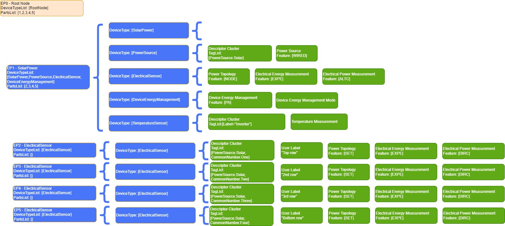

> 

Matter Device Library Specification

Version 1.4.1

> Copyright © 2022-2025 Connectivity Standards Alliance, Inc. 508 Second Street, Suite 109B Davis, CA 95616 - USA [www.csa-iot.org](http://www.csa-iot.org/)
>
> All rights reserved.
>
> Permission is granted to members of the Connectivity Standards Alliance to reproduce this document for their own use or the use of other Connectivity Standards Alliance members only, provided this notice is included. All other rights reserved. Duplication for sale, or for commercial or for-profit use is strictly prohibited without the prior written consent of the Connectivity Standards Alliance.
>
> Matter Device Library
>
> Version 1.4.1, 2025-03-12 06:42:16 -0700: Approved

# Copyright Notice, License and Disclaimer

> Copyright © Connectivity Standards Alliance (2021-2023). All rights reserved. The information within this document is the property of the Connectivity Standards Alliance and its use and disclo­ sure are restricted, except as expressly set forth herein.
>
> Connectivity Standards Alliance hereby grants you a fully-paid, non-exclusive, nontransferable, worldwide, limited and revocable license (without the right to sublicense), under Connectivity Stan­ dards Alliance’s applicable copyright rights, to view, download, save, reproduce and use the docu­ ment solely for your own internal purposes and in accordance with the terms of the license set forth herein. This license does not authorize you to, and you expressly warrant that you shall not:
>
> \(a\) permit others (outside your organization) to use this document; (b) post or publish this docu­ ment; (c) modify, adapt, translate, or otherwise change this document in any manner or create any derivative work based on this document; (d) remove or modify any notice or label on this docu­ ment, including this Copyright Notice, License and Disclaimer. The Connectivity Standards Alliance does not grant you any license hereunder other than as expressly stated herein.
>
> Elements of this document may be subject to third party intellectual property rights, including without limitation, patent, copyright or trademark rights, and any such third party may or may not be a member of the Connectivity Standards Alliance. Connectivity Standards Alliance members grant other Connectivity Standards Alliance members certain intellectual property rights as set forth in the Connectivity Standards Alliance IPR Policy. Connectivity Standards Alliance members do not grant you any rights under this license. The Connectivity Standards Alliance is not responsi­ ble for, and shall not be held responsible in any manner for, identifying or failing to identify any or all such third party intellectual property rights. Please visit [www.csa-iot.org](http://www.csa-iot.org/) for more information on how to become a member of the Connectivity Standards Alliance.
>
> This document and the information contained herein are provided on an “AS IS” basis and the Con­ nectivity Standards Alliance DISCLAIMS ALL WARRANTIES EXPRESS OR IMPLIED, INCLUDING BUT NOT LIMITED TO (A) ANY WARRANTY THAT THE USE OF THE INFORMATION HEREIN WILL NOT INFRINGE ANY RIGHTS OF THIRD PARTIES (INCLUDING WITHOUT LIMITATION ANY INTELLEC­ TUAL PROPERTY RIGHTS INCLUDING PATENT, COPYRIGHT OR TRADEMARK RIGHTS); OR (B) ANY IMPLIED WARRANTIES OF MERCHANTABILITY, FITNESS FOR A PARTICULAR PURPOSE, TITLE OR NONINFRINGEMENT. IN NO EVENT WILL THE CONNECTIVITY STANDARDS ALLIANCE BE LIABLE FOR ANY LOSS OF PROFITS, LOSS OF BUSINESS, LOSS OF USE OF DATA, INTERRUPTION OF BUSI­ NESS, OR FOR ANY OTHER DIRECT, INDIRECT, SPECIAL OR EXEMPLARY, INCIDENTAL, PUNITIVE OR CONSEQUENTIAL DAMAGES OF ANY KIND, IN CONTRACT OR IN TORT, IN CONNECTION WITH THIS DOCUMENT OR THE INFORMATION CONTAINED HEREIN, EVEN IF ADVISED OF THE POSSIBILITY OF SUCH LOSS OR DAMAGE.
>
> All company, brand and product names in this document may be trademarks that are the sole prop­ erty of their respective owners.
>
> This notice and disclaimer must be included on all copies of this document. Connectivity Standards Alliance
>
> 508 Second Street, Suite 206
>
> Davis, CA 95616, USA

# Revision History

| **Revision** | **Date**           | **Details**   | **Editor**      |
|--------------|--------------------|---------------|-----------------|
| 1            | September 23, 2022 | Version 1.0   | Robert Szewczyk |
| 2            | May 17, 2023       | Version 1.1   | Robert Szewczyk |
| 3            | October 18, 2023   | Version 1.2   | Robert Szewczyk |
| 4            | April 17, 2024     | Version 1.3   | Robert Szewczyk |
| 5            | November 4, 2024   | Version 1.4   | Robert Szewczyk |
| 6            | March 17, 2024     | Version 1.4.1 | Robert Szewczyk |

> **Table of Contents**

[Copyright Notice, License and Disclaimer](#copyright-notice-license-and-disclaimer) [1](#copyright-notice-license-and-disclaimer)

[Revision History](#revision-history) [3](#revision-history)

[References](#references) [17](#references)

[CSA Reference Documents](#csa-reference-documents) [17](#csa-reference-documents)

[Provisional](#provisional) [17](#provisional)

[List of Provisional Items](#list-of-provisional-items) [17](#list-of-provisional-items)

1.  [Base Device Type](#chapter-1.-base-device-type) [19](#chapter-1.-base-device-type)

    1.  [Base Device Type](#base-device-type) [19](#base-device-type)

        1.  [Revision History](#revision-history-1) [19](#revision-history-1)

        2.  [Overview](#overview) [19](#overview)

        3.  [Conditions](#conditions) [19](#conditions)

        4.  [Common Capability Conditions](#common-capability-conditions) [20](#common-capability-conditions)

        5.  [Device Type Class Conditions](#device-type-class-conditions) [21](#device-type-class-conditions)

        6.  [Endpoint Type Class Conditions](#endpoint-type-class-conditions) [21](#endpoint-type-class-conditions)

        7.  [Cluster Requirements](#cluster-requirements) [22](#cluster-requirements)

        8.  [Element Requirements](#element-requirements) [22](#element-requirements)

2.  [Utility Device Types](#chapter-2.-utility-device-types) [23](#chapter-2.-utility-device-types)

    1.  [Root Node](#root-node) [23](#root-node)

        1.  [Revision History](#revision-history-2) [23](#revision-history-2)

        2.  [Classification](#classification) [24](#classification)

        3.  [Conditions](#conditions-1) [24](#conditions-1)

        4.  [Device Type Requirements](#device-type-requirements) [24](#device-type-requirements)

        5.  [Cluster Requirements](#cluster-requirements-1) [24](#cluster-requirements-1)

        6.  [Element Requirements](#element-requirements-1) [25](#element-requirements-1)

        7.  [Endpoint Composition](#endpoint-composition) [26](#endpoint-composition)

    2.  [Power Source](#power-source) [26](#power-source)

        1.  [Classification](#classification-1) [26](#classification-1)

        2.  [Revision History](#revision-history-3) [26](#revision-history-3)

        3.  [Cluster Requirements](#cluster-requirements-2) [26](#cluster-requirements-2)

    3.  [OTA Requestor](#ota-requestor) [26](#ota-requestor)

        1.  [Revision History](#revision-history-4) [26](#revision-history-4)

        2.  [Classification](#classification-2) [27](#classification-2)

        3.  [Cluster Requirements](#cluster-requirements-3) [27](#cluster-requirements-3)

    4.  [OTA Provider](#ota-provider) [27](#ota-provider)

        1.  [Revision History](#revision-history-5) [27](#revision-history-5)

        2.  [Classification](#classification-3) [27](#classification-3)

        3.  [Cluster Requirements](#cluster-requirements-4) [27](#cluster-requirements-4)

    5.  [Bridged Node](#bridged-node) [28](#bridged-node)

        1.  [Revision History](#revision-history-6) [28](#revision-history-6)

        2.  [Classification](#classification-4) [28](#classification-4)

        3.  [Conditions](#conditions-2) [28](#conditions-2)

        4.  [Device Type Requirements](#device-type-requirements-1) [29](#device-type-requirements-1)

        5.  [Cluster Requirements](#cluster-requirements-5) [29](#cluster-requirements-5)

        6.  [Endpoint Composition](#endpoint-composition-1) [29](#endpoint-composition-1)

    6.  [Electrical Sensor](#electrical-sensor) [30](#electrical-sensor)

        1.  [Revision History](#revision-history-7) [30](#revision-history-7)

        2.  [Classification](#classification-5) [30](#classification-5)

        3.  [Device Type Requirements](#device-type-requirements-2) [30](#device-type-requirements-2)

        4.  [Cluster Requirements](#cluster-requirements-6) [30](#cluster-requirements-6)

    7.  [Device Energy Management](#device-energy-management) [30](#device-energy-management)

        1.  [Revision History](#revision-history-8) [30](#revision-history-8)

        2.  [Classification](#classification-6) [31](#classification-6)

        3.  [Conditions](#conditions-3) [31](#conditions-3)

        4.  [Cluster Requirements](#cluster-requirements-7) [31](#cluster-requirements-7)

        5.  [Element Requirements](#element-requirements-2) [31](#element-requirements-2)

    8.  [Secondary Network Interface](#secondary-network-interface) [32](#secondary-network-interface)

        1.  [Revision History](#revision-history-9) [32](#revision-history-9)

        2.  [Classification](#classification-7) [32](#classification-7)

        3.  [Cluster Requirements](#cluster-requirements-8) [32](#cluster-requirements-8)

    9.  [Joint Fabric Administrator](#joint-fabric-administrator) [33](#joint-fabric-administrator)

        1.  [Joint Fabric Architecture](#joint-fabric-architecture) [33](#joint-fabric-architecture)

        2.  [Revision History](#revision-history-10) [33](#revision-history-10)

        3.  [Classification](#classification-8) [33](#classification-8)

        4.  [Cluster Requirements](#cluster-requirements-9) [33](#cluster-requirements-9)

3.  [Application Device Types](#chapter-3.-application-device-types) [35](#chapter-3.-application-device-types)

4.  [Lighting Device Types](#chapter-4.-lighting-device-types) [39](#chapter-4.-lighting-device-types)

    1.  [On/Off Light](#onoff-light) [39](#onoff-light)

        1.  [Revision History](#revision-history-11) [39](#revision-history-11)

        2.  [Classification](#classification-9) [39](#classification-9)

        3.  [Conditions](#conditions-4) [39](#conditions-4)

        4.  [Cluster Requirements](#cluster-requirements-10) [39](#cluster-requirements-10)

        5.  [Element Requirements](#element-requirements-3) [40](#element-requirements-3)

    2.  [Dimmable Light](#dimmable-light) [40](#dimmable-light)

        1.  [Revision History](#revision-history-12) [40](#revision-history-12)

        2.  [Classification](#classification-10) [41](#classification-10)

        3.  [Conditions](#conditions-5) [41](#conditions-5)

        4.  [Cluster Requirements](#cluster-requirements-11) [41](#cluster-requirements-11)

        5.  [Element Requirements](#element-requirements-4) [41](#element-requirements-4)

    3.  [Color Temperature Light](#color-temperature-light) [42](#color-temperature-light)

        1.  [Revision History](#revision-history-13) [42](#revision-history-13)

        2.  [Classification](#classification-11) [42](#classification-11)

        3.  [Conditions](#conditions-6) [42](#conditions-6)

        4.  [Cluster Requirements](#cluster-requirements-12) [42](#cluster-requirements-12)

        5.  [Element Requirements](#element-requirements-5) [43](#element-requirements-5)

    4.  [Extended Color Light](#extended-color-light) [44](#extended-color-light)

        1.  [Revision History](#revision-history-14) [44](#revision-history-14)

        2.  [Classification](#classification-12) [44](#classification-12)

        3.  [Conditions](#conditions-7) [44](#conditions-7)

        4.  [Cluster Requirements](#cluster-requirements-13) [44](#cluster-requirements-13)

        5.  [Element Requirements](#element-requirements-6) [45](#element-requirements-6)

5.  [Smart Plugs/Outlets and other Actuators](#chapter-5.-smart-plugsoutlets-and-other-actuators) [47](#chapter-5.-smart-plugsoutlets-and-other-actuators)

    1.  [On/Off Plug-in Unit](#onoff-plug-in-unit) [47](#onoff-plug-in-unit)

        1.  [Revision History](#revision-history-15) [47](#revision-history-15)

        2.  [Classification](#classification-13) [47](#classification-13)

        3.  [Conditions](#conditions-8) [47](#conditions-8)

        4.  [Cluster Requirements](#cluster-requirements-14) [47](#cluster-requirements-14)

        5.  [Element Requirements](#element-requirements-7) [48](#element-requirements-7)

    2.  [Dimmable Plug-In Unit](#dimmable-plug-in-unit) [48](#dimmable-plug-in-unit)

        1.  [Revision History](#revision-history-16) [49](#revision-history-16)

        2.  [Classification](#classification-14) [49](#classification-14)

        3.  [Conditions](#conditions-9) [49](#conditions-9)

        4.  [Cluster Requirements](#cluster-requirements-15) [49](#cluster-requirements-15)

        5.  [Element Requirements](#element-requirements-8) [49](#element-requirements-8)

    3.  [Mounted On/Off Control](#mounted-onoff-control) [50](#mounted-onoff-control)

        1.  [Revision History](#revision-history-17) [50](#revision-history-17)

        2.  [Classification](#classification-15) [50](#classification-15)

        3.  [Conditions](#conditions-10) [50](#conditions-10)

        4.  [Cluster Requirements](#cluster-requirements-16) [50](#cluster-requirements-16)

        5.  [Element Requirements](#element-requirements-9) [51](#element-requirements-9)

    4.  [Mounted Dimmable Load Control](#mounted-dimmable-load-control) [52](#mounted-dimmable-load-control)

        1.  [Revision History](#revision-history-18) [52](#revision-history-18)

        2.  [Classification](#classification-16) [52](#classification-16)

        3.  [Conditions](#conditions-11) [52](#conditions-11)

        4.  [Cluster Requirements](#cluster-requirements-17) [52](#cluster-requirements-17)

        5.  [Element Requirements](#element-requirements-10) [52](#element-requirements-10)

    5.  [Pump](#pump) [53](#pump)

        1.  [Revision History](#revision-history-19) [53](#revision-history-19)

        2.  [Classification](#classification-17) [53](#classification-17)

        3.  [Conditions](#_bookmark121) [54](#_bookmark121)

        4.  [Cluster Requirements](#_bookmark122) [54](#_bookmark122)

        5.  [Cluster Restrictions](#cluster-restrictions) [54](#cluster-restrictions)

    6.  [Water Valve Device Type](#water-valve-device-type) [55](#water-valve-device-type)

        1.  [Revision History](#revision-history-20) [55](#revision-history-20)

        2.  [Classification](#classification-18) [55](#classification-18)

        3.  [Conditions](#conditions-12) [56](#conditions-12)

        4.  [Cluster Requirements](#cluster-requirements-18) [56](#cluster-requirements-18)

        5.  [Device implementation recommendations](#device-implementation-recommendations) [56](#device-implementation-recommendations)

6.  [Switches and Controls Device Types](#chapter-6.-switches-and-controls-device-types) [57](#chapter-6.-switches-and-controls-device-types)

    1.  [On/Off Light Switch](#onoff-light-switch) [57](#onoff-light-switch)

        1.  [Revision History](#revision-history-21) [57](#revision-history-21)

        2.  [Classification](#classification-19) [57](#classification-19)

        3.  [Conditions](#conditions-13) [57](#conditions-13)

        4.  [Cluster Requirements](#cluster-requirements-19) [57](#cluster-requirements-19)

    2.  [Dimmer Switch](#dimmer-switch) [58](#dimmer-switch)

        1.  [Revision History](#revision-history-22) [58](#revision-history-22)

        2.  [Classification](#classification-20) [58](#classification-20)

        3.  [Conditions](#conditions-14) [58](#conditions-14)

        4.  [Cluster Requirements](#cluster-requirements-20) [58](#cluster-requirements-20)

    3.  [Color Dimmer Switch](#color-dimmer-switch) [59](#color-dimmer-switch)

        1.  [Revision History](#revision-history-23) [59](#revision-history-23)

        2.  [Classification](#classification-21) [59](#classification-21)

        3.  [Conditions](#conditions-15) [59](#conditions-15)

        4.  [Cluster Requirements](#cluster-requirements-21) [59](#cluster-requirements-21)

    4.  [Control Bridge](#control-bridge) [60](#control-bridge)

        1.  [Revision History](#revision-history-24) [60](#revision-history-24)

        2.  [Classification](#classification-22) [60](#classification-22)

        3.  [Conditions](#conditions-16) [60](#conditions-16)

        4.  [Cluster Requirements](#cluster-requirements-22) [60](#cluster-requirements-22)

    5.  [Pump Controller](#pump-controller) [61](#pump-controller)

        1.  [Revision History](#revision-history-25) [61](#revision-history-25)

        2.  [Classification](#classification-23) [61](#classification-23)

        3.  [Cluster Requirements](#cluster-requirements-23) [61](#cluster-requirements-23)

    6.  [Generic Switch](#generic-switch) [62](#generic-switch)

        1.  [Revision History](#revision-history-26) [62](#revision-history-26)

        2.  [Classification](#classification-24) [62](#classification-24)

        3.  [Conditions](#conditions-17) [62](#conditions-17)

        4.  [Cluster Requirements](#cluster-requirements-24) [62](#cluster-requirements-24)

        5.  [Relation with other Switch device types (informative)](#relation-with-other-switch-device-types-informative) [64](#relation-with-other-switch-device-types-informative)

7.  [Sensor Device Types](#chapter-7.-sensor-device-types) [67](#chapter-7.-sensor-device-types)

    1.  [Contact Sensor Device Type](#contact-sensor-device-type) [67](#contact-sensor-device-type)

        1.  [Revision History](#revision-history-27) [67](#revision-history-27)

    2.  [Light Sensor](#light-sensor) [68](#light-sensor)

        1.  [Revision History](#revision-history-28) [68](#revision-history-28)

        2.  [Classification](#classification-26) [68](#classification-26)

        3.  [Conditions](#conditions-18) [68](#conditions-18)

        4.  [Cluster Requirements](#cluster-requirements-26) [68](#cluster-requirements-26)

    3.  [Occupancy Sensor Device Type](#occupancy-sensor-device-type) [69](#occupancy-sensor-device-type)

        1.  [Revision History](#revision-history-29) [69](#revision-history-29)

        2.  [Classification](#classification-27) [69](#classification-27)

        3.  [Conditions](#conditions-19) [69](#conditions-19)

        4.  [Cluster Requirements](#cluster-requirements-27) [69](#cluster-requirements-27)

        5.  [Multi-modality sensors](#multi-modality-sensors) [70](#multi-modality-sensors)

    4.  [Temperature Sensor](#temperature-sensor) [70](#temperature-sensor)

        1.  [Revision History](#revision-history-30) [70](#revision-history-30)

        2.  [Classification](#classification-28) [70](#classification-28)

        3.  [Conditions](#conditions-20) [71](#conditions-20)

        4.  [Cluster Requirements](#cluster-requirements-28) [71](#cluster-requirements-28)

    5.  [Pressure Sensor](#pressure-sensor) [71](#pressure-sensor)

        1.  [Revision History](#revision-history-31) [71](#revision-history-31)

        2.  [Classification](#classification-29) [71](#classification-29)

        3.  [Conditions](#conditions-21) [71](#conditions-21)

        4.  [Cluster Requirements](#cluster-requirements-29) [71](#cluster-requirements-29)

    6.  [Flow Sensor](#flow-sensor) [72](#flow-sensor)

        1.  [Revision History](#revision-history-32) [72](#revision-history-32)

        2.  [Classification](#classification-30) [72](#classification-30)

        3.  [Conditions](#conditions-22) [72](#conditions-22)

        4.  [Cluster Requirements](#cluster-requirements-30) [72](#cluster-requirements-30)

    7.  [Humidity Sensor](#humidity-sensor) [72](#humidity-sensor)

        1.  [Revision History](#revision-history-33) [73](#revision-history-33)

        2.  [Classification](#classification-31) [73](#classification-31)

        3.  [Conditions](#conditions-23) [73](#conditions-23)

        4.  [Cluster Requirements](#cluster-requirements-31) [73](#cluster-requirements-31)

    8.  [On/Off Sensor](#onoff-sensor) [73](#onoff-sensor)

        1.  [Revision History](#revision-history-34) [73](#revision-history-34)

        2.  [Classification](#classification-32) [74](#classification-32)

        3.  [Conditions](#conditions-24) [74](#conditions-24)

        4.  [Cluster Requirements](#cluster-requirements-32) [74](#cluster-requirements-32)

    9.  [Smoke CO Alarm](#smoke-co-alarm) [74](#smoke-co-alarm)

        1.  [Revision History](#revision-history-35) [74](#revision-history-35)

        2.  [Classification](#classification-33) [75](#classification-33)

        3.  [Conditions](#conditions-25) [75](#conditions-25)

        4.  [Device Type Requirements](#device-type-requirements-3) [75](#device-type-requirements-3)

        5.  [Cluster Requirements](#cluster-requirements-33) [75](#cluster-requirements-33)

    10. [Air Quality Sensor](#air-quality-sensor) [75](#air-quality-sensor)

        1.  [Revision History](#revision-history-36) [76](#revision-history-36)

        2.  [Classification](#classification-34) [76](#classification-34)

        3.  [Conditions](#conditions-26) [76](#conditions-26)

        4.  [Cluster Requirements](#cluster-requirements-34) [76](#cluster-requirements-34)

    11. [Water Freeze Detector Device Type](#water-freeze-detector-device-type) [77](#water-freeze-detector-device-type)

        1.  [Revision History](#revision-history-37) [77](#revision-history-37)

        2.  [Classification](#classification-35) [77](#classification-35)

        3.  [Conditions](#conditions-27) [77](#conditions-27)

        4.  [Cluster Requirements](#cluster-requirements-35) [77](#cluster-requirements-35)

        5.  [Element Requirements](#element-requirements-11) [78](#element-requirements-11)

    12. [Water Leak Detector Device Type](#water-leak-detector-device-type) [78](#water-leak-detector-device-type)

        1.  [Revision History](#revision-history-38) [79](#revision-history-38)

        2.  [Classification](#classification-36) [79](#classification-36)

        3.  [Conditions](#conditions-28) [79](#conditions-28)

        4.  [Cluster Requirements](#cluster-requirements-36) [79](#cluster-requirements-36)

        5.  [Element Requirements](#element-requirements-12) [80](#element-requirements-12)

    13. [Rain Sensor Device Type](#rain-sensor-device-type) [80](#rain-sensor-device-type)

        1.  [Revision History](#revision-history-39) [80](#revision-history-39)

        2.  [Classification](#classification-37) [80](#classification-37)

        3.  [Conditions](#conditions-29) [80](#conditions-29)

        4.  [Cluster Requirements](#cluster-requirements-37) [80](#cluster-requirements-37)

        5.  [Element Requirements](#element-requirements-13) [81](#element-requirements-13)

8.  [Closure Device Types](#chapter-8.-closure-device-types) [83](#chapter-8.-closure-device-types)

    1.  [Door Lock Device Type](#door-lock-device-type) [83](#door-lock-device-type)

        1.  [Revision History](#revision-history-40) [83](#revision-history-40)

        2.  [Classification](#classification-38) [83](#classification-38)

        3.  [Conditions](#conditions-30) [83](#conditions-30)

        4.  [Cluster Requirements](#cluster-requirements-38) [83](#cluster-requirements-38)

        5.  [Element Requirements](#_bookmark238) [84](#_bookmark238)

    2.  [Door Lock Controller Device Type](#door-lock-controller-device-type) [84](#door-lock-controller-device-type)

        1.  [Revision History](#revision-history-41) [84](#revision-history-41)

        2.  [Classification](#classification-39) [84](#classification-39)

        3.  [Conditions](#conditions-31) [84](#conditions-31)

        4.  [Cluster Requirements](#cluster-requirements-39) [84](#cluster-requirements-39)

    3.  [Window Covering](#window-covering) [85](#window-covering)

        1.  [Revision History](#revision-history-42) [85](#revision-history-42)

        2.  [Classification](#classification-40) [85](#classification-40)

        3.  [Conditions](#conditions-32) [85](#conditions-32)

        4.  [Cluster Requirements](#cluster-requirements-40) [85](#cluster-requirements-40)

        5.  [Element Requirements](#element-requirements-14) [86](#element-requirements-14)

    4.  [Window Covering Controller](#window-covering-controller) [86](#window-covering-controller)

        1.  [Revision History](#revision-history-43) [86](#revision-history-43)

        2.  [Classification](#classification-41) [86](#classification-41)

        3.  [Conditions](#conditions-33) [86](#conditions-33)

        4.  [Cluster Requirements](#cluster-requirements-41) [86](#cluster-requirements-41)

        5.  [Element Requirements](#element-requirements-15) [87](#element-requirements-15)

9.  [HVAC Device Types](#chapter-9.-hvac-device-types) [89](#chapter-9.-hvac-device-types)

    1.  [Thermostat](#thermostat) [89](#thermostat)

        1.  [Revision History](#revision-history-44) [89](#revision-history-44)

        2.  [Classification](#classification-42) [89](#classification-42)

        3.  [Conditions](#conditions-34) [89](#conditions-34)

        4.  [Cluster Requirements](#cluster-requirements-42) [89](#cluster-requirements-42)

        5.  [Element Requirements](#element-requirements-16) [90](#element-requirements-16)

    2.  [Fan](#fan) [90](#fan)

        1.  [Revision History](#revision-history-45) [90](#revision-history-45)

        2.  [Classification](#classification-43) [91](#classification-43)

        3.  [Conditions](#conditions-35) [91](#conditions-35)

        4.  [Device Type Requirements](#device-type-requirements-4) [91](#device-type-requirements-4)

        5.  [Cluster Requirements](#cluster-requirements-43) [91](#cluster-requirements-43)

        6.  [Cluster Restrictions](#cluster-restrictions-1) [91](#cluster-restrictions-1)

        7.  [Element Requirements](#element-requirements-17) [92](#element-requirements-17)

    3.  [Air Purifier](#air-purifier) [92](#air-purifier)

        1.  [Revision History](#revision-history-46) [92](#revision-history-46)

        2.  [Classification](#classification-44) [92](#classification-44)

        3.  [Conditions](#conditions-36) [92](#conditions-36)

        4.  [Device Type Requirements](#device-type-requirements-5) [93](#device-type-requirements-5)

        5.  [Cluster Requirements](#cluster-requirements-44) [93](#cluster-requirements-44)

        6.  [Cluster Restrictions](#cluster-restrictions-2) [93](#cluster-restrictions-2)

        7.  [Element Requirements](#element-requirements-18) [94](#element-requirements-18)

10. [Media Device Types](#chapter-10.-media-device-types) [95](#chapter-10.-media-device-types)

    1.  [Video Player Architecture](#video-player-architecture) [95](#video-player-architecture)

        1.  [Introduction](#introduction) [95](#introduction)

        2.  [Clients of a Casting Video Player](#clients-of-a-casting-video-player) [96](#clients-of-a-casting-video-player)

        3.  [Endpoint Composition for Content Apps of a Casting Video Player](#endpoint-composition-for-content-apps-of-a-casting-video-player) [96](#endpoint-composition-for-content-apps-of-a-casting-video-player)

        4.  [Commissioning](#commissioning) [97](#commissioning)

        5.  [Determining Context](#determining-context) [99](#determining-context)

        6.  [Basic Video Player Features](#basic-video-player-features) [100](#basic-video-player-features)

        7.  [Content Launching Features](#content-launching-features) [101](#content-launching-features)

    2.  [Basic Video Player](#basic-video-player) [102](#basic-video-player)

        1.  [Revision History](#revision-history-47) [102](#revision-history-47)

        2.  [Classification](#classification-45) [102](#classification-45)

        3.  [Conditions](#conditions-37) [102](#conditions-37)

        4.  [Cluster Requirements](#cluster-requirements-45) [103](#cluster-requirements-45)

    3.  [Casting Video Player](#casting-video-player) [103](#casting-video-player)

        1.  [Revision History](#revision-history-48) [103](#revision-history-48)

        2.  [Classification](#classification-46) [104](#classification-46)

        3.  [Conditions](#conditions-38) [104](#conditions-38)

        4.  [Cluster Requirements](#cluster-requirements-46) [104](#cluster-requirements-46)

        5.  [Element Requirements](#element-requirements-19) [105](#element-requirements-19)

    4.  [Speaker](#speaker) [105](#speaker)

        1.  [Revision History](#revision-history-49) [105](#revision-history-49)

        2.  [Classification](#classification-47) [105](#classification-47)

        3.  [Conditions](#conditions-39) [106](#conditions-39)

        4.  [Cluster Requirements](#cluster-requirements-47) [106](#cluster-requirements-47)

    5.  [Content App](#content-app) [106](#content-app)

        1.  [Revision History](#revision-history-50) [106](#revision-history-50)

        2.  [Classification](#classification-48) [106](#classification-48)

        3.  [Conditions](#conditions-40) [106](#conditions-40)

        4.  [Cluster Requirements](#cluster-requirements-48) [107](#cluster-requirements-48)

        5.  [Element Requirements](#element-requirements-20) [107](#element-requirements-20)

        6.  [Endpoint Composition](#endpoint-composition-2) [107](#endpoint-composition-2)

        7.  [Disambiguation](#disambiguation) [107](#disambiguation)

    6.  [Casting Video Client](#casting-video-client) [107](#casting-video-client)

        1.  [Revision History](#revision-history-51) [108](#revision-history-51)

        2.  [Classification](#classification-49) [108](#classification-49)

        3.  [Conditions](#conditions-41) [108](#conditions-41)

        4.  [Cluster Requirements](#cluster-requirements-49) [108](#cluster-requirements-49)

    7.  [Video Remote Control](#video-remote-control) [109](#video-remote-control)

        1.  [Revision History](#revision-history-52) [109](#revision-history-52)

        2.  [Classification](#classification-50) [109](#classification-50)

        3.  [Conditions](#conditions-42) [109](#conditions-42)

        4.  [Cluster Requirements](#cluster-requirements-50) [109](#cluster-requirements-50)

11. [Generic Device Types](#chapter-11.-generic-device-types) [111](#chapter-11.-generic-device-types)

    1.  [Mode Select](#mode-select) [111](#mode-select)

        1.  [Revision History](#revision-history-53) [111](#revision-history-53)

        2.  [Classification](#classification-51) [111](#classification-51)

        3.  [Conditions](#conditions-43) [111](#conditions-43)

        4.  [Cluster Requirements](#cluster-requirements-51) [111](#cluster-requirements-51)

    2.  [Aggregator](#aggregator) [111](#aggregator)

        1.  [Revision History](#revision-history-54) [112](#revision-history-54)

        2.  [Classification](#classification-52) [112](#classification-52)

        3.  [Conditions](#conditions-44) [112](#conditions-44)

        4.  [Cluster Requirements](#cluster-requirements-52) [112](#cluster-requirements-52)

        5.  [Endpoint Composition](#endpoint-composition-3) [113](#endpoint-composition-3)

        6.  [Disambiguation](#disambiguation-1) [113](#disambiguation-1)

12. [Robotic Device Types](#chapter-12.-robotic-device-types) [115](#chapter-12.-robotic-device-types)

    1.  [Robotic Vacuum Cleaner Device Type](#robotic-vacuum-cleaner-device-type) [115](#robotic-vacuum-cleaner-device-type)

        1.  [Revision History](#revision-history-55) [115](#revision-history-55)

        2.  [Classification](#classification-53) [115](#classification-53)

        3.  [Conditions](#conditions-45) [115](#conditions-45)

        4.  [Cluster Requirements](#cluster-requirements-53) [115](#cluster-requirements-53)

        5.  [Cluster Usage](#cluster-usage) [116](#cluster-usage)

13. [Appliances Device Types](#chapter-13.-appliances-device-types) [119](#chapter-13.-appliances-device-types)

    1.  [Laundry Washer](#laundry-washer) [119](#laundry-washer)

        1.  [Revision History](#revision-history-56) [119](#revision-history-56)

        2.  [Classification](#classification-54) [119](#classification-54)

        3.  [Conditions](#conditions-46) [119](#conditions-46)

        4.  [Cluster Requirements](#cluster-requirements-54) [119](#cluster-requirements-54)

        5.  [Cluster Restrictions](#cluster-restrictions-3) [120](#cluster-restrictions-3)

        6.  [Element Requirements](#element-requirements-21) [120](#element-requirements-21)

    2.  [Refrigerator](#refrigerator) [121](#refrigerator)

        1.  [Refrigerator Architecture](#refrigerator-architecture) [121](#refrigerator-architecture)

        2.  [Revision History](#revision-history-57) [122](#revision-history-57)

        3.  [Classification](#classification-55) [122](#classification-55)

        4.  [Conditions](#conditions-47) [122](#conditions-47)

        5.  [Device Type Requirements](#device-type-requirements-6) [122](#device-type-requirements-6)

        6.  [Cluster Requirements](#cluster-requirements-55) [122](#cluster-requirements-55)

        7.  [Element Requirements](#element-requirements-22) [123](#element-requirements-22)

    3.  [Room Air Conditioner](#room-air-conditioner) [123](#room-air-conditioner)

        1.  [Room Air Conditioner Architecture](#room-air-conditioner-architecture) [123](#room-air-conditioner-architecture)

        2.  [Revision History](#revision-history-58) [124](#revision-history-58)

        3.  [Classification](#classification-56) [124](#classification-56)

        4.  [Conditions](#conditions-48) [124](#conditions-48)

        5.  [Device Type Requirements](#device-type-requirements-7) [124](#device-type-requirements-7)

        6.  [Cluster Requirements](#cluster-requirements-56) [125](#cluster-requirements-56)

        7.  [Cluster Restrictions](#cluster-restrictions-4) [125](#cluster-restrictions-4)

        8.  [Element Requirements](#element-requirements-23) [126](#element-requirements-23)

    4.  [Temperature Controlled Cabinet](#temperature-controlled-cabinet) [126](#temperature-controlled-cabinet)

        1.  [Revision History](#revision-history-59) [126](#revision-history-59)

        &nbsp;

        3.  [Conditions](#conditions-49) [127](#conditions-49)

        4.  [Cluster Requirements](#cluster-requirements-57) [127](#cluster-requirements-57)

        5.  [Element Requirements](#element-requirements-24) [127](#element-requirements-24)

    5.  [Dishwasher](#dishwasher) [128](#dishwasher)

        1.  [Revision History](#revision-history-60) [128](#revision-history-60)

        2.  [Classification](#classification-58) [128](#classification-58)

        3.  [Conditions](#conditions-50) [128](#conditions-50)

        4.  [Cluster Requirements](#_bookmark377) [129](#_bookmark377)

        5.  [Cluster Restrictions](#cluster-restrictions-5) [129](#cluster-restrictions-5)

        6.  [Element Requirements](#element-requirements-25) [130](#element-requirements-25)

    6.  [Laundry Dryer](#laundry-dryer) [130](#laundry-dryer)

        1.  [Revision History](#revision-history-61) [130](#revision-history-61)

        2.  [Classification](#classification-59) [130](#classification-59)

        3.  [Conditions](#conditions-51) [130](#conditions-51)

        4.  [Cluster Requirements](#cluster-requirements-58) [131](#cluster-requirements-58)

        5.  [Cluster Restrictions](#cluster-restrictions-6) [131](#cluster-restrictions-6)

        6.  [Element Requirements](#element-requirements-26) [132](#element-requirements-26)

    7.  [Cook Surface](#cook-surface) [132](#cook-surface)

        1.  [Revision History](#revision-history-62) [132](#revision-history-62)

        2.  [Classification](#classification-60) [132](#classification-60)

        3.  [Conditions](#conditions-52) [133](#conditions-52)

        4.  [Cluster Requirements](#cluster-requirements-59) [133](#cluster-requirements-59)

        5.  [Cluster Restrictions](#cluster-restrictions-7) [133](#cluster-restrictions-7)

        6.  [Element Requirements](#element-requirements-27) [133](#element-requirements-27)

    8.  [Cooktop](#cooktop) [133](#cooktop)

        1.  [Revision History](#revision-history-63) [133](#revision-history-63)

        2.  [Classification](#classification-61) [134](#classification-61)

        3.  [Conditions](#conditions-53) [134](#conditions-53)

        4.  [Device Type Requirements](#device-type-requirements-8) [134](#device-type-requirements-8)

        5.  [Cluster Requirements](#cluster-requirements-60) [134](#cluster-requirements-60)

        6.  [Cluster Restrictions](#cluster-restrictions-8) [134](#cluster-restrictions-8)

        7.  [Element Requirements](#element-requirements-28) [135](#element-requirements-28)

    9.  [Oven](#oven) [135](#oven)

        1.  [Oven Architecture](#oven-architecture) [135](#oven-architecture)

        2.  [Revision History](#revision-history-64) [135](#revision-history-64)

        3.  [Classification](#classification-62) [136](#classification-62)

        4.  [Conditions](#conditions-54) [136](#conditions-54)

        5.  [Device Type Requirements](#device-type-requirements-9) [136](#device-type-requirements-9)

        6.  [Cluster Requirements](#cluster-requirements-61) [136](#cluster-requirements-61)

    10. [Extractor Hood](#extractor-hood) [137](#extractor-hood)

        1.  [Revision History](#revision-history-65) [137](#revision-history-65)

        2.  [Classification](#classification-63) [137](#classification-63)

        3.  [Conditions](#conditions-55) [137](#conditions-55)

        4.  [Device Type Requirements](#device-type-requirements-10) [137](#device-type-requirements-10)

        5.  [Cluster Requirements](#_bookmark414) [138](#_bookmark414)

        6.  [Element Requirements](#element-requirements-29) [138](#element-requirements-29)

    11. [Microwave Oven](#microwave-oven) [138](#microwave-oven)

        1.  [Microwave Oven Architecture](#microwave-oven-architecture) [138](#microwave-oven-architecture)

        2.  [Revision History](#revision-history-66) [139](#revision-history-66)

        3.  [Classification](#classification-64) [139](#classification-64)

        4.  [Conditions](#conditions-56) [139](#conditions-56)

        5.  [Device Type Requirements](#device-type-requirements-11) [139](#device-type-requirements-11)

        6.  [Cluster Requirements](#cluster-requirements-62) [140](#cluster-requirements-62)

        7.  [Element Requirements](#element-requirements-30) [140](#element-requirements-30)

        8.  [Cluster Usage](#cluster-usage-1) [140](#cluster-usage-1)

14. [Energy Device Types](#chapter-14.-energy-device-types) [143](#chapter-14.-energy-device-types)

    1.  [EVSE Device Type](#evse-device-type) [143](#evse-device-type)

        1.  [EVSE Architecture](#evse-architecture) [143](#evse-architecture)

        2.  [Revision History](#revision-history-67) [144](#revision-history-67)

        3.  [Classification](#classification-65) [144](#classification-65)

        4.  [Conditions](#conditions-57) [144](#conditions-57)

        5.  [Device Type Requirements](#device-type-requirements-12) [144](#device-type-requirements-12)

        6.  [Cluster Requirements](#cluster-requirements-63) [145](#cluster-requirements-63)

    2.  [Water Heater Device Type](#water-heater-device-type) [145](#water-heater-device-type)

        1.  [Water Heater Architecture](#water-heater-architecture) [145](#water-heater-architecture)

        2.  [Revision History](#revision-history-68) [146](#revision-history-68)

        3.  [Classification](#classification-66) [146](#classification-66)

        4.  [Conditions](#conditions-58) [146](#conditions-58)

        5.  [Device Type Requirements](#device-type-requirements-13) [147](#device-type-requirements-13)

        6.  [Cluster Requirements](#cluster-requirements-64) [147](#cluster-requirements-64)

        7.  [Element Requirements](#element-requirements-31) [147](#element-requirements-31)

    3.  [Solar Power Device Type](#solar-power-device-type) [148](#solar-power-device-type)

        1.  [Solar Power Architecture](#solar-power-architecture) [148](#solar-power-architecture)

        2.  [Revision History](#revision-history-69) [149](#revision-history-69)

        3.  [Classification](#classification-67) [150](#classification-67)

        4.  [Conditions](#conditions-59) [150](#conditions-59)

        5.  [Device Type Requirements](#device-type-requirements-14) [150](#device-type-requirements-14)

        6.  [Cluster Requirements](#cluster-requirements-65) [152](#cluster-requirements-65)

    4.  [Battery Storage Device Type](#battery-storage-device-type) [152](#battery-storage-device-type)

        1.  [Battery Storage Architecture](#battery-storage-architecture) [152](#battery-storage-architecture)

        2.  [Revision History](#revision-history-70) [153](#revision-history-70)

        3.  [Classification](#classification-68) [153](#classification-68)

        4.  [Conditions](#conditions-60) [154](#conditions-60)

        5.  [Device Type Requirements](#device-type-requirements-15) [154](#device-type-requirements-15)

        6.  [Cluster Requirements](#cluster-requirements-66) [157](#cluster-requirements-66)

    5.  [Heat Pump Device Type](#heat-pump-device-type) [157](#heat-pump-device-type)

        1.  [Heat Pump Architecture](#heat-pump-architecture) [157](#heat-pump-architecture)

        2.  [Revision History](#revision-history-71) [158](#revision-history-71)

        3.  [Classification](#classification-69) [158](#classification-69)

        4.  [Conditions](#conditions-61) [158](#conditions-61)

        5.  [Device Type Requirements](#device-type-requirements-16) [158](#device-type-requirements-16)

        6.  [Cluster Requirements](#cluster-requirements-67) [160](#cluster-requirements-67)

15. [Network Infrastructure Device Types](#chapter-15.-network-infrastructure-device-types) [163](#chapter-15.-network-infrastructure-device-types)

    1.  [Introduction](#introduction-1) [163](#introduction-1)

    2.  [Network Infrastructure Manager Device Type](#network-infrastructure-manager-device-type) [163](#network-infrastructure-manager-device-type)

        1.  [Revision History](#revision-history-72) [163](#revision-history-72)

        2.  [Classification](#classification-70) [164](#classification-70)

        3.  [Conditions](#conditions-62) [164](#conditions-62)

        4.  [Cluster Requirements](#cluster-requirements-68) [164](#cluster-requirements-68)

        5.  [Root Node Element Requirements](#root-node-element-requirements) [164](#root-node-element-requirements)

        6.  [Other Requirements](#other-requirements) [165](#other-requirements)

    3.  [Thread Border Router Device Type](#thread-border-router-device-type) [166](#thread-border-router-device-type)

        1.  [Revision History](#revision-history-73) [166](#revision-history-73)

        2.  [Classification](#classification-71) [166](#classification-71)

        3.  [Conditions](#conditions-63) [167](#conditions-63)

        4.  [Device Type Requirements](#device-type-requirements-17) [167](#device-type-requirements-17)

        5.  [Cluster Requirements](#cluster-requirements-69) [167](#cluster-requirements-69)

        6.  [Other Requirements](#other-requirements-1) [167](#other-requirements-1)

        7.  [Usage](#usage) [168](#usage)

## References

> The following standards and specifications contain provisions, which through reference in this doc­ ument constitute provisions of this specification. All the standards and specifications listed are nor­ mative references. At the time of publication, the editions indicated were valid. All standards and specifications are subject to revision, and parties to agreements based on this specification are encouraged to investigate the possibility of applying the most recent editions of the standards and specifications indicated below.

### CSA Reference Documents

[TABLE]

## Provisional

> Per [\[CSA-PNP\]](#_bookmark5), when a specification is completed there may be sections of specification text (or smaller pieces of a section) that are not certifiable at this stage. These sections (or smaller pieces of a section) are marked as provisional prior to publishing the specification. This specification uses well-defined notation to mark Provisional Conformance (see [\[MatterCore\]](#_bookmark4), Section 7.3) or notes a section of text with the term "provisional".

### List of Provisional Items

> The following is a list of provisional items.

# Chapter 1. Base Device Type

> This chapter describes the [base device type](#base-device-type).

## Base Device Type

### Revision History

> This is the revision history for this document. Because this document defines common require­ ments for all device types, changes to this document may affect many device types. Therefore, each device type definition affected by a change here, SHALL have its revision number incremented, with a new entry added to its history with a description that matches the description here.

| **Revision** | **Description**                                 |
|--------------|-------------------------------------------------|
| 1            | Initial revision                                |
| 2            | Duplicate condition replaces Multiple condition |

### Overview

> This defines common conformance for all device types depending on, but not limited to:

- Certification programs (e.g. Zigbee, Matter, etc.)

- Underlying protocol stack (e.g. 802.15.4, Wi-Fi, Thread, Zigbee PRO, IPv6, TCP/IP)

- Regional regulations

- Interfaces (UI, cloud, etc.)

- Scale (e.g. residential vs commercial)

- Other common limitations or capabilities (e.g. battery powered or sleepy nodes).

- etc.

### Conditions

> Each section below is a category of conditions, each defining a list of conformance condition names and unique tags. The separation into categories is for reading purposes only.

#### Certification Program Conditions

> At the time of the first publication of this document, many certification programs have terminated, or only allow re-certification, such as the Zigbee Home Automation standard.

| **Certification Program** | **Tag** | **Description**                  |
|---------------------------|---------|----------------------------------|
| Zigbee Home Automation    | ZHA     | Zigbee Home Automation stan­ dard |
| Zigbee Smart Energy       | ZSE     | Zigbee Smart Energy standard     |

| **Certification Program** | **Tag** | **Description**             |
|---------------------------|---------|-----------------------------|
| Green Power               | GP      | Zigbee Green Power standard |
| Zigbee                    | Zigbee  | Zigbee standard             |
| SuZi                      | SuZi    | Zigbee PRO Sub-GHz standard |
| Matter                    | Matter  | Matter standard             |

#### Protocol Conditions

| **Protocol Tag** |
|------------------|
| Ethernet         |
| Wi-Fi            |
| Thread           |
| TCP              |
| UDP              |
| IP               |
| IPv4             |
| IPv6             |

1.  **Interface Conditions**

| **Interface Tag** | **Description** |
|----|----|
| LanguageLocale | The node supports localization for conveying text to the user |
| TimeLocale | The node supports localization for conveying time to the user |
| UnitLocale | The node supports localization for conveying units of measure to the user |

> Note that "supports localization" in the table above refers to supporting update of localization via cluster interactions.

### Common Capability Conditions

> This category is for common limitations or capabilities of a node.

| **Capability Tag** | **Description** |
|----|----|
| SIT | The node is a short idle time intermittently con­ nected device |
| LIT | The node is a long idle time intermittently con­ nected device |

| **Capability Tag** | **Description**                        |
|--------------------|----------------------------------------|
| Active             | The node is always able to communicate |

### Device Type Class Conditions

> This category is for classifications of device type. Some of these classifications are dependent on other conditions.

| **Class Tag** | **Summary** |
|----|----|
| Node | the device type is classified as a Node device type (see Data Model specification) |
| App | the device type is classified as an Application device type (see Data Model specification) |
| Simple | the device type is classified as a Simple device type (see Data Model specification) |
| Dynamic | the device type is classified as a Dynamic device type (see Data Model specification) |
| Composed | the device type is composed of 2 or more device types (see System Model specification) |

### Endpoint Type Class Conditions

> This category is for classifications of endpoints. Some of these classifications are dependent on other conditions.

| **Class Tag** | **Summary** |
|----|----|
| Client | there exists a client application cluster on the endpoint |
| Server | there exists a server application cluster on the endpoint |
| Duplicate | see [Duplicate Condition](#duplicate-condition) |
| BridgedPowerSourceInfo | the endpoint represents a Bridged Device, for which information about the state of its power source is available to the Bridge |

#### 1.1.6.1. Duplicate Condition

> The endpoint and at least one of its sibling endpoints have an overlap in application device type(s), as defined in the "Disambiguation" section in the System Model specification. This condition trig­ gers requirements for providing additional information about the endpoints in order to disam­ biguate between the endpoints (see "Disambiguation" section in the System Model specification).

### Cluster Requirements

> Each Matter device type implementation SHALL include these clusters, as a minimum set, based on the conformance defined below. This conformance table SHALL assume the Matter conformance condition is TRUE (in Conformance column).

| **ID** | **Cluster** | **Client/Server** | **Quality** | **Conformance** |
|--------|-------------|-------------------|-------------|-----------------|
| 0x001D | Descriptor  | Server            |             | M               |
| 0x001E | Binding     | Server            |             | Simple & Client |
| 0x0040 | Fixed Label | Server            |             | O               |
| 0x0041 | User Label  | Server            |             | O               |

### Element Requirements

> Below list qualities and conformance that override the cluster specification requirements. A blank entry means no change.

| **ID** | **Cluster** | **Element** | **Name** | **Constraint** | **Access** | **Confor­ mance** |
|----|----|----|----|----|----|----|
| 0x001D | Descriptor | Feature | TagList |  |  | Duplicate |

# Chapter 2. Utility Device Types

> This chapter describes the utility device types. The utility device types are summarized in the table below:

| **Device ID** | **Device name**                                             |
|---------------|-------------------------------------------------------------|
| 0x0016        | [Root Node](#root-node)                                     |
| 0x0011        | [Power Source](#power-source)                               |
| 0x0012        | [OTA Requestor](#ota-requestor)                             |
| 0x0014        | [OTA Provider](#ota-provider)                               |
| 0x0013        | [Bridged Node](#bridged-node)                               |
| 0x0510        | [Electrical Sensor](#electrical-sensor)                     |
| 0x050D        | [Device Energy Management](#device-energy-management)       |
| 0x0019        | [Secondary Network Interface](#secondary-network-interface) |
| 0x0130        | [Joint Fabric Administrator](#joint-fabric-administrator)   |

## Root Node

> This defines conformance for a root node endpoint (see System Model specification). This endpoint is akin to a "read me first" endpoint that describes itself and the other endpoints that make up the node.

- Device types with Endpoint scope SHALL NOT be supported on the same endpoint as this device type.

- Clusters with an Application role SHALL NOT be supported on the same endpoint as this device type.

- Other device types with Node scope MAY be supported on the same endpoint as this device type.

### Revision History

> This is the revision history for this device type. The highest revision number in the table below is the revision for this device type.

| **Revision** | **Description** |
|----|----|
| 1 | Initial revision |
| 2 | Added Power Source to device type; Deprecated Power Source Configuration |
| 3 | Added restriction on Managed Device feature of Access Control cluster |

### Classification

| **ID** | **Device Name** | **Superset** | **Class** | **Scope** |
|--------|-----------------|--------------|-----------|-----------|
| 0x0016 | Root Node       |              | Node      | Node      |

### Conditions

| **Condition** | **Description** |
|----|----|
| CustomNetworkConfig | The node only supports out-of-band-configured networking (e.g. rich user interface, manufac­ turer-specific means, custom commissioning flows, or future IP-compliant network technol­ ogy not yet directly supported by NetworkCommis­ sioning cluster). |
| ManagedAclAllowed | The node has at least one endpoint where some Device Type present on the endpoint has a Device Library element requirement table entry that sets this condition to true. |

> Please see the Base Device Type definition for additional conformance tags.

### Device Type Requirements

> The table lists other device types to be implemented along with this device type based on confor­ mance.

| **ID** | **Name**     | **Constraint** | **Conformance** |
|--------|--------------|----------------|-----------------|
| 0x0011 | Power Source |                | O               |

### Cluster Requirements

> Each endpoint supporting this device type SHALL include these clusters based on the conformance defined below.

| **ID** | **Cluster** | **Client/Server** | **Quality** | **Conformance** |
|----|----|----|----|----|
| 0x0028 | Basic Information | Server | I | M |
| 0x001F | Access Control | Server | I | M |
| 0x002E | Power Source Con­ figuration | Server | I | O, D |
| 0x0038 | Time Synchroniza­ tion | Server | I | O |
| 0x003F | Group Key Man­ agement | Server | I | M |

| **ID** | **Cluster** | **Client/Server** | **Quality** | **Conformance** |
|----|----|----|----|----|
| 0x0030 | General Commis­ sioning | Server | I | M |
| 0x0031 | Network Commis­ sioning | Server |  | !CustomNetwork­ Config |
| 0x003C | Administrator Commissioning | Server | I | M |
| 0x003E | Node Operational Credentials | Server | I | M |
| 0x002B | Localization Con­ figuration | Server | I | LanguageLocale |
| 0x002C | Time Format Localization | Server | I | TimeLocale |
| 0x002D | Unit Localization | Server | I | UnitLocale |
| 0x0033 | General Diagnos­ tics | Server | I | M |
| 0x0032 | Diagnostic Logs | Server | I | O |
| 0x0034 | Software Diagnos­ tics | Server | I | O |
| 0x0037 | Ethernet Network Diagnostics | Server |  | \[Ethernet\] |
| 0x0036 | Wi-Fi Network Diagnostics | Server |  | \[Wi-Fi\] |
| 0x0035 | Thread Network Diagnostics | Server |  | \[Thread\] |
| 0x0046 | ICD Management | Server | I | SIT \| LIT |

#### NOTE

> The Network Diagnostics clusters present on the Root Node SHALL serve the pri­ mary network interface as specified in the Network Commissioning cluster if it exists, or the out-of-band-configured networking interfaces.

### Element Requirements

> Below list qualities and conformance that override the cluster specification requirements. A blank table cell means there is no change to that item and the value from the cluster specification applies.

| **ID** | **Cluster** | **Element** | **Name** | **Constraint** | **Access** | **Confor­ mance** |
|----|----|----|----|----|----|----|
| 0x001F | Access Con­ trol | Feature | MNGD | desc |  | \[ManagedA­ clAllowed\] |

| **ID** | **Cluster** | **Element** | **Name** | **Constraint** | **Access** | **Confor­ mance** |
|----|----|----|----|----|----|----|
| 0x0046 | ICD Manage­ ment | Feature | LongIdle­ TimeSupport |  |  | LIT |

#### 2.1.6.1. Access Control MNGD Conformance

> The MNGD (Managed Device) feature of the Access Control Cluster on the device’s Root Node end­ point is restricted to devices that contain an Application Endpoint type that explicitly permits its use, such as the Network Infrastructure Manager device type (Device Type ID 0x0090).

### Endpoint Composition

> A Root Node endpoint’s Descriptor cluster PartsList attribute SHALL contain a list of all other end­ points on the node, i.e. the full-family pattern defined in the System Model specification.

## Power Source

### Classification

| **ID** | **Device Name** | **Superset** | **Class** | **Scope** |
|--------|-----------------|--------------|-----------|-----------|
| 0x0011 | Power Source    |              | Utility   | Node      |

### Revision History

[TABLE]

### Cluster Requirements

> This device SHALL support the clusters listed in the following table.

| **ID** | **ClusterName** | **Client/Server** | **Quality** | **Conformance** |
|--------|-----------------|-------------------|-------------|-----------------|
| 0x002F | Power Source    | Server            |             | M               |

## OTA Requestor

> An OTA Requestor is a device that is capable of receiving an OTA software update.

### Revision History

> This is the revision history for this device type. The highest revision number in the table below is
>
> the revision for this device type.

| **Revision** | **Description**  |
|--------------|------------------|
| 1            | Initial revision |

### Classification

| **ID** | **Device Name** | **Superset** | **Class** | **Scope** |
|--------|-----------------|--------------|-----------|-----------|
| 0x0012 | OTA Requestor   |              | Utility   | Node      |

### Cluster Requirements

> Each endpoint supporting this device type SHALL include these clusters based on the conformance defined below.

| **ID** | **Cluster** | **Client/Server** | **Quality** | **Conformance** |
|----|----|----|----|----|
| 0x002A | OTA Software Update Requestor | Server |  | M |
| 0x0029 | OTA Software Update Provider | Client |  | M |

## OTA Provider

> An OTA Provider is a node that is capable of providing an OTA software update to other nodes on the same fabric.

### Revision History

> This is the revision history for this device type. The highest revision number in the table below is the revision for this device type.

| **Revision** | **Description**  |
|--------------|------------------|
| 1            | Initial revision |

### Classification

| **ID** | **Device Name** | **Superset** | **Class** | **Scope** |
|--------|-----------------|--------------|-----------|-----------|
| 0x0014 | OTA Provider    |              | Utility   | Node      |

### Cluster Requirements

> Each node supporting this device type SHALL include these clusters based on the conformance defined below. A node SHALL only ever have, at most, one instance of the OTA Provider’s required clusters.

| **ID** | **Cluster** | **Client/Server** | **Quality** | **Conformance** |
|----|----|----|----|----|
| 0x002A | OTA Software Update Requestor | Client |  | O |
| 0x0029 | OTA Software Update Provider | Server |  | M |

## Bridged Node

> This defines conformance for a Bridged Node root endpoint. This endpoint is akin to a "read me first" endpoint that describes itself and any other endpoints that make up the Bridged Node. A Bridged Node endpoint represents a device on a foreign network, but is not the root endpoint of the bridge itself.

### Revision History

> This is the revision history for this device type. The highest revision number in the table below is the revision for this device type.

| **Revision** | **Description** |
|----|----|
| 1 | Initial revision |
| 2 | Added Power Source to device type; Deprecated Power Source Configuration |
| 3 | Added Ecosystem Information Cluster and Fab­ ricSynchronizedNode Condition. |

### Classification

| **ID** | **Device Name** | **Superset** | **Class** | **Scope** |
|--------|-----------------|--------------|-----------|-----------|
| 0x0013 | Bridged Node    |              | Utility   | Endpoint  |

### Conditions

> This device type MAY support the following conformance conditions as defined below.

| **Condition**          | **Description**        |
|------------------------|------------------------|
| FabricSynchronizedNode | See description below. |

> Please see the Base Device Type definition for additional conformance tags.

#### FabricSynchronizedNode Condition

> The FabricSynchronizedNode condition applies to a Bridged Node endpoint when all of the follow­ ing are true:

- There is a Commissioner Control Cluster on an Aggregator which has this endpoint as a descen­

> dant.

- The Commissioner Control Cluster has a SupportedDeviceCategories attribute with the Fabric­ Synchronization bit set.

- The bridged node is a Matter Node.

### Device Type Requirements

> This device type SHALL only be indicated on endpoints which are listed in the Descriptor cluster PartsList of another endpoint with an Aggregator device type.
>
> The table lists other device types to be implemented along with this device type based on confor­ mance.

| **ID** | **Name**     | **Constraint** | **Conformance** |
|--------|--------------|----------------|-----------------|
| 0x0011 | Power Source |                | O               |

### Cluster Requirements

> Each endpoint supporting this device type SHALL include these clusters based on the conformance defined below.

| **ID** | **Cluster** | **Client/Server** | **Quality** | **Conformance** |
|----|----|----|----|----|
| 0x0039 | Bridged Device Basic Information | Server |  | M |
| 0x002E | Power Source Con­ figuration | Server |  | BridgedPower­ SourceInfo, D |
| 0x002F | Power Source | Server |  | BridgedPower­ SourceInfo |
| 0x0750 | Ecosystem Infor­ mation | Server |  | FabricSynchro­ nizedNode, O |
| 0x003C | Administrator Commissioning | Server |  | FabricSynchro­ nizedNode |

### Endpoint Composition

- A Bridged Node endpoint SHALL support one of the following composition patterns:

  - Separate Endpoints: All application device types are supported on separate endpoints, and not on the Bridged Node endpoint. The Bridged Node endpoint’s Descriptor cluster PartsList attribute SHALL indicate a list of all endpoints representing the functionality of the bridged device, including the endpoints supporting the application device types, i.e. the full-family pattern defined in the System Model specification.

  - One Endpoint: Both the Bridged Node and one or more application device types are sup­ ported on the same endpoint (following application device type rules). Endpoint composi­ tion SHALL conform to the application device type(s) definition.

## Electrical Sensor

> An Electrical Sensor device measures the electrical power and/or energy being imported and/or exported.

### Revision History

| **Revision** | **Description**  |
|--------------|------------------|
| 1            | Initial revision |

### Classification

| **ID** | **Device Name**   | **Superset** | **Class** | **Scope** |
|--------|-------------------|--------------|-----------|-----------|
| 0x0510 | Electrical Sensor |              | Utility   | Endpoint  |

### Device Type Requirements

> Electrical measurements made by either the Electrical Power Measurement cluster, the Electrical Energy Measurement cluster, or both SHALL apply to the endpoints indicated by the Power Topol­ ogy cluster.

### Cluster Requirements

> Each endpoint supporting this device type SHALL include these clusters based on the conformance defined below.

| **ID** | **Name** | **Client/Server** | **Quality** | **Conformance** |
|----|----|----|----|----|
| 0x009C | Power Topology | Server |  | M |
| 0x0090 | Electrical Power Measurement | Server |  | O.a+ |
| 0x0091 | Electrical Energy Measurement | Server |  | O.a+ |

## Device Energy Management

> A Device Energy Management device provides reporting and optionally adjustment of the electrical power planned on being consumed or produced by the device.

### Revision History

| **Revision** | **Description**                                        |
|--------------|--------------------------------------------------------|
| 1            | Initial revision                                       |
| 2            | Updated description of when DEM Mode is to be included |

### Classification

| **ID** | **Device Name**          | **Superset** | **Class** | **Scope** |
|--------|--------------------------|--------------|-----------|-----------|
| 0x050D | Device Energy Management |              | Utility   | Endpoint  |

### Conditions

> Please see the Base Device Type definition for conformance tags.

| **Condition** | **Description** |
|----|----|
| ControllableESA | The DEM cluster on this endpoint accepts com­ mands to adjust its energy operation. |

> A ControllableESA device is one that allows a client to request either a change in power (PowerAd­ justment feature), a change in the start time (StartTimeAdjustment feature), to be paused and resumed (Pausable feature), or to have its power or state forecast adjusted (ForecastAdjustment or ConstraintBasedAdjustment features).
>
> Simple reporting of the Forecast as a single capability on its own (PowerForecastReporting or State­ ForecastReporting feature support) does not require the ControllableESA condition.

### Cluster Requirements

> Each endpoint supporting this device type SHALL include these clusters based on the conformance defined below.

| **ID** | **Name** | **Client/Server** | **Quality** | **Conformance** |
|----|----|----|----|----|
| 0x0098 | Device Energy Management | Server |  | M |
| 0x009F | Device Energy Management Mode | Server |  | ControllableESA, O |

### Element Requirements

> Below list qualities and conformance that override the cluster specification requirements. A blank table cell means there is no change to that item and the value from the cluster specification applies.

| **ID** | **Cluster** | **Element** | **Name** | **Constraint** | **Access** | **Confor­ mance** |
|----|----|----|----|----|----|----|
| 0x0098 | Device Energy Man­ agement | Feature | PowerAd­ justment |  |  | Control­ lableESA.a+ |

| **ID** | **Cluster** | **Element** | **Name** | **Constraint** | **Access** | **Confor­ mance** |
|----|----|----|----|----|----|----|
| 0x0098 | Device Energy Man­ agement | Feature | StartTimeAd­ justment |  |  | Control­ lableESA.a+ |
| 0x0098 | Device Energy Man­ agement | Feature | Pausable |  |  | Control­ lableESA.a+ |
| 0x0098 | Device Energy Man­ agement | Feature | ForecastAd­ justment |  |  | Control­ lableESA.a+ |
| 0x0098 | Device Energy Man­ agement | Feature | Constraint­ BasedAdjust­ ment |  |  | Control­ lableESA.a+ |

## Secondary Network Interface

> A Secondary Network Interface device provides an additional network interface supported by the Node, supplementing the primary interface hosted by the Root Node endpoint.
>
> A Node supporting multiple network interfaces SHALL include the primary interface on the Root Node endpoint, along with secondary interfaces on other endpoints. The priorities of these network interfaces are determined by the order of their endpoints, where interfaces with smaller endpoint numbers are higher priority.

### Revision History

| **Revision** | **Description**  |
|--------------|------------------|
| 1            | Initial revision |

### Classification

| **ID** | **Device Name**              | **Superset** | **Class** | **Scope** |
|--------|------------------------------|--------------|-----------|-----------|
| 0x0019 | Secondary Net­ work Interface |              | Utility   | Endpoint  |

### Cluster Requirements

> Each endpoint supporting this device type SHALL include these clusters based on the conformance defined below.

| **ID** | **Name**               | **Client/Server** | **Quality** | **Conformance** |
|--------|------------------------|-------------------|-------------|-----------------|
| 0x0031 | Network Commis­ sioning | Server            |             | M               |

| **ID** | **Name** | **Client/Server** | **Quality** | **Conformance** |
|----|----|----|----|----|
| 0x0037 | Ethernet Network Diagnostics | Server |  | \[Ethernet\] |
| 0x0036 | Wi-Fi Network Diagnostics | Server |  | \[Wi-Fi\] |
| 0x0035 | Thread Network Diagnostics | Server |  | \[Thread\] |

#### NOTE

> The Network Diagnostics cluster present in this device type SHALL serve the sec­ ondary network interface as specified in the Network Commissioning cluster.

## Joint Fabric Administrator

> A Joint Fabric Administrator device provides capabilities to manage the Joint Fabric Datastore and issue an ICAC signed by the Joint Fabric Anchor Root CA.
>
> A client wanting to access the capabilities of the Joint Fabric Administrator MAY use the Joint Com­ missioning Method to be commissioned onto the Joint Fabric. Once commissioned, a client MAY access the capabilities of the Joint Fabric Administrator.

### Joint Fabric Architecture

> See Joint Fabric.

### Revision History

> This is the revision history for this document.

| **Revision** | **Description**  |
|--------------|------------------|
| 1            | Initial revision |

### Classification

| **ID** | **Device Name**            | **Superset** | **Class** | **Scope** |
|--------|----------------------------|--------------|-----------|-----------|
| 0x0130 | Joint Fabric Administrator |              | Utility   | Endpoint  |

### Cluster Requirements

> Each endpoint supporting the Joint Fabric Administrator device type SHALL include these clusters based on the conformance defined below.

| ID  | Name | Client/Server | Quality | Conformance |
|-----|------|---------------|---------|-------------|

| 0x0752 | Joint Fabric Datas­ tore | Server |     | M   |
|--------|-------------------------|--------|-----|-----|
| 0x0753 | Joint Fabric PKI        | Server |     | M   |

# Chapter 3. Application Device Types

> The following chapters list the application device types defined in this version of the Device Library. They are grouped per functional area in a chapter and are summarized in the table below:

[TABLE]

[TABLE]

[TABLE]

# Chapter 4. Lighting Device Types

## On/Off Light

> The On/Off Light is a lighting device that is capable of being switched on or off by means of a bound controller device such as an On/Off Light Switch or a Dimmer Switch. In addition, an on/off light is also capable of being switched by means of a bound occupancy sensor.

### Revision History

| **Revision** | **Description** |
|----|----|
| 1 | Initial Zigbee 3.0 revision |
| 2 | New data model format and notation |
| 3 | Updated the Scenes cluster to Scenes Manage­ ment with Cluster ID: 0x0062 |

### Classification

| **ID** | **Device Name** | **Superset** | **Class** | **Scope** |
|--------|-----------------|--------------|-----------|-----------|
| 0x0100 | On/Off Light    |              | Simple    | Endpoint  |

### Conditions

> Please see the Base Device Type definition for conformance tags.

### Cluster Requirements

> Each endpoint supporting this device type SHALL include these clusters based on the conformance defined below.
>
> *Table 1. On/Off Light Cluster Requirements*

| **ID** | **Cluster**        | **Client/Server** | **Quality** | **Conformance** |
|--------|--------------------|-------------------|-------------|-----------------|
| 0x0003 | Identify           | Server            |             | M               |
| 0x0004 | Groups             | Server            |             | M               |
| 0x0062 | Scenes Manage­ ment | Server            |             | P, M            |
| 0x0006 | On/Off             | Server            |             | M               |
| 0x0008 | Level Control      | Server            |             | O               |
| 0x0406 | Occupancy Sens­ ing | Client            |             | O               |

> The inclusion of the Level Control cluster on this device is recommended to provide a consistent
>
> user experience when the device is grouped with additional dimmable lights and the “with on/off” commands are used. For this device, since its only states are on or off, if the Level Control cluster is implemented, it SHALL NOT have any effect on the actual light level except for those commands that cause an on/off state change, that is, the “with on/off” commands. In addition, if the Level Con­ trol cluster is implemented, the device SHALL accept and process Level Control cluster commands, adjusting the value of the CurrentLevel attribute accordingly and, where necessary, adjusting the On/Off cluster OnOff attribute.

### Element Requirements

> Below list qualities and conformance that override the cluster specification requirements. A blank table cell means there is no change to that item and the value from the cluster specification applies.

| **ID** | **Cluster** | **Element** | **Name** | **Constraint** | **Access** | **Confor­ mance** |
|----|----|----|----|----|----|----|
| 0x0003 | Identify | Command | TriggerEffect |  |  | M |
| 0x0062 | Scenes Man­ agement | Command | CopyScene |  |  | P, M |
| 0x0006 | On/Off | Feature | Lighting |  |  | M |
| 0x0008 | Level Con­ trol | Feature | OnOff |  |  | M |
| 0x0008 | Level Con­ trol | Feature | Lighting |  |  | M |
| 0x0008 | Level Con­ trol | Attribute | CurrentLevel | 1 to 254 |  |  |
| 0x0008 | Level Con­ trol | Attribute | MinLevel | 1 |  |  |
| 0x0008 | Level Con­ trol | Attribute | MaxLevel | 254 |  |  |

> As the TriggerEffect command of the Identify cluster and the OffWithEffect command of the On/Off cluster specify light effects that require dimming of the light output, and such is not possible on this device type, the specified light effects MAY be replaced by pure on/off light effects.

## Dimmable Light

> A Dimmable Light is a lighting device that is capable of being switched on or off and the intensity of its light adjusted by means of a bound controller device such as a Dimmer Switch or a Color Dim­ mer Switch. In addition, a Dimmable Light device is also capable of being switched by means of a bound occupancy sensor or other device(s).

### Revision History

| **Revision** | **Description** |
|----|----|
| 1 | Initial Zigbee 3.0 revision |
| 2 | New data model format and notation |
| 3 | Updated the Scenes cluster to Scenes Manage­ ment with Cluster ID: 0x0062 |

### Classification

| **ID** | **Device Name** | **Superset** | **Class** | **Scope** |
|--------|-----------------|--------------|-----------|-----------|
| 0x0101 | Dimmable Light  | On/Off Light | Simple    | Endpoint  |

### Conditions

> Please see the Base Device Type definition for conformance tags.

### Cluster Requirements

> Each endpoint supporting this device type SHALL include these clusters based on the conformance defined below.
>
> *Table 2. Dimmable Light Cluster Requirements*

| **ID** | **Cluster**        | **Client/Server** | **Quality** | **Conformance** |
|--------|--------------------|-------------------|-------------|-----------------|
| 0x0003 | Identify           | Server            |             | M               |
| 0x0004 | Groups             | Server            |             | M               |
| 0x0062 | Scenes Manage­ ment | Server            |             | P, M            |
| 0x0006 | On/Off             | Server            |             | M               |
| 0x0008 | Level Control      | Server            |             | M               |
| 0x0406 | Occupancy Sens­ ing | Client            |             | O               |

### Element Requirements

> Below list qualities and conformance that override the cluster specification requirements. A blank table cell means there is no change to that item and the value from the cluster specification applies.

| **ID** | **Cluster** | **Element** | **Name** | **Constraint** | **Access** | **Confor­ mance** |
|----|----|----|----|----|----|----|
| 0x0003 | Identify | Command | TriggerEffect |  |  | M |
| 0x0062 | Scenes Man­ agement | Command | CopyScene |  |  | P, M |
| 0x0006 | On/Off | Feature | Lighting |  |  | M |

| **ID** | **Cluster** | **Element** | **Name** | **Constraint** | **Access** | **Confor­ mance** |
|----|----|----|----|----|----|----|
| 0x0008 | Level Con­ trol | Feature | Lighting |  |  | M |
| 0x0008 | Level Con­ trol | Feature | OnOff |  |  | M |
| 0x0008 | Level Con­ trol | Attribute | CurrentLevel | 1 to 254 |  |  |
| 0x0008 | Level Con­ trol | Attribute | MinLevel | 1 |  |  |
| 0x0008 | Level Con­ trol | Attribute | MaxLevel | 254 |  |  |

## Color Temperature Light

> A Color Temperature Light is a lighting device that is capable of being switched on or off, the inten­ sity of its light adjusted, and its color temperature adjusted by means of a bound controller device such as a Color Dimmer Switch.

### Revision History

| **Revision** | **Description** |
|----|----|
| 1 | Initial Zigbee 3.0 revision |
| 2 | New data model format and notation |
| 3 | Added optional occupancy sensing |
| 4 | Updated the Scenes cluster to Scenes Manage­ ment with Cluster ID: 0x0062 |

### Classification

| **ID** | **Device Name**          | **Superset**   | **Class** | **Scope** |
|--------|--------------------------|----------------|-----------|-----------|
| 0x010C | Color Tempera­ ture Light | Dimmable Light | Simple    | Endpoint  |

### Conditions

> Please see the Base Device Type definition for conformance tags.

### Cluster Requirements

> Each endpoint supporting this device type SHALL include these clusters based on the conformance defined below.
>
> *Table 3. Color Temperature Light Cluster Requirements*

| **ID** | **Cluster**        | **Client/Server** | **Quality** | **Conformance** |
|--------|--------------------|-------------------|-------------|-----------------|
| 0x0003 | Identify           | Server            |             | M               |
| 0x0004 | Groups             | Server            |             | M               |
| 0x0062 | Scenes Manage­ ment | Server            |             | P, M            |
| 0x0006 | On/Off             | Server            |             | M               |
| 0x0008 | Level Control      | Server            |             | M               |
| 0x0300 | Color Control      | Server            |             | M               |
| 0x0406 | Occupancy Sens­ ing | Client            |             | O               |

### Element Requirements

> Below list qualities and conformance that override the cluster specification requirements. A blank table cell means there is no change to that item and the value from the cluster specification applies.

| **ID** | **Cluster** | **Element** | **Name** | **Constraint** | **Access** | **Confor­ mance** |
|----|----|----|----|----|----|----|
| 0x0003 | Identify | Command | TriggerEffect |  |  | M |
| 0x0062 | Scenes Man­ agement | Command | CopyScene |  |  | P, M |
| 0x0006 | On/Off | Feature | Lighting |  |  | M |
| 0x0008 | Level Con­ trol | Feature | OnOff |  |  | M |
| 0x0008 | Level Con­ trol | Feature | Lighting |  |  | M |
| 0x0008 | Level Con­ trol | Attribute | CurrentLevel | 1 to 254 |  |  |
| 0x0008 | Level Con­ trol | Attribute | MinLevel | 1 |  |  |
| 0x0008 | Level Con­ trol | Attribute | MaxLevel | 254 |  |  |
| 0x0300 | Color Con­ trol | Feature | ColorTem­ perature |  |  | M |
| 0x0300 | Color Con­ trol | Attribute | Remaining­ Time |  |  | M |

## Extended Color Light

> An Extended Color Light is a lighting device that is capable of being switched on or off, the intensity of its light adjusted, and its color adjusted by means of a bound controller device such as a Color Dimmer Switch or Control Bridge. The device supports adjustment of color by means of hue/satura­ tion, enhanced hue, color looping, XY coordinates, and color temperature. In addition, the extended color light is also capable of being switched by means of a bound occupancy sensor.

### Revision History

| **Revision** | **Description** |
|----|----|
| 1 | Initial Zigbee 3.0 revision |
| 2 | New data model format and notation; integrate DM CCB 3501 |
| 3 | Added optional occupancy sensing |
| 4 | Updated the Scenes cluster to Scenes Manage­ ment with Cluster ID: 0x0062 |

### Classification

| **ID** | **Device Name**      | **Superset**             | **Class** | **Scope** |
|--------|----------------------|--------------------------|-----------|-----------|
| 0x010D | Extended Color Light | Color Tempera­ ture Light | Simple    | Endpoint  |

### Conditions

> Please see the Base Device Type definition for conformance tags.

### Cluster Requirements

> Each endpoint supporting this device type SHALL include these clusters based on the conformance defined below.
>
> *Table 4. Extended Color Light Cluster Requirements*

| **ID** | **Cluster**        | **Client/Server** | **Quality** | **Conformance** |
|--------|--------------------|-------------------|-------------|-----------------|
| 0x0003 | Identify           | Server            |             | M               |
| 0x0004 | Groups             | Server            |             | M               |
| 0x0062 | Scenes Manage­ ment | Server            |             | P, M            |
| 0x0006 | On/Off             | Server            |             | M               |
| 0x0008 | Level Control      | Server            |             | M               |
| 0x0300 | Color Control      | Server            |             | M               |

| **ID** | **Cluster**        | **Client/Server** | **Quality** | **Conformance** |
|--------|--------------------|-------------------|-------------|-----------------|
| 0x0406 | Occupancy Sens­ ing | Client            |             | O               |

### Element Requirements

> Below list qualities and conformance that override the cluster specification requirements. A blank table cell means there is no change to that item and the value from the cluster specification applies.

| **ID** | **Cluster** | **Element** | **Name** | **Constraint** | **Access** | **Confor­ mance** |
|----|----|----|----|----|----|----|
| 0x0003 | Identify | Command | TriggerEffect |  |  | M |
| 0x0062 | Scenes Man­ agement | Command | CopyScene |  |  | P, M |
| 0x0006 | On/Off | Feature | Lighting |  |  | M |
| 0x0008 | Level Con­ trol | Feature | OnOff |  |  | M |
| 0x0008 | Level Con­ trol | Feature | Lighting |  |  | M |
| 0x0008 | Level Con­ trol | Attribute | CurrentLevel | 1 to 254 |  |  |
| 0x0008 | Level Con­ trol | Attribute | MinLevel | 1 |  |  |
| 0x0008 | Level Con­ trol | Attribute | MaxLevel | 254 |  |  |
| 0x0300 | Color Con­ trol | Feature | HueSatura­ tion |  |  | O |
| 0x0300 | Color Con­ trol | Feature | Enhanced­ Hue |  |  | O |
| 0x0300 | Color Con­ trol | Feature | ColorLoop |  |  | O |
| 0x0300 | Color Con­ trol | Feature | XY |  |  | M |
| 0x0300 | Color Con­ trol | Feature | ColorTem­ perature |  |  | M |
| 0x0300 | Color Con­ trol | Attribute | Remaining­ Time |  |  | M |

# Chapter 5. Smart Plugs/Outlets and other Actuators

## On/Off Plug-in Unit

> An On/Off Plug-in Unit is a device that provides power to another device that is plugged into it, and is capable of switching that provided power on or off.

### Revision History

| **Revision** | **Description** |
|----|----|
| 1 | Initial Zigbee 3.0 revision |
| 2 | New data model format and notation |
| 3 | Updated the Scenes cluster to Scenes Manage­ ment with Cluster ID: 0x0062 |

### Classification

| **ID** | **Device Name**     | **Superset** | **Class** | **Scope** |
|--------|---------------------|--------------|-----------|-----------|
| 0x010A | On/Off Plug-in Unit |              | Simple    | Endpoint  |

### Conditions

> Please see the Base Device Type definition for conformance tags.

### Cluster Requirements

> Each endpoint supporting this device type SHALL include these clusters based on the conformance defined below.
>
> *Table 5. On/Off Plug-in Unit Cluster Requirements*

| **ID** | **Cluster**        | **Client/Server** | **Quality** | **Conformance** |
|--------|--------------------|-------------------|-------------|-----------------|
| 0x0003 | Identify           | Server            |             | M               |
| 0x0004 | Groups             | Server            |             | M               |
| 0x0062 | Scenes Manage­ ment | Server            |             | P, M            |
| 0x0006 | On/Off             | Server            |             | M               |
| 0x0008 | Level Control      | Server            |             | O               |
| 0x0406 | Occupancy Sens­ ing | Client            |             | O               |

> The inclusion of the Level Control cluster on this device is recommended to provide a consistent user experience when the device is grouped with additional dimmable lights and the “with on/off” commands are used. For this device, since its only states are on or off, if the Level Control cluster is implemented, it SHALL NOT have any effect on the actual light level except for those commands that cause an on/off state change, that is, the “with on/off” commands. In addition, if the Level Con­ trol cluster is implemented, the device SHALL accept and process Level Control cluster commands, adjusting the value of the CurrentLevel attribute accordingly and, where necessary, adjusting the On/Off cluster OnOff attribute.

### Element Requirements

> Below list qualities and conformance that override the cluster specification requirements. A blank table cell means there is no change to that item and the value from the cluster specification applies.

| **ID** | **Cluster** | **Element** | **Name** | **Constraint** | **Access** | **Confor­ mance** |
|----|----|----|----|----|----|----|
| 0x0003 | Identify | Command | TriggerEffect |  |  | M |
| 0x0062 | Scenes Man­ agement | Command | CopyScene |  |  | P, M |
| 0x0006 | On/Off | Feature | Lighting |  |  | M |
| 0x0008 | Level Con­ trol | Feature | OnOff |  |  | M |
| 0x0008 | Level Con­ trol | Feature | Lighting |  |  | M |
| 0x0008 | Level Con­ trol | Attribute | CurrentLevel | 1 to 254 |  |  |
| 0x0008 | Level Con­ trol | Attribute | MinLevel | 1 |  |  |
| 0x0008 | Level Con­ trol | Attribute | MaxLevel | 254 |  |  |

> As the TriggerEffect command of the Identify cluster and the OffWithEffect command of the On/Off cluster specify light effects that require dimming of the light output, and such is not possible on this device type, the specified light effects MAY be replaced by pure on/off light effects.

## Dimmable Plug-In Unit

> A Dimmable Plug-In Unit is a device that provides power to another device that is plugged into it, and is capable of being switched on or off and have its level adjusted. The Dimmable Plug-in Unit is typically used to control a conventional non-communicating light through its mains connection using phase cutting.

### Revision History

| **Revision** | **Description** |
|----|----|
| 1 | Initial Zigbee 3.0 revision |
| 2 | New data model format and notation |
| 3 | Added optional occupancy sensing |
| 4 | Updated the Scenes cluster to Scenes Manage­ ment with Cluster ID: 0x0062 |

### Classification

| **ID** | **Device Name**       | **Superset** | **Class** | **Scope** |
|--------|-----------------------|--------------|-----------|-----------|
| 0x010B | Dimmable Plug-In Unit |              | Simple    | Endpoint  |

### Conditions

> Please see the Base Device Type definition for conformance tags.

### Cluster Requirements

> Each endpoint supporting this device type SHALL include these clusters based on the conformance defined below.
>
> *Table 6. Dimmable Plug-In Unit Cluster Requirements*

| **ID** | **Cluster**        | **Client/Server** | **Quality** | **Conformance** |
|--------|--------------------|-------------------|-------------|-----------------|
| 0x0003 | Identify           | Server            |             | M               |
| 0x0004 | Groups             | Server            |             | M               |
| 0x0062 | Scenes Manage­ ment | Server            |             | P, M            |
| 0x0006 | On/Off             | Server            |             | M               |
| 0x0008 | Level Control      | Server            |             | M               |
| 0x0406 | Occupancy Sens­ ing | Client            |             | O               |

### Element Requirements

> Below list qualities and conformance that override the cluster specification requirements. A blank table cell means there is no change to that item and the value from the cluster specification applies.

| **ID** | **Cluster** | **Element** | **Name** | **Constraint** | **Access** | **Confor­ mance** |
|----|----|----|----|----|----|----|
| 0x0003 | Identify | Command | TriggerEffect |  |  | M |
| 0x0062 | Scenes Man­ agement | Command | CopyScene |  |  | P, M |
| 0x0006 | On/Off | Feature | Lighting |  |  | M |
| 0x0008 | Level Con­ trol | Feature | OnOff |  |  | M |
| 0x0008 | Level Con­ trol | Feature | Lighting |  |  | M |
| 0x0008 | Level Con­ trol | Attribute | CurrentLevel | 1 to 254 |  |  |
| 0x0008 | Level Con­ trol | Attribute | MinLevel | 1 |  |  |
| 0x0008 | Level Con­ trol | Attribute | MaxLevel | 254 |  |  |

## Mounted On/Off Control

> A Mounted On/Off Control is a fixed device that provides power to another device that is plugged into it, and is capable of switching that provided power on or off.

### Revision History

| **Revision** | **Description** |
|--------------|-----------------|
| 1            | Initial release |

### Classification

| **ID** | **Device Name**        | **Superset** | **Class** | **Scope** |
|--------|------------------------|--------------|-----------|-----------|
| 0x010F | Mounted On/Off Control |              | Simple    | Endpoint  |

### Conditions

> Please see the Base Device Type definition for conformance tags.

### Cluster Requirements

> Each endpoint supporting this device type SHALL include these clusters based on the conformance defined below.
>
> *Table 7. Mounted On/Off Control Cluster Requirements*

| **ID** | **Cluster**        | **Client/Server** | **Quality** | **Conformance** |
|--------|--------------------|-------------------|-------------|-----------------|
| 0x0003 | Identify           | Server            |             | M               |
| 0x0004 | Groups             | Server            |             | M               |
| 0x0062 | Scenes Manage­ ment | Server            |             | P, M            |
| 0x0006 | On/Off             | Server            |             | M               |
| 0x0008 | Level Control      | Server            |             | O               |
| 0x0406 | Occupancy Sens­ ing | Client            |             | O               |

> The inclusion of the Level Control cluster on this device is recommended to provide a consistent user experience when the device is grouped with additional dimmable lights and the “with on/off” commands are used. For this device, since its only states are on or off, if the Level Control cluster is implemented, it SHALL NOT have any effect on the actual light level except for those commands that cause an on/off state change, that is, the “with on/off” commands. In addition, if the Level Con­ trol cluster is implemented, the device SHALL accept and process Level Control cluster commands, adjusting the value of the CurrentLevel attribute accordingly and, where necessary, adjusting the On/Off cluster OnOff attribute.

### Element Requirements

> Below list qualities and conformance that override the cluster specification requirements. A blank table cell means there is no change to that item and the value from the cluster specification applies.

| **ID** | **Cluster** | **Element** | **Name** | **Constraint** | **Access** | **Confor­ mance** |
|----|----|----|----|----|----|----|
| 0x0003 | Identify | Command | TriggerEffect |  |  | M |
| 0x0062 | Scenes Man­ agement | Command | CopyScene |  |  | P, M |
| 0x0006 | On/Off | Feature | Lighting |  |  | M |
| 0x0008 | Level Con­ trol | Feature | OnOff |  |  | M |
| 0x0008 | Level Con­ trol | Feature | Lighting |  |  | M |
| 0x0008 | Level Con­ trol | Attribute | CurrentLevel | 1 to 254 |  |  |
| 0x0008 | Level Con­ trol | Attribute | MinLevel | 1 |  |  |
| 0x0008 | Level Con­ trol | Attribute | MaxLevel | 254 |  |  |

> As the TriggerEffect command of the Identify cluster and the OffWithEffect command of the On/Off
>
> cluster specify light effects that require dimming of the light output, and such is not possible on this device type, the specified light effects MAY be replaced by pure on/off light effects.

## Mounted Dimmable Load Control

> A Mounted Dimmable Load Control is a fixed device that provides power to another device that is plugged into it, and is capable of being switched on or off and have its level adjusted. The Mounted Dimmable Load Control is typically used to control a conventional non-communicating light through its mains connection using phase cutting.

### Revision History

| **Revision** | **Description** |
|--------------|-----------------|
| 1            | Initial release |

### Classification

| **ID** | **Device Name**                | **Superset** | **Class** | **Scope** |
|--------|--------------------------------|--------------|-----------|-----------|
| 0x0110 | Mounted Dimma­ ble Load Control |              | Simple    | Endpoint  |

### Conditions

> Please see the Base Device Type definition for conformance tags.

### Cluster Requirements

> Each endpoint supporting this device type SHALL include these clusters based on the conformance defined below.
>
> *Table 8. Mounted Dimmable Load Control Requirements*

| **ID** | **Cluster**        | **Client/Server** | **Quality** | **Conformance** |
|--------|--------------------|-------------------|-------------|-----------------|
| 0x0003 | Identify           | Server            |             | M               |
| 0x0004 | Groups             | Server            |             | M               |
| 0x0062 | Scenes Manage­ ment | Server            |             | P, M            |
| 0x0006 | On/Off             | Server            |             | M               |
| 0x0008 | Level Control      | Server            |             | M               |
| 0x0406 | Occupancy Sens­ ing | Client            |             | O               |

### Element Requirements

> Below list qualities and conformance that override the cluster specification requirements. A blank
>
> table cell means there is no change to that item and the value from the cluster specification applies.

| **ID** | **Cluster** | **Element** | **Name** | **Constraint** | **Access** | **Confor­ mance** |
|----|----|----|----|----|----|----|
| 0x0003 | Identify | Command | TriggerEffect |  |  | M |
| 0x0062 | Scenes Man­ agement | Command | CopyScene |  |  | P, M |
| 0x0006 | On/Off | Feature | Lighting |  |  | M |
| 0x0008 | Level Con­ trol | Feature | OnOff |  |  | M |
| 0x0008 | Level Con­ trol | Feature | Lighting |  |  | M |
| 0x0008 | Level Con­ trol | Attribute | CurrentLevel | 1 to 254 |  |  |
| 0x0008 | Level Con­ trol | Attribute | MinLevel | 1 |  |  |
| 0x0008 | Level Con­ trol | Attribute | MaxLevel | 254 |  |  |

## Pump

> A Pump device is a pump that may have variable speed. It may have optional built-in sensors and a regulation mechanism. It is typically used for pumping fluids like water.

### Revision History

> This is the revision history for this device type. The highest revision number in the table below is the revision for this device type.

| **Revision** | **Description** |
|----|----|
| 1 | Initial Zigbee 3.0 revision |
| 2 | New data model format and notation |
| 3 | Updated the Scenes cluster to Scenes Manage­ ment with Cluster ID: 0x0062 |

### Classification

| **ID** | **Device name** | **Superset** | **Class** | **Scope** |
|--------|-----------------|--------------|-----------|-----------|
| 0x0303 | Pump            |              | Simple    | Endpoint  |

> *Table 9. Pump Cluster Requirements*

| **ID** | **Cluster** | **Client/Server** | **Quality** | **Conformance** |
|----|----|----|----|----|
| 0x0006 | On/Off | Server |  | M |
| 0x0200 | Pump Configura­ tion and Control | Server |  | M |
| 0x0003 | Identify | Server |  | M |
| 0x0008 | Level Control | Server |  | O |
| 0x0004 | Groups | Server |  | O |
| 0x0062 | Scenes Manage­ ment | Server |  | P, O |
| 0x0402 | Temperature Mea­ surement | Server |  | O |
| 0x0403 | Pressure Measure­ ment | Server |  | O |
| 0x0404 | Flow Measure­ ment | Server |  | O |
| 0x0402 | Temperature Mea­ surement | Client |  | O |
| 0x0403 | Pressure Measure­ ment | Client |  | O |
| 0x0404 | Flow Measure­ ment | Client |  | O |
| 0x0406 | Occupancy Sens­ ing | Client |  | O |

### Cluster Restrictions

#### On/Off Cluster (Server) Clarifications

> The actions carried out by a Pump device on receipt of commands are shown in the following.
>
> *Table 10. Pump Actions on Receipt for On/Off Commands*

| **Command** | **Action on Receipt** |
|----|----|
| Off | If the pump is powered on, store the current level then immediately power it off. |
| On | If the pump is powered off, power it on and move immediately to the level stored by a previ­ ous Off command. If no such level has been stored, move immediately to the maximum level allowed for the pump. |
| Toggle | If the pump is powered on, proceed as for the Off command. If the device is powered off, pro­ ceed as for the On command. |

#### Level Control Cluster (Server) Clarifications

> The Level Control cluster SHALL allow controlling the pump setpoints. However, the transition time is always ignored.
>
> The setpoint of the pump is a percentage related to the level according to the following table.
>
> *Table 11. Relationship between Level and Setpoint*

| **Level** | **Setpoint**           | **Meaning**               |
|-----------|------------------------|---------------------------|
| 0         | N/A                    | Pump is stopped.          |
| 1–200     | Level / 2 (0.5–100.0%) | Pump setpoint in percent. |
| 201–255   | 100.0%                 | Pump setpoint is 100.0%   |

## Water Valve Device Type

> This defines conformance to the Water Valve device type.

### Revision History

> This is the revision history for this device type. The highest revision number in the table below is the revision for this device type.

| **Revision** | **Description**  |
|--------------|------------------|
| 1            | Initial revision |

### Classification

| **ID** | **Device Name** | **Superset** | **Class** | **Scope** |
|--------|-----------------|--------------|-----------|-----------|
| 0x0042 | Water Valve     |              | Simple    | Endpoint  |

### Conditions

> Please see the Base Device Type definition for conformance tags.

### Cluster Requirements

> Each endpoint supporting this device type SHALL include these clusters based on the conformance defined below.

| **ID** | **Name** | **Client/Server** | **Quality** | **Conformance** |
|----|----|----|----|----|
| 0x0003 | Identify | Server |  | M |
| 0x0081 | Valve Configura­ tion and Control | Server |  | M |
| 0x0404 | Flow Measure­ ment | Server |  | O |
| 0x0404 | Flow Measure­ ment | Client |  | O |

#### Identify Cluster

> This cluster is used to identify the device.

#### Valve Configuration and Control Cluster

> This cluster is used to configure and control (Open/Close) the valve.

#### Flow Measurement Cluster

> The cluster server, if present, SHALL be used to report the measured flow through the valve.
>
> The cluster client, if present, MAY be used via binding to close a control loop of flow through the valve.

### Device implementation recommendations

#### Start Up Behavior

> The start up behavior of a device with this device type, is currently not specified and is considered manufacturer specific. This means that the start up behavior and what is considered the "safe state", most suitable for the specific device, is defined by the manufacturer.

#### Firmware Update

> When a device with this device type needs to update its firmware (or restart for another reason), it is strongly recommended to only perform the update/restart when the valve is in its closed state, as well as ignoring any open request during this update/restart, given the chance a valve can uninten­ tionally be left in the open state, for longer periods of time.

# Chapter 6. Switches and Controls Device Types

> This Chapter specifies a number of "controller" device types like On/Off Light Switch and Dimmer Switch. Some products implementing these device types are intended to replace legacy switches or dimmers that directly control the power to a load. For such products, manufacturers are encour­ aged to implement an additional endpoint on the same product holding an "actuator" device type like an On/Off Light (or On/Off Plug-in Unit) or Dimmable Light (or Dimmable Plug-in Unit), consis­ tent with the type of control it can provide to the load. In case product can control multiple loads separately, multiple such endpoints to each hold a device type for each load.
>
> Additionally, having a central control function allows much richer automation triggered by a press of a switch. In such case, a switch works more like a sensor. For this, the Generic Switch device type is defined. See [Section 6.6, “Generic Switch”](#generic-switch). Manufacturers are encouraged to implement the Generic Switch device type as well in products that are generically referred to as switches. See [Sec­](#relation-with-other-switch-device-types-informative) [tion 6.6.5, “Relation with other Switch device types (informative)”](#relation-with-other-switch-device-types-informative) for examples how these device types can be combined.

## On/Off Light Switch

> An On/Off Light Switch is a controller device that, when bound to a lighting device such as an On/Off Light, is capable of being used to switch the device on or off.

### Revision History

| **Revision** | **Description** |
|----|----|
| 1 | Initial Zigbee 3.0 revision |
| 2 | New data model format and notation |
| 3 | Updated the Scenes cluster to Scenes Manage­ ment with Cluster ID: 0x0062 |

### Classification

| **ID** | **Device Name**     | **Superset** | **Class** | **Scope** |
|--------|---------------------|--------------|-----------|-----------|
| 0x0103 | On/Off Light Switch |              | Simple    | Endpoint  |

### Conditions

> Please see the Base Device Type definition for conformance tags.

### Cluster Requirements

> Each endpoint supporting this device type SHALL include these clusters based on the conformance
>
> defined below.
>
> *Table 12. On/Off Light Switch Cluster Requirements*

| **ID** | **Cluster**        | **Client/Server** | **Quality** | **Conformance** |
|--------|--------------------|-------------------|-------------|-----------------|
| 0x0003 | Identify           | Server            |             | M               |
| 0x0003 | Identify           | Client            |             | M               |
| 0x0004 | Groups             | Client            |             | O               |
| 0x0006 | On/Off             | Client            |             | M               |
| 0x0062 | Scenes Manage­ ment | Client            |             | P, O            |

## Dimmer Switch

> A Dimmer Switch is a controller device that, when bound to a lighting device such as a Dimmable Light, is capable of being used to switch the device on or off and adjust the intensity of the light being emitted.

### Revision History

| **Revision** | **Description** |
|----|----|
| 1 | Initial Zigbee 3.0 revision |
| 2 | New data model format and notation |
| 3 | Updated the Scenes cluster to Scenes Manage­ ment with Cluster ID: 0x0062 |

### Classification

| **ID** | **Device Name** | **Superset**        | **Class** | **Scope** |
|--------|-----------------|---------------------|-----------|-----------|
| 0x0104 | Dimmer Switch   | On/Off Light Switch | Simple    | Endpoint  |

### Conditions

> Please see the Base Device Type definition for conformance tags.

### Cluster Requirements

> Each endpoint supporting this device type SHALL include these clusters based on the conformance defined below.
>
> *Table 13. Dimmer Switch Cluster Requirements*

| **ID** | **Cluster**        | **Client/Server** | **Quality** | **Conformance** |
|--------|--------------------|-------------------|-------------|-----------------|
| 0x0003 | Identify           | Server            |             | M               |
| 0x0003 | Identify           | Client            |             | M               |
| 0x0004 | Groups             | Client            |             | O               |
| 0x0062 | Scenes Manage­ ment | Client            |             | P, O            |
| 0x0006 | On/Off             | Client            |             | M               |
| 0x0008 | Level Control      | Client            |             | M               |

## Color Dimmer Switch

> A Color Dimmer Switch is a controller device that, when bound to a lighting device such as an Extended Color Light, is capable of being used to adjust the color of the light being emitted.

### Revision History

| **Revision** | **Description** |
|----|----|
| 1 | Initial Zigbee 3.0 revision |
| 2 | New data model format and notation |
| 3 | Updated the Scenes cluster to Scenes Manage­ ment with Cluster ID: 0x0062 |

### Classification

| **ID** | **Device Name**     | **Superset**  | **Class** | **Scope** |
|--------|---------------------|---------------|-----------|-----------|
| 0x0105 | Color Dimmer Switch | Dimmer Switch | Simple    | Endpoint  |

### Conditions

> Please see the Base Device Type definition for conformance tags.

### Cluster Requirements

> Each endpoint supporting this device type SHALL include these clusters based on the conformance defined below.
>
> *Table 14. Color Dimmer Switch Cluster Requirements*

| **ID** | **Cluster** | **Client/Server** | **Quality** | **Conformance** |
|--------|-------------|-------------------|-------------|-----------------|
| 0x0003 | Identify    | Server            |             | M               |
| 0x0003 | Identify    | Client            |             | M               |

| **ID** | **Cluster**        | **Client/Server** | **Quality** | **Conformance** |
|--------|--------------------|-------------------|-------------|-----------------|
| 0x0004 | Groups             | Client            |             | O               |
| 0x0062 | Scenes Manage­ ment | Client            |             | P, O            |
| 0x0006 | On/Off             | Client            |             | M               |
| 0x0008 | Level Control      | Client            |             | M               |
| 0x0300 | Color Control      | Client            |             | M               |

## Control Bridge

> A Control Bridge is a controller device that, when bound to a lighting device such as an Extended Color Light, is capable of being used to switch the device on or off, adjust the intensity of the light being emitted and adjust the color of the light being emitted. In addition, a Control Bridge device is capable of being used for setting scenes.

### Revision History

| **Revision** | **Description** |
|----|----|
| 1 | Initial Zigbee 3.0 revision |
| 2 | New data model format and notation |
| 3 | Updated the Scenes cluster to Scenes Manage­ ment with Cluster ID: 0x0062 |

### Classification

| **ID** | **Device Name** | **Superset** | **Class** | **Scope** |
|--------|-----------------|--------------|-----------|-----------|
| 0x0840 | Control Bridge  |              | Simple    | Endpoint  |

### Conditions

> Please see the Base Device Type definition for conformance tags.

### Cluster Requirements

> Each endpoint supporting this device type SHALL include these clusters based on the conformance defined below.
>
> *Table 15. Control Bridge Cluster Requirements*

| **ID** | **Cluster** | **Client/Server** | **Quality** | **Conformance** |
|--------|-------------|-------------------|-------------|-----------------|
| 0x0003 | Identify    | Server            |             | M               |
| 0x0003 | Identify    | Client            |             | M               |
| 0x0004 | Groups      | Client            |             | M               |

| **ID** | **Cluster** | **Client/Server** | **Quality** | **Conformance** |
|----|----|----|----|----|
| 0x0062 | Scenes Manage­ ment | Client |  | P, M |
| 0x0006 | On/Off | Client |  | M |
| 0x0008 | Level Control | Client |  | M |
| 0x0300 | Color Control | Client |  | M |
| 0x0400 | Illuminance Mea­ surement | Client |  | O |
| 0x0406 | Occupancy Sens­ ing | Client |  | O |

## Pump Controller

> A Pump Controller device is capable of configuring and controlling a Pump device.

### Revision History

| **Revision** | **Description** |
|----|----|
| 1 | Initial Zigbee 3.0 revision |
| 2 | New data model format and notation |
| 3 | Updated the Scenes cluster to Scenes Manage­ ment with Cluster ID: 0x0062 |
| 4 | Remove Binding client as a result of review of CCB4058 |

### Classification

| **ID** | **Device name** | **Superset** | **Class** | **Scope** |
|--------|-----------------|--------------|-----------|-----------|
| 0x0304 | Pump Controller |              | Simple    | Endpoint  |

### Cluster Requirements

> Each endpoint supporting this device type SHALL include these clusters based on the conformance defined below.
>
> *Table 16. Pump Controller Cluster Requirements*

| **ID** | **Cluster** | **Client/Server** | **Quality** | **Conformance** |
|----|----|----|----|----|
| 0x0006 | On/Off | Client |  | M |
| 0x0200 | Pump Configura­ tion and Control | Client |  | M |
| 0x0003 | Identify | Server |  | M |

| **ID** | **Cluster** | **Client/Server** | **Quality** | **Conformance** |
|----|----|----|----|----|
| 0x0003 | Identify | Client |  | O |
| 0x0004 | Groups | Client |  | O |
| 0x0008 | Level Control | Client |  | O |
| 0x0062 | Scenes Manage­ ment | Client |  | P, O |
| 0x0402 | Temperature Mea­ surement | Client |  | O |
| 0x0403 | Pressure Measure­ ment | Client |  | O |
| 0x0404 | Flow Measure­ ment | Client |  | O |

## Generic Switch

> This defines conformance for the Generic Switch device type.

### Revision History

> This is the revision history for this device type. The highest revision number in the table below is the revision for this device type.

| **Revision** | **Description** |
|----|----|
| 1 | Initial revision |
| 2 | Removed requirement for Fixed Label cluster (can use TagList which was added in Descriptor cluster) |
| 3 | Updated the Scenes cluster to Scenes Manage­ ment with Cluster ID: 0x0062 |

### Classification

| **ID** | **Device Name** | **Superset** | **Class** | **Scope** |
|--------|-----------------|--------------|-----------|-----------|
| 0x000F | Generic Switch  |              | Simple    | Endpoint  |

### Conditions

> Please see the Base Device Type definition for conformance tags.

### Cluster Requirements

> Each endpoint supporting this device type SHALL include these clusters based on the conformance defined below.

| **ID** | **Cluster** | **Client/Server** | **Quality** | **Conformance** |
|--------|-------------|-------------------|-------------|-----------------|
| 0x0003 | Identify    | Server            |             | M               |
| 0x003B | Switch      | Server            |             | M               |

#### Instantaneous reporting

> The generic mechanism for subscriptions and events might not ensure that detected interactions with the switch will be delivered "instantaneously" to the Switch client cluster in the interested party (they might be sent only after some time, e.g. due to batching of events and the Min Interval behavior for subscriptions). In order to achieve a good user experience, a device of this device type SHALL send updates of attributes and events defined in the Switch cluster without delay to sub­ scribed parties.

#### Labeling for multi-switch devices

> A Node which contains multiple switches will need to expose multiple endpoints each hosting an instance of this device type and the associated Switch cluster. This means the [Duplicate](#duplicate-condition) condition in Matter base device requirements applies, so a TagList SHALL be included in the Descriptor cluster on each such endpoint. The tag(s) in this TagList are used to indicate orientation (e.g. left and right for a two-button switch) or labeling (e.g. "dim up" and "dim down" icons printed on the buttons) rel­ evant to the user. A client SHOULD use these tags to convey such information to the user (e.g. show­ ing it in a user interface), to help the user identify which endpoint maps to a certain orientation or labeling.
>
> For the case where a server indicates tags from the Common Number Namespace, and the client presents entities related to the endpoints (e.g. icons for the various switches), it SHOULD present them in numerical order as indicated by the tags from the Common Number Namespace.
>
> For a Node which has only one endpoint hosting an instance of this device type and the associated Switch cluster, a TagList MAY be used. This can be beneficial in cases where the switch has some user-recognizable labeling.
>
> The TagList can contain a combination of tags from the namespaces defined in the Matter Semantic Tag Namespaces, including the namespace for switches (section 12 of that document) as well as tags from a manufacturer-specific namespace.
>
> In case the buttons have an intended function (e.g. engraved icon), the semantic tags from the Switches Namespace (section 12) SHALL be used where applicable. If there is no corresponding tag, a manufacturer-specific tag with a string Label SHOULD be used (see Example 2 below).
>
> To identify the location of a button on the device (e.g. top button of a two-button device), the seman­ tic tags from the Common Position Namespace (section 9) SHALL be used where applicable.
>
> For devices where these are not applicable or not sufficient (e.g. a switch device with four buttons in a row), the semantic tags from the Common Number Namespace (section 8) SHALL be used to enumerate the position of the buttons on the device, in left to right, top to bottom order, starting with Number.One for the first button.
>
> For devices to control a Closure, the semantic tags from the Common Closure Namespace (section 2)
>
> SHALL be used where applicable.
>
> Example 1: a device with two rocker switches (mounted side by side), which has two endpoints (11,12) for the switch-related functionality

- endpoint 11 has device type Generic Switch and contains

  - cluster Switch (feature flags: LS) exposing the state and events of the left button

  - cluster Descriptor with its TagList containing two tags: Position.Left and Number.One

- endpoint 12 has device type Generic Switch and contains

  - cluster Switch (feature flags: LS) exposing the state and events of the right button

  - cluster Descriptor with its TagList containing two tags: Position.Right and Number.Two

> If this device were to have labeling on the buttons like an "up" and "down" icon, the TagList would have a third tag (from the Switches Namespace) with values Switches.Up and Switches.Down respectively.
>
> Example 2: a device with four push buttons (mounted in a square), each labeled with an icon for a certain scene setting, which has four endpoints (21,22,23,24) for the switch-related functionality

- endpoint 21 has device type Generic Switch and contains

  - cluster Switch (feature flags: MS) exposing the events of the top-left button

  - cluster Descriptor with its TagList containing four tags: Position.Top, Position.Left, Num­ ber.One and (Tag=Switches.Custom, Label="watch tv")

    - This last tag is a Switches.Custom tag accompanied with a label (the other three tags do not need a Label field).

- endpoint 22 has device type Generic Switch and contains

  - cluster Switch (feature flags: MS) exposing the events of the top-right button

  - cluster Descriptor with its TagList containing four tags: Position.Top, Position.Right, Num­ ber.Two and (Tag=Switches.Custom, Label="dinner")

- endpoint 23 has device type Generic Switch and contains

  - cluster Switch (feature flags: MS) exposing the events of the bottom-left button

  - cluster Descriptor with its TagList containing four tags: Position.Bottom, Position.Left, Num­ ber.Three and (Tag=Switches.Custom, Label="reading")

- endpoint 24 has device type Generic Switch and contains

  - cluster Switch (feature flags: MS) exposing the events of the bottom-right button

  - cluster Descriptor with its TagList containing four tags: Position.Bottom, Position.Right, Number.Four and (Tag=Switches.Custom, Label="nightlight")

### Relation with other Switch device types (informative)

> The Generic Switch device type and the On/Off Light Switch device type both convey information about interactions with a switch to another device.

- The On/Off Light Switch will send On/Off/Toggle commands from its On/Off (client) cluster to a device implementing the On/Off (server) cluster to control the on/off functionality of that device. An On/Off Light Switch device can also implement Groups and Scenes Management clus­ ters and thus send group and scene commands. Basically, it is targeted at directly sending con­ trol commands to other devices. The binding table is used to tell the device where to send the commands.

- The Generic Switch device type will send updates of attributes (for Latching Switch only) and events to subscribed parties which implement the Switch client cluster, as indications of inter­ action with the switch - leaving the interpretation (e.g. which device should be actuated because of the interaction) to the subscribed party. So it can be compared to a sensor-type device.

> This allows a more comprehensive controller to combine the information from the switch with other inputs or information sources (e.g. time of day, user presence) to determine which control commands (e.g. on/off, scene recall, attribute change) are sent to other devices in the network.
>
> A device manufacturer MAY implement both device types on the same switch device, to allow it to be used for both types of control, as in this example for a rocker switch which implements:

- endpoint 31 with device type On/Off Light Switch which contains

  - (client) cluster On/Off exposing the On/Off/Toggle commands

- endpoint 32 with device type Generic Switch which contains

  - (server) cluster Switch (feature flags: LS) exposing the state and events of the switch

> When this device is used in a particular setup, binding tables and subscriptions can be used to determine how it is used:

- used as an On/Off Light Switch (no subscriptions to endpoint 32)

- used as a Generic Switch (no bindings on endpoint 31)

- used as both at the same time. In this case, an interaction with the switch would result in an On/Off/Toggle command being sent to devices listed in the binding table of endpoint 31, as well as attribute update and events being sent towards devices having a subscription with endpoint 32.

# Chapter 7. Sensor Device Types

## Contact Sensor Device Type

> This defines conformance to the Contact Sensor device type.

### Revision History

> This is the revision history for this device type. The highest revision number in the table below is the revision for this device type.

| **Revision** | **Description**                                     |
|--------------|-----------------------------------------------------|
| 1            | Initial revision                                    |
| 2            | Add Boolean State Configuration as optional cluster |

### Classification

| **ID** | **Device Name** | **Superset** | **Class** | **Scope** |
|--------|-----------------|--------------|-----------|-----------|
| 0x0015 | Contact Sensor  |              | Simple    | Endpoint  |

1.  **Conditions**

> Please see the Base Device Type definition for conformance tags.

### Cluster Requirements

> Each endpoint supporting this device type SHALL include these clusters based on the conformance defined below.

| **ID** | **Name** | **Client/Server** | **Quality** | **Conformance** |
|----|----|----|----|----|
| 0x0003 | Identify | Server |  | M |
| 0x0045 | Boolean State | Server |  | M |
| 0x0080 | Boolean State Con­ figuration | Server |  | O |

#### Identify Cluster

> This is used to identify the endpoint.

#### Boolean State Cluster

> This is used to indicate the state of the sensor/detector.
>
> The state of the Boolean State cluster SHALL reflect the sensor detection using this scheme:

| **Value** | **State**          |
|-----------|--------------------|
| True      | Closed or contact  |
| False     | Open or no contact |

#### Boolean State Configuration Cluster

> This is used to configure the sensor/detector and is for this device type linked to the configuration of the Boolean State cluster.

## Light Sensor

> A Light Sensor device is a measurement and sensing device that is capable of measuring and reporting the intensity of light (illuminance) to which the sensor is being subjected.

### Revision History

| **Revision** | **Description**                      |
|--------------|--------------------------------------|
| 1            | Initial Zigbee 3.0 revision          |
| 2            | New data model format and notation   |
| 3            | Restricting Groups client to Zigbee. |

### Classification

| **ID** | **Device Name** | **Superset** | **Class** | **Scope** |
|--------|-----------------|--------------|-----------|-----------|
| 0x0106 | Light Sensor    |              | Simple    | Endpoint  |

### Conditions

> Please see the Base Device Type definition for conformance tags.

### Cluster Requirements

> Each endpoint supporting this device type SHALL include these clusters based on the conformance defined below.
>
> *Table 17. Light Sensor Cluster Requirements*

| **ID** | **Cluster** | **Client/Server** | **Quality** | **Conformance** |
|----|----|----|----|----|
| 0x0003 | Identify | Server |  | M |
| 0x0004 | Groups | Client |  | \[Zigbee\] |
| 0x0400 | Illuminance Mea­ surement | Server |  | M |

## Occupancy Sensor Device Type

> An Occupancy Sensor is a measurement and sensing device that is capable of measuring and reporting the occupancy state in a designated area.

### Revision History

| **Revision** | **Description**                                     |
|--------------|-----------------------------------------------------|
| 1            | Initial Zigbee 3.0 revision                         |
| 2            | New data model format and notation                  |
| 3            | Restricting Groups client to Zigbee                 |
| 4            | Add Boolean State Configuration as optional cluster |

### Classification

| **ID** | **Device Name**  | **Superset** | **Class** | **Scope** |
|--------|------------------|--------------|-----------|-----------|
| 0x0107 | Occupancy Sensor |              | Simple    | Endpoint  |

### Conditions

> Please see the Base Device Type definition for conformance tags.

### Cluster Requirements

> Each endpoint supporting this device type SHALL include these clusters based on the conformance defined below.

| **ID** | **Name** | **Client/Server** | **Quality** | **Conformance** |
|----|----|----|----|----|
| 0x0003 | Identify | Server |  | M |
| 0x0080 | Boolean State Con­ figuration | Server |  | O |
| 0x0406 | Occupancy Sens­ ing | Server |  | M |

#### Identify Cluster

> This is used to identify the endpoint.

#### Boolean State Configuration Cluster

> This is used to configure the sensor/detector (e.g. sensitivity) and is for this device type linked to the configuration of the Occupancy Sensing cluster on the same endpoint.

#### Occupancy Sensing Cluster

> This is used to indicate occupancy as well as the type of occupancy sensor used for detection and configuring the delays related to the occupied and unoccupied transitions.

### Multi-modality sensors

> The Occupancy Sensing cluster defines multiple modalities that can be employed to sense occu­ pancy. A device implementing multiple such modalities (exposed in the feature flags) can be imple­ mented in two ways:

- A single endpoint with an Occupancy Sensing cluster which has two or more of these feature bits set to 1.

  - This requires reporting the combination the sensing results as a single bit in the Occupancy attribute (and the OccupancyChanged event, when supported), with a single set of timing parameters applied.

  - Sensitivity setting (via a Boolean State Configuration cluster on the same endpoint) applies to all the sensing modalities together via a manufacturer-specific mapping.

- Multiple endpoints each hosting an Occupancy Sensing cluster (each with one feature bit set):

  - The sensing result of each modality is reported separately in the Occupancy attribute (and the OccupancyChanged event, when supported) of each endpoint, governed by the set of timing parameters provided in the cluster on that endpoint.

    - This implies some of these attributes can have a different values than their counterparts on other endpoints and that a client MAY have to combine these values if it wants to derive a single value.

  - Each modality can be provided with an independent sensitivity setting via a Boolean State Configuration cluster located on one or more of the endpoints.

## Temperature Sensor

> A Temperature Sensor device reports measurements of temperature.

### Revision History

> This is the revision history for this device type. The highest revision number in the table below is the revision for this device type.

| **Revision** | **Description**                    |
|--------------|------------------------------------|
| 1            | Initial Zigbee 3.0 revision        |
| 2            | New data model format and notation |

### Classification

| **ID** | **Device Name**     | **Superset** | **Class** | **Scope** |
|--------|---------------------|--------------|-----------|-----------|
| 0x0302 | Temperature Sen­ sor |              | Simple    | Endpoint  |

### Conditions

> Please see the Base Device Type definition for conformance tags.

### Cluster Requirements

> Each endpoint supporting this device type SHALL include these clusters based on the conformance defined below.

| **ID** | **Cluster** | **Client/Server** | **Quality** | **Conformance** |
|----|----|----|----|----|
| 0x0402 | Temperature Mea­ surement | Server |  | M |
| 0x0003 | Identify | Server |  | M |
| 0x0004 | Groups | Client |  | \[Zigbee\] |

## Pressure Sensor

> A Pressure Sensor device measures and reports the pressure of a fluid.

### Revision History

| **Revision** | **Description**                    |
|--------------|------------------------------------|
| 1            | Initial Zigbee 3.0 revision        |
| 2            | New data model format and notation |

### Classification

| **ID** | **Device name** | **Superset** | **Class** | **Scope** |
|--------|-----------------|--------------|-----------|-----------|
| 0x0305 | Pressure Sensor |              | Simple    | Endpoint  |

### Conditions

> Please see the Base Device Type definition for conformance tags.

### Cluster Requirements

> Each endpoint supporting this device type SHALL include these clusters based on the conformance defined below.
>
> *Table 18. Pressure Sensor Cluster Requirements*

| **ID** | **Cluster**           | **Client/Server** | **Quality** | **Conformance** |
|--------|-----------------------|-------------------|-------------|-----------------|
| 0x0403 | Pressure Measure­ ment | Server            |             | M               |
| 0x0003 | Identify              | Server            |             | M               |
| 0x0004 | Groups                | Client            |             | \[Zigbee\]      |

## Flow Sensor

> A Flow Sensor device measures and reports the flow rate of a fluid.

### Revision History

| **Revision** | **Description**                    |
|--------------|------------------------------------|
| 1            | Initial Zigbee 3.0 revision        |
| 2            | New data model format and notation |

### Classification

| **ID** | **Device name** | **Superset** | **Class** | **Scope** |
|--------|-----------------|--------------|-----------|-----------|
| 0x0306 | Flow Sensor     |              | Simple    | Endpoint  |

### Conditions

> Please see the Base Device Type definition for conformance tags.

### Cluster Requirements

> Each endpoint supporting this device type SHALL include these clusters based on the conformance defined below.
>
> *Table 19. Flow Sensor Cluster Requirements*

| **ID** | **Cluster**       | **Client/Server** | **Quality** | **Conformance** |
|--------|-------------------|-------------------|-------------|-----------------|
| 0x0404 | Flow Measure­ ment | Server            |             | M               |
| 0x0003 | Identify          | Server            |             | M               |
| 0x0004 | Groups            | Client            |             | \[Zigbee\]      |

## Humidity Sensor

> A humidity sensor (in most cases a Relative humidity sensor) reports humidity measurements.

### Revision History

> This is the revision history for this device type. The highest revision number in the table below is the revision for this device type.

| **Revision** | **Description**                    |
|--------------|------------------------------------|
| 1            | Initial Zigbee 3.0 revision        |
| 2            | New data model format and notation |

### Classification

| **ID** | **Device Name** | **Superset** | **Class** | **Scope** |
|--------|-----------------|--------------|-----------|-----------|
| 0x0307 | Humidity Sensor |              | Simple    | Endpoint  |

### Conditions

> Please see the Base Device Type definition for conformance tags.

### Cluster Requirements

> Each endpoint supporting this device type SHALL include these clusters based on the conformance defined below.

| **ID** | **Cluster** | **Client/Server** | **Quality** | **Conformance** |
|----|----|----|----|----|
| 0x0003 | Identify | Server |  | M |
| 0x0405 | Relative Humidity Measurement | Server |  | M |
| 0x0004 | Groups | Client |  | \[Zigbee\] |

## On/Off Sensor

> An On/Off Sensor is a measurement and sensing device that, when bound to a lighting device such as a Dimmable Light, is capable of being used to switch the device on or off.

### Revision History

| **Revision** | **Description** |
|----|----|
| 1 | Initial Zigbee 3.0 revision |
| 2 | New data model format and notation |
| 3 | Updated the Scenes cluster to Scenes Manage­ ment with Cluster ID: 0x0062 |

### Classification

| **ID** | **Device Name** | **Superset** | **Class** | **Scope** |
|--------|-----------------|--------------|-----------|-----------|
| 0x0850 | On/Off Sensor   |              | Simple    | Endpoint  |

### Conditions

> Please see the Base Device Type definition for conformance tags.

### Cluster Requirements

> Each endpoint supporting this device type SHALL include these clusters based on the conformance defined below.
>
> *Table 20. On/Off Sensor Cluster Requirements*

| **ID** | **Cluster**        | **Client/Server** | **Quality** | **Conformance** |
|--------|--------------------|-------------------|-------------|-----------------|
| 0x0003 | Identify           | Server            |             | M               |
| 0x0003 | Identify           | Client            |             | M               |
| 0x0004 | Groups             | Client            |             | O               |
| 0x0062 | Scenes Manage­ ment | Client            |             | P, O            |
| 0x0006 | On/Off             | Client            |             | M               |
| 0x0008 | Level Control      | Client            |             | O               |
| 0x0300 | Color Control      | Client            |             | O               |

## Smoke CO Alarm

> A Smoke CO Alarm device is capable of sensing smoke, carbon monoxide or both. It is capable of issuing a visual and audible alert to indicate elevated concentration of smoke or carbon monoxide.
>
> Smoke CO Alarms are capable of monitoring themselves and issuing visual and audible alerts for hardware faults, critical low battery conditions, and end of service. Optionally, some of the audible alerts can be temporarily silenced. Smoke CO Alarms are capable of performing a self-test which performs a diagnostic of the primary sensor and issuing a cycle of the audible and visual life safety alarm indications.
>
> Some smoke alarms MAY be capable of adjusting sensitivity. Smoke CO Alarm MAY have the ability to detect and report humidity levels, temperature levels, and contamination levels.

### Revision History

> This is the revision history for this device type. The highest revision number in the table below is the revision for this device type.

| **Revision** | **Description**  |
|--------------|------------------|
| 1            | Initial revision |

### Classification

| **ID** | **Device Name** | **Superset** | **Class** | **Scope** |
|--------|-----------------|--------------|-----------|-----------|
| 0x0076 | Smoke CO Alarm  |              | Simple    | Endpoint  |

### Conditions

> Please see the Base Device Type definition for conformance tags.

### Device Type Requirements

> A Smoke CO Alarm device type SHALL support an instance of a Power Source device type on some endpoint. Please see the Power Source cluster for more information.

| **ID** | **Name**     | **Constraint** | **Conformance** |
|--------|--------------|----------------|-----------------|
| 0x0011 | Power Source | min 1          | M               |

### Cluster Requirements

> Each endpoint supporting this device type SHALL include these clusters based on the conformance defined below.

| **ID** | **Cluster** | **Client/Server** | **Quality** | **Conformance** |
|----|----|----|----|----|
| 0x0003 | Identify | Server |  | M |
| 0x0004 | Groups | Server |  | O |
| 0x005C | Smoke CO Alarm | Server |  | M |
| 0x0405 | Relative Humidity Measurement | Server |  | O |
| 0x0402 | Temperature Mea­ surement | Server |  | O |
| 0x040C | Carbon Monoxide Concentration Measurement | Server |  | O |

## Air Quality Sensor

> This defines conformance for the Air Quality Sensor device type.
>
> An air quality sensor is a device designed to monitor and measure various parameters related to the quality of ambient air in indoor or outdoor environments.

### Revision History

> This is the revision history for this device type. The highest revision number in the table below is the revision for this device type.

| **Revision** | **Description**  |
|--------------|------------------|
| 1            | Initial revision |

### Classification

| **ID** | **Device Name**    | **Superset** | **Class** | **Scope** |
|--------|--------------------|--------------|-----------|-----------|
| 0x002C | Air Quality Sensor |              | Simple    | Endpoint  |

### Conditions

> Please see the Base Device Type definition for conformance tags.

### Cluster Requirements

> Each endpoint supporting this device type SHALL include these clusters based on the conformance defined below.

| **ID** | **Cluster** | **Client/Server** | **Quality** | **Conformance** |
|----|----|----|----|----|
| 0x0003 | Identify | Server |  | M |
| 0x005B | Air Quality | Server |  | M |
| 0x0402 | Temperature Mea­ surement | Server |  | O |
| 0x0405 | Relative Humidity Measurement | Server |  | O |
| 0x040C | Carbon Monoxide Concentration Measurement | Server |  | O |
| 0x040D | Carbon Dioxide Concentration Measurement | Server |  | O |
| 0x0413 | Nitrogen Dioxide Concentration Measurement | Server |  | O |
| 0x0415 | Ozone Concentra­ tion Measurement | Server |  | O |
| 0x042B | Formaldehyde Concentration Measurement | Server |  | O |

| **ID** | **Cluster** | **Client/Server** | **Quality** | **Conformance** |
|----|----|----|----|----|
| 0x042C | PM1 Concentra­ tion Measurement | Server |  | O |
| 0x042A | PM2.5 Concentra­ tion Measurement | Server |  | O |
| 0x042D | PM10 Concentra­ tion Measurement | Server |  | O |
| 0x042F | Radon Concentra­ tion Measurement | Server |  | O |
| 0x042E | Total Volatile Organic Com­ pounds Concentra­ tion Measurement | Server |  | O |

## Water Freeze Detector Device Type

> This defines conformance to the Water Freeze Detector device type.

### Revision History

> This is the revision history for this device type. The highest revision number in the table below is the revision for this device type.

| **Revision** | **Description**  |
|--------------|------------------|
| 1            | Initial revision |

### Classification

| **ID** | **Device Name**       | **Superset** | **Class** | **Scope** |
|--------|-----------------------|--------------|-----------|-----------|
| 0x0041 | Water Freeze Detector |              | Simple    | Endpoint  |

### Conditions

> Please see the Base Device Type definition for conformance tags.

### Cluster Requirements

> Each endpoint supporting this device type SHALL include these clusters based on the conformance defined below.

| **ID** | **Name** | **Client/Server** | **Quality** | **Conformance** |
|--------|----------|-------------------|-------------|-----------------|
| 0x0003 | Identify | Server            |             | M               |

| **ID** | **Name** | **Client/Server** | **Quality** | **Conformance** |
|----|----|----|----|----|
| 0x0045 | Boolean State | Server |  | M |
| 0x0080 | Boolean State Con­ figuration | Server |  | O |

#### Identify Cluster

> This is used to identify the endpoint.

#### Boolean State Cluster

> This is used to indicate the state of the sensor/detector.
>
> The state of the Boolean State cluster SHALL reflect the sensor detection using this scheme of:

| **Value** | **State** |
|----|----|
| True | Water could potentially freeze in the current ambient conditions |
| False | Water is very unlikely to freeze in the current ambient conditions |

> Due to the difficulty in quantifying the risk of freezing based on the dependency on external factors such as temperature, humidity, pressure, etc, the actual triggering of a detector of this type depends on the physical construction and characteristics of the device and is therefore considered manufac­ turer specific.

#### Boolean State Configuration Cluster

> This is used to configure the sensor/detector and is for this device type linked to the configuration of the Boolean State cluster.

### Element Requirements

> The following table lists qualities and conformance that override the cluster specification require­ ments. A blank table cell means there is no change to that item and the value from the cluster speci­ fication applies.

| **ID** | **Cluster** | **Element** | **Name** | **Constraint** | **Access** | **Confor­ mance** |
|----|----|----|----|----|----|----|
| 0x0045 | Boolean State | Event | StateChange |  |  | M |

## Water Leak Detector Device Type

> This defines conformance to the Water Leak Detector device type.

### Revision History

> This is the revision history for this device type. The highest revision number in the table below is the revision for this device type.

| **Revision** | **Description**  |
|--------------|------------------|
| 1            | Initial revision |

### Classification

| **ID** | **Device Name**      | **Superset** | **Class** | **Scope** |
|--------|----------------------|--------------|-----------|-----------|
| 0x0043 | Water Leak Detec­ tor |              | Simple    | Endpoint  |

### Conditions

> Please see the Base Device Type definition for conformance tags.

### Cluster Requirements

> Each endpoint supporting this device type SHALL include these clusters based on the conformance defined below.

| **ID** | **Name** | **Client/Server** | **Quality** | **Conformance** |
|----|----|----|----|----|
| 0x0003 | Identify | Server |  | M |
| 0x0045 | Boolean State | Server |  | M |
| 0x0080 | Boolean State Con­ figuration | Server |  | O |

#### Identify Cluster

> This is used to identify the endpoint.

#### Boolean State Cluster

> This is used to indicate the state of the sensor/detector.
>
> The state of the Boolean State cluster SHALL reflect the sensor detection using this scheme of:

| **Value** | **State**              |
|-----------|------------------------|
| True      | Water leak detected    |
| False     | No water leak detected |

#### Boolean State Configuration Cluster

> This is used to configure the sensor/detector and is for this device type linked to the configuration
>
> of the Boolean State cluster.

### Element Requirements

> The following table lists qualities and conformance that override the cluster specification require­ ments. A blank table cell means there is no change to that item and the value from the cluster speci­ fication applies.

| **ID** | **Cluster** | **Element** | **Name** | **Constraint** | **Access** | **Confor­ mance** |
|----|----|----|----|----|----|----|
| 0x0045 | Boolean State | Event | StateChange |  |  | M |

## Rain Sensor Device Type

> This defines conformance to the Rain Sensor device type.

### Revision History

> This is the revision history for this device type. The highest revision number in the table below is the revision for this device type.

| **Revision** | **Description**  |
|--------------|------------------|
| 1            | Initial revision |

### Classification

| **ID** | **Device Name** | **Superset** | **Class** | **Scope** |
|--------|-----------------|--------------|-----------|-----------|
| 0x0044 | Rain Sensor     |              | Simple    | Endpoint  |

### Conditions

> Please see the Base Device Type definition for conformance tags.

### Cluster Requirements

> Each endpoint supporting this device type SHALL include these clusters based on the conformance defined below.

| **ID** | **Name** | **Client/Server** | **Quality** | **Conformance** |
|----|----|----|----|----|
| 0x0003 | Identify | Server |  | M |
| 0x0045 | Boolean State | Server |  | M |
| 0x0080 | Boolean State Con­ figuration | Server |  | O |

#### Identify Cluster

> This is used to identify the endpoint.

#### Boolean State Cluster

> This is used to indicate the state of the sensor/detector.
>
> The state of the Boolean State cluster SHALL reflect the sensor detection using this scheme of:

| **Value** | **State**        |
|-----------|------------------|
| True      | Rain detected    |
| False     | No rain detected |

#### Boolean State Configuration Cluster

> This is used to configure the sensor/detector and is for this device type linked to the configuration of the Boolean State cluster.

### Element Requirements

> The following table lists qualities and conformance that override the cluster specification require­ ments. A blank table cell means there is no change to that item and the value from the cluster speci­ fication applies.

| **ID** | **Cluster** | **Element** | **Name** | **Constraint** | **Access** | **Confor­ mance** |
|----|----|----|----|----|----|----|
| 0x0045 | Boolean State | Event | StateChange |  |  | M |

# Chapter 8. Closure Device Types

## Door Lock Device Type

> A Door Lock is a device used to secure a door. It is possible to actuate a door lock either by means of a manual or a remote method.

### Revision History

| **Revision** | **Description** |
|----|----|
| 1 | Initial Zigbee 3.0 revision |
| 2 | Initial Matter revision |
| 3 | Updated the Scenes cluster to Scenes Manage­ ment with Cluster ID: 0x0062 |

### Classification

| **ID** | **Device Name** | **Superset** | **Class** | **Scope** |
|--------|-----------------|--------------|-----------|-----------|
| 0x000A | Door Lock       |              | Simple    | Endpoint  |

### Conditions

> Please see the Base Device Type definition for conformance tags.

### Cluster Requirements

> Each endpoint supporting this device type SHALL include these clusters based on the conformance defined below.

| **ID** | **Name**           | **Client/Server** | **Quality** | **Conformance** |
|--------|--------------------|-------------------|-------------|-----------------|
| 0x0003 | Identify           | Server            |             | M               |
| 0x0004 | Groups             | Server            |             | X               |
| 0x0062 | Scenes Manage­ ment | Server            |             | X               |
| 0x0101 | Door Lock          | Server            |             | M               |

> Nodes supporting this device type MAY implement Matter Time Synchronization by including the Time Synchronization Cluster (0x0038) server on the Root Node Endpoint and MAY also implement a Time Synchronization Cluster client for querying time from other nodes. Nodes supporting this device type that implement a Time Synchronization Cluster client SHALL include the Time Synchro­ nization Cluster server on the Root Node Endpoint and SHALL include the Time Synchronization Client Feature.

| **ID** | **Cluster** | **Element** | **Name** | **Constraint** | **Access** | **Confor­ mance** |
|----|----|----|----|----|----|----|
| 0x0001 | AccessCon­ trol | Attribute | Extension |  |  | Matter |
| 0x0101 | Door Lock | Feature | User |  |  | Matter & (PIN \| RID \| FPG \| FACE \| ALIRO ) |
| 0x0101 | Door Lock | Feature | RFIDCreden­ tial |  |  | P, O |
| 0x0101 | Door Lock | Attribute | AlarmMask |  |  | \[Alarms\] |

## Door Lock Controller Device Type

> A Door Lock Controller is a device capable of controlling a door lock.

### Revision History

| **Revision** | **Description** |
|----|----|
| 1 | Initial Zigbee 3.0 revision |
| 2 | Initial Matter revision |
| 3 | Updated the Scenes cluster to Scenes Manage­ ment with Cluster ID: 0x0062 |

### Classification

| **ID** | **Device Name**       | **Superset** | **Class** | **Scope** |
|--------|-----------------------|--------------|-----------|-----------|
| 0x000B | Door Lock Con­ troller |              | Simple    | Endpoint  |

### Conditions

> Please see the Base Device Type definition for conformance tags.

### Cluster Requirements

> Each endpoint supporting this device type SHALL include these clusters based on the conformance defined below.

| **ID** | **Name**              | **Client/Server** | **Quality** | **Conformance** |
|--------|-----------------------|-------------------|-------------|-----------------|
| 0x0004 | Groups                | Client            |             | O               |
| 0x0062 | Scenes Manage­ ment    | Client            |             | P, O            |
| 0x0038 | Time Synchroniza­ tion | Server            |             | O               |
| 0x0101 | Door Lock             | Client            |             | M               |

## Window Covering

> This defines conformance to the Window Covering device type.

### Revision History

> This is the revision history for this device type. The highest revision number in the table below is the revision for this device type.

| **Revision** | **Description** |
|----|----|
| 1 | Initial Zigbee 3.0 revision |
| 2 | New data model format and notation |
| 3 | Updated the Scenes cluster to Scenes Manage­ ment with Cluster ID: 0x0062 |

### Classification

| **ID** | **Device Name** | **Superset** | **Class** | **Scope** |
|--------|-----------------|--------------|-----------|-----------|
| 0x0202 | Window Covering |              | Simple    | Endpoint  |

### Conditions

> Please see the Base Device Type definition for conformance tags.

### Cluster Requirements

> Each endpoint supporting this device type SHALL include these clusters based on the conformance defined below.

| **ID** | **Cluster**     | **Client/Server** | **Quality** | **Conformance** |
|--------|-----------------|-------------------|-------------|-----------------|
| 0x0003 | Identify        | Server            |             | M               |
| 0x0004 | Groups          | Server            |             | Active, O       |
| 0x0102 | Window Covering | Server            |             | M               |

### Element Requirements

> Below list qualities and conformance that override the cluster specification requirements. A blank table cell means there is no change to that item and the value from the cluster specification applies.

| **ID** | **Cluster** | **Element** | **Name** | **Constraint** | **Access** | **Confor­ mance** |
|----|----|----|----|----|----|----|
| 0x0102 | Window Covering | Feature | AbsolutePo­ sition |  |  | Zigbee |

## Window Covering Controller

> A Window Covering Controller is a device that controls an automatic window covering.

### Revision History

| **Rev** | **Description** |
|----|----|
| 1 | Initial Zigbee 3.0 revision |
| 2 | New data model format and notation |
| 3 | Updated the Scenes cluster to Scenes Manage­ ment with Cluster ID: 0x0062 |

### Classification

| **ID** | **Device Name**            | **Superset** | **Class** | **Scope** |
|--------|----------------------------|--------------|-----------|-----------|
| 0x0203 | Window Covering Controller |              | Simple    | Endpoint  |

### Conditions

> Please see the Base Device Type definition for conformance tags.

### Cluster Requirements

> Each endpoint supporting this device type SHALL include these clusters based on the conformance defined below.

| **ID** | **Cluster**     | **Client/Server** | **Quality** | **Conformance** |
|--------|-----------------|-------------------|-------------|-----------------|
| 0x0003 | Identify        | Server            |             | O               |
| 0x0003 | Identify        | Client            |             | O               |
| 0x0004 | Groups          | Client            |             | Active, O       |
| 0x0102 | Window Covering | Client            |             | M               |

### Element Requirements

> Below list qualities and conformance that override the cluster specification requirements. A blank table cell means there is no change to that item and the value from the cluster specification applies.

| **ID** | **Cluster** | **Element** | **Name** | **Constraint** | **Access** | **Confor­ mance** |
|----|----|----|----|----|----|----|
| 0x0102 | Window Covering | Feature | AbsolutePo­ sition |  |  | Zigbee |

# Chapter 9. HVAC Device Types

## Thermostat

> A Thermostat device is capable of having either built-in or separate sensors for temperature, humidity or occupancy. It allows the desired temperature to be set either remotely or locally. The thermostat is capable of sending heating and/or cooling requirement notifications to a heating/cool­ ing unit (for example, an indoor air handler) or is capable of including a mechanism to control a heating or cooling unit directly.

### Revision History

> This is the revision history for this device type. The highest revision number in the table below is the revision for this device type.

| **Revision** | **Description** |
|----|----|
| 1 | Initial Zigbee 3.0 revision |
| 2 | New data model format and notation, added Clusters required for Matter support, restricted legacy elements to Zigbee only |
| 3 | Addition of Energy Preference cluster and updated the Scenes cluster to Scenes Manage­ ment with Cluster ID: 0x0062 |
| 4 | Remove Time Synchronization cluster and Zig­ bee only clusters, remove provisional marking from Energy Preference cluster |

### Classification

| **ID** | **Device Name** | **Superset** | **Class** | **Scope** |
|--------|-----------------|--------------|-----------|-----------|
| 0x0301 | Thermostat      |              | Simple    | Endpoint  |

### Conditions

> Please see the Base Device Type definition for conformance tags.

### Cluster Requirements

> Each endpoint supporting this device type SHALL include these clusters based on the conformance defined below.

| **ID** | **Cluster** | **Client/Server** | **Quality** | **Conformance** |
|--------|-------------|-------------------|-------------|-----------------|
| 0x0003 | Identify    | Server            |             | M               |
| 0x0004 | Groups      | Server            |             | Active          |

| **ID** | **Cluster** | **Client/Server** | **Quality** | **Conformance** |
|----|----|----|----|----|
| 0x0201 | Thermostat | Server |  | M |
| 0x0204 | Thermostat User Interface Configu­ ration | Server |  | O |
| 0x009B | Energy Preference | Server |  | O |
| 0x0202 | Fan Control | Client |  | O |
| 0x0402 | Temperature Mea­ surement | Client |  | O |
| 0x0405 | Relative Humidity Measurement | Client |  | O |
| 0x0406 | Occupancy Sens­ ing | Client |  | O |

### Element Requirements

> Below list qualities and conformance that override the cluster specification requirements. A blank table cell means there is no change to that item and the value from the cluster specification applies.

| **ID** | **Cluster** | **Element** | **Name** | **Constraint** | **Access** | **Confor­ mance** |
|----|----|----|----|----|----|----|
| 0x0201 | Thermostat | Feature | Schedule­ Configura­ tion |  |  | X |
| 0x0201 | Thermostat | Attribute | AlarmMask |  |  | X |
| 0x0201 | Thermostat | Command | GetRelaySta­ tusLog |  |  | X |
| 0x0201 | Thermostat | Command | GetRelaySta­ tusLogRe­ sponse |  |  | X |

## Fan

> A Fan device is typically standalone or mounted on a ceiling or wall and is used to circulate air in a room.

### Revision History

> This is the revision history for this device type. The highest revision number in the table below is the revision for this device type.

| **Revision** | **Description** |
|----|----|
| 1 | Initial revision |
| 2 | Added ability to be composed with a Thermostat for fan heaters |
| 3 | Added On/Off cluster |

### Classification

| **ID** | **Device Name** | **Superset** | **Class** | **Scope** |
|--------|-----------------|--------------|-----------|-----------|
| 0x002B | Fan             |              | Simple    | Endpoint  |

### Conditions

> Please see the Base Device Type definition for conformance tags.

### Device Type Requirements

> A fan MAY expose elements of its functionality through one or more additional device types on dif­ ferent endpoints. All devices used in compositions SHALL adhere to the disambiguation require­ ments of the System Model. Other device types, not explicitly listed in the table, MAY also be included in device compositions but are not considered part of the core functionality of the device.

| **ID** | **Name**   | **Constraint** | **Conformance** |
|--------|------------|----------------|-----------------|
| 0x0301 | Thermostat |                | O               |

### Cluster Requirements

> Each endpoint supporting this device type SHALL include these clusters based on the conformance defined below.

| **ID** | **Cluster** | **Client/Server** | **Quality** | **Conformance** |
|--------|-------------|-------------------|-------------|-----------------|
| 0x0003 | Identify    | server            |             | M               |
| 0x0004 | Groups      | server            |             | M               |
| 0x0006 | On/Off      | server            |             | O               |
| 0x0202 | Fan Control | server            |             | M               |

### Cluster Restrictions

#### On/Off Cluster (Server) Clarifications

> The On/Off cluster is independent from the Fan Control Cluster’s FanMode attribute, which also includes an Off setting.
>
> If the FanMode attribute of the Fan Control cluster is set to a value other than Off when the OnOff
>
> attribute of the On/Off cluster transitions from TRUE to FALSE, it may be desirable to restore the FanMode, SpeedSetting and PercentSetting attribute values of the Fan Control cluster when the OnOff attribute of the On/Off cluster later transitions from FALSE to TRUE. If the FanMode is set to Off when the device is turned off, this information is lost, as the SpeedSetting and PercentSetting will be set to zero. Using the On/Off cluster alongside the Fan Control cluster allows the FanMode, SpeedSetting and PercentSetting to remain unchanged when the device is turned off. In this case, the On/Off cluster would be set to Off, and the SpeedCurrent and PercentCurrent set to zero, without changing FanMode, SpeedSetting and PercentSetting.

### Element Requirements

> Below list qualities and conformance that override the cluster specification requirements. A blank entry means no change.

| **ID** | **Cluster** | **Element** | **Name** | **Quality** | **Constraint** | **Access** | **Confor­ mance** |
|----|----|----|----|----|----|----|----|
| 0x0202 | Fan Con­ trol | Attribute | FanMode­ Sequence | F |  | R V | Matter |

## Air Purifier

> An Air Purifier is a standalone device that is designed to clean the air in a room.
>
> It is a device that has a fan to control the air speed while it is operating. Optionally, it can report on the condition of its filters.

### Revision History

> This is the revision history for this device type. The highest revision number in the table below is the revision for this device type.

| **Revision** | **Description**      |
|--------------|----------------------|
| 1            | Initial revision     |
| 2            | Added On/Off cluster |

### Classification

| **ID** | **Device Name** | **Superset** | **Class** | **Scope** |
|--------|-----------------|--------------|-----------|-----------|
| 0x002D | Air Purifier    |              | Simple    | Endpoint  |

### Conditions

> Please see the Base Device Type definition for conformance tags.

### Device Type Requirements

> An Air Purifier MAY expose elements of its functionality through one or more additional device types on different endpoints. All devices used in compositions SHALL adhere to the disambiguation requirements of the System Model. Other device types, not explicitly listed in the table, MAY also be included in device compositions but are not considered part of the core functionality of the device.

| **ID** | **Name**           | **Constraint** | **Conformance** |
|--------|--------------------|----------------|-----------------|
| 0x0301 | Thermostat         |                | O               |
| 0x0302 | Temperature Sensor |                | O               |
| 0x0307 | Humidity Sensor    |                | O               |
| 0x002C | Air Quality Sensor |                | O               |

### Cluster Requirements

> Each endpoint supporting this device type SHALL include these clusters based on the conformance defined below.

| **ID** | **Cluster** | **Client/Server** | **Quality** | **Conformance** |
|----|----|----|----|----|
| 0x0003 | Identify | Server |  | M |
| 0x0004 | Groups | Server |  | O |
| 0x0006 | On/Off | Server |  | O |
| 0x0202 | Fan Control | Server |  | M |
| 0x0071 | HEPA Filter Moni­ toring | Server |  | O |
| 0x0072 | Activated Carbon Filter Monitoring | Server |  | O |

### Cluster Restrictions

#### On/Off Cluster (Server) Clarifications

> The On/Off cluster is independent from the Fan Control Cluster’s FanMode attribute, which also includes an Off setting.
>
> If the FanMode attribute of the Fan Control cluster is set to a value other than Off when the OnOff attribute of the On/Off cluster transitions from TRUE to FALSE, it may be desirable to restore the FanMode, SpeedSetting and PercentSetting attribute values of the Fan Control cluster when the OnOff attribute of the On/Off cluster later transitions from FALSE to TRUE. If the FanMode is set to Off when the device is turned off, this information is lost, as the SpeedSetting and PercentSetting will be set to zero. Using the On/Off cluster alongside the Fan Control cluster allows the FanMode, SpeedSetting and PercentSetting to remain unchanged when the device is turned off. In this case, the On/Off cluster would be set to Off, and the SpeedCurrent and PercentCurrent set to zero, without changing FanMode, SpeedSetting and PercentSetting.

### Element Requirements

> There are no cluster element overrides.

# Chapter 10. Media Device Types

## Video Player Architecture

### Introduction

> A Video Player endpoint (either Casting Video Player or Basic Video Player) represents a device that is able to play media to a physical output or to a display screen which is part of the device. For example, a Video Player can be a traditional TV device, a physical media playback device such as a DVD Player, a TV Set Top Box, or a content streaming device that provides input to another device like a TV or computer monitor.
>
> Video Player features can be categorized into **basic** and **content launching**.
>
> The **basic** features include (conceptually): On/Off, Volume Control, Playback Control, Channel Change, Input Control, Output Control, Sleep/Wake, Target Navigation and Keypad Navigation.
>
> The **content launching** features include: discovery and launch of Content Apps, search and launch of content by content name and by URL.
>
> A Basic Video Player is a **commissionable node** and supports these basic features which include, at a minimum, media playback controls (Media Playback cluster server) and remote controls (Keypad Input cluster server).
>
> A Casting Video Player is a **commissioner** and supports both the Basic Video Player features and content launching features which include, at a minimum, the ability to launch content (Content Launcher cluster server).
>
> A Content App is usually an application built by a Content Provider and exists as a separate end­ point on a Casting Video Player with a Content App Platform.
>
> When a Casting Video Player includes a Content App Platform, it can launch Content Apps (Applica­ tion Launcher cluster server) and represent these apps as separate endpoints on the Node.
>
> A Video Remote Control is a **commissionable node** used to control basic features including, at a minimum, the ability to initiate keypad navigation (Keypad Input cluster client) and media play­ back (Media Playback cluster client).
>
> A Casting Video Client is a **commissionable node** which extends the Video Remote Control features with the ability to initiate content launching (Content Launcher cluster client). A Casting Video Client is often associated with a Content App built by a specific Content Provider - for example, the Vendor Id of the Content App’s Application Basic cluster will match the Vendor Id of the Casting Video Client.
>
> 
>
> *Figure 1. Video Player Device Types*

### Clients of a Casting Video Player

> The clients for a Video Player device can be categorized into 2 high-level groups.

1.  Clients controlling the Video Player endpoint such as a remote control (eg : Video Remote device type)

2.  Clients controlling specific Content App(s) such as a Phone App casting to a corresponding Con­ tent App (eg : Casting Video Client device type)

### Endpoint Composition for Content Apps of a Casting Video Player

> A Casting Video Player with a Content App Platform SHALL represent each Content App as its own dedicated endpoint where each is identified using the Device ID 0x0024 for "Content App".
>
> The requirements for allocating and deallocating an endpoint address for a Content App SHALL be as described in the System Model specification (see "Dynamic Endpoint allocation").
>
> The following diagram shows a Video Player device containing 3 separate Content Apps:
>
> 
>
> *Figure 2. Endpoint Composition for Video Player Device*

### Commissioning

> A Basic Video Player SHALL be commissioned like any commissionable node.
>
> A Casting Video Player SHALL be a Commissioner. The primary reason for this requirement is to enable the Casting Video Player to verify, using device attestation, the vendor of a Client for the pur­ pose of controlling content on the Casting Video Player, and to ensure that only clients authorized by a Content App can control it. In this way, a Commissionee associated with a Content App on the Casting Video Player can be commissioned by the Casting Video Player and granted access to the endpoint associated with that Content App.
>
> When a Casting Video Player commissions a Client, such as a Video Remote Control or a Casting Video Client, the Casting Video Player SHALL determine the Content App access for the given Client following the rules defined in this section. Since the Client is being commissioned by the Casting Video Player, the Client, which may be a phone app, SHALL include attestation credentials which are used by the Casting Video Player to determine its Vendor ID.

3.  A Casting Video Player SHOULD allow each Content App to specify which clusters it implements, and reflect these clusters in the corresponding endpoint for the given Content App. The method for conveying this information between the Content App and the Casting Video Player is specific to the vendor of the Casting Video Player.

4.  A Casting Video Player SHALL allow each Content App to specify values for fields in the Applica­ tion Basic cluster, such as Vendor ID and Application Name. A Casting Video Player SHALL also use this information to determine access control for Clients commissioned by the Casting Video Player. The method for conveying this information between the Content App and the Casting Video Player is specific to the vendor of the Casting Video Player.

5.  A Casting Video Player device SHALL allow each Content App to provide an Allowed Controller Vendor ID list. The Allowed Controller Vendor ID list specifies a list of Vendor IDs for Clients that SHALL be granted access to the endpoint for the given Content App. The Casting Video Player device SHALL use the Allowed Controller Vendor ID list to determine access control for Clients commissioned by the Casting Video Player. Only Clients with a Vendor ID in the Allowed Con­ troller Vendor ID list SHALL be granted access to the given Content App endpoint. The method for conveying this information between the Content App and the Casting Video Player is specific to the vendor of the Casting Video Player. When a Client is commissioned, its attested Vendor ID is used to determine access to Content App endpoints. The Allowed Controller Vendor ID list is contained in the AllowedVendorList attribute of the Application Basic cluster.

> A Casting Video Player MAY enable a commissioning flow, which avoids Setup PIN entry by the user, when the following conditions are met:

1.  The Client’s Vendor ID and a Rotating ID (used as a TempAccountIdentifier) are present in its commissionable node advertisement, or present in a User Directed Commissioning message sent by the Client to initiate commissioning with the Casting Video Player.

2.  The Casting Video Player is able to determine an endpoint corresponding to the given Vendor ID which contains the Account Login cluster (for example, a Content App endpoint).

3.  The Account Login cluster’s GetSetupPIN command returns a SetupPIN which is then used suc­ cessfully to commission the Client.

> A Casting Video Player MAY enable a Content App account login flow, which avoids login name and password entry by the user, when the following conditions are met:

1.  The Client’s Vendor ID and a Rotating ID (used as a TempAccountIdentifier) are present in its commissionable node advertisement, or present in a User Directed Commissioning message sent by the Client to initiate commissioning with the Casting Video Player.

2.  The Casting Video Player is able to determine an endpoint corresponding to the given Vendor ID which contains the Account Login cluster (for example, a Content App endpoint).

3.  The Account Login cluster’s Login command returns successfully.

> In these flows, when the Account Login cluster is located on a Content App endpoint, the Account Login cluster will often be implemented by a different vendor from the Casting Video Player itself. See AccountLoginCluster for further details on the use of these commands.
>
> Since a Client commissioned by the Casting Video Player will only have access to one or more Con­ tent App endpoints and the Speaker endpoint (when present), it will not have the ability to access the Application Launcher cluster on the Casting Video Player endpoint. If they do not already exist, the Casting Video Player device SHALL create endpoints for each Content App to which the Client has access and notify the Client of such access by adding an entry for each Content App to the Bind­ ing cluster of the Client. The Casting Video Player device SHALL automatically launch the Content
>
> App upon commands targeted to a Content App endpoint.
>
> The following steps are performed by a Casting Video Player when granting and removing Client access to Content App endpoints:

1.  Upon commissioning a Client and granting it access to a Content App endpoint, the Casting Video Player SHALL invoke the Login command of the AccountLogin cluster on the Content App endpoint (when implemented by the Content App) in order to notify the Content App endpoint of the Client.

    1.  If the Client is a Casting Video Client and it implements the Content App Observer server cluster, and if the Content App endpoint implements both the Binding server cluster and the Content App Observer client cluster, then the Casting Video Player SHALL create a binding on the Content App endpoint which specifies the Node and Endpoint of the Casting Video Client’s Content App Observer server cluster. The Casting Video Player SHALL provide a way for the Content App to send a Content App Observer cluster ContentAppMessage command to the Casting Video Client and to receive a ContentAppMessageResponse in return.

2.  Upon removing access to a Content App endpoint for a Client, the Casting Video Player SHALL invoke the Logout command of the AccountLogin cluster on the Content App endpoint (when implemented by the Content App) in order to notify the Content App endpoint that Client access has been removed.

    1.  If the Casting Video Player created a binding on the Content App endpoint corresponding to the Casting Video Client’s Content App Observer server cluster, then the Casting Video Player SHALL remove this binding.

> When the Content App endpoint generates a LoggedOut event, the Casting Video Player SHALL remove access to the Node specified to the given Content App endpoint.

#### NOTE

> A Client commissioned by the Casting Video Player is able to determine if the corre­ sponding Content App is visible to the user using the **Status** attribute on the Appli­ cation Basic cluster for the Content App endpoint. This ensures that the Client can­ not access foreground Content App information about any other Content App to which it does not have access. It also ensures that such a client will only need access to specific Content App endpoints and the Speaker endpoint (when present).

### Determining Context

> A client that controls multiple aspects of the Video Player functionality (like a voice assistant) may have access to multiple endpoints on the Video Player. To determine the current context on the Video Player when the user interacts with the client (for example, when the user interacts with the device using voice), the client can look at the state in the various clusters on the Casting Video Player.
>
> Specifically:

1.  Media Input cluster (when CurrentInput does NOT have type INTERNAL, then Video Player is displaying content from a physical input)

2.  Application Launcher cluster (CurrentApp indicates the current application endpoint - which

> may be the Video Player endpoint when no Content App is in the foreground).

3.  Target Navigator cluster on current application endpoint (indicates which navigation target the user is in)

> The Video Player SHOULD provide a way for the user to view the list of clients with access to con­ trol the screen and SHOULD provide a way for the user to revoke this access.

### Basic Video Player Features

#### On/Off/Toggle

> This feature turns on/off the user-visible power state of the device, corresponding to the on/off/tog­ gle button usually found on a remote or button on the device.
>
> An On/Off cluster on the Video Player endpoint SHALL be used for this feature.

#### Volume Control

> This feature controls the speaker volume of the device.
>
> A Speaker endpoint SHALL be used for this feature when the device controls a speaker.

#### Media Playback Control

> This feature controls media playback on the device which includes functionality such as Play, Pause, Stop, Rewind, and Fast Forward.
>
> The Media Playback cluster SHALL be used for this functionality.

#### Channel Change

> This feature controls channel control functionality on the device which includes functionality such as lineup discovery, change and skip channels.
>
> The Channel cluster SHALL be used for this functionality.

#### Media Input Control

> This feature controls the input selection on the device which includes functionality such as input discovery, selection and naming.
>
> The Media Input cluster SHALL be used for this functionality.

#### Audio Output Control

> This feature controls audio output selection on the device which includes functionality such as out­ put discovery, selection and naming.
>
> The Audio Output cluster SHALL be used for this functionality.
>
> Note that when the current output is set to an output of type HDMI, adjustments to volume via a
>
> Speaker endpoint on the same node MAY cause HDMI volume up/down commands to be sent to the given HDMI output.

#### Sleep/Wake

> This feature controls low power mode on the device which includes functionality such as sleep, and declaration of protocols supported for Wakeup.
>
> The Low Power cluster SHALL be used for putting a device into low power (sleep) mode.
>
> The WakeOnLAN cluster SHALL be used for declaring that a device supports the WakeOnLAN pro­ tocol.

#### Target Navigation

> This feature controls on-screen navigation to custom-named targets, for example, "Settings", "On Demand" and "Search". A list of named targets can be provided for the Video Player endpoint itself, as well as for Content App represented as endpoints.
>
> The Target Navigator cluster SHALL be used for listing navigation targets, invoking navigation to a target, and tracking the current target.

#### Keypad Navigation

> This feature controls on-screen navigation, commonly referred to as D-Pad navigation, and includes navigation commands such as UP, DOWN, LEFT, RIGHT, SELECT, BACK, EXIT, MENU.
>
> The Keypad Input cluster SHALL be used for this functionality.

#### Account Login

> This cluster provides commands that facilitate user account login on an application or a node. The Account Login cluster SHALL be used for this functionality.

### Content Launching Features

> Many Video Player devices (traditional TVs, Set Top Boxes, Content Streamers) have advanced fea­ tures that MAY include any of the following:

- the ability to search for and playback content such as movies and TV shows

- a platform for Content Apps that can themselves be launched, and instructed to search and playback content such as movies and TV shows

- the ability to download and playback basic content referenced by URL

#### Discover and Launch Content App from another Device

> This feature allows a client to discover the Content App identification catalogs supported by a Video Player device, and launch an Application based upon a Content App identifier within a given cata­ log. An example Content App identification catalog is the DIAL registry ([http://www.dial-multi­](http://www.dial-multiscreen.org/)
>
> [screen.org/](http://www.dial-multiscreen.org/)).
>
> The Application Launcher cluster SHALL be used for this functionality.

#### Launch Content from another Device

> Content search and launch is defined by the Content Launcher cluster which includes feature flags for Content Search and URL Playback which are used to indicate which of these features is sup­ ported.
>
> The Content Launcher cluster SHALL be used for this functionality.

## Basic Video Player

> This defines conformance to the Basic Video Player device type.
>
> A Video Player (either Basic or Casting) represents a device that is able to play media to a physical output or to a display screen which is part of the device.
>
> A Basic Video Player has playback controls (play, pause, etc.) and keypad remote controls (up, down, number input), but is not able to launch content and is not a content app platform (the Cast­ ing Video Player device type is used for these functions).
>
> For example, a Basic Video Player can be a traditional TV device a physical media playback device such as a DVD Player, or a device that provides input to another device like a TV or computer moni­ tor.
>
> Please see [Video Player Architecture](#video-player-architecture) for additional Basic Video Player requirements relating to Video Player device endpoint composition, commissioning, feature representation in clusters, and UI context.

### Revision History

> This is the revision history for this device type. The highest revision number in the table below is the revision for this device type.

| **Revision** | **Description**                             |
|--------------|---------------------------------------------|
| 1            | Initial revision                            |
| 2            | Added Messages and Content Control clusters |

### Classification

| **ID** | **Device Name**    | **Superset** | **Class** | **Scope** |
|--------|--------------------|--------------|-----------|-----------|
| 0x0028 | Basic Video Player |              | Simple    | Endpoint  |

### Conditions

> This device type SHALL support the following conformance conditions as defined below.

| **Feature**    | **Description**                           |
|----------------|-------------------------------------------|
| PhysicalInputs | The device has physical inputs for media. |

> Please see the Base Device Type definition for additional conformance tags.

### Cluster Requirements

> Each endpoint supporting this device type SHALL include these clusters based on the conformance defined below.

| **ID** | **Cluster**      | **Client/Server** | **Quality** | **Conformance** |
|--------|------------------|-------------------|-------------|-----------------|
| 0x0006 | OnOff            | Server            |             | M               |
| 0x0503 | WakeOnLAN        | Server            |             | O               |
| 0x0504 | Channel          | Server            |             | O               |
| 0x0505 | Target Navigator | Server            |             | O               |
| 0x0506 | Media Playback   | Server            |             | M               |
| 0x0507 | Media Input      | Server            |             | PhysicalInputs  |
| 0x0508 | Low Power        | Server            |             | O               |
| 0x0509 | Keypad Input     | Server            |             | M               |
| 0x050B | Audio Output     | Server            |             | O               |
| 0x050F | Content Control  | Server            |             | P, O            |
| 0x0097 | Messages         | Server            |             | O               |

## Casting Video Player

> This defines conformance to the Casting Video Player device type.
>
> A Video Player (either Basic or Casting) represents a device that is able to play media to a physical output or to a display screen which is part of the device.
>
> A Casting Video Player has basic controls for playback (play, pause, etc.) and keypad input (up, down, number input), and is able to launch content.
>
> For example, a Casting Video Player can be a smart TV device, a TV Set Top Box, or a content streaming device that provides input to another device like a TV or computer monitor.
>
> Please see [Video Player Architecture](#video-player-architecture) for additional Casting Video Player requirements relating to Video Player device endpoint composition, commissioning, feature representation in clusters, and UI context.

### Revision History

> This is the revision history for this device type. The highest revision number in the table below is the revision for this device type.

| **Revision** | **Description**                             |
|--------------|---------------------------------------------|
| 1            | Initial revision                            |
| 2            | Added Messages and Content Control clusters |

### Classification

| **ID** | **Device Name**      | **Superset** | **Class** | **Scope** |
|--------|----------------------|--------------|-----------|-----------|
| 0x0023 | Casting Video Player |              | Simple    | Endpoint  |

### Conditions

> This device type SHALL support the following conformance conditions as defined below.

| **Feature** | **Description** |
|----|----|
| ContentAppPlatform | The device includes a Content App Platform. A Content App is usually an application built by a Content Provider. A Casting Video Player with a Content App Platform is able to launch Content Apps and represent these apps as separate end­ points. |
| PhysicalInputs | The device has physical inputs for media. |

> Please see the Base Device Type definition for additional conformance tags.

### Cluster Requirements

> Each endpoint supporting this device type SHALL include these clusters based on the conformance defined below.

| **ID** | **Cluster**      | **Client/Server** | **Quality** | **Conformance** |
|--------|------------------|-------------------|-------------|-----------------|
| 0x0006 | OnOff            | Server            |             | M               |
| 0x0503 | WakeOnLAN        | Server            |             | O               |
| 0x0504 | Channel          | Server            |             | O               |
| 0x0505 | Target Navigator | Server            |             | O               |
| 0x0506 | Media Playback   | Server            |             | M               |
| 0x0507 | Media Input      | Server            |             | PhysicalInputs  |
| 0x0508 | Low Power        | Server            |             | O               |
| 0x0509 | Keypad Input     | Server            |             | M               |
| 0x050A | Content Launcher | Server            |             | M               |
| 0x050B | Audio Output     | Server            |             | O               |

| **ID** | **Cluster** | **Client/Server** | **Quality** | **Conformance** |
|----|----|----|----|----|
| 0x050C | Application Launcher | Server |  | ContentAppPlat­ form |
| 0x050E | Account Login | Server |  | O |
| 0x050F | Content Control | Server |  | P, O |
| 0x0097 | Messages | Server |  | O |

### Element Requirements

> Below list qualities and conformance that override the cluster specification requirements. A blank entry means no change.

| **ID** | **Cluster** | **Element** | **Name** | **Constraint** | **Access** | **Confor­ mance** |
|----|----|----|----|----|----|----|
| 0x050C | Application Launcher | Feature | Application­ Platform |  |  | M |

## Speaker

> This defines conformance to the Speaker device type. This feature controls the speaker volume of the device.
>
> To control unmute/mute, the On/Off cluster SHALL be used. A value of TRUE for the OnOff attribute SHALL represent the volume on (not muted) state, while a value of FALSE SHALL represent the vol­ ume off (muted) state. For volume level control, the Level cluster SHALL be used.
>
> A dedicated endpoint is needed because the On/Off cluster can also be used for other purposes, such as for power control.
>
> The decision to use Level and On/Off clusters for volume (rather than defining a new audio control cluster) was made in order to treat volume in a fashion consistent with lighting which also uses these clusters and has matching functional requirements.

### Revision History

> This is the revision history for this device type. The highest revision number in the table below is the revision for this device type.

| **Revision** | **Description**  |
|--------------|------------------|
| 1            | Initial revision |

### Classification

| **ID** | **Device Name** | **Superset** | **Class** | **Scope** |
|--------|-----------------|--------------|-----------|-----------|
| 0x0022 | Speaker         |              | Simple    | Endpoint  |

### Conditions

> Please see the Base Device Type definition for conformance tags.

### Cluster Requirements

> Each endpoint supporting this device type SHALL include these clusters based on the conformance defined below.

| **ID** | **Cluster**   | **Client/Server** | **Quality** | **Conformance** |
|--------|---------------|-------------------|-------------|-----------------|
| 0x0006 | OnOff         | Server            |             | M               |
| 0x0008 | Level Control | Server            |             | M               |

## Content App

> This defines conformance to the Content App device type.
>
> A Content App is usually an application built by a Content Provider. A Casting Video Player with a Content App Platform is able to launch Content Apps and represent these apps as separate end­ points.

### Revision History

> This is the revision history for this device type. The highest revision number in the table below is the revision for this device type.

| **Revision** | **Description**                    |
|--------------|------------------------------------|
| 1            | Initial revision                   |
| 2            | Added Content App Observer cluster |

### Classification

| **ID** | **Device Name** | **Superset** | **Class** | **Scope** |
|--------|-----------------|--------------|-----------|-----------|
| 0x0024 | Content App     |              | Simple    | Endpoint  |

### Conditions

| **Condition**  | **Description**                               |
|----------------|-----------------------------------------------|
| ObserverClient | The node is a client for ContentAppObservers. |

> Please see the Base Device Type definition for additional conformance tags.

### Cluster Requirements

> Each endpoint supporting this device type SHALL include these clusters based on the conformance defined below.

| **ID** | **Cluster**          | **Client/Server** | **Quality** | **Conformance** |
|--------|----------------------|-------------------|-------------|-----------------|
| 0x001E | Binding              | Server            |             | ObserverClient  |
| 0x0504 | Channel              | Server            |             | O               |
| 0x0505 | Target Navigator     | Server            |             | O               |
| 0x0506 | Media Playback       | Server            |             | O               |
| 0x0509 | Keypad Input         | Server            |             | M               |
| 0x050A | Content Launcher     | Server            |             | O               |
| 0x050C | Application Launcher | Server            |             | M               |
| 0x050D | Application Basic    | Server            |             | M               |
| 0x050E | Account Login        | Server            |             | O               |
| 0x0510 | Content App Observer | Client            |             | ObserverClient  |

### Element Requirements

> Below list qualities and conformance that override the cluster specification requirements. A blank entry means no change.

| **ID** | **Cluster** | **Element** | **Name** | **Constraint** | **Access** | **Confor­ mance** |
|----|----|----|----|----|----|----|
| 0x050C | Application Launcher | Feature | Application­ Platform |  |  | X |

### Endpoint Composition

> Endpoints with this device type SHALL support Dynamic Endpoint Allocation as specified in the System Model specification.

### Disambiguation

> When there is more than one sibling endpoint with this device type in a PartsList, disambiguation information SHALL be provided by having a unique value in the ApplicationName attribute of the Application Basic cluster on each of these endpoints.

## Casting Video Client

> This defines conformance to the Casting Video Client device type.
>
> A Casting Video Client is a client that can launch content on a Casting Video Player, for example, a Smart Speaker or a Content Provider phone app.

### Revision History

> This is the revision history for this device type. The highest revision number in the table below is the revision for this device type.

| **Revision** | **Description** |
|----|----|
| 1 | Initial revision |
| 2 | Added Content App Observer, Messages and Content Control Clusters |

### Classification

| **ID** | **Device Name**      | **Superset** | **Class** | **Scope** |
|--------|----------------------|--------------|-----------|-----------|
| 0x0029 | Casting Video Client |              | Simple    | Endpoint  |

### Conditions

> Please see the Base Device Type definition for additional conformance tags.

### Cluster Requirements

> Each endpoint supporting this device type SHALL include these clusters based on the conformance defined below.
>
> See [Base Device Type Cluster Requirements](#cluster-requirements) for additional clusters including the Binding cluster.

| **ID** | **Cluster**      | **Client/Server** | **Quality** | **Conformance** |
|--------|------------------|-------------------|-------------|-----------------|
| 0x0006 | OnOff            | Client            |             | M               |
| 0x0008 | Level Control    | Client            |             | O               |
| 0x0503 | WakeOnLAN        | Client            |             | O               |
| 0x0504 | Channel          | Client            |             | O               |
| 0x0505 | Target Navigator | Client            |             | O               |
| 0x0506 | Media Playback   | Client            |             | O               |
| 0x0507 | Media Input      | Client            |             | O               |
| 0x0508 | Low Power        | Client            |             | O               |
| 0x0509 | Keypad Input     | Client            |             | M               |
| 0x050A | Content Launcher | Client            |             | M               |
| 0x050B | Audio Output     | Client            |             | O               |

| **ID** | **Cluster**          | **Client/Server** | **Quality** | **Conformance** |
|--------|----------------------|-------------------|-------------|-----------------|
| 0x050C | Application Launcher | Client            |             | O               |
| 0x050D | Application Basic    | Client            |             | M               |
| 0x050E | Account Login        | Client            |             | O               |
| 0x050F | Content Control      | Client            |             | P, O            |
| 0x0510 | Content App Observer | Server            |             | O               |
| 0x0097 | Messages             | Client            |             | O               |

## Video Remote Control

> This defines conformance to the Video Remote Control device type.
>
> A Video Remote Control is a client that can control a Video Player, for example, a traditional univer­ sal remote control.

### Revision History

> This is the revision history for this device type. The highest revision number in the table below is the revision for this device type.

| **Revision** | **Description**               |
|--------------|-------------------------------|
| 1            | Initial revision              |
| 2            | Added Content Control cluster |

### Classification

| **ID** | **Device Name**       | **Superset** | **Class** | **Scope** |
|--------|-----------------------|--------------|-----------|-----------|
| 0x002A | Video Remote Con­ trol |              | Simple    | Endpoint  |

### Conditions

> Please see the Base Device Type definition for additional conformance tags.

### Cluster Requirements

> Each endpoint supporting this device type SHALL include these clusters based on the conformance defined below.

| **ID** | **Cluster** | **Client/Server** | **Quality** | **Conformance** |
|--------|-------------|-------------------|-------------|-----------------|
| 0x0006 | OnOff       | Client            |             | M               |

| **ID** | **Cluster**          | **Client/Server** | **Quality** | **Conformance** |
|--------|----------------------|-------------------|-------------|-----------------|
| 0x0008 | Level Control        | Client            |             | O               |
| 0x0503 | WakeOnLAN            | Client            |             | O               |
| 0x0504 | Channel              | Client            |             | O               |
| 0x0505 | Target Navigator     | Client            |             | O               |
| 0x0506 | Media Playback       | Client            |             | M               |
| 0x0507 | Media Input          | Client            |             | O               |
| 0x0508 | Low Power            | Client            |             | O               |
| 0x0509 | Keypad Input         | Client            |             | M               |
| 0x050A | Content Launcher     | Client            |             | O               |
| 0x050B | Audio Output         | Client            |             | O               |
| 0x050C | Application Launcher | Client            |             | O               |
| 0x050E | Account Login        | Client            |             | O               |
| 0x050F | Content Control      | Client            |             | P, O            |

# Chapter 11. Generic Device Types

## Mode Select

> This defines conformance to the Mode Select device type.

### Revision History

> This is the revision history for this device type. The highest revision number in the table below is the revision for this device type.

| **Revision** | **Description**  |
|--------------|------------------|
| 1            | Initial revision |

### Classification

| **ID** | **Device Name** | **Superset** | **Class** | **Scope** |
|--------|-----------------|--------------|-----------|-----------|
| 0x0027 | Mode Select     |              | Simple    | Endpoint  |

### Conditions

> Please see the Base Device Type definition for conformance tags.

### Cluster Requirements

> Each endpoint supporting this device type SHALL include these clusters based on the conformance defined below.

| **ID** | **Cluster** | **Client/Server** | **Quality** | **Conformance** |
|--------|-------------|-------------------|-------------|-----------------|
| 0x0050 | Mode Select | Server            |             | M               |

## Aggregator

> This device type aggregates endpoints as a collection. Clusters on the endpoint indicating this device type provide functionality for the collection of descendant endpoints present in the PartsList of the endpoint’s descriptor, for example the Actions cluster.
>
> The purpose of this device type is to aggregate functionality for a collection of endpoints. The defin­ ition of the collection or functionality is not defined here.
>
> When using this device type as a collection of bridged nodes, please see the "Bridge" section in the System Model specification.

### Revision History

> This is the revision history for this device type. The highest revision number in the table below is the revision for this device type.

| **Revision** | **Description** |
|----|----|
| 1 | Initial revision |
| 2 | Added Commissioner Control Cluster and Fabric­ Synchronization Condition. |

### Classification

| **ID** | **Device Name** | **Superset** | **Class** | **Scope** |
|--------|-----------------|--------------|-----------|-----------|
| 0x000E | Aggregator      |              | Simple    | Endpoint  |

### Conditions

> This device type MAY support the following conformance conditions as defined below.

| **Condition**         | **Description**        |
|-----------------------|------------------------|
| FabricSynchronization | See description below. |

> Please see the Base Device Type definition for additional conformance tags.

#### FabricSynchronization Condition

> The FabricSynchronization condition applies when there is a Commissioner Control Cluster on this endpoint with a SupportedDeviceCategories attribute with the FabricSynchronization bit set.

### Cluster Requirements

> Each endpoint supporting this device type SHALL include these clusters based on the conformance defined below.

| **ID** | **Cluster** | **Client/Server** | **Quality** | **Conformance** |
|----|----|----|----|----|
| 0x0025 | Actions | Server |  | O |
| 0x0003 | Identify | Server |  | O |
| 0x0751 | Commissioner Control | Server |  | FabricSynchro­ nization |

> The Identify cluster SHOULD be used in case this device type is used to represent a Bridge which has a mechanism to identify itself to the user (e.g. blinking LED on the bridge itself).
>
> For the Identify-functionality of the individual bridged devices, see the Identify cluster on the end­ point for a bridged device.

### Endpoint Composition

> An Aggregator endpoint’s Descriptor cluster PartsList attribute SHALL list the collection of all end­ points aggregated by the Aggregator device type, i.e. the full-family pattern defined in the System Model specification.

### Disambiguation

> If the Duplicate condition applies to child endpoints of an Aggregator endpoint that represent mul­ tiple independent bridged devices, the endpoints SHOULD make available metadata to allow a client to disambiguate distinct bridged devices with an overlap in application device types.
>
> Typically this is done using the NodeLabel attribute of the Bridged Device Basic Information cluster
>
> \- thus reusing the naming information which the bridge already has to allow disambiguation to the user when using a direct user interface to the bridge.

# Chapter 12. Robotic Device Types

## Robotic Vacuum Cleaner Device Type

> This defines conformance for the Robotic Vacuum Cleaner device type.

### Revision History

> This is the revision history for this document.

| **Revision** | **Description** |
|----|----|
| 1 | Initial revision |
| 2 | Add cluster usage constraints and informative data. Remove the element requirements section, after moving all constraints to the respective cluster specifications. |
| 3 | Add support for the Service Area cluster |

### Classification

| **ID** | **Device Name**        | **Superset** | **Class** | **Scope** |
|--------|------------------------|--------------|-----------|-----------|
| 0x0074 | Robotic Vacuum Cleaner |              | Simple    | Endpoint  |

### Conditions

> Please see the Base Device Type definition for conformance tags.

### Cluster Requirements

> Each endpoint supporting this device type SHALL include these clusters based on the conformance defined below.

| **ID** | **Cluster**           | **Client/Server** | **Quality** | **Conformance** |
|--------|-----------------------|-------------------|-------------|-----------------|
| 0x0003 | Identify              | Server            |             | M               |
| 0x0054 | RVC Run Mode          | Server            |             | M               |
| 0x0055 | RVC Clean Mode        | Server            |             | O               |
| 0x0061 | RVC Operational State | Server            |             | M               |
| 0x0150 | Service Area          | Server            |             | O               |

### Cluster Usage

> This section describes how to control and monitor the operation of a Robotic Vacuum Cleaner device. This information is meant to clarify how the data dependencies within the device type’s cluster composition are to be used.
>
> Note that the device operations may also be the result of, or affected by, out-of-band actions such as robot physical button presses, internally scheduled events, vendor application requests, commands sent from other fabrics, internal device timeouts, etc. For example, a user may pause the robot dur­ ing cleaning by using a Matter client and then resume cleaning by using a physical button of the device, or a robot may stop cleaning after an internal timeout occurs, and so forth.
>
> The RVC Operational State cluster’s OperationalState attribute SHALL be updated according to the state of the device, and therefore it SHOULD be used for monitoring purposes. Note that while the robot is in a cleaning cycle it may automatically seek the charger, recharge, and then resume clean­ ing.
>
> The sections below describe various operational flows with preconditions and actions. The behav­ ior in case the preconditions are not met is described in the corresponding cluster descriptions.

#### Starting Cleaning

1.  **Preconditions**

> Cleaning can only be started when the RVC Run Mode cluster’s CurrentMode attribute is set to a mode that has the Idle mode tag associated with it, and the RVC Operational State cluster’s Opera­ tionalState attribute is set to the Stopped, Paused, Docked or Charging state.
>
> Note that if the RVC Clean Mode cluster is implemented, it determines the type of cleaning.

2.  **Actions**

> To attempt starting a cleaning operation, the RVC Run Mode cluster can be sent a ChangeToMode command with the NewMode field set to a mode that has the Cleaning mode tag associated with it.

#### Pausing Cleaning

3.  **Preconditions**

> Cleaning can only be paused when the RVC Operational State cluster’s OperationalState attribute is set to a Pause-compatible state. See the Pause Compatibility table and the RVC Pause Compatibility Table.
>
> Note that even if the Pause command is not implemented, the RVC Operational State cluster’s Oper­ ationalState attribute MAY report that the device is in the Paused state due to an out-of-band action, such as the user pressing a physical button on the device.

4.  **Actions**

> To attempt pausing a cleaning operation, the RVC Operational State cluster can be sent a Pause com­ mand.

#### Resuming Cleaning

5.  **Preconditions**

> Cleaning can only be resumed if the RVC Operational State cluster’s OperationalState attribute is set to a Resume-compatible state (see Resume Compatibility table and the RVC Resume Compatibility table), and the RVC Run Mode cluster’s CurrentMode is set to a mode with the Cleaning mode tag.
>
> Note that even if the Resume command is not implemented, the RVC Operational State cluster’s OperationalState attribute MAY indicate that the device transitioned from the Paused state to the Running state due to an out-of-band action, such as the user pressing a physical button on the device.

6.  **Actions**

> To attempt resuming a cleaning operation, the RVC Operational State cluster can be sent a Resume command.

#### Stopping Cleaning

7.  **Preconditions**

> Stopping cleaning can only happen if the RVC Run Mode cluster’s CurrentMode attribute is set to a mode that has the Cleaning mode tag associated with it.

8.  **Actions**

> To attempt stopping a cleaning operation, the RVC Run Mode cluster can be sent a ChangeToMode command with the NewMode field set to a mode that has the Idle mode tag associated with it.

9.  **Side Effects**

> Note that the device MAY seek the charger after successfully switching the RVC Run Mode cluster to an Idle mode. The OperationalState attribute indicates whether the device is seeking the charger, stopped, charging, docked etc.

#### Other Device Operations

> The RVC Run Mode cluster’s SupportedModes attribute list MAY include modes that have neither the Idle nor the Cleaning mode tags, for example the Mapping mode tag.
>
> Starting, pausing, resuming and stopping these other operations have similar preconditions, actions and side effects as those described above for the cleaning operations.

#### Device Error Handling

> When in an error condition, as indicated by the RVC Operational State cluster’s OperationalState attribute, out-of-band action will be required to clear that condition.
>
> If an error occurs while the device operates, such as while cleaning or while mapping, the device MAY pause and set the RVC Operational State cluster’s OperationalState attribute to Error. If the operation can be resumed after the error is cleared, the device SHALL set the RVC Operational State
>
> cluster’s OperationalState attribute to Paused and MAY be resumed either via a Resume command, if implemented, or by out-of-band actions, such as by pressing the robot’s physical buttons.
>
> Note that certain errors may not pause or disable the device. For example, a dual-function device, that can both vacuum and mop, may report a WaterTankEmpty error but may still be able to be used if it has a vacuum only cleaning mode. Certain modes of the RVC Run Mode and the RVC Clean­ ing Mode clusters MAY become unavailable and the ChangeToModeResponse commands' Status­ Code SHALL be set to InvalidInMode, when attempting to switch to those modes.

# Chapter 13. Appliances Device Types

## Laundry Washer

> A Laundry Washer represents a device that is capable of laundering consumer items. Any laundry washer product may utilize this device type.
>
> A Laundry Washer SHALL be composed of at least one endpoint with the Laundry Washer device type.

### Revision History

> This is the revision history for this document.

| **Revision** | **Description**  |
|--------------|------------------|
| 1            | Initial revision |

### Classification

| **ID** | **Device Name** | **Superset** | **Class** | **Scope** |
|--------|-----------------|--------------|-----------|-----------|
| 0x0073 | Laundry Washer  |              | Simple    | Endpoint  |

### Conditions

> Please see the Base Device Type definition for conformance tags.

### Cluster Requirements

> Each endpoint supporting this device type SHALL include these clusters based on the conformance defined below.

| **ID** | **Cluster**             | **Client/Server** | **Quality** | **Conformance** |
|--------|-------------------------|-------------------|-------------|-----------------|
| 0x0003 | Identify                | Server            |             | O               |
| 0x0051 | Laundry Washer Mode     | Server            |             | O               |
| 0x0006 | On/Off                  | Server            |             | O               |
| 0x0053 | Laundry Washer Controls | Server            |             | O               |
| 0x0056 | Temperature Con­ trol    | Server            |             | O               |
| 0x0060 | Operational State       | Server            |             | M               |

### Cluster Restrictions

#### On/Off Cluster (Server) Clarifications

> As indicated in the Element Requirements section below, the DF (Dead Front) feature is required for the On/Off cluster in this device type. See the "DeadFrontBehavior feature" section in the On/Off cluster description for detailed requirements. The "dead front" state is linked to the OnOff attribute in the On/Off cluster having the value False. Thus, the Off command of the On/Off cluster SHALL move the device into the "dead front" state, the On command of the On/Off cluster SHALL bring the device out of the "dead front" state, and the device SHALL adhere with the associated requirements on subscription handling and event reporting.

#### Best Effort Attribute Values in "Dead Front" State

> When in "dead front", should the operational values of the cluster attributes not be available or accessible, the following are the RECOMMENDED best effort values for per cluster attributes when responding to a new subscription request or a read request. Attributes not listed have no change in their defined or expected values.

| **Cluster Name**        | **Attribute**    | **Default** |
|-------------------------|------------------|-------------|
| Laundry Washer Mode     | CurrentMode      | MS          |
| Laundry Washer Controls | SpinSpeedCurrent | null        |
|                         | NumberOfRinses   | null        |
|                         | SpinSpeeds       | null        |
|                         | MaxRinses        | null        |
| Temperature Control     | All attributes   | MS          |
| Identify                | All attributes   | MS          |
| Operational State       | PhaseList        | null        |
|                         | CurrentPhase     | null        |
|                         | CountdownTime    | null        |
|                         | OperationalState | Stopped     |
|                         | OperationalError | No Error    |

### Element Requirements

> Below list qualities and conformance that override the cluster specification requirements. A blank table cell means there is no change to that item and the value from the cluster specification applies.

| **ID** | **Cluster** | **Element** | **Name** | **Constraint** | **Access** | **Confor­ mance** |
|----|----|----|----|----|----|----|
| 0x0006 | On/Off | Feature | DeadFront­ Behavior |  |  | M |

| **ID** | **Cluster** | **Element** | **Name** | **Constraint** | **Access** | **Confor­ mance** |
|----|----|----|----|----|----|----|
| 0x0051 | Laundry Washer Mode | Attribute | StartUpMode |  |  | X |
| 0x0051 | Laundry Washer Mode | Feature | OnOff |  |  | X |

## Refrigerator

> A refrigerator represents a device that contains one or more cabinets that are capable of chilling or freezing food. Examples of consumer products that MAY make use of this device type include refrig­ erators, freezers, and wine coolers.

### Refrigerator Architecture

> A Refrigerator is always defined via endpoint composition. See the [Section 13.2.5, “Device Type](#device-type-requirements-6) [Requirements”](#device-type-requirements-6) section for more details.
>
> A Refrigerator MAY include a semantic tag in the TagList attribute of the Descriptor cluster to describe the primary function of the device, e.g., "Refrigerator" or "Freezer".
>
> An example of a Refrigerator with multiple cabinets is illustrated below.

> *Figure 4. Example of a Refrigerator*

### Revision History

> This is the revision history for this document.

| **Revision** | **Description**          |
|--------------|--------------------------|
| 1            | Initial revision         |
| 2            | Added Cooler requirement |

### Classification

| **ID** | **Device Name** | **Superset** | **Class** | **Scope** |
|--------|-----------------|--------------|-----------|-----------|
| 0x0070 | Refrigerator    |              | Simple    | Endpoint  |

### Conditions

> A Refrigerator SHALL have the Cooler condition applied to at least one endpoint containing the Temperature Control Cluster.
>
> Please see the Base Device Type definition for conformance tags.

### Device Type Requirements

> A Refrigerator SHALL be composed of at least one endpoint with the Temperature Controlled Cabi­ net device type as defined by the conformance below. There MAY be more endpoints with other device types existing in the Refrigerator.
>
> If the Refrigerator contains more than one instance of a Temperature Controlled Cabinet, those instances SHALL include a semantic tag in the TagList attribute of the Descriptor cluster to disam­ biguate the cabinet, e.g., "freezer" or "refrigerator". Such a semantic tag SHALL be from either the defined Common or Refrigerator namespaces.

| **ID** | **Name**                        | **Constraint** | **Conformance** |
|--------|---------------------------------|----------------|-----------------|
| 0x0071 | Temperature Con­ trolled Cabinet | min 1          | M               |

### Cluster Requirements

> Each endpoint supporting the refrigerator device type MAY include these clusters based on the con­ formance defined below.

| **ID** | **Cluster** | **Client/Server** | **Quality** | **Conformance** |
|----|----|----|----|----|
| 0x0003 | Identify | Server |  | O |
| 0x0052 | Refrigerator And Temperature Con­ trolled Cabinet Mode | Server |  | O |

| **ID** | **Cluster**        | **Client/Server** | **Quality** | **Conformance** |
|--------|--------------------|-------------------|-------------|-----------------|
| 0x0057 | Refrigerator Alarm | Server            |             | O               |

### Element Requirements

> Below list qualities and conformance that override the cluster specification requirements. A blank table cell means there is no change to that item and the value from the cluster specification applies.

| **ID** | **Cluster** | **Element** | **Name** | **Constraint** | **Access** | **Confor­ mance** |
|----|----|----|----|----|----|----|
| 0x0052 | Refrigerator And Temper­ ature Con­ trolled Cabi­ net Mode | Attribute | StartUpMode |  |  | X |
| 0x0052 | Refrigerator And Temper­ ature Con­ trolled Cabi­ net Mode | Feature | OnOff |  |  | X |

## Room Air Conditioner

> This defines conformance to the Room Air Conditioner device type.
>
> A Room Air Conditioner is a device with the primary function of controlling the air temperature in a single room.

### Room Air Conditioner Architecture

> A Room Air Conditioner is a device which at a minimum is capable of being turned on and off and of controlling the temperature in the living space.
>
> A Room Air Conditioner MAY also support additional capabilities via endpoint composition. See the [Section 13.3.5, “Device Type Requirements”](#device-type-requirements-7) section for typical device types.
>
> The following diagram shows an example Room Air Conditioner consisting of a parent endpoint that is the Room Air Conditioner device type and several child endpoints providing additional capa­ bilities. Note that two of the child endpoints are of the same device type, Temperature Sensor, which are being disambiguated via the requirements of endpoint composition defined in the sys­ tem model.

> 

> *Figure 5. Example of a Room Air Conditioner*

### Revision History

> This is the revision history for this document.

| **Revision** | **Description** |
|----|----|
| 1 | Initial revision |
| 2 | Thermostat User Interface Configuration cluster added; Updated the Scenes cluster to Scenes Management with Cluster ID: 0x0062 |

### Classification

| **ID** | **Device Name**       | **Superset** | **Class** | **Scope** |
|--------|-----------------------|--------------|-----------|-----------|
| 0x0072 | Room Air Condi­ tioner |              | Simple    | Endpoint  |

### Conditions

> Please see the Base Device Type definition for conformance tags.

### Device Type Requirements

> A Room Air Conditioner MAY have zero or more of each device type listed in this table subject to the conformance column of the table. All devices used in compositions SHALL adhere to the disam­ biguation requirements of the System Model. Additional device types not listed in this table MAY also be included in device compositions.

| **ID** | **Name**           | **Constraint** | **Conformance** |
|--------|--------------------|----------------|-----------------|
| 0x0302 | Temperature Sensor |                | O               |
| 0x0307 | Humidity Sensor    |                | O               |

### Cluster Requirements

> Each endpoint supporting this device type SHALL include these clusters based on the conformance defined below.

| **ID** | **Cluster** | **Client/Server** | **Conformance** |
|----|----|----|----|
| 0x0003 | Identify | Server | M |
| 0x0004 | Groups | Server | O |
| 0x0062 | Scenes Management | Server | P, O |
| 0x0006 | On/Off | Server | M |
| 0x0201 | Thermostat | Server | M |
| 0x0202 | Fan Control | Server | O |
| 0x0204 | Thermostat User Inter­ face Configuration | Server | O |
| 0x0402 | Temperature Measure­ ment | Server | O |
| 0x0405 | Relative Humidity Mea­ surement | Server | O |

### Cluster Restrictions

#### On/Off Cluster (Server) Clarifications

> As indicated in the Element Requirements section below, the DF (Dead Front) feature is required for the On/Off cluster in this device type. See the "DeadFrontBehavior feature" section in the On/Off cluster description for detailed requirements. The "dead front" state is linked to the OnOff attribute in the On/Off cluster having the value False. Thus, the Off command of the On/Off cluster SHALL move the device into the "dead front" state, the On command of the On/Off cluster SHALL bring the device out of the "dead front" state, and the device SHALL adhere with the associated requirements on subscription handling and event reporting.

#### Best Effort Attribute Values in "Dead Front" State

> When in "dead front", should the operational values of the cluster attributes not be available or accessible, the following are the RECOMMENDED best effort values for per cluster attributes when responding to a new subscription request or a read request. Attributes not listed have no change in their defined or expected values.

| **Cluster Name**               | **Attribute**    | **Default** |
|--------------------------------|------------------|-------------|
| Thermostat                     | LocalTemperature | null        |
| Temperature Measurement        | MeasuredValue    | null        |
| Relative Humidity Measure­ ment | MeasuredValue    | null        |
| Fan Control                    | SpeedSetting     | null        |
|                                | PercentSetting   | null        |

### Element Requirements

> This lists qualities and conformance that override the cluster specification requirements. A blank table cell means there is no change to that item and the value from the cluster specification applies.

| **ID** | **Cluster** | **Element** | **Name** | **Constraint** | **Access** | **Confor­ mance** |
|----|----|----|----|----|----|----|
| 0x0006 | On/Off | Feature | DeadFront­ Behavior |  |  | M |
| 0x0204 | Thermostat User Inter­ face Configu­ ration | Attribute | KeypadLock­ out |  |  | O |

## Temperature Controlled Cabinet

> A Temperature Controlled Cabinet only exists composed as part of another device type. It repre­ sents a single cabinet that is capable of having its temperature controlled. Such a cabinet may be chilling or freezing food, for example as part of a refrigerator, freezer, wine chiller, or other similar device. Equally, such a cabinet may be warming or heating food, for example as part of an oven, range, or similar device.

### Revision History

> This is the revision history for this document.

| **Revision** | **Description**                  |
|--------------|----------------------------------|
| 1            | Initial revision                 |
| 2            | Extension to heating cabinets    |
| 3            | Added exclusivity for conditions |

### Classification

| **ID** | **Device Name**                 | **Superset** | **Class** | **Scope** |
|--------|---------------------------------|--------------|-----------|-----------|
| 0x0071 | Temperature Con­ trolled Cabinet |              | Simple    | Endpoint  |

### Conditions

> This device type SHALL support the following conformance conditions as defined below.

| **Condition** | **Description**                       |
|---------------|---------------------------------------|
| Cooler        | The device has cooling functionality. |
| Heater        | The device has heating functionality. |

> Endpoints SHALL support at most one condition.
>
> Please see the Base Device Type definition for conformance tags.

### Cluster Requirements

> Each endpoint supporting this device type SHALL include these clusters based on the conformance defined below.

| **ID** | **Name** | **Client/Server** | **Quality** | **Conformance** |
|----|----|----|----|----|
| 0x0056 | Temperature Con­ trol | Server |  | M |
| 0x0402 | Temperature Mea­ surement | Server |  | O |
| 0x0052 | Refrigerator and Temperature Con­ trolled Cabinet Mode | Server |  | \[Cooler\] |
| 0x0049 | Oven Mode | Server |  | \[Heater\] |
| 0x0048 | Oven Cavity Oper­ ational State | Server |  | \[Heater\] |

### Element Requirements

> Below list qualities and conformance that override the cluster specification requirements. A blank table cell means there is no change to that item and the value from the cluster specification applies.

| **ID** | **Cluster** | **Element** | **Name** | **Constraint** | **Access** | **Confor­ mance** |
|----|----|----|----|----|----|----|
| 0x0052 | Refrigerator and Temper­ ature Con­ trolled Cabi­ net Mode | Attribute | StartUpMode |  |  | X |
| 0x0052 | Refrigerator and Temper­ ature Con­ trolled Cabi­ net Mode | Feature | OnOff |  |  | X |
| 0x0049 | Oven Mode | Attribute | StartUpMode |  |  | X |
| 0x0049 | Oven Mode | Feature | OnOff |  |  | X |
| 0x0048 | Oven Cavity Operational State | Command | Pause |  |  | X |
| 0x0048 | Oven Cavity Operational State | Command | Resume |  |  | X |

## Dishwasher

> A dishwasher is a device that is generally installed in residential homes and is capable of washing dishes, cutlery, and other items associate with food preparation and consumption. The device can be permanently installed or portable and can have variety of filling and draining methods.

### Revision History

> This is the revision history for this document.

| **Revision** | **Description**  |
|--------------|------------------|
| 1            | Initial revision |

### Classification

| **ID** | **Device Name** | **Superset** | **Class** | **Scope** |
|--------|-----------------|--------------|-----------|-----------|
| 0x0075 | Dishwasher      |              | Simple    | Endpoint  |

### Conditions

> Please see the Base Device Type definition for conformance tags.
>
> Each endpoint supporting this device type SHALL include these clusters based on the conformance defined below.

| **ID** | **Cluster**         | **Client/Server** | **Conformance** |
|--------|---------------------|-------------------|-----------------|
| 0x0003 | Identify            | Server            | O               |
| 0x0006 | On/Off              | Server            | O               |
| 0x0056 | Temperature Control | Server            | O               |
| 0x0059 | Dishwasher Mode     | Server            | O               |
| 0x005D | Dishwasher Alarm    | Server            | O               |
| 0x0060 | Operational State   | Server            | M               |

> Notes

- A dishwasher cycle is a combination of a mode (if supported) and a temperature (if supported). The operational state cluster is then used to start the cycle once these selections have been made via the client.

### Cluster Restrictions

#### On/Off Cluster (Server) Clarifications

> As indicated in the Element Requirements section below, the DF (Dead Front) feature is required for the On/Off cluster in this device type. See the "DeadFrontBehavior feature" section in the On/Off cluster description for detailed requirements. The "dead front" state is linked to the OnOff attribute in the On/Off cluster having the value False. Thus, the Off command of the On/Off cluster SHALL move the device into the "dead front" state, the On command of the On/Off cluster SHALL bring the device out of the "dead front" state, and the device SHALL adhere with the associated requirements on subscription handling and event reporting.

#### Best Effort Attribute Values in "Dead Front" State

> When in "dead front", should the operational values of the cluster attributes not be available or accessible, the following are the RECOMMENDED best effort values for per cluster attributes when responding to a new subscription request or a read request. Attributes not listed have no change in their defined or expected values.

| **Cluster Name**    | **Attribute**  | **Default** |
|---------------------|----------------|-------------|
| Dishwasher Mode     | CurrentMode    | MS          |
| Temperature Control | All attributes | MS          |

| **Cluster Name**             | **Attribute**    | **Default** |
|------------------------------|------------------|-------------|
| Dishwasher Operational State | PhaseList        | null        |
|                              | CurrentPhase     | null        |
|                              | CountdownTime    | null        |
|                              | OperationalState | Stopped     |
|                              | OperationalError | No Error    |

### Element Requirements

> This lists qualities and conformance that override the cluster specification requirements. A blank table cell means there is no change to that item and the value from the cluster specification applies.

| **ID** | **Cluster** | **Element** | **Name** | **Constraint** | **Access** | **Confor­ mance** |
|----|----|----|----|----|----|----|
| 0x0006 | On/Off | Feature | DeadFront­ Behavior |  |  | M |
| 0x0059 | Dishwasher Mode | Attribute | StartUpMode |  |  | X |
| 0x0059 | Dishwasher Mode | Feature | OnOff |  |  | X |

## Laundry Dryer

> A Laundry Dryer represents a device that is capable of drying laundry items.

### Revision History

> This is the revision history for this document.

| **Revision** | **Description**  |
|--------------|------------------|
| 1            | Initial revision |

### Classification

| **ID** | **Device Name** | **Superset** | **Class** | **Scope** |
|--------|-----------------|--------------|-----------|-----------|
| 0x007C | Laundry Dryer   |              | Simple    | Endpoint  |

### Conditions

> Please see the Base Device Type definition for conformance tags.

### Cluster Requirements

> Each endpoint supporting this device type SHALL include these clusters based on the conformance defined below.

| **ID** | **Name**               | **Client/Server** | **Quality** | **Conformance** |
|--------|------------------------|-------------------|-------------|-----------------|
| 0x0003 | Identify               | Server            |             | O               |
| 0x0051 | Laundry Washer Mode    | Server            |             | O               |
| 0x0006 | On/Off                 | Server            |             | O               |
| 0x004A | Laundry Dryer Controls | Server            |             | O               |
| 0x0056 | Temperature Con­ trol   | Server            |             | O               |
| 0x0060 | Operational State      | Server            |             | M               |

### Cluster Restrictions

#### On/Off Cluster (Server) Clarifications

> The actions carried out by a Laundry Dryer device on receipt of specific commands are shown below. As indicated in the Element Requirements section below, the DF (Dead Front) feature is required for the On/Off cluster in this device type. See the "DeadFrontBehavior feature" section in the On/Off cluster description for detailed requirements. The "dead front" state is linked to the OnOff attribute in the On/Off cluster having the value False. Thus, the Off command of the On/Off cluster SHALL move the device into the "dead front" state, the On command of the On/Off cluster SHALL bring the device out of the "dead front" state, and the device SHALL adhere with the associ­ ated requirements on subscription handling and event reporting.

#### Best Effort Attribute Values in "Dead Front" State

> When in "dead front", should the operational values of the cluster attributes not be available or accessible, the following are the RECOMMENDED best effort values for per cluster attributes when responding to a new subscription request or a read request. Note that some of these attributes may be missing for the clusters not implemented on the endpoint due to optionality.

| **Cluster Name**       | **Attribute**    | **Value**             |
|------------------------|------------------|-----------------------|
| Laundry Dryer Mode     | CurrentMode      | Manufacturer Specific |
| Laundry Dryer Controls | TemperatureLevel | Null                  |
|                        | DrynessLevel     | Null                  |
| Temperature Control    | All attributes   | Manufacturer Specific |

| **Cluster Name**  | **Attribute**        | **Value**       |
|-------------------|----------------------|-----------------|
| Operational State | PhaseList            | Null            |
|                   | CurrentPhase         | Null            |
|                   | CountdownTime        | Null            |
|                   | OperationalStateList | Fully populated |
|                   | OperationalState     | Stopped         |
|                   | OperationalError     | No Error        |

### Element Requirements

> Below list qualities and conformance that override the cluster specification requirements. A blank table cell means there is no change to that item and the value from the cluster specification applies.

| **ID** | **Cluster** | **Element** | **Name** | **Constraint** | **Access** | **Confor­ mance** |
|----|----|----|----|----|----|----|
| 0x0006 | On/Off | Feature | DeadFront­ Behavior |  |  | M |
| 0x0051 | Laundry Washer Mode | Attribute | StartUpMode |  |  | X |
| 0x0051 | Laundry Washer Mode | Feature | OnOff |  |  | X |

## Cook Surface

> A Cook Surface device type represents a heating object on a cooktop or other similar device. It SHALL only be used when composed as part of another device type.

### Revision History

> This is the revision history for this document.

| **Revision** | **Description**  |
|--------------|------------------|
| 1            | Initial revision |

### Classification

| **ID** | **Device Name** | **Superset** | **Class** | **Scope** |
|--------|-----------------|--------------|-----------|-----------|
| 0x0077 | Cook Surface    |              | Simple    | Endpoint  |

### Conditions

> Please see the Base Device Type definition for conformance tags.

### Cluster Requirements

> Each endpoint supporting this device type SHALL include these clusters based on the conformance defined below.

| **ID** | **Name** | **Client/Server** | **Quality** | **Conformance** |
|----|----|----|----|----|
| 0x0056 | Temperature Con­ trol | Server |  | O.a+ |
| 0x0402 | Temperature Mea­ surement | Server |  | O.a+ |
| 0x0006 | On/Off | Server |  | O |

### Cluster Restrictions

#### On/Off Cluster (Server) Clarifications

> The OffOnly feature is required for the On/Off cluster in this device type due to safety require­ ments.

### Element Requirements

> Below list qualities and conformance that override the cluster specification requirements. A blank table cell means there is no change to that item and the value from the cluster specification applies.

| **ID** | **Cluster** | **Element** | **Name** | **Constraint** | **Access** | **Confor­ mance** |
|----|----|----|----|----|----|----|
| 0x0006 | On/Off | Feature | OffOnly |  |  | M |

## Cooktop

> A cooktop is a cooking surface that heats food either by transferring currents from an electromag­ netic field located below the glass surface directly to the magnetic induction cookware placed above or through traditional gas or electric burners.

### Revision History

> This is the revision history for this document.

| **Revision** | **Description**  |
|--------------|------------------|
| 1            | Initial revision |

### Classification

| **ID** | **Device Name** | **Superset** | **Class** | **Scope** |
|--------|-----------------|--------------|-----------|-----------|
| 0x0078 | Cooktop         |              | Simple    | Endpoint  |

### Conditions

> Please see the Base Device Type definition for conformance tags.

### Device Type Requirements

> A Cooktop SHALL be composed of zero or more endpoints with the Cook Surface device type as defined by the conformance below.
>
> A cooktop falls under strict regulatory control in some regions. One of these restrictions for non- induction cooktops is that the only remote commands available are to turn off the entire device or read out the temperature setting. This one scenario for allowed remote operation is specifically to address the use case of a device that is left on after a user leaves the home. The individual cooking surfaces cannot be shut off. This leads to a model of a cooktop that has 0 controllable cooking sur­ faces. For example, the requirements that exist for a gas cooktop would result in zero Cook Surface instances being exposed.
>
> If the Cooktop contains more than one instance of a Cook Surface, those instances SHALL include a semantic tag in the TagList attribute of the Descriptor cluster to disambiguate the cook surface, e.g., "front", "left", or "back". Such a semantic tag SHALL be from the Common namespaces.

| **ID** | **Name**     | **Constraint** | **Conformance** |
|--------|--------------|----------------|-----------------|
| 0x0077 | Cook Surface | min 1          | O               |

### Cluster Requirements

> Each endpoint supporting this device type SHALL include these clusters based on the conformance defined below.

| **ID** | **Name** | **Client/Server** | **Quality** | **Conformance** |
|--------|----------|-------------------|-------------|-----------------|
| 0x0003 | Identify | Server            |             | O               |
| 0x0006 | On/Off   | Server            |             | M               |

### Cluster Restrictions

#### On/Off Cluster (Server) Clarifications

> The OffOnly feature is required for the On/Off cluster in this device type due to safety require­ ments.

### Element Requirements

> Below list qualities and conformance that override the cluster specification requirements. A blank table cell means there is no change to that item and the value from the cluster specification applies.

| **ID** | **Cluster** | **Element** | **Name** | **Constraint** | **Access** | **Confor­ mance** |
|----|----|----|----|----|----|----|
| 0x0006 | On/Off | Feature | OffOnly |  |  | M |

## Oven

> An oven represents a device that contains one or more cabinets, and optionally a single cooktop, that are all capable of heating food. Examples of consumer products implementing this device type include ovens, wall ovens, convection ovens, etc.

### Oven Architecture

> An oven is always defined via endpoint composition. See [Section 13.9.5, “Device Type Require­](#device-type-requirements-9) [ments”](#device-type-requirements-9) for more details.
>
> An example of an oven with two cabinets (one above the other) and a cooktop (with two cook sur­ faces) is illustrated below.
>
> EP1 – Oven DeviceTypeList: \[Oven\] PartsList: \[2, 3, 4\]
>
> EP2 - Cabinet DeviceTypeList:
>
> \[TemperatureControlledCabinet\]
>
> PartsList: \[\]
>
> EP3 - Cabinet DeviceTypeList:
>
> \[TemperatureControlledCabinet\] PartsList: \[\]
>
> EP4 - Cooktop DeviceTypeList: \[Cooktop\] PartsList: \[5, 6\]
>
> Descriptor Cluster
>
> Semantic Tag: \[Position.Top\]
>
> Descriptor Cluster
>
> Semantic Tag:
>
> \[Position.Bottom\] Descriptor Cluster
>
> Temperature Control
>
> Temperature Control
>
> On/ Off
>
> Oven Mode
>
> Oven Mode
>
> EP5 – Cook Surface DeviceTypeList: \[CookSurface\] PartsList: \[\]
>
> EP6 – Cook Surface DeviceTypeList: \[CookSurface\] PartsList: \[\]
>
> Descriptor Cluster
>
> Semantic Tag: \[Position.Left\]
>
> Descriptor Cluster
>
> Semantic Tag: \[Position.Right\]
>
> Temperature Measurement
>
> Temperature Measurement
>
> *Figure 6. Example of an Oven*

### Revision History

> This is the revision history for this document.

| **Revision** | **Description**          |
|--------------|--------------------------|
| 1            | Initial revision         |
| 2            | Added Heater requirement |

### Classification

| **ID** | **Device Name** | **Superset** | **Class** | **Scope** |
|--------|-----------------|--------------|-----------|-----------|
| 0x007B | Oven            |              | Simple    | Endpoint  |

### Conditions

> An Oven SHALL have the Heater condition applied to at least one endpoint containing the Tempera­ ture Control Cluster.
>
> Please see the Base Device Type definition for conformance tags.

### Device Type Requirements

> An Oven SHALL be composed of at least one endpoint with Temperature Controlled Cabinet device type. There MAY be more endpoints with other device types existing in the Oven. Note that any instance of the TemperatureControl cluster on an endpoint is scoped to the device type on that end­ point, and not the whole node.
>
> If the Oven contains more than one instance of a Temperature Controlled Cabinet, those instances SHALL include a semantic tag in the TagList attribute of the Descriptor cluster to disambiguate the cabinet, e.g., "Top" or "Bottom". Such a semantic tag SHALL be from the defined Common Position namespaces.
>
> Regional restrictions and safety regulations may dictate which aspects of a Temperature Controlled Cabinet may be remotely accessible. In such cases, clusters exposed by an instance of a Tempera­ ture Controlled Cabinet MAY have limitations on what commands are supported or what attributes are mutable.

| **ID** | **Name**                        | **Constraint** | **Conformance** |
|--------|---------------------------------|----------------|-----------------|
| 0x0071 | Temperature Con­ trolled Cabinet | min 1          | M               |
| 0x0078 | Cooktop                         | max 1          | O               |

### Cluster Requirements

> Each endpoint supporting this device type MAY include these clusters based on the conformance defined below.

| **ID** | **Name** | **Client/Server** | **Quality** | **Conformance** |
|--------|----------|-------------------|-------------|-----------------|
| 0x0003 | Identify | Server            |             | O               |

## Extractor Hood

> An Extractor Hood is a device that is generally installed above a cooking surface in residential kitchens. An Extractor Hood’s primary purpose is to reduce odors that arise during the cooking process by either extracting the air above the cooking surface or by recirculating and filtering it. It may also contain a light for illuminating the cooking surface.
>
> Extractor Hoods may also be known by the following names:

- Hoods

- Extractor Fans

- Extractors

- Range Hoods

- Telescoping Hoods

- Telescoping Extractors

### Revision History

> This is the revision history for this document.

| **Revision** | **Description**  |
|--------------|------------------|
| 1            | Initial revision |

### Classification

| **ID** | **Device Name** | **Superset** | **Class** | **Scope** |
|--------|-----------------|--------------|-----------|-----------|
| 0x007A | Extractor Hood  |              | Simple    | Endpoint  |

### Conditions

> Please see the Base Device Type definition for conformance tags.

### Device Type Requirements

> An Extractor Hood is composed of other device types listed in this table subject to the conformance column of the table. All devices used in compositions SHALL adhere to the disambiguation and superset requirements of the System Model. Specifically, please note that the On/Off Light as listed is a Superset Device Type as defined by the System Model (see *Superset Device Types* in [\[Matter­](#_bookmark4) [Core\]](#_bookmark4)), and so the rules defined in that section apply to the use of On/Off Light as a superset when composed in this device type. Additional device types not listed in this table MAY also be included in device compositions.

| **ID**  | **Name**      | **Constraint** | **Conformance** |
|---------|---------------|----------------|-----------------|
| 0x0100+ | On/Off Light+ |                | O               |

> Each endpoint supporting this device type SHALL include these clusters based on the conformance defined below.

| **ID** | **Name**                           | **Client/Server** | **Conformance** |
|--------|------------------------------------|-------------------|-----------------|
| 0x0003 | Identify                           | Server            | O               |
| 0x0071 | HEPA Filter Monitoring             | Server            | O               |
| 0x0072 | Activated Carbon Filter Monitoring | Server            | O               |
| 0x0202 | Fan Control                        | Server            | M               |

### 13.10.6. Element Requirements

> This lists qualities and conformance that override the cluster specification requirements. A blank table cell means there is no change to that item and the value from the cluster specification applies.

| **ID** | **Cluster** | **Element** | **Name** | **Constraint** | **Access** | **Confor­ mance** |
|----|----|----|----|----|----|----|
| 0x0202 | Fan Control | Feature | Rocking |  |  | X |
| 0x0202 | Fan Control | Feature | Wind |  |  | X |
| 0x0202 | Fan Control | Feature | AirflowDi­ rection |  |  | X |

## Microwave Oven

> This defines conformance to the Microwave Oven device type.
>
> A Microwave Oven is a device with the primary function of heating foods and beverages using a magnetron.

### Microwave Oven Architecture

> A Microwave Oven is a device which at a minimum is capable of being started and stopped and of setting a power level.
>
> A Microwave Oven MAY also support additional capabilities via endpoint composition. See the [Device Type Requirements](#device-type-requirements-11) section for typical device types.
>
> The following diagram shows an example Microwave Oven consisting of a parent endpoint that is the Microwave Oven device type and a child endpoint providing additional capabilities.
>
> A microwave oven placed above a thermal oven or cooktop/hob may also include a light for illumi­ nating the cooking surface of the thermal oven or cooktop/hob and an exhaust fan for removing cooking odors.

> 

> *Figure 7. Example of a Microwave Oven*

### Revision History

> This is the revision history for this document.

| **Revision** | **Description**  |
|--------------|------------------|
| 1            | Initial revision |

### Classification

| **ID** | **Device Name** | **Superset** | **Class** | **Scope** |
|--------|-----------------|--------------|-----------|-----------|
| 0x0079 | Microwave Oven  |              | Simple    | Endpoint  |

### Conditions

> Please see the Base Device Type definition for conformance tags.

### Device Type Requirements

> Each endpoint supporting this device type SHALL include endpoints with these device types based on the conformance defined below.

| **ID**  | **Name**      | **Constraint** | **Conformance** |
|---------|---------------|----------------|-----------------|
| 0x0100+ | On/Off Light+ |                | O               |

> When a light is included as part of a composed device, it is intended to be used as surface light when the microwave oven is installed above a range in an "over the range" configuration rather than the internal light of the microwave oven cavity.

### Cluster Requirements

> Each endpoint supporting this device type SHALL include these clusters based on the conformance defined below.

| **ID** | **Name**                | **Client/Server** | **Conformance** |
|--------|-------------------------|-------------------|-----------------|
| 0x0003 | Identify                | Server            | O               |
| 0x0060 | Operational State       | Server            | M               |
| 0x0202 | Fan Control             | Server            | O               |
| 0x005E | Microwave Oven Mode     | Server            | M               |
| 0x005F | Microwave Oven Con­ trol | Server            | M               |

> When the Fan Control cluster is supported on an endpoint of this device type, it is intended to be used as a ventilation fan when the microwave oven is installed above a range in an "over the range" configuration rather than the internal fan of the microwave oven cavity.

### Element Requirements

> This lists qualities and conformance that override the cluster specification requirements. A blank table cell means there is no change to that item and the value from the cluster specification applies.

| **ID** | **Cluster** | **Element** | **Name** | **Constraint** | **Access** | **Confor­ mance** |
|----|----|----|----|----|----|----|
| 0x0060 | Operational State | Attribute | Countdown­ Time |  |  | M |
| 0x0202 | Fan Control | Feature | Wind |  |  | X |
| 0x0202 | Fan Control | Feature | AirflowDi­ rection |  |  | X |

### Cluster Usage

> This section describes how to control and monitor the operation of a Microwave Oven device. This information is meant to clarify how the data dependencies within the device type’s cluster composi­ tion are to be used.
>
> Note that the device operations may also be the result of, or affected by, out-of-band actions such as physical button presses on the device, internally scheduled events, vendor application requests, commands invoked via other fabrics, internal device timeouts, etc. For example, a user may pause the oven during operation by opening the door to check on the food.

#### Starting the Oven

> The oven operational attributes are set by sending the SetCookingParameters command of the Microwave Oven Control cluster with the values as intended by the user via a client. Oven opera­ tion can be started by sending the Start command via the Operational State cluster or one of its
>
> derivatives, if supported, or within the SetCookingParameters command via the StartAfterSetting attribute, if supported.
>
> Upon setting the CookTime attribute via the SetCookingParameters command, the CountdownTime attribute of the Operational State cluster or one of its derivatives , if supported, is set to the same value as the CookTime attribute.
>
> Once oven operation is started, the values previously sent by the SetCookingParameters command are used to control the oven operation and the CountdownTime attribute of the Operational State cluster or one of its derivatives begins counting down.

#### During Operation

> While the oven is in the Running state, the CountdownTime attribute of the Operational State clus­ ter or one of its derivatives counts down and the CookTime attribute of the Microwave Oven Con­ trol cluster remains fixed.

#### Stopping the Oven

> Oven operation will end when either the Stop command of the Operational State cluster or one of its derivatives, if supported, is sent, the CountdownTime value reaches zero, or the oven is stopped via an out-of-band method.
>
> It is recommended that when the oven enters the Stopped state of the Operational State cluster or one of its derived clusters, the attribute values of the Microwave Oven Control cluster be set to their default values by the server.

#### Adding More Time

> When time is added to the CookTime attribute using the AddMoreTime command of the Microwave Oven Control cluster, the same amount of time is also added to the CountdownTime attribute of the Operational State cluster or one of its derivatives. See the CookTime attribute constraints and AddMoreTime command for more details.

# Chapter 14. Energy Device Types

## EVSE Device Type

> An EVSE (Electric Vehicle Supply Equipment) is a device that allows an EV (Electric Vehicle) to be connected to the mains electricity supply to allow it to be charged (or discharged in case of Vehicle to Grid / Vehicle to Home applications).

### EVSE Architecture

> An EVSE is always defined via endpoint composition. See the [Section 14.1.5, “Device Type Require­](#device-type-requirements-12) [ments”](#device-type-requirements-12) section for more details.
>
> An example of an EVSE with single phase AC supply is illustrated below.

> *Figure 8. Example of a single phase EVSE*
>
> The EVSE may also indicate its internal temperature using the temperature measurement cluster (not shown).
>
> An example of an EVSE with a 3 phase AC supply is illustrated below.
>
> 
>
> *Figure 9. Example of a 3 phase EVSE*

### Revision History

> This is the revision history for this document.

| **Revision** | **Description**                                         |
|--------------|---------------------------------------------------------|
| 1            | Initial revision                                        |
| 2            | Addition of associated Device Energy Manage­ ment device |

### Classification

| **ID** | **Device Name** | **Superset** | **Class** | **Scope** |
|--------|-----------------|--------------|-----------|-----------|
| 0x050C | Energy EVSE     |              | Simple    | Endpoint  |

### Conditions

> Please see the Base Device Type definition for conformance tags.

### Device Type Requirements

> An EVSE SHALL be composed of at least one endpoint with device types as defined by the confor­ mance below. There MAY be more endpoints with other device types existing in the EVSE.

| **ID** | **Name**          | **Constraint** | **Conformance** |
|--------|-------------------|----------------|-----------------|
| 0x0011 | Power Source      | min 1          | M               |
| 0x0510 | Electrical Sensor | min 1          | M               |

| **ID** | **Name**                  | **Constraint** | **Conformance** |
|--------|---------------------------|----------------|-----------------|
| 0x050D | Device Energy Manage­ ment | min 1          | M               |

#### Cluster Requirements on Composing Device Types

> The Electrical Sensor device SHALL include both the Electrical Energy Measurement and Electrical Power Measurement clusters, measuring the total energy and power of the EVSE.
>
> If an EVSE supports three phase power then it SHALL include three additional endpoints including an Electrical Sensor Device Type as child elements. For each child endpoint it SHALL include a semantic tag from the Electrical Measurement Namespace in the TagList attribute of the Descriptor cluster to describe the endpoint for the relevant Electrical Power Measurement and Electrical Energy Measurement clusters indicating the relevant AC phase that is being measured.
>
> The Device Energy Management cluster included in the Device Energy Management device SHALL support the Power Forecast Reporting (PFR) feature. If the EVSE supports the V2X feature then the Device Energy Management cluster included in the Device Energy Management device SHALL sup­ port the Power Adjustment (PA) feature.

### Cluster Requirements

> Each endpoint supporting this device type SHALL include these clusters based on the conformance defined below.

| **ID** | **Name**                 | **Client/Server** | **Conformance** |
|--------|--------------------------|-------------------|-----------------|
| 0x0003 | Identify                 | Server            | O               |
| 0x0099 | Energy EVSE              | Server            | M               |
| 0x009D | Energy EVSE Mode         | Server            | M               |
| 0x0402 | Temperature Measure­ ment | Server            | O               |

## Water Heater Device Type

> A water heater is a device that is generally installed in properties to heat water for showers, baths etc.

### Water Heater Architecture

> A Water Heater is always defined via endpoint composition.
>
> If a Water Heater supports multiple temperature measurement sensors as child elements, it SHALL include a separate endpoint for each sensor. Each endpoint SHALL include a semantic tag in the TagList attribute of the Descriptor cluster to describe the relevant position of the sensor. Such a semantic tag SHALL be from the defined Common Position namespace (i.e. Top, Middle, Bottom etc).
>
> For basic control features the Water Heater re-uses the Thermostat cluster with the **HEAT** and **SCH** features. This allows it to have daily schedules set as to when the hot water heating is enabled, as well as setting the desired setpoint of the hot water.
>
> Additional features of the Water Heater (such as reporting estimated hot water content, and smart reheating functions) are provided by the Water Heater application cluster.
>
> In order to add energy management capability, the Device Energy Management cluster may be optionally supported, and if so, the Electrical Power Measurement and Electrical Energy Measure­ ment clusters are supported via the Electrical Sensor device type.
>
> An example of a Water Heater device is illustrated below.

> *Figure 10. Example of a Water Heater*

### Revision History

> This is the revision history for this document.

| **Revision** | **Description**  |
|--------------|------------------|
| 1            | Initial revision |

### Classification

| **ID** | **Device Name** | **Superset** | **Class** | **Scope** |
|--------|-----------------|--------------|-----------|-----------|
| 0x050F | Water Heater    |              | Simple    | Endpoint  |

### Conditions

> Please see the Base Device Type definition for conformance tags.

### Device Type Requirements

> A Water Heater SHALL be composed of at least one endpoint with device types as defined by the conformance below. There MAY be more endpoints with other device types existing in the Water Heater.

| **ID** | **Name**                  | **Constraint** | **Conformance** |
|--------|---------------------------|----------------|-----------------|
| 0x0011 | Power Source              |                | O               |
| 0x0302 | Temperature Sensor        |                | O               |
| 0x0510 | Electrical Sensor         |                | desc            |
| 0x050D | Device Energy Manage­ ment |                | O               |

#### Electrical Sensor Device Type

> If a Device Energy Management device type is included as part of a composition, the Electrical Sen­ sor device type SHALL also be included.

#### Cluster Requirements on Composing Device Types

> If an Electrical Sensor device is included as part of a composition, it SHALL include both the Electri­ cal Energy Measurement and Electrical Power Measurement clusters, measuring the total energy and power of the Water Heater.
>
> If a Device Energy Management device type is included on a separate endpoint as part of a compo­ sition and the Device Energy Management cluster is supported on the same endpoint, the Power Forecast Reporting feature of the Device Energy Management cluster SHALL also be supported.

### Cluster Requirements

> Each endpoint supporting this device type SHALL include these clusters based on the conformance defined below.

| **ID** | **Name**                 | **Client/Server** | **Conformance** |
|--------|--------------------------|-------------------|-----------------|
| 0x0003 | Identify                 | Server            | O               |
| 0x0201 | Thermostat               | Server            | M               |
| 0x0094 | Water Heater Manage­ ment | Server            | M               |
| 0x009E | Water Heater Mode        | Server            | M               |

### Element Requirements

> This lists qualities and conformance that override the cluster specification requirements. A blank table cell means there is no change to that item and the value from the cluster specification applies.

| **ID** | **Cluster** | **Element** | **Name** | **Constraint** | **Access** | **Confor­ mance** |
|----|----|----|----|----|----|----|
| 0x0201 | Thermostat | Feature | Heating |  |  | M |

> The Energy Management feature of the Water Heater cluster SHALL be supported if the Device Energy Management device type is included.
>
> If Off is a supported SystemMode in the Thermostat cluster, setting the SystemMode of the Thermo­ stat cluster to Off SHALL set the CurrentMode attribute of the Water Heater Mode cluster to a mode having the Off mode tag value and vice versa.
>
> At least one entry in the SupportedModes attribute of the Water Heater Mode cluster SHALL include the Timed mode tag in the ModeTags field list.

## Solar Power Device Type

> A Solar Power device is a device that allows a solar panel array, which can optionally be comprised of a set parallel strings of solar panels, and its associated controller and, if appropriate, inverter, to be monitored and controlled by an Energy Management System.

### Solar Power Architecture

> A Solar Power device is always defined via endpoint composition. See the [Section 14.3.5, “Device](#device-type-requirements-14) [Type Requirements”](#device-type-requirements-14) section for more details.
>
> An example of a Solar Power device with single phase AC output is illustrated below.

> *Figure 11. Example of a Solar Power device with single phase AC output*
>
> An example of a Solar Power device with single phase AC output, but with the ability to measure the output from 4 sets of solar panels supplying the overall device is illustrated below.
>
> 
>
> *Figure 12. Example of a Solar Power device with solar panel measurements*
>
> An example of a Solar Power device with single phase AC output, but with the ability to measure the output from 4 individual solar panels, arranged as 2 strings or 2 panels each is illustrated below.

> *Figure 13. Example of a Solar Power device with solar panel measurements*

### Revision History

> This is the revision history for this document.

| **Revision** | **Description**  |
|--------------|------------------|
| 1            | Initial revision |

### Classification

| **ID** | **Device Name** | **Superset** | **Class** | **Scope** |
|--------|-----------------|--------------|-----------|-----------|
| 0x0017 | Solar Power     |              | Simple    | Endpoint  |

### Conditions

> Please see the Base Device Type definition for conformance tags.

### Device Type Requirements

> A Solar Power device SHALL be composed of at least one endpoint with device types as defined by the conformance below. There MAY be more endpoints with additional instances of these device types or additional device types existing in the Solar Power device.

| **ID** | **Name**                  | **Constraint** | **Conformance** |
|--------|---------------------------|----------------|-----------------|
| 0x0011 | Power Source              | min 1          | M               |
| 0x0510 | Electrical Sensor         | min 1          | M               |
| 0x050D | Device Energy Manage­ ment |                | O               |
| 0x0302 | Temperature Sensor        |                | O               |

#### Cluster Requirements on Composing Device Types

> Below list qualities and conformance that override the cluster specification requirements for the composing device types. A blank table cell means there is no change to that item and the value from the cluster specification applies.

[TABLE]

[TABLE]

> The Descriptor cluster for the endpoint including the Power Source device SHALL include the Grid tag if it is connected to the premises wiring.
>
> The Electrical Sensor device SHALL also conform to the following:

- An Electrical Sensor device SHALL measure the energy and power flows of the Solar Power device at the AC grid or DC connection point.

- If the Solar Power device is connected to AC wiring, this Electrical Power Measurement cluster SHALL support the AlternatingCurrent feature, and SHALL support the PolyPhasePower feature if the Solar Power device is connected via polyphase wiring.

- If the Solar Power device is connected to DC wiring, this Electrical Power Measurement cluster SHALL support the DirectCurrent feature.

- This Electrical Power Measurement cluster SHOULD support the ReactivePower attribute if con­ nected to AC wiring.

- This Electrical Energy Measurement cluster SHOULD support the CumulativeEnergy feature.

> If a Solar Power device supports two or three phase power output then it MAY include two or three additional endpoints, each including an Electrical Sensor Device Type as child elements. For each such child endpoint it SHALL include a semantic tag from the Electrical Measurement Namespace in the TagList attribute of the Descriptor cluster to describe the endpoint for the relevant Electrical Power Measurement and Electrical Energy Measurement clusters indicating the relevant AC phase that is being measured.
>
> If a Solar Power device supports measurement of the output of individual solar panels or strings of solar panels then it MAY include additional endpoints for each such measurement, including an Electrical Sensor Device Type as child elements. For each such child endpoint:

- It SHALL include a semantic tag from a Common Namespace, or a Manufacturer defined Tag and Label, in the TagList attribute of the Descriptor cluster to describe the endpoint for the rele­ vant Electrical Power Measurement and Electrical Energy Measurement clusters, indicating the relevant device port, panel, or string of panels that is being measured.

- It SHALL also include a User Label cluster to allow an installer to add identifying information for the panel or string of panels.

> If the Solar Power device output power can be controlled, then the Device Energy Management device SHALL be included.
>
> Any Temperature Sensors included SHALL include Tag(s), and for non-standard Namespaces, Label(s) in the Descriptor clusters of their endpoints to identify the temperature being measured.

### Cluster Requirements

> Each endpoint supporting this device type SHALL include these clusters based on the conformance defined below.

| **ID** | **Name** | **Client/Server** | **Conformance** |
|--------|----------|-------------------|-----------------|
| 0x0003 | Identify | Server            | O               |

## Battery Storage Device Type

> A Battery Storage device is a device that allows a DC battery, which can optionally be comprised of a set parallel strings of battery packs and associated controller, and an AC inverter, to be monitored and controlled by an Energy Management System in order to manage the peaks and troughs of sup­ ply and demand, and/or to optimize cost of the energy consumed in premises. It is not intended to be used for a UPS directly supplying a set of appliances, nor for portable battery storage devices.

### Battery Storage Architecture

> A Battery Storage device is always defined via endpoint composition. See the [Section 14.4.5, “Device](#device-type-requirements-15) [Type Requirements”](#device-type-requirements-15) section for more details.
>
> An example of a Battery Storage device with single phase AC output is illustrated below.
>
> 
>
> *Figure 14. Example of a Battery Storage device with single phase AC output*
>
> An example of a Battery Storage device which also includes a directly connected Solar Power device supplying DC power to the battery and using a single common inverter to the single phase AC input and output is illustrated below.

> *Figure 15. Example of a Battery Storage device with DC-connected Solar Power device*

### Revision History

> This is the revision history for this document.

| **Revision** | **Description**  |
|--------------|------------------|
| 1            | Initial revision |

### Classification

| **ID** | **Device Name** | **Superset** | **Class** | **Scope** |
|--------|-----------------|--------------|-----------|-----------|
| 0x0018 | Battery Storage |              | Simple    | Endpoint  |

### Conditions

> Please see the Base Device Type definition for conformance tags.

### Device Type Requirements

> A Battery Storage device SHALL be composed of at least one endpoint with device types as defined by the conformance below. There MAY be more endpoints with additional instances of these device types or additional device types existing in the Battery Storage device.

| **ID** | **Name**                  | **Constraint** | **Conformance** |
|--------|---------------------------|----------------|-----------------|
| 0x0011 | Power Source              | min 1          | M               |
| 0x0510 | Electrical Sensor         | min 1          | M               |
| 0x050D | Device Energy Manage­ ment |                | M               |
| 0x0302 | Temperature Sensor        |                | O               |
| 0x0017 | Solar Power               |                | O               |

> The Solar Power devices, if included, SHALL have separate endpoints, and include their own Power Source, Electrical Sensor, and Device Energy Management devices, as defined by the [Solar Power](#solar-power-device-type) [Device](#solar-power-device-type) device.

#### Cluster Requirements on Composing Device Types

> Below list qualities and conformance that override the cluster specification requirements for the composing device types. A blank table cell means there is no change to that item and the value from the cluster specification applies.

[TABLE]

[TABLE]

[TABLE]

> The Power Source cluster in the Power Source device SHALL support the RECHG feature if it can be charged as well as discharged through the connection to the premises wiring.
>
> The Electrical Sensor device SHALL also conform to the following:

- An Electrical Sensor device SHALL measure the energy and power flows of the Battery Storage device at the AC grid connection point.

- The Electrical Power Measurement cluster of this Electrical Sensor device SHALL support the PolyphasePower feature if the Battery Storage device is connected via polyphase wiring, and SHOULD support the ReactivePower attribute.

- The Electrical Energy Measurement cluster of this Electrical Sensor device SHALL support the ImportedEnergy feature if it can be charged as well as discharged through the connection to the premises wiring, and SHOULD support the CumulativeEnergy feature.

> If a Battery Storage device supports two or three phase power output then it MAY include two or three additional endpoints, each including an Electrical Sensor Device Type as child elements. For each such child endpoint it SHALL include a semantic tag from the Electrical Measurement Name­ space in the TagList attribute of the Descriptor cluster to describe the endpoint for the relevant Electrical Power Measurement and Electrical Energy Measurement clusters indicating the relevant AC phase that is being measured.
>
> If a Battery Storage device supports measurement of the input and output of individual batteries or sets of batteries then it MAY include additional endpoints for each such measurement, including an Electrical Sensor Device Type as child elements. For each such child endpoint: \* it SHALL include a semantic tag from the Common Number Namespace, or a Manufacturer defined Tag and Label, in the TagList attribute of the Descriptor cluster to describe the endpoint for the relevant Electrical Power Measurement and Electrical Energy Measurement clusters indicating the relevant device port, battery, or set of batteries that is being measured. \* it SHOULD also include a User Label clus­
>
> ter to allow an installer to add identifying information if the device permits flexible connection of the actual batteries at installation time.
>
> Any Temperature Sensors included SHALL include Tag(s), and for non-standard Namespaces, Label(s) in the Descriptor clusters of their endpoints to identify the temperature being measured.

### Cluster Requirements

> Each endpoint supporting this device type SHALL include these clusters based on the conformance defined below.

| **ID** | **Name** | **Client/Server** | **Conformance** |
|--------|----------|-------------------|-----------------|
| 0x0003 | Identify | Server            | O               |

## Heat Pump Device Type

> A Heat Pump device is a device that uses electrical energy to heat either spaces or water tanks using ground, water or air as the heat source. These typically can heat the air or can pump water via cen­ tral heating radiators or underfloor heating systems. It is typical to also heat hot water and store the heat in a hot water tank.
>
> Note that the Water Heater device type can also be heated by a heat pump and has similar require­ ments, but that cannot be used for space heating.

### Heat Pump Architecture

> A Heat Pump device is always defined via endpoint composition. See the [Section 14.5.5, “Device](#device-type-requirements-16) [Type Requirements”](#device-type-requirements-16) section for more details.
>
> The Heat Pump device may contain Temperature Sensors for example to measure the flow and return temperatures of the water it is providing to the premises heating system.
>
> The Heat Pump device may also include Thermostats located in the rooms that are being heated by it, which in turn may also include Temperature Sensor clusters which can report the temperatures in those rooms. These Thermostats may be included as servers within Thermostat devices within the Heat Pump device itself, or may be separate third-party Thermostat devices for which the Heat Pump has a client to use them.
>
> An example of a Heat Pump device is illustrated below.
>
> 
>
> *Figure 16. Example of a Heat Pump device*

### Revision History

> This is the revision history for this document.

| **Revision** | **Description**  |
|--------------|------------------|
| 1            | Initial revision |

### Classification

| **ID** | **Device Name** | **Superset** | **Class** | **Scope** |
|--------|-----------------|--------------|-----------|-----------|
| 0x0309 | Heat Pump       |              | Simple    | Endpoint  |

### Conditions

> Please see the Base Device Type definition for conformance tags.

### Device Type Requirements

> A Heat Pump device SHALL be composed of at least one endpoint with device types as defined by the conformance below. There MAY be more endpoints with additional instances of these device types or additional device types existing in the Heat Pump device.

| **ID** | **Name**                  | **Constraint** | **Conformance** |
|--------|---------------------------|----------------|-----------------|
| 0x0011 | Power Source              |                | M               |
| 0x0510 | Electrical Sensor         | min 1          | M               |
| 0x050D | Device Energy Manage­ ment |                | M               |
| 0x0301 | Thermostat                |                | O               |

| **ID** | **Name**           | **Constraint** | **Conformance** |
|--------|--------------------|----------------|-----------------|
| 0x050F | Water Heater       |                | O               |
| 0x0302 | Temperature Sensor |                | O               |

> The Heat Pump device SHALL include either one or more Thermostat devices, or include a Thermo­ stat client.

#### Cluster Requirements on Composing Device Types

> Below list qualities and conformance that override the cluster specification requirements for the composing device types. A blank table cell means there is no change to that item and the value from the cluster specification applies.

[TABLE]

[TABLE]

> If a Heat Pump device supports two or three phase power input then it MAY include two or three additional endpoints, each including an Electrical Sensor Device Type as child elements. For each such child endpoint it SHALL include a semantic tag from the Electrical Measurement Namespace in the TagList attribute of the Descriptor cluster to describe the endpoint for the relevant Electrical Power Measurement and Electrical Energy Measurement clusters indicating the relevant AC phase that is being measured.
>
> The Electrical Energy Measurement and Electrical Power Measurement clusters of the mandatory Electrical Sensor device SHALL measure the energy and power of the Heat Pump device at the AC grid connection point.
>
> The Electrical Power Measurement clusters of the mandatory Electrical Sensor device SHALL sup­ port the PolyPhasePower feature if the Heat Pump device is connected via polyphase wiring.
>
> The Electrical Energy Measurement cluster of the mandatory Electrical Sensor device SHOULD sup­ port the ImportedEnergy and CumulativeEnergy features.
>
> Any Temperature Sensors using non-standard Namespaces for their Tags SHALL include Label(s) in the Descriptor clusters of their endpoints to identify the temperature being measured.
>
> Any Thermostat SHALL include a semantic tag from a Common Namespace, or a Manufacturer defined Tag and Label, in the TagList attribute of the Descriptor cluster to describe the endpoint for the relevant Thermostat clusters, indicating the relevant device (or its connected port) that is being measured. It SHALL also include a User Label cluster to allow an installer to add identifying infor­ mation for the rooms or spaces where the Thermostat measurement point is located.

### Cluster Requirements

> Each endpoint supporting this device type SHALL include these clusters based on the conformance defined below.

| **ID** | **Name** | **Client/Server** | **Conformance** |
|--------|----------|-------------------|-----------------|
| 0x0003 | Identify | Server            | O               |

| **ID** | **Name**   | **Client/Server** | **Conformance** |
|--------|------------|-------------------|-----------------|
| 0x0201 | Thermostat | Client            | O               |

# Chapter 15. Network Infrastructure Device Types

## Introduction

> Matter aims to build a universal IPv6-based communication protocol for smart home devices, and in principle almost any IPv6-bearing Wi-Fi, Thread, or Ethernet network is suitable for Matter deployment (see *Network Topology* in [\[MatterCore\]](#_bookmark4)).
>
> The Network Infrastructure device types defined in this chapter are designed to provide a reliable, secure, and performant connectivity experience for Matter devices and their users. To achieve this, these device types expose Matter application clusters for the purposes of network management, diagnostics, and configuration. They also include requirements on lower layers (including the net­ work and physical layers) that contribute to the desired connectivity experience.
>
> Note that Matter devices and applications cannot rely on the presence of Matter-certified Network Infrastructure Devices, or the presence of network features mandated by these device types, for their correct operation.

## Network Infrastructure Manager Device Type

> A Network Infrastructure Manager provides interfaces that allow for the management of the Wi-Fi, Thread, and Ethernet networks underlying a Matter deployment, realizing the *Star Network Topol­ ogy* described in [\[MatterCore\]](#_bookmark4).
>
> Examples of physical devices that implement the Matter Network Infrastructure Manager device type include Wi-Fi gateway routers.
>
> Relevant hardware and software requirements for Network Infrastructure Manager devices are defined in [Section 15.2.6, “Other Requirements”](#other-requirements) and within the clusters mandated by this device type.
>
> A Network Infrastructure Manager device MAY be managed by a service associated with the device vendor, for example, an Internet Service Provider. Sometimes this managing service will have poli­ cies that require the use of the Managed Device feature of the Access Control Cluster (see [Section](#access-control-mngd-conformance-1) [15.2.5.1, “Access Control MNGD Conformance”](#access-control-mngd-conformance-1)). Consequently, Commissioners of this device type should be aware of this feature and its use.

### Revision History

> This is the revision history for this document.

| **Revision** | **Description** |
|--------------|-----------------|
| 1            | Initial release |

### Classification

| **ID** | **Device Name**                 | **Superset** | **Class** | **Scope** |
|--------|---------------------------------|--------------|-----------|-----------|
| 0x0090 | Network Infra­ structure Manager |              | Simple    | Endpoint  |

### Conditions

> Please see the Base Device Type definition for conformance tags.

### Cluster Requirements

> Each endpoint supporting this device type SHALL include these clusters based on the conformance defined below.

| ID     | Name                             | Client/Server | Quality | Conformance |
|--------|----------------------------------|---------------|---------|-------------|
| 0x0451 | Wi-Fi Network Management         | Server        |         | M           |
| 0x0452 | Thread Border Router Manage­ ment | Server        |         | M           |
| 0x0453 | Thread Network Directory         | Server        |         | M           |

### Root Node Element Requirements

> Below list qualities and conformance that override the cluster specification requirements for the [Section 2.1, “Root Node”](#root-node). A blank table cell means there is no change to that item and the value from the cluster specification applies.

| **ID** | **Cluster** | **Element** | **Name** | **Constraint** | **Access** | **Confor­ mance** |
|----|----|----|----|----|----|----|
| 0x001F | Access Con­ trol | Feature | MNGD |  |  | desc |

#### Access Control MNGD Conformance

> A Network Infrastructure Manager device MAY utilize the Managed Device (MNGD) feature flag of the Access Control Cluster on the device’s Root Node endpoint (i.e. Endpoint 0).
>
> Please refer to the "Managed Device Feature Usage Restrictions" section in the Access Control Clus­ ter chapter of the Matter Core Specification for the complete set of limitations on use of this feature on endpoints with the Network Infrastructure Manager device type.

#### NOTE

> The conformance of this element crosses endpoints. It is expressed against the Root Node endpoint and there SHALL NOT be a separate AccessControl cluster on the
>
> endpoint having the Network Infrastructure Manager device type.

### Other Requirements

> The device SHALL implement a bridged Wi-Fi / Ethernet hub network, enabling IPv6 connectivity between Matter Nodes across transports.

#### Ethernet Requirements

> The device SHALL provide an Ethernet LAN interface that is part of the bridged hub network.
>
> The Root Node endpoint of the device MAY include a Network Commissioning cluster associated with this Ethernet interface.

#### Wi-Fi Requirements

> The device SHALL support the operation of an IEEE 802.11 Wi-Fi network (ESS) and provide access to the SSID and credentials of this network via the Wi-Fi Network Management cluster. The mecha­ nisms by which this network is configured are outside the scope of this specification. The device SHALL support concurrently operating BSSs for this ESS in the 2.4 GHz and 5 GHz frequency bands; it MAY support operating additional BSSs for this ESS in other frequency bands such as 6 GHz or sub-1 GHz. All BSSs in this ESS SHALL be part of the bridged hub network, i.e. bridged to each other and to the Ethernet interface.
>
> The device MAY support operating additional Wi-Fi networks (e.g. a "guest network"); the require­ ments above do not apply to any such additional networks.
>
> The device SHOULD NOT include any Network Commissioning cluster instances associated with the Wi-Fi Access Point interface.
>
> The device SHALL be certified by the Wi-Fi Alliance in the Access Point role for Wi-Fi 6 or above. It SHALL additionally be certified in the Access Point role for Wi-Fi 6E if it supports operating in the 6 GHz band, and for Wi-Fi HaLow if it supports operating in the sub-1 GHz band.

#### Thread Requirements

> The Network Infrastructure Manager device SHALL be certified by the Thread Group as *Built on Thread: Border Router* based on Thread 1.3.0 or above. It SHOULD be certified based on Thread
>
> 1.4.0 or above.
>
> **NOTE** Certification based on Thread 1.4.0 or above will become mandatory in Matter 1.5.
>
> The device SHALL implement a Thread Border Router as described by the Thread specification, and provide connectivity between the Thread network and the Wi-Fi / Ethernet hub network. The Thread Interface associated with the Border Router SHALL be exposed via the Thread Border Router Management cluster.
>
> The device SHOULD NOT include any Network Commissioning cluster instances associated with the Thread Border Router.

#### Discovery and Commissioning

> A Network Infrastructure Manager device SHOULD implement Extended Discovery in order to be discoverable by entities on the local IP network, even when not in Commissioning Mode, and SHOULD populate the optional *device type* subtype (e.g., \_T144) to allow for filtering of discovery results to find only Nodes that match the Network Infrastructure Manager device type (see Commis­ sioning Subtypes).
>
> A Network Infrastructure Manager SHOULD populate the following DNS-SD TXT record key/value pairs in the Commissionable Node Discovery response: Commissioning Pairing Hint, and Commission­ ing Pairing Instruction so that the Commissioner can guide the user through the steps needed to put the Commissionee into Commissioning Mode. If the Network Infrastructure Manager provides its own app or website which includes a UX for putting the device into Commissioning Mode, then the device SHOULD populate the Commissioning VID/PID key/value pair and SHOULD set bit 1 of the Pairing Hint (Device Manufacturer URL), so that the Commissioner can utilize the URL specified in the CommissioningCustomFlowUrl of the DeviceModel schema entry indexed by the Vendor ID and Prod­ uct ID in the Distributed Compliance Ledger and utilize flows described in Custom Commissioning Flow to redirect the user to a custom app or website specified by the device vendor, and receive the user back following the callback flow which contains the onboarding payload. This flow is described in detail in the Initiating Commissioning section of the Matter Core specification, under the User Journey titled User-Initiated Beacon Detection, Already Commissioned Device.

## Thread Border Router Device Type

> A Thread Border Router device type provides interfaces for querying and configuring the associ­ ated Thread network.
>
> Instances of physical devices categorized as Thread Border Routers encompass standalone Thread Border Routers, conventional application devices like smart speakers, media streamers, and light­ ing fixtures equipped with a Thread Border Router, as well as Wi-Fi Routers incorporating Thread Border Router functionality.
>
> The necessary hardware and software prerequisites are detailed within the clusters that are man­ dated by this device type.

### Revision History

> This is the revision history for this document.

| **Revision** | **Description**  |
|--------------|------------------|
| 1            | Initial revision |

### Classification

| **ID** | **Device Name**      | **Superset** | **Class** | **Scope** |
|--------|----------------------|--------------|-----------|-----------|
| 0x0091 | Thread Border Router |              | Simple    | Endpoint  |

### Conditions

> Please see the Base Device Type definition for additional conformance tags.

### Device Type Requirements

> The following table lists other device types to be implemented along with this device type based on conformance.

| **ID** | **Name**                    | **Constraint** | **Conformance** |
|--------|-----------------------------|----------------|-----------------|
| 0x0019 | Secondary Network Interface |                | O               |

> If a Thread Border Router endpoint supports the Secondary Network Interface device type, then

- The Thread Border Router Management cluster and the Network Commissioning Cluster SHALL reflect the same underlying network configuration, i.e. changes made via either cluster SHALL also be reflected in the other.

- The MaxNetworks attribute in the Network Commissioning Cluster SHALL have a value of 1.

### Cluster Requirements

> Each endpoint supporting the Thread Border Router device type SHALL include these clusters based on the conformance defined below.

| **ID** | **Name** | **Client/Server** | **Quality** | **Conformance** |
|----|----|----|----|----|
| 0x0035 | Thread Network Diagnostics | Server |  | M |
| 0x0452 | Thread Border Router Manage­ ment | Server |  | M |
| 0x0453 | Thread Network Directory | Server |  | O |

### Other Requirements

> The device SHALL implement a Thread Border Router as described by the Thread specification, and provide connectivity between the Thread network and a hub network when connected via a func­ tioning adjacent infrastructure link.
>
> The Thread Interface associated with the Border Router SHALL be exposed via the Thread Border Router Management cluster.
>
> The device MAY include a Network Commissioning cluster instance associated with the Wi-Fi or Ethernet adjacent infrastructure link interface on its Root Node. It SHOULD NOT include a Network Commissioning cluster instance associated with the Thread interface of the Border Router on its Root Node.

#### 15.3.6.1. Thread Requirements

> A device exposing the Thread Border Router device type SHALL be certified by the Thread Group as *Built on Thread: Border Router* based on Thread 1.3.0 or above. It SHOULD be certified based on Thread 1.4.0 or above.
>
> **NOTE** Certification based on Thread 1.4.0 or above will become mandatory in Matter 1.5.

### Usage

> The Thread Border Router Device Type provides the Thread Border Router Management Cluster with the goal of ensuring a seamless user experience when adding a new Border Router to form a new Thread network or join an existing one. This section presents informative configuration sequences that a Fabric Admin can set up to improve coverage and Internet access redundancy for Thread networks using the Thread Border Router device type. Four use cases are covered:

- Initial configuration of a Thread Border Router when no PAN exists

- Joining an existing PAN

- Sharing an existing PAN

- Moving to a new PAN

#### Initial configuration of Thread Border Router

> In this use case, there is initially no PAN at the user’s home. The user installs a Matter certified Thread Border Router to use Thread connectivity for their Matter devices.

> After installation, the PAN configured by Admin A on the Thread Border Router is used to install the Thread Matter device on Fabric A.

#### Joining an existing PAN

> In this use case, there is already a PAN in the user’s home that is managed by a Fabric A with TBR1 (e.g. as a result of the above sequence diagram applied previously between Admin 1 and TBR1). The user installs a Matter-certified Thread Border Router (TBR2) to extend the Thread coverage and Internet access redundancy of Thread networks for their Matter devices.

> After installation, a single Thread PAN is shared by all Border Routers.

#### Share an existing PAN

> In this use case, there is already a PAN in the user’s home that is managed by Fabric A with TBR1 (e.g. as a result of the above sequence diagram applied previously between Admin 1 and TBR1). The user wants to use the Thread connectivity provided by the Matter-certified Thread Border Router managed by Fabric A with Fabric B to share its connectivity.
>
> 
>
> After the installation, the Thread PAN is shared by Fabric A and B.
>
> Note: The user must use the Multiple Fabrics feature process between Fabrics A and B to onboard the Thread Border Router from Fabric A to Fabric B.

#### Merging to a new PAN

> This use case is a specific configuration where the user already has 2 PANs. One is managed by a Fabric A through a Matter Thread Border Router (TBR1) and the other is managed by a Fabric B through another Matter Thread Border Router (TBR2).
>
> The user wishes to merge the existing Thread connectivity provided by the two Matter certified Thread Border Routers to share their connectivity to extend the Thread coverage and Internet access redundancy of the Thread networks for their Matter devices.
>
> 
>
> After installation, the Thread PAN is shared between Fabrics A and B.
>
> Note 1 : Activation of the pending dataset is Thread stack dependent and propagation of the new dataset to all Matter devices may fail, for example if devices are disconnected during the process.
>
> Note 2 : This configuration should remain very rare if the previous installations followed the previ­ ous use cases.
