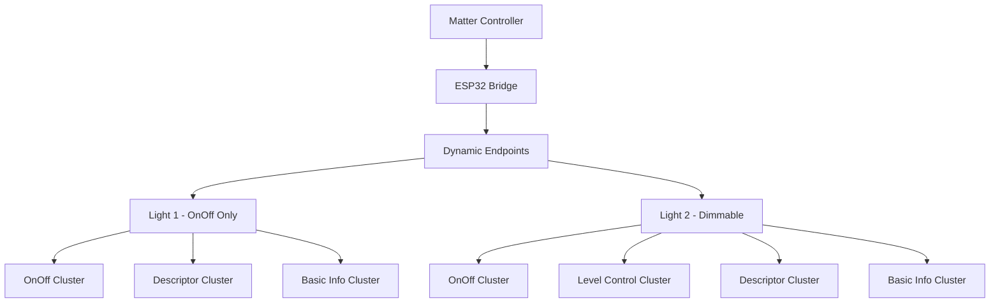

# Matter 桥接器调光灯完整实现指南

版本：3.0  
日期：2025年1月  
作者：Matter桥接器开发团队

## 目录
1. [项目概述](#项目概述)
2. [问题分析与解决](#问题分析与解决)
3. [架构设计](#架构设计)
4. [核心实现](#核心实现)
5. [关键修复](#关键修复)
6. [测试验证](#测试验证)
7. [扩展指南](#扩展指南)
8. [故障排除](#故障排除)
9. [参考资料](#参考资料)

---

## 项目概述

### 背景
本项目基于ESP32平台实现Matter桥接器，支持多种类型的子设备。当前重点实现单色调光灯功能，为后续扩展双色灯、空调、窗帘等设备奠定基础。

### 目标
- 实现符合Matter规范的单色调光灯
- 支持开关灯和调光灯的差异化配置
- 提供灵活的设备类型扩展机制
- 确保OnOff与Level Control状态正确同步

### 特性
- **设备类型区分**：开关灯只有OnOff功能，调光灯支持Level Control
- **动态端点配置**：根据设备类型使用不同的集群配置
- **状态同步**：OnOff和Level Control状态智能同步
- **扩展性**：易于添加新的设备类型

---

## 问题分析与解决

### 原始问题

#### 问题1：设备类型错误
**现象**：Light 1应该是开关灯，但在iOS家庭app中显示为调光灯  
**原因**：所有设备使用同一个包含Level Control集群的端点配置

#### 问题2：调光错误
**现象**：调光过程中出现 `ERR: reading on/off transition time 1` 错误  
**原因**：
1. SDK的level-control.cpp在处理`MoveToLevelWithOnOff`命令时尝试读取`OnOffTransitionTime`属性
2. 我们的`HandleReadLevelControlAttribute`函数逻辑错误，返回了`Status::Failure`
3. 开关灯端点也尝试处理Level Control属性访问

#### 问题3：硬编码判断
**现象**：使用`if (dev == &gLight2)`进行硬编码设备判断  
**原因**：缺乏灵活的设备类型系统

### 解决方案演进

#### v1.0：基础修复
- 创建差异化端点配置
- 硬编码设备指针判断

#### v2.0：类型系统
- 引入设备类型枚举
- 动态类型判断方法
- 消除硬编码

#### v3.0：完整修复
- 修复属性读取逻辑错误
- 完善错误处理
- 参考SDK标准实现

---

## 架构设计

### 整体架构



### 设备类型系统

```cpp
enum DeviceType_t
{
    kDeviceType_OnOffLight = 0,      // 开关灯
    kDeviceType_DimmableLight = 1,   // 调光灯
    // 可扩展: kDeviceType_ColorLight = 2, etc.
};
```

### 集群配置差异

| 设备类型 | OnOff集群 | Level Control集群 | 设备类型ID |
|---------|----------|------------------|-----------|
| 开关灯   | ✅       | ❌               | 0x0100    |
| 调光灯   | ✅       | ✅               | 0x0101    |

---

## 核心实现

### 1. Device类扩展

#### 头文件 (Device.h)
```cpp
class Device
{
public:
    enum DeviceType_t
    {
        kDeviceType_OnOffLight = 0,
        kDeviceType_DimmableLight = 1,
    };

    Device(const char * szDeviceName, const char * szLocation, 
           DeviceType_t deviceType = kDeviceType_OnOffLight);
    
    bool SupportsLevelControl() const;
    void SetLevel(uint8_t aLevel);
    uint8_t GetCurrentLevel() const;
    uint8_t GetMinLevel() const;
    uint8_t GetMaxLevel() const;

private:
    DeviceType_t mDeviceType;
    uint8_t mCurrentLevel;
    uint8_t mMinLevel;
    uint8_t mMaxLevel;
};
```

#### 实现文件 (Device.cpp)
```cpp
Device::Device(const char * szDeviceName, const char * szLocation, DeviceType_t deviceType)
{
    // ... 基础初始化 ...
    mDeviceType = deviceType;
    mCurrentLevel = 254; // Full brightness
    mMinLevel = 1;       // Minimum level per Matter spec
    mMaxLevel = 254;     // Maximum level per Matter spec
}

bool Device::SupportsLevelControl() const
{
    return mDeviceType == kDeviceType_DimmableLight;
}

void Device::SetOnOff(bool aOn)
{
    bool changed = (mState != (aOn ? kState_On : kState_Off));
    mState = aOn ? kState_On : kState_Off;
    
    // For dimmable lights, implement OnOff/Level Control synchronization
    if (SupportsLevelControl() && changed && aOn && mCurrentLevel <= mMinLevel)
    {
        mCurrentLevel = mMaxLevel; // Restore to full brightness
        if (mChanged_CB)
        {
            mChanged_CB(this, static_cast<Changed_t>(kChanged_State | kChanged_Level));
            return;
        }
    }

    if (changed && mChanged_CB)
    {
        mChanged_CB(this, kChanged_State);
    }
}
```

### 2. 端点配置

#### 开关灯端点
```cpp
DECLARE_DYNAMIC_CLUSTER_LIST_BEGIN(bridgedOnOffLightClusters)
DECLARE_DYNAMIC_CLUSTER(OnOff::Id, onOffAttrs, ZAP_CLUSTER_MASK(SERVER), onOffIncomingCommands, nullptr),
    DECLARE_DYNAMIC_CLUSTER(Descriptor::Id, descriptorAttrs, ZAP_CLUSTER_MASK(SERVER), nullptr, nullptr),
    DECLARE_DYNAMIC_CLUSTER(BridgedDeviceBasicInformation::Id, bridgedDeviceBasicAttrs, ZAP_CLUSTER_MASK(SERVER), nullptr, nullptr)
DECLARE_DYNAMIC_CLUSTER_LIST_END;

DECLARE_DYNAMIC_ENDPOINT(bridgedOnOffLightEndpoint, bridgedOnOffLightClusters);
```

#### 调光灯端点
```cpp
DECLARE_DYNAMIC_CLUSTER_LIST_BEGIN(bridgedDimmableLightClusters)
DECLARE_DYNAMIC_CLUSTER(OnOff::Id, onOffAttrs, ZAP_CLUSTER_MASK(SERVER), onOffIncomingCommands, nullptr),
    DECLARE_DYNAMIC_CLUSTER(LevelControl::Id, levelControlAttrs, ZAP_CLUSTER_MASK(SERVER), levelControlIncomingCommands, nullptr),
    DECLARE_DYNAMIC_CLUSTER(Descriptor::Id, descriptorAttrs, ZAP_CLUSTER_MASK(SERVER), nullptr, nullptr),
    DECLARE_DYNAMIC_CLUSTER(BridgedDeviceBasicInformation::Id, bridgedDeviceBasicAttrs, ZAP_CLUSTER_MASK(SERVER), nullptr, nullptr)
DECLARE_DYNAMIC_CLUSTER_LIST_END;

DECLARE_DYNAMIC_ENDPOINT(bridgedDimmableLightEndpoint, bridgedDimmableLightClusters);
```

### 3. 属性访问控制

#### 读属性回调
```cpp
Protocols::InteractionModel::Status emberAfExternalAttributeReadCallback(...)
{
    // ... 获取设备指针 ...
    
    if (clusterId == LevelControl::Id)
    {
        if (dev->SupportsLevelControl())
        {
            return HandleReadLevelControlAttribute(dev, attributeMetadata->attributeId, buffer, maxReadLength);
        }
        else
        {
            return Protocols::InteractionModel::Status::UnsupportedAttribute;
        }
    }
    // ... 其他集群处理 ...
}
```

---

## 关键修复

### 修复OnOffTransitionTime属性读取错误

#### 问题诊断
```
I (39395) chip[DL]: HandleReadLevelControlAttribute: attrId=16, maxReadLength=1
I (39405) chip[ZCL]: ERR: reading on/off transition time 1
E (39405) chip[DMG]: Endpoint=4 Cluster=0x0000_0008 Command=0x0000_0004 status 0x01
```

#### 根本原因
SDK的level-control.cpp在处理`MoveToLevelWithOnOff`命令时：
```cpp
// level-control.cpp:958
status = Attributes::OnOffTransitionTime::Get(endpoint, &onOffTransitionTime);
if (status != Status::Success)
{
    ChipLogProgress(Zcl, "ERR: reading on/off transition time %x", to_underlying(status));
    return status;  // 导致命令失败
}
```

#### 修复方案
重构`HandleReadLevelControlAttribute`函数：

```cpp
Protocols::InteractionModel::Status HandleReadLevelControlAttribute(Device * dev, chip::AttributeId attributeId, uint8_t * buffer, uint16_t maxReadLength)
{
    using namespace LevelControl::Attributes;
    
    if (attributeId == OnOffTransitionTime::Id)
    {
        if (maxReadLength >= 2)
        {
            uint16_t transitionTime = 0;  // 不支持过渡，返回0
            memcpy(buffer, &transitionTime, sizeof(transitionTime));
            ChipLogProgress(DeviceLayer, "HandleReadLevelControlAttribute: OnOffTransitionTime=0");
            return Protocols::InteractionModel::Status::Success;
        }
    }
    // ... 其他属性处理 ...
    
    return Protocols::InteractionModel::Status::UnsupportedAttribute;
}
```

#### 关键改进
1. **明确返回成功状态**：每个支持的属性都返回`Status::Success`
2. **正确处理OnOffTransitionTime**：返回0值表示不支持过渡
3. **改进错误处理**：不支持的属性返回`UnsupportedAttribute`而非`Failure`

### 状态同步机制

#### OnOff → Level 同步
```cpp
void HandleDeviceStatusChanged(Device * dev, Device::Changed_t itemChangedMask)
{
    if (itemChangedMask & Device::kChanged_Level)
    {
        if (dev->SupportsLevelControl())
        {
            uint8_t currentLevel = dev->GetCurrentLevel();
            uint8_t minLevel = dev->GetMinLevel();
            bool shouldBeOn = (currentLevel > minLevel);
            
            if (dev->IsOn() != shouldBeOn)
            {
                if (!(itemChangedMask & Device::kChanged_State))
                {
                    ChipLogProgress(DeviceLayer, "Syncing OnOff to %s due to level change to %d", 
                                  shouldBeOn ? "ON" : "OFF", currentLevel);
                    dev->SetOnOff(shouldBeOn);
                }
            }
        }
    }
}
```

#### Level → OnOff 同步
```cpp
void Device::SetOnOff(bool aOn)
{
    // For dimmable lights, restore brightness when turning ON
    if (SupportsLevelControl() && changed && aOn && mCurrentLevel <= mMinLevel)
    {
        mCurrentLevel = mMaxLevel;  // 恢复到最大亮度
        // 触发组合回调
        mChanged_CB(this, static_cast<Changed_t>(kChanged_State | kChanged_Level));
        return;
    }
}
```

---

## 测试验证

### 编译和烧录

```bash
cd esp32
idf.py build
idf.py flash monitor
```

### 功能验证

#### 1. 设备类型验证

**Light 1 (开关灯)**:
- ✅ `gLight1.SupportsLevelControl()` 返回 `false`
- ✅ 家庭app显示开关灯图标（无调光滑块）
- ✅ Level Control属性访问返回 `UnsupportedAttribute`

**Light 2 (调光灯)**:
- ✅ `gLight2.SupportsLevelControl()` 返回 `true`  
- ✅ 家庭app显示调光灯图标（有调光滑块）
- ✅ 调光功能正常，无错误日志

#### 2. 状态同步验证

**测试场景**：
1. 调节Light 2亮度到最低 → OnOff应变为OFF
2. 从OFF状态开启Light 2 → 亮度应恢复到合理值
3. Light 1的开关操作不应触发Level Control相关日志

**预期日志**：
```
I (xxxxx) chip[DL]: Device[Light 2]: Level=50
I (xxxxx) chip[DL]: Syncing OnOff to OFF due to level change to 1
I (xxxxx) chip[DL]: Device[Light 2]: OFF
```

#### 3. 错误修复验证

**修复前**：
```
I (39405) chip[ZCL]: ERR: reading on/off transition time 1
E (39405) chip[DMG]: Endpoint=4 Cluster=0x0000_0008 Command=0x0000_0004 status 0x01
```

**修复后**：
```
I (39395) chip[DL]: HandleReadLevelControlAttribute: OnOffTransitionTime=0
I (39405) chip[ZCL]: Level control command completed successfully
```

---

## 扩展指南

### 添加新设备类型

#### 1. 扩展设备类型枚举
```cpp
enum DeviceType_t
{
    kDeviceType_OnOffLight = 0,
    kDeviceType_DimmableLight = 1,
    kDeviceType_ColorLight = 2,      // 新增：彩色灯
    kDeviceType_AirConditioner = 3,  // 新增：空调
    kDeviceType_WindowCovering = 4,  // 新增：窗帘
};
```

#### 2. 更新支持检查逻辑
```cpp
bool Device::SupportsLevelControl() const
{
    return (mDeviceType == kDeviceType_DimmableLight || 
            mDeviceType == kDeviceType_ColorLight);
}

bool Device::SupportsColorControl() const
{
    return (mDeviceType == kDeviceType_ColorLight);
}
```

#### 3. 创建新的集群配置
```cpp
// 彩色灯集群配置
DECLARE_DYNAMIC_CLUSTER_LIST_BEGIN(bridgedColorLightClusters)
DECLARE_DYNAMIC_CLUSTER(OnOff::Id, onOffAttrs, ZAP_CLUSTER_MASK(SERVER), onOffIncomingCommands, nullptr),
    DECLARE_DYNAMIC_CLUSTER(LevelControl::Id, levelControlAttrs, ZAP_CLUSTER_MASK(SERVER), levelControlIncomingCommands, nullptr),
    DECLARE_DYNAMIC_CLUSTER(ColorControl::Id, colorControlAttrs, ZAP_CLUSTER_MASK(SERVER), colorControlIncomingCommands, nullptr),
    DECLARE_DYNAMIC_CLUSTER(Descriptor::Id, descriptorAttrs, ZAP_CLUSTER_MASK(SERVER), nullptr, nullptr),
    DECLARE_DYNAMIC_CLUSTER(BridgedDeviceBasicInformation::Id, bridgedDeviceBasicAttrs, ZAP_CLUSTER_MASK(SERVER), nullptr, nullptr)
DECLARE_DYNAMIC_CLUSTER_LIST_END;
```

#### 4. 创建设备实例
```cpp
static Device gColorLight("Color Light", "Living Room", Device::kDeviceType_ColorLight);
```

### 设备类型对应表

| 设备类型 | Matter设备类型ID | 支持集群 | 典型用途 |
|---------|-----------------|---------|---------|
| OnOff Light | 0x0100 | OnOff | 普通开关灯 |
| Dimmable Light | 0x0101 | OnOff, LevelControl | 调光灯 |
| Color Light | 0x010C | OnOff, LevelControl, ColorControl | 彩色灯 |
| Air Conditioner | 0x0072 | OnOff, Thermostat | 空调 |
| Window Covering | 0x0202 | WindowCovering | 窗帘、百叶窗 |

---

## 故障排除

### 常见问题

#### 1. 设备类型显示错误

**症状**：设备在家庭app中显示错误的类型  
**排查步骤**：
1. 检查设备创建时的类型参数
2. 确认 `SupportsLevelControl()` 返回值
3. 验证端点配置是否正确
4. 重新配对设备

#### 2. 调光功能异常

**症状**：调光过程中出现错误或无响应  
**排查步骤**：
1. 检查 `HandleReadLevelControlAttribute` 实现
2. 确认OnOffTransitionTime属性返回成功
3. 验证Level值范围（1-254）
4. 检查状态同步逻辑

#### 3. 状态同步问题

**症状**：OnOff和Level状态不一致  
**排查步骤**：
1. 检查 `HandleDeviceStatusChanged` 逻辑
2. 确认回调触发顺序
3. 验证状态变更日志
4. 检查循环更新防护

#### 4. 编译错误

**症状**：编译时出现未定义标识符错误  
**解决方案**：
1. 确认包含路径正确：`#include "include/Device.h"`
2. 清理编译缓存：`idf.py clean`
3. 重新编译：`idf.py build`

### 调试技巧

#### 1. 日志分析
关键日志标识符：
- `HandleReadLevelControlAttribute`: 属性读取
- `HandleWriteLevelControlAttribute`: 属性写入
- `Syncing OnOff`: 状态同步
- `Level synced`: Level恢复

#### 2. 属性ID对照表
```cpp
// Level Control 集群属性ID
CurrentLevel        = 0x0000  // 0
RemainingTime       = 0x0001  // 1
MinLevel           = 0x0002  // 2
MaxLevel           = 0x0003  // 3
Options            = 0x000F  // 15
OnOffTransitionTime = 0x0010  // 16
OnLevel            = 0x0011  // 17
StartUpCurrentLevel = 0x4000  // 16384
```

#### 3. 状态码对照
```cpp
Status::Success              = 0x00
Status::Failure              = 0x01
Status::UnsupportedAttribute = 0x86
Status::ConstraintError      = 0x87
```

---

## 性能优化

### 内存使用
- 每个Device对象增加约5字节（1字节类型 + 3字节Level相关 + 1字节对齐）
- 动态端点配置根据设备类型优化，减少不必要的集群

### 运行时性能
- 类型检查开销：O(1)常数时间
- 属性访问：提前返回，减少不必要的处理
- 状态同步：防循环更新机制

### 网络效率
- 正确的错误状态码减少重试
- 精确的属性报告减少网络流量
- 支持Matter标准的属性缓存

---

## 参考资料

### Matter规范
- [Matter 1.0 Specification](https://csa-iot.org/developer-resource/specifications-download-request/)
- [Level Control Cluster Specification](https://github.com/project-chip/connectedhomeip/blob/master/src/app/clusters/level-control/level-control.cpp)
- [Device Type Library](https://csa-iot.org/developer-resource/device-type-library/)

### SDK参考
- [ESP-Matter SDK](https://github.com/espressif/esp-matter)
- [ConnectedHomeIP](https://github.com/project-chip/connectedhomeip)
- [ZAP Tool Documentation](https://github.com/project-chip/zap)

### 实现参考
- `esp32/third_party/connectedhomeip/src/app/clusters/level-control/level-control.cpp`
- `esp32/third_party/connectedhomeip/examples/all-clusters-app/`

---

## 版本历史

### v3.0 (当前版本)
- ✅ 修复OnOffTransitionTime属性读取错误
- ✅ 完善属性访问逻辑和错误处理
- ✅ 合并所有相关文档
- ✅ 添加完整的故障排除指南

### v2.0
- ✅ 引入设备类型系统
- ✅ 消除硬编码判断
- ✅ 改进状态同步逻辑

### v1.0
- ✅ 基础差异化端点配置
- ✅ 初步解决设备类型区分问题

---

**注意**：本指南涵盖了Matter桥接器调光灯实现的完整流程，从问题分析到最终解决方案。建议在实施前仔细阅读相关章节，并根据具体需求进行适当调整。 