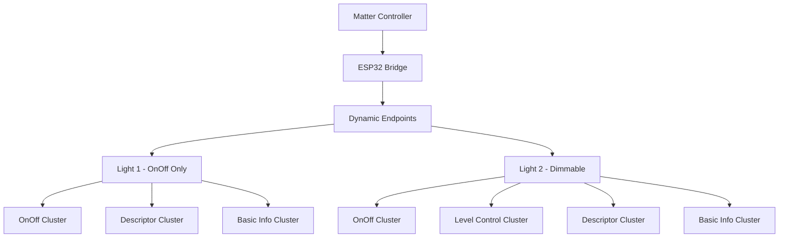
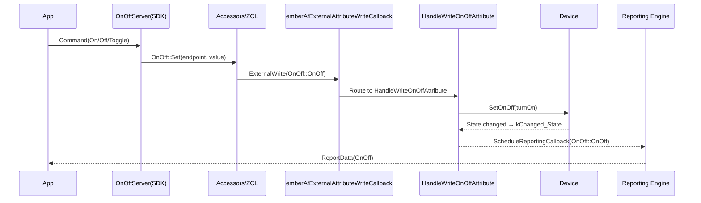
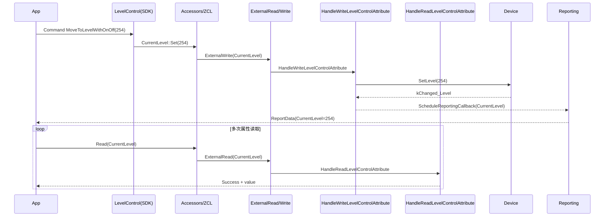
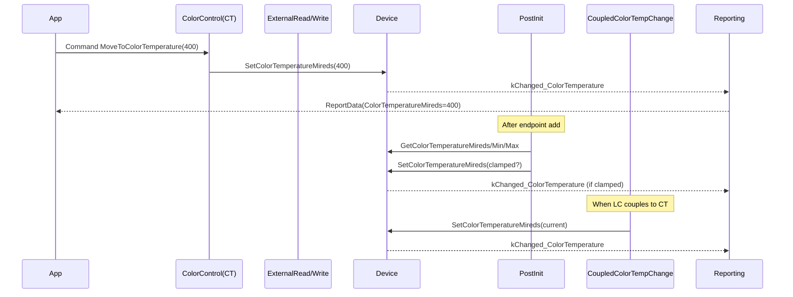

# Matter 桥接器调光灯完整实现指南

版本：3.0  
日期：2025年1月  
作者：Matter桥接器开发团队

## 目录
1. [项目概述](#项目概述)
2. [问题分析与解决](#问题分析与解决)
3. [架构设计](#架构设计)
4. [核心实现](#核心实现)
5. [关键修复](#关键修复)
6. [测试验证](#测试验证)
7. [扩展指南](#扩展指南)
8. [故障排除](#故障排除)
9. [参考资料](#参考资料)

---

## 项目概述

### 背景
本项目基于ESP32平台实现Matter桥接器，支持多种类型的子设备。当前重点实现单色调光灯功能，为后续扩展双色灯、空调、窗帘等设备奠定基础。

### 目标
- 实现符合Matter规范的单色调光灯
- 支持开关灯和调光灯的差异化配置
- 提供灵活的设备类型扩展机制
- 确保OnOff与Level Control状态正确同步

### 特性
- **设备类型区分**：开关灯只有OnOff功能，调光灯支持Level Control
- **动态端点配置**：根据设备类型使用不同的集群配置
- **状态同步**：OnOff和Level Control状态智能同步
- **扩展性**：易于添加新的设备类型

---

## 问题分析与解决

### 原始问题

#### 问题1：设备类型错误
**现象**：Light 1应该是开关灯，但在iOS家庭app中显示为调光灯  
**原因**：所有设备使用同一个包含Level Control集群的端点配置

#### 问题2：调光错误
**现象**：调光过程中出现 `ERR: reading on/off transition time 1` 错误  
**原因**：
1. SDK的level-control.cpp在处理`MoveToLevelWithOnOff`命令时尝试读取`OnOffTransitionTime`属性
2. 我们的`HandleReadLevelControlAttribute`函数逻辑错误，返回了`Status::Failure`
3. 开关灯端点也尝试处理Level Control属性访问

#### 问题3：硬编码判断
**现象**：使用`if (dev == &gLight2)`进行硬编码设备判断  
**原因**：缺乏灵活的设备类型系统

### 解决方案演进

#### v1.0：基础修复
- 创建差异化端点配置
- 硬编码设备指针判断

#### v2.0：类型系统
- 引入设备类型枚举
- 动态类型判断方法
- 消除硬编码

#### v3.0：完整修复
- 修复属性读取逻辑错误
- 完善错误处理
- 参考SDK标准实现

---

## 架构设计

### 整体架构



### 设备类型系统

```cpp
enum DeviceType_t
{
    kDeviceType_OnOffLight = 0,      // 开关灯
    kDeviceType_DimmableLight = 1,   // 调光灯
    // 可扩展: kDeviceType_ColorLight = 2, etc.
};
```

### 集群配置差异

| 设备类型 | OnOff集群 | Level Control集群 | 设备类型ID |
|---------|----------|------------------|-----------|
| 开关灯   | ✅       | ❌               | 0x0100    |
| 调光灯   | ✅       | ✅               | 0x0101    |

---

## 核心实现

### 1. Device类扩展

#### 头文件 (Device.h)
```cpp
class Device
{
public:
    enum DeviceType_t
    {
        kDeviceType_OnOffLight = 0,
        kDeviceType_DimmableLight = 1,
    };

    Device(const char * szDeviceName, const char * szLocation, 
           DeviceType_t deviceType = kDeviceType_OnOffLight);
    
    bool SupportsLevelControl() const;
    void SetLevel(uint8_t aLevel);
    uint8_t GetCurrentLevel() const;
    uint8_t GetMinLevel() const;
    uint8_t GetMaxLevel() const;

private:
    DeviceType_t mDeviceType;
    uint8_t mCurrentLevel;
    uint8_t mMinLevel;
    uint8_t mMaxLevel;
};
```

#### 实现文件 (Device.cpp)
```cpp
Device::Device(const char * szDeviceName, const char * szLocation, DeviceType_t deviceType)
{
    // ... 基础初始化 ...
    mDeviceType = deviceType;
    mCurrentLevel = 254; // Full brightness
    mMinLevel = 1;       // Minimum level per Matter spec
    mMaxLevel = 254;     // Maximum level per Matter spec
}

bool Device::SupportsLevelControl() const
{
    return mDeviceType == kDeviceType_DimmableLight;
}

void Device::SetOnOff(bool aOn)
{
    bool changed = (mState != (aOn ? kState_On : kState_Off));
    mState = aOn ? kState_On : kState_Off;
    
    // For dimmable lights, implement OnOff/Level Control synchronization
    if (SupportsLevelControl() && changed && aOn && mCurrentLevel <= mMinLevel)
    {
        mCurrentLevel = mMaxLevel; // Restore to full brightness
        if (mChanged_CB)
        {
            mChanged_CB(this, static_cast<Changed_t>(kChanged_State | kChanged_Level));
            return;
        }
    }

    if (changed && mChanged_CB)
    {
        mChanged_CB(this, kChanged_State);
    }
}
```

### 2. 端点配置

#### 开关灯端点
```cpp
DECLARE_DYNAMIC_CLUSTER_LIST_BEGIN(bridgedOnOffLightClusters)
DECLARE_DYNAMIC_CLUSTER(OnOff::Id, onOffAttrs, ZAP_CLUSTER_MASK(SERVER), onOffIncomingCommands, nullptr),
    DECLARE_DYNAMIC_CLUSTER(Descriptor::Id, descriptorAttrs, ZAP_CLUSTER_MASK(SERVER), nullptr, nullptr),
    DECLARE_DYNAMIC_CLUSTER(BridgedDeviceBasicInformation::Id, bridgedDeviceBasicAttrs, ZAP_CLUSTER_MASK(SERVER), nullptr, nullptr)
DECLARE_DYNAMIC_CLUSTER_LIST_END;

DECLARE_DYNAMIC_ENDPOINT(bridgedOnOffLightEndpoint, bridgedOnOffLightClusters);
```

#### 调光灯端点
```cpp
DECLARE_DYNAMIC_CLUSTER_LIST_BEGIN(bridgedDimmableLightClusters)
DECLARE_DYNAMIC_CLUSTER(OnOff::Id, onOffAttrs, ZAP_CLUSTER_MASK(SERVER), onOffIncomingCommands, nullptr),
    DECLARE_DYNAMIC_CLUSTER(LevelControl::Id, levelControlAttrs, ZAP_CLUSTER_MASK(SERVER), levelControlIncomingCommands, nullptr),
    DECLARE_DYNAMIC_CLUSTER(Descriptor::Id, descriptorAttrs, ZAP_CLUSTER_MASK(SERVER), nullptr, nullptr),
    DECLARE_DYNAMIC_CLUSTER(BridgedDeviceBasicInformation::Id, bridgedDeviceBasicAttrs, ZAP_CLUSTER_MASK(SERVER), nullptr, nullptr)
DECLARE_DYNAMIC_CLUSTER_LIST_END;

DECLARE_DYNAMIC_ENDPOINT(bridgedDimmableLightEndpoint, bridgedDimmableLightClusters);
```

### 3. 属性访问控制

#### 读属性回调
```cpp
Protocols::InteractionModel::Status emberAfExternalAttributeReadCallback(...)
{
    // ... 获取设备指针 ...
    
    if (clusterId == LevelControl::Id)
    {
        if (dev->SupportsLevelControl())
        {
            return HandleReadLevelControlAttribute(dev, attributeMetadata->attributeId, buffer, maxReadLength);
        }
        else
        {
            return Protocols::InteractionModel::Status::UnsupportedAttribute;
        }
    }
    // ... 其他集群处理 ...
}
```

---

## 关键修复

### 修复OnOffTransitionTime属性读取错误

#### 问题诊断
```
I (39395) chip[DL]: HandleReadLevelControlAttribute: attrId=16, maxReadLength=1
I (39405) chip[ZCL]: ERR: reading on/off transition time 1
E (39405) chip[DMG]: Endpoint=4 Cluster=0x0000_0008 Command=0x0000_0004 status 0x01
```

#### 根本原因
SDK的level-control.cpp在处理`MoveToLevelWithOnOff`命令时：
```cpp
// level-control.cpp:958
status = Attributes::OnOffTransitionTime::Get(endpoint, &onOffTransitionTime);
if (status != Status::Success)
{
    ChipLogProgress(Zcl, "ERR: reading on/off transition time %x", to_underlying(status));
    return status;  // 导致命令失败
}
```

#### 修复方案
重构`HandleReadLevelControlAttribute`函数：

```cpp
Protocols::InteractionModel::Status HandleReadLevelControlAttribute(Device * dev, chip::AttributeId attributeId, uint8_t * buffer, uint16_t maxReadLength)
{
    using namespace LevelControl::Attributes;
    
    if (attributeId == OnOffTransitionTime::Id)
    {
        if (maxReadLength >= 2)
        {
            uint16_t transitionTime = 0;  // 不支持过渡，返回0
            memcpy(buffer, &transitionTime, sizeof(transitionTime));
            ChipLogProgress(DeviceLayer, "HandleReadLevelControlAttribute: OnOffTransitionTime=0");
            return Protocols::InteractionModel::Status::Success;
        }
    }
    // ... 其他属性处理 ...
    
    return Protocols::InteractionModel::Status::UnsupportedAttribute;
}
```

#### 关键改进
1. **明确返回成功状态**：每个支持的属性都返回`Status::Success`
2. **正确处理OnOffTransitionTime**：返回0值表示不支持过渡
3. **改进错误处理**：不支持的属性返回`UnsupportedAttribute`而非`Failure`

### 状态同步机制

#### OnOff → Level 同步
```cpp
void HandleDeviceStatusChanged(Device * dev, Device::Changed_t itemChangedMask)
{
    if (itemChangedMask & Device::kChanged_Level)
    {
        if (dev->SupportsLevelControl())
        {
            uint8_t currentLevel = dev->GetCurrentLevel();
            uint8_t minLevel = dev->GetMinLevel();
            bool shouldBeOn = (currentLevel > minLevel);
            
            if (dev->IsOn() != shouldBeOn)
            {
                if (!(itemChangedMask & Device::kChanged_State))
                {
                    ChipLogProgress(DeviceLayer, "Syncing OnOff to %s due to level change to %d", 
                                  shouldBeOn ? "ON" : "OFF", currentLevel);
                    dev->SetOnOff(shouldBeOn);
                }
            }
        }
    }
}
```

#### Level → OnOff 同步
```cpp
void Device::SetOnOff(bool aOn)
{
    // For dimmable lights, restore brightness when turning ON
    if (SupportsLevelControl() && changed && aOn && mCurrentLevel <= mMinLevel)
    {
        mCurrentLevel = mMaxLevel;  // 恢复到最大亮度
        // 触发组合回调
        mChanged_CB(this, static_cast<Changed_t>(kChanged_State | kChanged_Level));
        return;
    }
}
```

---

## 测试验证

### 编译和烧录

```bash
cd esp32
idf.py build
idf.py flash monitor
```

### 功能验证

#### 1. 设备类型验证

**Light 1 (开关灯)**:
- ✅ `gLight1.SupportsLevelControl()` 返回 `false`
- ✅ 家庭app显示开关灯图标（无调光滑块）
- ✅ Level Control属性访问返回 `UnsupportedAttribute`

**Light 2 (调光灯)**:
- ✅ `gLight2.SupportsLevelControl()` 返回 `true`  
- ✅ 家庭app显示调光灯图标（有调光滑块）
- ✅ 调光功能正常，无错误日志

#### 2. 状态同步验证

**测试场景**：
1. 调节Light 2亮度到最低 → OnOff应变为OFF
2. 从OFF状态开启Light 2 → 亮度应恢复到合理值
3. Light 1的开关操作不应触发Level Control相关日志

**预期日志**：
```
I (xxxxx) chip[DL]: Device[Light 2]: Level=50
I (xxxxx) chip[DL]: Syncing OnOff to OFF due to level change to 1
I (xxxxx) chip[DL]: Device[Light 2]: OFF
```

#### 3. 错误修复验证

**修复前**：
```
I (39405) chip[ZCL]: ERR: reading on/off transition time 1
E (39405) chip[DMG]: Endpoint=4 Cluster=0x0000_0008 Command=0x0000_0004 status 0x01
```

**修复后**：
```
I (39395) chip[DL]: HandleReadLevelControlAttribute: OnOffTransitionTime=0
I (39405) chip[ZCL]: Level control command completed successfully
```

---

## 扩展指南

### 添加新设备类型

#### 1. 扩展设备类型枚举
```cpp
enum DeviceType_t
{
    kDeviceType_OnOffLight = 0,
    kDeviceType_DimmableLight = 1,
    kDeviceType_ColorLight = 2,      // 新增：彩色灯
    kDeviceType_AirConditioner = 3,  // 新增：空调
    kDeviceType_WindowCovering = 4,  // 新增：窗帘
};
```

#### 2. 更新支持检查逻辑
```cpp
bool Device::SupportsLevelControl() const
{
    return (mDeviceType == kDeviceType_DimmableLight || 
            mDeviceType == kDeviceType_ColorLight);
}

bool Device::SupportsColorControl() const
{
    return (mDeviceType == kDeviceType_ColorLight);
}
```

#### 3. 创建新的集群配置
```cpp
// 彩色灯集群配置
DECLARE_DYNAMIC_CLUSTER_LIST_BEGIN(bridgedColorLightClusters)
DECLARE_DYNAMIC_CLUSTER(OnOff::Id, onOffAttrs, ZAP_CLUSTER_MASK(SERVER), onOffIncomingCommands, nullptr),
    DECLARE_DYNAMIC_CLUSTER(LevelControl::Id, levelControlAttrs, ZAP_CLUSTER_MASK(SERVER), levelControlIncomingCommands, nullptr),
    DECLARE_DYNAMIC_CLUSTER(ColorControl::Id, colorControlAttrs, ZAP_CLUSTER_MASK(SERVER), colorControlIncomingCommands, nullptr),
    DECLARE_DYNAMIC_CLUSTER(Descriptor::Id, descriptorAttrs, ZAP_CLUSTER_MASK(SERVER), nullptr, nullptr),
    DECLARE_DYNAMIC_CLUSTER(BridgedDeviceBasicInformation::Id, bridgedDeviceBasicAttrs, ZAP_CLUSTER_MASK(SERVER), nullptr, nullptr)
DECLARE_DYNAMIC_CLUSTER_LIST_END;
```

#### 4. 创建设备实例
```cpp
static Device gColorLight("Color Light", "Living Room", Device::kDeviceType_ColorLight);
```

### 设备类型对应表

| 设备类型 | Matter设备类型ID | 支持集群 | 典型用途 |
|---------|-----------------|---------|---------|
| OnOff Light | 0x0100 | OnOff | 普通开关灯 |
| Dimmable Light | 0x0101 | OnOff, LevelControl | 调光灯 |
| Color Light | 0x010C | OnOff, LevelControl, ColorControl | 彩色灯 |
| Air Conditioner | 0x0072 | OnOff, Thermostat | 空调 |
| Window Covering | 0x0202 | WindowCovering | 窗帘、百叶窗 |

---

## 故障排除

### 常见问题

#### 1. 设备类型显示错误

**症状**：设备在家庭app中显示错误的类型  
**排查步骤**：
1. 检查设备创建时的类型参数
2. 确认 `SupportsLevelControl()` 返回值
3. 验证端点配置是否正确
4. 重新配对设备

#### 2. 调光功能异常

**症状**：调光过程中出现错误或无响应  
**排查步骤**：
1. 检查 `HandleReadLevelControlAttribute` 实现
2. 确认OnOffTransitionTime属性返回成功
3. 验证Level值范围（1-254）
4. 检查状态同步逻辑

#### 3. 状态同步问题

**症状**：OnOff和Level状态不一致  
**排查步骤**：
1. 检查 `HandleDeviceStatusChanged` 逻辑
2. 确认回调触发顺序
3. 验证状态变更日志
4. 检查循环更新防护

#### 4. 编译错误

**症状**：编译时出现未定义标识符错误  
**解决方案**：
1. 确认包含路径正确：`#include "include/Device.h"`
2. 清理编译缓存：`idf.py clean`
3. 重新编译：`idf.py build`

### 调试技巧

#### 1. 日志分析
关键日志标识符：
- `HandleReadLevelControlAttribute`: 属性读取
- `HandleWriteLevelControlAttribute`: 属性写入
- `Syncing OnOff`: 状态同步
- `Level synced`: Level恢复

#### 2. 属性ID对照表
```cpp
// Level Control 集群属性ID
CurrentLevel        = 0x0000  // 0
RemainingTime       = 0x0001  // 1
MinLevel           = 0x0002  // 2
MaxLevel           = 0x0003  // 3
Options            = 0x000F  // 15
OnOffTransitionTime = 0x0010  // 16
OnLevel            = 0x0011  // 17
StartUpCurrentLevel = 0x4000  // 16384
```

#### 3. 状态码对照
```cpp
Status::Success              = 0x00
Status::Failure              = 0x01
Status::UnsupportedAttribute = 0x86
Status::ConstraintError      = 0x87
```

---

## 性能优化

### 内存使用
- 每个Device对象增加约5字节（1字节类型 + 3字节Level相关 + 1字节对齐）
- 动态端点配置根据设备类型优化，减少不必要的集群

### 运行时性能
- 类型检查开销：O(1)常数时间
- 属性访问：提前返回，减少不必要的处理
- 状态同步：防循环更新机制

### 网络效率
- 正确的错误状态码减少重试
- 精确的属性报告减少网络流量
- 支持Matter标准的属性缓存

---

## 核心调用链与函数解释（结合当前代码）

> 相关源码：
> - `esp32/main/main.cpp`
> - `esp32/main/include/Device.h`
> - `esp32/main/Device.cpp`

### 设备抽象（Device）
- `class Device`
  - 设备状态统一入口，桥接真实子设备。
  - 关键字段：
    - `mDeviceType`：设备类型（`kDeviceType_OnOffLight` / `kDeviceType_DimmableLight`）
    - `mCurrentLevel`、`mMinLevel`、`mMaxLevel`：亮度（1-254）
    - `mCurrentColorTempMireds`、`mMinColorTempMireds`、`mMaxColorTempMireds`：色温（mireds）
  - 回调：`Device::DeviceCallback_fn mChanged_CB`
    - 设备状态变化后，调用 `mChanged_CB(this, Changed_t)` 通知上层。

- 亮度接口
  - `void SetLevel(uint8_t aLevel)`：钳制到 [min, max]，更新并触发 `kChanged_Level`
  - `uint8_t GetCurrentLevel() const`、`GetMinLevel()`、`GetMaxLevel()`

- 开关接口
  - `void SetOnOff(bool aOn)`：设置开关并触发 `kChanged_State`

- 色温接口（双色灯/CT）
  - `void SetColorTemperatureMireds(uint16_t mireds)`：钳制到 [min, max]，更新并触发 `kChanged_ColorTemperature`
  - `uint16_t GetColorTemperatureMireds() const`、`GetMinColorTemperatureMireds()`、`GetMaxColorTemperatureMireds()`

- 变化类型（`Device::Changed_t`）
  - `kChanged_Reachable`、`kChanged_State`、`kChanged_Name`、`kChanged_Level`、`kChanged_ColorTemperature`

### 动态端点与集群
- 动态端点添加
  - `int AddDeviceEndpoint(Device * dev, EmberAfEndpointType * ep, ... )`
    - 运行期为桥接设备分配 Endpoint，并记录在 `gDevices[]`。

- 动态端点后置初始化（仅动态端点）
  - `static void PostInitClustersForEndpoint(EndpointId endpoint)`
    - 识别是否包含 `OnOff`、`LevelControl`、`ColorControl` 服务端集群。
    - Level：调用 `emberAfLevelControlClusterServerInitCallback(endpoint)` 初始化插件内部状态（min/max 等）。
    - CT：按设备色温范围钳制当前值，并必要时调度上报。

### 外部属性读写（桥接存储）
- 总入口（ZAP 生成调用）：
  - `emberAfExternalAttributeReadCallback(EndpointId, ClusterId, const EmberAfAttributeMetadata *, uint8_t * buffer, uint16_t maxReadLength)`
  - `emberAfExternalAttributeWriteCallback(EndpointId, ClusterId, const EmberAfAttributeMetadata *, uint8_t * buffer)`
  - 逻辑：查 `gDevices[dynamicIndex]` → 路由到集群专用处理函数。

- On/Off 集群
  - 读：`HandleReadOnOffAttribute(Device * dev, AttributeId, uint8_t * buffer, uint16_t maxReadLength)`
  - 写：`HandleWriteOnOffAttribute(Device * dev, AttributeId, uint8_t * buffer)`
    - 同步业务状态：`dev->SetOnOff(turnOn)`
    - 同步集群语义：`OnOffServer::Instance().setOnOffValue(...)`

- Level Control 集群
  - 读：`HandleReadLevelControlAttribute(Device * dev, AttributeId, uint8_t * buffer, uint16_t maxReadLength)`
    - 覆盖 `CurrentLevel/MinLevel/MaxLevel/RemainingTime/Options/OnOffTransitionTime/OnLevel/StartUpCurrentLevel/FeatureMap/ClusterRevision`
  - 写：`HandleWriteLevelControlAttribute(Device * dev, AttributeId, uint8_t * buffer)`
    - 路由 `CurrentLevel` 写 → `dev->SetLevel(level)`（触发 `kChanged_Level`）

- Color Control（色温）集群（双色灯）
  - 读：`HandleReadColorControlAttribute(Device * dev, AttributeId, uint8_t * buffer, uint16_t maxReadLength)`
    - 覆盖 `ColorTemperatureMireds/ColorTempPhysicalMin/MaxMireds/RemainingTime/ColorMode/EnhancedColorMode/ColorCapabilities/Options/StartUpColorTemperatureMireds/FeatureMap/ClusterRevision/CoupleColorTempToLevelMinMireds`
  - 写：`HandleWriteColorControlAttribute(Device * dev, AttributeId, uint8_t * buffer)`
    - 路由 `ColorTemperatureMireds` 写 → `dev->SetColorTemperatureMireds(target)`（触发 `kChanged_ColorTemperature`）

### 报告上报（Reporting）
- 统一调度：`void ScheduleReportingCallback(Device * dev, ClusterId cluster, AttributeId attribute)`
  - 构造 `ConcreteAttributePath`，在平台任务中异步触发 `MatterReportingAttributeChangeCallback`。
- 实际调用点（统一收敛）：
  - `void HandleDeviceStatusChanged(Device * dev, Device::Changed_t itemChangedMask)`
    - `kChanged_Reachable` → 上报 `BridgedDeviceBasicInformation::Reachable`
    - `kChanged_State` → 上报 `OnOff::OnOff`
    - `kChanged_Level` → 上报 `LevelControl::CurrentLevel`
    - `kChanged_ColorTemperature` → 上报 `ColorControl::ColorTemperatureMireds`

### 设备状态变更回调
- `void HandleDeviceStatusChanged(Device * dev, Device::Changed_t itemChangedMask)`
  - 统一从 `Device` 层变化出发，调度各属性上报；
  - 可在此函数内实现串口发送（当前通过 `NotifyMetricChange` 打日志，便于你替换为 UART 发送）。

---

## 端到端流程（示例）

### A. App 控制亮度（调光灯：MoveToLevel/WithOnOff 命令）
1) Controller 发送 `Level Control` 命令（如 `MoveToLevelWithOnOff`）
2) SDK `LevelControl` 插件处理命令（命令回调在 SDK 内），对目标 Level 做语义处理，并通过 Accessors 尝试 `CurrentLevel::Set(endpoint, value)`
3) 因为端点使用“外部属性存储”，`CurrentLevel::Set` 触发 `emberAfExternalAttributeWriteCallback(...)`
4) 我们的路由将其交给：`HandleWriteLevelControlAttribute(dev, attributeId, buffer)`
5) 该函数执行：`dev->SetLevel(level)`
   - `Device::SetLevel` 钳制到 [min, max]，变更则触发 `mChanged_CB(this, kChanged_Level)`
6) `HandleDeviceStatusChanged(dev, kChanged_Level)` 被调用：
   - 调用 `ScheduleReportingCallback(dev, LevelControl::Id, CurrentLevel::Id)`
   - 可在此处串口发送：`dev->GetEndpointId()`、`dev->GetName()`、`dev->GetCurrentLevel()`
7) Reporting 引擎汇总并向订阅者上报 `ReportData`

补充：若 Controller 直接写属性 `CurrentLevel`，流程从第 3 步开始相同。

### B. App 控制开关（On/Off 命令/写属性）
1) Controller 发送 `On/Off` 命令（或写 `OnOff` 属性）
2) 命令路径由 `OnOffServer` 处理；外部属性写路径触发 `emberAfExternalAttributeWriteCallback`
3) 进入 `HandleWriteOnOffAttribute(dev, attributeId, buffer)`：
   - `dev->SetOnOff(turnOn)` 同步业务层
   - 调用 `OnOffServer::Instance().setOnOffValue(...)` 同步集群语义
4) `Device` 触发 `kChanged_State` → `HandleDeviceStatusChanged` → 上报 `OnOff::OnOff`

### C. App 控制色温（双色灯，仅 CT 特性）
1) Controller 发送 `Color Control` 命令（本项目实现了最小 CT 命令）：
   - `emberAfColorControlClusterMoveToColorTemperatureCallback`
   - `emberAfColorControlClusterMoveColorTemperatureCallback`
   - `emberAfColorControlClusterStepColorTemperatureCallback`
   - 或直接写属性 `ColorTemperatureMireds`
2) 我们在命令回调中调用 `dev->SetColorTemperatureMireds(target)`；属性写路径进入 `HandleWriteColorControlAttribute`，也调用 `dev->SetColorTemperatureMireds`
3) `Device` 触发 `kChanged_ColorTemperature` → `HandleDeviceStatusChanged` → 上报 `ColorTemperatureMireds`

---

## 动态端点初始化流程（仅动态端点）
1) 运行期添加端点：`AddDeviceEndpoint(...)` 将 `Device` 绑定到新 Endpoint，并保存到 `gDevices[]`
2) 集中初始化：`PostInitClustersForEndpoint(endpoint)`
   - 判断集群存在性（OnOff/LevelControl/ColorControl）
   - Level：`emberAfLevelControlClusterServerInitCallback(endpoint)` 初始化插件内部状态
   - CT：读取设备 CT 当前值与 [min, max]，如越界则 `dev->SetColorTemperatureMireds(...)` 并调度上报

---

## 日志对照（调试建议）
- `HandleReadLevelControlAttribute: CurrentLevel=...`：读亮度
- `HandleWriteLevelControlAttribute: Received level ...`：写亮度入口
- `Device[Light X]: Level=...`：业务层已更新
- `MetricChanged ep=N name="Light X" level=...`：统一回调已触发（可替换为串口）
- `MoveToLevelHandler ...`：SDK 插件命令路径日志（期望存在）
- `Device[Light X]: ColorTemp(mireds)=...` / `color_temp_mireds=...`：色温更新/上报

---

## 关键函数速查表
- 设备层
  - `Device::SetLevel / GetCurrentLevel / GetMinLevel / GetMaxLevel`
  - `Device::SetOnOff`
  - `Device::SetColorTemperatureMireds / GetColorTemperatureMireds`
- 外部属性回调入口
  - `emberAfExternalAttributeReadCallback`
  - `emberAfExternalAttributeWriteCallback`
- 属性处理
  - `HandleReadOnOffAttribute / HandleWriteOnOffAttribute`
  - `HandleReadLevelControlAttribute / HandleWriteLevelControlAttribute`
  - `HandleReadColorControlAttribute / HandleWriteColorControlAttribute`
- 命令处理（CT 最小实现）
  - `emberAfColorControlClusterMoveToColorTemperatureCallback`
  - `emberAfColorControlClusterMoveColorTemperatureCallback`
  - `emberAfColorControlClusterStepColorTemperatureCallback`
- 报告与回调
  - `HandleDeviceStatusChanged`
  - `ScheduleReportingCallback` → `CallReportingCallback` → `MatterReportingAttributeChangeCallback`
- 动态端点
  - `AddDeviceEndpoint`
  - `PostInitClustersForEndpoint`

---

## 常见问题与定位
- 命令生效但属性未上报：确认 `HandleDeviceStatusChanged` 是否触发了对应的 `ScheduleReportingCallback`
- `OnOffTransitionTime` 读取失败：确认 `HandleReadLevelControlAttribute` 对该属性返回了 Success 并写入 0
- 调光越界：确认 `Device::SetLevel` 钳制范围，以及 `MinLevel/MaxLevel` 正确
- 双色灯 CT 命令无效：确认四个 CT 命令回调是否编译生效，且在回调中调用了 `dev->SetColorTemperatureMireds`

---

## 版本历史

### v3.0 (当前版本)
- ✅ 修复OnOffTransitionTime属性读取错误
- ✅ 完善属性访问逻辑和错误处理
- ✅ 合并所有相关文档
- ✅ 添加完整的故障排除指南

### v2.0
- ✅ 引入设备类型系统
- ✅ 消除硬编码判断
- ✅ 改进状态同步逻辑

### v1.0
- ✅ 基础差异化端点配置
- ✅ 初步解决设备类型区分问题

---

**注意**：本指南涵盖了Matter桥接器调光灯实现的完整流程，从问题分析到最终解决方案。建议在实施前仔细阅读相关章节，并根据具体需求进行适当调整。 

---

## 总体综述（总）

本项目在 ESP32 上实现了一个 Matter 桥接器，支持以下能力：
- 设备类型：
  - 开关灯（On/Off Light, 0x0100）：仅 OnOff 集群
  - 调光灯（Dimmable Light, 0x0101）：OnOff + Level Control 集群
  - 双色温灯（Color Temperature Light, 0x010C）：OnOff + Level Control + Color Control(CT-only)
- 动态端点（Dynamic Endpoints）：运行期创建端点并按集群驱动进行后置初始化
- 外部属性存储：通过 `emberAfExternalAttributeRead/WriteCallback` 将属性访问桥接到 `Device` 业务对象
- 统一上报通道：`HandleDeviceStatusChanged` → `ScheduleReportingCallback` → `MatterReportingAttributeChangeCallback`
- 典型控制路径：
  - 命令（Command）路径：移动/步进亮度、CT 色温命令
  - 直接写属性（Write Attribute）路径：设置 `CurrentLevel`、`ColorTemperatureMireds` 等

下面将按“详细流程（分）”逐一说明 OnOff、亮度、色温的完整调用链与关键函数，并附带序列图。最后再做“总结（总）”。

---

## 详细流程分解（分）

### 1. 开关（On/Off）控制完整流程

功能目标：当 App 控制开关时，业务设备状态、ZCL 属性与报告保持一致。

关键函数列表：
- 命令处理（SDK 插件内部）：`OnOffServer`
- 外部属性写回调：`emberAfExternalAttributeWriteCallback`
- OnOff 路由：`HandleWriteOnOffAttribute`
- 设备更新：`Device::SetOnOff`
- 统一回调/上报：`HandleDeviceStatusChanged`、`ScheduleReportingCallback`

调用链（命令路径）
1) Controller 发送 `On/Off` 命令（如 On、Off、Toggle）
2) `OnOffServer`（SDK 插件）处理命令，触发属性写 → 进入 Accessors → 触发外部属性写：
   - `emberAfExternalAttributeWriteCallback(endpoint, OnOff::Id, ...)`
3) 路由到：`HandleWriteOnOffAttribute(dev, OnOff::Attributes::OnOff::Id, buffer)`
   - `dev->SetOnOff(turnOn)`（业务层落地）
   - `OnOffServer::Instance().setOnOffValue(dev->GetEndpointId(), ...)`（集群语义落地）
4) `Device::SetOnOff` 若状态变化 → 触发 `mChanged_CB(this, kChanged_State)`
5) `HandleDeviceStatusChanged(dev, kChanged_State)`：
   - `ScheduleReportingCallback(dev, OnOff::Id, OnOff::Attributes::OnOff::Id)`
   - 可在此处执行串口发送（当前通过 `NotifyMetricChange` 打日志）
6) Reporting 引擎组织并发送报告 → App 收到变更

流程图（Sequence）


---

### 2. 亮度（Level Control）控制完整流程

功能目标：当 App 调光时，业务层与属性层范围一致、不会报错（OnOffTransitionTime=0），并产生上报。

关键函数列表：
- SDK 插件后置初始化：`emberAfLevelControlClusterServerInitCallback(endpoint)`（由 `PostInitClustersForEndpoint` 调用）
- 外部属性读：`HandleReadLevelControlAttribute`
- 外部属性写：`HandleWriteLevelControlAttribute`
- 设备更新：`Device::SetLevel`
- 统一上报：`HandleDeviceStatusChanged`、`ScheduleReportingCallback`

调用链（命令路径：MoveToLevelWithOnOff 示例）
1) Controller 发送 `MoveToLevelWithOnOff(level)`
2) `LevelControl` 插件处理命令 → Accessors 尝试写 `CurrentLevel` → 触发行外部写：
   - `emberAfExternalAttributeWriteCallback(endpoint, LevelControl::Id, attr=CurrentLevel)`
3) 路由到：`HandleWriteLevelControlAttribute(dev, CurrentLevel, buffer)`
   - 打日志“Received level X / Setting level to X”
   - `dev->SetLevel(level)` → 钳制 [min, max]，触发 `kChanged_Level`
4) `HandleDeviceStatusChanged(dev, kChanged_Level)`：
   - `ScheduleReportingCallback(dev, LevelControl::Id, CurrentLevel::Id)`
   - 可串口发送 `dev->GetEndpointId()/GetName()/GetCurrentLevel()`
5) Reporting 引擎上报 `ReportData(CurrentLevel)`

调用链（直接写属性路径）
- 仅将第 1 步替换为“App 直接写 `CurrentLevel` 属性” → 后续完全一致。

调用链（读属性路径，多次读取）
1) App 读取 `FeatureMap/CurrentLevel/MinLevel/MaxLevel/OnOffTransitionTime` 等属性
2) `emberAfExternalAttributeReadCallback` → `HandleReadLevelControlAttribute` 分支：
   - `FeatureMap`：返回 `kOnOff | kLighting`
   - `CurrentLevel`：返回 `dev->GetCurrentLevel()`
   - `OnOffTransitionTime`：返回 `0`（关键修复，避免命令路径读取失败）
   - 其他受支持属性一一返回 `Success`；不支持的返回 `UnsupportedAttribute`

流程图（Sequence：命令 + 多次读取）


边界与要点：
- `PostInitClustersForEndpoint` 在动态端点上调用 `emberAfLevelControlClusterServerInitCallback(endpoint)`，确保插件内部状态（min/max）就绪。
- 读取 `OnOffTransitionTime` 总是返回 `0`，防止 SDK 命令路径报错。
- 亮度范围按 [1, 254] 管理，`Device::SetLevel` 最终兜底钳制。

---

### 3. 色温（Color Control - CT-only）控制完整流程

功能目标：双色温设备仅支持色温（mireds），保证范围钳制、设备层与属性层一致，并产生上报。

关键函数列表：
- 命令回调：
  - `emberAfColorControlClusterMoveToColorTemperatureCallback`
  - `emberAfColorControlClusterMoveColorTemperatureCallback`
  - `emberAfColorControlClusterStepColorTemperatureCallback`
  - `emberAfColorControlClusterStopMoveStepCallback`
- 外部属性读写：`HandleReadColorControlAttribute`、`HandleWriteColorControlAttribute`
- 设备更新：`Device::SetColorTemperatureMireds`
- 后置初始化：`PostInitClustersForEndpoint`（CT 边界钳制）
- 色温耦合回调（Level→CT）：`emberAfPluginLevelControlCoupledColorTempChangeCallback`
- 上报：`HandleDeviceStatusChanged`、`ScheduleReportingCallback`

调用链（命令路径：MoveToColorTemperature 示例）
1) App 发送 `MoveToColorTemperature(targetMireds)`
2) 回调 `emberAfColorControlClusterMoveToColorTemperatureCallback`：
   - `dev->SetColorTemperatureMireds(target)`（钳制到 [min, max]，触发 `kChanged_ColorTemperature`）
3) `HandleDeviceStatusChanged(dev, kChanged_ColorTemperature)`：
   - `ScheduleReportingCallback(dev, ColorControl::Id, ColorTemperatureMireds::Id)`
4) Reporting 引擎上报 `ColorTemperatureMireds`

调用链（直接写属性路径）
- `emberAfExternalAttributeWriteCallback` → `HandleWriteColorControlAttribute` → `dev->SetColorTemperatureMireds` → 同上报路径

调用链（后置初始化与耦合回调）
- `PostInitClustersForEndpoint`：如果 `dev->GetColorTemperatureMireds()` 越界，调用 `SetColorTemperatureMireds` 校正并上报
- `emberAfPluginLevelControlCoupledColorTempChangeCallback`：亮度变化需要耦合色温时，调用 `SetColorTemperatureMireds(dev->GetColorTemperatureMireds())` 触发范围校正与上报

流程图（Sequence：命令 + 后置钳制 + 耦合回调）


边界与要点：
- CT 物理范围默认 [153, 500]（约 6500K~2000K），在 `Device` 层统一管理与钳制。
- 仅实现 CT 特性，不涉及色度空间（xy/hue-sat）。

---

### 4. 动态端点与按集群初始化（补充细节）

- 添加端点：`AddDeviceEndpoint` 将 `Device` 与新 Endpoint 绑定，并存入 `gDevices[]`，随后调用 `PostInitClustersForEndpoint(endpoint)` 统一初始化。
- 集群识别：`emberAfContainsServer(endpoint, OnOff/LevelControl/ColorControl)`
- Level 初始化：`emberAfLevelControlClusterServerInitCallback` 保证 SDK 插件的内部状态（min/max/current）可用
- CT 初始化：读取 `dev` 的 CT 当前与范围，必要时钳制 + 上报

---

## 总结回顾（总）

- 本项目通过“外部属性存储 + 动态端点 + 按集群后置初始化”实现桥接器多设备能力：
  - OnOff/Level/CT 三类核心路径，都以 `Device` 为 SSoT（唯一事实源），并通过 `HandleDeviceStatusChanged` 统一触发上报。
  - 命令与属性写路径最终都会路由到 `HandleWrite*Attribute` → `Device::Set*` → 回调与上报，保证一致性。
  - 读属性路径通过 `HandleRead*Attribute` 返回业务层状态，避免与 SDK 内部默认存储打架。
- 关键稳定性点：
  - `OnOffTransitionTime` 始终返回 0，避免命令路径读取失败
  - Level/CT 范围钳制在 `Device` 层统一处理
  - 报告在平台线程异步触发，避免重入与栈风险
- 调试建议：关注 `HandleRead/Write*Attribute`、`Device[...]`、`MetricChanged`、`ReportData` 关键日志，能快速定位数据流。

> 若需要将串口输出接入，仅需在 `HandleDeviceStatusChanged`（或 `NotifyMetricChange`）中替换为 UART 发送逻辑，即可按设备（endpoint/name）与指标（onoff/level/color_temp_mireds）输出。 

--- 

---

## 函数清单与详细说明（逐一说明功能、参数、返回、触发与副作用）

> 约定：若无特殊说明，Status 均指 `chip::Protocols::InteractionModel::Status`

### 一、设备抽象（Device.*）

- Device::Device(const char * name, const char * location, DeviceType_t type)
  - 作用：构造设备对象，初始化名称、位置、类型与默认状态（Off、Level=254、CT=370、CT范围[153,500]）。
  - 参数：设备名、位置、设备类型
  - 返回：无
  - 副作用：初始化内部字段，`mChanged_CB=nullptr`
  - 调用来源：`main.cpp` 中 `gLight1/gLight2/gLight3` 全局对象构造

- void SetOnOff(bool aOn)
  - 作用：设置业务层开关状态；与 Level/CT 不直接联动（由集群语义或上层处理）。
  - 参数：aOn=true/false
  - 返回：无
  - 副作用：若状态变化，触发 `mChanged_CB(this, kChanged_State)`；打印 `Device[...]: ON/OFF`
  - 调用来源：`HandleWriteOnOffAttribute`、测试代码

- void SetReachable(bool aReachable)
  - 作用：设置设备是否“在线（可达）”。
  - 副作用：变化时触发 `kChanged_Reachable`；打印 ONLINE/OFFLINE
  - 调用来源：`app_main()` 初始化路径

- void SetName(const char * name)，void SetLocation(const char * location)
  - 作用：修改设备名称/位置标签；变化时各自触发 `kChanged_Name`/`kChanged_Location`
  - 调用来源：上层应用或调试

- void SetChangeCallback(DeviceCallback_fn cb)
  - 作用：注册统一变化回调（由 `HandleDeviceStatusChanged` 处理）
  - 调用来源：`app_main()` 初始化

- void SetLevel(uint8_t aLevel)
  - 作用：设置亮度；钳制到 [mMinLevel, mMaxLevel]；变化时触发 `kChanged_Level`
  - 调用来源：`HandleWriteLevelControlAttribute`、命令回调经外部写路径
  - 日志：`Device[...]: Level=X`

- uint8_t GetCurrentLevel() / GetMinLevel() / GetMaxLevel()
  - 作用：读取当前亮度与边界
  - 调用来源：`HandleReadLevelControlAttribute`、串口上报

- bool SupportsLevelControl() const
  - 作用：判断设备是否支持调光（`mDeviceType == kDeviceType_DimmableLight`）
  - 调用来源：初始化与读写路径判定

- void SetColorTemperatureMireds(uint16_t mireds)
  - 作用：设置色温（mireds），钳制到 [mMinColorTempMireds, mMaxColorTempMireds]；变化时触发 `kChanged_ColorTemperature`
  - 调用来源：CT 命令回调、`HandleWriteColorControlAttribute`、PostInit/耦合回调
  - 日志：`Device[...]: ColorTemp(mireds)=...`

- uint16_t GetColorTemperatureMireds() / GetMinColorTemperatureMireds() / GetMaxColorTemperatureMireds()
  - 作用：读取当前 CT 与边界
  - 调用来源：`HandleReadColorControlAttribute`

---

### 二、动态端点与后置初始化（main.cpp）

- int AddDeviceEndpoint(Device * dev, EmberAfEndpointType * ep, ...)
  - 作用：分配动态端点，将 `dev` 绑定到 `gDevices[dynamicIndex]`，并设置 ZCL 端点数据结构。
  - 返回：dynamicIndex（>=0 成功，-1 失败）
  - 副作用：更新 `gCurrentEndpointId`；打印“Added device ...”
  - 调用来源：`InitServer`

- CHIP_ERROR RemoveDeviceEndpoint(Device * dev)
  - 作用：按设备反向移除动态端点并清理映射。
  - 调用来源：示例中注释，扩展时可用

- static void PostInitClustersForEndpoint(EndpointId ep)
  - 作用：仅对“动态端点”执行按集群初始化：
    - `LevelControl`：调用 `emberAfLevelControlClusterServerInitCallback(ep)` 初始化插件内部状态
    - `ColorControl(CT)`：读取设备 CT 与范围，越界则 `SetColorTemperatureMireds()` 纠正并上报
  - 副作用：必要时触发 CT 修正上报；打印初始化信息
  - 调用来源：`InitServer` 添加端点后集中调用

- void InitServer(intptr_t)
  - 作用：初始化服务器，配置设备类型列表，添加动态端点，并调用 `PostInitClustersForEndpoint`
  - 调用来源：`app_main()` 中 `PlatformMgr().ScheduleWork(InitServer, ...)`

- extern "C" void app_main()
  - 作用：ESP-IDF 入口；初始化 NVS、（可选）Wi-Fi、DeviceManager、DAC 等，并调度 `InitServer`

---

### 三、外部属性回调与集群属性处理（main.cpp）

- Status emberAfExternalAttributeReadCallback(EndpointId, ClusterId, const EmberAfAttributeMetadata *, uint8_t * buf, uint16_t len)
  - 作用：统一路由“读属性”到本地处理：
    - `BridgedDeviceBasicInformation` → `HandleReadBridgedDeviceBasicAttribute`
    - `OnOff` → `HandleReadOnOffAttribute`
    - `LevelControl` → `HandleReadLevelControlAttribute`
    - `ColorControl` → `HandleReadColorControlAttribute`
  - 返回：Status

- Status emberAfExternalAttributeWriteCallback(EndpointId, ClusterId, const EmberAfAttributeMetadata *, uint8_t * buf)
  - 作用：统一路由“写属性”到本地处理（仅当 `dev->IsReachable()`）：
    - `OnOff` → `HandleWriteOnOffAttribute`
    - `LevelControl` → `HandleWriteLevelControlAttribute`
    - `ColorControl` → `HandleWriteColorControlAttribute`
  - 返回：Status

- Status HandleReadBridgedDeviceBasicAttribute(Device * dev, AttributeId, uint8_t * buf, uint16_t len)
  - 作用：读取 `Reachable`、`NodeLabel`、`ClusterRevision` 等
  - 返回：Success/Failure

- Status HandleReadOnOffAttribute(Device * dev, AttributeId, uint8_t * buf, uint16_t len)
  - 作用：读取 `OnOff` 与 `ClusterRevision`

- Status HandleWriteOnOffAttribute(Device * dev, AttributeId, uint8_t * buf)
  - 作用：写 `OnOff`；同步业务层 `dev->SetOnOff(turnOn)` 与集群语义 `OnOffServer::setOnOffValue(...)`

- Status HandleReadLevelControlAttribute(Device * dev, AttributeId, uint8_t * buf, uint16_t len)
  - 作用：读取 Level 属性：
    - `CurrentLevel/MinLevel/MaxLevel`、`RemainingTime(=0)`、`Options(=0)`
    - `OnOffTransitionTime(=0)`（关键修复点）
    - `OnLevel(=0xFF)`、`StartUpCurrentLevel(=0xFF)`、`FeatureMap`、`ClusterRevision`

- Status HandleWriteLevelControlAttribute(Device * dev, AttributeId, uint8_t * buf)
  - 作用：写 `CurrentLevel` → `dev->SetLevel(level)`
  - 注意：超范围（>254）返回 `ConstraintError`

- Status HandleReadColorControlAttribute(Device * dev, AttributeId, uint8_t * buf, uint16_t len)
  - 作用：读取 CT-only 属性：
    - `FeatureMap(=kColorTemperature)`、`ColorMode/EnhancedColorMode(=2)`
    - `ColorCapabilities(=kColorTemperature)`、`Options(=0)`
    - `ColorTemperatureMireds/ColorTempPhysicalMin/MaxMireds`、`RemainingTime(=0)`
    - `StartUpColorTemperatureMireds(=0xFFFF)`、`CoupleColorTempToLevelMinMireds(=min)`、`ClusterRevision`

- Status HandleWriteColorControlAttribute(Device * dev, AttributeId, uint8_t * buf)
  - 作用：写 `ColorTemperatureMireds` → `dev->SetColorTemperatureMireds(target)`

---

### 四、命令回调（Color Control - CT）

- bool emberAfColorControlClusterMoveToColorTemperatureCallback(CommandHandler *, const ConcreteCommandPath &, const MoveToColorTemperature::DecodableType & data)
  - 作用：将目标 CT 下发到设备层（钳制），触发上报链路

- bool emberAfColorControlClusterMoveColorTemperatureCallback(..., const MoveColorTemperature::DecodableType & data)
  - 作用：按方向（Up/Down）步进 CT（示例步长为 10 mireds），并触发上报

- bool emberAfColorControlClusterStepColorTemperatureCallback(..., const StepColorTemperature::DecodableType & data)
  - 作用：按给定步长 Step CT，并触发上报

- bool emberAfColorControlClusterStopMoveStepCallback(...)
  - 作用：最小实现为直接成功（无过渡状态机）

- void emberAfColorControlClusterServerInitCallback(EndpointId)
  - 作用：Color Control 集群 server 初始化（最小实现记录日志）

- void MatterColorControlClusterServerShutdownCallback(EndpointId)
  - 作用：关闭时回调（最小实现记录日志）

- void emberAfPluginLevelControlCoupledColorTempChangeCallback(EndpointId)
  - 作用：当 Level→CT 产生耦合需求时，触发一次 CT 范围校正并上报

---

### 五、统一上报与指标通知（main.cpp）

- void HandleDeviceStatusChanged(Device * dev, Device::Changed_t mask)
  - 作用：统一处理 `Device` 层的变化：
    - `kChanged_Reachable` → 上报 `BD/Reachable`
    - `kChanged_State` → 上报 `OnOff/OnOff`
    - `kChanged_Level` → 上报 `LevelControl/CurrentLevel`
    - `kChanged_ColorTemperature` → 上报 `ColorControl/ColorTemperatureMireds`
  - 副作用：可在此处统一串口发送（当前调用 `NotifyMetricChange` 打日志）

- void ScheduleReportingCallback(Device * dev, ClusterId cluster, AttributeId attribute)
  - 作用：在平台主循环中异步调度一次属性变更上报，避免在命令/中断上下文直接触发
  - 调用来源：`HandleDeviceStatusChanged` 及个别初始化/纠正场景

- void CallReportingCallback(intptr_t closure)
  - 作用：实际调用 `MatterReportingAttributeChangeCallback(*ConcreteAttributePath)` 完成上报触发

- void NotifyMetricChange(Device * dev, const char * metricName, uint32_t value)
  - 作用：统一指标变化通知（当前打印日志，便于替换为 UART 发送）
  - 调用来源：`HandleDeviceStatusChanged`（已将其它调用点移除，避免重复）

---

### 六、其他辅助与常见触发来源

- 读取路径常见触发：
  - App 发起 Attribute Reads → `emberAfExternalAttributeReadCallback`
- 写入路径常见触发：
  - 命令（Command）路径内由 SDK 插件通过 Accessors 写属性 → 触发 `emberAfExternalAttributeWriteCallback`
  - App 直接写属性 → 触发 `emberAfExternalAttributeWriteCallback`
- 初始化触发：
  - `app_main` → `InitServer` → `AddDeviceEndpoint` → `PostInitClustersForEndpoint`

---

以上函数彼此组成了“命令/写入 → 外部回调 → Device 更新 → 统一回调与上报”的闭环，保证业务层与 IM 属性层一致、并可通过单点进行串口与日志输出。 

---

## C++ 知识点速学（结合本项目，含示例）

> 面向有 C 语言基础的同学，快速理解本项目中用到的 C++ 语法与习惯用法。示例均可在 `esp32/main` 相关文件中找到对应影子。

### 1) 命名空间（namespace）
- 目的：避免不同库中的同名符号冲突。
- 常见写法：
  ```cpp
  using namespace ::chip;                 // 顶层命名空间
  using namespace ::chip::app::Clusters;  // 嵌套命名空间
  ```
- 建议：.cpp 内可以局部 `using namespace`，但头文件（.h）避免使用，以免污染调用方。

### 2) 类与对象（class、public/private、构造函数）
- `Device` 是典型的封装：
  ```cpp
  class Device {
  public:
    Device(const char * name, const char * location, DeviceType_t type = kDeviceType_OnOffLight);
    void SetLevel(uint8_t aLevel);     // 方法（成员函数）
    uint8_t GetCurrentLevel() const;   // const 表示不修改对象状态
  private:
    uint8_t mCurrentLevel;             // 成员（字段）
  };
  ```
- 要点：
  - `public`/`private` 控制可见性；
  - `const` 成员函数承诺不修改对象；
  - C++ 默认构造/析构语义，配合 RAII（见下）。

### 3) 枚举（enum vs enum class）
- 旧式枚举（本项目大量使用）：
  ```cpp
  enum Changed_t { kChanged_State = 0x02, kChanged_Level = 0x10 };
  ```
- 强类型枚举（SDK 中常见）：
  ```cpp
  enum class MoveModeEnum : uint8_t { kUp = 0x00, kDown = 0x01 };
  ```
- 区别：`enum class` 更安全，需加作用域前缀（`MoveModeEnum::kUp`）。

### 4) 函数回调与 std::function / lambda
- C 里常用函数指针；C++ 推荐 `std::function` + lambda：
  ```cpp
  using DeviceCallback_fn = std::function<void(Device *, Changed_t)>;
  device.SetChangeCallback([](Device * dev, Device::Changed_t flag) {
    // 这里可以拿到 dev 对象做任何上报或打印
  });
  ```
- 好处：类型安全、可捕获上下文（lambda 捕获）。

### 5) RAII 与智能指针（std::unique_ptr）
- 自动资源管理：离开作用域自动释放。
  ```cpp
  std::unique_ptr<ActionsServer> sActionsServer = std::make_unique<ActionsServer>(endpoint, delegate);
  ```
- 好处：避免 `new/delete` 手工管理的泄露和异常路径问题。

### 6) 匿名命名空间与内部链接
- 用于限制符号可见性到当前编译单元：
  ```cpp
  namespace {
  void CallReportingCallback(intptr_t closure) { /* ... */ }
  } // anonymous namespace
  ```
- 等价于 C 的 `static` 函数，但语义更清晰。

### 7) extern "C"（C 与 C++ 互操作）
- 目的：按 C 方式导出符号名（ABI），供 SDK/RTOS 按 C 约定回调。
  ```cpp
  extern "C" void app_main();
  ```
- 注意：声明与定义的修饰要一致；否则链接器报“C/CPP 链接不一致”错误。

### 8) 模板与容器（Span、Nullable）
- `Span<T>`：轻量视图（指针+长度），避免拷贝：
  ```cpp
  AddDeviceEndpoint(&dev, &endpointType, Span<const EmberAfDeviceType>(gDeviceTypes), Span<DataVersion>(gDataVersions), 1);
  ```
- `chip::app::DataModel::Nullable<T>`：可空值封装：
  ```cpp
  DataModel::Nullable<uint8_t> current;
  if (CurrentLevel::Get(endpoint, current) == Status::Success && !current.IsNull()) { /* 使用 current.Value() */ }
  ```

### 9) const 与引用/指针
- `const` 修饰读接口（如 `GetCurrentLevel() const`）利于编译期约束；
- C++ 引用 `T&` 语义更直观（本项目更多用指针传递由 SDK 提供）。

### 10) 宏与日志
- 宏：`#define ZCL_LEVEL_CONTROL_CLUSTER_REVISION (6u)`；集中声明常量可读。
- 日志：`ChipLogProgress(DeviceLayer, "...")`、`ESP_LOGE(TAG, "...")`，对比 C 的 `printf` 更规范。

### 11) 无异常/无 RTTI 风格
- 工程编译启用 `-fno-exceptions -fno-rtti`；错误通过返回码（`CHIP_ERROR` / `Status`）传递；
- 推荐 `VerifyOrReturnError` 宏早返回，减少嵌套。

### 12) 线程/任务与异步调度
- 不能在任意上下文直接上报，需通过：
  ```cpp
  DeviceLayer::PlatformMgr().ScheduleWork(CallReportingCallback, reinterpret_cast<intptr_t>(path));
  ```
- 这是典型的“发布-订阅/调度”模式。

---

## C 语言学员快速上手指南（从 C 迁移到本项目的实践路径）

### A. 认识项目结构
- `esp32/main/main.cpp`：入口、动态端点、外部属性回调与集群处理、上报调度、命令回调（CT）
- `esp32/main/include/Device.h` & `esp32/main/Device.cpp`：设备业务抽象
- `docx/`：说明文档与调试日志
- `third_party/connectedhomeip/...`：SDK（避免直接改 SDK 源码）

### B. C→C++ 语法差异最小集（上手必读）
- 结构体与类：
  - C 的 `struct` 全是公有；C++ 的 `class` 默认私有，需要显式 `public:`
- 函数指针 vs 回调：
  - C：`void (*cb)(void*)` → C++：`std::function<void(Device*, Changed_t)>` 或 lambda
- 名字空间：
  - C：无 → C++：`chip::app::Clusters::LevelControl`
- 枚举：
  - C：无作用域 → C++：`enum class` 更安全；旧式枚举也支持
- 内存管理：
  - C：`malloc/free` → C++：`std::unique_ptr`/自动对象，无需 `delete`
- `extern "C"`：
  - 当 SDK/RTOS 以 C 方式回调/入口（`app_main`）时，需要 C 约定导出符号名

### C. 五个实操任务（循序渐进）

1) “打印一条日志”任务（5 分钟）
- 目标：在 `HandleDeviceStatusChanged` 的 `kChanged_Level` 分支打印一个自定义行，包含端点与新亮度。
  ```cpp
  if (itemChangedMask & Device::kChanged_Level) {
    uint8_t lvl = dev->GetCurrentLevel();
    ChipLogProgress(DeviceLayer, "[MyLog] ep=%d name=%s level=%u", dev->GetEndpointId(), dev->GetName(), (unsigned)lvl);
  }
  ```
- 构建与查看：`idf.py build && idf.py flash monitor`

2) “新增一个只读属性”任务（30 分钟）
- 目标：在 `HandleReadBridgedDeviceBasicAttribute` 增加一个自定义只读返回（例如固定返回固件版本字符串，演示用途）。
  - 步骤：
    - 选择一个未使用的自定义 AttributeId（演示可以复用 NodeLabel 的缓冲区编码方式）；
    - 在读回调中判断 `attributeId == <your-id>`，将字符串编码成 ZCL CharString 写入 `buffer`。

3) “改一改亮度钳制策略”任务（30 分钟）
- 目标：把 `Device::SetLevel` 的最小值从 1 调整为 2，并观察 SDK 命令路径的钳制行为是否一致。
  - 步骤：改 `mMinLevel`，构建，测试 `MoveToLevelWithOnOff(1)` 日志。

4) “新增一个 CT 范围自检”任务（40 分钟）
- 目标：在 `PostInitClustersForEndpoint` 中，输出一条自检日志，显示某个动态端点的 CT 当前/最小/最大。
  ```cpp
  ChipLogProgress(DeviceLayer, "CT SelfCheck ep=%d: curr=%u min=%u max=%u",
                  endpoint, dev->GetColorTemperatureMireds(),
                  dev->GetMinColorTemperatureMireds(),
                  dev->GetMaxColorTemperatureMireds());
  ```

5) “新增一个设备类型”任务（90 分钟）
- 目标：复制 Dimmmable Light 的端点定义，添加 `Light 4`（可注释），理解如何配置 DeviceType 列表、集群列表与 DataVersion 存储。
  - 步骤：
    - 参考 `gBridgedDimmableLightDeviceTypes`、`bridgedDimmableLightClusters`、`DECLARE_DYNAMIC_ENDPOINT`
    - 调用 `AddDeviceEndpoint` 并执行 `PostInitClustersForEndpoint`

### D. 常见坑与规避
- 千万别直接用 SDK 内部符号（如 `getState(...)`）——外部属性场景必须用 Accessors 与我们的读写回调。
- `extern "C"` 与头文件声明要一致，否则链接错。
- 报告不能直接调用 `MatterReportingAttributeChangeCallback`，而应通过 `ScheduleReportingCallback` 异步调度。
- 不要在中断/未知上下文改属性；优先改 `Device` 再交由回调与上报统一收敛。

### E. 项目内修改的“套路”总结
- 新功能 →
  1) 定义/补充分派的集群属性（动态属性表）
  2) 在 `HandleRead/Write<Cluster>Attribute` 中实现读写
  3) `Device` 增加对应状态字段与 `Set/Get`
  4) 在 `HandleDeviceStatusChanged` 加上上报/串口输出
  5) 若涉及命令：实现命令回调（CT 已示例）
  6) 动态端点：确保 `PostInitClustersForEndpoint` 做了范围/一致性校验

---

> 至此，C 学员可通过“先日志后改逻辑”的方式，逐步掌握 C++ 在本项目中的常用写法与工程实践：类与回调、RAII、命名空间、属性读写/命令回调、统一上报调度。建议按照上面的五个任务逐个完成并观察日志对照，理解每个改动在日志与上报层面的影响。 