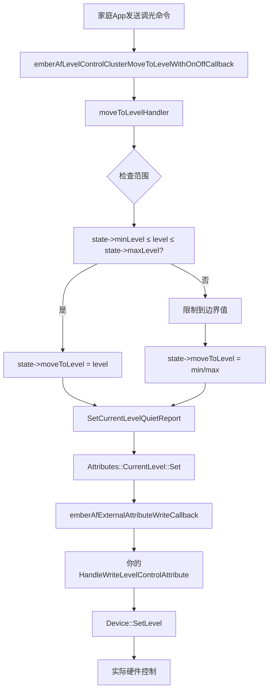
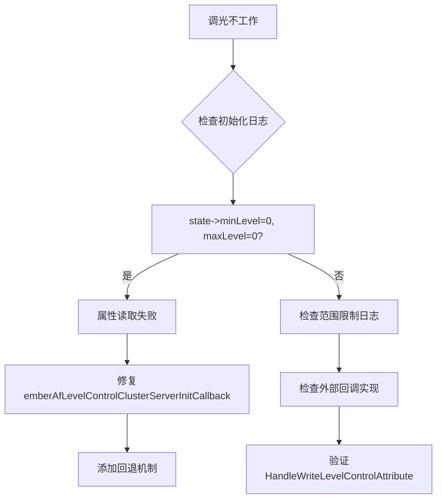

# Matter Level Control 集群详细分析

## 概述

Level Control 集群是 Matter 协议中用于控制设备亮度、音量等级别的核心集群。本文档详细分析了 `level-control.h` 和 `level-control.cpp` 两个文件中的关键函数和数据结构。

## 调光命令处理流程



## 问题诊断流程



## 核心数据结构

### 1. EmberAfLevelControlState

```cpp
struct EmberAfLevelControlState
{
    CommandId commandId;                    // 当前执行的命令ID
    uint8_t moveToLevel;                   // 目标级别
    bool increasing;                       // 是否正在增加
    uint8_t onLevel;                       // 开启时的级别
    uint8_t minLevel;                      // 最小级别 (关键!)
    uint8_t maxLevel;                      // 最大级别 (关键!)
    uint16_t storedLevel;                  // 存储的级别
    uint32_t eventDurationMs;              // 事件持续时间
    uint32_t transitionTimeMs;             // 过渡时间
    uint32_t elapsedTimeMs;                // 已过时间
    CallbackScheduleState callbackSchedule; // 回调调度状态
    QuieterReportingAttribute<uint8_t> quietCurrentLevel;    // 当前级别(安静报告)
    QuieterReportingAttribute<uint16_t> quietRemainingTime;  // 剩余时间(安静报告)
};
```

**关键字段说明**：
- `minLevel` 和 `maxLevel`：这两个字段控制着所有调光命令的有效范围
- `moveToLevel`：实际要移动到的目标级别，会被限制在 [minLevel, maxLevel] 范围内

### 2. CallbackScheduleState

```cpp
struct CallbackScheduleState
{
    System::Clock::Timestamp idealTimestamp;  // 理想的下次回调时间戳
    System::Clock::Milliseconds32 runTime;    // 上次回调的运行时间
};
```

## 核心函数分析

### 1. 集群初始化函数

#### `emberAfLevelControlClusterServerInitCallback(EndpointId endpoint)`

**功能**：初始化 Level Control 集群的状态

**关键逻辑**：
```cpp
// 1. 设置默认值
state->minLevel = MATTER_DM_PLUGIN_LEVEL_CONTROL_MINIMUM_LEVEL;
state->maxLevel = MATTER_DM_PLUGIN_LEVEL_CONTROL_MAXIMUM_LEVEL;

// 2. 尝试从属性读取实际值
Attributes::MinLevel::Get(endpoint, &state->minLevel);
Attributes::MaxLevel::Get(endpoint, &state->maxLevel);

// 3. 应用照明特性限制
if (LevelControlHasFeature(endpoint, Feature::kLighting)) {
    if (state->minLevel < LEVEL_CONTROL_LIGHTING_MIN_LEVEL) {
        state->minLevel = LEVEL_CONTROL_LIGHTING_MIN_LEVEL; // 0x01
    }
    if (state->maxLevel > LEVEL_CONTROL_LIGHTING_MAX_LEVEL) {
        state->maxLevel = LEVEL_CONTROL_LIGHTING_MAX_LEVEL; // 0xFE
    }
}
```

**问题分析**：如果 `Attributes::MinLevel::Get` 和 `Attributes::MaxLevel::Get` 失败，值会保持为默认的 0，导致调光功能异常。

### 2. 命令处理函数

#### `moveToLevelHandler(endpoint, commandId, level, ...)`

**功能**：处理移动到指定级别的命令

**关键的范围检查逻辑**：
```cpp
ChipLogProgress(Zcl, "moveToLevelHandler: level=%d, state->minLevel=%d, state->maxLevel=%d", 
                level, state->minLevel, state->maxLevel);

if (state->maxLevel <= level) {
    state->moveToLevel = state->maxLevel;  // 限制到最大值
    ChipLogProgress(Zcl, "moveToLevelHandler: Clamped to maxLevel %d", state->maxLevel);
} else if (level <= state->minLevel) {
    state->moveToLevel = state->minLevel;  // 限制到最小值
    ChipLogProgress(Zcl, "moveToLevelHandler: Clamped to minLevel %d", state->minLevel);
} else {
    state->moveToLevel = level;           // 使用目标值
    ChipLogProgress(Zcl, "moveToLevelHandler: Set to target level %d", level);
}
```

**问题根源**：当 `state->maxLevel = 0` 时，任何 `level > 0` 的命令都会被限制为 0。

#### `emberAfLevelControlClusterMoveToLevelWithOnOffCallback(...)`

**功能**：处理带开关控制的调光命令

**调用流程**：
```
家庭App发送命令 
    ↓
emberAfLevelControlClusterMoveToLevelWithOnOffCallback
    ↓
moveToLevelHandler (进行范围检查)
    ↓
SetCurrentLevelQuietReport (设置当前级别)
    ↓
外部属性写回调 (你的HandleWriteLevelControlAttribute)
```

### 3. 状态管理函数

#### `getState(EndpointId endpoint)`

**功能**：获取指定端点的 Level Control 状态

```cpp
static EmberAfLevelControlState * getState(EndpointId endpoint)
{
    uint16_t ep = emberAfGetClusterServerEndpointIndex(endpoint, LevelControl::Id, 
                                                      MATTER_DM_LEVEL_CONTROL_CLUSTER_SERVER_ENDPOINT_COUNT);
    return (ep >= kLevelControlStateTableSize ? nullptr : &stateTable[ep]);
}
```

#### `SetCurrentLevelQuietReport(endpoint, state, newValue, isEndOfTransition)`

**功能**：设置当前级别并触发报告

**关键逻辑**：
```cpp
// 设置属性值
Status status = Attributes::CurrentLevel::Set(endpoint, newValue);

// 触发外部回调
emberAfExternalAttributeWriteCallback(endpoint, LevelControl::Id, 
                                     &metadata, buffer);
```

## 问题诊断和解决方案

### 问题现象
从日志可以看到：
```
moveToLevelHandler: level=19, state->minLevel=0, state->maxLevel=0
moveToLevelHandler: Clamped to maxLevel 0
```

### 根本原因
1. `emberAfLevelControlClusterServerInitCallback` 中的属性读取失败
2. `state->minLevel` 和 `state->maxLevel` 保持默认值 0
3. 所有调光命令都被限制为 0

### 解决方案
在 `emberAfLevelControlClusterServerInitCallback` 中添加回退机制：

```cpp
// 如果属性读取失败，设置合理的默认值
if (state->minLevel == 0 && state->maxLevel == 0) {
    state->minLevel = 1;
    state->maxLevel = 254;
    ChipLogProgress(Zcl, "Level Control Init: Using fallback values minLevel=1, maxLevel=254");
}
```

## 常量定义

```cpp
#define MATTER_DM_PLUGIN_LEVEL_CONTROL_TICKS_PER_SECOND 32
#define LEVEL_CONTROL_LIGHTING_MIN_LEVEL 0x01
#define LEVEL_CONTROL_LIGHTING_MAX_LEVEL 0xFE
#define INVALID_STORED_LEVEL 0xFFFF
#define STARTUP_CURRENT_LEVEL_USE_DEVICE_MINIMUM 0x00
#define STARTUP_CURRENT_LEVEL_USE_PREVIOUS_LEVEL 0xFF
```

## 调试建议

1. **监控初始化日志**：确认 `minLevel` 和 `maxLevel` 是否正确设置
2. **检查属性读取**：验证 `Attributes::MinLevel::Get` 和 `Attributes::MaxLevel::Get` 的返回状态
3. **范围检查日志**：观察 `moveToLevelHandler` 中的范围限制逻辑
4. **外部回调**：确保 `emberAfExternalAttributeWriteCallback` 正确处理级别变化

## 其他重要函数

### 4. 命令回调函数

#### `emberAfLevelControlClusterMoveToLevelCallback(...)`
**功能**：处理不带开关控制的调光命令
**调用**：`LevelControlServer::MoveToLevel(endpointId, commandData)`

#### `emberAfLevelControlClusterMoveCallback(...)`
**功能**：处理连续移动命令（向上或向下移动）
**参数**：
- `moveMode`：移动方向（Up/Down）
- `rate`：移动速率

#### `emberAfLevelControlClusterStepCallback(...)`
**功能**：处理步进命令（按指定步长移动）
**参数**：
- `stepMode`：步进方向
- `stepSize`：步进大小
- `transitionTime`：过渡时间

#### `emberAfLevelControlClusterStopCallback(...)`
**功能**：停止当前的级别变化

### 5. 辅助函数

#### `shouldExecuteIfOff(endpoint, commandId, optionsMask, optionsOverride)`
**功能**：判断设备关闭时是否应该执行命令
**逻辑**：检查 Options 属性和命令参数来决定是否执行

#### `setOnOffValue(endpoint, onOff)`
**功能**：设置 On/Off 集群的状态
**集成**：与 On/Off 集群协同工作

#### `writeRemainingTime(endpoint, remainingTimeMs, isNewTransition)`
**功能**：更新剩余时间属性

### 6. 场景管理支持

#### `DefaultLevelControlSceneHandler`
**功能**：支持 Matter 场景功能
**方法**：
- `GetSupportedClusters()`：获取支持的集群
- `SerializeSave()`：序列化场景数据
- `ApplyScene()`：应用场景设置

## 属性访问模式

### 读取属性
```cpp
DataModel::Nullable<uint8_t> currentLevel;
Status status = Attributes::CurrentLevel::Get(endpoint, currentLevel);
```

### 写入属性
```cpp
Status status = Attributes::CurrentLevel::Set(endpoint, newValue);
```

### 外部属性回调
```cpp
emberAfExternalAttributeWriteCallback(endpoint, clusterId, attributeMetadata, buffer);
```

## 定时器和过渡管理

### 定时器回调
```cpp
static void timerCallback(System::Layer * layer, void * appState)
{
    EndpointId endpoint = static_cast<EndpointId>(reinterpret_cast<uintptr_t>(appState));
    emberAfLevelControlClusterServerTickCallback(endpoint);
}
```

### 过渡计算
- 根据当前级别和目标级别计算步长
- 考虑过渡时间和更新频率
- 处理增加和减少两个方向

## 错误处理

### 常见错误状态
- `Status::Failure`：一般失败
- `Status::InvalidCommand`：无效命令
- `Status::UnsupportedAttribute`：不支持的属性

### 调试日志
```cpp
ChipLogProgress(Zcl, "moveToLevelHandler: level=%d, state->minLevel=%d, state->maxLevel=%d",
                level, state->minLevel, state->maxLevel);
```

## 与其他集群的集成

### On/Off 集群
- 自动同步开关状态
- 支持 `MoveToLevelWithOnOff` 命令

### Color Control 集群
- 支持色温耦合
- `updateCoupledColorTemp()` 函数

### Scenes 集群
- 保存和恢复级别状态
- 支持场景过渡

## 配置选项

### 编译时配置
```cpp
#define MATTER_DM_PLUGIN_LEVEL_CONTROL_RATE 32
#define MATTER_DM_PLUGIN_LEVEL_CONTROL_TICKS_PER_SECOND 32
#define IGNORE_LEVEL_CONTROL_CLUSTER_START_UP_CURRENT_LEVEL
#define IGNORE_LEVEL_CONTROL_CLUSTER_OPTIONS
```

### 特性支持
- `Feature::kLighting`：照明特性
- `Feature::kFrequency`：频率控制

## 总结

Level Control 集群是一个复杂的状态机，涉及：
1. **状态管理**：维护每个端点的级别状态
2. **命令处理**：支持多种调光命令
3. **范围控制**：确保级别在有效范围内
4. **过渡管理**：平滑的级别变化
5. **集群集成**：与 On/Off、Color Control 等集群协同

核心问题在于初始化时的 `minLevel` 和 `maxLevel` 设置，这直接影响所有调光命令的处理结果。

## API 参考表

### 主要回调函数

| 函数名 | 功能 | 参数 | 返回值 |
|--------|------|------|--------|
| `emberAfLevelControlClusterServerInitCallback` | 集群初始化 | `EndpointId endpoint` | `void` |
| `emberAfLevelControlClusterMoveToLevelCallback` | 调光到指定级别 | `CommandHandler*, ConcreteCommandPath, Commands::MoveToLevel::DecodableType` | `bool` |
| `emberAfLevelControlClusterMoveToLevelWithOnOffCallback` | 调光到指定级别(带开关) | `CommandHandler*, ConcreteCommandPath, Commands::MoveToLevelWithOnOff::DecodableType` | `bool` |
| `emberAfLevelControlClusterMoveCallback` | 连续移动 | `CommandHandler*, ConcreteCommandPath, Commands::Move::DecodableType` | `bool` |
| `emberAfLevelControlClusterStepCallback` | 步进移动 | `CommandHandler*, ConcreteCommandPath, Commands::Step::DecodableType` | `bool` |
| `emberAfLevelControlClusterStopCallback` | 停止移动 | `CommandHandler*, ConcreteCommandPath, Commands::Stop::DecodableType` | `bool` |

### 内部函数

| 函数名 | 功能 | 访问级别 | 关键作用 |
|--------|------|----------|----------|
| `getState(EndpointId)` | 获取端点状态 | `static` | 状态管理 |
| `moveToLevelHandler(...)` | 核心调光处理 | `static` | 范围检查和执行 |
| `SetCurrentLevelQuietReport(...)` | 设置当前级别 | `static` | 属性更新 |
| `shouldExecuteIfOff(...)` | 检查关闭时执行 | `static` | 条件判断 |
| `setOnOffValue(...)` | 设置开关状态 | `static` | 集群协同 |

### 属性访问函数

| 属性 | 读取函数 | 写入函数 | 数据类型 |
|------|----------|----------|----------|
| CurrentLevel | `Attributes::CurrentLevel::Get()` | `Attributes::CurrentLevel::Set()` | `Nullable<uint8_t>` |
| MinLevel | `Attributes::MinLevel::Get()` | - | `uint8_t` |
| MaxLevel | `Attributes::MaxLevel::Get()` | - | `uint8_t` |
| RemainingTime | `Attributes::RemainingTime::Get()` | `Attributes::RemainingTime::Set()` | `uint16_t` |
| OnLevel | `Attributes::OnLevel::Get()` | `Attributes::OnLevel::Set()` | `Nullable<uint8_t>` |

### 错误码

| 状态码 | 含义 | 触发条件 |
|--------|------|----------|
| `Status::Success` | 成功 | 正常执行 |
| `Status::Failure` | 失败 | 一般错误 |
| `Status::InvalidCommand` | 无效命令 | 参数超出范围 |
| `Status::UnsupportedAttribute` | 不支持的属性 | 属性不存在 |

## 调试检查清单

### 初始化阶段
- [ ] 检查 `emberAfLevelControlClusterServerInitCallback` 是否被调用
- [ ] 验证 `state->minLevel` 和 `state->maxLevel` 的值
- [ ] 确认 `Attributes::MinLevel::Get()` 和 `Attributes::MaxLevel::Get()` 的返回状态

### 命令处理阶段
- [ ] 监控 `moveToLevelHandler` 的日志输出
- [ ] 检查范围限制逻辑是否正确执行
- [ ] 验证 `state->moveToLevel` 的最终值

### 属性更新阶段
- [ ] 确认 `SetCurrentLevelQuietReport` 被调用
- [ ] 检查 `emberAfExternalAttributeWriteCallback` 的执行
- [ ] 验证外部设备状态是否正确更新

### 集群协同阶段
- [ ] 检查 On/Off 集群状态同步
- [ ] 验证场景功能是否正常
- [ ] 确认报告机制工作正常

## 性能优化建议

1. **减少不必要的属性读取**：缓存 MinLevel 和 MaxLevel 值
2. **优化过渡计算**：使用更高效的数学运算
3. **合并属性更新**：批量处理多个属性变化
4. **智能报告**：使用 QuieterReporting 减少网络流量

## 兼容性注意事项

1. **Matter 版本兼容性**：不同版本的属性定义可能有差异
2. **设备特性支持**：检查设备是否支持特定特性
3. **集群依赖**：确保依赖的集群（如 On/Off）正确配置
4. **平台差异**：不同平台的定时器实现可能不同
